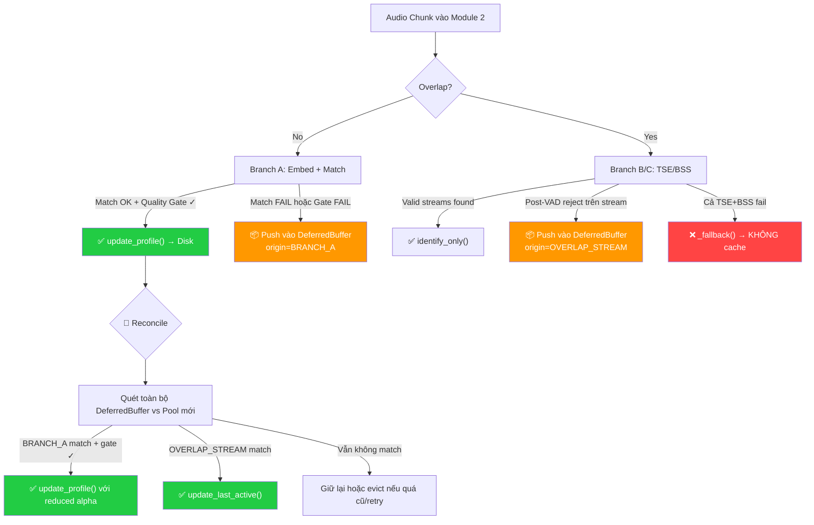

# Phương Án: Deferred Segment Recycling (DSR) — Bản Chính Thức

---

## 1. Tổng quan

### Mục tiêu
Tái sử dụng các phân đoạn âm thanh bị gán nhãn **UNKNOWN** (Branch A và Overlap streams) thông qua cơ chế buffer in-memory. Khi VoiceprintPool được cập nhật thành công, hệ thống tự động quét lại buffer để match các segment cũ với trạng thái pool mới nhất.

### Quyết định thiết kế đã thống nhất

| Câu hỏi | Quyết định |
|----------|-----------|
| Reconcile trigger | **Sau mỗi `update_profile()` thành công** (reactive) |
| FALLBACK_MIX | **Bỏ** — không cache mix audio từ unresolved_overlap |
| Crash recovery | **Không cần** — in-memory only, mất khi restart |
| Auto-clustering | **Không làm** — chỉ reconcile |
| Kiểm soát EMA compounding | **Giảm trọng số** (reduced alpha), không cap số lần |

### Scope: Chỉ cache 2 loại segment

| Origin | Mô tả | Reconcile action |
|--------|--------|-----------------|
| `BRANCH_A` | Chunk đơn speaker, không match hoặc không qua Quality Gate | `update_profile()` với reduced alpha |
| `OVERLAP_STREAM` | Stream tách từ TSE/BSS bị Post-VAD reject | `update_last_active()` only |

> [!IMPORTANT]
> `FALLBACK_MIX` (unresolved_overlap) bị **loại khỏi scope** vì mix audio chứa ≥2 speaker → embedding không đáng tin cậy, cache lại chỉ tốn RAM mà không recover được.

---

## 2. Kiến trúc

### 2.1 Flow tổng quan



### 2.2 File structure mới

```
sd-module/
├── state/
│   ├── voiceprint_pool.py          # (Existing — không sửa)
│   └── deferred_segment_buffer.py  # ← NEW
├── pipeline/
│   └── speaker_diarization.py      # ← SỬA: thêm push + reconcile logic
├── config/
│   ├── di_container.py             # ← SỬA: khởi tạo DeferredSegmentBuffer
│   └── settings.yaml               # ← SỬA: thêm config section
```

---

## 3. Chi tiết component mới: `DeferredSegmentBuffer`

### 3.1 Data structure

```python
@dataclass
class DeferredSegment:
    embedding: np.ndarray      # 512-dim CAM++ embedding (đã trích xuất)
    audio: np.ndarray          # Clean audio (đã qua denoiser)
    t_d: float                 # Speech duration (từ VAD)
    t_c: float                 # VAD confidence
    origin: str                # "BRANCH_A" | "OVERLAP_STREAM"
    created_at: float          # time.time() lúc push
    retry_count: int = 0       # Số lần đã thử reconcile
```

### 3.2 Class API

```python
class DeferredSegmentBuffer:
    def __init__(self, config: dict):
        cfg = config.get("module2_diarization", {}).get("deferred_buffer", {})
        self.max_segments: int       # Capacity tối đa
        self.max_age_seconds: float  # TTL mỗi segment
        self.max_retries: int        # Số lần reconcile tối đa
        self.segments: list[DeferredSegment] = []
    
    def push(self, embedding, audio, t_d, t_c, origin) -> None
    def get_valid_segments(self) -> list[DeferredSegment]   # Lọc bỏ expired
    def remove(self, segment: DeferredSegment) -> None      # Xóa 1 segment đã reconcile
    def reset(self) -> None                                  # Clear toàn bộ (new session)
    def get_stats(self) -> dict                              # Debug info
```

### 3.3 Eviction policy

```python
def push(self, ...):
    # 1. Evict expired segments (age > max_age_seconds)
    self._evict_expired()
    
    # 2. Evict over-retried segments (retry_count >= max_retries)
    self._evict_over_retried()
    
    # 3. If still full → FIFO (xóa cũ nhất)
    while len(self.segments) >= self.max_segments:
        self.segments.pop(0)
    
    # 4. Push new segment
    self.segments.append(DeferredSegment(...))
```

### 3.4 RAM estimation

| Component | Size per segment | 50 segments |
|-----------|-----------------|-------------|
| Embedding (512 float32) | 2,048 bytes | 100 KB |
| Audio (~2.5s × 16kHz × float32) | ~160 KB | ~8 MB |
| Metadata | ~100 bytes | ~5 KB |
| **Total** | **~162 KB** | **~8 MB** |

---

## 4. Logic thay đổi trong `speaker_diarization.py`

### 4.1 Constructor — Inject DeferredBuffer

```python
class SpeakerDiarization:
    def __init__(self, ovd, embedder, tse, bss, pool, config, vad=None, deferred_buffer=None):
        # ... existing code ...
        self.deferred_buffer = deferred_buffer
        
        # Reconcile config
        cfg_reconcile = config_module2.get("deferred_buffer", {}).get("reconcile_gate", {})
        self.reconcile_alpha_factor = cfg_reconcile.get("alpha_factor", 0.5)  # Giảm alpha 50%
```

### 4.2 Branch A — Capture UNKNOWN segments

Hiện tại ([speaker_diarization.py:L88-107](file:///d:/AIP/target_diarization/full_final_pipeline_demo/backend/sd-module/pipeline/speaker_diarization.py#L88-L107)):

```diff
 # NO OVERLAP -> BRANCH A
 if not has_overlap:
     result["branch"] = "BRANCH_A"
     emb = self.embedder.extract(clean_audio)
     id_1, score_1, _, _ = self.pool.find_best_match(emb)
     matched_id = id_1 if (id_1 and score_1 > self.matching_threshold) else None

     pool_cfg = self.config_branch_a.get("pool_update", {})
     if t_d > pool_cfg.get("theta_dur", 0.8) and t_c > pool_cfg.get("theta_conf", 0.75):
         matched_id = self.pool.update_profile(
             emb, current_time, speaker_id=matched_id, confidence=t_c, reference_audio=clean_audio
         )
+        # Trigger reconcile sau update thành công
+        if self.deferred_buffer:
+            self._try_reconcile()
+    else:
+        # Không qua Quality Gate → cache segment
+        if self.deferred_buffer:
+            self.deferred_buffer.push(emb, clean_audio, t_d, t_c, "BRANCH_A")

     spk_name = matched_id if matched_id else "UNKNOWN"
+    # Cache UNKNOWN do không match (nhưng đã qua Quality Gate)
+    if spk_name == "UNKNOWN" and self.deferred_buffer:
+        self.deferred_buffer.push(emb, clean_audio, t_d, t_c, "BRANCH_A")
     # ... rest unchanged
```

### 4.3 Overlap Branch — Capture Post-VAD rejected streams

Hiện tại ([speaker_diarization.py:L137-148](file:///d:/AIP/target_diarization/full_final_pipeline_demo/backend/sd-module/pipeline/speaker_diarization.py#L137-L148)):

```diff
 for idx, stream in enumerate(raw_streams):
     # ... energy check, post-vad ...
     clean_stream, is_valid, t_d, t_c = self._apply_post_vad(stream)
     
     s_dur = float(len(clean_stream) / sr)
     if is_valid:
         valid_found = True
         spk_id = self._identify_only(clean_stream, current_time)
     else:
         spk_id = "UNKNOWN"
+        # Cache rejected overlap stream
+        if self.deferred_buffer and len(clean_stream) > 0:
+            ovl_emb = self.embedder.extract(clean_stream)
+            self.deferred_buffer.push(ovl_emb, clean_stream, t_d, t_c, "OVERLAP_STREAM")
```

### 4.4 Reconcile method (MỚI)

```python
def _try_reconcile(self):
    """Quét DeferredBuffer, match lại với pool state mới nhất."""
    if not self.deferred_buffer:
        return
    
    segments = self.deferred_buffer.get_valid_segments()
    if not segments:
        return
    
    reconciled = 0
    current_time = time.time()
    
    for seg in segments:
        seg.retry_count += 1
        id_1, score_1, _, _ = self.pool.find_best_match(seg.embedding)
        
        if not id_1 or score_1 <= self.matching_threshold:
            continue  # Vẫn không match → giữ lại trong buffer
        
        if seg.origin == "BRANCH_A":
            # Đủ match → update profile với REDUCED alpha
            cfg = self.config.get("module2_diarization", {}).get("deferred_buffer", {})
            gate = cfg.get("reconcile_gate", {})
            r_theta_dur = gate.get("theta_dur", 0.6)
            r_theta_conf = gate.get("theta_conf", 0.65)
            
            if seg.t_d > r_theta_dur and seg.t_c > r_theta_conf:
                self.pool.update_profile(
                    seg.embedding, current_time,
                    speaker_id=id_1,
                    confidence=seg.t_c,
                    reference_audio=seg.audio,
                    alpha_factor=self.reconcile_alpha_factor  # ← reduced alpha
                )
                self.deferred_buffer.remove(seg)
                reconciled += 1
            # Nếu không qua reconcile gate → giữ lại, thử lần sau
                
        elif seg.origin == "OVERLAP_STREAM":
            # Overlap stream → chỉ update last_active, KHÔNG EMA update
            self.pool.update_last_active(id_1, current_time)
            self.deferred_buffer.remove(seg)
            reconciled += 1
    
    if reconciled > 0:
        logger.info(f"[DSR] Reconciled {reconciled}/{len(segments)} deferred segments")
```

### 4.5 Thay đổi nhỏ trong `VoiceprintPool.update_profile()`

Thêm parameter `alpha_factor` để hỗ trợ reduced alpha cho reconcile:

```diff
 def update_profile(self, embedding, last_active_time, speaker_id=None,
-                   confidence=1.0, reference_audio=None) -> str:
+                   confidence=1.0, reference_audio=None, alpha_factor=1.0) -> str:
     # ... existing new profile logic unchanged ...
     
     else:
         old_emb = self.profiles[speaker_id]["embedding"]
-        dynamic_alpha = min(self.base_alpha, self.base_alpha * confidence)
+        effective_alpha = self.base_alpha * alpha_factor  # alpha_factor < 1.0 cho reconcile
+        dynamic_alpha = min(effective_alpha, effective_alpha * confidence)
         new_emb = dynamic_alpha * embedding + (1 - dynamic_alpha) * old_emb
         # ... rest unchanged
```

Ảnh hưởng EMA với `alpha_factor=0.5`:
- Real-time: `alpha = 0.1` (giữ nguyên)
- Reconcile: `alpha = 0.05` → mỗi deferred segment đóng góp tối đa 5% vào embedding

### 4.6 Reset session

```diff
 # speaker_diarization.py
 def reset_session(self):
     if hasattr(self.ovd, 'reset'):
         self.ovd.reset()
+    if self.deferred_buffer:
+        self.deferred_buffer.reset()
     logger.info("[Diarization] Session state reset successful.")
```

---

## 5. Cấu hình YAML

```yaml
# Thêm vào settings.yaml, trong section module2_diarization:

module2_diarization:
  # ... existing config giữ nguyên ...

  deferred_buffer:
    enabled: true
    max_segments: 50              # Giới hạn RAM (~8MB max)
    max_age_seconds: 120          # Segment quá 2 phút → evict
    max_retries: 5                # Tối đa 5 lần reconcile trước khi evict
    
    reconcile_gate:
      theta_dur: 0.6              # Nới lỏng hơn real-time (0.8)
      theta_conf: 0.65            # Nới lỏng hơn real-time (0.75)
      alpha_factor: 0.5           # Giảm trọng số EMA xuống 50%
```

---

## 6. Thay đổi trong DI Container

```diff
 # di_container.py
+from state.deferred_segment_buffer import DeferredSegmentBuffer

 class DIContainer:
     def __init__(self, config_path=None):
         # ... existing model loading ...
         
         # --- Initialize State & Orchestration ---
         self.pool = VoiceprintPool(self.config)
+        self.deferred_buffer = DeferredSegmentBuffer(self.config)
         self.module1 = AudioPreprocessing(self.denoiser, self.vad, self.config)
         self.module2 = SpeakerDiarization(
             self.ovd, self.embedder,
             self.tse, self.bss, self.pool, self.config,
-            vad=self.vad
+            vad=self.vad,
+            deferred_buffer=self.deferred_buffer
         )

     def reset_session(self):
         self.pool.reset()
+        self.deferred_buffer.reset()
         self.module1.reset_session()
         self.module2.reset_session()
```

---

## 7. Ví dụ minh họa End-to-End

```
Meeting bắt đầu — Pool rỗng
━━━━━━━━━━━━━━━━━━━━━━━━━━━━━━━━━━━━━━━━━━━━

t=0s  Chunk 1 (Speaker A, 0.6s):
      → Branch A → emb_1, score=0.0 (pool rỗng) → UNKNOWN
      → Quality Gate: t_d=0.6 < 0.8 → FAIL
      → Push DeferredBuffer: {emb_1, audio_1, origin=BRANCH_A}
      → Buffer: [seg_1]

t=2s  Chunk 2 (Speaker A, 1.2s):
      → Branch A → emb_2, score=0.0 (pool rỗng) → matched_id=None
      → Quality Gate: t_d=1.2 > 0.8, t_c=0.85 > 0.75 → PASS
      → update_profile(emb_2, matched_id=None) → Tạo SPK_001
      → 🔄 Reconcile triggered:
         seg_1: find_best_match(emb_1) → SPK_001, score=0.73 > 0.5 ✓
                origin=BRANCH_A, t_d=0.6 > 0.6 ✓, t_c=0.7 > 0.65 ✓
                → update_profile(SPK_001, alpha_factor=0.5) ✅
                → Remove seg_1 from buffer
      → Buffer: [] (empty)
      → Log: "[DSR] Reconciled 1/1 deferred segments"

t=5s  Chunk 3 (Speaker A + B overlap):
      → OVD detects overlap → Branch B/C
      → BSS tách 2 streams:
        Stream 0: Post-VAD valid → identify_only() → SPK_001
        Stream 1: Post-VAD invalid (t_d=0.2s) → UNKNOWN
                  → Push DeferredBuffer: {emb_s1, audio_s1, origin=OVERLAP_STREAM}
      → Buffer: [seg_ovl]

t=7s  Chunk 4 (Speaker B, 1.5s):
      → Branch A → emb_4, score=0.35 (dưới 0.5) → matched_id=None
      → Quality Gate: PASS
      → update_profile(emb_4, None) → Tạo SPK_002
      → 🔄 Reconcile triggered:
         seg_ovl: find_best_match(emb_s1) → SPK_002, score=0.61 > 0.5 ✓
                  origin=OVERLAP_STREAM → update_last_active(SPK_002) ✅
                  → Remove seg_ovl
      → Buffer: [] (empty)
```

---

## 8. Phân chia công việc

### Phase 1 — Core (Ước lượng: 2-3 ngày)
- [ ] Tạo `state/deferred_segment_buffer.py` (class + push/get/remove/reset/evict)
- [ ] Sửa `pipeline/speaker_diarization.py`:
  - Inject `deferred_buffer` vào constructor
  - Capture BRANCH_A UNKNOWN + Quality Gate fail
  - Thêm `_try_reconcile()` method
  - Trigger reconcile sau `update_profile()` thành công
- [ ] Sửa `state/voiceprint_pool.py`: thêm `alpha_factor` parameter vào `update_profile()`
- [ ] Sửa `config/di_container.py`: khởi tạo + inject + reset
- [ ] Sửa `config/settings.yaml`: thêm `deferred_buffer` section

### Phase 2 — Overlap + Polish (Ước lượng: 1-2 ngày)
- [ ] Capture OVERLAP_STREAM segments (trong overlap branch loop)
- [ ] Integration test với audio thực (verify reconcile hoạt động đúng)
- [ ] Thêm logging chi tiết cho debug
- [ ] (Optional) Endpoint `/api/v1/deferred-stats` để monitor buffer state
