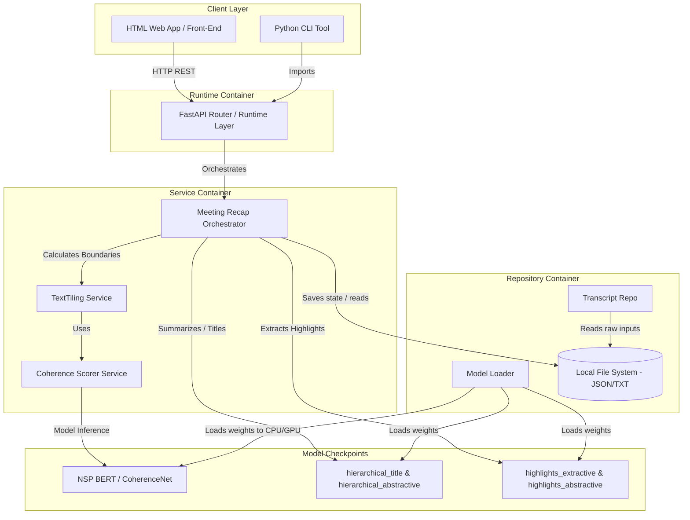
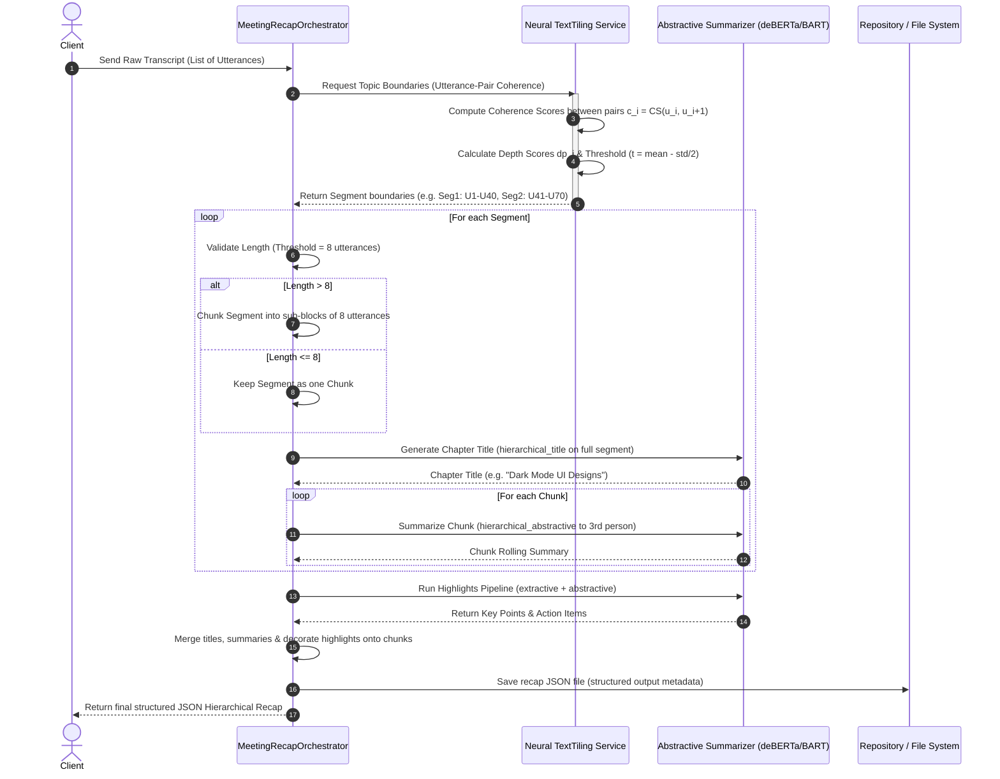

# Đặc Tả Kiến Trúc Hệ Thống: LLM-Powered Hierarchical Meeting Recap System

*(System Architecture Specification for AI & Human Consumability)*

Tài liệu này đặc tả chi tiết kiến trúc, cấu trúc dữ liệu, giao tiếp API và mô hình hoạt động của **Hệ thống tóm tắt họp phân cấp sử dụng Neural TextTiling**. Tài liệu được cấu trúc hóa giúp các mô hình AI (LLM, Code Gen, AI Agent) có thể dễ dàng phân tích, hiểu đúng đắn và sinh mã nguồn chính xác.

---

## 1. Bối Cảnh Nghiệp Vụ & Mục Tiêu (Business Context & Goals)

Họp trực tuyến và làm việc từ xa ngày càng phổ biến, dẫn đến quá tải thông tin và nhu cầu cao về các biên bản cuộc họp hiệu quả. **Hierarchical Meeting Recap System** giải quyết vấn đề này bằng cách:

* **Chia nhỏ chủ đề tự động (Unsupervised Dialogue Topic Segmentation):** Sử dụng thuật toán Neural TextTiling (được huấn luyện dựa trên tác vụ Coherence Scoring của cặp câu thoại qua mô hình NSP BERT/CoherenceNet) để chia nhỏ một bản ghi hội thoại tuyến tính dài thành các đoạn chủ đề riêng biệt (Chapters).
* **Tóm tắt phân cấp (Hierarchical Recap):** Sinh ra tiêu đề chương ngắn gọn, tóm tắt chi tiết các khối 8 câu thoại (Chunks) dưới dạng kể ở ngôi thứ ba, và trích xuất song song các điểm chính (Key-Points/Notes) cũng như hành động cần làm (Action Items/Tasks).
* **Hỗ trợ tương tác:** Cho phép người dùng chỉnh sửa tiêu đề chương, đánh dấu sao điểm chính và hộp kiểm hành động trực quan để cải thiện độ chính xác và cá nhân hóa.

---

## 2. Công Nghệ Sử Dụng (Tech Stack)

Hệ thống tích hợp hai bài báo nghiên cứu nền tảng (xem chi tiết tích hợp tại [paper-integration.md](paper-integration.md)):

- **Topic Segmentation Engine:** *Improving Unsupervised Dialogue Topic Segmentation with Utterance-Pair Coherence Scoring* — [`docs/papers/improving-unsupervised-dialogue-topic-segmentation.md`](../papers/improving-unsupervised-dialogue-topic-segmentation.md)
- **Hierarchical Recap Blueprint:** *Summaries, Highlights, and Action Items: Design, Implementation and Evaluation of an LLM-powered Meeting Recap System* — [`docs/papers/llm-powered-meeting-recap-system.md`](../papers/llm-powered-meeting-recap-system.md)

Hệ thống được phát triển tuân thủ nghiêm ngặt mô hình kiến trúc phân lớp:

$$
\text{Types} \rightarrow \text{Config} \rightarrow \text{Repo} \rightarrow \text{Service} \rightarrow \text{Runtime} \rightarrow \text{UI}
$$

* **Ngôn ngữ chính:** Python 3.10+
* **Thư viện Học máy:** PyTorch, Hugging Face Transformers (mô hình deBERTa, BART)
* **Lưu trữ dữ liệu:** Tệp tin cục bộ (Local JSON / TXT Transcripts)
* **Giao tiếp Service:** RESTful API (FastAPI)
* **Đóng gói hệ thống:** Docker, uv package manager

---

## 3. Kiến Trúc Dưới Dạng Code (Architecture as Code)

### 3.1 Sơ đồ lớp & luồng xử lý phân tầng (C4 Level 2 - Container Diagram)

Mô tả cách các Container giao tiếp nội bộ và tuân thủ các quy tắc phụ thuộc.



### 3.2 Sơ đồ Luồng Dữ Liệu Chi Tiết (Data Flow Diagram)

Mô tả quá trình biến đổi của dữ liệu từ một bản ghi thô thành cấu trúc tóm tắt phân cấp hoàn chỉnh.



---

## 4. Thiết Kế API Giao Tiếp (API Contracts)

Các Endpoint RESTful API tương tác được mô tả chi tiết bằng định dạng OpenAPI v3 (YAML) tại [openapi-spec.yaml](file:///home/quangnhvn34/dev/me/AIP491/tools/15-Meeting-summary/docs/generated/openapi-spec.yaml).

### Tóm tắt các Endpoints chính:

| HTTP Method      | Route Path                                                  | Mục tiêu xử lý                               | Tham số / Payload chính                                              |
| :--------------- | :---------------------------------------------------------- | :----------------------------------------------- | :--------------------------------------------------------------------- |
| **POST**   | `/api/v1/meetings/process`                                | Tiếp nhận và xử lý tóm tắt transcript     | `TranscriptIngestionRequest`, query `async=true/false`             |
| **GET**    | `/api/v1/meetings/{meeting_id}`                           | Kiểm tra trạng thái xử lý cuộc họp        | Path:`meeting_id`                                                    |
| **GET**    | `/api/v1/meetings/{meeting_id}/recap`                     | Lấy dữ liệu tóm tắt phân cấp hoàn chỉnh | Path:`meeting_id`                                                    |
| **PUT**    | `/api/v1/meetings/{meeting_id}/segments/{segment_id}`     | Cập nhật/Sửa tiêu đề chương              | Path:`meeting_id`, `segment_id` \| Body: `{ "title": "string" }` |
| **POST**   | `/api/v1/meetings/{meeting_id}/highlights`                | Thêm ghi chú/Hành động thủ công           | `HighlightUpsertRequest`                                             |
| **DELETE** | `/api/v1/meetings/{meeting_id}/highlights/{highlight_id}` | Xóa điểm nổi bật (Note / Task)              | Path:`meeting_id`, `highlight_id`                                  |

---

## 5. Giới Hạn Hệ Thống & Yêu Cầu Phi Chức Năng (Constraints & NFRs)

### Giới Hạn Hệ Thống (System Constraints)

* **Context Window Limit:** Các mô hình abstractive (như deBERTa/BART) có giới hạn đầu vào nghiêm ngặt là **512 tokens**. Do đó, các đoạn hội thoại bắt buộc phải được chia nhỏ thành các Chunk nhỏ hơn hoặc bằng 8 câu thoại (khoảng 106 tokens ngữ cảnh xung quanh) trước khi gửi đi tóm tắt.
* **Sliding Window Constraints:** Độ dài tối đa của một cuộc hội thoại đầu vào khuyến nghị là **5000 câu thoại** để đảm bảo thời gian chạy của thuật toán TextTiling không vượt quá giới hạn hàng đợi xử lý trực tiếp (3 phút). Các cuộc họp dài hơn phải được xử lý bất đồng bộ (Asynchronous Processing).
* **Vòng đời Model Checkpoints:** Hệ thống sử dụng checkpoints cục bộ để suy luận (inference) offline, yêu cầu phần cứng tối thiểu là **8GB VRAM (GPU)** hoặc RAM hệ thống **16GB** để nạp đồng thời cả 5 checkpoints mô hình học máy.

### Yêu Cầu Phi Chức Năng (Non-functional Requirements)

* **Tính toàn vẹn ngữ cảnh (Context Integrity):** Việc chia tách câu thoại thành các Chunk 8 câu không được phá vỡ tính liên kết ngữ cảnh nội dung (Semantic Cohesion). Đầu ra tóm tắt phải được viết lại ở ngôi thứ ba (Third-person representation) để đảm bảo biên bản cuộc họp mang tính khách quan và độc lập.
* **Khả năng bảo mật dữ liệu (Security & Privacy):**
  * Hệ thống không được phép gửi dữ liệu transcript cuộc họp ra bên ngoài máy chủ nếu không có cơ chế mã hóa.
  * Không lưu trữ trực tiếp API Keys hay Secrets trong mã nguồn (quản lý qua `.env` thông qua thư viện python-dotenv).
* **Tính tin cậy & khả năng khôi phục (Reliability):** Trạng thái xử lý cuộc họp và kết quả tóm tắt được đồng bộ trực tiếp vào các tệp tin cấu trúc JSON. Nếu xảy ra lỗi hoặc sập máy chủ giữa chừng, hệ thống có khả năng khôi phục và tiếp tục chạy lại các tiến trình từ tệp tin lưu tạm trên đĩa.

---

## 6. Types Layer Schema (model-001 — implemented 2026-07-04)

The Types layer uses Pydantic v2 `BaseModel` through a shared `BaseSchema`
(`src/types/_base.py`) with `extra="forbid"`, `populate_by_name=True`,
`str_strip_whitespace=True`. Every model below has a passing unit test
(`tests/unit/test_types.py`, 38/38) and a real round-trip on the first
Vietnamese committee meeting (`tests/manual/test_meeting_committee_sample.py`).

### 6.1 Class graph

```
BaseSchema (pydantic.BaseModel)
  +-- Utterance                       (frozen)
  +-- DialogueTranscript              MAX_UTTERANCES: ClassVar[int] = 5000
  |     +-- utterances: list[Utterance]
  +-- Chunk                           MAX_CHUNK_SIZE: ClassVar[int] = 8
  |     +-- utterances: list[Utterance]
  |     +-- rolling_summary: Optional[str]
  +-- SegmentResult
  |     +-- chunks: list[Chunk]
  |     +-- title: str
  |     +-- user_title_override: Optional[str]
  |     +-- utterances_start: int   (>= 0)
  |     +-- utterances_end: int     (>= 0)
  +-- HighlightType                   str-Enum: KEY_POINT, ACTION_ITEM
  +-- HighlightSource                 str-Enum: AUTO, MANUAL
  +-- Highlight                       toggle_star(), toggle_check()
  +-- MeetingStatus                   str-Enum: QUEUED, PROCESSING, COMPLETED, FAILED
  +-- HierarchicalRecap
  |     +-- meeting_id: UUID
  |     +-- segments: list[SegmentResult]
  |     +-- highlights_notes: list[Highlight]
  |     +-- highlights_tasks: list[Highlight]
  +-- TranscriptIngestionRequest      has model_validator + materialize()
  +-- HighlightUpsertRequest
  +-- MeetingProcessResponse
```

### 6.2 Enforced constraints

| Constraint | Enforced where |
|------------|----------------|
| `Utterance` is immutable | `model_config = BaseSchema.model_config | {"frozen": True}` |
| `speaker` / `text` non-empty | `Field(min_length=1)` |
| `index >= 0` | `Field(ge=0)` |
| `Chunk.utterances` length `<= 8` | `_check_chunk_size` model_validator |
| `DialogueTranscript.utterances` length `<= 5000` | `_validate_transcript` model_validator |
| `DialogueTranscript.utterances` indices contiguous 0..N-1 | `_validate_transcript` model_validator |
| `TranscriptIngestionRequest` has exactly one of `utterances`/`flat_texts` | `_validate_payload` model_validator |
| `flat_texts` of any size re-checked against `MAX_UTTERANCES` at the boundary | `materialize()` |
| All models reject unknown JSON keys | `BaseSchema` `extra="forbid"` |
| Highlight JSON wire format is canonical | `HighlightType` enum values are the canonical strings |

### 6.3 Layer rule

`src/types/*.py` (excluding `__init__.py`) has zero imports from `config`,
`repo`, `service`, or `runtime`. This is verified by an AST scan inside
`tests/manual/test_meeting_committee_sample.py`. Any new module added under
`src/types/` that breaks the rule should fail code review.
