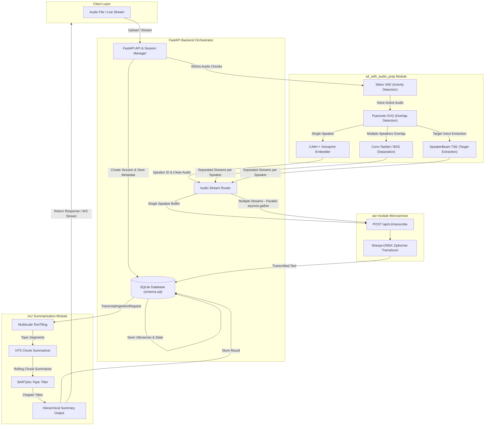

# System Integration & Architecture Plan

## Executive Summary

Document defines the system architecture and integration plan for connecting three AI modules into a single **FastAPI Processing Pipeline**:

1. **`sd-module/`** (Diarization Pipeline): VAD, Blind Source Separation (Conv-TasNet), Target Speech Extraction (SpeakerBeam), and Voiceprint Identification (CAM++).
2. **`asr-module/`** (Speech-to-Text): Sherpa-ONNX Zipformer ASR.
3. **`llms-module/`** (LLM Summarization & Topic Segmentation Service): Multiscale TextTiling topic segmentation + ViT5 chunk summarizer + BARTpho topic titler.

---

## 1. Current Module Status Analysis

| Module Path | Status | Components | Input | Output |
| :--- | :--- | :--- | :--- | :--- |
| **`sd-module/`** | Clean Architecture CLI | Silero VAD (Activity); Conv-TasNet / BSS (Separation); SpeakerBeam TSE (Extraction); CAM++ (Voiceprint Matching) | Audio File (`.wav`, `.mp3`) or 500ms Audio Chunks (`np.ndarray` @ 16kHz) | Dict: `speakers` (List[str]), `audio_streams` (List[np.ndarray]), `has_overlap` (bool), `branch` |
| **`asr-module/`** | FastAPI Service | Sherpa-ONNX Zipformer Transducer engine | `POST /api/v1/transcribe` (`UploadFile` audio buffer) | `TranscribeResponse(text, duration_seconds, status)` |
| **`llms-module/`** | FastAPI Service | Multiscale TextTiling; ViT5 Chunk Summarizer; BARTpho Topic Titler | `TranscriptIngestionRequest(meeting_title, language, utterances)` | `HierarchicalSummary(meeting_id, segments, generated_at, processing_time_ms)` |

---

## 2. System Architecture



---

## 3. Database Schema

Single SQLite database to store session metadata, process lifecycle, transcribed utterances, and final summary outputs.

```sql
-- Session Metadata & Execution State
CREATE TABLE sessions (
    session_id TEXT PRIMARY KEY,
    title TEXT,
    audio_source TEXT,
    status TEXT CHECK(status IN ('created', 'diarizing', 'transcribing', 'summarizing', 'completed', 'failed')) DEFAULT 'created',
    progress_percentage REAL DEFAULT 0.0,
    error_message TEXT,
    created_at TIMESTAMP DEFAULT CURRENT_TIMESTAMP,
    updated_at TIMESTAMP DEFAULT CURRENT_TIMESTAMP
);

-- Transcribed Utterances (Mapped from sd_with_audio_prep + asr-module)
CREATE TABLE utterances (
    utterance_id TEXT PRIMARY KEY,
    session_id TEXT NOT NULL,
    speaker_id TEXT NOT NULL,
    text TEXT NOT NULL,
    utterance_index INTEGER NOT NULL,
    start_time REAL NOT NULL,
    end_time REAL NOT NULL,
    has_overlap INTEGER DEFAULT 0,
    created_at TIMESTAMP DEFAULT CURRENT_TIMESTAMP,
    FOREIGN KEY(session_id) REFERENCES sessions(session_id) ON DELETE CASCADE
);

-- Final LLM Summarization Results
CREATE TABLE summaries (
    summary_id TEXT PRIMARY KEY,
    session_id TEXT NOT NULL,
    hierarchical_json TEXT NOT NULL,
    processing_time_ms INTEGER,
    created_at TIMESTAMP DEFAULT CURRENT_TIMESTAMP,
    FOREIGN KEY(session_id) REFERENCES sessions(session_id) ON DELETE CASCADE
);

CREATE INDEX IF NOT EXISTS idx_utterances_session ON utterances(session_id, utterance_index);
```

---

## 4. Single vs. Multiple Speaker Routing & Async ASR Calling

`sd-module` produces NumPy arrays (`audio_streams`). The router converts these arrays in-memory to `.wav` byte buffers and calls `asr-module` asynchronously:

- **Single Speaker (`has_overlap == False`)**: 1 in-memory WAV buffer -> 1 async HTTP request.
- **Multiple Speakers / Overlap (`has_overlap == True`)**: $N$ in-memory WAV buffers (one per separated speaker stream) -> $N$ parallel async HTTP requests via `asyncio.gather`.

```python
import io
import asyncio
import httpx
import numpy as np
import scipy.io.wavfile as wavfile

def ndarray_to_wav_bytes(audio_array: np.ndarray, sample_rate: int = 16000) -> bytes:
    """Convert float/int numpy audio array into in-memory WAV byte stream."""
    buffer = io.BytesIO()
    if audio_array.dtype == np.float32 or audio_array.dtype == np.float64:
        audio_int16 = (audio_array * 32767).clip(-32768, 32767).astype(np.int16)
    else:
        audio_int16 = audio_array.astype(np.int16)
        
    wavfile.write(buffer, sample_rate, audio_int16)
    return buffer.getvalue()

async def transcribe_stream_async(client: httpx.AsyncClient, asr_url: str, audio_bytes: bytes, filename: str) -> str:
    """Async HTTP call to asr-module API."""
    files = {"file": (filename, audio_bytes, "audio/wav")}
    response = await client.post(asr_url, files=files)
    if response.status_code == 200:
        return response.json().get("text", "")
    return ""

async def route_segment_to_asr(segment_data: dict, asr_url: str) -> list[dict]:
    """
    Routes single or multiple speaker audio streams to ASR asynchronously.
    """
    speakers = segment_data["speakers"]
    audio_streams = segment_data["audio_streams"]
    has_overlap = segment_data["has_overlap"]
    
    tasks = []
    async with httpx.AsyncClient(timeout=30.0) as client:
        for idx, (spk, stream) in enumerate(zip(speakers, audio_streams)):
            wav_bytes = ndarray_to_wav_bytes(stream)
            fname = f"{spk}_chunk_{idx}.wav"
            tasks.append(transcribe_stream_async(client, asr_url, wav_bytes, fname))
        
        transcripts = await asyncio.gather(*tasks)
        
    results = []
    for spk, text in zip(speakers, transcripts):
        if text.strip():
            results.append({
                "speaker": spk,
                "text": text.strip(),
                "has_overlap": has_overlap
            })
    return results
```

---

## 5. Data Mapping to LLM Summarization (`llms-module`)

Transcribed utterances from SQLite are formatted into `TranscriptIngestionRequest` objects for `llms-module`:

```python
from src.types.schemas import TranscriptIngestionRequest
from src.types.utterance import Utterance

def prepare_summarization_payload(meeting_title: str, db_utterances: list[dict]) -> TranscriptIngestionRequest:
    """Maps database utterance records to the llms-module summarization ingestion schema."""
    utterance_objects = [
        Utterance(
            speaker=u["speaker_id"],
            text=u["text"],
            index=u["utterance_index"]
        )
        for u in db_utterances
    ]
    
    return TranscriptIngestionRequest(
        meeting_title=meeting_title,
        language="vi",
        utterances=utterance_objects
    )
```

---

## 6. Execution Lifecycle & Progress Management

```
[Created] ──► [Diarizing & Separating] ──► [Transcribing (ASR)] ──► [Summarizing (LLM)] ──► [Completed]
                               │                        │                       │
                               ▼                        ▼                       ▼
                           [Failed]                 [Failed]                [Failed]
```

### Endpoints
- **`POST /api/v1/sessions`**: Create a new processing session and start pipeline execution.
- **`GET /api/v1/sessions/{session_id}`**: Query status, progress percentage, and error messages.
- **`GET /api/v1/sessions/{session_id}/summary`**: Fetch complete `HierarchicalSummary` JSON.
- **`WS /ws/sessions/{session_id}`**: Receive live progress events (`diarization-progress`, `transcription-emitted`, `summary-completed`).
