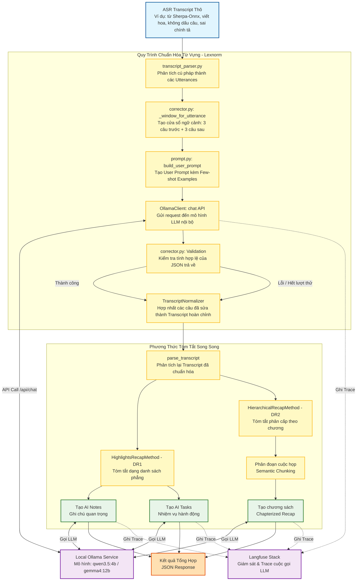

# Kiến Trúc Từ Đầu Đến Cuối (End-to-End Architecture) - Meeting Recap Webapp

Tài liệu này mô tả chi tiết kiến trúc và luồng dữ liệu của ứng dụng **Meeting Recap Webapp** (`tools/09-meeting-recap-webapp`). Hệ thống nhận đầu vào là transcript thô từ mô hình Speech-to-Text (ASR), tiến hành chuẩn hóa từ vựng (lexical normalization), sau đó áp dụng hai phương thức tóm tắt cuộc họp để tạo ra kết quả tóm tắt trực quan cho người dùng.

---

## 1. Sơ Đồ Luồng Dữ Liệu Chi Tiết (Data Path Diagram)

Dưới đây là biểu đồ thể hiện chi tiết đường đi của dữ liệu từ khi nhận Transcript ASR thô cho đến khi trả về kết quả tóm tắt cuối cùng:



---

## 2. Giải Thích Chi Tiết Các Thành Phần Kiến Trúc

### 2.1. Tầng Đầu Vào (Input)
*   **ASR Transcript thô:** Dữ liệu văn bản được tạo ra bởi mô hình nhận dạng giọng nói tự động (ví dụ: `sherpa-onnx-zipformer-vi-30M-int8`). Đặc điểm của dạng dữ liệu này thường là:
    *   Viết hoa toàn bộ (UPPERCASE).
    *   Thiếu dấu câu (phẩy, chấm, hỏi) và phân tách câu không rõ ràng.
    *   Có nhiều lỗi chính tả, từ đồng âm, hoặc phiên âm sai các thuật ngữ tiếng Anh/kỹ thuật chuyên ngành (ví dụ: `DEPLOY` -> `ĐÌ P LOI`, `DOCKER` -> `ĐÓC CƠ`).

### 2.2. Quy Trình Chuẩn Hóa Từ Vựng (Lexnorm Module)
Nằm trong thư mục [app/services/lexnorm](file:///home/quangnhvn34/dev/me/AIP491/tools/09-meeting-recap-webapp/app/services/lexnorm), module này có nhiệm vụ làm sạch văn bản trước khi đưa vào tóm tắt:
1.  **Phân tích cú pháp (`transcript_parser.py`):** Phân tách transcript đầu vào thành các đoạn hội thoại (Utterance) theo định dạng: `Speaker (start_time - end_time): text` hoặc `Speaker: text`.
2.  **Cửa sổ ngữ cảnh (`corrector.py`):** Để sửa một câu chính xác, LLM cần biết ngữ cảnh. Hệ thống sử dụng phương pháp trượt cửa sổ (sliding window), lấy 3 câu hội thoại trước và 3 câu hội thoại sau câu hiện tại làm thông tin bổ trợ.
3.  **Tạo Prompt nâng cao (`prompt.py`):** Hệ thống xây dựng prompt với các quy tắc ràng buộc nghiêm ngặt (7 quy tắc an toàn) để LLM không tự ý tóm tắt, viết lại, hay dịch nghĩa mà chỉ thực hiện thay thế từ lỗi cục bộ. Prompt đi kèm các ví dụ few-shot chuẩn hóa thực tế.
4.  **Gọi LLM cục bộ (`OllamaClient`):** Gửi yêu cầu đến Ollama để nhận về phản hồi có cấu trúc JSON dạng:
    ```json
    {
      "error_words": [{"raw": "MƯỢN", "target": "muộn"}],
      "llm_corrected": "Kim Anh muộn cái định nghĩa..."
    }
    ```
5.  **Validation & Dự phòng (Fallback):** Lớp Pydantic `CorrectionResponse` thực hiện kiểm tra tính hợp lệ của JSON. Nếu mô hình trả về lỗi cấu trúc hoặc gặp sự cố HTTP, hệ thống sẽ kích hoạt cơ chế retry (tối đa 3 lần), nếu vẫn lỗi thì giữ nguyên văn bản thô để đảm bảo tiến trình không bị gián đoạn.
6.  **Recomposition (`TranscriptNormalizer`):** Tập hợp tất cả các câu hội thoại đã được sửa lỗi và ghép lại thành một transcript chuẩn hóa hoàn chỉnh.

### 2.3. Tầng Tóm Tắt (Summarization Methods)
Transcript sau khi chuẩn hóa được chuyển sang bước tóm tắt bằng 2 phương pháp độc lập chạy song song để tối ưu hóa thời gian:

#### Phương Pháp 1: Highlights Recap (DR1)
*   **Mục tiêu:** Tạo ghi chú nhanh, gọn và các hành động cần thực hiện.
*   **Thành phần đầu ra:**
    *   **AI Notes:** Ghi lại các điểm thảo luận chính, quyết định đã được đưa ra dưới dạng danh sách bullet points phẳng.
    *   **AI Tasks:** Trích xuất các nhiệm vụ hành động (Action Items), xác định rõ người thực hiện (Assignee) và thời hạn (nếu có).
*   **File triển khai:** [highlights_recap.py](file:///home/quangnhvn34/dev/me/AIP491/tools/09-meeting-recap-webapp/app/methods/highlights_recap.py)

#### Phương Pháp 2: Hierarchical Recap (DR2)
*   **Mục tiêu:** Tạo cấu trúc tóm tắt phân cấp theo mạch cuộc họp giống như mục lục sách (chapterized recap).
*   **Thành phần đầu ra:**
    *   **Semantic Chunking:** Tự động phát hiện các điểm chuyển tiếp chủ đề để chia cuộc họp thành các chương (chapters).
    *   **Chapter Recap:** Mỗi chương sẽ có:
        *   Tiêu đề chương rõ ràng.
        *   Tóm tắt ngắn gọn nội dung chương đó.
        *   Các điểm thảo luận chi tiết (Key Points) bên trong chương.
*   **File triển khai:** [hierarchical_recap.py](file:///home/quangnhvn34/dev/me/AIP491/tools/09-meeting-recap-webapp/app/methods/hierarchical_recap.py)

### 2.4. Tầng Quản Lý Ollama & Quan Sát (Ollama & Observability)
*   **Ollama Lifecycle (`ollama_lifecycle.py`):** Webapp hỗ trợ tự động khởi chạy dịch vụ Ollama khi có yêu cầu tóm tắt và tự động giải phóng mô hình khỏi bộ nhớ GPU (`ollama stop`) sau khi hoàn thành công việc để tiết kiệm tài nguyên hệ thống.
*   **Langfuse Tracing (`observability.py`):** Tích hợp SDK Langfuse để ghi lại vết (trace) toàn bộ quy trình: từ văn bản đầu vào, các bước gọi LLM trung gian (sửa lỗi từ, tóm tắt chương) kèm theo thông tin chi tiết về độ trễ (latency), prompt, và kết quả trả về.

---

## 3. Định Dạng Kết Quả Đầu Ra (Output Format)

Kết quả cuối cùng trả về cho Frontend dưới dạng một JSON Object chứa thông tin:
*   `input_name`: Tên file transcript đầu vào.
*   `utterance_count`: Số lượng câu thoại sau phân tích.
*   `results`:
    *   `highlights`: Chứa danh sách `notes` và `tasks`.
    *   `hierarchical`: Chứa danh sách `chapters` (mỗi chapter gồm `title`, `summary`, `key_points`).
*   `model_targets`: Thông tin về mô hình LLM đã sử dụng.
