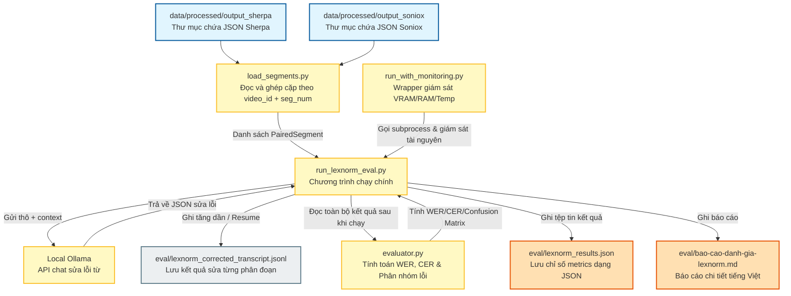

# Hướng Dẫn Chạy Ứng Dụng Và Đánh Giá Lexical Normalization (Lexnorm)

Tài liệu này hướng dẫn cách khởi chạy ứng dụng web, chuẩn bị dữ liệu đánh giá, chạy đánh giá chuẩn hóa từ vựng (lexnorm) và phân tích các tệp tin liên quan.

---

## 1. Hướng Dẫn Chạy Ứng Dụng Web (Run Webapp)

Ứng dụng web được xây dựng với kiến trúc FastAPI (Backend) và React (Frontend).

### Bước 1: Build React Frontend
Di chuyển vào thư mục `frontend/`, cài đặt các thư viện và build bản đóng gói tĩnh:
```bash
cd frontend
npm install
npm run build
cd ..
```
Thư mục sau khi build `frontend/dist` sẽ được FastAPI phục vụ tĩnh trực tiếp.

### Bước 2: Chuẩn bị Mô hình Ollama
Đảm bảo bạn đã cài đặt Ollama và khởi chạy dịch vụ Ollama. Tải về mô hình mặc định được cấu hình cho webapp:
```bash
ollama pull qwen3.5:4b-q4_K_M
```

### Bước 3: Cài đặt Python Dependencies
Cài đặt các gói phụ thuộc Python từ thư mục gốc của tool 09:
```bash
pip install -r requirements.txt
```

### Bước 4: Khởi chạy FastAPI Backend
Chạy Uvicorn để khởi động server trên cổng `8091`:
```bash
python -m uvicorn app.main:app --host 127.0.0.1 --port 8091 --reload
```
Truy cập giao diện web tại địa chỉ: `http://127.0.0.1:8091`.

*(Tùy chọn)* Nếu muốn kích hoạt theo dõi cuộc gọi LLM bằng Langfuse, hãy cấu hình các biến môi trường trước khi chạy server:
```bash
export LANGFUSE_PUBLIC_KEY=pk-lf-...
export LANGFUSE_SECRET_KEY=sk-lf-...
export LANGFUSE_BASE_URL=http://localhost:3005
export LANGFUSE_TRACING_ENABLED=true
```

---

## 2. Hướng Dẫn Tạo Dữ Liệu Đánh Giá Cho Lexnorm

Đánh giá Lexnorm yêu cầu dữ liệu dạng cặp (paired segments) giữa **Transcript ASR thô** (đầu vào cần sửa) và **Transcript Ground Truth** (đầu ra mong muốn chuẩn xác).

### Cấu trúc Thư mục Dữ liệu
Dữ liệu được tổ chức dưới dạng các tệp JSON phân chia theo thư mục định danh video (ví dụ: `video_id`) nằm dưới hai đường dẫn chính:

1.  **Dữ liệu ASR thô (Sherpa):**
    *   Đường dẫn mặc định: `data/processed/output_sherpa`
    *   Tên tệp tin: `segment_XXX_sherpa.json` (trong đó `XXX` là số thứ tự phân đoạn dạng 3 chữ số, ví dụ `segment_001_sherpa.json`).
2.  **Dữ liệu Ground Truth (Soniox):**
    *   Đường dẫn mặc định: `data/processed/output_soniox`
    *   Tên tệp tin: `segment_XXX_soniox.json` (ví dụ `segment_001_soniox.json`).

### Cấu trúc một Tệp tin Phân đoạn JSON
Mỗi tệp JSON phân đoạn đại diện cho một câu thoại thô (ASR) hoặc câu chuẩn (Truth) và phải chứa các trường sau:
```json
{
  "transcript": "NỘI DUNG VĂN BẢN HỘI THOẠI",
  "metadata": {
    "duration_sec": 15.4
  }
}
```
*Lưu ý:* Kịch bản đánh giá sẽ quét cả hai thư mục và ghép cặp tự động dựa trên khóa trùng khớp là bộ đôi `(video_id, segment_number)`. Nếu số lượng hoặc mã phân đoạn giữa hai bên lệch nhau, tiến trình đánh giá sẽ báo lỗi và dừng lại để đảm bảo dữ liệu đánh giá cân bằng 1-1.

---

## 3. Quy Trình Và Sơ Đồ Đánh Giá Lexnorm

### Sơ đồ Quy trình Đánh giá
Dưới đây là sơ đồ chi tiết đường đi của quy trình đánh giá chuẩn hóa từ vựng:



### Các Bước Thực Hiện Chạy Đánh Giá

#### Cách 1: Chạy có giám sát tài nguyên hệ thống (Khuyên dùng cho máy local)
Để tránh hiện tượng tràn bộ nhớ GPU (VRAM) hoặc bộ nhớ RAM hệ thống khi chạy tóm tắt số lượng lớn phân đoạn trên mô hình lớn (như `gemma4:12b-it-qat`), hãy sử dụng script wrapper giám sát. Nó sẽ tự động ngắt nếu quá trình bị treo quá 3 phút và định kỳ giải phóng bộ nhớ đệm của Ollama:
```bash
python -m eval.run_with_monitoring
```
Mặc định script này sẽ ghi log chi tiết quá trình chạy vào tệp `eval/run.log`.

#### Cách 2: Chạy trực tiếp qua CLI của công cụ eval
Nếu bạn muốn cấu hình các tham số chi tiết (chẳng hạn giới hạn số phân đoạn chạy thử, thay đổi địa chỉ IP Ollama, số luồng xử lý song song):
```bash
python -m eval.run_lexnorm_eval \
    --sherpa-dir /home/quangnhvn34/dev/me/AIP491/data/processed/output_sherpa \
    --soniox-dir /home/quangnhvn34/dev/me/AIP491/data/processed/output_soniox \
    --output-dir eval/ \
    --ollama-model gemma4:12b-it-qat \
    --max-workers 4 \
    --limit 50
```
*   `--max-workers`: Số lượng yêu cầu gọi song song tới Ollama cùng một lúc (giúp tăng tốc độ xử lý).
*   `--limit`: Chỉ chạy thử nghiệm trên N cặp phân đoạn đầu tiên thay vì toàn bộ (thích hợp khi cần test nhanh cấu hình).
*   `--mode fixture`: Chạy chế độ giả lập (không gọi Ollama thật, chỉ trả về văn bản giữ nguyên) để kiểm tra luồng chạy có thông suốt không.

---

## 4. Chi Tiết Ý Nghĩa Các Chỉ Số Đánh Giá (Metrics)

Sau khi quá trình sửa lỗi hoàn tất, hệ thống so sánh văn bản **Thô (Raw)**, **Đã chuẩn hóa (Corrected)** với **Ground Truth (Soniox)** để tính toán:

### 1. WER (Word Error Rate - Tỷ lệ lỗi cấp từ)
Đo lường phần trăm các từ bị sai (thêm, bớt, thay thế) so với Ground Truth.
$$\text{WER} = \frac{S + D + I}{N}$$
*(Trong đó: S là từ bị thay thế, D là từ bị xóa, I là từ được thêm vào, N là tổng số từ của Ground Truth)*.
*   **Mục tiêu:** Chỉ số WER sau khi sửa (`wer_corrected`) phải thấp hơn trước khi sửa (`wer_raw`), tức là Delta WER âm.

### 2. CER (Character Error Rate - Tỷ lệ lỗi cấp ký tự)
Tương tự như WER nhưng đo ở cấp độ ký tự. Rất hữu ích cho tiếng Việt vì có thể phát hiện việc sửa các lỗi dấu thanh, dấu mũ ký tự đơn lẻ.

### 3. Ma Trận Nhầm Lẫn Cục Bộ (Confusion Matrix)
Phân loại hành vi sửa lỗi của mô hình cho từng câu thoại vào 4 nhóm:

| Nhóm | Tên Đầy Đủ | Ý Nghĩa Thực Tế | Trạng Thái |
| :--- | :--- | :--- | :---: |
| **TP** | True Positive | ASR thô bị sai, mô hình nhận diện và **sửa đúng** hoàn toàn trùng khớp với Ground Truth. Hoặc cả ASR thô và mô hình đều đã đúng. | **Tốt (Đạt)** |
| **FN** | False Negative | ASR thô bị sai, mô hình **không sửa đổi gì** (hoặc bỏ qua) dẫn tới câu vẫn bị sai. | **Cần cải thiện** |
| **FP1** | False Positive Type 1 | ASR thô vốn đã đúng, nhưng mô hình tự ý thay đổi làm câu **bị sai đi**. | **Nguy hại (Phá hủy)** |
| **FP2** | False Positive Type 2 | ASR thô bị sai, mô hình nhận diện được là có lỗi và có chỉnh sửa, nhưng sửa thành một giá trị **sai khác** không khớp Ground Truth. | **Cần tinh chỉnh** |

---

## 5. Danh Sách Các File Liên Quan Trong Thư Mục `eval/`

*   [run_lexnorm_eval.py](file:///home/quangnhvn34/dev/me/AIP491/tools/09-meeting-recap-webapp/eval/run_lexnorm_eval.py): Điểm chạy chính của CLI đánh giá. Điều phối việc tải dữ liệu, gọi sửa lỗi qua Ollama, tính toán metric và xuất file báo cáo.
*   [run_with_monitoring.py](file:///home/quangnhvn34/dev/me/AIP491/tools/09-meeting-recap-webapp/eval/run_with_monitoring.py): Script bọc bảo vệ hệ thống, theo dõi VRAM, RAM, nhiệt độ và log thời gian thực nhằm tránh đóng băng hệ thống.
*   [load_segments.py](file:///home/quangnhvn34/dev/me/AIP491/tools/09-meeting-recap-webapp/eval/load_segments.py): Chịu trách nhiệm quét thư mục đệ quy, phân tích tên file và khớp cặp Sherpa - Soniox theo khóa `(video_id, segment_number)`.
*   [build_transcript.py](file:///home/quangnhvn34/dev/me/AIP491/tools/09-meeting-recap-webapp/eval/build_transcript.py): Tổng hợp danh sách phân đoạn thành một khối transcript dạng hội thoại liên tục để chuyển đổi định dạng khi cần.
*   `eval/lexnorm_corrected_transcript.jsonl`: Tệp tin ghi lưu tạm thời tiến trình sửa lỗi của từng câu thoại. Cho phép tiếp tục chạy (resume) từ câu bị gián đoạn trước đó mà không phải chạy lại từ đầu.
*   `eval/lexnorm_results.json`: Lưu trữ kết quả điểm số metrics cuối cùng dưới cấu trúc JSON phục vụ cho vẽ đồ thị hoặc so sánh tự động.
*   `eval/bao-cao-danh-gia-lexnorm.md`: File báo cáo chi tiết kết quả thử nghiệm bằng tiếng Việt.
