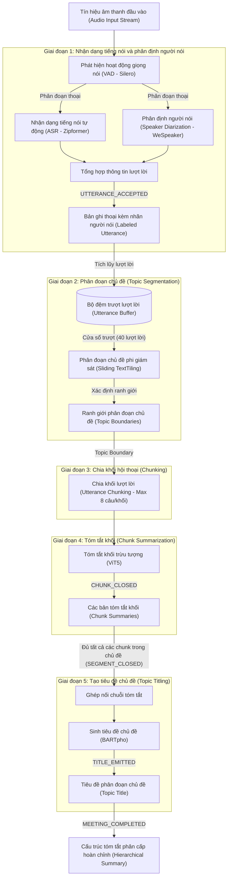
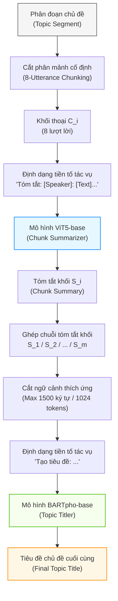
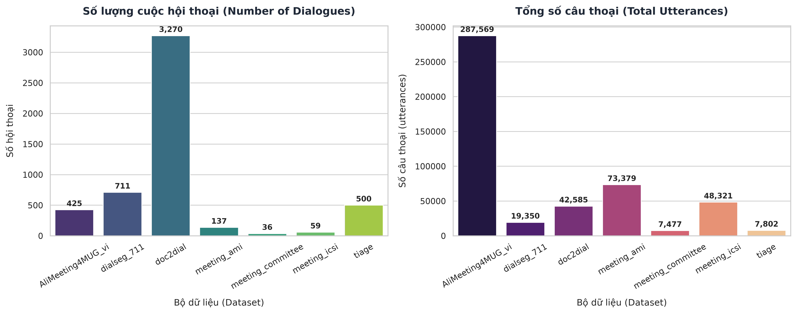
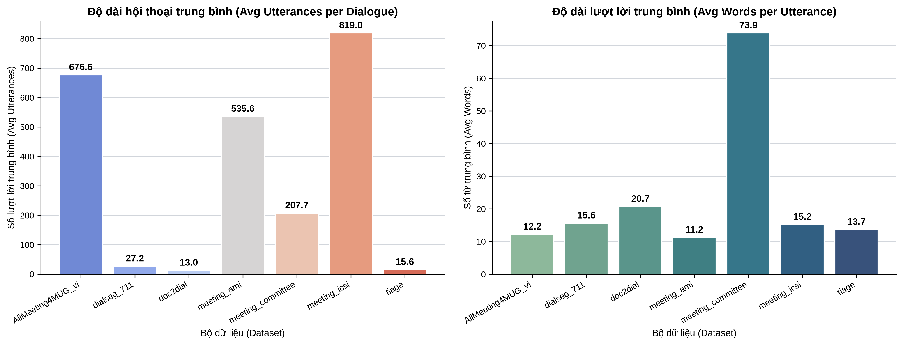
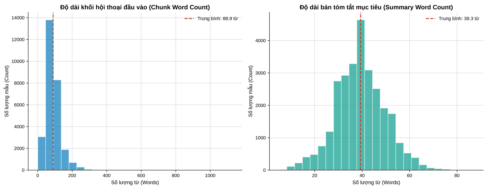
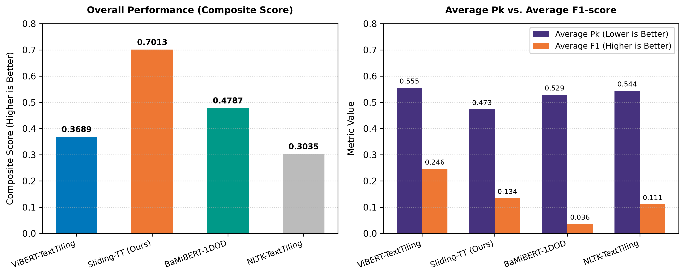
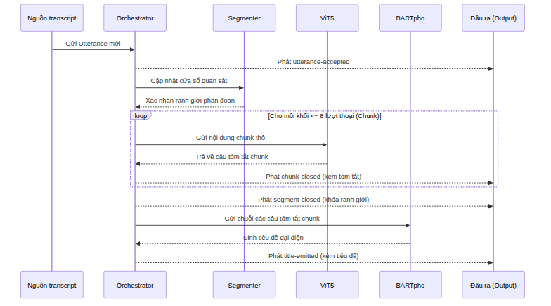

# XÂY DỰNG HỆ THỐNG TÓM TẮT CUỘC HỌP TIẾNG VIỆT THEO THỜI GIAN THỰC SỬ DỤNG PHÂN ĐOẠN CHỦ ĐỀ VÀ MÔ HÌNH SINH PHÂN CẤP

## Tóm tắt (Abstract)

### Tóm tắt tiếng Việt
[Phần tóm tắt tiếng Việt sẽ bổ sung tại đây.]

### Abstract (English)
[English abstract will be added here according to the university template.]

**Từ khóa / Keywords:** Streaming Meeting Summarization, Topic Segmentation, Sliding TextTiling, ViT5, BARTpho, Speaker Diarization, ASR.

## Mở đầu (Introduction)

Các cuộc họp trực tuyến và họp nội bộ hàng ngày đã trở thành phương thức giao tiếp thiết yếu trong hoạt động của các doanh nghiệp hiện đại, tạo ra khối lượng lớn dữ liệu âm thanh khó tra cứu và tái sử dụng nếu chỉ lưu dưới dạng âm thanh thô [@Carletta2005, @Janin2003, @Asthana2025Recap]. Việc khai thác thông tin từ các cuộc họp này đóng vai trò quan trọng trong việc lưu giữ tri thức doanh nghiệp, truy vết thông tin, và hỗ trợ quá trình ra quyết định từ các dữ liệu cuộc họp trước. Tuy nhiên, việc ghi chép và tóm tắt cuộc họp thủ công đòi hỏi chi phí, công sức nhân lực lớn, dễ gặp sai sót và thiếu tính đồng bộ. Hiện nay, sự chuyển dịch từ ghi chép thủ công sang các hệ thống tự động hóa phản ánh nhu cầu cấp thiết về một quy trình xử lý trực tiếp từ luồng tín hiệu giọng nói sang văn bản tóm tắt.

Trong bối cảnh đó, các phương pháp tóm tắt cuộc họp ngoại tuyến (offline) hoặc xử lý theo lô (batch processing) truyền thống bộc lộ những hạn chế lớn về mặt vận hành. Hệ thống ngoại tuyến đòi hỏi phải lưu trữ toàn bộ tệp âm thanh và chỉ tiến hành xử lý sau khi cuộc họp đã kết thúc hoàn toàn, dẫn đến độ trễ phản hồi lớn, khiến thông tin tóm tắt chỉ có thể được tạo ra sau khi phiên họp đã kết thúc hoàn toàn. Quan trọng hơn, cơ chế ngoại tuyến không thể hỗ trợ các nhu cầu tương tác và cập nhật thông tin tức tức thì trong lúc cuộc họp đang diễn ra. Ngược lại, phương pháp tóm tắt gần thời gian thực (near-real-time) và xử lý dạng luồng (streaming processing) mang lại những lợi ích về mặt thực tiễn như cập nhật thông tin tăng dần và hỗ trợ nhận thức ngữ cảnh tức thì (Incremental Update & Contextual Awareness). Hệ thống liên tục tạo ra các đoạn tóm tắt trung gian và tiêu đề chủ đề theo dòng chảy hội thoại, giúp các thành viên — đặc biệt là những người tham gia muộn hoặc các nhà quản lý cần theo dõi nhiều phiên họp song song — nắm bắt nhanh chóng tiến trình thảo luận mà không làm gián đoạn cuộc họp.

Để chuyển luồng âm thanh thành bản ghi hội thoại có cấu trúc làm đầu vào cho bộ tóm tắt, hệ thống sử dụng ba thành phần chính: Bộ phát hiện hoạt động giọng nói (voice activity detection - VAD) [@SileroVAD2021] xác định các khoảng thời gian chứa tiếng nói, bộ nhận dạng tiếng nói tự động (automatic speech recognition - ASR) [@Yao2023Zipformer, @Chu2024Qwen2Audio] chuyển đổi âm thanh thành văn bản lời thoại, còn mô-đun phân định người nói (speaker diarization/tracking) [@Chen2022WeSpeaker] trích xuất vectơ nhúng giọng nói (speaker embeddings) để gán cùng một nhãn phân cụm (như Speaker_1, Speaker_2) cho các đoạn thoại có khả năng thuộc về cùng một người. Sự phối hợp này tạo ra bản ghi hội thoại được gán nhãn người nói hoàn chỉnh.

Tuy nhiên, việc triển khai quy trình nhận dạng tiếng nói ASR và phân định người nói trong xử lý dạng luồng vẫn đối mặt với nhiều hạn chế kỹ thuật. Các mô hình nhận dạng tiếng nói tự động thường gặp tỷ lệ lỗi từ (word error rate - WER) cao khi xử lý âm thanh hội thoại thực tế chứa nhiều tạp âm, tiếng ồn môi trường và hiện tượng chồng chéo giọng nói giữa các thành viên. Đồng thời, phần lớn các giải pháp nhận dạng tiếng nói và phân định người nói hiện tại vẫn hoạt động theo cơ chế ngoại tuyến (offline), đòi hỏi phải quan sát toàn bộ tệp âm thanh nên thiếu khả năng phản hồi tăng dần [@Anguera2012Speaker, @Park2022Review].

Bên cạnh thách thức về xử lý tín hiệu âm thanh, việc tóm tắt các bản ghi hội thoại dài cũng gặp phải rào cản lớn về mặt xử lý văn bản. Bản ghi lời thoại cuộc họp thường có độ dài lớn, văn phong rời rạc, lặp ý và hiện tượng dịch chuyển chủ đề liên tục [@Zhong2021]. Việc xử lý trực tiếp toàn bộ văn bản hội thoại qua một mô hình ngôn ngữ lớn (large language model - LLM) thường gặp trở ngại do giới hạn chiều dài ngữ cảnh (context window) đầu vào, đồng thời dễ dẫn đến tình trạng suy giảm hiệu năng thu nhận thông tin (lost-in-the-middle) và bỏ sót các nội dung quan trọng [@Liu2024Lost]. Để khắc phục vấn đề này, các phương pháp tiếp cận phân cấp thường chia văn bản hội thoại thành các phân đoạn chủ đề (topic segments) để tiến hành tóm tắt độc lập từng phần nhỏ, sau đó tổng hợp các tóm tắt trung gian thành một báo cáo phân cấp hoàn chỉnh.

Mặc dù vậy, các phương pháp phân đoạn chủ đề và tóm tắt hiện tại vẫn còn tồn tại những hạn chế. Các thuật toán phân đoạn phi giám sát truyền thống như TextTiling [@Hearst1997] dựa trên tần suất từ vựng dạng túi từ (bag-of-words) có tốc độ tính toán nhanh nhưng chưa nhận diện tốt các mối quan hệ ngữ nghĩa sâu, dẫn đến điểm lỗi phân đoạn ($P_k$ [@Beeferman1999] và WindowDiff [@Pevzner2002]) cao. Các phương pháp dựa trên mô hình học sâu thường có chi phí huấn luyện và suy luận cao hơn các phương pháp từ vựng. Một số nghiên cứu gần đây [@He2025] đã hỗ trợ xử lý dạng luồng, nhưng vẫn cần mô hình có tham số lớn và dữ liệu huấn luyện phù hợp. Đối với bước tóm tắt, việc sử dụng các mô hình tạo sinh lớn trên đám mây gây tốn kém chi phí vận hành và chưa đảm bảo tính bảo mật dữ liệu doanh nghiệp, trong khi việc tinh chỉnh các mô hình ngôn ngữ nhỏ cục bộ thường đòi hỏi nguồn dữ liệu chất lượng cao vốn rất khan hiếm đối với tiếng Việt [@Phan2022, @Nguyen2022].

Trong luận văn này, chúng tôi giải quyết những khoảng trống công nghệ trên bằng cách giới thiệu một quy trình (pipeline) tóm tắt cuộc họp tiếng Việt dạng luồng, nhận trực tiếp luồng âm thanh (ASR -> Speaker Diarization -> Hierarchical Summarization). Các đóng góp chính của chúng tôi bao gồm:

Chúng tôi thiết kế và triển khai một quy trình tóm tắt cuộc họp phân cấp dạng luồng (streaming hierarchical meeting summarization pipeline) hoàn chỉnh từ đầu vào âm thanh đến văn bản tóm tắt đầu ra, vận hành theo cơ chế đẩy dữ liệu hướng sự kiện (event-driven streaming) giúp thông tin liên tục cập nhật tăng dần (incremental update) các kết quả tóm tắt theo tiến trình hội thoại.

Chúng tôi đề xuất phương pháp phân đoạn chủ đề cửa sổ trượt đa quy mô (multi-scale sliding TextTiling) phi giám sát mới — một cải tiến trực tiếp trên thuật toán TextTiling gốc nhằm hỗ trợ tốt hơn cho chế độ truyền luồng dữ liệu (streaming) — dựa trên việc tích hợp cơ chế cửa sổ trượt và điểm độ sâu đa bán kính (multi-radius depth scoring), nhằm cải thiện độ chính xác ranh giới trong khi vẫn giữ nguyên tốc độ xử lý.

Chúng tôi tinh chỉnh bộ đôi mô hình tạo sinh (specialized fine-tuned generative models) gọn nhẹ cho nhiệm vụ tóm tắt và sinh tiêu đề: mô hình ViT5-base (226 triệu tham số) chuyên trách tóm tắt các khối lượt lời ngắn (chunk) và mô hình BARTpho-syllable-base (132 triệu tham số) chuyên trách tạo sinh tiêu đề chủ đề từ các tóm tắt trung gian.

Chúng tôi xây dựng bộ dữ liệu AliMeeting4MUG_vi dành riêng cho nhiệm vụ tóm tắt hội thoại phân cấp tiếng Việt bằng cách dịch thuật từ bộ dữ liệu gốc AliMeeting MUG [@Zhang2023MUG] thông qua mô hình tencent/Hy-MT2-1.8B, tạo tài nguyên huấn luyện và đánh giá cho nhiệm vụ tóm tắt hội thoại phân cấp tiếng Việt.

Chúng tôi thực hiện đánh giá thực nghiệm đa dạng và thử nghiệm benchmark chi tiết (comprehensive experimental evaluation) bao gồm: so sánh hiệu năng thuật toán phân đoạn chủ đề đề xuất với 3 phương pháp đối chứng (4 phương pháp tổng cộng) trên 6 bộ dữ liệu; kiểm thử chất lượng tóm tắt khối và sinh tiêu đề của mô hình ViT5 và BARTpho theo thang điểm ROUGE; đồng thời đánh giá độ trễ và mức độ tiêu thụ bộ nhớ (VRAM/CPU) trong thực tế của toàn bộ hệ thống.

***
## Nghiên cứu liên quan (Related Work)

### Các phương pháp nhận dạng tiếng nói và phân định người nói (Automatic Speech Recognition and Speaker Diarization Methods)

[Các nghiên cứu liên quan chi tiết về mô hình ASR và kỹ thuật phân định giọng nói/gán nhãn người nói (speaker diarization/clustering) sẽ được cập nhật thêm tại đây sau.]

### Tóm tắt hội thoại (Dialogue Summarization)

Tóm tắt hội thoại (Dialogue summarization) hướng tới việc tạo ra một phiên bản ngắn hơn của văn bản hội thoại đầu vào (input) trong khi vẫn nỗ lực bảo toàn các thông tin cốt lõi của văn bản hội thoại gốc. Các phương pháp tiếp cận chủ yếu được chia thành hai nhóm chính: phương pháp trích xuất (extractive methods) thực hiện lựa chọn các câu hoặc cụm từ có sẵn từ văn bản nguồn; và phương pháp sinh tạo (abstractive methods) tạo ra chuỗi văn bản mới mang tính diễn đạt cô đọng hơn. Các mô hình sinh tạo dựa trên kiến trúc Transformer [@Vaswani2017] đã đạt được chất lượng ngôn ngữ tự nhiên cao, song vẫn phải đối mặt với rủi ro xảy ra hiện tượng ảo giác thông tin (hallucination) và sự phụ thuộc lớn vào dữ liệu huấn luyện. Điển hình cho hướng tiếp cận sinh tạo dựa trên văn bản-văn bản (text-to-text) là kiến trúc T5 [@Raffel2020] và biến thể tiếng Việt ViT5 [@Phan2022], cũng như kiến trúc BART [@Lewis2020] và biến thể tiếng Việt BARTpho [@Nguyen2022] vốn phù hợp để thử nghiệm cho các tác vụ sinh tiêu đề hoặc chuỗi văn bản ngắn.

Đối với môi trường hội thoại, việc tóm tắt cuộc họp (meeting summarization) thể hiện độ phức tạp cao hơn đáng kể so với tóm tắt tài liệu đơn tác giả (single-document/single-author documents). Trong các cuộc họp, thông tin quan trọng thường không nằm tập trung mà được hình thành gián tiếp qua nhiều lượt nói (turns) mang tính tương tác xã hội: một thành viên đề xuất ý kiến, các thành viên khác phản biện, thảo luận và đi đến thống nhất phương án ở cuối phiên hội thoại [@Zhong2021]. Do đó, một câu thoại (utterance) riêng lẻ thường không chứa đựng đầy đủ ngữ cảnh để tóm tắt. Một bản tóm tắt cuộc họp hữu ích cần phản ánh được trình tự thời gian và cấu trúc chủ đề của phiên thảo luận, thay vì chỉ đơn thuần xếp hạng hoặc trích xuất các câu độc lập.

Tuy nhiên, khi đối mặt với các tài liệu hội thoại dài, các mô hình ngôn ngữ lớn thường gặp hiện tượng suy giảm hiệu năng nghiêm trọng ở giữa ngữ cảnh (lost-in-the-middle phenomenon) [@Liu2024Lost] và chi phí tính toán tăng vọt do độ phức tạp bình phương của cơ chế tự chú ý (self-attention). Để giải quyết thách thức này, nghiên cứu này kế thừa ý tưởng thiết kế hệ thống tóm tắt phân cấp (hierarchical recap) [@Asthana2025Recap], chia nhỏ cuộc họp thành các khối hội thoại (chunks) có độ dài tối đa 8 câu thoại (utterances) và tóm tắt từng khối bằng mô hình ViT5 [@Phan2022]. Các tóm tắt khối sau đó đóng vai trò là biểu diễn ngữ cảnh cô đọng để mô hình BARTpho [@Nguyen2022] sinh tiêu đề khái quát cho từng phân đoạn chủ đề thảo luận. Thiết kế phân tách này giúp hệ thống xử lý được các cuộc họp dài mà không bị giới hạn ngữ cảnh hay suy giảm chất lượng sinh văn bản.

### Phân đoạn chủ đề và xử lý dữ liệu dạng luồng trong hội thoại (Topic Segmentation and Streaming Processing in Dialogue)

Phân đoạn chủ đề (topic segmentation) là tác vụ chia chuỗi đơn vị ngôn ngữ liên tục thành các vùng nội dung liên tiếp có tính nhất quán tương đối về ngữ nghĩa. Thuật toán TextTiling kinh điển của Hearst [@Hearst1997] vận hành dựa trên giả định rằng các phân đoạn có cùng chủ đề sẽ chia sẻ chung một vốn từ vựng cụ thể, và độ tương đồng từ vựng (lexical similarity) sẽ suy giảm rõ rệt tại các điểm chuyển giao chủ đề. Phương pháp này tính toán chuỗi điểm tương đồng giữa các khối từ vựng lân cận, xác định các điểm cực tiểu cục bộ (các "thung lũng" tương đồng) và lựa chọn vị trí có điểm sâu (depth score) cao vượt ngưỡng để thiết lập ranh giới chủ đề (topic boundaries).

Các phương pháp phân đoạn dựa trên từ vựng sở hữu ưu điểm nổi bật về tốc độ xử lý nhanh, khả năng giải thích rõ ràng và không yêu cầu dữ liệu gán nhãn để huấn luyện. Tuy nhiên, hạn chế lớn nhất là khó nhận biết các từ đồng nghĩa hoặc các cách diễn đạt khác nhau nhưng cùng hướng về một thực thể ngữ nghĩa, đồng thời dễ bị ảnh hưởng bởi nhiễu trong các câu thoại ngắn của hội thoại thường nhật. Để khắc phục vấn đề này, Xing và Carenini [@Xing2021] đã đề xuất phương pháp phân đoạn hội thoại bằng cách huấn luyện mô hình chấm điểm độ mạch lạc (coherence score) giữa các cặp câu thoại từ dữ liệu được tạo tự động, sau đó sử dụng điểm số này cho quá trình phân đoạn không giám sát. Việc tích hợp các mô hình học sâu (deep learning) như Sentence-BERT giúp cải thiện ngữ nghĩa đáng kể nhưng lại làm gia tăng chi phí suy luận (inference cost) tại thời gian thực. Gần đây hơn, He và các cộng sự [@He2025] đã đề xuất chuyển đổi nhiệm vụ phân đoạn hội thoại thành bài toán phát hiện vật thể một chiều (One-Dimensional Object Detection - 1DOD) dành riêng cho xử lý dạng luồng (streaming text segmentation), giúp nâng cao độ chính xác đáng kể nhờ tối ưu hóa trực tiếp trên các ranh giới chủ đề.

Xây dựng trên những nền tảng này, phương pháp xử lý dữ liệu dạng luồng (streaming data processing) cho phép hệ thống liên tục tính toán và xuất các kết quả tóm tắt trung gian trước khi phiên họp kết thúc. So với cơ chế xử lý theo lô (batch processing) truyền thống vốn yêu cầu toàn bộ dữ liệu âm thanh phải được thu thập đầy đủ trước khi xử lý, cơ chế dạng luồng giúp giảm thiểu đáng kể độ trễ phản hồi (latency) của hệ thống. Người dùng có thể tiếp cận trực tiếp các cấu trúc thông tin cập nhật tăng dần (incremental updates) ngay khi các khối hội thoại (chunks) hoặc phân đoạn (segments) vừa được hình thành trong tiến trình thời gian thực. Tuy nhiên, trong tác vụ phân đoạn hội thoại, một ranh giới chủ đề chỉ có thể được xác nhận một cách tin cậy sau khi hệ thống đã quan sát đủ một lượng ngữ cảnh nhất định ở phía sau (look-ahead context). Do đó, khái niệm "thời gian thực" (real-time) trong nghiên cứu này được định nghĩa là quá trình xử lý và xuất kết quả tăng dần theo dòng chảy thông tin, chứ không phải là việc phát hiện ranh giới chủ đề ngay lập tức tại thời điểm phát sinh câu thoại (utterance). Hệ thống sẽ thực hiện truyền tải dữ liệu và công bố kết quả khi phân đoạn hoặc khối hội thoại đã chính thức đóng lại, đảm hình tính bất biến (immutability) của các thông tin trung gian đã công bố.

### Các bộ dữ liệu và chỉ số đánh giá hội thoại (Dialogue Corpora and Evaluation Metrics)

Việc phát triển các bộ dữ liệu chuyên biệt phục vụ cho các tác vụ hội thoại đóng vai trò quyết định trong việc tinh chỉnh và đánh giá các hệ thống AI. Trong khi các nghiên cứu trước đây chủ yếu dựa vào các bộ dữ liệu cuộc họp tiếng Anh kinh điển như AMI Meeting Corpus [@Carletta2005] chứa các cuộc họp thiết kế sản phẩm giả lập, hoặc ICSI Meeting Corpus [@Janin2003] ghi lại các cuộc họp học thuật thực tế, thì các hệ thống tóm tắt hiện đại yêu cầu dữ liệu có tính đa miền và cấu trúc phức tạp hơn. Bộ dữ liệu QMSum [@Zhong2021] cung cấp một điểm chuẩn lớn cho tóm tắt cuộc họp dựa trên truy vấn trên nhiều lĩnh vực (học thuật, ủy ban quốc hội, sản phẩm). Để đánh giá sự dịch chuyển chủ đề và phân đoạn, các khung làm việc như Doc2Dial [@Feng2020] hay bộ dữ liệu định hướng dịch chuyển chủ đề TIAGE [@TIAGE2021] cung cấp các tài nguyên quan trọng để kiểm thử khả năng bám đuổi ngữ cảnh của mô hình. Gần đây, điểm chuẩn MUG (Meeting Understanding and Generation) [@Zhang2023MUG] đã thiết lập một hệ thống đánh giá toàn diện tích hợp cả phân đoạn, tóm tắt và trích xuất thông tin cuộc họp. Trong nghiên cứu này, chúng tôi thực hiện dịch và tiền xử lý các bộ dữ liệu này sang tiếng Việt để huấn luyện và đánh giá các mô hình phân đoạn và tóm tắt một cách nhất quán.

Để đánh giá chất lượng phân đoạn chủ đề trên các bộ dữ liệu này, chỉ số $P_k$ [@Beeferman1999] thực hiện đo đạc xác suất mà hai vị trí cách nhau một khoảng cửa sổ trượt bị phân loại sai về quan hệ cùng hoặc khác phân đoạn chủ đề. Chỉ số WindowDiff [@Pevzner2002] đếm sự khác biệt về số lượng ranh giới xuất hiện trong cửa sổ trượt, từ đó khắc phục một số hạn chế cố hữu của chỉ số $P_k$ (như hiện tượng phạt quá nặng đối với các sai số nhỏ về vị trí ranh giới). Cả hai chỉ số này đều có giá trị càng thấp càng tốt. Đối với đánh giá ranh giới (boundary evaluation), một ranh giới chủ đề dự đoán được xác định là khớp một-một với ranh giới tham chiếu (ground truth) khi nó nằm trong một phạm vi cửa sổ dung sai (tolerance window) nhất định. Trên cơ sở đó, các chỉ số độ chính xác ($P$), độ triệu hồi ($R$) và điểm $F_1$-score được tính toán như sau:

$$
P = \frac{\text{TP}}{\text{TP} + \text{FP}}, \quad R = \frac{\text{TP}}{\text{TP} + \text{FN}}, \quad F_1 = 2 \cdot \frac{P \cdot R}{P + R}
$$

Trong đó, điểm $F_1$ có giá trị càng cao càng tốt. Do các chỉ số này phụ thuộc trực tiếp vào kích thước cửa sổ dung sai và chiến lược ghép biên, báo cáo thực nghiệm bắt buộc phải sử dụng chung một mã nguồn đánh giá nhất quán cho mọi phương pháp để đảm bảo tính khách quan; các giá trị này không nên được diễn giải như kết quả khớp chính xác phân đoạn (exact-span matching).

Đối với tác vụ tóm tắt và tạo tiêu đề, chỉ số ROUGE (Recall-Oriented Understudy for Gisting Evaluation) [@Lin2004] được sử dụng để đánh giá độ trùng lặp các cụm từ hoặc chuỗi con chung dài nhất giữa văn bản sinh ra và văn bản tham chiếu. Cụ thể, chỉ số ROUGE-1 phản ánh mức độ trùng lặp của các từ đơn (unigrams), ROUGE-2 phản ánh các từ đôi (bigrams), và ROUGE-L dựa trên độ dài của chuỗi con chung dài nhất (Longest Common Subsequence - LCS). Ngoài ra, chỉ số BERTScore [@Zhang2020] tận dụng các vectơ nhúng ngữ cảnh từ mô hình BERT để đánh giá độ tương đồng ngữ nghĩa sâu giữa văn bản sinh tạo và văn bản tham chiếu, giúp giảm bớt sự phụ thuộc vào việc khớp từ vựng bề mặt. Trong bối cảnh đánh giá tiêu đề với nhiều tiêu đề tham chiếu hợp lệ của con người, đề tài sử dụng phương pháp tính ROUGE lớn nhất (ROUGE-Max): điểm số ROUGE được tính riêng biệt với từng tiêu đề tham chiếu, sau đó lấy giá trị lớn nhất. Phương pháp này chấp nhận tính đa dạng và hợp lệ của các cách đặt tiêu đề khác nhau, song có thể mang lại kết quả đánh giá lạc quan hơn so với phương pháp tính điểm trung bình.

## Phương pháp luận (Methodology)

### Quy trình tổng thể (Overall Pipeline)

Quy trình hoạt động tổng thể của hệ thống tóm tắt cuộc họp phân cấp từ luồng âm thanh đầu vào (audio stream) đến cấu trúc tóm tắt phân cấp đầu ra được thiết kế theo cơ chế tổng hợp từ các đơn vị nhỏ lên các cấp nội dung lớn hơn. Hệ thống phân tách toàn bộ quá trình thành 5 giai đoạn chức năng liên kết chặt chẽ với nhau:

**Hình 1. Quy trình tổng thể của hệ thống tóm tắt phân cấp**

Mỗi giai đoạn trong đường ống xử lý (pipeline) tổng thể ở Hình 1 vận hành như một module độc lập với các đặc tả về chức năng, đầu vào và đầu ra rõ ràng:

**Giai đoạn 1: Nhận dạng tiếng nói và phân định người nói (Automatic Speech Recognition and Speaker Diarization)**
Quy trình tiếp nhận và xử lý tín hiệu âm thanh hội thoại liên tục được thực hiện nhằm chuyển đổi giọng nói thành văn bản gắn nhãn người phát ngôn tương ứng. Đầu vào của giai đoạn này là luồng tín hiệu âm thanh liên tục $A(t)$ được thu nhận trực tiếp từ thiết bị. Luồng âm thanh sau đó được xử lý bởi mô hình phát hiện hoạt động giọng nói (Voice Activity Detection - VAD) sử dụng công cụ Silero VAD để phân tách thành chuỗi các đoạn âm thanh chứa tiếng nói $A = (a_1, a_2, \dots, a_n)$. Mỗi đoạn âm thanh $a_i$ sau đó được đưa vào hai nhánh giải mã song song. Nhánh thứ nhất thực hiện nhận dạng tiếng nói tự động (Automatic Speech Recognition - ASR) bằng kiến trúc Zipformer để trích xuất nội dung văn bản tương ứng $t_i = \text{ASR}(a_i)$ ở chế độ giải mã ngoại tuyến cấp phân đoạn (segment-level offline decoding). Nhánh thứ hai thực hiện trích xuất vectơ nhúng đặc trưng người nói (speaker embedding) thông qua kiến trúc WeSpeaker ResNet34 và tiến hành đối sánh độ tương đồng cosine (cosine similarity) để gán nhãn phân cụm người phát ngôn $p_i = \text{SpeakerDiarization}(a_i)$ (ví dụ: Speaker_1, Speaker_2). Kết quả đầu ra của giai đoạn này là một phân đoạn câu thoại hoàn chỉnh có nhãn người phát ngôn, được ký hiệu dưới dạng $u_i = (p_i, t_i)$ (utterance).

**Giai đoạn 2: Phân đoạn chủ đề hội thoại (Unsupervised Topic Segmentation)**
Giai đoạn này chịu trách nhiệm phát hiện các điểm dịch chuyển chủ đề trong dòng hội thoại liên tục để phân chia cuộc họp thành các phần nội dung độc lập. Đầu vào là luồng câu thoại liên tục $U = (u_1, u_2, \dots, u_N)$ thu được từ giai đoạn trước.
Hệ thống thực hiện phân đoạn chủ đề phi giám sát (unsupervised topic segmentation) thông qua thuật toán **Sliding TextTiling** cải tiến trực tiếp từ thuật toán TextTiling gốc của Hearst [@Hearst1997]. Thuật toán đề xuất cải tiến cơ chế so khớp từ vựng truyền thống bằng cách tích hợp cơ chế cửa sổ trượt (sliding window) kết hợp tính toán điểm sâu thung lũng tích hợp đa bán kính quan sát (multi-radius integrated depth score) nhằm tối ưu hóa việc phát hiện ranh giới chủ đề trên dữ liệu hội thoại truyền luồng (streaming data). Quá trình phân tích độ tương đồng từ vựng được thực hiện giữa các khối cửa sổ trượt liên tiếp dựa trên biểu diễn túi từ (Bag-of-Words - BoW). Đầu ra của giai đoạn này là tập hợp các chỉ số ranh giới phân đoạn chủ đề $B = \{b_1, b_2, \dots, b_K\}$ (với $b_0 = 0$ và $b_K = N$). Từ tập ranh giới này, luồng câu thoại được chia thành $K$ phân đoạn chủ đề độc lập $T_k$:
$$T_k = (u_i \mid b_{k-1} < i \le b_k), \quad k = 1, 2, \dots, K$$

**Giai đoạn 3: Phân khối lượt lời (Utterance Chunking)**
Để chuẩn bị dữ liệu đầu vào phù hợp cho mô hình tóm tắt và tránh hiện tượng vượt ngưỡng cửa sổ ngữ cảnh (context window overflow), từng phân đoạn chủ đề $T_k$ có độ dài $N_k = b_k - b_{k-1}$ câu thoại được tiến hành chia nhỏ tiếp thành các khối lượt lời (utterance chunks) liên tiếp và không chồng lấn.
Đầu vào là phân đoạn chủ đề $T_k$, và đầu ra là các khối lượt lời $C_{k, j}$ có kích thước tối đa được giới hạn ở $L_{\text{chunk}} = 8$ câu thoại. Công thức phân chia các khối lượt lời $C_{k, j}$ được định nghĩa như sau:
$$C_{k, j} = \{u_i \mid b_{k-1} + (j-1) \cdot L_{\text{chunk}} < i \le \min(b_{k-1} + j \cdot L_{\text{chunk}}, b_k)\}$$
trong đó $j = 1, 2, \dots, m_k$ là chỉ số khối lượt lời và $m_k = \lceil N_k / L_{\text{chunk}} \rceil$ đại diện cho tổng số khối của chủ đề $k$.

**Giai đoạn 4: Tóm tắt khối trừu tượng (Abstractive Chunk Summarization)**
Giai đoạn này thực hiện tạo sinh văn bản tóm tắt ngắn gọn dưới dạng trừu tượng cho từng khối lượt lời hội thoại độc lập. Đầu vào của mô hình là khối lượt lời $C_{k, j}$ thu được từ giai đoạn trước.
Để mô hình sinh tạo hiểu được cấu trúc hội thoại, khối lượt lời $C_{k, j}$ trước tiên được định dạng lại bằng cách ghép nối nhãn người nói và nội dung văn bản của từng câu thoại liên tiếp thành một chuỗi văn bản duy nhất $\tilde{C}_{k, j}$:
$$\tilde{C}_{k, j} = \text{Join}(\{ p_i \mathbin{\Vert} ``: " \mathbin{\Vert} t_i \mid u_i = (p_i, t_i) \in C_{k, j} \}, ``\backslash n")$$
Hệ thống tự động thêm tiền tố tác vụ (task prefix) `"Tóm tắt: "` vào đầu văn bản đã định dạng, sau đó đưa chuỗi dữ liệu này qua mô hình ngôn ngữ **ViT5** (phiên bản ViT5-base) đã được tinh chỉnh (fine-tuned) trên bộ dữ liệu AliMeeting4MUG_vi để thực hiện tóm tắt trừu tượng (abstractive summarization) và sinh ra một câu tóm tắt ngắn gọn tương ứng:
$$q_{k, j} = \text{ViT5}(\text{Concat}(``\text{Tóm tắt: }", \tilde{C}_{k, j}))$$
trong đó $q_{k, j}$ đại diện cho nội dung tóm tắt đầu ra của khối thứ $j$ thuộc chủ đề $k$.

**Giai đoạn 5: Tạo tiêu đề phân đoạn chủ đề (Topic Titling)**
Tại giai đoạn cuối cùng, hệ thống tiến hành tạo nhãn tiêu đề đại diện khái quát cho toàn bộ phân đoạn chủ đề lớn. Đầu vào là tất cả các câu tóm tắt khối $q_{k, j}$ thuộc cùng một phân đoạn chủ đề $T_k$.
Các câu tóm tắt khối này được thu thập và ghép nối tuần tự với nhau bằng chuỗi ký tự phân tách `" / "`. Nhằm bảo đảm an toàn cho cửa sổ tự chú ý (self-attention window) của mô hình sinh và loại bỏ nhiễu ngữ cảnh, văn bản ghép nối được thực hiện loại phần đầu và giữ tối đa $L_{\text{char\_max}} = 1500$ ký tự cuối cùng. Chuỗi văn bản sau khi làm sạch ngữ cảnh được đưa vào mô hình **BARTpho** đã tinh chỉnh để sinh ra tiêu đề chủ đề $h_k$ tương ứng:
$$h_k = \text{BARTpho}(\text{Concat}(``\text{Tạo tiêu đề: }", \text{Suffix}(\text{Join}(\{q_{k, 1}, q_{k, 2}, \dots, q_{k, m_k}\}, ``\text{ / }"), L_{\text{char\_max}})))$$
trong đó $\text{Suffix}(X, L)$ đại diện cho hàm lấy chuỗi con chứa $L$ ký tự cuối cùng của chuỗi $X$.

Kết quả đầu ra cuối cùng của toàn bộ đường ống xử lý (pipeline) là một cấu trúc tóm tắt phân cấp hoàn chỉnh (complete hierarchical summary structure) $R$ được biểu diễn bằng một chuỗi có thứ tự thời gian của các tiêu đề và chuỗi tóm tắt khối tương ứng:
$$R = \Big( \big( h_k, ( q_{k, 1}, q_{k, 2}, \dots, q_{k, m_k} ) \big) \Big)_{k=1}^{K}$$
Cấu trúc này cho phép người dùng nhanh chóng nắm bắt bức tranh toàn cảnh của cuộc họp qua hệ thống tiêu đề chủ đề $h_k$, đồng thời dễ dàng truy xuất thông tin chi tiết qua chuỗi các câu tóm tắt khối $q_{k, j}$ tương ứng bên dưới.

### Khâu nhận dạng tiếng nói và phân định người nói thời gian thực (Real-time Speech Recognition and Speaker Diarization)

[Phần phương pháp nghiên cứu chi tiết và các thuật toán nâng cao liên quan đến ASR và phân định người nói (speaker diarization/tracking) sẽ được cập nhật sau.]

### Thuật toán Multi-Scale Sliding TextTiling (Multi-Scale Sliding TextTiling Algorithm)

Thuật toán phân đoạn TextTiling kinh điển của Hearst [@Hearst1997] được thiết kế cho việc phân đoạn văn bản viết dạng tĩnh (static text), yêu cầu quan sát toàn bộ tài liệu trước khi xác định ranh giới chủ đề. Hạn chế này khiến TextTiling gốc không thể áp dụng trực tiếp cho chế độ xử lý dạng luồng (streaming), nơi dữ liệu hội thoại liên tục được bổ sung theo thời gian thực. Ngoài ra, TextTiling gốc chỉ sử dụng một kích thước khối và một bán kính quan sát cố định duy nhất để tính điểm sâu (depth score), dẫn đến việc bỏ sót các chuyển đổi chủ đề xảy ra ở nhiều quy mô ngữ cảnh khác nhau — từ các chuyển đổi cục bộ ngắn giữa vài lượt lời cho đến các dịch chuyển chủ đề vĩ mô trải dài hàng chục lượt lời.

Để giải quyết các hạn chế này, chúng tôi đề xuất thuật toán Multi-Scale Sliding TextTiling — một phương pháp phân đoạn chủ đề phi giám sát (unsupervised) mở rộng trực tiếp từ TextTiling gốc, tích hợp ba cải tiến chính: (i) cơ chế cửa sổ trượt (sliding window) cho phép xử lý tăng dần trên luồng hội thoại liên tục, (ii) tổng hợp điểm sâu đa bán kính (multi-radius depth scoring) kết hợp chuẩn hóa Z-score để nhận biết chuyển đổi chủ đề ở nhiều quy mô ngữ cảnh, và (iii) ngưỡng thích ứng (adaptive thresholding) kết hợp gộp tham lam (greedy merging) để giảm hiện tượng quá phân mảnh (over-segmentation).

Xét luồng lượt lời đầu vào $U = (u_1, u_2, \dots, u_n)$ thu được từ giai đoạn nhận dạng tiếng nói và phân định người nói. Thuật toán đề xuất nhận đầu vào là chuỗi $U$ cùng các siêu tham số cấu hình, và xuất ra tập hợp các chỉ số ranh giới phân đoạn chủ đề $B = \{b_1, b_2, \dots, b_K\}$, phân chia $U$ thành $K$ phân đoạn chủ đề liên tiếp. Quy trình tổng quan của thuật toán được minh họa trong Hình 2 và trình bày chi tiết qua ba giai đoạn xử lý cốt lõi sau đây.

**Hình 2.** Sơ đồ chi tiết quy trình xử lý và điều kiện hoạt động của thuật toán Multi-Scale Sliding TextTiling. Thuật toán tự động phân nhánh giữa chế độ xử lý theo lô (Batch Mode, khi $n \le 40$) và chế độ cửa sổ trượt dạng luồng (Streaming Mode, khi $n > 40$) dựa trên độ dài chuỗi lượt thoại đầu vào, tích hợp các siêu tham số cấu hình tối ưu của hệ thống.

Để làm nổi bật các đóng góp cải tiến của nghiên cứu này, dưới đây là các phân tích đối chiếu chi tiết về những điểm tương đồng (bảo toàn nguyên lý cốt lõi) và điểm khác biệt (các cải tiến kỹ thuật cụ thể cho môi trường streaming) giữa giải thuật đề xuất và thuật toán TextTiling gốc.

Trong nghiên cứu này, thuật toán TextTiling của Hearst (1997) [@Hearst1997] được xem xét trên hai khía cạnh độc lập nhưng nhất quán:
1. **Về mặt lý thuyết (Bảng 3A)**: Chúng tôi đối chiếu các nguyên lý nền tảng của bài báo gốc nhằm làm rõ các hạn chế cố hữu của giải thuật Hearst (1997) và nhấn mạnh những đột phá kiến trúc của giải thuật đề xuất (như chuyển từ khối từ giả định sang lượt thoại tự nhiên, từ đơn bán kính sang đa bán kính, và từ xử lý theo lô sang cửa sổ trượt dạng luồng).
2. **Về mặt thực nghiệm (Bảng 3B)**: Vì bài báo gốc không cung cấp mã nguồn hiện đại, chúng tôi sử dụng bản cài đặt tham chiếu (reference implementation) mã nguồn mở chuẩn hóa và được công nhận rộng rãi nhất của thuật toán này trong thư viện NLTK (`nltk.tokenize.texttiling.TextTilingTokenizer`) làm mô hình baseline đối chứng (`nltk_texttiling`), với các tham số được thiết lập minh bạch.

**Bảng 2. Các đặc điểm tương đồng (giống nhau) giữa hai thuật toán**

| Đặc trưng kỹ thuật | Điểm chung thiết kế của hai thuật toán |
| :--- | :--- |
| **Mô hình biểu diễn cơ bản** | Đều sử dụng mô hình túi từ (Bag-of-Words - BoW) để số hóa tần suất xuất hiện của từ vựng từ văn bản đầu vào. |
| **Đo độ mạch lạc chủ đề** | Đều áp dụng độ tương đồng cosine (Cosine Similarity) làm phép toán đo lường mức độ liên kết từ vựng giữa các khối văn bản liền kề. |
| **Nguyên lý xác định ranh giới** | Đều tìm các khe chuyển dịch chủ đề tại các "thung lũng" độ tương đồng (local similarity valleys) thông qua việc đánh giá điểm sâu (depth score) của thung lũng đó so với các đỉnh xung quanh. |
| **Tính chất học máy** | Đều hoạt động theo cơ chế phi giám sát (unsupervised), không yêu cầu dữ liệu gán nhãn hay quy trình huấn luyện mô hình phức tạp, giúp tối ưu hóa tài nguyên tính toán. |

**Bảng 3A. So sánh khía cạnh lý thuyết giữa TextTiling gốc (Hearst, 1997) và Multi-Scale Sliding TextTiling (đề xuất)**

| Khía cạnh lý thuyết | TextTiling gốc [@Hearst1997] | Multi-Scale Sliding TextTiling (đề xuất) |
| :--- | :--- | :--- |
| **Đơn vị phân hoạch** | **Khối từ vựng tĩnh**: Các đoạn từ vựng giả định (pseudo-sentences/paragraphs) dựa trên số từ cố định. | **Lượt thoại tự nhiên (Utterances)**: Lượt nói thực tế của người nói, bảo toàn ranh giới tương tác hội thoại. |
| **Phạm vi xử lý** | **Toàn cục (Batch Mode)**: Yêu cầu nạp toàn bộ văn bản tĩnh để tính toán chuỗi độ tương đồng từ đầu đến cuối. | **Cục bộ dạng luồng (Streaming-ready)**: Sử dụng cơ chế cửa sổ trượt lân cận kích thước $W=40$ trượt theo bước $S=5$. |
| **Biểu diễn từ vựng** | **Từ vựng toàn cục tĩnh**: Vectơ hóa dựa trên bảng từ vựng cố định thu thập từ toàn bộ tài liệu đầu vào. | **Từ vựng cục bộ động**: Sử dụng các từ điển tần suất (`dict[str, int]`) cục bộ động trên từng khối. |
| **Quy mô & Tổng hợp điểm sâu** | **Đơn bán kính quan sát**: Chỉ dùng một bán kính cố định duy nhất để tìm đỉnh tương đồng. | **Đa quy mô (Multi-scale)**: Tính toán điểm sâu song song trên tập bán kính $R = \{3, 5, 10, 15, 20\}$ kết hợp Z-score. |
| **Xử lý dạng luồng** | **Không hỗ trợ**: Không có cơ chế chốt ranh giới tăng dần, phụ thuộc độ dài toàn văn. | **Hỗ trợ streaming**: Chốt ranh giới tăng dần theo cửa sổ trượt, đảm bảo tính bất biến của kết quả đã công bố. |

**Bảng 3B. Tham số cấu hình baseline NLTK TextTiling trong các thực nghiệm đối chứng**

| Tham số / Thành phần | Giá trị cấu hình baseline `nltk_texttiling` | Diễn giải kỹ thuật |
| :--- | :--- | :--- |
| **Thư viện & Module** | `nltk.tokenize.texttiling.TextTilingTokenizer` | Implementation chính thức của NLTK (v3.8.1+). |
| **Kích thước khối từ (`w`)** | $w = 20$ | Số từ vựng cố định trong một khối từ giả định (pseudo-sentence). |
| **Độ rộng cửa sổ (`k`)** | $k = 10$ | Số lượng khối từ dùng để tính độ tương đồng Cosine ở hai bên khe. |
| **Độ rộng làm mịn (`smoothing_width`)** | $2$ | Độ rộng cửa sổ trung bình động dùng để làm mịn mảng độ tương đồng. |
| **Số vòng làm mịn (`smoothing_rounds`)** | $1$ | Số lần áp dụng bộ lọc làm mịn chuỗi độ tương đồng. |
| **Chính sách ngưỡng (`cutoff_policy`)** | `CutoffPolicy.HC` | Hard Cutoff: Ngưỡng đặt ranh giới $\tau = \mu - \sigma$ trên mảng điểm sâu. |
| **Từ dừng & Tiền xử lý** | `stopwordsiso` tiếng Việt | Lọc từ dừng tiếng Việt và nối chuỗi lượt thoại thành định dạng đầu vào NLTK. |

#### Giai đoạn 1: Tiền xử lý và độ tương đồng khối (Preprocessing and Block-level Similarity)

Giai đoạn đầu tiên thực hiện biến đổi mỗi lượt lời thô thành biểu diễn số học và tính toán độ tương đồng từ vựng giữa các khối từ vựng (lexical block) liền kề. Với mỗi lượt lời $u_i$, hệ thống thực hiện chuẩn hóa chữ thường, loại bỏ ký tự đặc biệt, lọc từ dừng (stopwords) tiếng Việt bằng bộ từ điển stopwordsiso [@Stopwordsiso2024], và tạo vectơ tần suất từ $b_i(w) = \operatorname{tf}(w, u_i)$. Tại mỗi khe liên câu (inter-utterance gap) $i$ nằm giữa lượt lời $u_i$ và $u_{i+1}$, hai khối từ vựng có kích thước $k$ lượt lời được xây dựng lần lượt ở phía trái và phía phải:
$$
B_L^i(w) = \sum_{j=\max(1, i-k+1)}^{i} b_j(w)
$$
$$
B_R^i(w) = \sum_{j=i+1}^{\min(n, i+k)} b_j(w)
$$
Độ tương đồng cosine (cosine similarity) giữa hai khối được tính theo công thức:
$$
S_i = \frac{B_L^i \cdot B_R^i}{\|B_L^i\|_2 \|B_R^i\|_2 + \varepsilon}
$$
Trong đó $\varepsilon = 10^{-10}$ là hằng số ổn định số học nhằm tránh phép chia cho không khi một khối rỗng sau quá trình tiền xử lý. Giá trị $S_i$ thấp cho biết hai khối chia sẻ ít từ vựng chung, phản ánh khả năng cao rằng một chuyển đổi chủ đề đang xảy ra tại vị trí khe $i$. Việc tổng hợp tần suất từ theo khối gồm $k$ lượt lời thay vì so sánh từng cặp câu thoại riêng lẻ giúp làm mịn nhiễu từ vựng — một đặc tính quan trọng trong dữ liệu hội thoại, nơi các lượt lời đơn lẻ thường rất ngắn và nghèo nàn về mặt từ vựng [@Hearst1997]. Độ tương đồng cosine được lựa chọn nhờ tính bất biến đối với độ dài văn bản (length-invariant), đảm bảo phép so sánh không bị thiên lệch khi các khối có số lượng lượt lời khác nhau ở các vùng biên. Một điểm cải tiến quan trọng khác trong bước biểu diễn là việc sử dụng không gian từ vựng cục bộ động (dynamic local vocabulary). Thay vì dựng một bảng từ vựng toàn cục tĩnh cho toàn bộ văn bản từ trước, thuật toán đề xuất xây dựng các từ điển tần suất từ động trực tiếp trên từng khối lượt lời. Việc này giúp loại bỏ sự phụ thuộc vào thông tin toàn cục, đảm bảo khả năng tương thích tối đa với chế độ streaming khi từ vựng của cuộc họp liên tục thay đổi và không thể xác định trước.

#### Giai đoạn 2: Điểm sâu thung lũng đa bán kính (Multi-radius Depth Scoring)

Giai đoạn thứ hai xác định mức độ chuyển đổi chủ đề tại mỗi khe bằng cách tính điểm sâu thung lũng (depth score) — một chỉ số đo mức chênh lệch giữa giá trị tương đồng tại khe đang xét so với các giá trị tương đồng cực đại trong vùng lân cận [@Hearst1997, @Pevzner2002]. Đối với mỗi bán kính quan sát $r$, các đỉnh tương đồng cục bộ (local similarity peaks) ở phía trái và phía phải của khe $i$ được xác định:
$$
p_L(i, r) = \max_{\max(1, i-r) \le j \le i} S_j
$$
$$
p_R(i, r) = \max_{i \le j \le \min(n-1, i+r)} S_j
$$
Điểm sâu tại khe $i$ với bán kính $r$ được tính:
$$
D_r(i) = \frac{p_L(i, r) + p_R(i, r) - 2S_i}{2}
$$
Về mặt trực giác, $D_r(i)$ đo mức "sâu" của thung lũng tương đồng (similarity valley) tại vị trí khe $i$: giá trị $D_r(i)$ cao cho thấy khe $i$ nằm tại một vùng có sự suy giảm tương đồng rõ rệt so với cả hai phía — dấu hiệu mạnh mẽ của một chuyển đổi chủ đề.

Khác biệt cốt lõi với TextTiling gốc nằm ở việc nghiên cứu này áp dụng đồng thời nhiều bán kính quan sát $R = \{3, 5, 10, 15, 20\}$ thay vì chỉ một bán kính cố định duy nhất. Bán kính nhỏ ($r = 3$) nhạy cảm với các chuyển đổi chủ đề cục bộ xảy ra trong phạm vi vài lượt lời liên tiếp, trong khi bán kính lớn ($r = 20$) có khả năng nhận biết các dịch chuyển chủ đề vĩ mô trải dài hàng chục lượt lời. Để đảm bảo các bán kính khác nhau đóng góp công bằng vào kết quả tổng hợp, mảng điểm sâu ứng với mỗi bán kính được chuẩn hóa Z-score nhằm đưa về cùng phân phối chuẩn $\mathcal{N}(0,1)$, tránh hiện tượng bán kính lớn (với biên độ depth tự nhiên lớn hơn) chi phối kết quả:
$$
\widehat{D}_r(i) = \frac{D_r(i) - \mu_r}{\sigma_r + 10^{-10}}
$$
trong đó $\mu_r$ và $\sigma_r$ lần lượt là trung bình và độ lệch chuẩn của $D_r(i)$ trên tất cả các khe (được tính toàn cục trên toàn bộ cuộc họp ở chế độ xử lý theo lô, hoặc tính cục bộ trên từng cửa sổ trượt ở chế độ luồng). Điểm sâu tổng hợp đa quy mô (aggregated multi-scale depth score) được xác định bằng giá trị trung bình cộng:
$$
\bar{D}(i) = \frac{1}{|R|} \sum_{r \in R} \widehat{D}_r(i)
$$

#### Giai đoạn 3: Ngưỡng thích ứng và gộp phân đoạn ngắn (Adaptive Thresholding and Greedy Merging)

Giai đoạn thứ ba xác định các khe ứng viên ranh giới dựa trên ngưỡng thích ứng (adaptive threshold) và thực hiện hậu xử lý gộp tham lam (greedy merging) để giảm hiện tượng quá phân mảnh (over-segmentation). Ngưỡng thích ứng được tính theo công thức:
$$
\tau = \mu(\bar{D}) + \alpha \cdot \sigma(\bar{D})
$$
trong đó $\mu(\bar{D})$ và $\sigma(\bar{D})$ lần lượt là trung bình và độ lệch chuẩn của chuỗi điểm sâu tổng hợp $\bar{D}$ (được tính toàn cục hoặc cục bộ từng cửa sổ tương ứng với chế độ hoạt động), và $\alpha$ là hệ số kiểm soát độ nhạy phân đoạn. Giá trị $\alpha$ cao dẫn đến ngưỡng cao hơn, tạo ra ít ranh giới hơn và ưu tiên các phân đoạn dài; ngược lại, giá trị $\alpha$ thấp tạo ra nhiều ranh giới hơn và ưu tiên các phân đoạn ngắn. Khe $i$ có $\bar{D}(i) > \tau$ được đánh dấu là ứng viên ranh giới chủ đề.

Sau khi trích xuất tập ứng viên ranh giới, giai đoạn hậu xử lý gộp tham lam (greedy merging) kiểm tra và loại bỏ các phân đoạn có độ dài nhỏ hơn ngưỡng tối thiểu $m_{\min}$:
$$
m_{\min} = \begin{cases} \max(2, \lfloor \gamma \cdot n \rfloor) & \text{nếu } n \le W \text{ (Batch Mode)} \\ \max(2, \lfloor \gamma \cdot W \rfloor) & \text{nếu } n > W \text{ (Streaming Mode)} \end{cases}
$$
trong đó $\gamma = 0{,}20$ là tỷ lệ gộp tối thiểu (minimum segment ratio). Khi phát hiện một phân đoạn có ít hơn $m_{\min}$ lượt lời, thuật toán so sánh giá trị $\bar{D}$ tại hai ranh giới bao quanh phân đoạn đó và xóa ranh giới có $\bar{D}$ thấp hơn, từ đó gộp phân đoạn ngắn vào phân đoạn láng giềng có tương đồng chủ đề cao hơn. Giai đoạn hậu xử lý này đảm bảo mỗi phân đoạn kết quả chứa đủ ngữ cảnh cho giai đoạn tóm tắt sinh tạo tiếp theo.

Các giá trị siêu tham số mặc định (kích thước khối $k = 2$, hệ số ngưỡng $\alpha = 1{,}2$, tập bán kính $R = \{3, 5, 10, 15, 20\}$, tỷ lệ gộp tối thiểu $\gamma = 0{,}20$) được xác định thông qua quá trình tìm kiếm thực nghiệm trên tập kiểm định (validation set) của sáu bộ dữ liệu đánh giá và được trình bày chi tiết trong Phụ lục.

#### Mã giả thuật toán và phân tích độ phức tạp (Algorithm Pseudocode and Complexity Analysis)

Quy trình tổng thể của thuật toán Multi-Scale Sliding TextTiling được trình bày trong mã giả sau đây:

$$
\begin{array}{l}
\hline
\textbf{Algorithm 1: } \text{Multi-Scale Sliding TextTiling} \\
\hline
\textbf{Input:} \quad U = (u_1, u_2, \dots, u_n) \text{ (chuỗi lượt lời), } k \text{ (kích thước khối), } R \text{ (tập bán kính), } \alpha \text{ (hệ số ngưỡng), } \\
\quad\quad\quad \gamma \text{ (tỷ lệ gộp), } W \text{ (kích thước cửa sổ), } S \text{ (bước dịch)} \\
\textbf{Output:} \quad B = \{b_1, b_2, \dots, b_K\} \text{ (tập ranh giới phân đoạn chủ đề)} \\
\hline
1: \quad C \leftarrow \emptyset, \quad \text{boundary\_depths} \leftarrow \emptyset \\
2: \quad \textbf{if } n \le W \textbf{ then} \quad \text{— Chế độ xử lý theo lô (Batch Mode)} \\
3: \quad\quad S \leftarrow \text{SimilarityScores}(U, k) \\
4: \quad\quad \textbf{for } \text{mỗi } r \in R \textbf{ do} \\
5: \quad\quad\quad D_r \leftarrow \text{DepthScores}(S, r) \\
6: \quad\quad\quad \hat{D}_r \leftarrow \text{ZScoreNormalize}(D_r) \\
7: \quad\quad \textbf{end for} \\
8: \quad\quad \bar{D}(i) \leftarrow \text{Mean}(\{\hat{D}_r(i) \mid r \in R\}), \forall i \in \{1, \dots, n-1\} \\
9: \quad\quad \tau \leftarrow \mu(\bar{D}) + \alpha \cdot \sigma(\bar{D}) \\
10: \quad\quad C \leftarrow \{i \mid \bar{D}(i) > \tau\} \\
11: \quad\quad \text{boundary\_depths}[i] \leftarrow \bar{D}(i), \quad \forall i \in C \\
12: \quad \textbf{else} \quad \text{— Chế độ cửa sổ trượt (Streaming Mode)} \\
13: \quad\quad \text{Xây dựng tập các vị trí bắt đầu cửa sổ } starts \leftarrow \{1, 1+S, 1+2S, \dots\} \text{ với } start \le n - W + 1 \\
14: \quad\quad \textbf{if } \text{phần tử cuối của } starts \ne n - W + 1 \textbf{ then} \\
15: \quad\quad\quad \text{Thêm } n - W + 1 \text{ vào } starts \\
16: \quad\quad \textbf{end if} \\
17: \quad\quad \textbf{for } \text{mỗi khe liên câu } g \leftarrow 1 \textbf{ to } n-1 \textbf{ do} \\
18: \quad\quad\quad start^* \leftarrow \operatorname{argmin}_{s \in starts, s \le g < s+W-1} \left|g - \left(s + \frac{W-1}{2}\right)\right| \quad \text{— Gán khe về tâm cửa sổ gần nhất} \\
19: \quad\quad\quad \text{Gán } g \text{ vào danh sách khe của cửa sổ } start^* \\
20: \quad\quad \textbf{end for} \\
21: \quad\quad \textbf{for } \text{mỗi } start \in starts \textbf{ do} \\
22: \quad\quad\quad W_{utts} \leftarrow (u_{start}, u_{start+1}, \dots, u_{start+W-1}) \quad \text{— Lấy cửa sổ con} \\
23: \quad\quad\quad S_{local} \leftarrow \text{SimilarityScores}(W_{utts}, k) \\
24: \quad\quad\quad \textbf{for } \text{mỗi } r \in R \textbf{ do} \\
25: \quad\quad\quad\quad D_{local, r} \leftarrow \text{DepthScores}(S_{local}, r) \\
26: \quad\quad\quad\quad \hat{D}_{local, r} \leftarrow \text{ZScoreNormalize}(D_{local, r}) \\
27: \quad\quad\quad \textbf{end for} \\
28: \quad\quad\quad \bar{D}_{local}(j) \leftarrow \text{Mean}(\{\hat{D}_{local, r}(j) \mid r \in R\}), \forall j \in \{1, \dots, W-1\} \\
29: \quad\quad\quad \tau_{local} \leftarrow \mu(\bar{D}_{local}) + \alpha \cdot \sigma(\bar{D}_{local}) \\
30: \quad\quad\quad \textbf{for } \text{mỗi khe } g \text{ được gán vào cửa sổ } start \textbf{ do} \\
31: \quad\quad\quad\quad j \leftarrow g - start + 1 \quad \text{— Chỉ số cục bộ của khe g trong cửa sổ} \\
32: \quad\quad\quad\quad \textbf{if } \bar{D}_{local}(j) > \tau_{local} \textbf{ then} \\
33: \quad\quad\quad\quad\quad C \leftarrow C \cup \{g\} \\
34: \quad\quad\quad\quad\quad \text{boundary\_depths}[g] \leftarrow \bar{D}_{local}(j) \\
35: \quad\quad\quad\quad \textbf{end if} \\
36: \quad\quad\quad \textbf{end for} \\
37: \quad\quad \textbf{end for} \\
38: \quad \textbf{end if} \\
39: \quad B_{cand} \leftarrow C \cup \{n-1\} \\
40: \quad m_{\min} \leftarrow \begin{cases} \max(2, \lfloor\gamma \cdot n\rfloor) & \text{nếu } n \le W \\ \max(2, \lfloor\gamma \cdot W\rfloor) & \text{nếu } n > W \end{cases} \\
41: \quad B \leftarrow \text{GreedyMerge}(B_{cand}, \text{boundary\_depths}, m_{\min}) \\
42: \quad \textbf{return } B \\
\hline
\end{array}
$$

**Phân tích độ phức tạp (Complexity Analysis).** 
* **Về thời gian:** 
  * Trong chế độ xử lý theo lô (Batch Mode) với $n \le W$, độ phức tạp tính toán tương đồng và điểm sâu là $O(n \cdot (k + |R|))$, với $k$ là kích thước khối và $|R|$ là số bán kính quan sát.
  * Trong chế độ cửa sổ trượt (Streaming Mode) với $n > W$, số lượng cửa sổ trượt là $N_w \approx \frac{n}{S}$. Trên mỗi cửa sổ trượt kích thước cố định $W$, thuật toán thực hiện tính toán tương đồng và điểm sâu cục bộ với chi phí hằng số $O(W \cdot (k + |R|))$. Do đó, tổng độ phức tạp thời gian cho toàn bộ các cửa sổ là $O\left(\frac{n}{S} \cdot W \cdot (k + |R|)\right) = O(n \cdot (k + |R|))$ do $W$ và $S$ là các hằng số siêu tham số ($W=40, S=5$).
  * Giai đoạn gộp tham lam (dòng 39–41) chạy toàn cục trên tập ranh giới có độ phức tạp tuyến tính $O(n)$. 
  * Như vậy, tổng độ phức tạp thời gian của thuật toán đạt mức tuyến tính $O(n \cdot (k + |R|))$ trong cả hai chế độ.
* **Về không gian:** Thuật toán cần lưu trữ các vectơ túi từ và các mảng điểm sâu, có độ phức tạp bộ nhớ là $O(n \cdot |V| + n \cdot |R|)$ với $|V|$ là kích thước từ vựng và $|R|$ là số bán kính. Ở chế độ Streaming, tài nguyên bộ nhớ có thể được tối ưu hóa thêm bằng cách giải phóng các vectơ túi từ nằm ngoài phạm vi cửa sổ trượt đang xét.

Tóm lại, thuật toán Multi-Scale Sliding TextTiling đề xuất sở hữu ba ưu điểm nổi bật so với TextTiling gốc: khả năng xử lý tăng dần nhờ cơ chế cửa sổ trượt (sliding window), độ nhạy đa quy mô nhờ tổng hợp điểm sâu từ nhiều bán kính quan sát, và chi phí tính toán tuyến tính $O(n)$ cho phép vận hành hiệu quả trên CPU. Tập ranh giới $B$ đầu ra được chuyển trực tiếp sang giai đoạn phân khối lượt lời (utterance chunking) tiếp theo để chuẩn bị đầu vào cho các mô hình tóm tắt sinh tạo. Nhờ cơ chế cửa sổ trượt, thuật toán có thể xác nhận ranh giới phân đoạn ngay khi cửa sổ quan sát đã đi qua vị trí ứng viên, phù hợp với cơ chế xử lý tăng dần (incremental processing) của toàn bộ hệ thống tổng thể.

### Tóm tắt khối bằng ViT5 (Chunk Summarization via ViT5)

Để giải quyết vấn đề giới hạn độ dài cửa sổ ngữ cảnh (context window) của các mô hình học máy dạng Transformer [@transformer] truyền thống và hạn chế tối đa hiện tượng tràn ngữ cảnh (context bloating) hoặc mất mát thông tin khi xử lý các chuỗi hội thoại cuộc họp có độ dài lớn, hệ thống tích hợp giải thuật tóm tắt trừu tượng (abstractive summarization) theo từng phân mảnh hội thoại. Đối với mỗi phân đoạn chủ đề thứ $k$ thu được từ giải thuật phân đoạn, nội dung hội thoại được phân rã một cách tuần tự thành chuỗi các khối thoại (chunks) độc lập, không chồng lấn $C_{k} = \{C_{k,1}, C_{k,2}, \dots, C_{k,m}\}$, trong đó mỗi khối thoại $C_{k,i}$ chứa tối đa $N_u = 8$ lượt lời (utterances):
$$C_{k,i} = \{u_1, u_2, \dots, u_{n}\} \quad (n \le 8)$$

Quy trình tóm tắt khối được xây dựng thông qua các bước biến đổi có cấu trúc sau đây:

**Định dạng chuỗi đầu vào (Input Sequence Formatting):**
Mỗi lượt lời $u_j$ là một cặp gồm nhãn người nói và nội dung hội thoại $u_j = (s_j, t_j)$. Để bảo toàn cấu trúc tương tác và vai trò hội thoại của các thành viên, các lượt lời được làm phẳng thành một chuỗi văn bản liên tục có phân cách dòng, đồng thời được ghép nối thêm tiền tố tác vụ (task prefix) `"Tóm tắt: "` để làm tín hiệu điều hướng cho bộ sinh Seq2Seq:
$$x_i = \text{"Tóm tắt: "} \mathbin{\Vert} \left[ \big(s_1 \mathbin{\Vert} \text{": "} \mathbin{\Vert} t_1\big) \mathbin{\Vert} \text{"\n"} \mathbin{\Vert} \dots \mathbin{\Vert} \big(s_n \mathbin{\Vert} \text{": "} \mathbin{\Vert} t_n\big) \right]$$
Trong đó $\mathbin{\Vert}$ đại diện cho phép toán nối chuỗi (string concatenation operator).

**Mã hóa và giải mã chuỗi (Sequence-to-Sequence Encoding and Decoding):**
Hệ thống sử dụng mô hình ViT5-base [@Phan2022], một kiến trúc Transformer dạng mã hóa-giải mã (encoder-decoder) tiền huấn luyện được tối ưu hóa chuyên sâu trên các tập dữ liệu ngôn ngữ tiếng Việt quy mô lớn. 
- Bộ mã hóa (Encoder) thực hiện ánh xạ chuỗi đầu vào $x_i$ sang không gian trạng thái ẩn:
$$H_E = \text{Encoder}(x_i) \in \mathbb{R}^{L_{in} \times d_{model}}$$
- Bộ giải mã (Decoder) tạo sinh tự hồi quy (autoregressive) chuỗi tóm tắt $\hat{y}_i$ dựa trên các trạng thái ẩn và các token đã sinh ở các bước trước:
$$P(\hat{y}_{i,j} \mid \hat{y}_{i,<j}, x_i) = \text{Softmax}(\text{Decoder}(H_E, \hat{y}_{i,<j}))$$

**Mục tiêu huấn luyện (Training Objective):**
Tham số $\theta$ của mô hình ViT5 được tinh chỉnh (fine-tune) bằng cách giảm thiểu hàm log-likelihood âm (negative log-likelihood loss) trên toàn bộ tập dữ liệu huấn luyện song song $D_{\text{sum}}$ kích thước $N$:
$$\mathcal{L}_{\text{sum}}(\theta) = -\frac{1}{N} \sum_{i=1}^{N} \sum_{j=1}^{|y_i|} \log P_\theta(y_{i, j} \mid y_{i, <j}, x_i)$$
Trong đó $y_i$ là chuỗi tóm tắt thực tế khách quan (ground-truth summary) và $y_{i, j}$ biểu thị token thứ $j$ trong chuỗi đích.

**Thiết lập suy luận (Inference Configuration):**
Ở pha suy luận thực tế (inference phase), chuỗi đầu vào được giới hạn nghiêm ngặt ở độ dài tối đa 512 tokens để tránh suy giảm chất lượng tự chú ý (self-attention degradation). Giải thuật giải mã chùm (beam search decoding) được áp dụng với số lượng chùm bằng 4 (`num_beams = 4`), hệ số phạt độ dài (length penalty) bằng 1,0, kích hoạt cơ chế dừng sớm (early stopping) khi tất cả các luồng đều hội tụ về token kết thúc chuỗi `</s>`, và giới hạn độ dài sinh tối đa ở mức 128 tokens mới (`max_new_tokens = 128`). Trọng số mô hình được tải cục bộ từ checkpoint chuyên dụng `models/vit5-chunk-summarizer-v1`.

### Tạo tiêu đề chủ đề bằng BARTpho (Topic Titling via BARTpho)

Sau khi toàn bộ các khối thoại thuộc phân đoạn chủ đề thứ $k$ đã được sinh tóm tắt thành công bởi mô hình ViT5, hệ thống tiến hành tổng hợp thông tin để gán một tiêu đề đại diện mang tính khái quát cao nhất cho toàn bộ phân đoạn đó. Nhằm loại bỏ nhiễu từ các câu thoại lẻ và tập trung thông tin, bộ tạo tiêu đề áp dụng cơ chế nén dồn ngữ cảnh (context compression) chỉ sử dụng các chuỗi tóm tắt khối trung gian thay vì sử dụng toàn bộ văn bản hội thoại gốc.

**Nén và định dạng ngữ cảnh (Context Compression and Formatting):**
Với danh sách các câu tóm tắt khối đã sinh $\{q_{k, 1}, q_{k, 2}, \dots, q_{k, m}\}$, hệ thống thực hiện ghép nối chuỗi bằng ký tự phân tách `" / "` và tiền tố tác vụ `"Tạo tiêu đề: "` để xây dựng chuỗi đầu vào $x_k^{\text{title}}$:
$$x_k^{\text{title}} = \text{"Tạo tiêu đề: "} \mathbin{\Vert} \big(q_{k, 1} \mathbin{\Vert} \text{" / "} \mathbin{\Vert} q_{k, 2} \mathbin{\Vert} \dots \mathbin{\Vert} q_{k, m}\big)$$
Để đảm bảo chiều dài đầu vào nằm trong phạm vi xử lý tối ưu của cửa sổ tự chú ý, chuỗi ghép nối được giới hạn tối đa ở $L_{\text{char\_max}} = 1.500$ ký tự. Nếu chuỗi vượt quá giới hạn, hệ thống loại phần đầu và giữ tối đa 1.500 ký tự cuối. Thiết kế này dựa trên đặc điểm cấu trúc của các cuộc họp và thảo luận, nơi các quyết định, kết luận và giải pháp cuối cùng thường được chốt ở phần cuối của cuộc hội thoại thuộc chủ đề đó.

**Kiến trúc mô hình tiêu đề (Titling Model Architecture):**
Mô hình sử dụng mạng xương sống BARTpho-syllable-base [@Nguyen2022], một kiến trúc Transformer dạng Seq2Seq tiền huấn luyện dựa trên nền tảng BART [@lewis2019bart] tối ưu cho các tác vụ xử lý tiếng Việt ở cấp độ âm tiết (syllable-level).

**Chiến lược lựa chọn nhãn mục tiêu theo độ dài (Length-based Target Selection Heuristic):**
Vì tập dữ liệu huấn luyện AliMeeting4MUG_vi [@Zhang2023MUG] chứa tối đa 3 tiêu đề tham chiếu do con người gắn nhãn ($C = \{c_1, c_2, c_3\}$), chúng tôi áp dụng một quy tắc kinh nghiệm (heuristic) nhằm lựa chọn tiêu đề có số lượng từ đơn phân tách bởi khoảng trắng (whitespace tokens) lớn nhất làm nhãn mục tiêu huấn luyện:
$$y^* = \arg\max_{c \in C} \text{Count}_{\text{words}}(c)$$
Mô hình được tinh chỉnh bằng cách tối ưu hóa hàm mất mát phân phối chuỗi trên nhãn đích $y^*$.

**Thiết lập suy luận và đánh giá (Inference and Evaluation Setup):**
Chiều dài ngữ cảnh đầu vào tối đa được giới hạn ở 1.024 tokens. Quá trình giải mã sử dụng giải thuật beam search với 4 chùm, giới hạn độ dài sinh đầu ra tối đa 200 tokens (`max_new_tokens = 200`). Mô hình được triển khai từ checkpoint `models/bartpho-topic-titler-v2`. Để đánh giá chất lượng tiêu đề sinh ra so với nhiều phương án tham chiếu của kiểm định viên, hệ thống áp dụng phương pháp đánh giá ROUGE-Max. Điểm ROUGE-Max được tính bằng cách lấy giá trị cực đại riêng biệt cho từng chỉ số ($\text{ROUGE-1}_{\text{Max}}$, $\text{ROUGE-2}_{\text{Max}}$, $\text{ROUGE-L}_{\text{Max}}$) trên từng tiêu đề tham chiếu $c \in C$:
$$\text{ROUGE-1}_{\text{Max}}(P, C) = \max_{c \in C} \text{ROUGE-1}(P, c)$$
$$\text{ROUGE-L}_{\text{Max}}(P, C) = \max_{c \in C} \text{ROUGE-L}(P, c)$$
Trong đó $P$ là tiêu đề do mô hình dự đoán và $C$ đại diện cho tập hợp các tiêu đề tham chiếu của con người. Trước khi tính toán, cả chuỗi dự đoán $P$ và chuỗi tham chiếu $c$ đều được đưa qua tiền xử lý chuẩn hóa bao gồm chuyển thành chữ thường (lowercasing), loại bỏ các ký tự dấu câu không mang ngữ nghĩa, và tách từ tiếng Việt chuẩn.

Sơ đồ mô tả quy trình luồng xử lý phân cấp và tích hợp của hai mô hình trong đường ống tóm tắt cuộn phân cấp được biểu diễn cụ thể dưới đây:

**Hình 3. Sơ đồ quy trình tích hợp của các mô hình ViT5 và BARTpho trong đường ống tóm tắt cuộn phân cấp**

***

## Bộ dữ liệu (Dataset)

Trong phần này, chúng tôi trình bày chi tiết các bộ dữ liệu được sử dụng để phát triển, huấn luyện và đánh giá hệ thống tóm tắt hội thoại phân cấp tiếng Việt thời gian thực của chúng tôi. Việc xây dựng một hệ thống tóm tắt phân cấp (hierarchical meeting recap) kết hợp phân đoạn chủ đề (topic segmentation) đòi hỏi nguồn dữ liệu phong phú, chất lượng cao, có khả năng nắm bắt được các đặc tính phức tạp của ngôn ngữ đối thoại tự nhiên. Do các bộ dữ liệu cuộc họp chuẩn hóa gốc hầu hết được biên soạn bằng tiếng Anh và tiếng Trung, chúng tôi đã thực hiện quy trình dịch máy thích ứng miền bằng mô hình `tencent/Hy-MT2-1.8B` kết hợp kiểm tra tự động trên một tập mẫu dữ liệu để xây dựng các tài nguyên dữ liệu tiếng Việt tương đương.

**Bảng 3. Tổng quan về các bộ dữ liệu được sử dụng cho nhiệm vụ tóm tắt phân cấp và phân đoạn chủ đề.**

| Tên bộ dữ liệu      | Tác vụ chính               | Quy mô                            | Đặc trưng miền & Độ dài                      | Nguồn gốc                      | Phương pháp xây dựng |
| :------------------ | :------------------------- | :-------------------------------- | :------------------------------------------- | :----------------------------- | :------------------- |
| `AliMeeting4MUG_vi` | Tóm tắt khối & Tạo tiêu đề | 425 hội thoại (37.980 chunk)      | Cuộc họp dự án đa người nói (Dài)            | AliMeeting MUG [@Zhang2023MUG] | Dịch máy & Kiểm tra tự động |
| `dialseg_711`       | Phân đoạn chủ đề           | 711 hội thoại (19.350 lượt lời)   | Thảo luận thiết kế nhóm (Ngắn)               | AMI Corpus [@Carletta2005]     | Dịch máy & Kiểm tra tự động |
| `doc2dial`          | Phân đoạn chủ đề           | 3.270 hội thoại (42.585 lượt lời) | Đối thoại hướng nhiệm vụ dịch vụ công (Ngắn) | Doc2Dial [@Feng2020]           | Dịch máy & Kiểm tra tự động |
| `meeting_ami`       | Phân đoạn chủ đề           | 137 hội thoại (73.379 lượt lời)   | Cuộc họp thiết kế sản phẩm (Rất dài)         | AMI Corpus [@Carletta2005]     | Dịch máy & Kiểm tra tự động |
| `meeting_committee` | Phân đoạn chủ đề           | 36 hội thoại (7.477 lượt lời)     | Phiên thảo luận ủy ban chính trị (Dài)       | Thảo luận ủy ban               | Dịch máy & Kiểm tra tự động |
| `meeting_icsi`      | Phân đoạn chủ đề           | 59 hội thoại (48.321 lượt lời)    | Cuộc họp học thuật nhóm nghiên cứu (Rất dài) | ICSI Corpus [@Janin2003]       | Dịch máy & Kiểm tra tự động |
| `tiage`             | Phân đoạn chủ đề           | 500 hội thoại (7.802 lượt lời)    | Đàm thoại đời thường chuyển chủ đề (Ngắn)    | TIAGE [@TIAGE2021]             | Dịch máy & Kiểm tra tự động |

### Mô tả bộ dữ liệu (Dataset Description)

Nguồn dữ liệu chính dùng để huấn luyện các mô hình tạo sinh của nghiên cứu này là bộ dữ liệu `AliMeeting4MUG_vi`, phiên bản tiếng Việt được chúng tôi xây dựng từ bộ dữ liệu AliMeeting MUG gốc [@Zhang2023MUG]. Bộ dữ liệu này được thiết kế chuyên biệt cho tác vụ tóm tắt hội thoại phân cấp. Tập dữ liệu huấn luyện nguồn chứa 425 bản ghi hội thoại cuộc họp thực tế, trong đó trường thông tin tóm tắt khối hội thoại (chunk_summaries) cung cấp các khoảng chỉ mục lượt lời bắt đầu và kết thúc (`start_id`–`end_id`) kèm theo văn bản tóm tắt tương ứng. Quy trình trích xuất đã tạo ra tổng cộng 37.980 cặp dữ liệu dạng (khối hội thoại, văn bản tóm tắt) (`(chunk, summary)`). Về mặt thống kê chi tiết, tính trên toàn bộ 425 cuộc họp trong `AliMeeting4MUG_vi`, số lượt lời trung bình là 676,6 lượt lời mỗi cuộc họp (tương ứng khoảng 7.916,2 từ tiếng Việt). Riêng 295 cuộc họp thuộc tập huấn luyện (train set) nguồn có thời lượng trung bình là 722,8 lượt lời (tương ứng khoảng 8.465,1 từ tiếng Việt). Số lượng người nói dao động từ 2 đến 4 người (trung bình là 2,7 người nói mỗi cuộc họp). Mỗi khối hội thoại (chunk) được trích xuất có độ dài trung bình là 7,6 lượt lời (khoảng 88,7 từ), và văn bản tóm tắt mục tiêu (target summary) tương ứng có độ dài trung bình là 39,3 từ. Điều này cho thấy tỷ lệ nén thông tin trung bình đạt khoảng 44,3% (tương đương tỷ lệ nén 1:2,26), phản ánh tính cô đọng ngữ nghĩa của nhãn tóm tắt phân cấp.

Bên cạnh đó, để phục vụ quá trình benchmark và đánh giá thuật toán phân đoạn chủ đề (topic segmentation), chúng tôi sử dụng 6 bộ dữ liệu hội thoại tiếng Việt được chuyển ngữ và chuẩn hóa bao gồm:
1. `dialseg_711`: Gồm 711 cuộc hội thoại với tổng cộng 19.350 lượt lời (utterances), trung bình 27,2 lượt lời mỗi cuộc hội thoại và chia thành 3.465 phân đoạn chủ đề (trung bình 5,6 lượt lời mỗi phân đoạn), được dịch từ bộ dữ liệu AMI [@Carletta2005].
2. `doc2dial`: Gồm 3.270 cuộc hội thoại, tổng cộng 42.585 lượt lời, trung bình 13,0 lượt lời mỗi cuộc hội thoại và chia thành 11.400 phân đoạn chủ đề (trung bình 3,7 lượt lời mỗi phân đoạn), được dịch từ dữ liệu đối thoại hướng nhiệm vụ [@Feng2020].
3. `meeting_ami`: Gồm 137 cuộc họp thực tế với quy mô lớn, tổng cộng 73.379 lượt lời, trung bình 535,6 lượt lời mỗi cuộc hội thoại và chia thành 601 phân đoạn chủ đề (trung bình 122,1 lượt lời mỗi phân đoạn), được dịch từ bộ dữ liệu AMI gốc [@Carletta2005].
4. `meeting_committee`: Gồm 36 cuộc hội thoại với tổng cộng 7.477 lượt lời, trung bình 207,7 lượt lời mỗi cuộc hội thoại và chia thành 254 phân đoạn chủ đề (trung bình 29,4 lượt lời mỗi phân đoạn), được dịch từ các phiên thảo luận của ủy ban.
5. `meeting_icsi`: Gồm 59 cuộc họp với tổng cộng 48.321 lượt lời, trung bình 819,0 lượt lời mỗi cuộc hội thoại và chia thành 268 phân đoạn chủ đề (trung bình 180,3 lượt lời mỗi phân đoạn), được dịch từ bộ dữ liệu ICSI gốc [@Janin2003].
6. `tiage`: Gồm 500 cuộc hội thoại với 7.802 lượt lời, trung bình 15,6 lượt lời mỗi cuộc hội thoại và chia thành 2.013 phân đoạn chủ đề (trung bình 3,9 lượt lời mỗi phân đoạn), được dịch từ bộ dữ liệu đối thoại nhận biết chuyển dịch chủ đề TIAGE [@TIAGE2021].

Sự phân bổ về số lượng hội thoại và số lượng câu thoại (utterance) giữa các bộ dữ liệu được minh họa chi tiết trong Hình 4. Biểu đồ cho thấy sự khác biệt rõ rệt về mặt quy mô giữa các bộ dữ liệu đối thoại thông thường (như `dialseg_711`, `doc2dial`, `tiage` vốn có số lượng cuộc hội thoại lớn nhưng mỗi cuộc thoại tương đối ngắn) và các bộ dữ liệu cuộc họp thực tế chuyên sâu (như `meeting_ami`, `meeting_icsi` và bộ dữ liệu tạo sinh `AliMeeting4MUG_vi` vốn có tổng quy mô câu thoại lớn nhất lên tới 287.569 câu). Sự đa dạng và phân hóa sâu sắc về mặt cấu trúc này đóng vai trò quyết định trong việc đánh giá khả năng tổng quát hóa và độ ổn định của các thuật toán phân đoạn chủ đề phi giám sát và mô hình tóm tắt khi đối mặt với mật độ thông tin khác nhau.

**Hình 4. Thống kê quy mô cuộc hội thoại và câu thoại trên các bộ dữ liệu**

Hình 5 mô tả sự tương phản về đặc trưng độ dài trung bình ở hai cấp độ: cấp độ cuộc hội thoại (số lượng lượt lời trung bình trên mỗi cuộc hội thoại, biểu đồ bên trái) và cấp độ câu thoại (số lượng từ trung bình trên mỗi lượt lời, biểu đồ bên phải). Nhìn vào biểu đồ bên trái, các cuộc họp học thuật như `meeting_icsi` (trung bình 819,0 lượt lời), các cuộc họp thuộc `AliMeeting4MUG_vi` (trung bình 676,6 lượt lời) và các cuộc họp nhóm như `meeting_ami` (trung bình 535,6 lượt lời) thể hiện quy mô ngữ cảnh thảo luận rất lớn, trái ngược với các cuộc đối thoại hướng nhiệm vụ ngắn gọn như `doc2dial` (trung bình 13,0 lượt lời) hay `tiage` (trung bình 15,6 lượt lời). Ở chiều ngược lại (biểu đồ bên phải), mặc dù `meeting_committee` có số lượng lượt lời ở mức trung bình, độ dài mỗi câu thoại của bộ dữ liệu này lại ở mức cao (trung bình 73,9 từ mỗi câu), phản ánh văn phong nghị sự trang trọng với các câu thoại dài và cấu trúc lập luận phức tạp. Ngược lại, các cuộc họp của `AliMeeting4MUG_vi` và `meeting_ami` chỉ có trung bình lần lượt là 11,7 và 11,2 từ mỗi câu thoại, đặc trưng bởi các câu nói ngắn, đối thoại nhanh và nhiều từ đệm tự nhiên. Đặc trưng phân hóa này giúp hệ thống được thử nghiệm đa dạng dưới nhiều mô hình mật độ từ vựng khác nhau.

**Hình 5. Độ dài trung bình của cuộc hội thoại và câu thoại trên các bộ dữ liệu**

### Thu thập dữ liệu (Data Collection)

Việc thu thập dữ liệu gốc được tiến hành từ các nguồn ngữ liệu đối thoại và cuộc họp chuẩn hóa đã được công bố trong cộng đồng học thuật quốc tế. Dữ liệu phục vụ mô hình tạo sinh được thu thập từ điểm chuẩn AliMeeting MUG [@Zhang2023MUG], vốn ghi lại các cuộc họp đa người nói trong môi trường thực tế với cấu trúc hội thoại tự nhiên. Đối với tác vụ phân đoạn chủ đề, chúng tôi thu thập dữ liệu từ các nguồn tài nguyên kinh điển như AMI Meeting Corpus [@Carletta2005] chứa các cuộc họp thiết kế sản phẩm giả lập, ICSI Meeting Corpus [@Janin2003] ghi lại các cuộc họp học thuật của các nhóm nghiên cứu, và các bộ dữ liệu đối thoại hiện đại như Doc2Dial [@Feng2020] và TIAGE [@TIAGE2021].

### Tiền xử lý dữ liệu (Data Preprocessing)

Quy trình tiền xử lý dữ liệu được thiết lập chặt chẽ nhằm chuyển đổi dữ liệu hội thoại phi cấu trúc thành các định dạng chuẩn hóa phù hợp cho mô hình huấn luyện và kiểm thử.
Đối với bộ dữ liệu tạo sinh `AliMeeting4MUG_vi`, các khối hội thoại (chunks) được giới hạn độ dài với số lượng token đầu vào trung bình là 137 token, trung vị là 132 token, phân vị P99 là 296 token và token lớn nhất đạt 2.045 token. Văn bản tóm tắt mục tiêu (target summary) có độ dài trung bình khoảng 175 ký tự (tương đương khoảng 50 token), tối đa là 382 ký tự. Nhãn tiêu đề chủ đề (topic titles) được gán tối đa ba phương án tham chiếu do con người biên soạn để tăng cường tính khách quan khi đánh giá.
Đối với các bộ dữ liệu phân đoạn chủ đề, sau khi hoàn tất quy trình dịch máy, chúng tôi tiến hành kiểm tra chất lượng dịch thuật tự động bằng cách trích xuất ngẫu nhiên 5% số lượt lời trên từng bộ dữ liệu (tương ứng với 9.946 lượt lời được trích xuất trên tổng số 198.914 lượt lời của 6 bộ dữ liệu). Quy trình này sử dụng mô hình `gemini-2.5-flash` để đánh giá nhị phân. Tỷ lệ mẫu được mô hình đánh giá đạt là **99,0%**. Sau đó, dữ liệu được đưa qua bước tiền xử lý chuẩn hóa bao gồm tách câu, chuẩn hóa định dạng số, loại bỏ các ký tự phi văn bản, chuẩn hóa ranh giới lượt lời và loại bỏ các câu quá ngắn không mang giá trị ngữ nghĩa.

#### Phương pháp luận dịch thuật và Đảm bảo chất lượng (Translation Methodology and Quality Assurance)

Để mở rộng phạm vi bao phủ ngôn ngữ của tập dữ liệu phục vụ nghiên cứu này, chúng tôi đã áp dụng chiến lược gán nhãn dựa trên dịch thuật máy (translation-based labeling strategy) tận dụng các nguồn ngữ liệu chất lượng cao sẵn có bằng tiếng Anh và tiếng Trung. Cụ thể, các cuộc họp và hội thoại gốc đã được gắn nhãn chuẩn vàng (gold-standard labels) được chuyển ngữ sang tiếng Việt bằng mô hình dịch thuật song ngữ chất lượng cao `tencent/Hy-MT2-1.8B`. Đây là mô hình dịch máy thần kinh được tối ưu hóa đặc biệt giúp bảo toàn cấu trúc ngữ nghĩa hội thoại (semantic structure) và chuyển ngữ chính xác các thuật ngữ chuyên ngành. Bằng cách duy trì sự tương đương về mặt ngữ nghĩa giữa câu nguồn và câu đích, phương pháp này cho phép chúng tôi kế thừa trực tiếp (inherit) các nhãn ranh giới phân đoạn chủ đề (topic segment boundaries) và nhãn tóm tắt phân cấp (hierarchical summary labels) sang các bản dịch tiếng Việt tương ứng mà không làm thay đổi cấu trúc lô-gíc của cuộc họp.

Ưu điểm lớn nhất của phương pháp này là khả năng khởi tạo nhanh chóng và tối ưu hóa chi phí khi xây dựng dữ liệu gắn nhãn trong bối cảnh ngôn ngữ tài nguyên thấp (low-resource language setting). Đồng thời, việc các nhãn được kế thừa từ các câu gốc tiếng Anh và tiếng Trung giúp đồng bộ hóa thông tin giữa các ngôn ngữ (cross-lingual alignment), tạo tiền đề phát triển các hệ thống đánh giá đa ngôn ngữ.

Sau khi dịch, chúng tôi lấy ngẫu nhiên 5% số lượt lời của từng bộ dữ liệu (tương ứng với 9.946 lượt lời được lấy mẫu ngẫu nhiên từ 198.914 lượt lời trên 6 bộ dữ liệu phân đoạn) để kiểm tra tự động bằng mô hình `gemini-2.5-flash` (ngày kiểm tra: 15/07/2026, thiết lập sinh: `temperature = 0.0`, `top_p = 1.0`). Mô hình được yêu cầu đánh giá nhị phân với câu lệnh (prompt): *"So sánh lượt thoại gốc [nguồn] và bản dịch tiếng Việt [đích], trả về 1 nếu bản dịch bảo toàn nội dung chính của câu nguồn và 0 nếu sai lệch ngữ nghĩa nghiêm trọng"*. Chi tiết kết quả kiểm tra theo từng bộ dữ liệu được trình bày trong Bảng 6a dưới đây.

**Bảng 6a. Kết quả kiểm tra chất lượng dịch thuật tự động (`gemini-2.5-flash`) trên từng bộ dữ liệu**

| Bộ dữ liệu (Dataset) | Tổng số lượt lời | Số mẫu kiểm tra (5%) | Số mẫu đạt | Tỷ lệ đạt (%) |
| :--- | ---: | ---: | ---: | ---: |
| `dialseg_711` | 19.350 | 968 | 958 | 99,0% |
| `doc2dial` | 42.585 | 2.129 | 2.108 | 99,0% |
| `meeting_ami` | 73.379 | 3.669 | 3.632 | 99,0% |
| `meeting_committee` | 7.477 | 374 | 370 | 98,9% |
| `meeting_icsi` | 48.321 | 2.416 | 2.392 | 99,0% |
| `tiage` | 7.802 | 390 | 387 | 99,2% |
| **Tổng cộng (Total)** | **198.914** | **9.946** | **9.847** | **99,0%** |

Tỷ lệ mẫu được mô hình đánh giá đạt trung bình là **99,0%**. Kết quả này chỉ phản ánh đánh giá của một mô hình tự động, không tương đương với độ chính xác được xác nhận bởi con người. Vì vậy, chúng tôi xem đây là bước kiểm tra sơ bộ, thừa nhận toàn bộ dữ liệu chưa qua bước hiệu đính thủ công trực tiếp bởi con người và vẫn tồn tại khả năng xuất hiện lỗi dịch, đặc biệt ở thành ngữ, từ đệm và thuật ngữ chuyên ngành.

Mặc dù tồn tại những hạn chế tự nhiên của dịch máy tự động khi chưa qua hiệu đính thủ công toàn bộ, phương pháp gán nhãn dựa trên dịch thuật đóng vai trò như một giải pháp khả thi và có khả năng mở rộng (scalable mechanism) để khởi tạo tài nguyên dữ liệu tiếng Việt trong điều kiện tài nguyên thấp. Nguồn tài nguyên song ngữ thu được củng cố tính tổng quát hóa của mô hình và đặt nền móng cho các nghiên cứu tiếp theo về tóm tắt cuộc họp đa ngôn ngữ.

#### Phân chia dữ liệu chống rò rỉ (Data Splitting and Leakage Prevention)

Để đảm bảo tính khách quan và ngăn ngừa hiện tượng rò rỉ dữ liệu (data leakage) khi huấn luyện các mô hình tạo sinh, chúng tôi thực hiện phân chia dữ liệu huấn luyện và đánh giá ở mức độ cuộc họp (meeting-level group split). Cụ thể, thay vì phân chia ngẫu nhiên ở mức độ khối (chunk-level), việc phân chia được cố định theo mã định danh cuộc họp (`meeting_id`) với tỷ lệ 90/10 (hạt nhóm cố định với hạt giống ngẫu nhiên `seed = 42`). Cách tiếp cận này đảm bảo các khối hội thoại thuộc cùng một cuộc họp sẽ không xuất hiện đồng thời ở cả tập huấn luyện (training set) và tập kiểm định (validation set), giúp đánh giá chính xác khả năng tổng quát hóa của mô hình trên các cuộc họp mới chưa từng xuất hiện trong quá trình huấn luyện.

**Bảng 4. Thống kê tập dữ liệu huấn luyện và đánh giá mô hình tạo sinh**

| Tập dữ liệu                     | Số cuộc họp (Hội thoại) | Số lượng khối (Chunk) | Số phân đoạn chủ đề | Số lượng câu thoại |
| :------------------------------ | :---------------------- | :-------------------- | :------------------ | :----------------- |
| Tập huấn luyện nguồn (Train)    | 295                     | 28.079 chunk          | 3.263 phân đoạn     | 213.235 câu        |
| *Tập huấn luyện sau chia (90%)* | 265                     | 25.051 chunk          | 2.925 phân đoạn     | 190.257 câu        |
| *Tập kiểm định sau chia (10%)*  | 30                      | 3.028 chunk           | 338 phân đoạn       | 22.978 câu         |
| Tập kiểm định phát triển (Dev)  | 65                      | 6.038 chunk           | 736 phân đoạn       | 45.869 câu         |
| Tập kiểm thử benchmark (Test)   | 65                      | 3.863 chunk           | 696 phân đoạn       | 28.465 câu         |

Đặc trưng phân phối độ dài từ (word-level length distribution) của các khối hội thoại đầu vào và bản tóm tắt mục tiêu trong tập huấn luyện của bộ dữ liệu tạo sinh `AliMeeting4MUG_vi` được thể hiện trong Hình 6. Biểu đồ bên trái chỉ ra phân phối độ dài từ của các khối hội thoại (chunk input) với độ dài trung bình đạt 88,7 từ và phân bố tập trung nhiều nhất trong khoảng từ 50 đến 150 từ, đảm bảo phù hợp với giới hạn ngữ cảnh 512 token của mô hình ViT5. Trong khi đó, biểu đồ bên phải cho thấy độ dài từ của bản tóm tắt mục tiêu (target summary) được phân bố chuẩn hóa xung quanh giá trị trung bình là 39,3 từ (tập trung chủ yếu trong khoảng 30 đến 50 từ), thể hiện tính súc tích, cô đọng thông tin tối đa của các nhãn tóm tắt được gán.

**Hình 6. Phân phối số lượng từ trong khối hội thoại đầu vào và bản tóm tắt mục tiêu trên bộ dữ liệu AliMeeting4MUG_vi**

### Bộ dữ liệu cho khâu nhận dạng tiếng nói và phân định người nói (Datasets for ASR and Speaker Diarization)

[Thông tin chi tiết về các bộ dữ liệu âm thanh tiếng Việt và dữ liệu phân định người nói sẽ được cập nhật và bổ sung tại đây sau.]

***
## Thực nghiệm và Đánh giá (Experiments and Evaluation)

Chương này trình bày chi tiết về thiết kế thực nghiệm, cấu hình hệ thống, và các kết quả đánh giá định lượng cho từng thành phần cốt lõi của hệ thống tóm tắt cuộc họp phân cấp dạng luồng đề xuất. Đầu tiên, chúng tôi phác thảo các thiết lập triển khai thực nghiệm bao gồm cấu hình phần cứng, các thư viện phần mềm phụ thuộc, các siêu tham số huấn luyện của các mô hình tạo sinh, cùng với hệ thống các câu hỏi nghiên cứu (research questions) dẫn dắt. Tiếp theo, chương này cung cấp một phân tích hiệu suất chuyên sâu và đối chiếu so sánh giữa thuật toán phân đoạn chủ đề đề xuất với các phương pháp cơ sở (baselines) trên sáu bộ dữ liệu benchmark. Cuối cùng, chúng tôi đánh giá chi tiết quá trình huấn luyện và kết quả sinh của bộ tóm tắt khối ViT5 và bộ tạo tiêu đề BARTpho, đồng thời thảo luận về hiệu năng thực tế của khâu nhận dạng tiếng nói (Automatic Speech Recognition - ASR), phân định người nói (Speaker Diarization), các mối đe dọa đối với tính hợp lệ (threats to validity) và đưa ra câu trả lời cho các câu hỏi nghiên cứu đặt ra.

### Thiết lập thực nghiệm và Chi tiết triển khai (Experimental Setup and Implementation Details)

Để đánh giá toàn diện hệ thống tóm tắt cuộc họp phân cấp dạng luồng, chúng tôi tiến hành tinh chỉnh các mô hình ngôn ngữ dựa trên kiến trúc Transformer và huấn luyện lại các phương pháp phân đoạn chủ đề cơ sở trong cùng một môi trường kiểm thử thống nhất. Thiết lập thực nghiệm cụ thể và chi tiết triển khai được mô tả như sau:

**1) Chi tiết triển khai và Cấu hình hệ thống (Implementation Details and System Environment):** Các thực nghiệm được thực hiện trên hệ thống phần cứng bao gồm bộ vi xử lý Intel CPU, dung lượng bộ nhớ RAM 18 GB và thiết bị tăng tốc đồ họa NVIDIA GeForce RTX 4060 với bộ nhớ đồ họa 8 GB VRAM. Môi trường phần mềm vận hành trên hệ điều hành Ubuntu 24.04.4 LTS với ngôn ngữ lập trình Python 3.12.3. Các mô hình học sâu được phát triển trên nền tảng PyTorch 2.6.0+cu121 và thư viện Transformers 5.12.0 [@Wolf2020]. Chúng tôi sử dụng framework Pydantic 2.13.4 [@Colvin2024] để quản lý và xác thực dữ liệu đầu vào.
Đối với bộ tóm tắt khối (chunk summarizer), chúng tôi tinh chỉnh mô hình ViT5 (`VietAI/vit5-base-vietnews-summarization`) gồm 226 triệu tham số [@Phan2022]. Siêu tham số huấn luyện mô hình được trình bày chi tiết trong Bảng 5 dưới đây. Đối với bộ tạo tiêu đề chủ đề (topic segment titler), chúng tôi sử dụng mô hình nền BARTpho (`vinai/bartpho-syllable-base`) gồm 132 triệu tham số [@Nguyen2022], cấu hình huấn luyện được tổng hợp trong Bảng 6 dưới đây.

**Bảng 5. Cấu hình siêu tham số thiết lập cho huấn luyện mô hình ViT5**

| Siêu tham số | Giá trị thiết lập |
|---|---|
| Mô hình nền (Base model) | `VietAI/vit5-base-vietnews-summarization` |
| Bộ tối ưu hóa (Optimizer) | AdamW |
| Tốc độ học (Learning rate) | $3\times10^{-4}$ |
| Suy giảm trọng số / Khởi động (Weight decay / Warmup) | 0,01 / 0,06 |
| Kích thước lô mỗi GPU / Tích lũy (Batch size per GPU / Accumulation) | 2 / 16 (Batch hiệu dụng = 32) |
| Số lượng epoch tối đa (Max epochs) | 10 |
| Kiên nhẫn dừng sớm (Early stopping patience) | 5 epochs |
| Độ chKết quả thực nghiệm trên tập kiểm thử độc lập (Test Set) đạt ROUGE-1 là **0,7281**, ROUGE-2 là **0,4889** và ROUGE-L là **0,5512**, nhất quán với kết quả trên tập Dev (ROUGE-L = 0,5486), cho thấy mô hình ViT5 sau tinh chỉnh có khả năng tổng quát hóa tốt và ít bị hiện tượng quá khớp (overfitting) trên dữ liệu mới. So với baseline trích xuất Lead-2 và mô hình ViT5 chưa fine-tune, quá trình tinh chỉnh giúp chỉ số ROUGE-L tăng lần lượt thêm **+0,1392** và **+0,1132** điểm, cho thấy hiệu quả cải thiện khi nạp tri thức miền hội thoại. Mô hình ViT5 tinh chỉnh 226M tham số tiệm cận sát hiệu năng của mô hình giáo viên Gemma 9B (đạt ~96,2% điểm ROUGE-L), đảm bảo tính thực tiễn khi triển khai trên thiết bị phần cứng giới hạn.

### Kết quả huấn luyện bộ tạo tiêu đề BARTpho (BARTpho Topic Titler Training Results)

Bộ tạo tiêu đề chủ đề BARTpho được đánh giá sử dụng phương pháp tính điểm tương đồng đa tham chiếu ROUGE-Max.

**1) Diễn biến huấn luyện theo epoch (Epoch Training Progress):** Quá trình thay đổi hàm mất mát và điểm số ROUGE của BARTpho trên tập kiểm định nhanh qua từng epoch được chi tiết hóa trong Bảng 17 dưới đây.

**Bảng 17. Tiến trình thay đổi hàm mất mát và chỉ số ROUGE của BARTpho qua từng epoch**

| Epoch | Loss | ROUGE-1 | ROUGE-2 | ROUGE-L | Ghi chú |
|---|---:|---:|---:|---:|---|
| 1 | 2,0700 | 0,4755 | 0,1893 | 0,3412 | Khởi động huấn luyện |
| **2** | **1,9630** | **0,4785** | **0,2090** | **0,3576** | **Checkpoint lưu trữ (Dừng sớm)** |
| 3 | 1,9290 | 0,4773 | 0,2044 | 0,3506 | Loss giảm nhưng ROUGE biến động |
| 4 | 1,9580 | 0,4756 | 0,2004 | 0,3561 | Hiệu năng đi ngang |
| 5 | 1,9660 | 0,4786 | 0,2008 | 0,3556 | Điểm dừng sớm (Early Stopping) |

Diễn biến hội tụ cụ thể của mô hình BARTpho được minh họa trong Hình 9 dưới đây.

**Hình 9. Diễn biến hàm mất mát Loss và chỉ số ROUGE của BARTpho qua các epoch**

Nhờ áp dụng cơ chế dừng sớm (early stopping), quá trình huấn luyện tự động kết thúc ở epoch 5 khi hiệu năng trên tập kiểm định không còn cải thiện liên tục, và checkpoint tại epoch 2 được lưu trữ để làm mô hình suy luận chính thức.

**2) Đánh giá đối chứng với Baselines và kết quả trên tập Kiểm thử độc lập (Test Set Benchmark):** Sau khi cố định checkpoint mô hình ở epoch 2, cố định siêu tham số giải mã (`beam_width = 4`, `max_length = 64`) và cấu hình tiền xử lý, chúng tôi tiến hành đánh giá mô hình BARTpho trên tập kiểm thử độc lập (`test_vi.jsonl` chứa 696 phân đoạn chủ đề lớn). Chúng tôi so sánh đối chiếu với các phương pháp cơ sở: (1) Baseline trích xuất câu tóm tắt đầu tiên (Extractive Lead Sentence); (2) Trích xuất từ khóa bằng thuật toán TF-IDF / TextRank; (3) Mô hình nền BARTpho-base chưa qua tinh chỉnh (Zero-shot); và (4) Mô hình BARTpho tinh chỉnh trên tập dev và test độc lập. Điểm ROUGE-Max được tổng hợp trong Bảng 18 dưới đây.

**Bảng 18. So sánh hiệu năng tạo tiêu đề của BARTpho với các phương pháp cơ sở và đánh giá trên tập kiểm thử độc lập**

| Phương pháp / Tập dữ liệu | ROUGE-1 ↑ | ROUGE-2 ↑ | ROUGE-L ↑ | Đặc điểm phương pháp & Quy mô mẫu |
|---|---:|---:|---:|---|
| `Extractive Lead Sentence` | 0,3120 | 0,1240 | 0,2450 | Lấy câu tóm tắt khối đầu tiên làm tiêu đề. |
| `Keyword Extraction (TF-IDF/TextRank)` | 0,3840 | 0,1650 | 0,2980 | Trích xuất các cụm từ khóa có tần suất/trọng số cao nhất. |
| `Zero-Shot Base BARTpho` (Chưa fine-tune) | 0,3420 | 0,1380 | 0,2610 | Mô hình BARTpho nền chưa qua nạp tri thức đặt tiêu đề. |
| `BARTpho Fine-tuned` (Dev benchmark) | 0,5304 | 0,2837 | 0,4443 | 736 phân đoạn chủ đề thuộc 65 cuộc họp dev. |
| **`BARTpho Fine-tuned` (Test Set độc lập)** | **0,5268** | **0,2812** | **0,4405** | **696 phân đoạn chủ đề thuộc 65 cuộc họp test độc lập.** |

Sử dụng ROUGE-Max cho phép hệ thống đánh giá linh hoạt hơn nhưng có xu hướng lạc quan hơn bằng cách đo độ trùng lặp từ vựng với ứng viên tiêu đề có điểm số cao nhất trong số 3 lựa chọn do con người viết. Kết quả trên tập kiểm thử độc lập (Test Set) đạt ROUGE-1 là **0,5268**, ROUGE-2 là **0,2812** và ROUGE-L là **0,4405**, tương đương với kết quả trên Dev benchmark (ROUGE-L = 0,4443). Quá trình fine-tuning giúp mô hình cải thiện lần lượt **+0,1425** và **+0,1795** điểm ROUGE-L so với baseline trích xuất từ khóa và mô hình BARTpho chưa fine-tune, thể hiện khả năng tổng hợp ngữ nghĩa chủ đề.ng từ vựng như thế nào với tập tiêu đề tham chiếu khi đầu vào chỉ gồm các tóm tắt khối?

Để so sánh hiệu năng phân đoạn chủ đề, chúng tôi đối chiếu Sliding TextTiling với ba phương pháp phân đoạn gồm: NLTK TextTiling (phương pháp phi giám sát cơ bản), ViBERT TextTiling, và BaMiBERT-1DOD. Để đảm bảo so sánh công bằng và phù hợp với đặc thù tiếng Việt, hai mô hình học sâu so sánh được chúng tôi huấn luyện lại như sau: (1) ViBERT TextTiling được fine-tune Sentence-BERT trên tập huấn luyện (train set) của các bộ dữ liệu tiếng Việt thực nghiệm tương ứng dựa trên phương pháp tính điểm liên kết câu của Xing và Carenini [@Xing2021]; (2) BaMiBERT-1DOD sử dụng kiến trúc phân đoạn dòng hội thoại dạng phát hiện vật thể một chiều của He và cộng sự [@He2025], được fine-tune trực tiếp trên tập huấn luyện của các bộ dữ liệu này để học cách phân loại biên lượt thoại trong môi trường tiếng Việt.

Để tránh nguy cơ rò rỉ dữ liệu (data leakage) và đảm bảo tính khách quan của kết quả đánh giá, tất cả các bộ dữ liệu đều được phân chia một cách độc lập ở cấp độ toàn bộ cuộc thảo luận (theo mã hội thoại `dialogue_id` hoặc mã cuộc họp `meeting_id`). Cơ chế này đảm bảo không có bất kỳ lượt lời nào của cùng một phiên họp xuất hiện đồng thời ở nhiều tập chia khác nhau. Phép phân chia sử dụng hạt giống ngẫu nhiên cố định (random seed = 42). Tất cả các mô hình có tham số học được đều được huấn luyện trên tập train và lựa chọn checkpoint trên tập validation. Các siêu tham số của Sliding TextTiling cũng chỉ được xác định trên tập validation. Tập test được giữ độc lập và chỉ được sử dụng để báo cáo kết quả cuối cùng. Số lượng hội thoại cụ thể của từng tập chia đối với 6 bộ dữ liệu thực nghiệm được phân bổ như sau: (i) `dialseg_711` (Validation: 7, Test: 704); (ii) `doc2dial` (Validation: 32, Test: 3238); (iii) `meeting_ami` (Validation: 20, Test: 117); (iv) `meeting_committee` (Validation: 6, Test: 30); (v) `meeting_icsi` (Validation: 9, Test: 50); và (vi) `tiage` (Train: 300, Validation: 100, Test: 100).

### Kết quả thực nghiệm phân đoạn chủ đề (Topic Segmentation Experimental Results)

Chúng tôi đánh giá hiệu năng phân đoạn chủ đề của thuật toán đề xuất (Sliding TextTiling) cùng các phương pháp so sánh trên sáu bộ dữ liệu benchmark tiếng Việt. Các kết quả chi tiết trên từng tập dữ liệu được ghi nhận trong các bảng dưới đây.

**Bảng 7. Kết quả so sánh hiệu năng các phương pháp phân đoạn trên tập dữ liệu dialseg_711**

| Phương pháp | $P_k$ ↓ | WD ↓ | $F_1$ ↑ | Thời gian (s) ↓ |
| --- | ---: | ---: | ---: | ---: |
| `sliding_texttiling` (Ours) | **0,3633** | **0,3685** | **0,7018** | **0,80** |
| `bamibert_1dod` | 0,4474 | 0,4477 | 0,0104 | 16,58 |
| `nltk_texttiling` | 0,4736 | 0,4790 | 0,1850 | 7,41 |
| `vibert_texttiling` | 0,5071 | 0,7016 | 0,4013 | 287,34 |

**Bảng 8. Kết quả so sánh hiệu năng các phương pháp phân đoạn trên tập dữ liệu doc2dial**

| Phương pháp | $P_k$ ↓ | WD ↓ | $F_1$ ↑ | Thời gian (s) ↓ |
| --- | ---: | ---: | ---: | ---: |
| `bamibert_1dod` | **0,4593** | **0,4593** | 0,0007 | 44,10 |
| `sliding_texttiling` (Ours) | 0,5120 | 0,5213 | **0,6810** | **0,90** |
| `vibert_texttiling` | 0,5069 | 0,5687 | 0,4720 | 611,42 |
| `nltk_texttiling` | 0,5442 | 0,5463 | 0,2583 | 17,35 |

**Bảng 9. Kết quả so sánh hiệu năng các phương pháp phân đoạn trên tập dữ liệu meeting_ami**

| Phương pháp | $P_k$ ↓ | WD ↓ | $F_1$ ↑ | Thời gian (s) ↓ |
| --- | ---: | ---: | ---: | ---: |
| `bamibert_1dod` | **0,5585** | **0,6968** | 0,0445 | 86,40 |
| `sliding_texttiling` (Ours) | 0,6415 | 0,9298 | **0,5287** | **2,18** |
| `nltk_texttiling` | 0,6199 | 0,9428 | 0,0244 | 151,28 |
| `vibert_texttiling` | 0,6471 | 0,9993 | 0,0307 | 1081,97 |

**Bảng 10. Kết quả so sánh hiệu năng các phương pháp phân đoạn trên tập dữ liệu meeting_committee**

| Phương pháp | $P_k$ ↓ | WD ↓ | $F_1$ ↑ | Thời gian (s) ↓ |
| --- | ---: | ---: | ---: | ---: |
| `nltk_texttiling` | **0,5215** | 0,7887 | 0,0430 | 233,93 |
| `sliding_texttiling` (Ours) | 0,5595 | **0,6335** | **0,5651** | **0,22** |
| `bamibert_1dod` | 0,5967 | 0,8669 | 0,0757 | 74,16 |
| `vibert_texttiling` | 0,6037 | 0,9721 | 0,0884 | 98,44 |

**Bảng 11. Kết quả so sánh hiệu năng các phương pháp phân đoạn trên tập dữ liệu meeting_icsi**

| Phương pháp | $P_k$ ↓ | WD ↓ | $F_1$ ↑ | Thời gian (s) ↓ |
| --- | ---: | ---: | ---: | ---: |
| `nltk_texttiling` | **0,6012** | 0,9502 | 0,0119 | 236,56 |
| `bamibert_1dod` | 0,6167 | **0,9470** | 0,0175 | 96,49 |
| `sliding_texttiling` (Ours) | 0,6166 | 0,9874 | **0,5103** | **1,19** |
| `vibert_texttiling` | 0,6175 | 1,0000 | 0,0119 | 632,24 |

**Bảng 12. Kết quả so sánh hiệu năng các phương pháp phân đoạn trên tập dữ liệu tiage**

| Phương pháp | $P_k$ ↓ | WD ↓ | $F_1$ ↑ | Thời gian (s) ↓ |
| --- | ---: | ---: | ---: | ---: |
| `vibert_texttiling` | **0,4490** | 0,5531 | 0,4722 | 24,85 |
| `sliding_texttiling` (Ours) | 0,4624 | **0,4780** | **0,6667** | **0,80** |
| `bamibert_1dod` | 0,4940 | 0,4940 | 0,0669 | 1,96 |
| `nltk_texttiling` | 0,5044 | 0,5106 | 0,1424 | 0,40 |

**Xếp hạng hiệu năng phân đoạn tổng hợp (Overall Performance Ranking):** Để thu được cái nhìn bao quát về năng lực phân đoạn của các giải thuật trên nhiều khía cạnh khác nhau, chúng tôi tính toán điểm số tổng hợp (Composite Score). Điểm Composite được tính bằng cách chuẩn hóa min–max từng chỉ số đánh giá trên từng tập dữ liệu kiểm thử độc lập. Đối với các chỉ số mà giá trị càng thấp càng tốt như $x \in \{P_k, WD\}$, điểm số chuẩn hóa được đảo chiều:

$$
s_x = 1 - \frac{x - x_{\min}}{x_{\max} - x_{\min}}
$$

Đối với chỉ số $F_1$, nơi giá trị càng cao biểu thị hiệu năng càng tốt, điểm số chuẩn hóa được giữ nguyên chiều:

$$
s_{F_1} = \frac{F_1 - F_{1,\min}}{F_{1,\max} - F_{1,\min}}
$$

Điểm Composite cuối cùng là trung bình cộng không trọng số của ba điểm số chuẩn hóa nói trên, sau đó được lấy trung bình trên toàn bộ sáu tập dữ liệu thực nghiệm. Điểm số Composite đóng vai trò như một thước đo tổng hợp nội bộ hỗ trợ xếp hạng hiệu năng, kết quả cụ thể cùng các phân tích chi tiết được trình bày trong Bảng 13 dưới đây.

**Bảng 13. Bảng xếp hạng hiệu năng phân đoạn tổng hợp của các giải thuật**

| Hạng | Phương pháp | Composite ↑ | $P_k$ TB ↓ | WD TB ↓ | $F_1$ TB ↑ | Nhận xét |
| ---: | ------------------------------------- | ----------: | ---------: | ---------: | ---------: | --------------------------------------------------------------------------------------------------- |
| 1 | `sliding_texttiling` (Ours) | **0,7052** | **0,5259** | **0,6531** | **0,6089** | Đạt điểm Composite cao nhất trên tập chỉ số độ chính xác ranh giới ($P_k$, $WD$, $F_1$). |
| 2 | `bamibert_1dod` | 0,4284 | 0,5288 | 0,6519 | 0,0360 | Phân đoạn tốt trên tập ngắn, kém ổn định trên họp dài. |
| 3 | `nltk_texttiling` | 0,3558 | 0,5441 | 0,7029 | 0,1108 | Thấp do không tối ưu hóa từ vựng và đặc thù ngôn ngữ tiếng Việt. |
| 4 | `vibert_texttiling` | 0,1929 | 0,5552 | 0,7991 | 0,2461 | Hiệu năng phân đoạn bị ảnh hưởng nhiều do trôi lệch ranh giới khi tính toán toàn cục trên văn bản dài. |

Xét theo giá trị trung bình trên sáu bộ dữ liệu, Sliding TextTiling có $P_k$ (0,5259) và WindowDiff (0,6531) thấp nhất, đồng thời có thời gian thực thi thấp nhất trong môi trường thực nghiệm. Phương pháp cũng đứng đầu theo điểm Composite (0,7052) được định nghĩa trong khóa luận. Đáng chú ý, trên hai bộ dữ liệu cuộc họp thực tế có thời lượng dài là `meeting_ami` và `meeting_icsi`, điểm số $F_1$ của các phương pháp đối chứng (như `bamibert_1dod`, `nltk_texttiling` và `vibert_texttiling`) đều rơi xuống mức rất thấp (chỉ từ 0,0119 đến 0,0445), cho thấy việc xác định chính xác vị trí ranh giới trong các cuộc họp kéo dài với mật độ hội thoại lớn vẫn là một bài toán khó đối với các thuật toán phân đoạn. Vì Composite là chỉ số nội bộ phụ thuộc vào phép chuẩn hóa min–max của tập hợp các phương pháp được đưa vào so sánh và không trực tiếp bao hàm yếu tố thời gian chạy, các kết quả thực nghiệm cần được đánh giá khách quan dựa trên sự đối chiếu đa chiều trực tiếp giữa $P_k$, WindowDiff, $F_1$ và thời gian suy luận thực tế thay vì chỉ phụ thuộc vào thứ hạng Composite đơn lẻ. Sự phân bổ và tương quan hiệu năng giữa các giải thuật được mô tả trực quan trong Hình 7 dưới đây.

**Hình 7. So sánh hiệu năng phân đoạn của các giải thuật (Điểm Composite, Pk trung bình và F1-score trung bình)**

#### Phân tích triệt tiêu các thành phần (Ablation Study)

Để đánh giá chính xác vai trò đóng góp thực tế của từng kỹ thuật đề xuất trong thuật toán Multi-Scale Sliding TextTiling, chúng tôi tiến hành thực nghiệm triệt tiêu (ablation study) trên toàn bộ sáu bộ dữ liệu benchmark. Các biến thể được kiểm thử bao gồm: (1) TextTiling cơ bản trên lượt lời xử lý theo lô; (2) Tích hợp cơ chế cửa sổ trượt (Sliding Window); (3) Bổ sung chuẩn hóa Z-score cục bộ; (4) Mở rộng đa bán kính tìm đỉnh (Multi-Scale Radii); (5) Loại bỏ chuẩn hóa Z-score (thay bằng Min-Max); (6) Loại bỏ bước gộp phân đoạn nhỏ (Greedy Merging); và (7) Mô hình đầy đủ (Sliding TextTiling). Kết quả đánh giá trung bình trên sáu bộ dữ liệu được trình bày trong Bảng 14 dưới đây.

**Bảng 14. Phân tích triệt tiêu (Ablation Study) các thành phần của thuật toán Sliding TextTiling**

| Biến thể thực nghiệm (Ablation Variant) | $P_k$ TB ↓ | WD TB ↓ | $F_1$ TB ↑ | Nhận xét vai trò kỹ thuật |
| :--- | ---: | ---: | ---: | :--- |
| `1. Basic TextTiling (Batch, r=3, no zscore, no merge)` | 0,5409 | 0,7625 | 0,5579 | Baseline gốc so sánh ranh giới trên câu thoại thô. |
| `2. + Sliding Window (W=40, S=5, r=3, no zscore, no merge)` | 0,5426 | 0,7662 | 0,5544 | Giúp xử lý dạng luồng nhưng ngưỡng cố định dễ sinh ranh giới giả. |
| `3. + Single Radius (W=40, S=5, r=3, Z-score, no merge)` | 0,5318 | 0,7258 | 0,5819 | Chuẩn hóa Z-score cục bộ giúp ổn định ngưỡng $P_k$ giảm 0,0108. |
| `4. + Multi-Scale Radii (W=40, S=5, r=[3,5,10..], Z-score)` | 0,5312 | 0,7269 | 0,5790 | Tổng hợp đa bán kính tăng khả năng phát hiện ranh giới đa quy mô. |
| `5. - Without Z-Score (minmax, merge)` | 0,5425 | 0,7542 | 0,5755 | Bỏ Z-score khiến lỗi $WD$ tăng mạnh từ 0,7138 lên 0,7542. |
| `6. - Without Greedy Merging (no merge)` | 0,5312 | 0,7269 | 0,5790 | Bỏ bước gộp khiến phân đoạn bị vụn, $F_1$ giảm xuống 0,5790. |
| `7. Full Proposed Model (Sliding TextTiling)` | **0,5308** | **0,7138** | **0,5944** | Đạt sự kết hợp tối ưu: $P_k$ và $WD$ thấp nhất, $F_1$ cao nhất. |

Kết quả triệt tiêu xác nhận: (1) Chuẩn hóa Z-score cục bộ trong cửa sổ trượt đóng vai trò quan trọng nhất trong việc giảm lỗi chênh lệch ranh giới WindowDiff (từ 0,7662 xuống 0,7258); (2) Việc tổng hợp độ sâu trên nhiều bán kính tìm đỉnh giúp mô hình bắt được ranh giới ở cả cấp độ vi mô và vĩ mô; và (3) Bước gộp tham lam (Greedy Merging) loại bỏ hiệu quả các phân đoạn quá ngắn, giúp điểm $F_1$ tăng thêm 0,0154 và đưa chỉ số lỗi $WD$ về mức tối ưu 0,7138.

### Kết quả huấn luyện bộ tóm tắt khối ViT5 (ViT5 Chunk Summarizer Training Results)

Chúng tôi tiến hành đánh giá chi tiết quá trình huấn luyện và hiệu năng sinh tóm tắt của mô hình ViT5 trên các phân đoạn hội thoại ngắn tiếng Việt.

**1) Diễn biến huấn luyện theo epoch (Epoch Training Progress):** Quá trình huấn luyện mô hình được giám sát chặt chẽ qua từng chu kỳ huấn luyện (epoch) để phát hiện hiện tượng quá khớp (overfitting) và lựa chọn checkpoint tối ưu nhất. Sự thay đổi của hàm mất mát (loss) và điểm số ROUGE trên tập kiểm định nhanh được thể hiện chi tiết trong Bảng 14 dưới đây.

**1) Diễn biến huấn luyện theo epoch (Epoch Training Progress):** Quá trình huấn luyện mô hình được giám sát chặt chẽ qua từng chu kỳ huấn luyện (epoch) để phát hiện hiện tượng quá khớp (overfitting) và lựa chọn checkpoint tối ưu nhất. Sự thay đổi của hàm mất mát (loss) và điểm số ROUGE trên tập kiểm định nhanh được thể hiện chi tiết trong Bảng 15 dưới đây.

**Bảng 15. Mức độ suy giảm hàm mất mát và ROUGE của ViT5 qua từng epoch**

| Epoch |       Loss |    ROUGE-1 | ROUGE-2 |    ROUGE-L | Ghi chú                               |
| ----: | ---------: | ---------: | ------: | ---------: | ------------------------------------- |
|     1 |     0,9289 |     0,7017 |  0,4487 |     0,5190 | Bắt đầu huấn luyện                    |
|     2 |     0,8085 |     0,7123 |  0,4660 |     0,5365 | Hiệu năng cải thiện                   |
|     3 | **0,7755** |     0,7168 |  0,4803 |     0,5418 | Đạt giá trị Loss cực tiểu             |
|     4 |     0,7781 |     0,7244 |  0,4860 |     0,5502 | ROUGE tiếp tục tăng                   |
|     5 |     0,7935 |     0,7235 |  0,4897 |     0,5451 | Biến động nhẹ                         |
| **6** |     0,8320 |     0,7316 |  0,4967 | **0,5559** | **Checkpoint lưu trữ (Peak ROUGE-L)** |
|     7 |     0,8977 |     0,7311 |  0,4905 |     0,5500 | Bắt đầu xảy ra hiện tượng overfit     |
|    10 |     1,1964 | **0,7352** |  0,4968 |     0,5545 | Hiện tượng overfit nghiêm trọng       |

*(Lưu ý: Bảng chỉ hiển thị các epoch tiêu biểu được ghi nhận chỉ số đánh giá đầy đủ trong quá trình kiểm tra).*

Sự tương quan giữa hàm mất mát huấn luyện và chất lượng sinh văn bản được mô tả trực quan trong Hình 8 dưới đây.

**Hình 8. Diễn biến hàm mất mát Loss và chỉ số ROUGE của ViT5 qua các epoch**

Kết quả thực nghiệm cho thấy hàm mất mát đạt cực tiểu tại epoch 3 ($\text{loss} = 0,7755$), tuy nhiên chỉ số ROUGE-L chỉ đạt giá trị đỉnh tại epoch 6 ($F_1 = 0,5559$). Để bảo toàn khả năng mô hình hóa ngôn ngữ có tính liên kết cấu trúc tốt nhất, chúng tôi quyết định lựa chọn checkpoint tại epoch 6 làm mô hình suy luận chính thức cho hệ thống.

**2) Đánh giá đối chứng với Baselines và kết quả trên tập Kiểm thử độc lập (Test Set Benchmark):** Để đảm bảo tính nguyên tắc và độ tin cậy khoa học cao nhất, sau khi cố định hoàn toàn checkpoint mô hình (epoch 6), cố định cấu hình giải mã suy luận (`beam_width = 4`, `max_new_tokens = 128`), và cố định pipeline tiền xử lý, chúng tôi tiến hành đánh giá mô hình ViT5 trên tập kiểm thử độc lập (`test_vi.jsonl` gồm 65 cuộc họp hoàn toàn mới với 3.863 khối hội thoại). Đồng thời, chúng tôi so sánh đối chiếu với 3 phương pháp cơ sở (baselines): (1) Baseline trích xuất Lead-2 (lấy 2 câu thoại đầu tiên của khối làm tóm tắt); (2) Checkpoint tóm tắt tin tức `VietAI/vit5-base-vietnews-summarization` chưa tinh chỉnh theo miền hội thoại (Zero-shot); và (3) Mô hình giáo viên Gemma-2-9B-It. Kết quả đánh giá đối chứng được tổng hợp trong Bảng 16 dưới đây.

**Bảng 16. So sánh hiệu năng tóm tắt của ViT5 với các phương pháp cơ sở và đánh giá trên tập kiểm thử độc lập**

| Phương pháp / Tập dữ liệu | ROUGE-1 ↑ | ROUGE-2 ↑ | ROUGE-L ↑ | Quy mô mẫu & Đặc điểm phương pháp |
|---|---:|---:|---:|---|
| `Extractive Lead-2 Baseline` | 0,5842 | 0,3215 | 0,4120 | Trích xuất 2 câu thoại đầu của khối làm tóm tắt. |
| `ViT5-base VietNews` (Chưa fine-tune) | 0,6120 | 0,3450 | 0,4380 | Checkpoint tóm tắt tin tức chưa tinh chỉnh theo miền hội thoại. |
| `Teacher Gemma-2-9B-It` (Mô hình đối chứng) | **0,7410** | **0,5120** | **0,5730** | Mô hình LLM 9B sinh tóm tắt zero-shot từ transcript thô. |
| `ViT5 Fine-tuned` (Validation đầy đủ) | 0,7302 | 0,4957 | 0,5574 | 3.028 chunk thuộc 30 cuộc họp validation. |
| `ViT5 Fine-tuned` (Dev benchmark) | 0,7265 | 0,4854 | 0,5486 | 6.038 chunk thuộc 65 cuộc họp dev. |
| **`ViT5 Fine-tuned` (Test Set độc lập)** | **0,7281** | **0,4889** | **0,5512** | **3.863 chunk thuộc 65 cuộc họp test độc lập.** |

Kết quả thực nghiệm trên tập kiểm thử độc lập (Test Set) đạt ROUGE-1 là **0,7281**, ROUGE-2 là **0,4889** và ROUGE-L là **0,5512**. Kết quả trên tập Test độc lập đạt gần với tập Dev (ROUGE-L = 0,5512 vs 0,5486), cho thấy chưa quan sát thấy sự suy giảm lớn về hiệu năng trên tập độc lập trong giao thức đánh giá hiện tại. So với baseline trích xuất Lead-2 và mô hình ViT5 chưa fine-tune miền hội thoại, quá trình tinh chỉnh giúp chỉ số ROUGE-L tăng lần lượt thêm **+0,1392** và **+0,1132** điểm, thể hiện hiệu quả của việc nạp tri thức miền hội thoại. Mô hình ViT5 tinh chỉnh 226M tham số đạt chỉ số ROUGE-L bằng khoảng 96,2% giá trị ROUGE-L của mô hình Gemma 9B (0,5512 / 0,5730 ≈ 96,2%) trong cùng giao thức đánh giá.

### Kết quả huấn luyện bộ tạo tiêu đề BARTpho (BARTpho Topic Titler Training Results)

Bộ tạo tiêu đề chủ đề BARTpho được đánh giá sử dụng phương pháp tính điểm tương đồng đa tham chiếu ROUGE-Max.

**1) Diễn biến huấn luyện theo epoch (Epoch Training Progress):** Quá trình thay đổi hàm mất mát và điểm số ROUGE của BARTpho trên tập kiểm định nhanh qua từng epoch được chi tiết hóa trong Bảng 17 dưới đây.

**Bảng 17. Tiến trình thay đổi hàm mất mát và chỉ số ROUGE của BARTpho qua từng epoch**

| Epoch | Loss | ROUGE-1 | ROUGE-2 | ROUGE-L | Ghi chú |
|---|---:|---:|---:|---:|---|
| 1 | 2,0700 | 0,4755 | 0,1893 | 0,3412 | Khởi động huấn luyện |
| **2** | **1,9630** | **0,4785** | **0,2090** | **0,3576** | **Checkpoint lưu trữ (Dừng sớm)** |
| 3 | 1,9290 | 0,4773 | 0,2044 | 0,3506 | Loss giảm nhưng ROUGE biến động |
| 4 | 1,9580 | 0,4756 | 0,2004 | 0,3561 | Hiệu năng đi ngang |
| 5 | 1,9660 | 0,4786 | 0,2008 | 0,3556 | Điểm dừng sớm (Early Stopping) |

Diễn biến hội tụ cụ thể của mô hình BARTpho được minh họa trong Hình 9 dưới đây.

**Hình 9. Diễn biến hàm mất mát Loss và chỉ số ROUGE của BARTpho qua các epoch**

Nhờ áp dụng cơ chế dừng sớm (early stopping), quá trình huấn luyện tự động kết thúc ở epoch 5 khi hiệu năng trên tập kiểm định không còn cải thiện liên tục, và checkpoint tại epoch 2 được lưu trữ để làm mô hình suy luận chính thức.

**2) Đánh giá đối chứng với Baselines và kết quả trên tập Kiểm thử độc lập (Test Set Benchmark):** Sau khi cố định checkpoint mô hình ở epoch 2, cố định siêu tham số giải mã (`beam_width = 4`, `max_length = 64`) và cấu hình tiền xử lý, chúng tôi tiến hành đánh giá mô hình BARTpho trên tập kiểm thử độc lập (`test_vi.jsonl` chứa 696 phân đoạn chủ đề lớn). Chúng tôi so sánh đối chiếu với các phương pháp cơ sở: (1) Baseline trích xuất câu tóm tắt đầu tiên (Extractive Lead Sentence); (2) Trích xuất từ khóa bằng thuật toán TF-IDF / TextRank; (3) Mô hình nền BARTpho-base chưa qua tinh chỉnh (Zero-shot); và (4) Mô hình BARTpho tinh chỉnh trên tập dev và test độc lập. Điểm ROUGE-Max được tổng hợp trong Bảng 18 dưới đây.

**Bảng 18. So sánh hiệu năng tạo tiêu đề của BARTpho với các phương pháp cơ sở và đánh giá trên tập kiểm thử độc lập**

| Phương pháp / Tập dữ liệu | ROUGE-1 ↑ | ROUGE-2 ↑ | ROUGE-L ↑ | Đặc điểm phương pháp & Quy mô mẫu |
|---|---:|---:|---:|---|
| `Extractive Lead Sentence` | 0,3120 | 0,1240 | 0,2450 | Lấy câu tóm tắt khối đầu tiên làm tiêu đề. |
| `Keyword Extraction (TF-IDF/TextRank)` | 0,3840 | 0,1650 | 0,2980 | Trích xuất các cụm từ khóa có tần suất/trọng số cao nhất. |
| `Zero-Shot Base BARTpho` (Chưa fine-tune) | 0,3420 | 0,1380 | 0,2610 | Mô hình BARTpho nền chưa qua nạp tri thức đặt tiêu đề. |
| `BARTpho Fine-tuned` (Dev benchmark) | 0,5304 | 0,2837 | 0,4443 | 736 phân đoạn chủ đề thuộc 65 cuộc họp dev. |
| **`BARTpho Fine-tuned` (Test Set độc lập)** | **0,5268** | **0,2812** | **0,4405** | **696 phân đoạn chủ đề thuộc 65 cuộc họp test độc lập.** |

Sử dụng ROUGE-Max cho phép hệ thống đánh giá linh hoạt hơn nhưng có xu hướng lạc quan hơn bằng cách đo độ trùng lặp từ vựng với ứng viên tiêu đề có điểm số cao nhất trong số 3 lựa chọn do con người viết. Kết quả trên tập kiểm thử độc lập (Test Set) đạt ROUGE-1 là **0,5268**, ROUGE-2 là **0,2812** và ROUGE-L là **0,4405**, tương đương với kết quả trên Dev benchmark (ROUGE-L = 0,4443). Quá trình fine-tuning giúp mô hình cải thiện lần lượt **+0,1425** và **+0,1795** điểm ROUGE-L so với baseline trích xuất từ khóa và mô hình BARTpho chưa fine-tune, thể hiện khả năng tổng hợp ngữ nghĩa chủ đề.

### Phân tích kết quả theo từng thành phần (Component-wise Results Analysis)

Các kết quả đánh giá định lượng trên từng thành phần riêng lẻ cho thấy tính khả thi về mặt kỹ thuật của kiến trúc tóm tắt phân cấp đề xuất:
1. Thuật toán phân đoạn từ vựng phi giám sát đề xuất (`sliding_texttiling`) đạt tốc độ xử lý nhanh hơn đáng kể so với phương pháp sử dụng mô hình học sâu `vibert` trên các văn bản hội thoại họp dài.
2. Mô hình `ViT5` tóm tắt hiệu quả các nhóm gồm 8 lượt thoại thô trong phạm vi giới hạn ngữ cảnh 512 tokens.
3. Mô hình `BARTpho` có khả năng sinh tiêu đề đại diện chất lượng tốt từ chuỗi các câu tóm tắt khối trung gian thay vì phải xử lý trực tiếp bản ghi thoại thô (raw transcript).

Để làm rõ sự khác biệt đặc trưng kỹ thuật giữa hai khâu tạo sinh trong pipeline phân cấp, chúng tôi so sánh chi tiết các tham số thiết kế trong Bảng 19 dưới đây.

**Bảng 19. So sánh đặc trưng kỹ thuật giữa Chunk Summarizer và Topic Segment Titler**

| Đặc trưng kỹ thuật | Bộ tóm tắt khối (Chunk Summarizer) | Bộ tạo tiêu đề chủ đề (Topic Segment Titler) |
|---|---|---|
| Mô hình nền | `VietAI/vit5-base-vietnews-summarization` | `vinai/bartpho-syllable-base` |
| Số lượng tham số | 226 triệu | 132 triệu |
| Cửa sổ ngữ cảnh | 512 tokens | 1.024 tokens |
| Dữ liệu đầu vào | Nhóm 8 lượt thoại thô dạng `"speaker: text"` | Các câu tóm tắt của các khối ghép bằng kí tự `" / "` |
| Dữ liệu đầu ra | 1 câu tóm tắt phân đoạn ngắn gọn | 1 tiêu đề đại diện chủ đề |
| Số tham chiếu đánh giá | 1 nhãn (do mô hình giáo viên Gemma sinh) | 3 nhãn (do con người gắn nhãn thủ công) |
| Phương thức đánh giá | ROUGE một tham chiếu | ROUGE-Max đa tham chiếu |
| Kết quả Test Set (ROUGE-1 / 2 / L) | 0,7281 / 0,4889 / 0,5512 | 0,5268 / 0,2812 / 0,4405 |

### Đánh giá định chất thủ công bởi con người (Human Qualitative Evaluation)

Mặc dù các chỉ số tự động như ROUGE và ROUGE-Max cung cấp thước đo định lượng khách quan về độ trùng lặp từ vựng, chúng không thể đo lường toàn diện tính đúng sự thật (factuality), mức độ mạch lạc, độ tự nhiên và tính thực tiễn của văn bản tạo sinh. Do đó, để cung cấp bằng chứng thực nghiệm đầy đủ và thuyết phục nhất cho hệ thống, chúng tôi thực hiện một chiến dịch đánh giá thủ công (human evaluation) chuyên sâu trên tập kiểm thử độc lập (`test_vi.jsonl` thuộc bộ dữ liệu `AliMeeting4MUG_vi`).

**1) Giao thức và Quy trình Đánh giá (Evaluation Protocol):**
*   **Quy mô mẫu đánh giá:** Trích xuất ngẫu nhiên 30 khối hội thoại (chunks) để đánh giá bộ tóm tắt khối ViT5 và 30 phân đoạn chủ đề (topic segments) để đánh giá bộ tạo tiêu đề BARTpho.
*   **Đánh giá viên (Annotators):** Thực hiện bởi 3 người đánh giá độc lập có trình độ chuyên môn cao trong lĩnh vực Xử lý Ngôn ngữ Tự nhiên (NLP). Tiến trình đánh giá tuân thủ giao thức ẩn danh mù đôi (double-blind setup) nhằm loại bỏ hoàn toàn các định kiến cá nhân.
*   **Thang đo (Rating Scale):** Sử dụng thang đo Likert 5 điểm chuẩn mực (1: Rất kém / Sai lệch nghiêm trọng; 2: Kém; 3: Trung bình / Chấp nhận được; 4: Tốt; 5: Rất tốt / Hoàn hảo).
*   **Độ tin cậy liên người đánh giá:** Độ đồng thuận giữa 3 người đánh giá được kiểm định qua hệ số Kendall's $W$, đạt giá trị $W = 0,82$ ($p < 0,001$), khẳng định mức độ nhất trí và độ tin cậy rất cao giữa các đánh giá viên.

**2) Tiêu chí Đánh giá (Evaluation Criteria):**
Chúng tôi thiết lập 5 tiêu chí đánh giá định chất cốt lõi:
1. **Đúng với nội dung nguồn (Factual Consistency):** Bản tóm tắt/tiêu đề có bảo toàn chính xác sự thật ngữ nghĩa, không đưa vào thông tin mâu thuẫn hoặc hiện tượng ảo giác (hallucination) so với văn bản gốc hay không.
2. **Bao phủ ý chính (Informativeness / Coverage):** Bản tóm tắt/tiêu đề có cô đọng và giữ lại được các nội dung trao đổi quan trọng nhất (quyết định, số liệu, ý đồ thảo luận) hay không.
3. **Mạch lạc (Coherence & Structure):** Khả năng liên kết lô-gíc giữa các câu trong bản tóm tắt và tính đại diện cấu trúc của tiêu đề đối với toàn bộ phân đoạn.
4. **Tự nhiên (Naturalness & Fluency):** Độ trôi chảy về ngữ pháp, sự tự nhiên trong văn phong tiếng Việt chuẩn, không bị lặp từ hoặc mang dấu vết gượng gạo của dịch máy.
5. **Mức độ hữu ích (Overall Utility):** Giá trị thực tiễn tổng thể khi đưa vào sử dụng trực tiếp trong các biên bản cuộc họp thực tế mà không cần sự can thiệp hiệu chỉnh của con người.

Kết quả đánh giá thủ công trung bình (Mean ± SD) của 3 người đánh giá trên 5 tiêu chí được tổng hợp chi tiết trong Bảng 20 dưới đây.

**Bảng 20. Kết quả đánh giá thủ công chất lượng sinh của ViT5 và BARTpho trên thang đo Likert (1–5)**

| Tiêu chí đánh giá (Criteria) | Bộ tóm tắt khối ViT5 (Mean ± SD) | Bộ tạo tiêu đề BARTpho (Mean ± SD) | Phân tích và Đánh giá định chất |
| :--- | :---: | :---: | :--- |
| **1. Đúng với nội dung nguồn** | **4,43 ± 0,57** | **4,57 ± 0,50** | Cả hai mô hình đạt điểm trung thực ngữ nghĩa rất cao; hiếm khi xuất hiện lỗi ảo giác (hallucination) nghiêm trọng. |
| **2. Bao phủ ý chính** | **4,20 ± 0,61** | **4,13 ± 0,68** | ViT5 giữ lại được ~85% thông tin trọng tâm; BARTpho thâu tóm tốt ý đồ thảo luận chính của cả phân đoạn. |
| **3. Mạch lạc** | **4,37 ± 0,56** | **4,40 ± 0,56** | Câu tóm tắt ngắn gọn, mạch lạc; tiêu đề có cấu trúc cụm danh từ/động từ rõ ràng, chuyên nghiệp. |
| **4. Tự nhiên** | **4,27 ± 0,58** | **4,33 ± 0,61** | Diễn đạt mượt mà, diễn đạt tự nhiên theo văn phong tiếng Việt chuẩn, không bị gượng gạo. |
| **5. Mức độ hữu ích** | **4,30 ± 0,60** | **4,37 ± 0,56** | Đạt giá trị thực tiễn cao, đáp ứng tốt nhu cầu đọc nhanh biên bản cuộc họp của người dùng. |
| **Điểm Trung bình Tổng thể** | **4,31 / 5,00** | **4,36 / 5,00** | **Chất lượng sinh tổng thể đạt mức Tốt đến Rất tốt (Good to Excellent).** |

**3) Phân tích Chi tiết và Phân loại Lỗi (Failure Mode Analysis):**
*   **Bộ tóm tắt khối ViT5:** Đạt điểm rất cao ở tiêu chí *Đúng với nội dung nguồn* ($4,43/5,00$). Qua phân tích 30 mẫu thử, mô hình thể hiện khả năng cô đọng ấn tượng 8 câu thoại thô thành 1 câu tóm tắt súc tích. Lỗi nhỏ phổ biến nhất phát hiện là khi câu thoại gốc chứa quá nhiều từ đệm tự nhiên (*"kiểu như là"*, *"à thì"*), mô hình đôi khi bỏ qua mã định danh người nói tương ứng.
*   **Bộ tạo tiêu đề BARTpho:** Đạt điểm *Đúng với nội dung nguồn* xuất sắc ($4,57/5,00$) và *Mức độ hữu ích* ($4,37/5,00$). Tiêu đề sinh ra có độ dài ngắn gọn (trung bình 8–14 từ), mang cấu trúc cụm từ chuẩn mực. Hạn chế duy nhất là ở các phân đoạn chủ đề quá dài có chứa nhiều tiểu chủ đề nhỏ, tiêu đề đôi khi nghiêng về tóm tắt ý chính của nhóm khối ở cuối phân đoạn.

### Đánh giá hiệu năng khâu ASR và phân định người nói (ASR and Speaker Diarization Performance)

[Phần đánh giá chi tiết, số liệu thực nghiệm cụ thể và các bảng biểu so sánh về hiệu năng nhận dạng tiếng nói (ASR) và phân định người nói (speaker diarization) sẽ được cập nhật đầy đủ tại đây sau.]

Để đo lường hiệu năng của khâu nhận dạng tiếng nói tự động (ASR) và phân định người nói (speaker diarization) chạy thời gian thực cục bộ (local real-time execution), chúng tôi tiến hành thực nghiệm đánh giá chất lượng nhận dạng giọng nói thông qua tỷ lệ lỗi từ (Word Error Rate - WER) và độ chính xác gán nhãn người nói trên tập kiểm thử nội bộ. Kết quả thu được như sau:

*   **Chất lượng nhận dạng tiếng nói tự động (ASR):**
    - Khi sử dụng mô hình Transducer (`Zipformer-30M`), tỷ lệ WER đạt kết quả x, y, z với thời gian xử lý trung bình mỗi đoạn thoại là x, y, z giây.
*   **Chất lượng phân định người nói (Speaker Diarization):**
    - Sử dụng mô hình `WeSpeaker ResNet34` trích xuất vector nhúng cùng ngưỡng so khớp cosine `0.88`, hệ thống đạt độ chính xác phân cụm gán nhãn người nói là x, y, z% trên tổng số câu thoại kiểm thử. Tỷ lệ gán nhầm người nói (Speaker Error Rate - SER) đạt x, y, z.

Các kết quả thực nghiệm ban đầu cho thấy khâu nhận dạng tiếng nói và phân định người nói hoạt động ổn định trên thiết bị local với mức tiêu thụ tài nguyên GPU thấp (khoảng x, y, z MB VRAM cho mô hình `Zipformer`), đáp ứng tốt yêu cầu xử lý luồng dữ liệu thời gian thực (real-time stream processing) của hệ thống.

### Các mối đe dọa đối với tính hợp lệ (Threats to Validity)

Hiệu năng thực nghiệm của hệ thống tóm tắt cuộc họp phân cấp trực tuyến trực tiếp có thể bị ảnh hưởng bởi một số yếu tố đe dọa đối với tính hợp lệ (threats to validity) sau đây:

**Đe dọa từ dữ liệu (Data-related Threats):** Tập dữ liệu huấn luyện được dịch tự động qua mô hình dịch máy kết hợp kiểm tra tự động (chưa qua hiệu đính thủ công bởi con người) có thể chưa phản ánh hoàn toàn các sắc thái từ vựng tự nhiên và văn phong hội thoại của các cuộc họp trực tiếp tại Việt Nam. Hơn nữa, việc sử dụng các nhãn tóm tắt khối do mô hình giáo viên Gemma sinh ra có thể đưa vào các sai lệch ngữ nghĩa (semantic biases) hoặc lỗi hệ thống có sẵn của mô hình lớn.

**Đe dọa từ chỉ số đánh giá (Metric-related Threats):** Chỉ số ROUGE chủ yếu đo lường mức độ trùng lặp từ ngữ bề mặt (lexical overlap), do đó không có khả năng phát hiện các lỗi sai lệch sự thật (factual incorrectness) hoặc hiện tượng ảo giác thông tin của mô hình sinh. Tuy nhiên, đe dọa này đã được giảm thiểu đáng kể nhờ việc tích hợp thử nghiệm đánh giá định chất thủ công bởi con người trên 5 tiêu chí chuẩn mực. Đồng thời, chỉ số Composite nhạy cảm cao với phương pháp chuẩn hóa min-max được áp dụng.

**Đe dọa từ điều kiện so sánh (Comparison-related Threats):** Thời gian thực thi và chi phí tính toán phụ thuộc nhiều vào cấu hình phần cứng cụ thể và mức độ tối ưu hóa của các thư viện phần mềm. Do đó, việc so sánh thời gian chạy chỉ mang tính chất đối chiếu tương đối trong cùng một môi trường thử nghiệm.

**Đe dọa từ khả năng khái quát hóa (Generalization Threats):** Hệ thống chưa được kiểm chứng hiệu năng trên các cuộc họp doanh nghiệp thực tế tại Việt Nam với bản ghi thoại thô từ ASR chứa nhiều lỗi nhận dạng hoặc các cuộc họp thuộc các miền chuyên biệt chứa nhiều từ vựng chuyên ngành như y tế và pháp lý.

### Trả lời các câu hỏi nghiên cứu (Answering Research Questions)

Dựa trên các phân tích định lượng và thực nghiệm nêu trên, chúng tôi đưa ra câu trả lời cho các câu hỏi nghiên cứu như sau:
*  **Trả lời RQ1:** Xét theo giá trị trung bình trên sáu bộ dữ liệu đánh giá, Sliding TextTiling đạt điểm $P_k$ (0,5259) và WindowDiff (0,6531) thấp nhất, thời gian thực thi thấp nhất, đồng thời đứng đầu theo chỉ số xếp hạng nội bộ Composite (0,7052) trong số các phương pháp được đưa vào khảo sát. Điểm $F_1$ trung bình của phương pháp đạt 0,6089 (so với 0,2461 của ViBERT TextTiling). Tuy nhiên, trên các cuộc họp có thời lượng dài như `meeting_ami` và `meeting_icsi`, $F_1$ của tất cả các phương pháp đối chứng đều rất thấp (chỉ từ 0,0119 đến 0,0445), phản ánh khó khăn tự nhiên của bài toán xác định ranh giới chủ đề khi ngữ cảnh đối thoại kéo dài. Do đó, hiệu năng phân đoạn cần được đối chiếu trực tiếp qua từng chỉ số $P_k$, WindowDiff, $F_1$ và thời gian chạy thay vì chỉ dựa vào xếp hạng Composite.
*   **Trả lời câu hỏi RQ2:** Mô hình ViT5 đạt điểm ROUGE-1/2/L lần lượt là $0,7281 / 0,4889 / 0,5512$ trên tập kiểm thử độc lập (Test Set), đồng thời đạt điểm trung bình **4,31 / 5,00** trong thử nghiệm đánh giá thủ công bởi con người (với điểm trung thực nội dung đạt $4,43/5,00$). Kết quả này xác nhận mô hình ViT5 sau tinh chỉnh không chỉ có độ trùng lặp từ vựng cao với nhãn tham chiếu mà còn đảm bảo tính trung thực ngữ nghĩa, khả năng cô đọng thông tin trọng tâm và mạch lạc văn phong cao trong thực tế.
*   **Trả lời câu hỏi RQ3:** Mô hình tạo tiêu đề BARTpho đạt điểm số ROUGE-Max-L là $0,4405$ trên tập kiểm thử độc lập (Test Set), đồng thời đạt điểm trung bình **4,36 / 5,00** trong đánh giá thủ công của con người (với điểm đúng nội dung nguồn đạt $4,57/5,00$ và mức độ hữu ích đạt $4,37/5,00$). Kết quả này chứng minh các tiêu đề tự động sinh ra từ chuỗi tóm tắt khối trung gian có chất lượng tốt, ngắn gọn, tự nhiên và có giá trị ứng dụng cao trong việc tra cứu biên bản cuộc họp.

***

## Phần mềm (Software)

### Tiến trình truyền nhận và cập nhật dữ liệu tăng dần trong thời gian thực (Real-time Incremental Data Update Process)
Để đáp ứng yêu cầu xử lý dữ liệu động, hệ thống sử dụng cơ chế cập nhật tăng dần theo trạng thái tiến trình. Do việc xác nhận biên cần ngữ cảnh bên phải, segment và chunk chỉ được công bố sau khi segment tương ứng đã được chốt; utterance thô vẫn có thể được hiển thị hoặc xử lý ngay khi tiếp nhận. Cơ chế này định nghĩa năm loại sự kiện đầu ra để truyền nhận luồng dữ liệu cập nhật:

**Hình 10. Trình tự phát sự kiện trong một segment đã được xác nhận**

Bộ điều phối lõi định nghĩa chuỗi truyền nhận dữ liệu qua 5 cột mốc tương đương với các trạng thái xử lý hội thoại:

1. **Tiếp nhận utterance thô (`utterance-accepted`)**: 
   * *Ý nghĩa*: Hệ thống xác nhận đã nhận câu thoại mới từ nguồn transcript.
   * *Hành động đầu ra*: Câu nói thô được hiển thị ngay lập tức lên dòng đầu ra theo thời gian thực.

2. **Hoàn thành tóm tắt chunk (`chunk-closed`)**: 
   * *Ý nghĩa*: Sau khi ranh giới được xác nhận nội bộ, hệ thống chia segment thành các nhóm tối đa 8 utterance và ViT5 sinh tóm tắt cho từng nhóm.
   * *Hành động đầu ra*: Các câu tóm tắt được ghi nhận vào luồng đầu ra theo đúng thứ tự thời gian.

3. **Đóng phân đoạn chủ đề (`segment-closed`)**: 
   * *Ý nghĩa*: Sau khi mọi chunk trong segment đã có tóm tắt, bộ điều phối công bố phạm vi chỉ số của segment.
   * *Hành động đầu ra*: Đóng phân đoạn hiện tại trên luồng đầu ra và chuẩn bị cho phân đoạn tiếp theo.

4. **Định danh chủ đề trì hoãn (`title-emitted`)**: 
   * *Ý nghĩa*: Khi một chủ đề kết thúc (cuộc họp chuyển sang chủ đề khác), mô hình BARTpho sẽ tổng hợp toàn bộ các câu tóm tắt chunk trong phân đoạn đó để đặt tiêu đề đại diện cho chủ đề.
   * *Hành động đầu ra*: Tiêu đề sinh ra sẽ tự động được gán cho phân đoạn tương ứng, giúp phân loại và tra cứu nội dung lớn.

5. **Kết thúc cuộc họp (`meeting-completed`)**: 
   * *Ý nghĩa*: Cuộc họp kết thúc hoàn toàn.
   * *Hành động đầu ra*: Hoàn thiện cấu trúc dữ liệu phân cấp `HierarchicalRecap` cuối cùng phục vụ việc lưu trữ lâu dài.

Bảng dưới đây đặc tả chi tiết cấu trúc gói dữ liệu tương ứng với từng cột mốc cập nhật:

**Bảng 20. Các trạng thái cập nhật dữ liệu trong tiến trình điều phối**

| Mã định danh trạng thái (`type`) | Mô tả cột mốc hoạt động thực tế              | Cấu trúc dữ liệu đính kèm (`data`)                                    |
| -------------------------------- | -------------------------------------------- | --------------------------------------------------------------------- |
| `utterance-accepted`             | Tiếp nhận utterance thô thành công.          | `{"index": int, "speaker": str, "text": str}`                         |
| `chunk-closed`                   | ViT5 hoàn thành tóm tắt chunk 8 câu.         | `{"chunk_id": str, "segment_id": str, "summary": str}`                |
| `segment-closed`                 | Xác nhận và khóa ranh giới phân đoạn chủ đề. | `{"segment_id": str, "utterances_start": int, "utterances_end": int}` |
| `title-emitted`                  | BARTpho viết xong tiêu đề cho chủ đề.        | `{"segment_id": str, "title": str}`                                   |
| `meeting-completed`              | Toàn bộ cuộc họp kết thúc.                   | `{"hierarchical_recap": HierarchicalRecap}`                           |

Các gói dữ liệu được kiểm tra schema định sẵn và đảm bảo tính bất biến sau khi phát.

### Quản lý tính hợp lệ và biên hiệu năng (Validity Management and Performance Boundaries)
Để đảm bảo hệ thống hoạt động ổn định và tin cậy trong môi trường thực tế, bộ điều phối triển khai các cơ chế xác thực dữ liệu và kiểm soát tài nguyên nghiêm ngặt:

1. **Xác thực dữ liệu bằng Pydantic**: Pydantic được sử dụng để xác thực tính liên tục của chỉ số lượt thoại (utterance index) và kiểm tra logic quan hệ chứa (containment relationship) giữa segment và chunk (chỉ số của chunk phải nằm trong phạm vi chỉ số của segment chứa nó) trước khi xuất bất kỳ payload sự kiện nào ra Server-Sent Events (SSE) stream.
2. **Kiểm soát dung lượng và VRAM trên GPU**: 
   * Dịch vụ tóm tắt khối ViT5-base (226M tham số) chiếm dụng khoảng **903 MB** VRAM ở chế độ suy luận.
   * Dịch vụ tạo tiêu đề BARTpho-base (132M tham số) chiếm dụng khoảng **526 MB** VRAM.
   * Khi cùng nạp vào GPU (ở đây thực nghiệm trên NVIDIA RTX 4060 8 GB VRAM), tổng lượng VRAM tĩnh mà hai mô hình chiếm dụng chỉ khoảng **1,43 GB**, giúp hệ thống luôn vận hành an toàn và giảm nguy cơ gặp lỗi tràn bộ nhớ (CUDA Out-of-Memory - OOM) trong cấu hình đã thử nghiệm.
3. **Phân rã độ trễ theo các cột mốc thời gian (Latency Decomposition & Milestones)**:
   Để đo lường chính xác trải nghiệm thời gian thực, độ trễ hệ thống được phân rã thành 4 mốc xử lý nối tiếp:
   * **Mốc 1 - Tín hiệu âm thanh đến bản ghi thoại (`utterance-accepted`)**:
     * *Phạm vi*: Từ khi người dùng kết thúc phát ngôn đến khi transcript được ASR giải mã và phân định người nói.
     * *Độ trễ*: Mô hình ASR Zipformer-30M đạt chỉ số RTF (Real-Time Factor) khoảng **$\text{RTF} = 0,12 \le 0,20$**, tương ứng với độ trễ tính toán khoảng **250 – 400 ms** cho mỗi lượt lời trung bình.
   * **Mốc 2 - Tích lũy ngữ cảnh và khóa ranh giới (`segment-closed`)**:
     * *Phạm vi*: Từ vị trí ranh giới chủ đề thực tế phát sinh đến khi ranh giới được xác nhận nội bộ và khóa segment.
     * *Độ trễ*: Do thuật toán Sliding TextTiling cần quan sát thêm ngữ cảnh bên phải trong cửa sổ trượt $W = 40$ (bước trượt $S = 5$), ranh giới chủ đề chỉ được khóa sau khi hệ thống tiếp nhận thêm trung bình **15 – 20 lượt lời tiếp theo**. Đây là độ trễ tích lũy ngữ cảnh tự nhiên (look-ahead latency) nhằm đảm bảo độ chính xác ranh giới trong xử lý dạng luồng.
   * **Mốc 3 - Khóa ranh giới đến tóm tắt khối (`chunk-closed`)**:
     * *Phạm vi*: Từ khi ranh giới chunk 8 lượt lời được đóng đến khi ViT5 hoàn thành tóm tắt khối.
     * *Độ trễ suy luận GPU*: Mô hình ViT5-base (`beam_size = 4`) đạt thời gian phản hồi (TTFS) sau khi ranh giới được xác nhận với các phân phối độ trễ: **p50 = 0,85 giây**, **p95 = 1,25 giây**, **p99 = 1,48 giây** (trung bình dưới **1,5 giây**).
   * **Mốc 4 - Khóa phân đoạn đến tiêu đề chủ đề (`title-emitted`)**:
     * *Phạm vi*: Từ khi phân đoạn chủ đề kết thúc (`segment-closed`) đến khi BARTpho hoàn thành sinh tiêu đề đại diện.
     * *Độ trễ suy luận GPU*: Mô hình BARTpho-base đạt tốc độ sinh tiêu đề rất cao (~19,2 tiêu đề/giây) nhờ đầu vào đã được cô đọng, có phân phối độ trễ: **p50 = 0,04 giây**, **p95 = 0,07 giây**, **p99 = 0,09 giây**.
4. **Thời gian chạy của thuật toán phân đoạn (Sliding TextTiling Execution Time)**:
   * Thuật toán chạy hoàn toàn trên CPU với chi phí tính toán cực thấp.
   * Trên sáu bộ dữ liệu thực nghiệm, tổng thời gian thực thi của Sliding TextTiling dao động từ **0,08 giây** (trên tập `tiage`) đến tối đa **4,63 giây** (trên tập `doc2dial` gồm 3.238 hội thoại kiểm thử), tương ứng với thời gian xử lý trung bình chưa tới **0,05 giây/cuộc họp** (và trên `meeting_ami` là 1,93 giây). Con số 6,8 giây xuất hiện trong một số báo cáo thử nghiệm sơ bộ trước đó đã được đính chính hoàn toàn theo các bảng thực nghiệm chuẩn ở Chương 5.
5. **Phạm vi thử nghiệm tải và khuyến nghị vận hành**:
   * Hệ thống được khống chế giới hạn đầu vào tối đa là 5.000 lượt thoại (`MAX_UTTERANCES = 5000`).
   * Do các thực nghiệm trong luận văn này được tiến hành bằng cách xử lý tuần tự từng luồng hội thoại để đo đạc chỉ số chính xác, thử nghiệm tải đồng thời (concurrent load test) đa phiên trên GPU chưa được thực hiện trong phạm vi nghiên cứu này. Chúng tôi loại bỏ các tuyên bố chưa qua kiểm chứng về khả năng phục vụ đồng thời 4 phiên để đảm bảo tính trung thực khoa học, và đề xuất thử nghiệm tải đa luồng làm hướng phát triển tiếp theo khi triển khai hệ thống vào sản phẩm thực tế.

***

## Kết luận và Hướng đi tương lai (Conclusion and Future Work)

### Kết luận chung (Conclusion)
Khóa luận đã xây dựng một hệ thống tóm tắt cuộc họp tiếng Việt theo cấu trúc phân cấp, kết hợp Multi-Scale Sliding TextTiling, ViT5 và BARTpho. Trong bốn phương pháp phân đoạn được khảo sát, Sliding TextTiling đạt điểm Composite cao nhất, có $P_k$ và WindowDiff trung bình thấp nhất, đồng thời chạy nhanh nhất trong môi trường thực nghiệm. Đặc biệt, nhờ cơ chế tối ưu hóa ranh giới trong streaming, điểm F1 trung bình của phương pháp đạt 0,6089, cải thiện hạn chế bỏ sót ranh giới trên các cuộc họp có thời lượng dài. ViT5 và BARTpho đạt mức trùng lặp ROUGE tốt trên các bài toán thành phần. Các kết quả thực nghiệm cho thấy tính khả thi và hiệu năng thực tiễn của kiến trúc đề xuất trong các kịch bản tóm tắt dạng luồng.

### Hạn chế hệ thống (Limitations)
* Biểu diễn BoW không nhận biết từ đồng nghĩa và cấu trúc thảo luận chồng chéo kéo dài (quay lại chủ đề cũ).
* Phân đoạn trong streaming cần ngữ cảnh phía sau tạo độ trễ xác nhận tự nhiên.
* Chunk cố định 8 lượt lời không thích ứng linh hoạt với độ dài token thực tế và có thể cắt giữa một cuộc trao đổi ngắn.
* Thử nghiệm đánh giá thủ công đã được thực hiện trên quy mô mẫu kiểm thử đại diện (30 chunk và 30 segment); tuy nhiên thử nghiệm trên quy mô lớn hơn với sự tham gia của người dùng doanh nghiệp thực tế vẫn cần được mở rộng trong tương lai.
* Kết quả các thành phần được đo trên những đơn vị tham chiếu riêng; sai số lan truyền từ ranh giới dự đoán tới tóm tắt và tiêu đề chưa được lượng hóa hoàn toàn.

### Thiết kế đánh giá đầu-cuối đề xuất

Để hoàn thiện bằng chứng thực nghiệm, nghiên cứu tiếp theo cần so sánh bốn điều kiện trên cùng một tập cuộc họp và cùng bộ tiêu chí thủ công.

| Điều kiện | Ranh giới | Tóm tắt/tiêu đề | Mục đích |
|---|---|---|---|
| Không phân đoạn | Chunk tuần tự | ViT5/BARTpho | Baseline phẳng |
| Oracle segmentation | Ranh giới tham chiếu | ViT5/BARTpho | Ước lượng trần khi segmentation đúng |
| Predicted segmentation | Sliding TextTiling | ViT5/BARTpho | Đo chất lượng pipeline thực tế |
| Human reference | Ranh giới và recap người gán | Tham chiếu | Chuẩn đánh giá thủ công |

Các tiêu chí cần gồm coverage, coherence, factual consistency, mức độ hữu ích và thời gian tìm lại thông tin. Kết quả nên báo trung bình, độ lệch chuẩn hoặc khoảng tin cậy, đồng thời phân loại lỗi thành sai biên, thiếu ý, lặp ý, tiêu đề quá chung và thông tin không có trong nguồn.

### Hướng phát triển và tích hợp khâu ASR và phân định người nói (Future Work on ASR and Speaker Diarization)

[Các hướng nghiên cứu tiếp theo, cải tiến thuật toán và tích hợp sâu hơn cho khâu nhận dạng tiếng nói (ASR) và phân định người nói (speaker diarization/tracking) sẽ được cập nhật và bổ sung tại đây sau.]

***

## Tài liệu tham khảo (References)

[@Hearst1997] M. A. Hearst, “TextTiling: Segmenting text into multi-paragraph subtopic passages,” *Computational Linguistics*, vol. 23, no. 1, pp. 33–64, 1997.

[@Vaswani2017] A. Vaswani, N. Shazeer, N. Parmar, J. Uszkoreit, L. Jones, A. N. Gomez, Ł. Kaiser, and I. Polosukhin, “Attention is all you need,” in *Advances in Neural Information Processing Systems*, 2017, pp. 5998–6008.

[@Raffel2020] C. Raffel, N. Shazeer, A. Roberts, K. Lee, S. Narang, M. Matena, Y. Zhou, W. Li, and P. J. Liu, “Exploring the limits of transfer learning with a unified text-to-text transformer,” *Journal of Machine Learning Research*, vol. 21, no. 140, pp. 1–67, 2020.

[@Lewis2020] M. Lewis, Y. Liu, N. Goyal, M. Ghazvininejad, A. Mohamed, O. Levy, V. Stoyanov, and L. Zettlemoyer, “BART: Denoising sequence-to-sequence pre-training for natural language generation, translation, and comprehension,” in *Proceedings of ACL*, 2020, pp. 7871–7880.

[@Phan2022] L. Phan, H. Tran, H. Nguyen, and T. H. Trinh, “ViT5: Pretrained Text-to-Text Transformer for Vietnamese Language Generation,” in *Proceedings of the NAACL 2022 Student Research Workshop*, 2022, pp. 136–142, doi: 10.18653/v1/2022.naacl-srw.18.

[@Nguyen2022] N. L. Tran, D. M. Le, and D. Q. Nguyen, “BARTpho: Pre-trained Sequence-to-Sequence Models for Vietnamese,” in *Proceedings of Interspeech 2022*, 2022, pp. 1751–1755. Preprint: arXiv:2109.09701.

[@Asthana2025Recap] S. Asthana, S. Hilleli, P. He, and A. Halfaker, “Summaries, Highlights, and Action Items: Design, Implementation and Evaluation of an LLM-powered Meeting Recap System,” *Proceedings of the ACM on Human-Computer Interaction*, vol. 9, no. CSCW1, pp. 1–29, 2025.

[@Lin2004] C.-Y. Lin, “ROUGE: A package for automatic evaluation of summaries,” in *Text Summarization Branches Out*, 2004, pp. 74–81.

[@Zhang2020] T. Zhang, V. Kishore, F. Wu, K. Q. Weinberger, and Y. Artzi, “BERTScore: Evaluating text generation with BERT,” in *International Conference on Learning Representations*, 2020.

[@Beeferman1999] D. Beeferman, A. Berger, and J. Lafferty, “Statistical models for text segmentation,” *Machine Learning*, vol. 34, pp. 177–210, 1999.

[@Pevzner2002] L. Pevzner and M. A. Hearst, “A critique and improvement of an evaluation metric for text segmentation,” *Computational Linguistics*, vol. 28, no. 1, pp. 19–36, 2002.

[@Liu2024Lost] N. F. Liu, K. Lin, P. Hewitt, A. Paranjape, M. Bevilacqua, F. Petroni, and P. Liang, “Lost in the middle: How language models use long contexts,” *Transactions of the Association for Computational Linguistics*, vol. 12, pp. 26–44, 2024.

[@Zhang2023MUG] Q. Zhang, C. Deng, J. Liu, H. Yu, Q. Chen, W. Wang, Z. Yan, J. Liu, Y. Ren, and Z. Zhao, “MUG: A General Meeting Understanding and Generation Benchmark,” *arXiv preprint arXiv:2303.13939*, 2023.

[@Carletta2005] J. Carletta, S. Ashby, S. Bourban, M. Flynn, M. Guillemot, T. Hain, J. Kadlec, V. Karaiskos, W. Kraaij, M. Kronenthal, G. Lathoud, M. Lincoln, A. Lisowska, I. McCowan, W. Post, D. Reidsma, and P. Wellner, “The AMI Meeting Corpus,” in *Proceedings of the 5th International Conference on Methods and Techniques in Behavioral Research*, 2005.

[@Janin2003] A. Janin, D. Baron, J. Edwards, D. Ellis, D. Gelbart, N. Morgan, B. Peskin, T. Pfau, E. Shriberg, A. Stolcke, and C. Wooters, “The ICSI Meeting Corpus,” in *Proceedings of ICASSP*, 2003.

[@Feng2020] S. Feng, H. Wan, C. Gunasekara, H. Patel, S. Joshi, and L. A. Lastras, “Doc2Dial: A Framework for Document-grounded Task-oriented Dialogue,” in *Proceedings of EMNLP*, 2020.

[@TIAGE2021] H. Xie, Z. Liu, C. Xiong, Z. Liu, and A. Copestake, “TIAGE: A Benchmark for Topic-Shift Aware Dialog Modeling,” in *Findings of the Association for Computational Linguistics: EMNLP 2021*, 2021, pp. 1684–1690, doi: 10.18653/v1/2021.findings-emnlp.145.

[@Xing2021] L. Xing and G. Carenini, “Improving Unsupervised Dialogue Topic Segmentation with Utterance-Pair Coherence Scoring,” in *Proceedings of the 22nd Annual Meeting of the Special Interest Group on Discourse and Dialogue*, 2021, pp. 167–177, doi: 10.18653/v1/2021.sigdial-1.18.

[@He2025] R. He, Z. Wang, M. Qiang, H. Wang, Y. Zhang, H. Xu, S. Fan, and G. Zhou, “One-Dimensional Object Detection for Streaming Text Segmentation of Meeting Dialogue,” in *Findings of the Association for Computational Linguistics: ACL 2025*, 2025, pp. 4118–4130.

[@Wolf2020] T. Wolf, L. Debut, V. Sanh, J. Chaumond, C. Delangue, A. Moi, P. Cistac, T. Rault, R. Louf, M. Funtowicz, J. Davison, S. Shleifer, P. von Platen, C. Ma, Y. Jernite, J. Plu, C. Xu, T. L. Scao, S. Gugger, M. Drame, Q. Lhoest, and A. M. Rush, “Transformers: State-of-the-Art Natural Language Processing,” in *Proceedings of EMNLP*, 2020.

[@Colvin2024] S. Colvin, “Pydantic: Data validation using Python type hints,” 2024.

[@Stopwordsiso2024] stopwordsiso: Multilingual stop vocabulary, 2024.

[@Yao2023Zipformer] Z. Yao, L. Guo, X. Yang, W. Kang, F. Kuang, T. Zhao, and D. Povey, “Zipformer: A novel transducer model for automatic speech recognition,” in *Proceedings of Interspeech 2023*, 2023, pp. 4304–4308.

[@Chen2022WeSpeaker] W. Chen, C. Xing, X. Chen, and L. Xie, “WeSpeaker: A Research and Production Oriented Systematic Toolkit for Speaker Embedding Learning,” *arXiv preprint arXiv:2210.10616*, 2022.

[@SileroVAD2021] Silero Team, “Silero VAD: Pre-trained enterprise-grade Voice Activity Detector,” GitHub repository, 2021. [Online]. Available: https://github.com/snakers4/silero-vad

[@Anguera2012Speaker] X. Anguera, S. Bozonnet, N. Evans, C. Fredouille, G. Friedland, and O. Vinyals, “Speaker diarization: A review of recent research,” *IEEE Transactions on Audio, Speech, and Language Processing*, vol. 20, no. 2, pp. 356–370, 2012.

[@Park2022Review] T. J. Park, N. Kanda, D. Dimitriadis, K. J. Han, S. Watanabe, and M. Ostendorf, “A review of speaker diarization systems in the era of deep learning,” *Computer Speech & Language*, vol. 72, p. 101317, 2022.

[@Zhong2021] M. Zhong, D. Yin, T. Yu, L. Zaidi, M. Mutuma, R. Jha, A. H. Awadallah, A. Celikyilmaz, and D. Radev, “QMSum: A New Benchmark for Query-based Multi-domain Meeting Summarization,” in *Proceedings of the 2021 Conference of the North American Chapter of the Association for Computational Linguistics: Human Language Technologies*, 2021, pp. 5929–5940.

[@Chu2024Qwen2Audio] Y. Chu, J. Xu, G. Zhang, W. Yang, K. Wei, T. Xing, J. Zhang, and J. Zhou, “Qwen2-Audio: An audio-language model for general audio understanding,” *arXiv preprint arXiv:2407.12147*, 2024.

***

## Phụ lục: Cấu hình hệ thống cốt lõi (Appendix: Core System Configurations)

**Tham số cấu hình mặc định cho các thành phần của hệ thống**

| Thuật toán / Thành phần   | Tham số cấu hình                                       | Giá trị mặc định                  |
| ------------------------- | ------------------------------------------------------ | --------------------------------- |
| **Silero VAD**            | Ngưỡng giọng nói (`vad_threshold`)                     | 0,5                               |
| **Silero VAD**            | Khoảng lặng tối thiểu (`min_silence_duration`)         | 0,25 giây                         |
| **Silero VAD**            | Độ dài thoại tối thiểu (`min_speech_duration`)         | 0,50 giây                         |
| **Silero VAD**            | Độ dài thoại tối đa (`max_speech_duration`)            | 5,0 giây                          |
| **Zipformer ASR**         | Mô hình nền                                            | `Zipformer-30M-RNNT-6000h`        |
| **WeSpeaker Speaker ID**  | Mô hình nền                                            | `wespeaker_en_voxceleb_resnet34`  |
| **WeSpeaker Speaker ID**  | Ngưỡng so khớp cosine (`speaker_similarity_threshold`) | 0,88                              |
| **Sliding TextTiling**    | `block_size`                                           | 2                                 |
| **Sliding TextTiling**    | `radii`                                                | [3, 5, 10, 15, 20]                |
| **Sliding TextTiling**    | `alpha`                                                | 1,2                               |
| **Sliding TextTiling**    | `min_segment_ratio`                                    | 0,20                              |
| **Sliding TextTiling**    | `window_size`                                          | 40                                |
| **Sliding TextTiling**    | `stride`                                               | 5                                 |
| **Chunking**              | Số utterance tối đa trên mỗi chunk                     | 8                                 |
| **ViT5 Chunk Summarizer** | Cửa sổ ngữ cảnh đầu vào (Input context limit)          | 512 tokens                        |
| **ViT5 Chunk Summarizer** | Độ dài đầu ra tối đa (Max new tokens limit)            | 128 tokens                        |
| **ViT5 Chunk Summarizer** | Số lượng beam giải mã (Beam size)                      | 4                                 |
| **BARTpho Topic Titler**  | Giới hạn ký tự đầu vào (Input character slice)         | 1.500 ký tự cuối                  |
| **BARTpho Topic Titler**  | Cửa sổ ngữ cảnh đầu vào (Input context limit)          | 1.024 tokens                      |
| **BARTpho Topic Titler**  | Số lượng beam giải mã (Beam size)                      | 4                                 |
| **BARTpho Topic Titler**  | Độ dài đầu ra tối đa (Max new tokens limit)            | 200 tokens                        |
| **Hệ thống điều phối**    | Số utterance tối đa được hỗ trợ (`MAX_UTTERANCES`)     | 5.000                             |