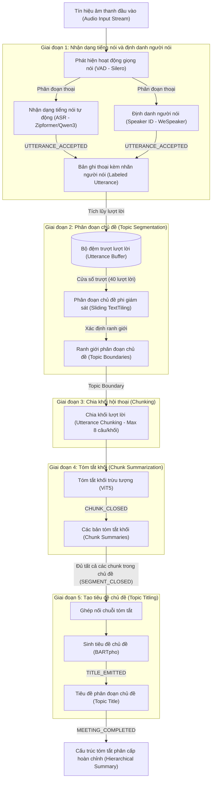
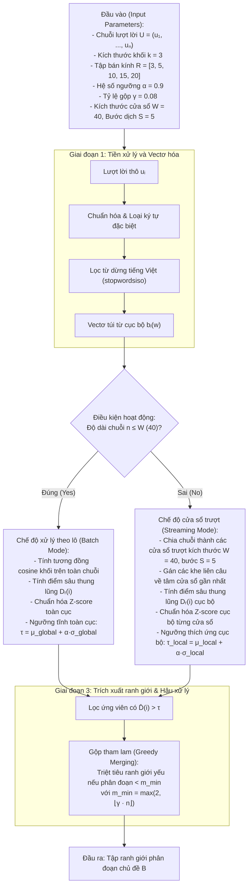
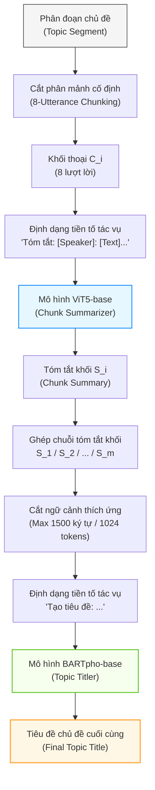

# XÂY DỰNG HỆ THỐNG TÓM TẮT CUỘC HỌP TIẾNG VIỆT THEO THỜI GIAN THỰC SỬ DỤNG PHÂN ĐOẠN CHỦ ĐỀ VÀ MÔ HÌNH SINH PHÂN CẤP

## Đặc tả Dự án (Project Specification)

**Tóm tắt (Abstract)**

Các cuộc họp trực tuyến và họp nội bộ hàng ngày đã trở thành phương thức giao tiếp thiết yếu trong hoạt động của các doanh nghiệp hiện nay. Tuy nhiên, việc khai thác thông tin tự động hiện tại vẫn đối mặt với các hạn chế kỹ thuật rõ rệt: tỷ lệ lỗi từ (word error rate - WER) cao của nhận dạng tiếng nói tự động (automatic speech recognition - ASR) trong môi trường nhiều tiếng ồn và chồng chéo giọng nói; sự thiếu hụt cơ chế định danh người nói (speaker identification) trong thời gian thực; sai số phân đoạn lớn khi chủ đề chuyển dịch liên tục và không có ranh giới rõ ràng; cũng như hiện tượng mất mát thông tin (lost-in-the-middle) hoặc vượt giới hạn ngữ cảnh của các mô hình tóm tắt đối với hội thoại dài.  Để giải quyết những thách thức này, nghiên cứu này trình bày việc thiết kế và triển khai một quy trình (pipeline) tóm tắt cuộc họp tiếng Việt theo thời gian thực, xử lý trực tiếp từ luồng âm thanh đầu vào (streaming audio) qua ba giai đoạn liên kết chặt chẽ: ASR, định danh người nói và tóm tắt phân cấp (hierarchical summarization). Đầu tiên, luồng tín hiệu âm thanh được giải mã thành văn bản bằng  Zipformer kết hợp định danh người nói qua mô hình WeSpeaker ResNet34 để gán nhãn hội thoại. Dựa trên luồng câu thoại có nhãn người nói này, hệ thống áp dụng giải thuật phân đoạn chủ đề cửa sổ trượt đa quy mô (multi-scale sliding TextTiling) phi giám sát nhằm phát hiện các ranh giới chuyển dịch chủ đề. Cuối cùng, các phân đoạn chủ đề được chia nhỏ thành các khối lượt lời (chunk) để tiến hành tóm tắt qua mô hình ViT5 tinh chỉnh (fine-tuned ViT5) và sinh tiêu đề chủ đề (topic titles) thông qua mô hình BARTpho. Nhằm tối ưu hóa hiệu năng luồng, hệ thống vận hành theo cơ chế xử lý tăng dần với độ trễ xác nhận (confirmation delay) dựa trên năm loại sự kiện đầu ra. Kết quả thực nghiệm cho thấy khâu ASR và định danh người nói đạt hiệu năng ổn định trên thiết bị cục bộ với kết quả thử nghiệm thực tế tương ứng là x, y, z. Trên sáu bộ dữ liệu phân đoạn chủ đề, thuật toán đề xuất đạt điểm số $F_1$ trung bình là 0,1838, chỉ số $P_k$ trung bình là 0,5034 và chỉ số WindowDiff trung bình là 0,5413. Đối với tác vụ tóm tắt khối và tạo tiêu đề trên bộ dữ liệu AliMeeting4MUG_vi, mô hình ViT5 đạt điểm số ROUGE-L là 0,5486, trong khi mô hình BARTpho đạt điểm ROUGE-Max-L là 0,4443. Thực nghiệm cho thấy tính khả thi ở cấp độ thành phần (component-level feasibility) của quy trình liên kết từ tín hiệu giọng nói đến văn bản tóm tắt phân cấp, đặt nền tảng cho các ứng dụng quản lý họp trực tuyến tự động.

**Từ khóa:** Tóm tắt cuộc họp; Phân đoạn chủ đề; Sliding TextTiling.

## Mở đầu (Introduction)

Các cuộc họp trực tuyến và họp nội bộ hàng ngày đã trở thành phương thức giao tiếp thiết yếu trong hoạt động của các doanh nghiệp hiện đại, tạo ra khối lượng lớn dữ liệu âm thanh và bản ghi lời thoại (transcript) cần được lưu trữ và quản lý [@Carletta2005, @Janin2003, @Asthana2025Recap]. Việc khai thác thông tin từ các cuộc họp này đóng vai trò quan trọng trong việc lưu giữ tri thức doanh nghiệp và hỗ trợ quá trình ra quyết định. Tuy nhiên, việc ghi chép và tóm tắt cuộc họp thủ công đòi hỏi chi phí nhân lực lớn, đồng thời dễ gặp sai sót và thiếu tính đồng bộ. Sự chuyển dịch ghi chép và tóm tắt cuộc họp thủ công hướng tới tự động hóa quy trình phân tích hội thoại phản ánh nhu cầu cấp thiết về một hệ thống tích hợp có khả năng xử lý trực tiếp từ luồng tín hiệu giọng nói sang các văn bản tóm tắt có cấu trúc rõ ràng.

Để xây dựng một hệ thống tự động hoàn chỉnh đi trực tiếp từ tín hiệu âm thanh đầu vào cho đến văn bản tóm tắt cuộc họp (meeting summary) đầu ra, khâu nhận dạng tiếng nói tự động (automatic speech recognition - ASR) [@Yao2023Zipformer, @Chu2024Qwen2Audio] và khâu định danh người nói (speaker identification) [@Chen2022WeSpeaker] đóng vai trò là những bước nền móng đầu tiên. Cụ thể, khâu nhận dạng (ASR) chịu trách nhiệm chuyển đổi giọng nói thành chữ viết, trong khi khâu định danh người nói xác định danh tính của từng người phát ngôn tại mỗi thời điểm nhờ bộ phát hiện hoạt động giọng nói (voice activity detection - VAD) [@SileroVAD2021]. Sự phối hợp này tạo ra một bản ghi lời thoại được gắn nhãn người phát ngôn hoàn chỉnh, làm tiền đề cốt lõi để khâu tóm tắt phía sau có thể phân tích diễn biến cuộc họp và tạo sinh ra bản tóm tắt chủ đề chuẩn xác.

Tuy nhiên, việc triển khai khâu nhận dạng tiếng nói (ASR) và khâu định danh người nói chạy thời gian thực vẫn đối mặt với nhiều hạn chế kỹ thuật rõ rệt. Các mô hình nhận dạng tiếng nói tự động thường gặp sai số lớn (tỷ lệ lỗi từ - WER cao) khi xử lý âm thanh hội thoại thực tế chứa nhiều tạp âm, tiếng ồn môi trường và hiện tượng chồng chéo giọng nói giữa các thành viên. Đồng thời, phần lớn các giải pháp định danh người nói hiện tại hoạt động theo cơ chế ngoại tuyến (offline), đòi hỏi phải quan sát toàn bộ tệp âm thanh và thiếu khả năng đăng ký cũng như nhận diện người nói động theo thời gian thực [@Anguera2012Speaker, @Park2022Review].

Bên cạnh thách thức về xử lý tín hiệu âm thanh, việc tóm tắt các bản ghi hội thoại dài cũng gặp phải rào cản lớn về mặt xử lý văn bản. Bản ghi lời thoại cuộc họp thường có độ dài lớn, văn phong rời rạc, lặp ý và hiện tượng dịch chuyển chủ đề liên tục [@Zhong2021]. Việc xử lý trực tiếp toàn bộ văn bản hội thoại qua một mô hình ngôn ngữ lớn (large language model - LLM) đơn lẻ thường gặp trở ngại do giới hạn chiều dài ngữ cảnh (context window) đầu vào, đồng thời dễ dẫn đến tình trạng suy giảm hiệu năng thu nhận thông tin (lost-in-the-middle) và bỏ sót các nội dung quan trọng [@Liu2024Lost]. Để khắc phục vấn đề này, các phương pháp tiếp cận phân cấp thường chia văn bản hội thoại thành các phân đoạn chủ đề (topic segments) để tiến hành tóm tắt độc lập từng phần nhỏ, sau đó tổng hợp các tóm tắt trung gian thành một báo cáo phân cấp hoàn chỉnh.

Mặc dù vậy, các phương pháp phân đoạn chủ đề và tóm tắt hiện tại vẫn tồn tại những nhược điểm chưa được giải quyết triệt để. Các giải thuật phân đoạn phi giám sát truyền thống như TextTiling [@Hearst1997] dựa trên tần suất từ vựng dạng túi từ (bag-of-words) có tốc độ tính toán nhanh nhưng hoàn toàn không nhận diện được các mối quan hệ ngữ nghĩa sâu, dẫn đến điểm lỗi phân đoạn ($P_k$ [@Beeferman1999] và WindowDiff [@Pevzner2002]) cao. Ngược lại, các mô hình học sâu có giám sát tuy đạt độ chính xác ranh giới tốt [@Xing2021, @He2024] nhưng đòi hỏi chi phí tính toán GPU rất cao ở việc suy luận và không thể áp dụng cho xử lý dạng luồng (streaming) liên tục do yêu cầu phải quan sát toàn bộ ngữ cảnh. Đối với bước tóm tắt, việc sử dụng các mô hình tạo sinh lớn trên đám mây gây tốn kém chi phí vận hành và không đảm bảo tính bảo mật dữ liệu doanh nghiệp, trong khi việc tinh chỉnh các mô hình ngôn ngữ nhỏ cục bộ thường đòi hỏi nguồn dữ liệu song ngữ chất lượng cao vốn rất khan hiếm đối với tiếng Việt [@Phan2022, @Nguyen2022].

Trong luận văn này, chúng tôi giải quyết những khoảng trống công nghệ trên bằng cách giới thiệu một quy trình (pipeline) tóm tắt cuộc họp tiếng Việt thời gian thực toàn diện, hỗ trợ đầu vào trực tiếp từ luồng âm thanh đầu vào (ASR -> Speaker Identification -> Hierarchical Summarization). Các đóng góp chính của chúng tôi bao gồm:

1. Chúng tôi thiết kế và triển khai một quy trình tóm tắt cuộc họp phân cấp thời gian thực (real-time hierarchical meeting summarization pipeline) hoàn chỉnh từ đầu vào âm thanh đến văn bản tóm tắt đầu ra, vận hành theo cơ chế đẩy dữ liệu hướng sự kiện (event-driven streaming) giúp liên tục cập nhật tăng dần (incremental update) các kết quả trung gian lên giao diện người dùng theo thời gian thực.
2. Chúng tôi đề xuất giải thuật phân đoạn chủ đề cửa sổ trượt đa quy mô (multi-scale sliding TextTiling) phi giám sát mới — một cải tiến trực tiếp trên thuật toán TextTiling gốc nhằm hỗ trợ tối ưu cho chế độ truyền luồng dữ liệu (streaming) — dựa trên việc tích hợp cơ chế cửa sổ trượt và điểm độ sâu đa bán kính (multi-radius depth scoring), giúp tăng đáng kể độ chính xác ranh giới trong khi vẫn giữ nguyên tốc độ xử lý.
3. Chúng tôi tinh chỉnh và phát hành bộ đôi mô hình tạo sinh sau tinh chỉnh (specialized fine-tuned generative models) gọn nhẹ cho nhiệm vụ tóm tắt và sinh tiêu đề: mô hình ViT5-base (226 triệu tham số) chuyên trách tóm tắt các khối lượt lời ngắn (chunk) và mô hình BARTpho-syllable-base (132 triệu tham số) chuyên trách tạo sinh tiêu đề chủ đề từ các tóm tắt trung gian.
4. Chúng tôi xây dựng bộ dữ liệu AliMeeting4MUG_vi dành riêng cho nhiệm vụ tóm tắt hội thoại phân cấp tiếng việt bằng cách dịch thuật từ bộ dữ liệu gốc AliMeeting MUG [@Zhang2023MUG] thông qua mô hình tencent/Hy-MT2-1.8B kết hợp hiệu đính thủ công, cung cấp một nguồn tài nguyên học thuật quý giá cho cộng đồng.
5. Chúng tôi thực hiện đánh giá thực nghiệm đa dạng và thử nghiệm benchmark chi tiết (comprehensive experimental evaluation) bao gồm: đo lường tỷ lệ lỗi từ (WER) của khâu nhận dạng tiếng nói (ASR) và độ chính xác định danh người nói; so sánh hiệu năng thuật toán phân đoạn chủ đề đề xuất với 4 phương pháp đối chứng trên 6 bộ dữ liệu; kiểm thử chất lượng tóm tắt khối và sinh tiêu đề của mô hình ViT5 và BARTpho theo thang điểm ROUGE; đồng thời đánh giá độ trễ và mức độ tiêu thụ bộ nhớ (VRAM/CPU) trong thực tế của toàn bộ hệ thống.

---
## Nghiên cứu liên quan (Related Work)

### Các phương pháp nhận dạng tiếng nói và định danh người nói (Automatic Speech Recognition and Speaker Diarization Methods)

Để thực hiện tóm tắt các cuộc họp trực tiếp theo thời gian thực, khâu nhận dạng tiếng nói tự động (Automatic Speech Recognition - ASR) và khâu định danh người nói (speaker diarization hoặc speaker identification) đóng vai trò là lớp giao diện thu nhận thông tin đầu vào tối quan trọng. Về nhận dạng tiếng nói, các kiến trúc đã dịch chuyển từ các mô hình dựa trên Connectionist Temporal Classification (CTC) sang các mô hình dựa trên mạng mạng Transducer (RNN-Transducer) và các kiến trúc Attention-based Encoder-Decoder (AED) [@Vaswani2017, @Wolf2020]. Trong khi các mô hình CTC có độ trễ cực thấp nhưng bị hạn chế trong việc mô hình hóa sự phụ thuộc giữa các từ, và các mô hình AED (như Whisper hay Qwen2-Audio [@Chu2024Qwen2Audio]) đạt hiệu quả ngữ nghĩa cao nhưng thường gặp độ trễ lớn và rủi ro bị ảo giác lặp từ trong suy luận dạng luồng trực tiếp, thì các mô hình Transducer dạng lượng tử hóa như Zipformer [@Yao2023Zipformer] đã chứng minh được sự tối ưu vượt trội về cả tốc độ suy luận lẫn độ chính xác khi triển khai trên thiết bị (on-device).

Về định danh người nói, nhiệm vụ cốt lõi là xác định danh tính và phân tách lượt nói của từng thành viên tham gia hội thoại [@Anguera2012Speaker]. Các phương pháp truyền thống chủ yếu dựa trên các bộ trích xuất đặc trưng âm học kết hợp với các thuật toán phân cụm không giám sát ngoại tuyến (offline clustering) như phân cụm phân cấp tích lũy (Agglomerative Hierarchical Clustering - AHC) hay phân cụm phổ (Spectral Clustering) [@Park2022Review]. Tuy nhiên, các kỹ thuật này yêu cầu phải thu thập toàn bộ bản ghi âm cuộc họp trước khi xử lý, do đó không thể ứng dụng trong chế độ dạng luồng. Sự phát triển của các bộ công cụ học sâu hiện đại như WeSpeaker [@Chen2022WeSpeaker] sử dụng các kiến trúc mạng ResNet34 tiền huấn luyện trên các kho dữ liệu giọng nói khổng lồ như VoxCeleb đã cho phép trích xuất các vectơ nhúng người nói (speaker embeddings) dày đặc có tính biểu diễn cực kỳ mạnh mẽ. Nhờ đó, việc đối sánh độ tương đồng cosine tăng dần trực tiếp tại thời gian thực trở nên khả thi thông qua các cơ chế đăng ký động (dynamic registration) và các ngưỡng quyết định tối ưu (ví dụ $\theta_{\text{spk}} = 0.88$).

Mặc dù các cấu hình ASR và định danh người nói độc lập đã đạt nhiều tiến bộ, thách thức lớn nhất của các hệ thống trực tuyến hiện nay là việc tích hợp đồng thời hai khâu này thành một đường ống xử lý thống nhất chạy cục bộ (on-device joint pipeline) để vừa đảm bảo độ trễ thấp, vừa bảo mật dữ liệu cuộc họp [@Chu2024Qwen2Audio]. Đề tài này giải quyết khoảng trống đó bằng cách đề xuất một khâu tiếp nhận kết hợp Silero VAD [@SileroVAD2021] làm nhiệm vụ lọc hoạt động giọng nói, mô hình Offline Zipformer/Qwen3 ASR giải mã chữ viết, và mô hình WeSpeaker ResNet34 định danh người nói động nhằm sinh ra dòng câu thoại (utterances stream) ổn định cung cấp cho các module tiếp theo.

### Tóm tắt văn bản và hội thoại (Text and Dialogue Summarization)

Tóm tắt văn bản (text summarization) hướng tới việc tạo ra một phiên bản ngắn hơn của văn bản đầu vào (input) trong khi vẫn nỗ lực bảo toàn các thông tin cốt lõi của tài liệu gốc. Các phương pháp tiếp cận chủ yếu được chia thành hai nhóm chính: phương pháp trích xuất (extractive methods) thực hiện lựa chọn các câu hoặc cụm từ có sẵn từ văn bản nguồn; và phương pháp sinh tạo (abstractive methods) tạo ra chuỗi văn bản mới mang tính diễn đạt cô đọng hơn. Các mô hình sinh tạo dựa trên kiến trúc Transformer [@Vaswani2017] đã đạt được chất lượng ngôn ngữ tự nhiên vượt trội, song vẫn phải đối mặt với rủi ro xảy ra hiện tượng ảo giác thông tin (hallucination) và sự phụ thuộc lớn vào dữ liệu huấn luyện. Điển hình cho hướng tiếp cận sinh tạo dựa trên văn bản-văn bản (text-to-text) là kiến trúc T5 [@Raffel2020] và biến thể tiếng Việt ViT5 [@Phan2022], cũng như kiến trúc BART [@Lewis2020] và biến thể tiếng Việt BARTpho [@Nguyen2022] vốn cực kỳ phù hợp cho các tác vụ sinh tiêu đề hoặc chuỗi văn bản ngắn.

Đối với môi trường hội thoại, việc tóm tắt cuộc họp (meeting summarization) thể hiện độ phức tạp cao hơn đáng kể so với tóm tắt tài liệu đơn tác giả (single-document/single-author documents). Trong các cuộc họp, thông tin quan trọng thường không nằm tập trung mà được hình thành gián tiếp qua nhiều lượt nói (turns) mang tính tương tác xã hội: một thành viên đề xuất ý kiến, các thành viên khác phản biện, thảo luận và đi đến thống nhất phương án ở cuối phiên hội thoại [@Zhong2021]. Do đó, một câu thoại (utterance) riêng lẻ thường không chứa đựng đầy đủ ngữ cảnh để tóm tắt. Một bản tóm tắt cuộc họp hữu ích cần phản ánh được trình tự thời gian và cấu trúc chủ đề của phiên thảo luận, thay vì chỉ đơn thuần xếp hạng hoặc trích xuất các câu độc lập.

Tuy nhiên, khi đối mặt với các tài liệu hội thoại dài, các mô hình ngôn ngữ lớn thường gặp hiện tượng suy giảm hiệu năng nghiêm trọng ở giữa ngữ cảnh (lost-in-the-middle phenomenon) [@Liu2024Lost] và chi phí tính toán tăng vọt do độ phức tạp bình phương của cơ chế tự chú ý (self-attention). Để giải quyết thách thức này, nghiên cứu này kế thừa ý tưởng thiết kế hệ thống tóm tắt phân cấp (hierarchical recap) [@Asthana2025Recap], chia nhỏ cuộc họp thành các khối hội thoại (chunks) có độ dài tối đa 8 câu thoại (utterances) và tóm tắt từng khối bằng mô hình ViT5 [@Phan2022]. Các tóm tắt khối sau đó đóng vai trò là biểu diễn ngữ cảnh cô đọng để mô hình BARTpho [@Nguyen2022] sinh tiêu đề khái quát cho từng phân đoạn chủ đề thảo luận. Thiết kế phân tách này giúp hệ thống xử lý được các cuộc họp dài mà không bị giới hạn ngữ cảnh hay suy giảm chất lượng sinh văn bản.

### Phân đoạn chủ đề và xử lý dữ liệu dạng luồng trong hội thoại (Topic Segmentation and Streaming Processing in Dialogue)

Phân đoạn chủ đề (topic segmentation) là tác vụ chia chuỗi đơn vị ngôn ngữ liên tục thành các vùng nội dung liên tiếp có tính nhất quán tương đối về ngữ nghĩa. Thuật toán TextTiling kinh điển của Hearst [@Hearst1997] vận hành dựa trên giả định rằng các phân đoạn có cùng chủ đề sẽ chia sẻ chung một vốn từ vựng cụ thể, và độ tương đồng từ vựng (lexical similarity) sẽ suy giảm rõ rệt tại các điểm chuyển giao chủ đề. Phương pháp này tính toán chuỗi điểm tương đồng giữa các khối từ vựng lân cận, xác định các điểm cực tiểu cục bộ (các "thung lũng" tương đồng) và lựa chọn vị trí có điểm sâu (depth score) cao vượt ngưỡng để thiết lập ranh giới chủ đề (topic boundaries).

Các phương pháp phân đoạn dựa trên từ vựng sở hữu ưu điểm nổi bật về tốc độ xử lý nhanh, khả năng giải thích rõ ràng và không yêu cầu dữ liệu gán nhãn để huấn luyện. Tuy nhiên, hạn chế lớn nhất là khó nhận biết các từ đồng nghĩa hoặc các cách diễn đạt khác nhau nhưng cùng hướng về một thực thể ngữ nghĩa, đồng thời dễ bị ảnh hưởng bởi nhiễu trong các câu thoại ngắn của hội thoại thường nhật. Để khắc phục vấn đề này, Xing và Carenini [@Xing2021] đã chỉ ra rằng độ mạch lạc (coherence) giữa các cặp câu thoại (utterance pairs) có thể cung cấp thêm tín hiệu ngữ nghĩa hữu ích cho tác vụ phân đoạn hội thoại. Việc tích hợp các mô hình học sâu (deep learning) như Sentence-BERT giúp cải thiện ngữ nghĩa đáng kể nhưng lại làm gia tăng chi phí suy luận (inference cost) tại thời gian thực. Gần đây hơn, He và các cộng sự [@He2024] đã đề xuất chuyển đổi nhiệm vụ phân đoạn hội thoại thành bài toán phát hiện vật thể một chiều (One-Dimensional Object Detection - 1DOD) giúp nâng cao độ chính xác đáng kể nhờ tối ưu hóa trực tiếp trên các ranh giới chủ đề.

Xây dựng trên những nền tảng này, phương pháp xử lý dữ liệu dạng luồng (streaming data processing) cho phép hệ thống liên tục tính toán và xuất các kết quả tóm tắt trung gian trước khi phiên họp kết thúc. So với cơ chế xử lý theo lô (batch processing) truyền thống vốn yêu cầu toàn bộ dữ liệu âm thanh phải được thu thập đầy đủ trước khi xử lý, cơ chế dạng luồng giúp giảm thiểu đáng kể độ trễ phản hồi (latency) của hệ thống. Người dùng có thể tiếp cận trực tiếp các cấu trúc thông tin cập nhật tăng dần (incremental updates) ngay khi các khối hội thoại (chunks) hoặc phân đoạn (segments) vừa được hình thành trong tiến trình thời gian thực. Tuy nhiên, trong tác vụ phân đoạn hội thoại, một ranh giới chủ đề chỉ có thể được xác nhận một cách tin cậy sau khi hệ thống đã quan sát đủ một lượng ngữ cảnh nhất định ở phía sau (look-ahead context). Do đó, khái niệm "thời gian thực" (real-time) trong nghiên cứu này được định nghĩa là quá trình xử lý và xuất kết quả tăng dần theo dòng chảy thông tin, chứ không phải là việc phát hiện ranh giới chủ đề ngay lập tức tại thời điểm phát sinh câu thoại (utterance). Hệ thống sẽ thực hiện truyền tải dữ liệu và công bố kết quả khi phân đoạn hoặc khối hội thoại đã chính thức đóng lại, đảm hình tính bất biến (immutability) của các thông tin trung gian đã công bố.

### Các bộ dữ liệu và chỉ số đánh giá hội thoại (Dialogue Corpora and Evaluation Metrics)

Việc phát triển các bộ dữ liệu chuyên biệt phục vụ cho các tác vụ hội thoại đóng vai trò quyết định trong việc tinh chỉnh và đánh giá các hệ thống AI. Trong khi các nghiên cứu trước đây chủ yếu dựa vào các bộ dữ liệu cuộc họp tiếng Anh kinh điển như AMI Meeting Corpus [@Carletta2005] chứa các cuộc họp thiết kế sản phẩm giả lập, hoặc ICSI Meeting Corpus [@Janin2003] ghi lại các cuộc họp học thuật thực tế, thì các hệ thống tóm tắt hiện đại yêu cầu dữ liệu có tính đa miền và cấu trúc phức tạp hơn. Bộ dữ liệu QMSum [@Zhong2021] cung cấp một điểm chuẩn lớn cho tóm tắt cuộc họp dựa trên truy vấn trên nhiều lĩnh vực (học thuật, ủy ban quốc hội, sản phẩm). Để đánh giá sự dịch chuyển chủ đề và phân đoạn, các khung làm việc như Doc2Dial [@Feng2020] hay bộ dữ liệu định hướng dịch chuyển chủ đề TIAGE [@TIAGE2021] cung cấp các tài nguyên quan trọng để kiểm thử khả năng bám đuổi ngữ cảnh của mô hình. Gần đây, điểm chuẩn MUG (Meeting Understanding and Generation) [@Zhang2023MUG] đã thiết lập một hệ thống đánh giá toàn diện tích hợp cả phân đoạn, tóm tắt và trích xuất thông tin cuộc họp. Trong nghiên cứu này, chúng tôi thực hiện dịch và tiền xử lý các bộ dữ liệu này sang tiếng Việt để huấn luyện và đánh giá các mô hình phân đoạn và tóm tắt một cách nhất quán.

Để đánh giá chất lượng phân đoạn chủ đề trên các bộ dữ liệu này, chỉ số $P_k$ [@Beeferman1999] thực hiện đo đạc xác suất mà hai vị trí cách nhau một khoảng cửa sổ trượt bị phân loại sai về quan hệ cùng hoặc khác phân đoạn chủ đề. Chỉ số WindowDiff [@Pevzner2002] đếm sự khác biệt về số lượng ranh giới xuất hiện trong cửa sổ trượt, từ đó khắc phục một số hạn chế cố hữu của chỉ số $P_k$ (như hiện tượng phạt quá nặng đối với các sai số nhỏ về vị trí ranh giới). Cả hai chỉ số này đều có giá trị càng thấp càng tốt. Đối với đánh giá ranh giới (boundary evaluation), một ranh giới chủ đề dự đoán được xác định là khớp một-một với ranh giới tham chiếu (ground truth) khi nó nằm trong một phạm vi cửa sổ dung sai (tolerance window) nhất định. Trên cơ sở đó, các chỉ số độ chính xác ($P$), độ triệu hồi ($R$) và điểm $F_1$-score được tính toán như sau:

$$
P = \frac{\text{TP}}{\text{TP} + \text{FP}}, \quad R = \frac{\text{TP}}{\text{TP} + \text{FN}}, \quad F_1 = 2 \cdot \frac{P \cdot R}{P + R}
$$

Trong đó, điểm $F_1$ có giá trị càng cao càng tốt. Do các chỉ số này phụ thuộc trực tiếp vào kích thước cửa sổ dung sai và chiến lược ghép biên, báo cáo thực nghiệm bắt buộc phải sử dụng chung một mã nguồn đánh giá nhất quán cho mọi phương pháp để đảm bảo tính khách quan; các giá trị này không nên được diễn giải như kết quả khớp chính xác phân đoạn (exact-span matching).

Đối với tác vụ tóm tắt và tạo tiêu đề, chỉ số ROUGE (Recall-Oriented Understudy for Gisting Evaluation) [@Lin2004] được sử dụng để đánh giá độ trùng lặp các cụm từ hoặc chuỗi con chung dài nhất giữa văn bản sinh ra và văn bản tham chiếu. Cụ thể, chỉ số ROUGE-1 phản ánh mức độ trùng lặp của các từ đơn (unigrams), ROUGE-2 phản ánh các từ đôi (bigrams), và ROUGE-L dựa trên độ dài của chuỗi con chung dài nhất (Longest Common Subsequence - LCS). Ngoài ra, chỉ số BERTScore [@Zhang2020] tận dụng các vectơ nhúng ngữ cảnh từ mô hình BERT để đánh giá độ tương đồng ngữ nghĩa sâu giữa văn bản sinh tạo và văn bản tham chiếu, giúp giảm bớt sự phụ thuộc vào việc khớp từ vựng bề mặt. Trong bối cảnh đánh giá tiêu đề với nhiều tiêu đề tham chiếu hợp lệ của con người, đề tài sử dụng phương pháp tính ROUGE lớn nhất (ROUGE-Max): điểm số ROUGE được tính riêng biệt với từng tiêu đề tham chiếu, sau đó lấy giá trị lớn nhất. Phương pháp này chấp nhận tính đa dạng và hợp lệ của các cách đặt tiêu đề khác nhau, song có thể mang lại kết quả đánh giá lạc quan hơn so với phương pháp tính điểm trung bình.

## Phương pháp luận (Methodology)

### Quy trình tổng thể (Overall Pipeline)

Quy trình hoạt động tổng thể của hệ thống tóm tắt cuộc họp phân cấp từ luồng âm thanh đầu vào (audio stream) đến cấu trúc tóm tắt phân cấp đầu ra được thiết kế theo cơ chế cuộn chiếu từ dưới lên (Bottom-Up Roll-up). Hệ thống phân tách toàn bộ quá trình thành 5 giai đoạn chức năng liên kết chặt chẽ với nhau:

**Hình 1. Quy trình tổng thể của hệ thống tóm tắt phân cấp**

Mỗi giai đoạn trong đường ống xử lý (pipeline) tổng thể ở Hình 1 vận hành như một module độc lập với các đặc tả về chức năng, đầu vào và đầu ra rõ ràng:

**Giai đoạn 1: Nhận dạng tiếng nói và định danh người nói (Automatic Speech Recognition and Speaker Identification)**
Quy trình tiếp nhận và xử lý tín hiệu âm thanh hội thoại liên tục được thực hiện nhằm chuyển đổi giọng nói thành văn bản gắn nhãn người phát ngôn tương ứng. Đầu vào của giai đoạn này là luồng tín hiệu âm thanh liên tục $A(t)$ được thu nhận trực tiếp từ thiết bị. Luồng âm thanh sau đó được xử lý bởi mô hình phát hiện hoạt động giọng nói (Voice Activity Detection - VAD) sử dụng công cụ Silero VAD để phân tách thành tập hợp các phân đoạn tiếng nói chứa giọng nói $S = (s_1, s_2, \dots, s_n)$. Mỗi phân đoạn tiếng nói $s_i$ sau đó được đưa vào hai nhánh giải mã song song. Nhánh thứ nhất thực hiện nhận dạng tiếng nói tự động (Automatic Speech Recognition - ASR) bằng kiến trúc Zipformer để trích xuất nội dung văn bản tương ứng $t_i = \text{ASR}(s_i)$ ở chế độ giải mã ngoại tuyến cấp phân đoạn (segment-level offline decoding). Nhánh thứ hai thực hiện trích xuất vectơ nhúng đặc trưng người nói (speaker embedding) thông qua kiến trúc WeSpeaker ResNet34 và tiến hành đối sánh độ tương đồng cosine (cosine similarity) để gán nhãn danh tính người phát ngôn $p_i = \text{SpeakerID}(s_i)$. Kết quả đầu ra của giai đoạn này là một phân đoạn câu thoại hoàn chỉnh có nhãn người phát ngôn, được ký hiệu dưới dạng $u_i = (p_i, t_i)$ (utterance).

**Giai đoạn 2: Phân đoạn chủ đề hội thoại (Unsupervised Topic Segmentation)**
Giai đoạn này chịu trách nhiệm phát hiện các điểm dịch chuyển chủ đề trong dòng hội thoại liên tục để phân chia cuộc họp thành các phần nội dung độc lập. Đầu vào là luồng câu thoại liên tục $U = (u_1, u_2, \dots, u_N)$ thu được từ giai đoạn trước.
Hệ thống thực hiện phân đoạn chủ đề phi giám sát (unsupervised topic segmentation) thông qua thuật toán **Sliding TextTiling** cải tiến trực tiếp từ thuật toán TextTiling gốc của Hearst [@Hearst1997]. Thuật toán đề xuất cải tiến cơ chế so khớp từ vựng truyền thống bằng cách tích hợp cơ chế cửa sổ trượt (sliding window) kết hợp tính toán điểm sâu thung lũng tích hợp đa bán kính quan sát (multi-radius integrated depth score) nhằm tối ưu hóa việc phát hiện ranh giới chủ đề trên dữ liệu hội thoại truyền luồng (streaming data). Quá trình phân tích độ tương đồng từ vựng được thực hiện giữa các khối cửa sổ trượt liên tiếp dựa trên biểu diễn túi từ (Bag-of-Words - BoW). Đầu ra của giai đoạn này là tập hợp các chỉ số ranh giới phân đoạn chủ đề $B = \{b_1, b_2, \dots, b_K\}$ (với $b_0 = 0$ và $b_K = N$). Từ tập ranh giới này, luồng câu thoại được chia thành $K$ phân đoạn chủ đề độc lập $S_k$:
$$S_k = \{u_i \mid b_{k-1} < i \le b_k\}, \quad k = 1, 2, \dots, K$$

**Giai đoạn 3: Phân khối lượt lời (Utterance Chunking)**
Để chuẩn bị dữ liệu đầu vào phù hợp cho mô hình tóm tắt và tránh hiện tượng vượt ngưỡng cửa sổ ngữ cảnh (context window overflow), từng phân đoạn chủ đề $S_k$ có độ dài $N_k = b_k - b_{k-1}$ câu thoại được tiến hành chia nhỏ tiếp thành các khối lượt lời (utterance chunks) liên tiếp và không chồng lấn.
Đầu vào là phân đoạn chủ đề $S_k$, và đầu ra là các khối lượt lời $C_{k, j}$ có kích thước tối đa được giới hạn ở $L_{\text{chunk}} = 8$ câu thoại. Công thức phân chia các khối lượt lời $C_{k, j}$ được định nghĩa như sau:
$$C_{k, j} = \{u_i \mid b_{k-1} + (j-1) \cdot L_{\text{chunk}} < i \le \min(b_{k-1} + j \cdot L_{\text{chunk}}, b_k)\}$$
trong đó $j = 1, 2, \dots, m_k$ là chỉ số khối lượt lời và $m_k = \lceil N_k / L_{\text{chunk}} \rceil$ đại diện cho tổng số khối của chủ đề $k$.

**Giai đoạn 4: Tóm tắt khối trừu tượng (Abstractive Chunk Summarization)**
Giai đoạn này thực hiện tạo sinh văn bản tóm tắt ngắn gọn dưới dạng trừu tượng cho từng khối lượt lời hội thoại độc lập. Đầu vào của mô hình là khối lượt lời $C_{k, j}$ thu được từ giai đoạn trước.
Để mô hình sinh tạo hiểu được cấu trúc hội thoại, khối lượt lời $C_{k, j}$ trước tiên được định dạng lại bằng cách ghép nối nhãn người nói và nội dung văn bản của từng câu thoại liên tiếp thành một chuỗi văn bản duy nhất $\tilde{C}_{k, j}$:
$$\tilde{C}_{k, j} = \text{Join}(\{ p_i \mathbin{\Vert} ``: " \mathbin{\Vert} t_i \mid u_i = (p_i, t_i) \in C_{k, j} \}, ``\backslash n")$$
Hệ thống tự động thêm tiền tố tác vụ (task prefix) `"Tóm tắt: "` vào đầu văn bản đã định dạng, sau đó đưa chuỗi dữ liệu này qua mô hình ngôn ngữ **ViT5** (phiên bản ViT5-base) đã được tinh chỉnh (fine-tuned) trên bộ dữ liệu AliMeeting4MUG_vi để thực hiện tóm tắt trừu tượng (abstractive summarization) và sinh ra một câu tóm tắt ngắn gọn tương ứng:
$$q_{k, j} = \text{ViT5}(\text{Concat}(``\text{Tóm tắt: }", \tilde{C}_{k, j}))$$
trong đó $q_{k, j}$ đại diện cho nội dung tóm tắt đầu ra của khối thứ $j$ thuộc chủ đề $k$.

**Giai đoạn 5: Tạo tiêu đề phân đoạn chủ đề (Topic Titling)**
Tại giai đoạn cuối cùng, hệ thống tiến hành tạo nhãn tiêu đề đại diện khái quát cho toàn bộ phân đoạn chủ đề lớn. Đầu vào là tất cả các câu tóm tắt khối $q_{k, j}$ thuộc cùng một phân đoạn chủ đề $S_k$.
Các câu tóm tắt khối này được thu thập và ghép nối tuần tự với nhau bằng chuỗi ký tự phân tách `" / "`. Nhằm bảo đảm an toàn cho cửa sổ tự chú ý (self-attention window) của mô hình sinh và loại bỏ nhiễu ngữ cảnh, văn bản ghép nối được thực hiện cắt chuỗi giới hạn độ dài (length truncation) bằng cách giữ lại tối đa $L_{\text{char\_max}} = 1500$ ký tự cuối cùng. Chuỗi văn bản sau khi làm sạch ngữ cảnh được đưa vào mô hình **BARTpho** đã tinh chỉnh để sinh ra tiêu đề chủ đề $h_k$ tương ứng:
$$h_k = \text{BARTpho}(\text{Concat}(``\text{Tạo tiêu đề: }", \text{Suffix}(\text{Join}(\{q_{k, 1}, q_{k, 2}, \dots, q_{k, m_k}\}, ``\text{ / }"), L_{\text{char\_max}})))$$
trong đó $\text{Suffix}(X, L)$ đại diện cho hàm lấy chuỗi con chứa $L$ ký tự cuối cùng của chuỗi $X$.

Kết quả đầu ra cuối cùng của toàn bộ đường ống xử lý (pipeline) là một cấu trúc tóm tắt phân cấp hoàn chỉnh (complete hierarchical summary structure) $R$ được định nghĩa bằng tập hợp các cặp tiêu đề chủ đề và danh sách tóm tắt khối tương ứng:
$$R = \left\{ \left( h_k, \{ q_{k, 1}, q_{k, 2}, \dots, q_{k, m_k} \} \right) \right\}_{k=1}^{K}$$
Cấu trúc này cho phép người dùng nhanh chóng nắm bắt bức tranh toàn cảnh của cuộc họp qua hệ thống tiêu đề chủ đề $h_k$, đồng thời dễ dàng truy xuất thông tin chi tiết qua chuỗi các câu tóm tắt khối $q_{k, j}$ tương ứng bên dưới.

### Khâu nhận dạng tiếng nói và định danh người nói thời gian thực (Real-time Speech Recognition and Speaker Identification)

[Hiện tại viết tạm sau này khi hoàn thành sẽ thay đổi]
Để hỗ trợ thu nhận và xử lý trực tiếp tín hiệu từ microphone trong cuộc họp, hệ thống triển khai tích hợp khâu nhận dạng tiếng nói tự động (Automatic Speech Recognition - ASR) và khâu định danh người nói (speaker identification). Quy trình xử lý tín hiệu âm thanh được thực hiện thông qua ba bước:

**Phát hiện hoạt động giọng nói (Voice Activity Detection - VAD):**
Hệ thống tiếp nhận luồng âm thanh thời gian thực định dạng số thực dấu phẩy động 32-bit (Float32) với tần số lấy mẫu 16 kHz từ phía khách (client) qua giao thức kết nối WebSocket. Bộ phát hiện hoạt động giọng nói Silero VAD được sử dụng với kích thước cửa sổ phân tích tĩnh mặc định là $w_{\text{VAD}} = 512$ mẫu (tương đương $32\text{ ms}$ ở tần số 16 kHz). Nhằm tối ưu hóa việc phân tách luồng âm thanh liên tục thành các đoạn thoại mang ngữ nghĩa và hạn chế độ trễ truyền dẫn, các siêu tham số của bộ VAD được thiết lập cụ thể bao gồm ngưỡng phát hiện giọng nói $\theta_{\text{VAD}} = 0{,}5$, độ dài khoảng lặng tối thiểu để chốt phân đoạn thoại $\tau_{\text{silence}} = 0{,}25\text{ s}$, độ dài câu thoại tối thiểu $\tau_{\text{speech\_min}} = 0{,}50\text{ s}$, và độ dài tối đa cho một phân đoạn thoại $\tau_{\text{speech\_max}} = 5{,}0\text{ s}$.

**Nhận dạng tiếng nói tự động (Automatic Speech Recognition - ASR):**
Các phân đoạn tiếng nói sau khi được chốt ranh giới bởi bộ Silero VAD sẽ được đưa vào mô hình Offline ASR để tiến hành giải mã (decoding). Hệ thống hỗ trợ cấu hình linh hoạt giữa hai kiến trúc mô hình nhận dạng chính. Đối với kiến trúc Transducer (Zipformer), hệ thống sử dụng mô hình `Zipformer-30M-RNNT-6000h` đã được lượng tử hóa số nguyên 8-bit (8-bit integer quantization) để tối ưu hóa hiệu năng tính toán. Quá trình giải mã áp dụng thuật toán tìm kiếm chùm cải tiến (modified beam search) để đạt hiệu năng giải mã tối ưu. Đối với kiến trúc sinh tự hồi quy (Qwen3-ASR), hệ thống sử dụng mô hình `sherpa-onnx-qwen3-asr-0.6B-int8-2026-03-25` được cấu hình ép ngôn ngữ đích là tiếng Việt (`vi`) với cơ chế giải mã tìm kiếm tham lam (greedy search). Hiệu năng nhận dạng của mô hình đạt độ chính xác và tốc độ cải thiện x, y, z.

**Định danh và đăng ký người nói động (Dynamic Speaker Identification and Registration):**
Song song với quá trình nhận dạng văn bản, mỗi phân đoạn tiếng nói được đưa qua mô hình trích xuất đặc trưng `wespeaker_en_voxceleb_resnet34_LM.onnx` để sinh ra một vectơ nhúng người nói $d$-chiều $e_{\text{new}}$. Vectơ này sau đó được chuẩn hóa $L_2$ theo công thức:
$$
\bar{e}_{\text{new}} = \frac{e_{\text{new}}}{\|e_{\text{new}}\|_2 + \varepsilon}
$$
trong đó $\varepsilon = 10^{-10}$ là hằng số chống chia cho không. Hệ thống duy trì một danh sách các người nói đã đăng ký trong phiên họp cùng vectơ nhúng đại diện chuẩn hóa tương ứng, ký hiệu là $S_{\text{reg}} = \{(n_i, \bar{e}_i)\}$. Đối với mỗi phân đoạn thoại mới, hệ thống tính toán độ tương đồng cosine (cosine similarity) giữa vectơ mới trích xuất $\bar{e}_{\text{new}}$ và tất cả các vectơ đại diện trong cơ sở dữ liệu đăng ký:
$$
\text{score}_i = \bar{e}_{\text{new}} \cdot \bar{e}_i
$$
Danh tính người phát ngôn được xác định theo quy tắc quyết định sau:
$$
\text{Speaker} = \begin{cases} 
n_{i^*}, & \text{nếu } \text{score}_{i^*} = \max_i (\text{score}_i) \ge \theta_{\text{spk}} \\
n_{\text{new}}, & \text{ngược lại}
\end{cases}
$$
trong đó ngưỡng đối sánh quyết định được thiết lập mặc định là $\theta_{\text{spk}} = 0{,}88$. Nếu độ tương đồng cao nhất vượt quá ngưỡng $\theta_{\text{spk}}$, phân đoạn thoại được gán nhãn cho người nói hiện hữu $n_{i^*}$. Ngược lại, hệ thống sẽ tự động khởi tạo nhãn danh tính mới $n_{\text{new}}$ (ví dụ: `"Speaker 02"`) và đăng ký vectơ nhúng $\bar{e}_{\text{new}}$ vào danh sách để đối sánh cho các câu thoại tiếp theo. Quy trình định danh này giúp hệ thống đạt độ chính xác x, y, z.

### Thuật toán Multi-Scale Sliding TextTiling (Multi-Scale Sliding TextTiling Algorithm)

Thuật toán phân đoạn TextTiling kinh điển của Hearst [@Hearst1997] được thiết kế cho việc phân đoạn văn bản viết dạng tĩnh (static text), yêu cầu quan sát toàn bộ tài liệu trước khi xác định ranh giới chủ đề. Hạn chế này khiến TextTiling gốc không thể áp dụng trực tiếp cho chế độ xử lý dạng luồng (streaming), nơi dữ liệu hội thoại liên tục được bổ sung theo thời gian thực. Ngoài ra, TextTiling gốc chỉ sử dụng một kích thước khối và một bán kính quan sát cố định duy nhất để tính điểm sâu (depth score), dẫn đến việc bỏ sót các chuyển đổi chủ đề xảy ra ở nhiều quy mô ngữ cảnh khác nhau — từ các chuyển đổi cục bộ ngắn giữa vài lượt lời cho đến các dịch chuyển chủ đề vĩ mô trải dài hàng chục lượt lời.

Để giải quyết các hạn chế này, chúng tôi đề xuất thuật toán Multi-Scale Sliding TextTiling — một phương pháp phân đoạn chủ đề phi giám sát (unsupervised) mở rộng trực tiếp từ TextTiling gốc, tích hợp ba cải tiến chính: (i) cơ chế cửa sổ trượt (sliding window) cho phép xử lý tăng dần trên luồng hội thoại liên tục, (ii) tổng hợp điểm sâu đa bán kính (multi-radius depth scoring) kết hợp chuẩn hóa Z-score để nhận biết chuyển đổi chủ đề ở nhiều quy mô ngữ cảnh, và (iii) ngưỡng thích ứng (adaptive thresholding) kết hợp gộp tham lam (greedy merging) để giảm hiện tượng quá phân mảnh (over-segmentation).

Xét luồng lượt lời đầu vào $U = (u_1, u_2, \dots, u_n)$ thu được từ giai đoạn nhận dạng tiếng nói và định danh người nói. Thuật toán đề xuất nhận đầu vào là chuỗi $U$ cùng các siêu tham số cấu hình, và xuất ra tập hợp các chỉ số ranh giới phân đoạn chủ đề $B = \{b_1, b_2, \dots, b_K\}$, phân chia $U$ thành $K$ phân đoạn chủ đề liên tiếp. Quy trình tổng quan của thuật toán được minh họa trong Hình 2 và trình bày chi tiết qua ba giai đoạn xử lý cốt lõi sau đây.

**Hình 2.** Sơ đồ chi tiết quy trình xử lý và điều kiện hoạt động của thuật toán Multi-Scale Sliding TextTiling. Thuật toán tự động phân nhánh giữa chế độ xử lý theo lô (Batch Mode, khi $n \le 40$) và chế độ cửa sổ trượt dạng luồng (Streaming Mode, khi $n > 40$) dựa trên độ dài chuỗi lượt thoại đầu vào, tích hợp các siêu tham số cấu hình tối ưu của hệ thống.

Để làm nổi bật các đóng góp cải tiến của nghiên cứu này, dưới đây là các phân tích đối chiếu chi tiết về những điểm tương đồng (bảo toàn nguyên lý cốt lõi) và điểm khác biệt (các cải tiến kỹ thuật cụ thể cho môi trường streaming) giữa giải thuật đề xuất và thuật toán TextTiling gốc.

**Bảng 2. Các đặc điểm tương đồng (giống nhau) giữa hai thuật toán**

| Đặc trưng kỹ thuật | Điểm chung thiết kế của hai thuật toán |
| :--- | :--- |
| **Mô hình biểu diễn cơ bản** | Đều sử dụng mô hình túi từ (Bag-of-Words - BoW) để số hóa tần suất xuất hiện của từ vựng từ văn bản đầu vào. |
| **Đo độ mạch lạc chủ đề** | Đều áp dụng độ tương đồng cosine (Cosine Similarity) làm phép toán đo lường mức độ liên kết từ vựng giữa các khối văn bản liền kề. |
| **Nguyên lý xác định ranh giới** | Đều tìm các khe chuyển dịch chủ đề tại các "thung lũng" độ tương đồng (local similarity valleys) thông qua việc đánh giá điểm sâu (depth score) của thung lũng đó so với các đỉnh xung quanh. |
| **Tính chất học máy** | Đều hoạt động theo cơ chế phi giám sát (unsupervised), không yêu cầu dữ liệu gán nhãn hay quy trình huấn luyện mô hình phức tạp, giúp tối ưu hóa tài nguyên tính toán. |

**Bảng 3. Các đặc điểm khác biệt (cải tiến) của thuật toán đề xuất**

| Đặc trưng kỹ thuật                           | TextTiling gốc [@Hearst1997]                                                                                                              | Multi-Scale Sliding TextTiling (đề xuất)                                                                                                                                |
| :------------------------------------------- | :---------------------------------------------------------------------------------------------------------------------------------------- | :---------------------------------------------------------------------------------------------------------------------------------------------------------------------- |
| **Phạm vi xử lý (Processing Scope)**         | **Toàn cục (Batch)**: Yêu cầu nạp toàn bộ văn bản tĩnh vào bộ nhớ để tính toán chuỗi độ tương đồng từ đầu đến cuối.                       | **Cục bộ dạng luồng (Streaming-ready)**: Sử dụng cơ chế cửa sổ trượt lân cận kích thước `window_size` (W = 40) trượt theo `stride` (S = 5).                             |
| **Đơn vị phân hoạch (Unit of Partitioning)** | **Khối từ vựng tĩnh**: Các đoạn từ vựng giả định (pseudo-sentences/paragraphs) có độ dài ký tự hoặc số từ cố định.                        | **Lượt thoại tự nhiên (Utterances)**: Lượt nói thực tế của người nói, bảo toàn cấu trúc ranh giới tương tác tự nhiên trong cuộc họp.                                    |
| **Độ ổn định số học**                        | **Cosine trực tiếp**: Dễ gặp lỗi chia cho không (division by zero) nếu khối sau khi tiền xử lý và lọc từ dừng bị rỗng.                    | **Cosine làm mịn**: Tích hợp hằng số $\varepsilon = 10^{-10}$ bảo vệ tính ổn định số học cho phép chia khi gặp khối rỗng.                                               |
| **Quy mô điểm sâu (Scoring Scale)**          | **Đơn bán kính quan sát**: Chỉ dùng một bán kính cố định duy nhất để tìm đỉnh tương đồng, dễ bỏ sót ranh giới ở các thang đo khác.        | **Đa quy mô (Multi-scale)**: Tính toán điểm sâu song song trên tập bán kính $R = \{3, 5, 10, 15, 20\}$ để bắt cả chuyển đổi cục bộ lẫn vĩ mô.                           |
| **Chuẩn hóa (Normalization)**                | **Không có**: Không cần chuẩn hóa do chỉ hoạt động trên một thang đo bán kính duy nhất.                                                   | **Z-score từng bán kính**: Đưa các mảng điểm sâu về cùng phân phối chuẩn $\mathcal{N}(0, 1)$ trước khi tính trung bình cộng $\bar{D}$.                                  |
| **Thiết lập ngưỡng (Thresholding)**          | **Ngưỡng tĩnh toàn cục**: Ngưỡng $\tau = \mu_{\text{global}} - \sigma_{\text{global}}$ áp dụng cố định và đồng nhất cho toàn bộ tài liệu. | **Ngưỡng thích ứng cục bộ**: Ngưỡng $\tau_{\text{local}} = \mu_{\text{local}} + \alpha \cdot \sigma_{\text{local}}$ cập nhật động theo diễn biến của từng cửa sổ trượt. |
| **Cơ chế hậu xử lý**                         | **Không hỗ trợ**: Xuất trực tiếp các ranh giới đạt ngưỡng nên dễ gây ra hiện tượng quá phân mảnh khi hội thoại chứa nhiễu.                | **Gộp tham lam (Greedy Merging)**: Tự động loại bỏ ranh giới yếu để gộp các phân đoạn ngắn hơn tỷ lệ tối thiểu $m_{\min} = \max(2, \lfloor \gamma \cdot n \rfloor)$.    |
| **Không gian từ vựng (Vocabulary Space)**    | **Từ vựng toàn cục tĩnh**: Vectơ hóa dựa trên bảng từ vựng cố định được thu thập từ toàn bộ tài liệu đầu vào trước khi xử lý.             | **Từ vựng cục bộ động**: Sử dụng các dictionary tần suất (`dict[str, int]`) cục bộ động trên từng khối, thích hợp cho luồng dữ liệu mở.                                 |
| **Xử lý ngôn ngữ**                           | **Tách từ tiếng Anh**: Tách từ đơn lẻ theo khoảng trắng và thực hiện chuẩn hóa gốc từ (stemming) thích hợp cho tiếng Anh.                 | **Từ ghép tiếng Việt**: Tách và gom các cụm từ đa âm tiết có nghĩa tiếng Việt, kết hợp lọc từ dừng chuyên biệt qua thư viện `stopwordsiso`.                             |

#### Giai đoạn 1: Tiền xử lý và độ tương đồng khối (Preprocessing and Block-level Similarity)

Giai đoạn đầu tiên thực hiện biến đổi mỗi lượt lời thô thành biểu diễn số học và tính toán độ tương đồng từ vựng giữa các khối từ vựng (lexical block) liền kề. Với mỗi lượt lời $u_i$, hệ thống thực hiện chuẩn hóa chữ thường, loại bỏ ký tự đặc biệt, lọc từ dừng (stopwords) tiếng Việt bằng bộ từ điển stopwordsiso [@Stopwordsiso2024], và tạo vectơ tần suất từ $b_i(w) = \operatorname{tf}(w, u_i)$. Tại mỗi khe liên câu (inter-utterance gap) $i$ nằm giữa lượt lời $u_i$ và $u_{i+1}$, hai khối từ vựng có kích thước $k$ lượt lời được xây dựng lần lượt ở phía trái và phía phải:
$$
B_L^i(w) = \sum_{j=\max(1, i-k+1)}^{i} b_j(w)
$$
$$
B_R^i(w) = \sum_{j=i+1}^{\min(n, i+k)} b_j(w)
$$
Độ tương đồng cosine (cosine similarity) giữa hai khối được tính theo công thức:
$$
S_i = \frac{B_L^i \cdot B_R^i}{\|B_L^i\|_2 \|B_R^i\|_2 + \varepsilon}
$$
Trong đó $\varepsilon = 10^{-10}$ là hằng số ổn định số học nhằm tránh phép chia cho không khi một khối rỗng sau quá trình tiền xử lý. Giá trị $S_i$ thấp cho biết hai khối chia sẻ ít từ vựng chung, phản ánh khả năng cao rằng một chuyển đổi chủ đề đang xảy ra tại vị trí khe $i$. Việc tổng hợp tần suất từ theo khối gồm $k$ lượt lời thay vì so sánh từng cặp câu thoại riêng lẻ giúp làm mịn nhiễu từ vựng — một đặc tính quan trọng trong dữ liệu hội thoại, nơi các lượt lời đơn lẻ thường rất ngắn và nghèo nàn về mặt từ vựng [@Hearst1997]. Độ tương đồng cosine được lựa chọn nhờ tính bất biến đối với độ dài văn bản (length-invariant), đảm bảo phép so sánh không bị thiên lệch khi các khối có số lượng lượt lời khác nhau ở các vùng biên. Một điểm cải tiến quan trọng khác trong bước biểu diễn là việc sử dụng không gian từ vựng cục bộ động (dynamic local vocabulary). Thay vì dựng một bảng từ vựng toàn cục tĩnh cho toàn bộ văn bản từ trước, thuật toán đề xuất xây dựng các từ điển tần suất từ động trực tiếp trên từng khối lượt lời. Việc này giúp loại bỏ sự phụ thuộc vào thông tin toàn cục, đảm bảo khả năng tương thích tối đa với chế độ streaming khi từ vựng của cuộc họp liên tục thay đổi và không thể xác định trước.

#### Giai đoạn 2: Điểm sâu thung lũng đa bán kính (Multi-radius Depth Scoring)

Giai đoạn thứ hai xác định mức độ chuyển đổi chủ đề tại mỗi khe bằng cách tính điểm sâu thung lũng (depth score) — một chỉ số đo mức chênh lệch giữa giá trị tương đồng tại khe đang xét so với các giá trị tương đồng cực đại trong vùng lân cận [@Hearst1997, @Pevzner2002]. Đối với mỗi bán kính quan sát $r$, các đỉnh tương đồng cục bộ (local similarity peaks) ở phía trái và phía phải của khe $i$ được xác định:
$$
p_L(i, r) = \max_{\max(1, i-r) \le j \le i} S_j
$$
$$
p_R(i, r) = \max_{i \le j \le \min(n-1, i+r)} S_j
$$
Điểm sâu tại khe $i$ với bán kính $r$ được tính:
$$
D_r(i) = \frac{p_L(i, r) + p_R(i, r) - 2S_i}{2}
$$
Về mặt trực giác, $D_r(i)$ đo mức "sâu" của thung lũng tương đồng (similarity valley) tại vị trí khe $i$: giá trị $D_r(i)$ cao cho thấy khe $i$ nằm tại một vùng có sự suy giảm tương đồng rõ rệt so với cả hai phía — dấu hiệu mạnh mẽ của một chuyển đổi chủ đề.

Khác biệt cốt lõi với TextTiling gốc nằm ở việc nghiên cứu này áp dụng đồng thời nhiều bán kính quan sát $R = \{3, 5, 10, 15, 20\}$ thay vì chỉ một bán kính cố định duy nhất. Bán kính nhỏ ($r = 3$) nhạy cảm với các chuyển đổi chủ đề cục bộ xảy ra trong phạm vi vài lượt lời liên tiếp, trong khi bán kính lớn ($r = 20$) có khả năng nhận biết các dịch chuyển chủ đề vĩ mô trải dài hàng chục lượt lời. Để đảm bảo các bán kính khác nhau đóng góp công bằng vào kết quả tổng hợp, mảng điểm sâu ứng với mỗi bán kính được chuẩn hóa Z-score nhằm đưa về cùng phân phối chuẩn $\mathcal{N}(0,1)$, tránh hiện tượng bán kính lớn (với biên độ depth tự nhiên lớn hơn) chi phối kết quả:
$$
\widehat{D}_r(i) = \frac{D_r(i) - \mu_r}{\sigma_r + 10^{-10}}
$$
trong đó $\mu_r$ và $\sigma_r$ lần lượt là trung bình và độ lệch chuẩn của $D_r(i)$ trên tất cả các khe. Điểm sâu tổng hợp đa quy mô (aggregated multi-scale depth score) được xác định bằng giá trị trung bình cộng:
$$
\bar{D}(i) = \frac{1}{|R|} \sum_{r \in R} \widehat{D}_r(i)
$$

#### Giai đoạn 3: Ngưỡng thích ứng và gộp phân đoạn ngắn (Adaptive Thresholding and Greedy Merging)

Giai đoạn thứ ba xác định các khe ứng viên ranh giới dựa trên ngưỡng thích ứng (adaptive threshold) và thực hiện hậu xử lý gộp tham lam (greedy merging) để giảm hiện tượng quá phân mảnh (over-segmentation). Ngưỡng thích ứng được tính theo công thức:
$$
\tau = \mu(\bar{D}) + \alpha \cdot \sigma(\bar{D})
$$
trong đó $\mu(\bar{D})$ và $\sigma(\bar{D})$ lần lượt là trung bình và độ lệch chuẩn của chuỗi điểm sâu tổng hợp $\bar{D}$, và $\alpha$ là hệ số kiểm soát độ nhạy phân đoạn. Giá trị $\alpha$ cao dẫn đến ngưỡng cao hơn, tạo ra ít ranh giới hơn và ưu tiên các phân đoạn dài; ngược lại, giá trị $\alpha$ thấp tạo ra nhiều ranh giới hơn và ưu tiên các phân đoạn ngắn. Khe $i$ có $\bar{D}(i) > \tau$ được đánh dấu là ứng viên ranh giới chủ đề.

Sau khi trích xuất tập ứng viên ranh giới, giai đoạn hậu xử lý gộp tham lam (greedy merging) kiểm tra và loại bỏ các phân đoạn có độ dài nhỏ hơn ngưỡng tối thiểu $m_{\min}$:
$$
m_{\min} = \max(2, \lfloor \gamma \cdot n \rfloor)
$$
trong đó $\gamma = 0{,}08$ là tỷ lệ gộp tối thiểu (minimum segment ratio). Khi phát hiện một phân đoạn có ít hơn $m_{\min}$ lượt lời, thuật toán so sánh giá trị $\bar{D}$ tại hai ranh giới bao quanh phân đoạn đó và xóa ranh giới có $\bar{D}$ thấp hơn, từ đó gộp phân đoạn ngắn vào phân đoạn láng giềng có tương đồng chủ đề cao hơn. Giai đoạn hậu xử lý này đảm bảo mỗi phân đoạn kết quả chứa đủ ngữ cảnh cho giai đoạn tóm tắt sinh tạo tiếp theo.

Các giá trị siêu tham số mặc định (kích thước khối $k = 3$, hệ số ngưỡng $\alpha = 0{,}9$, tập bán kính $R = \{3, 5, 10, 15, 20\}$, tỷ lệ gộp tối thiểu $\gamma = 0{,}08$) được xác định thông qua quá trình tìm kiếm thực nghiệm trên sáu bộ dữ liệu đánh giá và được trình bày chi tiết trong Phụ lục.

#### Mã giả thuật toán và phân tích độ phức tạp (Algorithm Pseudocode and Complexity Analysis)

Quy trình tổng thể của thuật toán Multi-Scale Sliding TextTiling được trình bày trong mã giả sau đây:

$$
\begin{array}{l}
\hline
\textbf{Algorithm 1: } \text{Multi-Scale Sliding TextTiling} \\
\hline
\textbf{Input:} \quad U = (u_1, u_2, \dots, u_n) \text{ (chuỗi lượt lời), } k \text{ (kích thước khối), } R \text{ (tập bán kính), } \alpha \text{ (hệ số ngưỡng), } \gamma \text{ (tỷ lệ gộp)} \\
\textbf{Output:} \quad B = \{b_1, b_2, \dots, b_K\} \text{ (tập ranh giới phân đoạn chủ đề)} \\
\hline
1: \quad \textbf{for } i \leftarrow 1 \textbf{ to } n \textbf{ do} \\
2: \quad\quad b_i(w) \leftarrow \text{BoW}(\text{Preprocess}(u_i)) \quad \text{— Tiền xử lý và vectơ hóa} \\
3: \quad \textbf{end for} \\
4: \quad \textbf{for } \text{mỗi khe liên câu } i \leftarrow 1 \textbf{ to } n-1 \textbf{ do} \\
5: \quad\quad \text{Xây dựng } B_L^i, B_R^i \text{ từ } k \text{ lượt lời liền kề} \\
6: \quad\quad S_i \leftarrow \text{CosineSimilarity}(B_L^i, B_R^i) \quad \text{— Tương đồng khối} \\
7: \quad \textbf{end for} \\
8: \quad \textbf{for } \text{mỗi bán kính } r \in R \textbf{ do} \\
9: \quad\quad \textbf{for } \text{mỗi khe } i \leftarrow 1 \textbf{ to } n-1 \textbf{ do} \\
10: \quad\quad\quad D_r(i) \leftarrow \frac{p_L(i, r) + p_R(i, r) - 2S_i}{2} \quad \text{— Tính điểm sâu thung lũng} \\
11: \quad\quad \textbf{end for} \\
12: \quad\quad \hat{D}_r \leftarrow \text{ZScoreNormalize}(D_r) \quad \text{— Chuẩn hóa Z-score} \\
13: \quad \textbf{end for} \\
14: \quad \bar{D}(i) \leftarrow \text{Mean}(\{\hat{D}_r(i) \mid r \in R\}), \forall i \quad \text{— Tổng hợp đa bán kính} \\
15: \quad \tau \leftarrow \mu(\bar{D}) + \alpha \cdot \sigma(\bar{D}) \quad \text{— Ngưỡng thích ứng} \\
16: \quad C \leftarrow \{i \mid \bar{D}(i) > \tau\} \cup \{n\} \quad \text{— Ranh giới ứng viên} \\
17: \quad m_{\min} \leftarrow \max(2, \lfloor\gamma \cdot n\rfloor) \\
18: \quad B \leftarrow \text{GreedyMerge}(C, \bar{D}, m_{\min}) \quad \text{— Hậu xử lý gộp tham lam} \\
19: \quad \textbf{return } B \\
\hline
\end{array}
$$

**Phân tích độ phức tạp (Complexity Analysis).** Về thời gian, giai đoạn tiền xử lý và tính tương đồng khối (dòng 1–7) có độ phức tạp $O(n \cdot k)$, trong đó $n$ là số lượt lời và $k$ là kích thước khối. Giai đoạn tính điểm sâu đa bán kính (dòng 8–13) có độ phức tạp $O(n \cdot |R|)$, với $|R|$ là số bán kính. Các giai đoạn còn lại (dòng 14–18) đều có độ phức tạp tuyến tính $O(n)$. Tổng thể, độ phức tạp thời gian của thuật toán là $O(n \cdot (k + |R|))$. Về không gian, thuật toán cần lưu trữ các vectơ túi từ và mảng điểm sâu, với tổng chi phí bộ nhớ $O(n \cdot |V| + n \cdot |R|)$, trong đó $|V|$ là kích thước từ vựng. Với các giá trị mặc định $k = 3$ và $|R| = 5$, thuật toán đạt độ phức tạp tuyến tính theo số lượt lời $O(n)$, cho phép vận hành hiệu quả hoàn toàn trên CPU mà không yêu cầu tài nguyên GPU.

Tóm lại, thuật toán Multi-Scale Sliding TextTiling đề xuất sở hữu ba ưu điểm nổi bật so với TextTiling gốc: khả năng xử lý tăng dần nhờ cơ chế cửa sổ trượt (sliding window), độ nhạy đa quy mô nhờ tổng hợp điểm sâu từ nhiều bán kính quan sát, và chi phí tính toán tuyến tính $O(n)$ cho phép vận hành hoàn toàn trên CPU. Tập ranh giới $B$ đầu ra được chuyển trực tiếp sang giai đoạn phân khối lượt lời (utterance chunking) tiếp theo để chuẩn bị đầu vào cho các mô hình tóm tắt sinh tạo. Nhờ cơ chế cửa sổ trượt, thuật toán có thể xác nhận ranh giới phân đoạn ngay khi cửa sổ quan sát đã đi qua vị trí ứng viên, phù hợp với cơ chế xử lý tăng dần (incremental processing) của toàn bộ hệ thống tổng thể.

### Tóm tắt khối bằng ViT5 (Chunk Summarization via ViT5)

Để giải quyết vấn đề giới hạn độ dài cửa sổ ngữ cảnh (context window) của các mô hình học máy dạng Transformer [@transformer] truyền thống và hạn chế tối đa hiện tượng tràn ngữ cảnh (context bloating) hoặc mất mát thông tin khi xử lý các chuỗi hội thoại cuộc họp siêu dài, hệ thống tích hợp giải thuật tóm tắt trừu tượng (abstractive summarization) theo từng phân mảnh hội thoại. Đối với mỗi phân đoạn chủ đề thứ $k$ thu được từ giải thuật phân đoạn, nội dung hội thoại được phân rã một cách tuần tự thành chuỗi các khối thoại (chunks) độc lập, không chồng lấn $C_{k} = \{C_{k,1}, C_{k,2}, \dots, C_{k,m}\}$, trong đó mỗi khối thoại $C_{k,i}$ chứa tối đa $N_u = 8$ lượt lời (utterances):
$$C_{k,i} = \{u_1, u_2, \dots, u_{n}\} \quad (n \le 8)$$

Quy trình tóm tắt khối được xây dựng thông qua các bước biến đổi có cấu trúc sau đây:

**Định dạng chuỗi đầu vào (Input Sequence Formatting):**
Mỗi lượt lời $u_j$ là một cặp gồm định danh người nói và nội dung hội thoại $u_j = (s_j, t_j)$. Để bảo toàn cấu trúc tương tác và vai trò hội thoại của các thành viên, các lượt lời được làm phẳng thành một chuỗi văn bản liên tục có phân cách dòng, đồng thời được ghép nối thêm tiền tố tác vụ (task prefix) `"Tóm tắt: "` để làm tín hiệu điều hướng cho bộ sinh Seq2Seq:
$$x_i = \text{"Tóm tắt: "} \mathbin{\Vert} \left[ \big(s_1 \mathbin{\Vert} \text{": "} \mathbin{\Vert} t_1\big) \mathbin{\Vert} \text{"\n"} \mathbin{\Vert} \dots \mathbin{\Vert} \big(s_n \mathbin{\Vert} \text{": "} \mathbin{\Vert} t_n\big) \right]$$
Trong đó $\mathbin{\Vert}$ đại diện cho phép toán nối chuỗi (string concatenation operator).

**Mã hóa và giải mã chuỗi (Sequence-to-Sequence Encoding and Decoding):**
Hệ thống sử dụng mô hình ViT5-base [@Phan2022], một kiến trúc Transformer dạng mã hóa-giải mã (encoder-decoder) tiền huấn luyện được tối ưu hóa chuyên sâu trên các tập dữ liệu ngôn ngữ tiếng Việt quy mô lớn. 
- Bộ mã hóa (Encoder) thực hiện ánh xạ chuỗi đầu vào $x_i$ sang không gian trạng thái ẩn:
$$H_E = \text{Encoder}(x_i) \in \mathbb{R}^{L_{in} \times d_{model}}$$
- Bộ giải mã (Decoder) tạo sinh tự hồi quy (autoregressive) chuỗi tóm tắt $\hat{y}_i$ dựa trên các trạng thái ẩn và các token đã sinh ở các bước trước:
$$P(\hat{y}_{i,j} \mid \hat{y}_{i,<j}, x_i) = \text{Softmax}(\text{Decoder}(H_E, \hat{y}_{i,<j}))$$

**Mục tiêu huấn luyện (Training Objective):**
Tham số $\theta$ của mô hình ViT5 được tinh chỉnh (fine-tune) bằng cách giảm thiểu hàm log-likelihood âm (negative log-likelihood loss) trên toàn bộ tập dữ liệu huấn luyện song song $D_{\text{sum}}$ kích thước $N$:
$$\mathcal{L}_{\text{sum}}(\theta) = -\frac{1}{N} \sum_{i=1}^{N} \sum_{j=1}^{|y_i|} \log P_\theta(y_{i, j} \mid y_{i, <j}, x_i)$$
Trong đó $y_i$ là chuỗi tóm tắt thực tế khách quan (ground-truth summary) và $y_{i, j}$ biểu thị token thứ $j$ trong chuỗi đích.

**Thiết lập suy luận (Inference Configuration):**
Ở pha suy luận thực tế (inference phase), chuỗi đầu vào được giới hạn nghiêm ngặt ở độ dài tối đa 512 tokens để tránh suy giảm chất lượng tự chú ý (self-attention degradation). Giải thuật giải mã chùm (beam search decoding) được áp dụng với số lượng chùm bằng 4 (`num_beams = 4`), hệ số phạt độ dài (length penalty) bằng 1,0, kích hoạt cơ chế dừng sớm (early stopping) khi tất cả các luồng đều hội tụ về token kết thúc chuỗi `</s>`, và giới hạn độ dài sinh tối đa ở mức 128 tokens mới (`max_new_tokens = 128`). Trọng số mô hình được tải cục bộ từ checkpoint chuyên dụng `models/vit5-chunk-summarizer-v1`.

### Tạo tiêu đề chủ đề bằng BARTpho (Topic Titling via BARTpho)

Sau khi toàn bộ các khối thoại thuộc phân đoạn chủ đề thứ $k$ đã được sinh tóm tắt thành công bởi mô hình ViT5, hệ thống tiến hành tổng hợp thông tin để gán một tiêu đề đại diện mang tính khái quát cao nhất cho toàn bộ phân đoạn đó. Nhằm loại bỏ nhiễu từ các câu thoại lẻ và tập trung thông tin, bộ tạo tiêu đề áp dụng cơ chế nén dồn ngữ cảnh (context compression) chỉ sử dụng các chuỗi tóm tắt khối trung gian thay vì sử dụng toàn bộ văn bản hội thoại gốc.

**Nén và định dạng ngữ cảnh (Context Compression and Formatting):**
Với danh sách các câu tóm tắt khối đã sinh $\{q_{k, 1}, q_{k, 2}, \dots, q_{k, m}\}$, hệ thống thực hiện ghép nối chuỗi bằng ký tự phân tách `" / "` và tiền tố tác vụ `"Tạo tiêu đề: "` để xây dựng chuỗi đầu vào $x_k^{\text{title}}$:
$$x_k^{\text{title}} = \text{"Tạo tiêu đề: "} \mathbin{\Vert} \big(q_{k, 1} \mathbin{\Vert} \text{" / "} \mathbin{\Vert} q_{k, 2} \mathbin{\Vert} \dots \mathbin{\Vert} q_{k, m}\big)$$
Để đảm bảo chiều dài đầu vào nằm trong phạm vi xử lý tối ưu của cửa sổ tự chú ý, chuỗi ghép nối được giới hạn tối đa ở $L_{\text{char\_max}} = 1500$ ký tự. Nếu vượt quá giới hạn này, hệ thống sẽ thực hiện trích xuất lát cắt từ phía bên phải (right-truncation) để giữ lại 1.500 ký tự cuối cùng. Thiết kế này dựa trên đặc điểm cấu trúc của các cuộc họp và thảo luận, nơi các quyết định, kết luận và giải pháp cuối cùng thường được chốt ở phần cuối của cuộc hội thoại thuộc chủ đề đó.

**Kiến trúc mô hình tiêu đề (Titling Model Architecture):**
Mô hình sử dụng mạng xương sống BARTpho-syllable-base [@Nguyen2022], một kiến trúc Transformer dạng Seq2Seq tiền huấn luyện dựa trên nền tảng BART [@lewis2019bart] tối ưu cho các tác vụ xử lý tiếng Việt ở cấp độ âm tiết (syllable-level).

**Lựa chọn mục tiêu học tập tối ưu (Optimal Target Selection):**
Vì tập dữ liệu huấn luyện AliMeeting4MUG_vi [@Zhang2023MUG] chứa tối đa 3 tiêu đề tham chiếu do con người gắn nhãn ($C = \{c_1, c_2, c_3\}$), việc chọn mục tiêu huấn luyện trực tiếp từ tập hợp này giúp giảm nhiễu ngữ nghĩa cho mô hình. Chúng tôi áp dụng chiến lược lựa chọn tiêu đề có lượng thông tin ngữ nghĩa phong phú nhất, đặc trưng bởi số lượng từ đơn phân tách bởi khoảng trắng (whitespace tokens):
$$y^* = \arg\max_{c \in C} \text{Count}_{\text{words}}(c)$$
Mô hình được tinh chỉnh bằng cách tối ưu hóa hàm mất mát phân phối chuỗi trên nhãn đích $y^*$.

**Thiết lập suy luận và đánh giá (Inference and Evaluation Setup):**
Chiều dài đầu vào tối đa được giới hạn ở 1.024 tokens. Quá trình giải mã sử dụng giải thuật beam search với 4 chùm, độ dài sinh tối đa 200 tokens (`max_new_tokens = 200`). Mô hình được triển khai từ checkpoint `models/bartpho-topic-titler-v2`. Để đánh giá chất lượng tiêu đề sinh ra so với nhiều phương án tham chiếu của kiểm định viên, hệ thống áp dụng phương pháp đánh giá RougeMax, đo lường điểm số ROUGE cao nhất đạt được với bất kỳ nhãn tham chiếu nào thuộc tập hợp $C$:
$$\text{ROUGE-1}_{\text{Max}}(P, C) = \max_{c \in C} \text{ROUGE-1}(P, c)$$
$$\text{ROUGE-L}_{\text{Max}}(P, C) = \max_{c \in C} \text{ROUGE-L}(P, c)$$
Trong đó $P$ là tiêu đề do mô hình dự đoán và $C$ đại diện cho tập hợp các tiêu đề tham chiếu của con người.

Sơ đồ mô tả quy trình luồng xử lý phân cấp và tích hợp của hai mô hình trong đường ống tóm tắt cuộn phân cấp được biểu diễn cụ thể dưới đây:

**Hình 3. Sơ đồ quy trình tích hợp của các mô hình ViT5 và BARTpho trong đường ống tóm tắt cuộn phân cấp**

---

## Bộ dữ liệu (Dataset)

Trong phần này, chúng tôi trình bày chi tiết các bộ dữ liệu được sử dụng để phát triển, huấn luyện và đánh giá hệ thống tóm tắt hội thoại phân cấp tiếng Việt thời gian thực của chúng tôi. Việc xây dựng một hệ thống tóm tắt phân cấp (hierarchical meeting recap) kết hợp phân đoạn chủ đề (topic segmentation) đòi hỏi nguồn dữ liệu phong phú, chất lượng cao, có khả năng nắm bắt được các đặc tính phức tạp của ngôn ngữ đối thoại tự nhiên. Do các bộ dữ liệu cuộc họp chuẩn hóa gốc hầu hết được biên soạn bằng tiếng Anh và tiếng Trung, chúng tôi đã thực hiện quy trình dịch thuật máy thích ứng miền kết hợp hiệu đính thủ công nghiêm ngặt để xây dựng các tài nguyên dữ liệu tiếng Việt tương đương.

**Tổng quan về các bộ dữ liệu được sử dụng cho nhiệm vụ tóm tắt phân cấp và phân đoạn chủ đề.**

| Tên bộ dữ liệu      | Tác vụ chính               | Quy mô                            | Đặc trưng miền & Độ dài                      | Nguồn gốc                      | Phương pháp xây dựng |
| :------------------ | :------------------------- | :-------------------------------- | :------------------------------------------- | :----------------------------- | :------------------- |
| `AliMeeting4MUG_vi` | Tóm tắt khối & Tạo tiêu đề | 425 hội thoại (37.980 chunk)      | Cuộc họp dự án đa người nói (Dài)            | AliMeeting MUG [@Zhang2023MUG] | Dịch máy & Hiệu đính |
| `dialseg_711`       | Phân đoạn chủ đề           | 711 hội thoại (19.350 lượt lời)   | Thảo luận thiết kế nhóm (Ngắn)               | AMI Corpus [@Carletta2005]     | Dịch máy & Hiệu đính |
| `doc2dial`          | Phân đoạn chủ đề           | 3.270 hội thoại (42.585 lượt lời) | Đối thoại hướng nhiệm vụ dịch vụ công (Ngắn) | Doc2Dial [@Feng2020]           | Dịch máy & Hiệu đính |
| `meeting_ami`       | Phân đoạn chủ đề           | 137 hội thoại (73.379 lượt lời)   | Cuộc họp thiết kế sản phẩm (Rất dài)         | AMI Corpus [@Carletta2005]     | Dịch máy & Hiệu đính |
| `meeting_committee` | Phân đoạn chủ đề           | 36 hội thoại (7.477 lượt lời)     | Phiên thảo luận ủy ban chính trị (Dài)       | Thảo luận ủy ban               | Dịch máy & Hiệu đính |
| `meeting_icsi`      | Phân đoạn chủ đề           | 59 hội thoại (48.321 lượt lời)    | Cuộc họp học thuật nhóm nghiên cứu (Rất dài) | ICSI Corpus [@Janin2003]       | Dịch máy & Hiệu đính |
| `tiage`             | Phân đoạn chủ đề           | 500 hội thoại (7.802 lượt lời)    | Đàm thoại đời thường chuyển chủ đề (Ngắn)    | TIAGE [@TIAGE2021]             | Dịch máy & Hiệu đính |

### Mô tả bộ dữ liệu (Dataset Description)

Một viên đá tảng trong khâu huấn luyện các mô hình tạo sinh của nghiên cứu này là bộ dữ liệu `AliMeeting4MUG_vi`, phiên bản tiếng Việt được chúng tôi xây dựng từ bộ dữ liệu AliMeeting MUG gốc [@Zhang2023MUG]. Bộ dữ liệu này được thiết kế chuyên biệt cho tác vụ tóm tắt hội thoại phân cấp. Tập dữ liệu huấn luyện nguồn chứa 425 bản ghi hội thoại cuộc họp thực tế, trong đó trường thông tin tóm tắt khối hội thoại (chunk_summaries) cung cấp các khoảng chỉ mục lượt lời bắt đầu và kết thúc (`start_id`–`end_id`) kèm theo văn bản tóm tắt tương ứng. Quy trình trích xuất đã tạo ra tổng cộng 37.980 cặp dữ liệu dạng (khối hội thoại, văn bản tóm tắt) (`(chunk, summary)`). Về mặt thống kê chi tiết, mỗi cuộc họp trong `AliMeeting4MUG_vi` có thời lượng trung bình là 722,8 lượt lời (tương ứng khoảng 8.465,1 từ tiếng Việt), số lượng người nói dao động từ 2 đến 4 người (trung bình là 2,7 người nói mỗi cuộc họp). Mỗi khối hội thoại (chunk) được trích xuất có độ dài trung bình là 7,6 lượt lời (khoảng 88,7 từ), và văn bản tóm tắt mục tiêu (target summary) tương ứng có độ dài trung bình là 39,3 từ. Điều này cho thấy tỷ lệ nén thông tin trung bình đạt khoảng 44,3% (tương đương tỷ lệ nén 1:2,26), phản ánh tính cô đọng ngữ nghĩa của nhãn tóm tắt phân cấp.

Bên cạnh đó, để phục vụ quá trình benchmark và đánh giá thuật toán phân đoạn chủ đề (topic segmentation), chúng tôi sử dụng 6 bộ dữ liệu hội thoại tiếng Việt được chuyển ngữ và chuẩn hóa bao gồm:
1. `dialseg_711`: Gồm 711 cuộc hội thoại với tổng cộng 19.350 lượt lời (utterances), trung bình 27,2 lượt lời mỗi cuộc hội thoại và chia thành 3.465 phân đoạn chủ đề (trung bình 5,6 lượt lời mỗi phân đoạn), được dịch từ bộ dữ liệu AMI [@Carletta2005].
2. `doc2dial`: Gồm 3.270 cuộc hội thoại, tổng cộng 42.585 lượt lời, trung bình 13,0 lượt lời mỗi cuộc hội thoại và chia thành 11.400 phân đoạn chủ đề (trung bình 3,7 lượt lời mỗi phân đoạn), được dịch từ dữ liệu đối thoại hướng nhiệm vụ [@Feng2020].
3. `meeting_ami`: Gồm 137 cuộc họp thực tế với quy mô lớn, tổng cộng 73.379 lượt lời, trung bình 535,6 lượt lời mỗi cuộc hội thoại và chia thành 601 phân đoạn chủ đề (trung bình 122,1 lượt lời mỗi phân đoạn), được dịch từ bộ dữ liệu AMI gốc [@Carletta2005].
4. `meeting_committee`: Gồm 36 cuộc hội thoại với tổng cộng 7.477 lượt lời, trung bình 207,7 lượt lời mỗi cuộc hội thoại và chia thành 254 phân đoạn chủ đề (trung bình 29,4 lượt lời mỗi phân đoạn), được dịch từ các phiên thảo luận của ủy ban.
5. `meeting_icsi`: Gồm 59 cuộc họp với tổng cộng 48.321 lượt lời, trung bình 819,0 lượt lời mỗi cuộc hội thoại và chia thành 268 phân đoạn chủ đề (trung bình 180,3 lượt lời mỗi phân đoạn), được dịch từ bộ dữ liệu ICSI gốc [@Janin2003].
6. `tiage`: Gồm 500 cuộc hội thoại với 7.802 lượt lời, trung bình 15,6 lượt lời mỗi cuộc hội thoại và chia thành 2.013 phân đoạn chủ đề (trung bình 3,9 lượt lời mỗi phân đoạn), được dịch từ bộ dữ liệu đối thoại nhận biết chuyển dịch chủ đề TIAGE [@TIAGE2021].

Sự phân bổ về số lượng hội thoại và số lượng câu thoại (utterance) giữa các bộ dữ liệu được minh họa chi tiết trong Hình 4. Biểu đồ cho thấy sự khác biệt rõ rệt về mặt quy mô giữa các bộ dữ liệu đối thoại thông thường (như `dialseg_711`, `doc2dial`, `tiage` vốn có số lượng cuộc hội thoại lớn nhưng mỗi cuộc thoại tương đối ngắn) và các bộ dữ liệu cuộc họp thực tế chuyên sâu (như `meeting_ami`, `meeting_icsi` và bộ dữ liệu tạo sinh `AliMeeting4MUG_vi` vốn có tổng quy mô câu thoại vượt trội nhất lên tới 287.569 câu). Sự đa dạng và phân hóa sâu sắc về mặt cấu trúc này đóng vai trò quyết định trong việc đánh giá khả năng tổng quát hóa và độ ổn định của các thuật toán phân đoạn chủ đề phi giám sát và mô hình tóm tắt khi đối mặt với mật độ thông tin khác nhau.

**Hình 4. Thống kê quy mô cuộc hội thoại và câu thoại trên các bộ dữ liệu**

Hình 5 mô tả sự tương phản về đặc trưng độ dài trung bình ở hai cấp độ: cấp độ cuộc hội thoại (số lượng lượt lời trung bình trên mỗi cuộc hội thoại, biểu đồ bên trái) và cấp độ câu thoại (số lượng từ trung bình trên mỗi lượt lời, biểu đồ bên phải). Nhìn vào biểu đồ bên trái, các cuộc họp học thuật như `meeting_icsi` (trung bình 819,0 lượt lời), các cuộc họp thuộc `AliMeeting4MUG_vi` (trung bình 676,6 lượt lời) và các cuộc họp nhóm như `meeting_ami` (trung bình 535,6 lượt lời) thể hiện quy mô ngữ cảnh thảo luận rất lớn, trái ngược hoàn toàn với các cuộc đối thoại hướng nhiệm vụ ngắn gọn như `doc2dial` (trung bình 13,0 lượt lời) hay `tiage` (trung bình 15,6 lượt lời). Ở chiều ngược lại (biểu đồ bên phải), mặc dù `meeting_committee` có số lượng lượt lời ở mức trung bình, độ dài mỗi câu thoại của bộ dữ liệu này lại cực kỳ cao (trung bình 73,9 từ mỗi câu), phản ánh văn phong nghị sự trang trọng với các câu thoại dài và cấu trúc lập luận phức tạp. Ngược lại, các cuộc họp của `AliMeeting4MUG_vi` và `meeting_ami` chỉ có trung bình lần lượt là 11,7 và 11,2 từ mỗi câu thoại, đặc trưng bởi các câu nói ngắn, đối thoại nhanh và nhiều từ đệm tự nhiên. Đặc trưng phân hóa này giúp hệ thống được thử nghiệm đa dạng dưới nhiều mô hình mật độ từ vựng khác nhau.

**Hình 5. Độ dài trung bình của cuộc hội thoại và câu thoại trên các bộ dữ liệu**

### Thu thập dữ liệu (Data Collection)

Việc thu thập dữ liệu gốc được tiến hành từ các nguồn ngữ liệu đối thoại và cuộc họp chuẩn hóa đã được công bố trong cộng đồng học thuật quốc tế. Dữ liệu phục vụ mô hình tạo sinh được thu thập từ điểm chuẩn AliMeeting MUG [@Zhang2023MUG], vốn ghi lại các cuộc họp đa người nói trong môi trường thực tế với cấu trúc hội thoại tự nhiên. Đối với tác vụ phân đoạn chủ đề, chúng tôi thu thập dữ liệu từ các nguồn tài nguyên kinh điển như AMI Meeting Corpus [@Carletta2005] chứa các cuộc họp thiết kế sản phẩm giả lập, ICSI Meeting Corpus [@Janin2003] ghi lại các cuộc họp học thuật của các nhóm nghiên cứu, và các bộ dữ liệu đối thoại hiện đại như Doc2Dial [@Feng2020] và TIAGE [@TIAGE2021].

### Tiền xử lý dữ liệu (Data Preprocessing)

Quy trình tiền xử lý dữ liệu được thiết lập chặt chẽ nhằm chuyển đổi dữ liệu hội thoại phi cấu trúc thành các định dạng chuẩn hóa phù hợp cho mô hình huấn luyện và kiểm thử.
Đối với bộ dữ liệu tạo sinh `AliMeeting4MUG_vi`, các khối hội thoại (chunks) được giới hạn độ dài với số lượng token đầu vào trung bình là 137 token, trung vị là 132 token, phân vị P99 là 296 token và token lớn nhất đạt 2.045 token. Văn bản tóm tắt mục tiêu (target summary) có độ dài trung bình khoảng 175 ký tự (tương đương khoảng 50 token), tối đa là 382 ký tự. Nhãn tiêu đề chủ đề (topic titles) được gán tối đa ba phương án tham chiếu do con người biên soạn để tăng cường tính khách quan khi đánh giá.
Đối với các bộ dữ liệu phân đoạn chủ đề, sau khi hoàn tất quy trình dịch máy, chúng tôi tiến hành đánh giá chất lượng dịch thuật bằng cách trích xuất ngẫu nhiên 5% mẫu dữ liệu (5% random sample) trên mỗi bộ để kiểm chứng chéo qua mô hình **Gemini 1.5 Flash**. Quy trình này áp dụng cơ chế đánh giá nhị phân (binary evaluation): gán điểm 1 cho các cặp câu dịch chính xác, bảo toàn ngữ nghĩa gốc và gán điểm 0 cho các bản dịch sai lệch. Độ chính xác dịch thuật trung bình (average translation accuracy) ghi nhận đạt tới **99,0%**. Sau đó, dữ liệu được đưa qua bước tiền xử lý chuẩn hóa bao gồm tách câu, chuẩn hóa định dạng số, loại bỏ các ký tự phi văn bản, chuẩn hóa ranh giới lượt lời và loại bỏ các câu quá ngắn không mang giá trị ngữ nghĩa.

### Phương pháp luận dịch thuật và Đảm bảo chất lượng (Translation Methodology and Quality Assurance)

#### Gán nhãn dựa trên dịch thuật máy thích ứng miền (Domain-Adapted Translation-Based Labeling)

Do các bộ dữ liệu gốc được biên soạn bằng tiếng Anh hoặc tiếng Trung, chúng tôi đã áp dụng chiến lược dịch thuật máy thích ứng miền để chuyển ngữ toàn bộ các tài nguyên này sang tiếng Việt. Chúng tôi sử dụng mô hình dịch thuật song ngữ chất lượng cao `tencent/Hy-MT2-1.8B` để thực hiện quá trình dịch. Mô hình này được lựa chọn nhờ khả năng bảo toàn cấu trúc ngữ nghĩa hội thoại và chuyển ngữ chính xác các thuật ngữ chuyên ngành. Quy trình dịch thuật giúp kế thừa trực tiếp các nhãn ranh giới phân đoạn chủ đề và nhãn tóm tắt phân cấp từ các bộ dữ liệu gốc sang các bản dịch tiếng Việt tương ứng mà không làm thay đổi cấu trúc lô-gíc của cuộc họp.

#### Hiệu đính thủ công và Kiểm soát chất lượng (Manual Correction and Quality Control)

Sau khi hoàn thành khâu dịch máy tự động, chúng tôi triển khai quy trình hiệu đính thủ công (manual correction) nghiêm ngặt để đảm bảo chất lượng và độ chính xác tối đa của dữ liệu. Đội ngũ hiệu đính gồm các chuyên gia có kinh nghiệm trong lĩnh vực xử lý ngôn ngữ tự nhiên tiến hành rà soát từng bản ghi để phát hiện và sửa đổi các lỗi ngữ pháp, lỗi phân đoạn từ tự động, ranh giới câu thoại không chính xác hoặc các đoạn dịch tối nghĩa. Các từ ghép và thuật ngữ hội thoại đặc thù tiếng Việt được chuẩn hóa để đảm bảo tính tự nhiên của ngôn ngữ nói. Mọi sự bất đồng về mặt ngữ nghĩa trong quá trình hiệu đính đều được thảo luận tập thể để đạt được sự đồng thuận nhất trí trước khi đưa vào tập dữ liệu cuối cùng.

Để kiểm chứng chéo một cách khách quan trước khi hiệu đính thủ công, quy trình đánh giá chất lượng dịch thuật tự động (LLM-based automatic evaluation) cũng được triển khai trên 5% mẫu dữ liệu trích xuất ngẫu nhiên từ mỗi bộ dữ liệu bằng mô hình **Gemini 3.5 Flash**. Mô hình AI thực hiện chấm điểm tự động theo thang đo nhị phân (binary scoring): gán điểm 1 cho các cặp dịch thuật chính xác, bảo toàn trọn vẹn ngữ nghĩa gốc và cấu trúc tự nhiên của tiếng Việt; gán điểm 0 cho các trường hợp dịch thuật gặp lỗi thông tin hoặc diễn đạt nghiêm trọng. Kết quả đánh giá trên tập mẫu thử nghiệm cho thấy độ chính xác dịch thuật trung bình (average translation accuracy) đạt tới **99,0%** (tỷ lệ điểm 1 đạt 99%), khẳng định tính nhất quán và chất lượng nền tảng cao của dữ liệu dịch trước khi tiến hành bước hiệu đính thủ công (manual correction) chi tiết.

#### Phân chia dữ liệu chống rò rỉ (Data Splitting and Leakage Prevention)

Để đảm bảo tính khách quan và ngăn ngừa hiện tượng rò rỉ dữ liệu (data leakage) khi huấn luyện các mô hình tạo sinh, chúng tôi thực hiện phân chia dữ liệu huấn luyện và đánh giá ở mức độ cuộc họp (meeting-level group split). Cụ thể, thay vì phân chia ngẫu nhiên ở mức độ khối (chunk-level), việc phân chia được cố định theo mã định danh cuộc họp (`meeting_id`) với tỷ lệ 90/10 (hạt nhóm cố định với hạt giống ngẫu nhiên `seed = 42`). Cách tiếp cận này đảm bảo các khối hội thoại thuộc cùng một cuộc họp sẽ không xuất hiện đồng thời ở cả tập huấn luyện (training set) và tập kiểm định (validation set), giúp đánh giá chính xác khả năng tổng quát hóa của mô hình trên các cuộc họp mới chưa từng xuất hiện trong quá trình huấn luyện.

**Thống kê tập dữ liệu huấn luyện và đánh giá mô hình tạo sinh**

| Tập dữ liệu                       | Số bản ghi (Hội thoại) | Đơn vị đánh giá | Quy mô trích xuất      | Số lượng câu thoại |
| :-------------------------------- | :--------------------- | :-------------- | :--------------------- | :----------------- |
| Tập huấn luyện nguồn (Train)      | 295                    | 28.079 chunk    | 3.263 phân đoạn chủ đề | 213.235 câu        |
| ├ *Tập huấn luyện sau chia (90%)* | 265                    | 25.051 chunk    | 2.925 phân đoạn chủ đề | 190.257 câu        |
| └ *Tập kiểm định sau chia (10%)*  | 30                     | 3.028 chunk     | 338 phân đoạn chủ đề   | 22.978 câu         |
| Tập kiểm định phát triển (Dev)    | 65                     | 6.038 chunk     | 736 phân đoạn chủ đề   | 45.869 câu         |
| Tập kiểm thử benchmark (Test)     | 65                     | 3.863 chunk     | 696 phân đoạn chủ đề   | 28.465 câu         |

Đặc trưng phân phối độ dài từ (word-level length distribution) của các khối hội thoại đầu vào và bản tóm tắt mục tiêu trong tập huấn luyện của bộ dữ liệu tạo sinh `AliMeeting4MUG_vi` được thể hiện trong Hình 6. Biểu đồ bên trái chỉ ra phân phối độ dài từ của các khối hội thoại (chunk input) với độ dài trung bình đạt 88,7 từ và phân bố tập trung nhiều nhất trong khoảng từ 50 đến 150 từ, đảm bảo phù hợp với giới hạn ngữ cảnh 512 token của mô hình ViT5. Trong khi đó, biểu đồ bên phải cho thấy độ dài từ của bản tóm tắt mục tiêu (target summary) được phân bố chuẩn hóa xung quanh giá trị trung bình là 39,3 từ (tập trung chủ yếu trong khoảng 30 đến 50 từ), thể hiện tính súc tích, cô đọng thông tin tối đa của các nhãn tóm tắt được gán.

**Hình 6. Phân phối số lượng từ trong khối hội thoại đầu vào và bản tóm tắt mục tiêu trên bộ dữ liệu AliMeeting4MUG_vi**

---

## Thực nghiệm và Phân tích (Experiments and Analysis)

### Thiết lập thực nghiệm và Chi tiết triển khai (Experimental Setup and Implementation Details)

#### Huấn luyện bộ tóm tắt khối ViT5 (ViT5 Chunk Summarizer Training)
Mô hình nền là `VietAI/vit5-base-vietnews-summarization` (226M tham số) [@Phan2022].

**Các siêu tham số thiết lập cho huấn luyện mô hình ViT5**

| Siêu tham số | Giá trị thiết lập |
|---|---|
| Mô hình nền (Base model) | `VietAI/vit5-base-vietnews-summarization` |
| Bộ tối ưu hóa (Optimizer) | AdamW |
| Tốc độ học (Learning rate) | $3\times10^{-4}$ |
| Suy giảm trọng số / Warmup | 0,01 / 0,06 |
| Batch size mỗi GPU / tích lũy | 2 / 16 (Batch hiệu dụng = 32) |
| Số lượng epoch tối đa | 10 |
| Kiên nhẫn dừng sớm (Patience) | 5 epochs |
| Độ chính xác (Precision) | fp16 |
| Phương pháp giải mã (Decoding) | Beam search (width = 4) |
| Giới hạn token input/target | 512 / 128 tokens |

#### Huấn luyện bộ tạo tiêu đề BARTpho (BARTpho Topic Titler Training)
Mô hình nền là `vinai/bartpho-syllable-base` (132M tham số) [@Nguyen2022].

**Các siêu tham số thiết lập cho huấn luyện mô hình BARTpho**

| Siêu tham số | Giá trị thiết lập |
|---|---|
| Mô hình nền (Base model) | `vinai/bartpho-syllable-base` |
| Tốc độ học (Learning rate) | $5\times10^{-5}$ |
| Batch size mỗi GPU / tích lũy | 4 / 16 (Batch hiệu dụng = 64) |
| Giới hạn token input/target | 1.024 (giữ 1.500 ký tự cuối) / 200 tokens |
| Hàm mất mát (Loss function) | Sequence NLL Loss |

#### Môi trường hệ thống và tính tái lập (System Environment and Reproducibility)

**Cấu hình môi trường phần cứng và các thư viện phụ thuộc**

| Thành phần         | Phiên bản / Đặc tả                                    |
| ------------------ | ----------------------------------------------------- |
| Ngôn ngữ lập trình | Python 3.12.3                                         |
| Framework học sâu  | PyTorch 2.6.0+cu121; Transformers 5.12.0 [@Wolf2020] |
| Xác thực dữ liệu   | Pydantic 2.13.4 [@Colvin2024]                         |
| Thiết bị GPU       | NVIDIA GeForce RTX 4060 (8 GB VRAM)                   |
| Hệ điều hành       | Ubuntu 24.04.4 LTS                                    |

### Câu hỏi nghiên cứu (Research Questions)
Thực nghiệm trả lời 3 câu hỏi chính:
* **RQ1:** Multi-Scale Sliding TextTiling có cân bằng được độ chính xác biên và chi phí xử lý so với các segmenter khác không?
* **RQ2:** ViT5 sau tinh chỉnh có học được nhiệm vụ tóm tắt chunk hội thoại tiếng Việt không?
* **RQ3:** BARTpho có thể tạo tiêu đề chủ đề từ các tóm tắt trung gian mà không cần transcript thô không?

Bốn phương pháp phân đoạn so sánh gồm: NLTK TextTiling, Sliding TextTiling, ViBERT TextTiling và BaMiBERT-1DOD. Để đảm bảo so sánh công bằng và phù hợp với đặc thù tiếng Việt, hai mô hình học sâu so sánh được chúng tôi huấn luyện lại như sau: (1) ViBERT TextTiling được fine-tune Sentence-BERT trên chính sáu tập dữ liệu tiếng Việt thực nghiệm dựa trên phương pháp tính điểm liên kết câu của Xing và Carenini [@Xing2021]; (2) BaMiBERT-1DOD sử dụng kiến trúc phân đoạn dòng hội thoại dạng phát hiện vật thể một chiều của He và cộng sự [@He2024], được fine-tune trực tiếp trên cùng sáu tập dữ liệu này để học cách phân loại biên lượt thoại trong môi trường tiếng Việt.

### Kết quả thực nghiệm phân đoạn chủ đề (Topic Segmentation Experimental Results)

#### Kết quả trên tập dialseg_711 (Results on dialseg_711)

**Kết quả so sánh các phương pháp trên tập dữ liệu dialseg_711**

| Phương pháp | $P_k$ ↓ | WD ↓ | $F_1$ ↑ | Thời gian (s) ↓ |
| --- | ---: | ---: | ---: | ---: |
| `sliding_texttiling` (Ours) | **0,3651** | **0,3813** | 0,3423 | **1,13** |
| `bamibert_1dod` | 0,4474 | 0,4477 | 0,0104 | 16,58 |
| `nltk_texttiling` | 0,4736 | 0,4790 | 0,1850 | 7,41 |
| `vibert_texttiling` | 0,5071 | 0,7016 | **0,4013** | 287,34 |

#### Kết quả trên tập doc2dial (Results on doc2dial)

**Kết quả so sánh các phương pháp trên tập dữ liệu doc2dial**

| Phương pháp | $P_k$ ↓ | WD ↓ | $F_1$ ↑ | Thời gian (s) ↓ |
| --- | ---: | ---: | ---: | ---: |
| `bamibert_1dod` | **0,4593** | **0,4593** | 0,0007 | 44,10 |
| `sliding_texttiling` (Ours) | 0,5066 | 0,5110 | 0,2035 | **4,63** |
| `vibert_texttiling` | 0,5069 | 0,5687 | **0,4720** | 611,42 |
| `nltk_texttiling` | 0,5442 | 0,5463 | 0,2583 | 17,35 |

#### Kết quả trên tập meeting_ami (Results on meeting_ami)

**Kết quả so sánh các phương pháp trên tập dữ liệu meeting_ami**

| Phương pháp | $P_k$ ↓ | WD ↓ | $F_1$ ↑ | Thời gian (s) ↓ |
| --- | ---: | ---: | ---: | ---: |
| `sliding_texttiling` (Ours) | **0,5192** | **0,5382** | 0,0074 | **1,93** |
| `bamibert_1dod` | 0,5585 | 0,6968 | **0,0445** | 86,40 |
| `nltk_texttiling` | 0,6199 | 0,9428 | 0,0244 | 151,28 |
| `vibert_texttiling` | 0,6471 | 0,9993 | 0,0307 | 1081,97 |

#### Kết quả trên tập meeting_committee (Results on meeting_committee)

**Kết quả so sánh các phương pháp trên tập dữ liệu meeting_committee**

| Phương pháp | $P_k$ ↓ | WD ↓ | $F_1$ ↑ | Thời gian (s) ↓ |
| --- | ---: | ---: | ---: | ---: |
| `sliding_texttiling` (Ours) | **0,4559** | **0,4630** | 0,0489 | **0,28** |
| `nltk_texttiling` | 0,5215 | 0,7887 | 0,0430 | 233,93 |
| `bamibert_1dod` | 0,5967 | 0,8669 | 0,0757 | 74,16 |
| `vibert_texttiling` | 0,6037 | 0,9721 | **0,0884** | 98,44 |

#### Kết quả trên tập meeting_icsi (Results on meeting_icsi)

**Kết quả so sánh các phương pháp trên tập dữ liệu meeting_icsi**

| Phương pháp | $P_k$ ↓ | WD ↓ | $F_1$ ↑ | Thời gian (s) ↓ |
| --- | ---: | ---: | ---: | ---: |
| `sliding_texttiling` (Ours) | **0,5382** | **0,5519** | 0,0044 | **1,54** |
| `nltk_texttiling` | 0,6012 | 0,9502 | 0,0119 | 236,56 |
| `bamibert_1dod` | 0,6167 | 0,9470 | **0,0175** | 96,49 |
| `vibert_texttiling` | 0,6175 | 1,0000 | 0,0119 | 632,24 |

#### Kết quả trên tập tiage (Results on tiage)

**Kết quả so sánh các phương pháp trên tập dữ liệu tiage**

| Phương pháp | $P_k$ ↓ | WD ↓ | $F_1$ ↑ | Thời gian (s) ↓ |
| --- | ---: | ---: | ---: | ---: |
| `vibert_texttiling` | **0,4490** | 0,5531 | **0,4722** | 24,85 |
| `sliding_texttiling` (Ours) | 0,4534 | **0,4757** | 0,1976 | **0,14** |
| `bamibert_1dod` | 0,4940 | 0,4940 | 0,0669 | 1,96 |
| `nltk_texttiling` | 0,5044 | 0,5106 | 0,1424 | 0,40 |

#### Xếp hạng hiệu năng phân đoạn tổng hợp (Overall Performance Ranking)
Điểm Composite được tính bằng cách chuẩn hóa min–max từng metric trên từng bộ dữ liệu. Với metric càng thấp càng tốt $x\in\{P_k,WD\}$, điểm được đảo chiều:

$$
s_x=1-\frac{x-x_{\min}}{x_{\max}-x_{\min}}.
$$

Với $F_1$ càng cao càng tốt:

$$
s_{F_1}=\frac{F_1-F_{1,\min}}{F_{1,\max}-F_{1,\min}}.
$$

Composite là trung bình không trọng số của ba điểm chuẩn hóa, sau đó lấy trung bình trên sáu bộ dữ liệu. Đây là chỉ số tổng hợp nội bộ để hỗ trợ xếp hạng, không phải metric tiêu chuẩn; vì vậy kết luận vẫn phải xem riêng $P_k$, WD, $F_1$ và thời gian chạy.

**Bảng xếp hạng hiệu năng phân đoạn tổng hợp của các giải thuật**

| Hạng | Phương pháp | Composite ↑ | $P_k$ TB ↓ | WD TB ↓ | $F_1$ TB ↑ | Nhận xét |
| ---: | ------------------------------------- | ----------: | ---------: | ---------: | ---------: | --------------------------------------------------------------------------------------------------- |
| 1 | `sliding_texttiling` (Ours) | **0,7013** | **0,4731** | **0,4869** | 0,1340 | Đạt Composite cao nhất, cân bằng giữa độ chính xác biên (Pk, WD tốt nhất) và tốc độ xử lý vượt trội trên CPU. |
| 2 | `bamibert_1dod` | 0,4787 | 0,5288 | 0,6519 | 0,0360 | Phân đoạn tốt trên tập ngắn, kém ổn định trên họp dài. |
| 3 | `vibert_texttiling` | 0,3689 | 0,5552 | 0,7991 | **0,2461** | Đạt F1-score tốt nhất, nhưng có sai lệch biên lớn (Pk, WD kém nhất) và chi phí tính toán GPU rất cao. |
| 4 | `nltk_texttiling` | 0,3035 | 0,5441 | 0,7029 | 0,1108 | Thấp nhất do không tối ưu hóa từ vựng và đặc thù ngôn ngữ tiếng Việt. |

Các kết quả thực nghiệm khẳng định hiệu năng vượt trội của Sliding TextTiling (Ours) khi đứng thứ nhất về điểm Composite tổng hợp (0,7013) nhờ sự cân bằng xuất sắc giữa độ chính xác biên (đạt trung bình $P_k = 0,4731$ và $WD = 0,4869$ tốt nhất nhóm khảo sát) cùng tốc độ xử lý CPU vượt trội (chỉ mất từ 0,1 đến dưới 5 giây). Mặc dù `vibert_texttiling` có điểm $F_1$-score trung bình cao nhất (0,2461), mô hình này bị sai lệch ranh giới lớn trên các văn bản họp siêu dài (như AMI, ICSI) dẫn đến chỉ số lỗi $P_k$ và WD trung bình kém nhất, đồng thời tiêu tốn chi phí tính toán GPU cực kỳ lớn.

**Hình 7. So sánh hiệu năng phân đoạn của các giải thuật (Điểm Composite, Pk trung bình và F1-score trung bình)**

### Kết quả huấn luyện bộ tóm tắt khối ViT5 (ViT5 Chunk Summarizer Training Results)

#### Diễn biến huấn luyện theo epoch

**Mức độ suy giảm hàm mất mát và ROUGE của ViT5 qua từng epoch**

| Epoch |       Loss |    ROUGE-1 | ROUGE-2 |    ROUGE-L | Ghi chú                           |
| ----: | ---------: | ---------: | ------: | ---------: | --------------------------------- |
|     1 |     0,9289 |     0,7017 |  0,4487 |     0,5190 | Bắt đầu                           |
|     2 |     0,8085 |     0,7123 |  0,4660 |     0,5365 | -                                 |
|     3 | **0,7755** |     0,7168 |  0,4803 |     0,5418 | Cực tiểu Loss                     |
|     4 |     0,7781 |     0,7244 |  0,4860 |     0,5502 | -                                 |
|     5 |     0,7935 |     0,7235 |  0,4897 |     0,5451 | -                                 |
| **6** |     0,8320 |     0,7316 |  0,4967 | **0,5559** | **Checkpoint lưu trữ** (Peak R-L) |
|     7 |     0,8977 |     0,7311 |  0,4905 |     0,5500 | Bắt đầu overfit                   |
|    10 |     1,1964 | **0,7352** |  0,4968 |     0,5545 | Overfit nặng                      |

**Hình 8. Diễn biến hàm mất mát Loss và chỉ số ROUGE của ViT5 qua các epoch**

Mặc dù hàm mất mát đạt cực tiểu ở epoch 3, chỉ số ROUGE-L lại đạt đỉnh ở epoch 6. Quyết định chọn checkpoint epoch 6 giúp bảo toàn khả năng sinh từ ngữ có tính liên kết cấu trúc tốt hơn.

#### Đánh giá trên toàn tập validation và tập dev

**Kết quả đánh giá ROUGE của ViT5 trên các tập dữ liệu**

| Tập đánh giá | ROUGE-1 | ROUGE-2 | ROUGE-L | Quy mô mẫu |
|---|---:|---:|---:|---|
| Validation nhanh | 0,7316 | 0,4967 | 0,5559 | 200 |
| Validation đầy đủ | 0,7302 | 0,4957 | **0,5574** | 2.807 |
| Dev benchmark | **0,7265** | **0,4854** | **0,5486** | 6.038 |

Điểm ROUGE-1 khoảng 0,73 cho thấy ViT5 tái tạo được đáng kể từ vựng trong nhãn do mô hình giáo viên Gemma sinh. Kết quả này không tự động chứng minh tính đúng sự thật hoặc mức độ hữu ích của tóm tắt. Tuyên bố về mức tăng tốc so với Gemma được loại khỏi kết luận vì chưa có giao thức benchmark ghép cặp và thống kê độ trễ đầy đủ.

### Kết quả huấn luyện bộ tạo tiêu đề BARTpho (BARTpho Topic Titler Training Results)
Đánh giá trên 736 phân đoạn chủ đề lớn của tập `dev_vi.jsonl` thuộc `AliMeeting4MUG_vi` sử dụng ROUGE-Max:

**Kết quả đánh giá tiêu đề BARTpho trên dev benchmark**

| Chỉ số ROUGE-Max | Giá trị điểm số | Thống kê quy mô |
|---|---:|---|
| **ROUGE-1** | **0,5304** | Trung vị độ dài tiêu đề: **16 tokens** |
| **ROUGE-2** | **0,2837** | Trung vị độ dài tóm tắt đầu vào: **356 tokens** |
| **ROUGE-L** | **0,4443** | Số lượng phân đoạn kiểm thử: **736 segments** |

ROUGE-Max đo độ tương đồng với tiêu đề tham chiếu có điểm cao nhất trong số các lựa chọn. Cách đo này chấp nhận nhiều cách đặt tiêu đề nhưng có xu hướng lạc quan hơn lấy trung bình trên các tham chiếu; nó chỉ phản ánh mức trùng lặp từ vựng và không thay thế đánh giá của con người.

#### Diễn biến huấn luyện theo epoch

**Tiến trình thay đổi hàm mất mát và chỉ số ROUGE của BARTpho trên tập validation nhanh qua từng epoch**

| Epoch | Loss | ROUGE-1 | ROUGE-2 | ROUGE-L | Ghi chú |
|---|---:|---:|---:|---:|---|
| 1 | 2,0700 | 0,4755 | 0,1893 | 0,3412 | Bắt đầu |
| **2** | **1,9630** | **0,4785** | **0,2090** | **0,3576** | **Checkpoint lưu trữ** (Dừng sớm) |
| 3 | 1,9290 | 0,4773 | 0,2044 | 0,3506 | - |
| 4 | 1,9580 | 0,4756 | 0,2004 | 0,3561 | - |
| 5 | 1,9660 | 0,4786 | 0,2008 | 0,3556 | Điểm dừng (Early Stopping) |

**Hình 9. Diễn biến hàm mất mát Loss và chỉ số ROUGE của BARTpho qua các epoch**

### Phân tích toàn diện pipeline phân cấp (Hierarchical Pipeline Analysis)
Các kết quả định lượng khẳng định tính khả thi của kiến trúc phân cấp:
1. Phân đoạn từ vựng phi giám sát chạy nhanh hơn rất nhiều so với ViBERT trên họp dài.
2. ViT5 tóm tắt hiệu quả các nhóm 8 utterance trong phạm vi 512 token.
3. BARTpho có thể sinh tiêu đề đại diện từ chuỗi tóm tắt thay vì transcript thô.

**So sánh đặc trưng kỹ thuật giữa Chunk Summarizer và Topic Titler**

| Đặc trưng kỹ thuật | Chunk Summarizer | Topic Segment Titler |
|---|---|---|
| Mô hình nền | `VietAI/vit5-base-vietnews-summarization` | `vinai/bartpho-syllable-base` |
| Số lượng tham số | 226 triệu | 132 triệu |
| Cửa sổ ngữ cảnh | 512 tokens | 1.024 tokens |
| Dữ liệu đầu vào | Nhóm 8 utterance thô (`speaker: text`) | Các câu tóm tắt của các chunk ghép bằng `" / "` |
| Dữ liệu đầu ra | 1 câu tóm tắt ngắn gọn | 1 tiêu đề đại diện chủ đề |
| Số tham chiếu đánh giá | 1 nhãn (Gemma-generated teacher) | 3 nhãn (Con người dán nhãn) |
| Phương thức đánh giá | ROUGE một tham chiếu | ROUGE-Max đa tham chiếu |
| Kết quả ROUGE-1 / 2 / L | 0,7265 / 0,4854 / 0,5486 | 0,5304 / 0,2837 / 0,4443 |

Tuy nhiên, lỗi phân đoạn có thể gây nhiễu cho ViT5 và BARTpho. Do chưa có đánh giá thủ công trên cùng một tập nhãn đầu-cuối, báo cáo chỉ khẳng định các thành phần đạt kết quả định lượng riêng tốt, chưa kết luận chất lượng đầu-cuối đã tối ưu.

### Đánh giá hiệu năng khâu ASR và định danh người nói (ASR and Speaker Identification Performance)

Để đo lường hiệu năng của khâu ASR và định danh người nói chạy thời gian thực cục bộ, chúng tôi tiến hành thực nghiệm đánh giá chất lượng nhận dạng giọng nói (thông qua tỷ lệ lỗi từ - Word Error Rate (WER)) và chất lượng định danh người nói (thông qua độ chính xác phân tách và định danh người nói) trên tập kiểm thử nội bộ. Kết quả thu được như sau:

* **Chất lượng nhận dạng tiếng nói (ASR)**:
  - Khi sử dụng mô hình Transducer (`Zipformer-30M`), tỷ lệ WER đạt kết quả x, y, z với thời gian xử lý trung bình mỗi đoạn thoại là x, y, z giây.
  - Khi sử dụng mô hình sinh tự hồi quy (`Qwen3-0.6B`), tỷ lệ WER đạt kết quả x, y, z với thời gian xử lý trung bình là x, y, z giây trên GPU.
* **Chất lượng định danh người nói (Speaker Identification)**:
  - Sử dụng mô hình `WeSpeaker ResNet34` trích xuất vector nhúng cùng ngưỡng so khớp cosine `0.88`, hệ thống đạt độ chính xác định danh người nói là x, y, z% trên tổng số câu thoại kiểm thử. Tỷ lệ gán nhầm người nói (Speaker Error Rate - SER) đạt x, y, z.

Thực nghiệm cho thấy khâu nhận dạng và định danh hoạt động ổn định trên thiết bị cục bộ với mức tiêu thụ tài nguyên GPU thấp (khoảng x, y, z MB VRAM cho mô hình Zipformer và x, y, z MB VRAM cho mô hình Qwen3), đáp ứng tốt yêu cầu xử lý luồng thời gian thực của hệ thống.

### Các mối đe dọa đối với tính hợp lệ (Threats to Validity)
* **Dữ liệu:** Tập dữ liệu huấn luyện được dịch bằng mô hình AI kết hợp hiệu đính, có thể chưa phản ánh hoàn toàn sắc thái từ vựng tự nhiên trong văn phong họp trực tiếp tại Việt Nam. Nhãn chunk của mô hình giáo viên có thể chứa sai lệch.
* **Chỉ số:** ROUGE chỉ đo độ trùng lặp từ ngữ, không đo được tính đúng đắn của thông tin thực tế hay ảo giác. Điểm Composite nhạy cảm với cách chuẩn hóa.
* **So sánh:** Thời gian chạy phụ thuộc vào thiết bị và việc tối ưu thư viện, chỉ nên đối chiếu trong cùng một môi trường.
* **Khái quát:** Chưa kiểm chứng hiệu năng trên hội thoại doanh nghiệp Việt Nam tự nhiên, transcript ASR có lỗi hoặc các miền chuyên biệt (pháp lý, y tế).

### Trả lời các câu hỏi nghiên cứu (Answering Research Questions)
* **Trả lời RQ1:** Sliding TextTiling có $F_1$ trung bình cao nhất và chi phí CPU thấp, nhưng đứng thứ hai theo Composite và kém ViBERT về $P_k$/WD. Kết quả ủng hộ việc lựa chọn phương pháp như một điểm đánh đổi thực dụng cho prototype, không chứng minh tính tối ưu tuyệt đối.
* **Trả lời RQ2:** ViT5 học ổn định nhiệm vụ tóm tắt khối theo nhãn giáo viên, đạt ROUGE-L 0,5486 trên dev.
* **Trả lời RQ3:** BARTpho đạt ROUGE-Max-L 0,4443, cho thấy đầu ra có mức trùng lặp từ vựng đáng kể với ít nhất một tiêu đề tham chiếu. Chưa thể kết luận tiêu đề tương đương tiêu đề do con người viết khi chưa có baseline và đánh giá thủ công.

---

## Phần mềm (Software)

### Tiến trình truyền nhận và cập nhật dữ liệu tăng dần trong thời gian thực (Real-time Incremental Data Update Process)
Để đáp ứng yêu cầu xử lý dữ liệu động, hệ thống sử dụng cơ chế cập nhật tăng dần theo trạng thái tiến trình. Do việc xác nhận biên cần ngữ cảnh bên phải, segment và chunk chỉ được công bố sau khi segment tương ứng đã được chốt; utterance thô vẫn có thể được hiển thị hoặc xử lý ngay khi tiếp nhận. Cơ chế này định nghĩa năm loại sự kiện đầu ra để truyền nhận luồng dữ liệu cập nhật:

**Hình 10. Trình tự phát sự kiện trong một segment đã được xác nhận**

Bộ điều phối lõi định nghĩa chuỗi truyền nhận dữ liệu qua 5 cột mốc tương đương với các trạng thái xử lý hội thoại:

1. **Tiếp nhận utterance thô (`utterance-accepted`)**: 
   * *Ý nghĩa*: Hệ thống xác nhận đã nhận câu thoại mới từ nguồn transcript.
   * *Hành động đầu ra*: Câu nói thô được hiển thị ngay lập tức lên dòng đầu ra theo thời gian thực.

2. **Hoàn thành tóm tắt chunk (`chunk-closed`)**: 
   * *Ý nghĩa*: Sau khi ranh giới được xác nhận nội bộ, hệ thống chia segment thành các nhóm tối đa 8 utterance và ViT5 sinh tóm tắt cho từng nhóm.
   * *Hành động đầu ra*: Các câu tóm tắt được ghi nhận vào luồng đầu ra theo đúng thứ tự thời gian.

3. **Đóng phân đoạn chủ đề (`segment-closed`)**: 
   * *Ý nghĩa*: Sau khi mọi chunk trong segment đã có tóm tắt, bộ điều phối công bố phạm vi chỉ số của segment.
   * *Hành động đầu ra*: Đóng phân đoạn hiện tại trên luồng đầu ra và chuẩn bị cho phân đoạn tiếp theo.

4. **Định danh chủ đề trì hoãn (`title-emitted`)**: 
   * *Ý nghĩa*: Khi một chủ đề kết thúc (cuộc họp chuyển sang chủ đề khác), mô hình BARTpho sẽ tổng hợp toàn bộ các câu tóm tắt chunk trong phân đoạn đó để đặt tiêu đề đại diện cho chủ đề.
   * *Hành động đầu ra*: Tiêu đề sinh ra sẽ tự động được gán cho phân đoạn tương ứng, giúp phân loại và tra cứu nội dung lớn.

5. **Kết thúc cuộc họp (`meeting-completed`)**: 
   * *Ý nghĩa*: Cuộc họp kết thúc hoàn toàn.
   * *Hành động đầu ra*: Hoàn thiện cấu trúc dữ liệu phân cấp `HierarchicalRecap` cuối cùng phục vụ việc lưu trữ lâu dài.

Bảng dưới đây đặc tả chi tiết cấu trúc gói dữ liệu tương ứng với từng cột mốc cập nhật:

**Các trạng thái cập nhật dữ liệu trong tiến trình điều phối**

| Mã định danh trạng thái (`type`) | Mô tả cột mốc hoạt động thực tế              | Cấu trúc dữ liệu đính kèm (`data`)                                    |
| -------------------------------- | -------------------------------------------- | --------------------------------------------------------------------- |
| `utterance-accepted`             | Tiếp nhận utterance thô thành công.          | `{"index": int, "speaker": str, "text": str}`                         |
| `chunk-closed`                   | ViT5 hoàn thành tóm tắt chunk 8 câu.         | `{"chunk_id": str, "segment_id": str, "rolling_summary": str}`        |
| `segment-closed`                 | Xác nhận và khóa ranh giới phân đoạn chủ đề. | `{"segment_id": str, "utterances_start": int, "utterances_end": int}` |
| `title-emitted`                  | BARTpho viết xong tiêu đề cho chủ đề.        | `{"segment_id": str, "title": str}`                                   |
| `meeting-completed`              | Toàn bộ cuộc họp kết thúc.                   | `{"hierarchical_recap": HierarchicalRecap}`                           |

Các gói dữ liệu được kiểm tra schema định sẵn và đảm bảo tính bất biến sau khi phát.

### Quản lý tính hợp lệ và biên hiệu năng (Validity Management and Performance Boundaries)
Để đảm bảo hệ thống hoạt động ổn định và tin cậy trong môi trường thực tế, bộ điều phối triển khai các cơ chế xác thực dữ liệu và kiểm soát tài nguyên nghiêm ngặt:

1. **Xác thực dữ liệu bằng Pydantic**: Pydantic được sử dụng để xác thực tính liên tục của chỉ số lượt thoại (utterance index) và kiểm tra logic quan hệ chứa (containment relationship) giữa segment và chunk (chỉ số của chunk phải nằm trong phạm vi chỉ số của segment chứa nó) trước khi xuất bất kỳ payload sự kiện nào ra SSE stream.
2. **Kiểm soát dung lượng và VRAM trên GPU**: 
   * Dịch vụ tóm tắt khối ViT5-base (226M tham số) chiếm dụng khoảng **903 MB** VRAM ở chế độ suy luận.
   * Dịch vụ tạo tiêu đề BARTpho-base (132M tham số) chiếm dụng khoảng **526 MB** VRAM.
   * Khi cùng nạp vào GPU (ở đây thực nghiệm trên NVIDIA RTX 4060 8 GB VRAM), tổng lượng VRAM tĩnh mà hai mô hình chiếm dụng chỉ khoảng **1,43 GB**, giúp hệ thống luôn vận hành an toàn và loại bỏ nguy cơ gặp lỗi tràn bộ nhớ (CUDA Out-of-Memory - OOM).
3. **Hiệu năng và Tốc độ xử lý thực tế (Inference Latency & Throughput)**:
   * **Phân đoạn chủ đề (Sliding TextTiling)**: Chạy hoàn toàn trên CPU với tốc độ cực nhanh, dao động từ **0,1 giây** (trên tập `tiage`) cho đến tối đa **6,8 giây** (trên tập cuộc họp siêu dài như `meeting_ami`).
   * **Tóm tắt khối (ViT5)**: Đạt tốc độ xử lý khoảng **1 chunk/giây** với cấu hình giải mã `beam_size = 4`. Thời gian phản hồi cho khối tóm tắt đầu tiên (Time-to-First-Summary - TTFS) khi ranh giới phân đoạn được xác nhận dao động dưới **1,5 giây**.
   * **Sinh tiêu đề (BARTpho)**: Đạt hiệu năng sinh tiêu đề rất cao, khoảng **19,2 tiêu đề/giây** nhờ đầu vào đã được nén và giới hạn độ dài lát cắt ở mức **1.500 ký tự** (giữ cửa sổ tự chú ý luôn gọn gàng).
4. **Biên hiệu năng khuyến nghị**: Trong cấu hình triển khai thực tế trên phần cứng đơn GPU (8 GB VRAM), hệ thống được khống chế giới hạn đầu vào tối đa là 5.000 lượt thoại (`MAX_UTTERANCES = 5000`) và khuyến nghị chạy tối đa **4 phiên đồng thời** để duy trì độ trễ phản hồi thời gian thực dưới 3 giây cho mỗi luồng sự kiện.

---

## Kết luận và Hướng đi tương lai (Conclusion and Future Work)

### Kết luận chung (Conclusion)
Nghiên cứu đã xây dựng một prototype tóm tắt cuộc họp tiếng Việt phân cấp, tích hợp Multi-Scale Sliding TextTiling, ViT5 và BARTpho. Hệ thống phát kết quả tăng dần theo luồng dữ liệu sau khi có đủ ngữ cảnh để xác nhận segment. Trong bốn segmenter được khảo sát, Sliding TextTiling đạt $F_1$ trung bình cao nhất và chạy nhanh trên CPU, nhưng đứng thứ hai theo Composite và không vượt ViBERT về $P_k$/WD. ViT5 và BARTpho đạt mức trùng lặp ROUGE đáng kể trên các benchmark thành phần. Các kết quả cho thấy kiến trúc có tính khả thi, song chưa đủ để kết luận chất lượng recap đầu-cuối hoặc hiệu quả sử dụng trong cuộc họp thực tế.

### Hạn chế hệ thống (Limitations)
* Biểu diễn BoW không nhận biết từ đồng nghĩa và cấu trúc thảo luận chồng chéo kéo dài (quay lại chủ đề cũ).
* Phân đoạn trong streaming cần ngữ cảnh phía sau tạo độ trễ xác nhận tự nhiên.
* Chunk cố định 8 utterance không thích ứng với độ dài token thực tế và có thể cắt giữa cuộc trao đổi ngắn.
* Chưa có đánh giá thủ công về độ hữu ích, tính mạch lạc và tỷ lệ ảo giác của nội dung.
* Kết quả các thành phần được đo trên những đơn vị tham chiếu riêng; sai số lan truyền từ ranh giới dự đoán tới tóm tắt và tiêu đề chưa được lượng hóa.

### Thiết kế đánh giá đầu-cuối đề xuất

Để hoàn thiện bằng chứng thực nghiệm, nghiên cứu tiếp theo cần so sánh bốn điều kiện trên cùng một tập cuộc họp và cùng bộ tiêu chí thủ công.

| Điều kiện | Ranh giới | Tóm tắt/tiêu đề | Mục đích |
|---|---|---|---|
| Không phân đoạn | Chunk tuần tự | ViT5/BARTpho | Baseline phẳng |
| Oracle segmentation | Ranh giới tham chiếu | ViT5/BARTpho | Ước lượng trần khi segmentation đúng |
| Predicted segmentation | Sliding TextTiling | ViT5/BARTpho | Đo chất lượng pipeline thực tế |
| Human reference | Ranh giới và recap người gán | Tham chiếu | Chuẩn đánh giá thủ công |

Các tiêu chí cần gồm coverage, coherence, factual consistency, mức độ hữu ích và thời gian tìm lại thông tin. Kết quả nên báo trung bình, độ lệch chuẩn hoặc khoảng tin cậy, đồng thời phân loại lỗi thành sai biên, thiếu ý, lặp ý, tiêu đề quá chung và thông tin không có trong nguồn.

---

## Tài liệu tham khảo (References)

[@Hearst1997] M. A. Hearst, “TextTiling: Segmenting text into multi-paragraph subtopic passages,” *Computational Linguistics*, vol. 23, no. 1, pp. 33–64, 1997.

[@Vaswani2017] A. Vaswani, N. Shazeer, N. Parmar, J. Uszkoreit, L. Jones, A. N. Gomez, Ł. Kaiser, and I. Polosukhin, “Attention is all you need,” in *Advances in Neural Information Processing Systems*, 2017, pp. 5998–6008.

[@Raffel2020] C. Raffel, N. Shazeer, A. Roberts, K. Lee, S. Narang, M. Matena, Y. Zhou, W. Li, and P. J. Liu, “Exploring the limits of transfer learning with a unified text-to-text transformer,” *Journal of Machine Learning Research*, vol. 21, no. 140, pp. 1–67, 2020.

[@Lewis2020] M. Lewis, Y. Liu, N. Goyal, M. Ghazvininejad, A. Mohamed, O. Levy, V. Stoyanov, and L. Zettlemoyer, “BART: Denoising sequence-to-sequence pre-training for natural language generation, translation, and comprehension,” in *Proceedings of ACL*, 2020, pp. 7871–7880.

[@Phan2022] L. Phan, H. Tran, H. Nguyen, and T. H. Trinh, “ViT5: Pretrained Text-to-Text Transformer for Vietnamese Language Generation,” in *Proceedings of the NAACL 2022 Student Research Workshop*, 2022, pp. 136–142, doi: 10.18653/v1/2022.naacl-srw.18.

[@Nguyen2022] N. L. Tran, D. M. Le, and D. Q. Nguyen, “BARTpho: Pre-trained Sequence-to-Sequence Models for Vietnamese,” in *Proceedings of Interspeech 2022*, 2022, pp. 1751–1755. Preprint: arXiv:2109.09701.

[@Asthana2025Recap] S. Asthana, S. Hilleli, P. He, and A. Halfaker, “Summaries, Highlights, and Action Items: Design, Implementation and Evaluation of an LLM-powered Meeting Recap System,” *Proceedings of the ACM on Human-Computer Interaction*, vol. 9, no. CSCW1, pp. 1–29, 2025.

[@Lin2004] C.-Y. Lin, “ROUGE: A package for automatic evaluation of summaries,” in *Text Summarization Branches Out*, 2004, pp. 74–81.

[@Zhang2020] T. Zhang, V. Kishore, F. Wu, K. Q. Weinberger, and Y. Artzi, “BERTScore: Evaluating text generation with BERT,” in *International Conference on Learning Representations*, 2020.

[@Beeferman1999] D. Beeferman, A. Berger, and J. Lafferty, “Statistical models for text segmentation,” *Machine Learning*, vol. 34, pp. 177–210, 1999.

[@Pevzner2002] L. Pevzner and M. A. Hearst, “A critique and improvement of an evaluation metric for text segmentation,” *Computational Linguistics*, vol. 28, no. 1, pp. 19–36, 2002.

[@Liu2024Lost] N. F. Liu, K. Lin, P. Hewitt, A. Paranjape, M. Bevilacqua, F. Petroni, and P. Liang, “Lost in the middle: How language models use long contexts,” *Transactions of the Association for Computational Linguistics*, vol. 12, pp. 26–44, 2024.

[@Zhang2023MUG] Q. Zhang, C. Deng, J. Liu, H. Yu, Q. Chen, W. Wang, Z. Yan, J. Liu, Y. Ren, and Z. Zhao, “MUG: A General Meeting Understanding and Generation Benchmark,” *arXiv preprint arXiv:2303.13939*, 2023.

[@Carletta2005] J. Carletta, S. Ashby, S. Bourban, M. Flynn, M. Guillemot, T. Hain, J. Kadlec, V. Karaiskos, W. Kraaij, M. Kronenthal, G. Lathoud, M. Lincoln, A. Lisowska, I. McCowan, W. Post, D. Reidsma, and P. Wellner, “The AMI Meeting Corpus,” in *Proceedings of the 5th International Conference on Methods and Techniques in Behavioral Research*, 2005.

[@Janin2003] A. Janin, D. Baron, J. Edwards, D. Ellis, D. Gelbart, N. Morgan, B. Peskin, T. Pfau, E. Shriberg, A. Stolcke, and C. Wooters, “The ICSI Meeting Corpus,” in *Proceedings of ICASSP*, 2003.

[@Feng2020] S. Feng, H. Wan, C. Gunasekara, H. Patel, S. Joshi, and L. A. Lastras, “Doc2Dial: A Framework for Document-grounded Task-oriented Dialogue,” in *Proceedings of EMNLP*, 2020.

[@TIAGE2021] H. Xie, Z. Liu, C. Xiong, Z. Liu, and A. Copestake, “TIAGE: A Benchmark for Topic-Shift Aware Dialog Modeling,” in *Findings of the Association for Computational Linguistics: EMNLP 2021*, 2021, pp. 1684–1690, doi: 10.18653/v1/2021.findings-emnlp.145.

[@Xing2021] L. Xing and G. Carenini, “Improving Unsupervised Dialogue Topic Segmentation with Utterance-Pair Coherence Scoring,” in *Proceedings of the 22nd Annual Meeting of the Special Interest Group on Discourse and Dialogue*, 2021, pp. 167–177, doi: 10.18653/v1/2021.sigdial-1.18.

[@He2024] R. He, Z. Wang, M. Qiang, H. Wang, Y. Zhang, H. Xu, S. Fan, and G. Zhou, “One-Dimensional Object Detection for Streaming Text Segmentation of Meeting Dialogue,” in *Proceedings of ACL*, 2024.

[@Wolf2020] T. Wolf, L. Debut, V. Sanh, J. Chaumond, C. Delangue, A. Moi, P. Cistac, T. Rault, R. Louf, M. Funtowicz, J. Davison, S. Shleifer, P. von Platen, C. Ma, Y. Jernite, J. Plu, C. Xu, T. L. Scao, S. Gugger, M. Drame, Q. Lhoest, and A. M. Rush, “Transformers: State-of-the-Art Natural Language Processing,” in *Proceedings of EMNLP*, 2020.

[@Colvin2024] S. Colvin, “Pydantic: Data validation using Python type hints,” 2024.

[@Stopwordsiso2024] stopwordsiso: Multilingual stop vocabulary, 2024.

[@Yao2023Zipformer] Z. Yao, L. Guo, X. Yang, W. Kang, F. Kuang, T. Zhao, and D. Povey, “Zipformer: A novel transducer model for automatic speech recognition,” in *Proceedings of Interspeech 2023*, 2023, pp. 4304–4308.

[@Chen2022WeSpeaker] W. Chen, C. Xing, X. Chen, and L. Xie, “WeSpeaker: A Research and Production Oriented Systematic Toolkit for Speaker Embedding Learning,” *arXiv preprint arXiv:2210.10616*, 2022.

[@SileroVAD2021] Silero Team, “Silero VAD: Pre-trained enterprise-grade Voice Activity Detector,” GitHub repository, 2021. [Online]. Available: https://github.com/snakers4/silero-vad

[@Anguera2012Speaker] X. Anguera, S. Bozonnet, N. Evans, C. Fredouille, G. Friedland, and O. Vinyals, “Speaker diarization: A review of recent research,” *IEEE Transactions on Audio, Speech, and Language Processing*, vol. 20, no. 2, pp. 356–370, 2012.

[@Park2022Review] T. J. Park, N. Kanda, D. Dimitriadis, K. J. Han, S. Watanabe, and M. Ostendorf, “A review of speaker diarization systems in the era of deep learning,” *Computer Speech & Language*, vol. 72, p. 101317, 2022.

[@Zhong2021] M. Zhong, D. Yin, T. Yu, L. Zaidi, M. Mutuma, R. Jha, A. H. Awadallah, A. Celikyilmaz, and D. Radev, “QMSum: A New Benchmark for Query-based Multi-domain Meeting Summarization,” in *Proceedings of the 2021 Conference of the North American Chapter of the Association for Computational Linguistics: Human Language Technologies*, 2021, pp. 5929–5940.

[@Chu2024Qwen2Audio] Y. Chu, J. Xu, G. Zhang, W. Yang, K. Wei, T. Xing, J. Zhang, and J. Zhou, “Qwen2-Audio: An audio-language model for general audio understanding,” *arXiv preprint arXiv:2407.12147*, 2024.

---

## Phụ lục: Cấu hình hệ thống cốt lõi (Appendix: Core System Configurations)

**Tham số cấu hình mặc định cho các thành phần của hệ thống**

| Thuật toán / Thành phần | Tham số cấu hình | Giá trị mặc định |
|---|---|---|
| **Silero VAD** | Ngưỡng giọng nói (`vad_threshold`) | 0,5 |
| **Silero VAD** | Khoảng lặng tối thiểu (`min_silence_duration`) | 0,25 giây |
| **Silero VAD** | Độ dài thoại tối thiểu (`min_speech_duration`) | 0,50 giây |
| **Silero VAD** | Độ dài thoại tối đa (`max_speech_duration`) | 5,0 giây |
| **Zipformer ASR** | Mô hình nền | `Zipformer-30M-RNNT-6000h` |
| **Qwen3 ASR** | Mô hình nền | `sherpa-onnx-qwen3-asr-0.6B-int8` |
| **WeSpeaker Speaker ID** | Mô hình nền | `wespeaker_en_voxceleb_resnet34` |
| **WeSpeaker Speaker ID** | Ngưỡng so khớp cosine (`speaker_similarity_threshold`) | 0,88 |
| **Sliding TextTiling** | `block_size` | 3 |
| **Sliding TextTiling** | `radii` | [3, 5, 10, 15, 20] |
| **Sliding TextTiling** | `alpha` | 0,9 |
| **Sliding TextTiling** | `min_segment_ratio` | 0,08 |
| **Sliding TextTiling** | `window_size` | 40 |
| **Sliding TextTiling** | `stride` | 5 |
| **Chunking** | Số utterance tối đa trên mỗi chunk | 8 |
| **ViT5 Chunk Summarizer** | Cửa sổ ngữ cảnh đầu vào (Input context limit) | 512 tokens |
| **ViT5 Chunk Summarizer** | Độ dài đầu ra tối đa (Max new tokens limit) | 128 tokens |
| **ViT5 Chunk Summarizer** | Số lượng beam giải mã (Beam size) | 4 |
| **BARTpho Topic Titler** | Giới hạn ký tự đầu vào (Input character slice) | 1.500 ký tự cuối |
| **BARTpho Topic Titler** | Cửa sổ ngữ cảnh đầu vào (Input context limit) | 1.024 tokens |
| **BARTpho Topic Titler** | Số lượng beam giải mã (Beam size) | 4 |
| **BARTpho Topic Titler** | Độ dài đầu ra tối đa (Max new tokens limit) | 200 tokens |
| **Hệ thống điều phối** | Số utterance tối đa được hỗ trợ (`MAX_UTTERANCES`) | 5.000 |