# Capstone Project Report


Capstone Project Report

  

Tên đề tài

  

Nhóm: AIP491_Gx

GVHD

SV1…..

SV2…

SV3….

SV4…..

 – Hanoi, Aug 2026 –

[Tóm tắt (Abstract) 2](https://docs.google.com/document/d/1zFo8lI_4U1VRzIJUJUzJLqVRY_a6VqFGfcqbDqF2GVI/edit?pli=1&tab=t.2q1xzg33vs88#heading=h.qzeijw72ey3r)

[Tóm tắt tiếng Việt 3](https://docs.google.com/document/d/1zFo8lI_4U1VRzIJUJUzJLqVRY_a6VqFGfcqbDqF2GVI/edit?pli=1&tab=t.2q1xzg33vs88#heading=h.9ox7ce72pxd5)

[Abstract (English) 3](https://docs.google.com/document/d/1zFo8lI_4U1VRzIJUJUzJLqVRY_a6VqFGfcqbDqF2GVI/edit?pli=1&tab=t.2q1xzg33vs88#heading=h.vwk0exx873bo)

[I. Mở đầu (Introduction) 3](https://docs.google.com/document/d/1zFo8lI_4U1VRzIJUJUzJLqVRY_a6VqFGfcqbDqF2GVI/edit?pli=1&tab=t.2q1xzg33vs88#heading=h.7kqn68mauya)

[1.1. Bối cảnh và động lực nghiên cứu 3](https://docs.google.com/document/d/1zFo8lI_4U1VRzIJUJUzJLqVRY_a6VqFGfcqbDqF2GVI/edit?pli=1&tab=t.2q1xzg33vs88#heading=h.9869p657ehqy)

[1.2. Phát biểu bài toán 3](https://docs.google.com/document/d/1zFo8lI_4U1VRzIJUJUzJLqVRY_a6VqFGfcqbDqF2GVI/edit?pli=1&tab=t.2q1xzg33vs88#heading=h.m286g88ifano)

[1.3. Thách thức của bài toán 4](https://docs.google.com/document/d/1zFo8lI_4U1VRzIJUJUzJLqVRY_a6VqFGfcqbDqF2GVI/edit?pli=1&tab=t.2q1xzg33vs88#heading=h.luq7ctsx0cs)

[1.3.1. Thách thức từ dữ liệu âm thanh 4](https://docs.google.com/document/d/1zFo8lI_4U1VRzIJUJUzJLqVRY_a6VqFGfcqbDqF2GVI/edit?pli=1&tab=t.2q1xzg33vs88#heading=h.a4bufamko56i)

[1.3.2. Thách thức khi xử lý hội thoại dài 4](https://docs.google.com/document/d/1zFo8lI_4U1VRzIJUJUzJLqVRY_a6VqFGfcqbDqF2GVI/edit?pli=1&tab=t.2q1xzg33vs88#heading=h.xv437sezv153)

[1.3.3. Thách thức trong phân đoạn chủ đề 5](https://docs.google.com/document/d/1zFo8lI_4U1VRzIJUJUzJLqVRY_a6VqFGfcqbDqF2GVI/edit?pli=1&tab=t.2q1xzg33vs88#heading=h.kw7u0quty4rb)

[1.3.4. Thách thức đối với tiếng Việt 5](https://docs.google.com/document/d/1zFo8lI_4U1VRzIJUJUzJLqVRY_a6VqFGfcqbDqF2GVI/edit?pli=1&tab=t.2q1xzg33vs88#heading=h.zc9acnfsq8zb)

[1.4. Khoảng trống nghiên cứu 5](https://docs.google.com/document/d/1zFo8lI_4U1VRzIJUJUzJLqVRY_a6VqFGfcqbDqF2GVI/edit?pli=1&tab=t.2q1xzg33vs88#heading=h.q4bqtnm1o2af)

[1.5. Mục tiêu nghiên cứu 6](https://docs.google.com/document/d/1zFo8lI_4U1VRzIJUJUzJLqVRY_a6VqFGfcqbDqF2GVI/edit?pli=1&tab=t.2q1xzg33vs88#heading=h.ixs7z0tm2ctb)

[1.5.1. Mục tiêu tổng quát 6](https://docs.google.com/document/d/1zFo8lI_4U1VRzIJUJUzJLqVRY_a6VqFGfcqbDqF2GVI/edit?pli=1&tab=t.2q1xzg33vs88#heading=h.jgix8hm4i41b)

[1.5.2. Mục tiêu cụ thể 6](https://docs.google.com/document/d/1zFo8lI_4U1VRzIJUJUzJLqVRY_a6VqFGfcqbDqF2GVI/edit?pli=1&tab=t.2q1xzg33vs88#heading=h.dbmtmx7r4ykc)

[1.6. Đóng góp của khóa luận 6](https://docs.google.com/document/d/1zFo8lI_4U1VRzIJUJUzJLqVRY_a6VqFGfcqbDqF2GVI/edit?pli=1&tab=t.2q1xzg33vs88#heading=h.ff62o25niuro)

[II. Nghiên cứu liên quan (Related Work) 7](https://docs.google.com/document/d/1zFo8lI_4U1VRzIJUJUzJLqVRY_a6VqFGfcqbDqF2GVI/edit?pli=1&tab=t.2q1xzg33vs88#heading=h.tgtyrak1d2cr)

[Các phương pháp nhận dạng tiếng nói và phân định người nói (Automatic Speech Recognition and Speaker Diarization Methods) 7](https://docs.google.com/document/d/1zFo8lI_4U1VRzIJUJUzJLqVRY_a6VqFGfcqbDqF2GVI/edit?pli=1&tab=t.2q1xzg33vs88#heading=h.k8tgzeqlcxly)

[Tóm tắt hội thoại (Dialogue Summarization) 7](https://docs.google.com/document/d/1zFo8lI_4U1VRzIJUJUzJLqVRY_a6VqFGfcqbDqF2GVI/edit?pli=1&tab=t.2q1xzg33vs88#heading=h.qsj73sjohq1o)

[Phân đoạn chủ đề và xử lý dữ liệu dạng luồng (streaming) trong hội thoại (Topic Segmentation and Streaming Processing in Dialogue) 8](https://docs.google.com/document/d/1zFo8lI_4U1VRzIJUJUzJLqVRY_a6VqFGfcqbDqF2GVI/edit?pli=1&tab=t.2q1xzg33vs88#heading=h.m9lch9xlxr4x)

[Các bộ dữ liệu và chỉ số đánh giá hội thoại (Dialogue Corpora and Evaluation Metrics) 9](https://docs.google.com/document/d/1zFo8lI_4U1VRzIJUJUzJLqVRY_a6VqFGfcqbDqF2GVI/edit?pli=1&tab=t.2q1xzg33vs88#heading=h.3mtxogjanhkp)

[III. Phương pháp luận (Methodology) 11](https://docs.google.com/document/d/1zFo8lI_4U1VRzIJUJUzJLqVRY_a6VqFGfcqbDqF2GVI/edit?pli=1&tab=t.2q1xzg33vs88#heading=h.weeboebxpdq6)

[3.1. Quy trình tổng thể (Overall Pipeline) hoặc Pipeline Tổng quát: 11](https://docs.google.com/document/d/1zFo8lI_4U1VRzIJUJUzJLqVRY_a6VqFGfcqbDqF2GVI/edit?pli=1&tab=t.2q1xzg33vs88#heading=h.4j76wlghkojo)

[3.2. Module ASR with Zipformer-HuBERT 13](https://docs.google.com/document/d/1zFo8lI_4U1VRzIJUJUzJLqVRY_a6VqFGfcqbDqF2GVI/edit?pli=1&tab=t.2q1xzg33vs88#heading=h.h4gc2ccadkva)

[3.2.1. Tổng quan module ASR 13](https://docs.google.com/document/d/1zFo8lI_4U1VRzIJUJUzJLqVRY_a6VqFGfcqbDqF2GVI/edit?pli=1&tab=t.2q1xzg33vs88#heading=h.i1fnk8kzqa7g)

[3.2.2. Bộ mã hóa Zipformer 14](https://docs.google.com/document/d/1zFo8lI_4U1VRzIJUJUzJLqVRY_a6VqFGfcqbDqF2GVI/edit?pli=1&tab=t.2q1xzg33vs88#heading=h.o6ds38a1qoye)

[3.2.4. Mạng giải mã RNN-Transducer và Pruned Loss 16](https://docs.google.com/document/d/1zFo8lI_4U1VRzIJUJUzJLqVRY_a6VqFGfcqbDqF2GVI/edit?pli=1&tab=t.2q1xzg33vs88#heading=h.z1vkct96epor)

[3.2.5. Chiến lược huấn luyện 17](https://docs.google.com/document/d/1zFo8lI_4U1VRzIJUJUzJLqVRY_a6VqFGfcqbDqF2GVI/edit?pli=1&tab=t.2q1xzg33vs88#heading=h.n00oyx80ei4r)

[3.2.6. Chiến lược suy diễn (Decoding Strategy) 18](https://docs.google.com/document/d/1zFo8lI_4U1VRzIJUJUzJLqVRY_a6VqFGfcqbDqF2GVI/edit?pli=1&tab=t.2q1xzg33vs88#heading=h.eobpqcq9a0s1)

[IV. Experiments 20](https://docs.google.com/document/d/1zFo8lI_4U1VRzIJUJUzJLqVRY_a6VqFGfcqbDqF2GVI/edit?pli=1&tab=t.2q1xzg33vs88#heading=h.x0zd6eeb49p8)

[V. Conclusion 20](https://docs.google.com/document/d/1zFo8lI_4U1VRzIJUJUzJLqVRY_a6VqFGfcqbDqF2GVI/edit?pli=1&tab=t.2q1xzg33vs88#heading=h.mhw3u6xjwfds)

  


## Tóm tắt (Abstract)

### Tóm tắt tiếng Việt
[Phần tóm tắt tiếng Việt sẽ bổ sung tại đây.]

### Abstract (English)
[English abstract will be added here according to the university template.]

**Từ khóa / Keywords:** Streaming Meeting Summarization, Topic Segmentation, Sliding TextTiling, ViT5, BARTpho, Speaker Diarization, ASR.

## Mở đầu (Introduction)

## 1.1. Bối cảnh và động lực nghiên cứu

**

## 1.1. Bối cảnh và động lực nghiên cứu

[Cô đã sửa]

Các cuộc họp trực tuyến và họp nội bộ đã trở thành hoạt động thường xuyên trong doanh nghiệp, cơ quan và tổ chức. Mỗi cuộc họp tạo ra một lượng lớn dữ liệu âm thanh, trong đó chứa nhiều thông tin quan trọng như nội dung trao đổi, quyết định, nhiệm vụ được giao và kế hoạch thực hiện. Tuy nhiên, dữ liệu âm thanh khó tra cứu, chia sẻ và tái sử dụng nếu chỉ được lưu dưới dạng bản ghi thô [@Carletta2005; @Janin2003; @Asthana2025Recap].

Việc ghi chép và tổng hợp nội dung cuộc họp bằng phương pháp thủ công thường tốn nhiều thời gian, phụ thuộc vào người ghi chép và có thể bỏ sót các thông tin quan trọng. Đối với những cuộc họp dài hoặc có nhiều người tham gia, việc tạo một báo cáo đầy đủ, rõ ràng và có cấu trúc càng trở nên khó khăn. Vì vậy, xây dựng hệ thống tự động chuyển nội dung cuộc họp thành báo cáo tóm tắt là một hướng nghiên cứu có ý nghĩa trong xử lý ngôn ngữ tự nhiên.

Trước đây, nhiều nghiên cứu về tóm tắt cuộc họp chủ yếu sử dụng toàn bộ bản ghi âm, video hoặc nội dung hội thoại sau khi cuộc họp đã kết thúc [@Carletta2005; @Janin2003; @Zhong2021]. Cách làm này giúp hệ thống có đầy đủ nội dung để tạo bản tóm tắt, nhưng người dùng phải chờ đến khi cuộc họp kết thúc mới nhận được kết quả. 

Trong những năm gần đây, cùng với sự phát triển của các mô hình ngôn ngữ lớn và các hệ thống trợ lý họp trực tuyến, xu hướng nghiên cứu đang chuyển từ meeting summarization sau cuộc họp sang streaming meeting summarization nhằm hỗ trợ người dùng theo thời gian thực. (Đã có các nghiên cứu áp dụng cho ngôn ngữ nào, độ chính xác ra sao). Tuy nhiên, việc xây dựng một hệ thống như vậy vẫn còn nhiều khó khăn, đặc biệt đối với tiếng Việt.


## 1.2. Phát biểu bài toán

Mục tiêu của bài toán là xây dựng một hệ thống tiếp nhận đầu vào là luồng âm thanh cuộc họp và tạo ra báo cáo tóm tắt có cấu trúc trong quá trình cuộc họp diễn ra. Quy trình tổng quát của hệ thống được mô tả như sau:

**Audio Stream → Audio Preprocessing → Speaker Diarization → ASR → Topic Segmentation → Hierarchical Summarization**

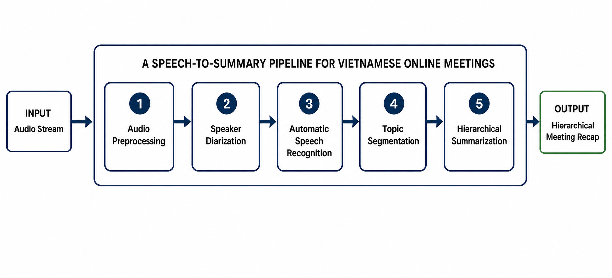
**Hình 1. Quy trình tổng quát gồm năm mô-đun của hệ thống tóm tắt cuộc họp tiếng Việt theo thời gian thực.**

Trong đó, âm thanh đầu vào trước tiên được làm sạch và loại bỏ các khoảng lặng không cần thiết. Luồng âm thanh sau đó được phân chia theo người nói trước khi chuyển thành văn bản bằng thành phần nhận dạng tiếng nói tự động. Các lượt lời có nhãn người nói tiếp tục được phân chia theo chủ đề và tóm tắt theo cấu trúc phân cấp. Đầu ra cuối cùng gồm các tiêu đề chủ đề và các bản tóm tắt nội dung tương ứng.

Mỗi thành phần trong quy trình đều ảnh hưởng trực tiếp đến chất lượng kết quả cuối cùng. Nhiễu còn lại sau tiền xử lý, lỗi nhận dạng từ, lỗi gán nhãn người nói hoặc lỗi xác định ranh giới chủ đề có thể làm mất thông tin và làm giảm độ chính xác của bản tóm tắt. Chất lượng của từng thành phần được đánh giá bằng các tiêu chí phù hợp, gồm tỷ lệ lỗi từ đối với nhận dạng tiếng nói (WER), độ chính xác phân định người nói, các chỉ số (P_k) và WindowDiff đối với phân đoạn chủ đề, cùng với ROUGE đối với kết quả tóm tắt. Các tiêu chí này giúp đánh giá riêng từng bước và xác định nguyên nhân ảnh hưởng đến chất lượng của toàn bộ hệ thống. Chi tiết về các thành phần và phương pháp liên quan sẽ được trình bày trong Chương 2.  [đã thêm 1-2 câu sử dụng tiêu chí gì để đánh giá  ]

## 1.3. Thách thức của bài toán

### 1.3.1. Thách thức từ dữ liệu âm thanh

Âm thanh cuộc họp thực tế thường chứa tiếng ồn môi trường, khoảng lặng, từ đệm, phát âm không rõ và sự khác biệt về giọng nói giữa những người tham gia. Ngoài ra, nhiều người có thể nói cùng lúc hoặc ngắt lời nhau, làm tăng độ khó của quá trình nhận dạng nội dung và xác định người nói. Chất lượng nhận dạng tiếng nói thường được đánh giá bằng tỷ lệ lỗi từ, trong khi chất lượng phân định người nói phụ thuộc vào khả năng xác định đúng thời điểm và danh tính của từng người tham gia.  [@Anguera2012Speaker; @Park2022Review; @Yao2023Zipformer].

### 1.3.2. Thách thức khi tóm tắt hội thoại dài

Một cuộc họp có thể kéo dài hàng chục phút hoặc nhiều giờ, tạo ra bản ghi gồm hàng trăm đến hàng nghìn lượt lời. Việc đưa toàn bộ bản ghi vào một mô hình tóm tắt duy nhất có thể vượt quá giới hạn độ dài đầu vào của mô hình. Ngay cả khi mô hình hỗ trợ ngữ cảnh dài, thông tin nằm ở phần giữa văn bản vẫn có nguy cơ bị bỏ sót. Hiện tượng này thường được gọi là “lost in the middle”, trong đó mô hình xử lý tốt thông tin ở đầu và cuối chuỗi nhưng giảm khả năng ghi nhớ các chi tiết nằm ở giữa [@Liu2024Lost]. 

### 1.3.3. Thách thức trong phân đoạn chủ đề

Phân đoạn chủ đề trong cuộc họp gặp nhiều khó khăn do nội dung thường thay đổi không rõ ràng giữa các lượt lời. Một chủ đề có thể kéo dài qua nhiều lượt trao đổi, tạm dừng rồi được nhắc lại ở phần sau, khiến ranh giới giữa các chủ đề khó xác định chính xác.

Bên cạnh đó, câu thoại trong cuộc họp thường ngắn, chứa nhiều từ đệm và có thể chưa thể hiện đầy đủ ý nghĩa. Những đặc điểm này làm giảm lượng thông tin dùng để nhận biết sự thay đổi chủ đề và dễ dẫn đến việc chia sai hoặc bỏ sót ranh giới.

Phân đoạn chủ đề dạng luồng còn khó hơn phân đoạn ngoại tuyến. Với cách xử lý ngoại tuyến, hệ thống có thể sử dụng toàn bộ nội dung cuộc họp để xác định ranh giới. Trong khi đó, hệ thống dạng luồng chỉ có dữ liệu đã xuất hiện và chưa biết đầy đủ nội dung phía sau, nên cần cân bằng giữa độ chính xác và thời gian chờ trước khi xác nhận ranh giới. Hiện nay, phần lớn các nghiên cứu tập trung vào phân đoạn ngoại tuyến, còn số lượng nghiên cứu về phân đoạn chủ đề dạng luồng vẫn tương đối ít.

### 1.3.4. Thách thức đối với tiếng Việt

So với tiếng Anh, tài nguyên phục vụ tóm tắt cuộc họp tiếng Việt còn hạn chế. Hiện chưa có nhiều bộ dữ liệu và benchmark cung cấp đầy đủ bản ghi hội thoại, thông tin người nói, ranh giới chủ đề, bản tóm tắt và tiêu đề. Điều này gây khó khăn cho việc huấn luyện, đánh giá và so sánh các phương pháp trên cùng một tiêu chuẩn.

Các mô hình tiền huấn luyện tiếng Việt như ViT5 và BARTpho đã hỗ trợ tốt nhiều tác vụ sinh văn bản [@Phan2022; @Nguyen2022]. Tuy nhiên, các mô hình này chưa được phát triển riêng cho hội thoại cuộc họp, nên vẫn cần được tinh chỉnh trên dữ liệu phù hợp. Số lượng mô hình chuyên biệt cho tóm tắt cuộc họp tiếng Việt hiện cũng còn ít.

Bản ghi cuộc họp thường chứa từ đệm, từ viết tắt, cách nói địa phương, thuật ngữ chuyên ngành và nhiều câu chưa hoàn chỉnh. Bên cạnh đó, cách xưng hô, từ ghép và cách diễn đạt phụ thuộc vào ngữ cảnh khiến hệ thống khó xác định nội dung chính cũng như sự thay đổi giữa các chủ đề.

Ngoài ra, nghiên cứu về tóm tắt cuộc họp dạng luồng vẫn còn khá ít. Khác với xử lý ngoại tuyến, hệ thống dạng luồng phải cập nhật kết quả khi chưa có đầy đủ nội dung phía sau. Vì vậy, hệ thống cần cân bằng giữa độ chính xác, độ trễ và tính ổn định của các kết quả đã tạo ra.

## 1.4. Khoảng trống nghiên cứu

[Cô đã sửa]

Mặc dù các nghiên cứu về tóm tắt cuộc họp đã đạt được nhiều kết quả tích cực, đặc biệt với sự phát triển của các mô hình Transformer và mô hình ngôn ngữ lớn, vẫn còn một số hạn chế khi áp dụng vào bài toán tóm tắt cuộc họp tiếng Việt theo thời gian thực.

Thứ nhất, phần lớn các phương pháp hiện nay được thiết kế cho offline meeting summarization, yêu cầu toàn bộ bản ghi hội thoại trước khi thực hiện phân đoạn chủ đề và sinh bản tóm tắt. Do đó, các phương pháp này chưa đáp ứng được nhu cầu cập nhật kết quả liên tục trong khi cuộc họp đang diễn ra.

Thứ hai, các nghiên cứu thường tập trung giải quyết từng bài toán riêng lẻ như nhận dạng tiếng nói, phân định người nói, phân đoạn chủ đề hoặc tóm tắt hội thoại. Các hệ thống tích hợp đầy đủ các thành phần trên thành một pipeline thống nhất cho bài toán tóm tắt cuộc họp tiếng Việt còn khá hạn chế, trong khi sai số từ các mô-đun đầu vào có thể ảnh hưởng đáng kể đến chất lượng của toàn bộ hệ thống.

Thứ ba, nguồn dữ liệu và các nghiên cứu dành cho tiếng Việt vẫn còn hạn chế. Đặc biệt, các phương pháp khai thác mô hình tiếng Việt để thực hiện tóm tắt phân cấp (hierarchical summarization), đồng thời tạo bản tóm tắt và tiêu đề cho từng chủ đề của cuộc họp, vẫn chưa được nghiên cứu nhiều.

Ngoài ra, nhiều giải pháp hiện đại dựa trên các mô hình ngôn ngữ lớn được triển khai thông qua dịch vụ đám mây, dẫn đến chi phí vận hành cao và đặt ra các yêu cầu về bảo mật dữ liệu khi áp dụng trong môi trường doanh nghiệp.

Để giải quyết các khoảng trống trên, khóa luận đề xuất một hệ thống tóm tắt cuộc họp tiếng Việt theo thời gian thực với pipeline thống nhất, tích hợp các thành phần nhận dạng tiếng nói, phân định người nói, phân đoạn chủ đề và tóm tắt. Trong đó, khóa luận đề xuất phương pháp Multi-Scale Sliding TextTiling để hỗ trợ phân đoạn chủ đề trên dữ liệu dạng luồng, kết hợp ViT5 để sinh bản tóm tắt và BARTpho để tạo tiêu đề cho từng chủ đề. Cách tiếp cận phân cấp này giúp xử lý hiệu quả các cuộc họp dài, cung cấp kết quả có cấu trúc và phù hợp với khả năng triển khai cục bộ trên dữ liệu tiếng Việt.

[Sau này thêm ASR ở đây]

## 1.5. Mục tiêu nghiên cứu

### 1.5.1. Mục tiêu tổng quát

**Xây dựng một hệ thống tóm tắt cuộc họp tiếng Việt theo thời gian thực, có khả năng tiếp nhận dữ liệu liên tục và tạo báo cáo tóm tắt có cấu trúc phân cấp, hỗ trợ người dùng theo dõi nội dung cuộc họp trong quá trình diễn ra.**

### 1.5.2. Mục tiêu cụ thể

Để đạt được mục tiêu tổng quát, khóa luận thực hiện các mục tiêu cụ thể sau:

1. Xây dựng quy trình xử lý từ luồng âm thanh cuộc họp đến báo cáo tóm tắt có cấu trúc.
2. Nghiên cứu và đề xuất phương pháp phân đoạn chủ đề phù hợp với dữ liệu hội thoại dạng luồng.
3. Tinh chỉnh mô hình tiếng Việt để tóm tắt các khối hội thoại có độ dài giới hạn.
4. Tinh chỉnh mô hình tiếng Việt để tạo tiêu đề đại diện cho từng phân đoạn chủ đề.
5. Xây dựng và chuẩn hóa dữ liệu tiếng Việt phục vụ huấn luyện và đánh giá hệ thống.
6. Đánh giá từng thành phần của hệ thống bằng các chỉ số và tập dữ liệu phù hợp.
7. **[Mục tiêu chi tiết liên quan đến ASR sẽ được cập nhật và bổ sung tại đây sau.]**
8. **[Mục tiêu chi tiết liên quan đến phân định người nói sẽ được cập nhật và bổ sung tại đây sau.]**

## 1.6. Đóng góp của khóa luận

Khóa luận có các đóng góp chính như sau:[cô đã sửa]

- Đề xuất một pipeline thống nhất cho bài toán tóm tắt cuộc họp tiếng Việt theo thời gian thực, tích hợp các thành phần nhận dạng tiếng nói, phân định người nói, phân đoạn chủ đề và tóm tắt phân cấp trong một quy trình xử lý liên tục, cho phép cập nhật kết quả trong khi cuộc họp đang diễn ra.
- 
- [Sau này ASR + speaker  ghi ở đây]

- Đề xuất thuật toán Multi-Scale Sliding TextTiling cho bài toán phân đoạn chủ đề trên dữ liệu hội thoại dạng luồng. Thuật toán mở rộng phương pháp TextTiling truyền thống bằng cơ chế cửa sổ trượt đa kích thước nhằm nâng cao khả năng phát hiện ranh giới chủ đề trong điều kiện dữ liệu được cập nhật liên tục.

- Xây dựng phương pháp tóm tắt phân cấp cho cuộc họp tiếng Việt, trong đó mô hình ViT5 được tinh chỉnh để tạo bản tóm tắt cho từng khối hội thoại, còn BARTpho được tinh chỉnh để sinh tiêu đề cho từng phân đoạn chủ đề. Cách tiếp cận này giúp xử lý hiệu quả các cuộc họp dài và giảm ảnh hưởng của giới hạn độ dài đầu vào của mô hình.

- Xây dựng và chuẩn hóa các bộ dữ liệu tiếng Việt phục vụ huấn luyện và đánh giá hệ thống, bao gồm bộ dữ liệu AliMeeting4MUG_vi cho bài toán tóm tắt và tạo tiêu đề, cùng các bộ dữ liệu chuyển ngữ phục vụ đánh giá thuật toán phân đoạn chủ đề.

- Thực hiện đánh giá toàn diện từng thành phần và toàn bộ hệ thống trên các bộ dữ liệu và chỉ số đánh giá phù hợp, qua đó phân tích hiệu quả của phương pháp đề xuất đối với bài toán tóm tắt cuộc họp tiếng Việt theo thời gian thực.

---

## Nghiên cứu liên quan (Related Work)

### Các phương pháp nhận dạng tiếng nói và phân định người nói (Automatic Speech Recognition and Speaker Diarization Methods)

[Các nghiên cứu liên quan chi tiết về mô hình ASR và kỹ thuật phân định giọng nói/gán nhãn người nói (speaker diarization/clustering) sẽ được cập nhật thêm tại đây sau.]

### Tóm tắt hội thoại (Dialogue Summarization)

Tóm tắt hội thoại (dialogue summarization) hướng tới việc tạo ra một phiên bản ngắn hơn của văn bản hội thoại đầu vào trong khi vẫn bảo toàn các thông tin quan trọng của nội dung gốc. Các phương pháp tiếp cận chủ yếu được chia thành hai nhóm: phương pháp trích xuất (extractive methods), lựa chọn các câu hoặc cụm từ có sẵn trong văn bản gốc; và phương pháp sinh tạo (abstractive methods), tạo ra chuỗi văn bản mới với cách diễn đạt ngắn gọn và súc tích hơn. Các mô hình sinh tạo dựa trên kiến trúc Transformer [@Vaswani2017] đã đạt được chất lượng ngôn ngữ tự nhiên cao, nhưng vẫn phải đối mặt với rủi ro xảy ra hiện tượng ảo giác thông tin (hallucination) và sự phụ thuộc lớn vào dữ liệu huấn luyện. Điển hình cho hướng tiếp cận sinh tạo dựa trên văn bản-văn bản (text-to-text) là kiến trúc T5 [@Raffel2020] và biến thể tiếng Việt ViT5 [@Phan2022], cũng như kiến trúc BART [@Lewis2020] và biến thể tiếng Việt BARTpho [@Nguyen2022] vốn phù hợp để thử nghiệm cho các tác vụ sinh tiêu đề hoặc chuỗi văn bản ngắn.

Đối với môi trường hội thoại, việc tóm tắt cuộc họp (meeting summarization) thể hiện độ phức tạp cao hơn đáng kể so với tóm tắt tài liệu đơn tác giả (single-document/single-author documents). Trong các cuộc họp, thông tin quan trọng thường không nằm tập trung mà được hình thành qua nhiều lượt nói (turns) mang tính tương tác xã hội: một thành viên đề xuất ý kiến, các thành viên khác phản biện, thảo luận và đi đến thống nhất phương án vào cuối cuộc thảo luận[@Zhong2021]. Do đó, một câu thoại (utterance) riêng lẻ thường không chứa đựng đầy đủ ngữ cảnh để tóm tắt. Một bản tóm tắt cuộc họp hữu ích cần phản ánh được trình tự thời gian và cấu trúc chủ đề của phiên thảo luận, thay vì chỉ đơn thuần xếp hạng hoặc trích xuất các câu độc lập.

Tuy nhiên, khi đối mặt với các tài liệu hội thoại dài, các mô hình ngôn ngữ lớn thường gặp hiện tượng suy giảm hiệu năng nghiêm trọng ở giữa ngữ cảnh (lost-in-the-middle phenomenon) [@Liu2024Lost] và chi phí tính toán tăng vọt do các cuộc hội thoại dài. Để giải quyết những hạn chế này, chúng tôi tham khảo cách tổ chức bản tóm tắt cuộc họp theo cấu trúc phân cấp của Asthana và cộng sự [@Asthana2025Recap]. Trên cơ sở đó, chúng tôi đề xuất một quy trình triển khai phù hợp với tiếng Việt, trong đó bản ghi cuộc họp được chia thành các đoạn hội thoại, mỗi đoạn gồm tối đa tám lượt lời. Từng đoạn được tóm tắt bằng mô hình ViT5 [@Phan2022]. Sau đó, các bản tóm tắt được nhóm theo chủ đề và sử dụng làm đầu vào cho mô hình BARTpho [@Nguyen2022] để tạo tiêu đề khái quát cho từng phân đoạn thảo luận.. Thiết kế phân tách này giúp hệ thống xử lý được các cuộc họp dài mà không bị giới hạn ngữ cảnh hay suy giảm chất lượng sinh văn bản.

### Phân đoạn chủ đề và xử lý dữ liệu dạng luồng (streaming) trong hội thoại (Topic Segmentation and Streaming Processing in Dialogue)

Phân đoạn chủ đề (topic segmentation) là tác vụ chia một văn bản hoặc cuộc hội thoại liên tục thành các đoạn nội dung kế tiếp nhau, trong đó mỗi đoạn có nội dung tương đối thống nhất về chủ đề. Thuật toán TextTiling kinh điển của Hearst [@Hearst1997] dựa trên giả định rằng các đoạn cùng chủ đề thường sử dụng một nhóm từ vựng tương tự nhau, còn độ tương đồng từ vựng (lexical similarity) sẽ giảm rõ rệt tại vị trí chuyển từ chủ đề này sang chủ đề khác. Phương pháp này tính độ tương đồng giữa các đoạn văn bản liền kề, xác định những vị trí có độ tương đồng thấp và chọn các điểm có dấu hiệu chuyển chủ đề rõ rệt để xác định ranh giới giữa các chủ đề.

Các phương pháp phân đoạn dựa trên từ vựng có ưu điểm là tốc độ xử lý nhanh, dễ giải thích và không đòi hỏi dữ liệu gán nhãn để huấn luyện. Tuy nhiên, hạn chế lớn nhất của nhóm phương pháp này là khó nhận biết các từ đồng nghĩa hoặc những cách diễn đạt khác nhau nhưng cùng đề cập đến một nội dung. Ngoài ra, chúng cũng dễ bị ảnh hưởng bởi nhiễu xuất hiện trong các câu thoại ngắn của hội thoại tự nhiên.

Để khắc phục hạn chế trên, Xing và Carenini [@Xing2021] đề xuất một phương pháp phân đoạn hội thoại dựa trên mô hình đánh giá mức độ mạch lạc (coherence score) giữa các cặp câu thoại. Mô hình được huấn luyện bằng dữ liệu tạo tự động, sau đó điểm mạch lạc được sử dụng để xác định ranh giới chủ đề theo hướng không giám sát. Việc sử dụng các mô hình học sâu như Sentence-BERT giúp nâng cao khả năng biểu diễn ngữ nghĩa, nhưng đồng thời làm tăng chi phí suy luận khi hệ thống hoạt động theo thời gian thực.

Gần đây, He và cộng sự [@He2025] chuyển bài toán phân đoạn hội thoại thành bài toán phát hiện đối tượng một chiều (One-Dimensional Object Detection – 1DOD) dành cho phân đoạn văn bản liên tục. Phương pháp này cải thiện độ chính xác nhờ tối ưu trực tiếp quá trình xác định các ranh giới chủ đề.

Dựa trên các nền tảng nêu trên, cơ chế xử lý dữ liệu liên tục (streaming data processing) cho phép hệ thống tính toán và cung cấp các bản tóm tắt tạm thời ngay trong khi cuộc họp đang diễn ra. Khác với xử lý theo lô (batch processing), vốn yêu cầu thu thập đầy đủ dữ liệu âm thanh trước khi xử lý, cơ chế xử lý liên tục cho phép hệ thống cung cấp kết quả ngay trong khi cuộc họp đang diễn ra, nhờ đó người dùng không phải chờ đến khi toàn bộ cuộc họp kết thúc mới nhận được kết quả.

Người dùng có thể theo dõi các nội dung tóm tắt được cập nhật liên tục ngay sau khi từng đoạn hội thoại hoặc phân đoạn chủ đề được hoàn tất. Tuy nhiên, trong bài toán phân đoạn hội thoại, một ranh giới chủ đề chỉ có thể được xác định đáng tin cậy sau khi hệ thống quan sát thêm một lượng ngữ cảnh nhất định ở phía sau (look-ahead context).

Vì vậy, khái niệm “xử lý liên tục” trong nghiên cứu này được hiểu là quá trình tiếp nhận dữ liệu và cập nhật kết quả theo từng giai đoạn, chứ không phải xác định ranh giới chủ đề ngay tại thời điểm một lượt lời vừa xuất hiện. Hệ thống chỉ công bố kết quả sau khi đoạn hội thoại hoặc phân đoạn tương ứng đã được xác nhận hoàn tất, nhằm bảo đảm các thông tin đã công bố không bị thay đổi về sau.

### Các bộ dữ liệu và chỉ số đánh giá hội thoại (Dialogue Corpora and Evaluation Metrics)

[ASR và Speaker sau này viết ở đây]

Việc phát triển các bộ dữ liệu chuyên biệt cho các bài toán hội thoại đóng vai trò quan trọng trong quá trình tinh chỉnh và đánh giá các hệ thống AI. Trong khi các nghiên cứu trước đây chủ yếu dựa trên những bộ dữ liệu cuộc họp tiếng Anh kinh điển như AMI Meeting Corpus [@Carletta2005], gồm các cuộc họp thiết kế sản phẩm giả lập, và ICSI Meeting Corpus [@Janin2003], ghi lại các cuộc họp học thuật thực tế, các hệ thống tóm tắt hiện đại đòi hỏi nguồn dữ liệu đa dạng hơn về bối cảnh, chủ đề và cấu trúc.

QMSum [@Zhong2021] là một bộ dữ liệu chuẩn quy mô lớn dành cho bài toán tóm tắt cuộc họp dựa trên truy vấn, bao gồm nhiều bối cảnh như hội họp học thuật, phiên họp ủy ban và thảo luận phát triển sản phẩm. Đối với bài toán phát hiện sự chuyển đổi chủ đề và phân đoạn hội thoại, các bộ dữ liệu như Doc2Dial [@Feng2020] và TIAGE [@TIAGE2021] cung cấp nguồn dữ liệu quan trọng để đánh giá khả năng theo dõi sự thay đổi của ngữ cảnh. Gần đây, bộ tiêu chuẩn MUG (Meeting Understanding and Generation) [@Zhang2023MUG] đã xây dựng một khung đánh giá toàn diện, bao gồm các nhiệm vụ phân đoạn chủ đề, tóm tắt và trích xuất thông tin cuộc họp.

Trong nghiên cứu này, chúng tôi dịch và chuẩn hóa các bộ dữ liệu được lựa chọn sang tiếng Việt, qua đó xây dựng nguồn dữ liệu thống nhất phục vụ việc huấn luyện và đánh giá các mô hình phân đoạn chủ đề và tóm tắt hội thoại.

Để đánh giá chất lượng phân đoạn chủ đề trên các bộ dữ liệu, chỉ số $P_k$ [@Beeferman1999] đo xác suất một cặp vị trí cách nhau một khoảng cố định bị xác định sai là thuộc cùng hoặc khác phân đoạn chủ đề. WindowDiff [@Pevzner2002] đo mức chênh lệch giữa số lượng ranh giới dự đoán và số lượng ranh giới tham chiếu trong mỗi cửa sổ. Cả hai chỉ số có giá trị càng thấp càng tốt. Đối với phép đo ranh giới trong thực nghiệm này, mỗi vị trí lượt lời được mã hóa thành nhãn nhị phân $y_i \in \{0,1\}$, trong đó, nhãn 1 được dùng để đánh dấu vị trí kết thúc của một phân đoạn chủ đề. Một ranh giới dự đoán chỉ được xem là chính xác khi trùng hoàn toàn với vị trí ranh giới trong dữ liệu tham chiếu; nghiên cứu không áp dụng khoảng sai lệch cho phép. Từ precision và recall của từng lớp $c \in \{0,1\}$, $F_1$ của lớp được tính như sau:

$$
P_c = \frac{\mathrm{TP}_c}{\mathrm{TP}_c + \mathrm{FP}_c}, \quad R_c = \frac{\mathrm{TP}_c}{\mathrm{TP}_c + \mathrm{FN}_c}, \quad F_{1,c} = 2 \cdot \frac{P_c \cdot R_c}{P_c + R_c}
$$

Giá trị được báo cáo là macro-$F_1$, được tính theo công thức:

$$
\text{macro-}F_1 = \frac{F_{1,0} + F_{1,1}}{2}.
$$

Chỉ số này là trung bình cộng của $F_1$ đối với lớp không phải ranh giới và lớp ranh giới, trong đó hai lớp có vai trò như nhau. Giá trị macro-$F_1$ càng cao cho thấy kết quả phân loại càng tốt. Tuy nhiên, do số lượng vị trí không phải ranh giới thường lớn hơn nhiều so với số lượng vị trí ranh giới, chỉ số này cần được xem xét kết hợp với $P_k$ và WindowDiff. Macro-$F_1$ không nên được hiểu là chỉ số $F_1$ riêng của lớp ranh giới.

Đối với nhiệm vụ tóm tắt và tạo tiêu đề, nghiên cứu sử dụng ROUGE (Recall-Oriented Understudy for Gisting Evaluation) [@Lin2004] để đo mức độ tương đồng về mặt từ vựng giữa văn bản do mô hình tạo ra và văn bản tham chiếu. Cụ thể, ROUGE-1 đánh giá mức độ trùng khớp của các từ đơn (unigrams), ROUGE-2 đánh giá các cặp từ liên tiếp (bigrams), còn ROUGE-L dựa trên chuỗi con chung dài nhất (Longest Common Subsequence – LCS).

BERTScore [@Zhang2020] là một chỉ số bổ sung, sử dụng biểu diễn ngữ cảnh để đánh giá mức độ tương đồng về ngữ nghĩa. Tuy nhiên, trong phạm vi khóa luận này, chúng tôi chỉ báo cáo các kết quả ROUGE có đầy đủ dữ liệu và quy trình để tái lập; BERTScore không được xem là một chỉ số đã được kiểm chứng bằng thực nghiệm trong nghiên cứu.

Đối với nhiệm vụ tạo tiêu đề, mỗi mẫu có thể đi kèm nhiều tiêu đề tham chiếu hợp lệ do con người xây dựng. Vì vậy, đề tài sử dụng cách tính ROUGE-Max: điểm ROUGE được tính riêng giữa tiêu đề dự đoán và từng tiêu đề tham chiếu, sau đó chọn giá trị cao nhất. Cách đánh giá này phù hợp với sự đa dạng trong cách đặt tiêu đề, nhưng có thể cho kết quả lạc quan hơn so với việc lấy điểm trung bình trên toàn bộ các tiêu đề tham chiếu.


## Phương pháp luận (Methodology)
### 3.1. Quy trình tổng thể (Overall Framework)

Hệ thống được tổ chức theo kiến trúc nhiều lớp để tách giao tiếp người dùng, điều phối phiên họp và suy luận mô hình. Cách tổ chức này cho phép dữ liệu được xử lý liên tục trong khi từng mô-đun AI vẫn có thể được triển khai, kiểm thử và thay thế độc lập.

#### 3.1.1. Kiến trúc hệ thống phần mềm (Software System Architecture)

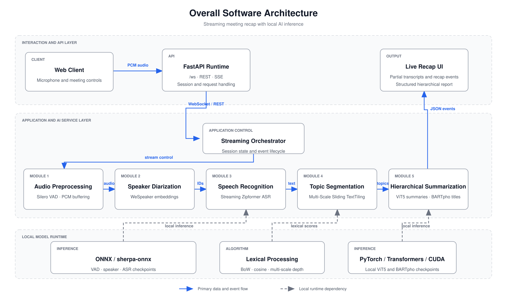

**Hình 2. Kiến trúc phần mềm tổng thể của hệ thống, từ giao diện thu âm và lớp API đến năm mô-đun xử lý AI và báo cáo phân cấp được cập nhật theo thời gian thực.**

Như minh họa trong Hình 2, kiến trúc phần mềm gồm ba lớp phối hợp để xử lý cuộc họp theo thời gian thực. Lớp giao tiếp và API tiếp nhận âm thanh PCM từ giao diện web qua WebSocket, quản lý kết nối bằng FastAPI và trả kết quả cho người dùng dưới dạng các sự kiện liên tiếp. Các giao diện REST và SSE hỗ trợ trường hợp đầu vào là bản chép lời đã có và kết quả cần được truyền dần theo tiến trình xử lý.

Lớp ứng dụng và dịch vụ AI sử dụng bộ điều phối luồng (Streaming Orchestrator) để duy trì trạng thái phiên họp, gọi các dịch vụ nội bộ và chuyển kết quả giữa các thành phần. Cách tổ chức này tách logic điều phối khỏi chức năng chuyên môn của từng mô-đun, đồng thời bảo đảm các kết quả trung gian được phát theo đúng thứ tự thời gian. Vì vậy, giao diện có thể cập nhật bản chép lời và báo cáo tóm tắt trong khi cuộc họp vẫn đang diễn ra.

Lớp chạy mô hình cục bộ cung cấp tài nguyên suy luận cho các dịch vụ AI. ONNX và sherpa-onnx phục vụ các mô hình xử lý tiếng nói; các phép tính liên kết từ vựng phục vụ phân đoạn chủ đề; PyTorch, Transformers và CUDA thực thi các mô hình sinh văn bản. Việc tách lớp chạy mô hình khỏi lớp ứng dụng cho phép kiểm thử hoặc thay thế từng thành phần mà không làm thay đổi cơ chế giao tiếp của toàn hệ thống. Dựa trên kiến trúc này, Mục 3.1.2 trình bày cụ thể đường đi của dữ liệu qua năm mô-đun xử lý.

#### 3.1.2. Quy trình xử lý (Processing Pipeline)

Quy trình xử lý gồm năm mô-đun liên tiếp, tương ứng với đường dữ liệu trong Hình 2. Mô-đun thứ nhất thực hiện tiền xử lý âm thanh (Audio Preprocessing), chuẩn hóa các khung PCM, quản lý bộ đệm và loại bỏ khoảng không có tiếng nói bằng VAD. Kết quả là các đoạn có tiếng nói phù hợp để chuyển sang các bước xử lý tiếp theo.

Mô-đun thứ hai thực hiện phân định người nói (Speaker Diarization), chia luồng âm thanh thành các đoạn theo người phát biểu và gán nhãn người nói tương ứng. Mô-đun thứ ba thực hiện nhận dạng tiếng nói tự động (Automatic Speech Recognition — ASR), chuyển các đoạn âm thanh này thành chuỗi lượt lời dạng văn bản kèm nhãn người nói và mốc thời gian. Hai mô-đun phối hợp để tạo ra bản ghi hội thoại có thứ tự trước khi phân tích nội dung.

Mô-đun thứ tư thực hiện phân đoạn chủ đề (Topic Segmentation) bằng Multi-Scale Sliding TextTiling. Chuỗi lượt lời được xử lý trong các cửa sổ liên tiếp để phát hiện vị trí chuyển chủ đề; một ranh giới chỉ được công bố khi đã có đủ ngữ cảnh phía sau. Cơ chế này giúp các phân đoạn đã chốt không bị thay đổi khi hệ thống tiếp nhận thêm lượt lời mới.

Mô-đun thứ năm thực hiện tóm tắt phân cấp (Hierarchical Summarization) trên từng phân đoạn chủ đề đã chốt. Bên trong mô-đun này, các lượt lời trước hết được chia thành những khối liên tiếp; ViT5 tạo bản tóm tắt cho từng khối, sau đó BARTpho tạo tiêu đề chung cho phân đoạn từ các bản tóm tắt tương ứng. Ba thao tác này cùng tạo ra một đầu ra phân cấp nên được xem là các bước nội bộ của một mô-đun, không phải ba mô-đun độc lập.

Trong toàn bộ quy trình, dữ liệu được chuyển tiếp theo thứ tự thời gian từ mô-đun trước sang mô-đun sau. Đầu ra cuối cùng là báo cáo có cấu trúc gồm các tiêu đề chủ đề và các bản tóm tắt khối tương ứng, được cập nhật tăng dần trong khi cuộc họp diễn ra. Các phần tiếp theo trình bày chi tiết phương pháp được sử dụng trong từng mô-đun.


#### 3.1.3. Bảng tổng hợp các mô-đun (Module Summary Table)

| STT | Mô-đun                                                     | Đầu vào                              | Đầu ra                                                 | Vai trò                                                          |
| --: | :--------------------------------------------------------- | :----------------------------------- | :----------------------------------------------------- | :--------------------------------------------------------------- |
|   1 | Tiền xử lý âm thanh (Audio Preprocessing)                  | Luồng âm thanh thô                   | Các đoạn có tiếng nói đã chuẩn hóa                     | Chuẩn hóa khung PCM và loại bỏ khoảng không có tiếng nói         |
|   2 | Phân định người nói (Speaker Diarization)                  | Các đoạn âm thanh đã tiền xử lý      | Các đoạn âm thanh có nhãn người nói                    | Xác định người phát biểu trong từng đoạn âm thanh                |
|   3 | Nhận dạng tiếng nói tự động (Automatic Speech Recognition) | Các đoạn âm thanh có nhãn người nói  | Chuỗi lượt lời có nhãn người nói và mốc thời gian      | Chuyển nội dung lời nói thành văn bản                            |
|   4 | Phân đoạn chủ đề (Topic Segmentation)                      | Luồng lượt lời theo thứ tự thời gian | Các phân đoạn chủ đề đã chốt                           | Phát hiện và xác nhận ranh giới chuyển chủ đề trong chế độ luồng |
|   5 | Tóm tắt phân cấp (Hierarchical Summarization)              | Các phân đoạn chủ đề đã chốt         | Tiêu đề chủ đề và các bản tóm tắt khối                 | Tạo báo cáo cuộc họp có cấu trúc phân cấp                        |


---

### 3.2. Tiền xử lý âm thanh (Audio Preprocessing)

[Sau này Audio Preprocessing sẽ viết ở đây]

### 3.3. Phân định người nói (Speaker Diarization)

[Sau này Speaker Diarization sẽ viết ở đây]

### 3.4. Nhận dạng tiếng nói tự động (Automatic Speech Recognition)

[Sau này ASR sẽ viết ở đây]

### 3.5. Phân đoạn chủ đề hội thoại bằng  Multi-Scale Sliding TextTiling (Unsupervised Topic Segmentation with  Multi-Scale Sliding TextTiling)

Chuỗi lượt lời trong cuộc họp thường gồm nhiều phát biểu ngắn, ít lặp từ và không có dấu hiệu chuyển chủ đề rõ ràng. Cách chia theo số lượt lời cố định vì vậy có thể cắt ngang một chủ đề đang tiếp diễn hoặc gộp các nội dung không liên quan. Mô-đun này tiếp nhận liên tục các lượt lời có nhãn người nói từ Mục 3.4, xác định vị trí chuyển chủ đề và chuyển những phân đoạn đã ổn định sang mô-đun tóm tắt phân cấp ở Mục 3.6.

TextTiling được chọn làm phương pháp nền vì không cần dữ liệu gán nhãn, có cơ chế liên kết từ vựng dễ giải thích và chi phí suy luận thấp. Tuy nhiên, phương pháp gốc được thiết kế cho tài liệu hoàn chỉnh gồm các khối văn bản tương đối dài [@Hearst1997]. Khi áp dụng cho hội thoại dạng luồng, lượt lời ngắn làm tín hiệu từ vựng dễ dao động; chuyển đổi chủ đề nhanh hoặc kéo dài khiến kết quả phụ thuộc vào phạm vi quan sát; còn ngưỡng tính trên toàn bộ tài liệu không thể áp dụng trực tiếp khi cuộc họp chưa kết thúc. Các ranh giới gần nhau cũng có thể tạo ra phân đoạn quá ngắn, trong khi những vị trí gần cuối cửa sổ chưa có đủ ngữ cảnh phía sau để được xác nhận ổn định.

Từ những hạn chế trên, khóa luận xây dựng Multi-Scale Sliding TextTiling nhưng vẫn giữ nguyên lý suy giảm liên kết từ vựng của TextTiling. Phương pháp gộp các lượt lời ở hai phía của mỗi vị trí, tính và chuẩn hóa điểm sâu trên nhiều phạm vi, xác định ngưỡng riêng cho từng cửa sổ và loại các ranh giới yếu tạo ra phân đoạn quá ngắn. Cửa sổ trượt cùng cơ chế xác nhận trễ cho phép thuật toán tiếp nhận dữ liệu tuần tự mà không phải sửa lại các ranh giới đã công bố. Các thay đổi này lần lượt hướng đến việc ổn định tín hiệu từ vựng, quan sát chuyển đổi chủ đề ở nhiều độ dài ngữ cảnh và đáp ứng yêu cầu xử lý dạng luồng; đóng góp định lượng của từng thành phần được kiểm tra bằng phép phân tích triệt tiêu tại Mục 5.2.2.

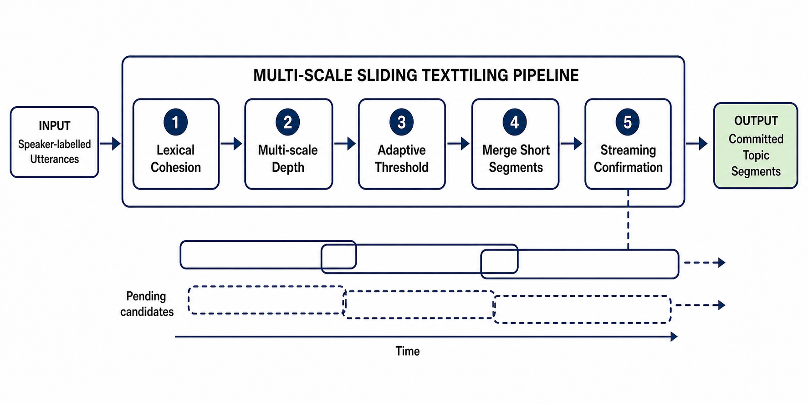
**Hình 3. Quy trình tổng thể của mô-đun phân đoạn chủ đề hội thoại bằng Multi-Scale Sliding TextTiling, từ chuỗi lượt lời có nhãn người nói đến các phân đoạn chủ đề đã chốt trong chế độ luồng.**

Như minh họa trong Hình 3, Multi-Scale Sliding TextTiling thực hiện năm bước liên tiếp: đo liên kết từ vựng giữa hai vùng hội thoại liền kề, tính điểm sâu trên nhiều phạm vi, chọn ranh giới bằng ngưỡng thích ứng, gộp các phân đoạn quá ngắn và xác nhận ranh giới trong luồng. Bốn bước đầu được lặp lại trên cửa sổ hiện tại mỗi khi có thêm dữ liệu. Bước cuối quản lý hai trạng thái gồm ứng viên đang chờ và ranh giới đã chốt, qua đó tạo độ trễ có kiểm soát trước khi công bố một phân đoạn.

---

**Algorithm 1. Multi-Scale Sliding TextTiling for Streaming Topic Segmentation**

**Input:** A chronological stream of utterances u₁, u₂, ...

**Parameters:** Block size k; depth radii R; threshold coefficient α; minimum-segment ratio γ; window size W; stride S; lookahead L.

**State:** Utterance buffer U; pending-candidate map P; committed-boundary list B; next window start s; last emitted boundary b_last.

**Output:** Topic segments emitted in chronological order.

    1:  U ← [ ], P ← { }, B ← [ ]
    2:  s ← 1, b_last ← 0
    3:  for each incoming utterance u_t do
    4:      Append u_t to U
    5:      while the window at s contains W utterances do
    6:          X ← U[s : s + W - 1]
    7:          S_X ← LexicalCohesion(X, k)
    8:          D_bar_X ← MultiScaleDepth(S_X, R)
    9:          tau_X ← mean(D_bar_X) + α · std(D_bar_X)
    10:         for each local gap j do
    11:             if D_bar_X[j] > tau_X then
    12:                 g ← s + j - 1
    13:                 if g > b_last then P[g] ← D_bar_X[j]
    14:             end if
    15:         end for
    16:         c ← s + W - L
    17:         E ← Sort({g in P | g ≤ c})
    18:         if E is not empty then
    19:             m_min ← max(2, floor(γ · W))
    20:             E_merged ← MergeSmallSegments(E, P, m_min)
    21:             for each g in E_merged do
    22:                 if g > b_last then
    23:                     Emit U[b_last + 1 : g]
    24:                     Append g to B
    25:                     b_last ← g
    26:                 end if
    27:             end for
    28:             Remove every candidate g ≤ c from P
    29:         end if
    30:         s ← s + S
    31:     end while
    32: end for
    33: if |U| = 0 then return B
    34: if |U| ≤ W then X ← U
    35: else X ← the final W utterances of U
    36: end if
    37: Recompute S_X, D_bar_X, and tau_X
    38: Add every uncommitted candidate to P
    39: E ← Sort({g in P | g > b_last})
    40: m_min ← max(2, floor(γ · min(|U|, W)))
    41: E_merged ← MergeSmallSegments(E, P, m_min)
    42: for each g in E_merged do
    43:     Emit U[b_last + 1 : g]
    44:     Append g to B
    45:     b_last ← g
    46: end for
    47: if b_last ≠ |U| then
    48:     Emit the final segment at |U| with depth 0
    49:     Append |U| to B
    50: end if
    51: return B

---

Algorithm 1 mô tả đúng hai thao tác update() và flush() của giao diện xử lý luồng. Trong mỗi cửa sổ, một vị trí vượt ngưỡng được lưu vào $P$ và có thể được cập nhật lại khi xuất hiện trong cửa sổ chồng lấn tiếp theo. Chỉ các ứng viên không vượt quá mốc $c=s+W-L$ mới được gộp và xét chốt; sau khi đã xét, chúng được loại khỏi $P$ nên các ranh giới đã công bố không bị thay đổi. Khi cuộc họp kết thúc, cửa sổ cuối được đánh giá lại và ranh giới $|U|$ được bổ sung để đóng phần hội thoại còn lại.

Giả mã tập trung vào đường xử lý tăng dần, là cơ chế được sử dụng để phát phân đoạn trong thời gian thực. Giao diện đánh giá theo lô sử dụng cùng các bước tính liên kết từ vựng, điểm sâu, ngưỡng thích ứng và gộp phân đoạn, nhưng xử lý trên bản ghi đã hoàn chỉnh nên không cần vùng nhìn trước $L$. Các tiểu mục từ 3.5.1 đến 3.5.5 lần lượt giải thích các phép tính và điều kiện trong Algorithm 1.

#### 3.5.1. Tiền xử lý và tính liên kết từ vựng

Lượt lời hội thoại thường ngắn và chứa ít từ mang nội dung, nên tín hiệu liên kết từ vựng dễ bị chi phối bởi từng phát biểu riêng lẻ. Trong khi TextTiling thực hiện phép đo này trên các khối văn bản tương đối dài [@Hearst1997], Multi-Scale Sliding TextTiling gộp nhiều lượt lời ở hai phía của mỗi vị trí trước khi so sánh. Trong cửa sổ hiện tại gồm $M$ lượt lời, văn bản được chuyển về chữ thường, bỏ dấu câu, loại từ dừng [@Stopwordsiso2024] và biểu diễn bằng mô hình túi từ (Bag-of-Words – BoW), với $\mathbf{b}_i$ là vector tần suất từ của lượt lời thứ $i$.

Để kiểm tra nội dung có thay đổi hay không, Multi-Scale Sliding TextTiling xét vị trí $i$ nằm giữa hai lượt lời $u_i$ và $u_{i+1}$. Tại vị trí này, tối đa $k$ lượt lời gần nhất ở bên trái được gộp thành nhóm $\mathbf{L}_i$, còn tối đa $k$ lượt lời tiếp theo ở bên phải được gộp thành nhóm $\mathbf{R}_i$:

$$
\mathbf{L}_i=\sum_{j=\max(1,i-k+1)}^{i}\mathbf{b}_j,
\qquad
\mathbf{R}_i=\sum_{j=i+1}^{\min(M,i+k)}\mathbf{b}_j.
\qquad (3.1)
$$

Mức giống nhau về từ ngữ giữa hai nhóm được tính bằng độ tương đồng cosine:

$$
S_i=\frac{\mathbf{L}_i^\top\mathbf{R}_i}
{\lVert\mathbf{L}_i\rVert_2\lVert\mathbf{R}_i\rVert_2+\varepsilon},
\qquad \varepsilon=10^{-10}.
\qquad (3.2)
$$

Giá trị $S_i$ cao cho thấy hai nhóm có liên kết từ vựng mạnh; giá trị thấp có thể báo hiệu sự thay đổi nội dung. Chuỗi điểm này là đầu vào của bước tính điểm sâu đa phạm vi.

#### 3.5.2. Tính điểm sâu đa phạm vi

Chuyển đổi chủ đề có thể xuất hiện đột ngột hoặc kéo dài qua nhiều lượt lời, vì vậy một phạm vi quan sát duy nhất khó phản ánh đầy đủ cả hai trường hợp. Kế thừa cách TextTiling đánh giá độ sâu của vùng suy giảm liên kết từ vựng [@Hearst1997], Multi-Scale Sliding TextTiling mở rộng phép tính trên tập $R=\{3,5,10,15,20\}$. Với mỗi vị trí $i$ và phạm vi $r$, hai đỉnh lân cận $p_L(i,r)$ và $p_R(i,r)$ được tìm ở hai phía của $S_i$.

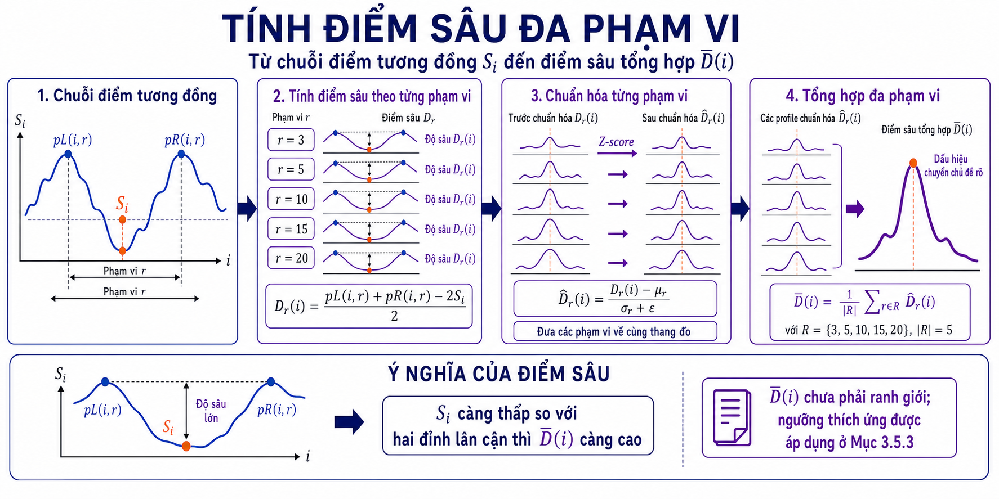
**Hình 4. Quá trình tính điểm sâu đa phạm vi, từ việc xác định độ sâu tại từng phạm vi đến chuẩn hóa và tổng hợp thành điểm $\bar{D}(i)$.**

Từ $S_i$, $p_L(i,r)$ và $p_R(i,r)$, điểm sâu tại vị trí $i$ được tính bởi:

$$
D_r(i)=\frac{p_L(i,r)+p_R(i,r)-2S_i}{2}.
\qquad (3.3)
$$

Giá trị $D_r(i)$ lớn biểu thị một vùng suy giảm liên kết từ vựng rõ hơn. Do biên độ điểm phụ thuộc vào phạm vi $r$, từng chuỗi điểm sâu được chuẩn hóa Z-score trước khi tổng hợp:

$$
\widehat{D}_r(i)=\frac{D_r(i)-\mu_r}{\sigma_r+\varepsilon}.
\qquad (3.4)
$$

Trong đó, $\mu_r$ và $\sigma_r$ là trung bình và độ lệch chuẩn của chuỗi $D_r$. Các điểm đã chuẩn hóa được lấy trung bình:

$$
\bar{D}(i)=\frac{1}{|R|}\sum_{r\in R}\widehat{D}_r(i).
\qquad (3.5)
$$

Giá trị $\bar{D}(i)$ càng cao thì dấu hiệu chuyển chủ đề càng rõ. Các giá trị này được so sánh với ngưỡng thích ứng ở bước tiếp theo.

#### 3.5.3. Chọn ranh giới ứng viên bằng ngưỡng thích ứng

Ở chế độ luồng, hệ thống chỉ có phần hội thoại nằm trong cửa sổ hiện tại nên chưa thể sử dụng phân phối điểm của toàn bộ tài liệu như TextTiling [@Hearst1997]. Ngưỡng vì vậy được tính lại từ chuỗi $\bar{D}(i)$ sau mỗi lần cửa sổ dịch chuyển.

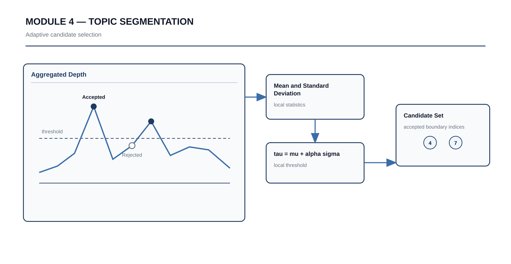
**Hình 5. Quy trình chọn ranh giới ứng viên bằng ngưỡng thích ứng được tính cục bộ từ chuỗi điểm sâu trong từng cửa sổ.**

Gọi $\mu_{\bar{D}}$ và $\sigma_{\bar{D}}$ lần lượt là giá trị trung bình và độ lệch chuẩn của chuỗi $\bar{D}(i)$. Ngưỡng $\tau$ và tập ranh giới ứng viên $C$ được xác định như sau:

$$
\tau=\mu_{\bar{D}}+\alpha\sigma_{\bar{D}},
\qquad
C=\{i\mid\bar{D}(i)>\tau\}.
\qquad (3.6)
$$

Tham số $\alpha$ điều khiển độ chọn lọc: giá trị lớn làm giảm số ứng viên, còn giá trị nhỏ làm hệ thống nhạy hơn. Ngưỡng cục bộ thích ứng với phần hội thoại hiện có nhưng có thể bỏ qua chuyển đổi nhẹ khi độ biến động từ vựng trong cửa sổ quá lớn. Tập $C$ mới chỉ gồm các ranh giới tạm thời và tiếp tục được kiểm tra ở Mục 3.5.4.

#### 3.5.4. Gộp các phân đoạn quá ngắn

Các vị trí vượt ngưỡng có thể nằm gần nhau, làm hội thoại bị chia thành những đoạn quá ngắn cho bước tóm tắt. Để hạn chế tình trạng này, Multi-Scale Sliding TextTiling đặt độ dài tối thiểu theo kích thước cửa sổ và ưu tiên giữ ranh giới có điểm sâu cao hơn.

Gọi $M$ là số lượt lời trong phạm vi đang xử lý và $\gamma$ là tỷ lệ độ dài tối thiểu. Số lượt lời tối thiểu của một phân đoạn được xác định bởi:

$$
m_{\min}=\max(2,\lfloor\gamma M\rfloor).
\qquad (3.7)
$$

Giá trị $m_{\min}$ luôn bảo đảm ít nhất hai lượt lời và tăng theo phạm vi đang xét. Multi-Scale Sliding TextTiling lần lượt tìm phân đoạn ngắn nhất, loại ranh giới có điểm sâu thấp hơn và lặp lại cho đến khi mọi phân đoạn đạt độ dài tối thiểu. Trong chế độ luồng, phép gộp chỉ tác động đến các ứng viên chưa công bố; tập còn lại được chuyển sang bước xác nhận.

#### 3.5.5. Xác nhận ranh giới trong chế độ luồng

Một ranh giới gần cuối cửa sổ chưa có đủ ngữ cảnh phía sau và có thể thay đổi khi xuất hiện thêm lượt lời. Khác với TextTiling, vốn xử lý tài liệu hoàn chỉnh [@Hearst1997], Multi-Scale Sliding TextTiling giữ ranh giới này ở trạng thái chờ và chỉ công bố sau khi đã quan sát đủ vùng nhìn trước. Với mỗi $S=5$ lượt lời mới, cửa sổ $W=40$ được dịch sang phải và ứng viên được kiểm tra lại với $L=20$ lượt lời nhìn trước.

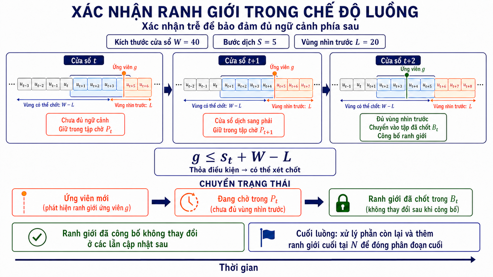
**Hình 6. Quá trình xác nhận trễ một ranh giới ứng viên qua các cửa sổ liên tiếp trước khi công bố trong chế độ luồng.**

Với $g$ là vị trí ứng viên và $s_t$ là vị trí bắt đầu cửa sổ hiện tại, ứng viên chỉ được xét chốt khi:

$$
g\le s_t+W-L.
\qquad (3.8)
$$

Điều kiện (3.8) bảo đảm vị trí $g$ đã có đủ ngữ cảnh phía sau. Ứng viên chưa thỏa mãn tiếp tục được giữ lại; ứng viên đủ điều kiện được gộp theo công thức (3.7) rồi công bố theo thứ tự thời gian. Các ranh giới đã công bố không thay đổi ở những cửa sổ sau.

Khi luồng kết thúc, hệ thống xử lý các ứng viên còn lại và bổ sung ranh giới $N$ để đóng phân đoạn cuối. Với $B=(b_0,b_1,\ldots,b_K)$, trong đó $b_0=0$ và $b_K=N$, phân đoạn chủ đề thứ $k$ được xác định bởi:

$$
T_k=(u_i\mid b_{k-1}<i\le b_k).
\qquad (3.9)
$$

Mỗi lượt lời do đó thuộc đúng một phân đoạn và thứ tự hội thoại ban đầu được bảo toàn. Các phân đoạn đã chốt được chuyển lần lượt sang mô-đun tóm tắt phân cấp ở Mục 3.6.

### 3.6. Tóm tắt phân cấp (Hierarchical Summarization)

Mô-đun tóm tắt phân cấp chuyển mỗi phân đoạn chủ đề đã chốt thành một phần báo cáo gồm một tiêu đề khái quát và các bản tóm tắt chi tiết theo thứ tự thời gian. Thay vì đưa toàn bộ phân đoạn dài vào một mô hình duy nhất, hệ thống chia nội dung thành các khối ngắn, tóm tắt từng khối bằng ViT5 và tạo tiêu đề chung bằng BARTpho. Cách tổ chức này phù hợp với giới hạn đầu vào của mô hình, giữ được diễn biến của cuộc họp và cho phép kết quả được cập nhật dần trong chế độ luồng.

ViT5 và BARTpho được lựa chọn vì đều là mô hình sinh chuỗi đã được tiền huấn luyện cho tiếng Việt và có thể tinh chỉnh riêng cho hai mức đầu ra [@Phan2022; @Nguyen2022]. ViT5 sử dụng cơ chế text-to-text và checkpoint khởi tạo đã hướng tới tóm tắt tiếng Việt, nên được dùng để rút gọn nội dung của từng khối. BARTpho sử dụng kiến trúc mã hóa–giải mã tiền huấn luyện ở cấp âm tiết tiếng Việt, nên được dùng cho tác vụ sinh một tiêu đề ngắn từ dãy ý chính đã có. Việc tách hai nhiệm vụ cho phép mỗi mô hình học một mục tiêu đầu ra cụ thể, thay vì yêu cầu một mô hình đồng thời xử lý bản ghi dài và tạo cả nội dung chi tiết lẫn tiêu đề.

Hai mô hình không được sử dụng nguyên trạng. ViT5 được tinh chỉnh trên các cặp khối hội thoại–bản tóm tắt, còn BARTpho được tinh chỉnh trên các cặp dãy tóm tắt–tiêu đề chủ đề. Khóa luận đồng thời tùy biến cách tạo đầu vào bằng nhãn người nói, tiền tố tác vụ và thứ tự thời gian; giới hạn kích thước khối và độ dài token; sau đó cố định beam search cùng điều kiện chống lặp khi suy luận. Các quyết định này tạo thành cấu hình triển khai của phương pháp, nhưng không được xem là tối ưu hơn mọi phương án khác khi chưa có phép đối chứng riêng cho từng lựa chọn.

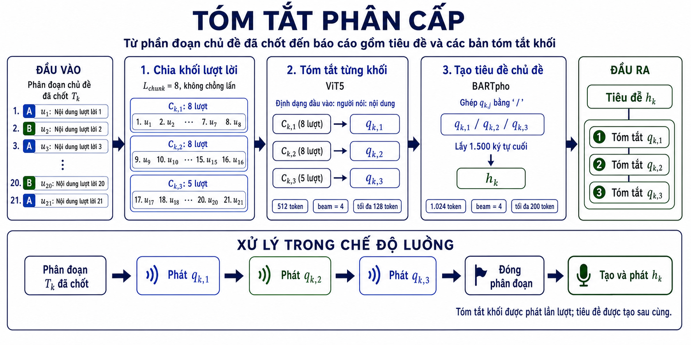

**Hình 7. Quy trình tổng thể của mô-đun tóm tắt phân cấp, từ phân đoạn chủ đề đã chốt đến tiêu đề và các bản tóm tắt khối theo thứ tự thời gian.**

Như minh họa trong Hình 7, mô-đun gồm ba bước liên tiếp. Trước hết, phân đoạn chủ đề được chia thành các khối gồm tối đa tám lượt lời và không chồng lấn. Tiếp theo, ViT5 tạo một bản tóm tắt cho từng khối; mỗi kết quả được lưu và phát ngay sau khi sinh xong. Cuối cùng, BARTpho tổng hợp dãy bản tóm tắt để tạo tiêu đề cho toàn bộ phân đoạn. Tiêu đề chỉ được tạo sau khi tất cả các khối thuộc phân đoạn đã được xử lý, nhờ đó đầu ra vừa có thông tin khái quát ở cấp chủ đề, vừa có nội dung chi tiết ở cấp khối.

#### 3.6.1. Phân chia lượt lời thành các khối (Utterance Chunking)

Sau khi một ranh giới chủ đề được xác nhận ở Mục 3.5, hệ thống chuyển phân đoạn tương ứng sang bước phân chia lượt lời. Mục tiêu là tạo các đầu vào ngắn và có thứ tự cho mô hình tóm tắt. Thiết kế này tham khảo cách tạo một ghi chú từ tám lượt lời liên tiếp của Asthana và cộng sự [@Asthana2025Recap]. Hệ thống chỉ chia khối trên phân đoạn đã chốt; mỗi lượt lời thuộc đúng một khối và không được ghép sang chủ đề kế tiếp.

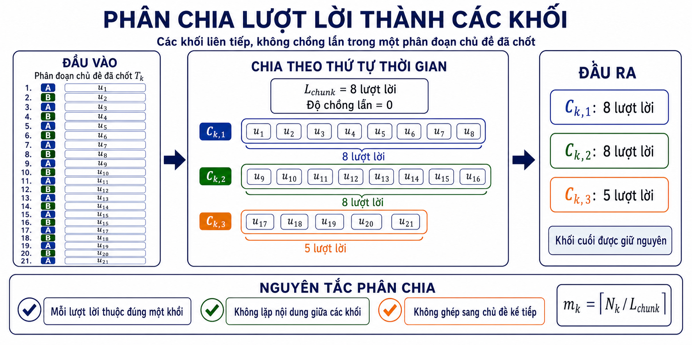

**Hình 8. Quá trình phân chia một phân đoạn chủ đề đã chốt thành các khối lượt lời liên tiếp, không chồng lấn và giữ nguyên khối cuối.**

Như minh họa trong Hình 8, hệ thống duyệt các lượt lời theo thứ tự thời gian và tạo một khối mới sau mỗi tám lượt lời. Mỗi lượt lời chỉ xuất hiện trong một khối; nếu số lượt lời còn lại nhỏ hơn tám, phần còn lại được giữ thành khối cuối của cùng chủ đề. Quy tắc này được mô tả cụ thể bằng các công thức dưới đây.

Với phân đoạn chủ đề thứ $k$ có ranh giới đầu và cuối lần lượt là $b_{k-1}$ và $b_k$, số lượt lời trong phân đoạn được xác định bởi:

$$
N_k=b_k-b_{k-1}.
\qquad (3.11)
$$

Phân đoạn $T_k$ được chia theo thứ tự thời gian thành các khối liên tiếp và không chồng lấn. Kích thước khối được đặt là $L_{\mathrm{chunk}}=8$ lượt lời, phù hợp với đơn vị tóm tắt trong thiết kế tham khảo và gần với độ dài trung bình 7,6 lượt lời của dữ liệu huấn luyện ViT5 được trình bày ở Chương 4. Giới hạn này cũng làm giảm nguy cơ đầu vào vượt quá 512 token; độ dài token tiếp tục được kiểm tra trước khi đưa vào mô hình.

Khối thứ $j$ của phân đoạn $T_k$, ký hiệu là $C_{k,j}$, được xác định như sau:

$$
C_{k,j}
=
\left(u_i\;\middle|\;
b_{k-1}+(j-1)L_{\mathrm{chunk}}<i
\leq\min\left(b_{k-1}+jL_{\mathrm{chunk}},b_k\right)
\right).
\qquad (3.12)
$$

Tổng số khối của phân đoạn được tính bởi:

$$
m_k=\left\lceil\frac{N_k}{L_{\mathrm{chunk}}}\right\rceil.
\qquad (3.13)
$$

Theo công thức (3.12), một phân đoạn gồm 21 lượt lời được chia thành ba khối có kích thước lần lượt là 8, 8 và 5. Khối cuối vẫn được giữ nguyên khi có ít hơn tám lượt lời. Việc không chồng lấn giúp tránh lặp nội dung giữa các bản tóm tắt, còn việc không ghép khối cuối với phân đoạn kế tiếp giúp giữ đúng phạm vi của từng chủ đề.

Trong chế độ luồng, bước chia khối chỉ được thực hiện trên phân đoạn đã chốt ở Mục 3.5.5. Vì vậy, các khối đã tạo không phải chia lại khi có thêm lượt lời mới. Chi phí của bước này đối với một phân đoạn gồm $N_k$ lượt lời là $O(N_k)$; trên toàn bộ cuộc họp, chi phí tăng tuyến tính theo tổng số lượt lời. Các khối $C_{k,j}$ sau đó được chuyển lần lượt sang bước tóm tắt ở Mục 3.6.2.

#### 3.6.2. Tóm tắt từng khối lượt lời (Abstractive Chunk Summarization)

Bước này chuyển từng khối lượt lời thành một bản tóm tắt ngắn bằng mô hình ViT5-base [@Phan2022]. So với mô hình khởi tạo, phần tùy biến của khóa luận nằm ở việc tinh chỉnh trên dữ liệu cuộc họp, giữ nhãn người nói trong đầu vào và sử dụng tiền tố riêng cho tác vụ tóm tắt. Mô hình nhờ đó có thể diễn đạt lại và kết hợp thông tin từ nhiều lượt lời thay vì chỉ chọn lại các câu có sẵn. Đầu vào là khối $C_{k,j}$ được tạo ở Mục 3.6.1; đầu ra là bản tóm tắt $q_{k,j}$ tại đúng vị trí của khối trong phân đoạn.

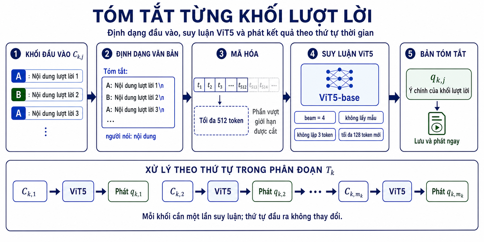

**Hình 9. Quy trình tóm tắt từng khối lượt lời, từ định dạng văn bản đầu vào đến suy luận ViT5 và phát bản tóm tắt trong chế độ luồng.**

Như minh họa trong Hình 9, mỗi khối được định dạng thành văn bản có nhãn người nói, mã hóa trong giới hạn 512 token và đưa qua ViT5 một lần. Bản tóm tắt được lưu và phát ngay sau khi sinh xong, trước khi hệ thống chuyển sang khối tiếp theo. Nhờ đó, các kết quả luôn giữ cùng thứ tự với các khối trong phân đoạn.

Trước khi đưa vào mô hình, mỗi lượt lời được viết dưới dạng `người nói: nội dung` và các lượt lời được ngăn cách bằng ký tự xuống dòng. Cách định dạng này giữ lại cả nội dung và người phát biểu, đồng thời không bổ sung mã khối, số thứ tự hay chỉ dẫn không có trong hội thoại. Với $u_i=(p_i,t_i)$ gồm nhãn người nói $p_i$ và nội dung $t_i$, chuỗi đầu vào của khối được xác định như sau:

$$
x_{k,j}
=
\text{Tóm tắt: }
\mathbin{\Vert}
\operatorname{Join}
\left(
\left(p_i \mathbin{\Vert} \text{: } \mathbin{\Vert} t_i\right)_{u_i\in C_{k,j}},
\text{newline}
\right).
\tag{3.14}
$$

Trong công thức (3.14), các lượt lời được ghép theo đúng thứ tự xuất hiện trong $C_{k,j}$ và tiền tố `"Tóm tắt: "` cho mô hình biết tác vụ cần thực hiện. Chuỗi $x_{k,j}$ sau đó được đưa vào ViT5-base đã được tinh chỉnh trên bộ dữ liệu AliMeeting4MUG_vi [@Zhang2023MUG] để sinh bản tóm tắt trừu tượng:

$$
q_{k,j}=\operatorname{ViT5}_{\theta}(x_{k,j}),
\tag{3.15}
$$

trong đó $\theta$ là bộ tham số sau tinh chỉnh. Khi suy luận, đầu vào được giới hạn ở 512 token và phần vượt quá giới hạn được cắt ở bước mã hóa. Mô hình sử dụng tìm kiếm chùm với bốn chùm, không lấy mẫu ngẫu nhiên, không lặp lại chuỗi ba token và sinh tối đa 128 token mới. Các thiết lập này giúp kết quả ổn định, hạn chế lặp từ và giữ độ dài phù hợp với một bản tóm tắt khối.

Trong chế độ luồng, ViT5 xử lý các khối theo thứ tự thời gian và phát mỗi bản tóm tắt ngay sau khi sinh xong. Vì mỗi khối cần một lần gọi mô hình, số lần suy luận cho phân đoạn thứ $k$ bằng $m_k$; thời gian xử lý chủ yếu phụ thuộc vào độ dài đầu vào và số token được sinh. Cách phát lần lượt này giúp người dùng nhận được nội dung chi tiết trước khi tiêu đề chung hoàn tất.

Sau khi tóm tắt hết các khối trong phân đoạn, hệ thống thu được dãy có thứ tự

$$
Q_k=(q_{k,1},q_{k,2},\ldots,q_{k,m_k}).
\tag{3.16}
$$

Dãy $Q_k$ là biểu diễn rút gọn của phân đoạn và được chuyển trực tiếp sang Mục 3.6.3. Nhờ đó, mô hình tạo tiêu đề làm việc trên các ý chính đã được tóm tắt thay vì toàn bộ lượt lời ban đầu.

#### 3.6.3. Tạo tiêu đề phân đoạn chủ đề (Topic Titling)

Ở bước cuối, hệ thống tạo một tiêu đề khái quát cho phân đoạn chủ đề từ dãy bản tóm tắt $Q_k$. BARTpho được tinh chỉnh cho riêng tác vụ này thay vì sinh tiêu đề trực tiếp bằng mô hình gốc. Việc sử dụng các ý chính đã được rút gọn làm đầu vào giúp mô hình tập trung vào nội dung chung của phân đoạn thay vì các chi tiết rời rạc trong hội thoại thô.

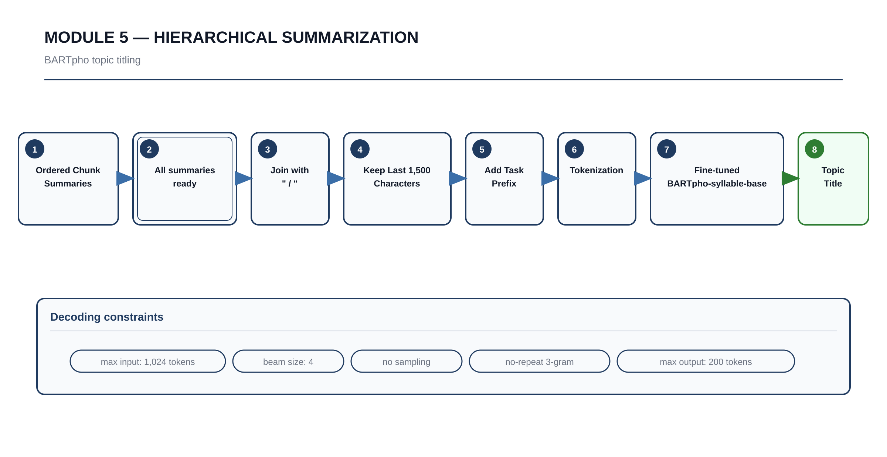

**Hình 10. Quy trình tạo tiêu đề phân đoạn chủ đề từ dãy bản tóm tắt khối bằng BARTpho trong chế độ luồng.**

Như minh họa trong Hình 10, các bản tóm tắt khối được ghép theo thứ tự thời gian, giới hạn theo độ dài và thêm tiền tố tác vụ trước khi đưa vào BARTpho. Tiêu đề chỉ được tạo sau khi toàn bộ khối thuộc phân đoạn đã được tóm tắt. Kết quả này trở thành nút cấp cao, liên kết với các bản tóm tắt khối bên dưới trong cấu trúc đầu ra phân cấp.

Các bản tóm tắt này được sắp xếp theo thứ tự xuất hiện và ghép nối bằng chuỗi phân cách `" / "`. Chuỗi văn bản sau đó được giới hạn theo độ dài, thêm tiền tố tác vụ `"Tạo tiêu đề: "` và đưa vào mô hình BARTpho-syllable-base đã được tinh chỉnh [@Nguyen2022] để sinh tiêu đề chủ đề $h_k$:

$$
h_k
=
\operatorname{BARTpho}_{\phi}
\left(
\text{Tạo tiêu đề: }
\mathbin{\Vert}
\operatorname{Tail}_{1500}
\left(
\operatorname{Join}
\left((q_{k,j})_{j=1}^{m_k},\text{ / }\right)
\right)
\right)
\tag{3.17}
$$

Trong công thức (3.17), $\phi$ là bộ tham số BARTpho sau tinh chỉnh và $\operatorname{Tail}_{1500}$ là phép lấy tối đa 1.500 ký tự cuối của chuỗi ghép. Khi suy luận, đầu vào được giới hạn ở 1.024 token. Mô hình sử dụng tìm kiếm chùm với bốn chùm, không lấy mẫu ngẫu nhiên, không lặp lại chuỗi ba token và sinh tối đa 200 token mới. Các thiết lập này giúp quá trình sinh có tính ổn định và hạn chế lặp nội dung.

Đầu ra cuối cùng là cấu trúc tóm tắt phân cấp $R$, trong đó mỗi tiêu đề chủ đề đi kèm dãy bản tóm tắt khối tương ứng:

$$
R
=
\left(
\left(
h_k,
(q_{k,1}, q_{k,2}, \dots, q_{k,m_k})
\right)
\right)_{k=1}^{K}
\tag{3.18}
$$

Cấu trúc (3.18) cho phép người dùng đọc nhanh tiêu đề $h_k$ để nắm nội dung chính, sau đó xem các bản tóm tắt $q_{k,j}$ khi cần thêm chi tiết. Trong chế độ luồng, các bản tóm tắt khối được phát lần lượt, sự kiện hoàn tất phân đoạn được gửi sau khi toàn bộ khối đã xử lý, rồi tiêu đề mới được tạo và phát. Như vậy, mô-đun vừa duy trì quan hệ phân cấp giữa chủ đề và nội dung chi tiết, vừa bảo đảm kết quả được cập nhật theo tiến trình của cuộc họp.


---

## 4. Bộ dữ liệu (Dataset)

Khóa luận sử dụng một bộ dữ liệu cuộc họp tiếng Việt để huấn luyện và đánh giá hai tác vụ sinh văn bản, cùng sáu bộ dữ liệu hội thoại để đánh giá phân đoạn chủ đề. Bảng 4 trình bày nguồn gốc, quy mô và vai trò của các nguồn dữ liệu. Các hội thoại nguồn bằng tiếng Anh và tiếng Trung được chuyển ngữ sang tiếng Việt bằng Hy-MT2-1.8B. Cách phân chia dữ liệu cho hai mô hình sinh văn bản được trình bày trong Bảng 5.

**Bảng 4: Tổng quan các bộ dữ liệu được sử dụng trong khóa luận**

| Nguồn                                                | Thành phần                     | Quy mô                                             | Vai trò                                         |
| :--------------------------------------------------- | :----------------------------- | :------------------------------------------------- | :---------------------------------------------- |
| AliMeeting MUG, phiên bản tiếng Việt [@Zhang2023MUG] | Dữ liệu tóm tắt và tạo tiêu đề | 360 cuộc họp; 34.117 khối hội thoại                | Huấn luyện và đánh giá hai tác vụ sinh văn bản  |
| DialSeg711 [@Xu2020]                                 | Hội thoại định hướng nhiệm vụ  | 711 hội thoại; 19.350 lượt lời; 3.465 phân đoạn    | Đánh giá phân đoạn hội thoại ngắn               |
| Doc2Dial [@Feng2020]                                 | Đối thoại dịch vụ công         | 3.270 hội thoại; 42.585 lượt lời; 11.400 phân đoạn | Đánh giá phân đoạn đối thoại có tài liệu hỗ trợ |
| AMI Meeting Corpus [@Carletta2005]                   | Cuộc họp thiết kế sản phẩm     | 137 cuộc họp; 73.379 lượt lời; 601 phân đoạn       | Đánh giá phân đoạn cuộc họp nhiều người nói     |
| QMSum [@Zhong2021]                                   | Hội thoại nghị sự              | 36 cuộc họp; 7.477 lượt lời; 254 phân đoạn         | Đánh giá phân đoạn phiên họp ủy ban             |
| ICSI Meeting Corpus [@Janin2003]                     | Cuộc họp học thuật             | 59 cuộc họp; 48.321 lượt lời; 268 phân đoạn        | Đánh giá phân đoạn cuộc họp tự nhiên            |
| TIAGE [@TIAGE2021]                                   | Hội thoại chuyển chủ đề        | 500 hội thoại; 7.802 lượt lời; 2.013 phân đoạn     | Đánh giá vị trí chuyển đổi chủ đề               |

**Dữ liệu tóm tắt và tạo tiêu đề:** Nguồn dữ liệu này được xây dựng từ AliMeeting MUG [@Zhang2023MUG] và chuyển ngữ sang tiếng Việt. Mỗi cuộc họp gồm chuỗi lượt lời kèm người nói, mốc thời gian, ranh giới chủ đề, bản tóm tắt khối và tiêu đề tham chiếu. Phạm vi sử dụng gồm 360 cuộc họp, tạo ra 34.117 mẫu khối cho ViT5 và 3.999 mẫu chủ đề cho BARTpho. Mỗi chủ đề có tối đa ba tiêu đề do con người biên soạn.

**Các bộ dữ liệu phân đoạn chủ đề:** Sáu bộ dữ liệu được chuẩn hóa về cùng cấu trúc gồm mã hội thoại, chuỗi lượt lời, độ dài phân đoạn và nhãn tập dữ liệu. Dữ liệu bao phủ hội thoại định hướng nhiệm vụ, đối thoại dịch vụ công và cuộc họp dài nhiều người nói. Trong thực nghiệm, cùng một cấu hình phân đoạn được áp dụng cho cả sáu bộ dữ liệu và không có bước huấn luyện trọng số mô hình trên từng tập đánh giá.

**Quy trình chuyển ngữ và giới hạn dữ liệu:** Hy-MT2-1.8B chuyển ngữ các lượt lời sang tiếng Việt nhưng giữ nguyên thứ tự và nhãn ranh giới chuẩn vàng (gold-standard labels). Dữ liệu sau chuyển ngữ được chuẩn hóa về ký tự, chữ số và ranh giới lượt lời. Do nghiên cứu chưa thực hiện đánh giá chất lượng bản dịch trên một tập mẫu có thể tái lập, ảnh hưởng của sai lệch dịch máy được xem là một giới hạn của bộ dữ liệu và được cân nhắc khi phân tích kết quả thực nghiệm.

**Phân chia dữ liệu huấn luyện và đánh giá:** Hai mô hình sinh văn bản sử dụng 295 cuộc họp làm nguồn tạo mẫu huấn luyện và validation. Trong lần huấn luyện tạo ra các kết quả được báo cáo, các khối của ViT5 và các chủ đề của BARTpho được chia ngẫu nhiên theo tỷ lệ 90/10 với hạt giống bằng 42. ViT5 sử dụng 25.272 mẫu huấn luyện và 2.807 mẫu validation. Đối với BARTpho, phép chia được thực hiện ở cấp cuộc họp, gồm 266 cuộc họp tạo ra 2.936 mẫu huấn luyện và 29 cuộc họp tạo ra 327 mẫu validation. Sau khi chọn checkpoint, hai mô hình được đánh giá trên 65 cuộc họp độc lập, không thuộc nguồn 295 cuộc họp ban đầu.

**Bảng 5: Phân chia dữ liệu cho huấn luyện và đánh giá hai mô hình sinh văn bản**

| Tập dữ liệu | Phạm vi cuộc họp | Mẫu ViT5 (khối) | Mẫu BARTpho (chủ đề) | Vai trò |
| :--- | :--- | ---: | ---: | :--- |
| Huấn luyện (Train) | Trích từ 295 cuộc họp | 25.272 | 2.936 | Tối ưu tham số mô hình |
| Validation | Trích từ cùng 295 cuộc họp | 2.807 | 327 | Theo dõi huấn luyện và chọn checkpoint |
| Đánh giá (Evaluation) | 65 cuộc họp độc lập | 6.038 | 736 | Đánh giá mô hình sau khi hoàn tất huấn luyện |
| **Tổng số được sử dụng** | **360 cuộc họp phân biệt** | **34.117** | **3.999** | — |

Đối với ViT5, train và validation được chia ở cấp mẫu nên các khối thuộc cùng một cuộc họp có thể xuất hiện trong cả hai tập. BARTpho được chia ở cấp cuộc họp nên không có sự giao nhau giữa 266 cuộc họp huấn luyện và 29 cuộc họp validation. Tập đánh giá cuối cùng của cả hai mô hình gồm 65 cuộc họp độc lập với nguồn huấn luyện.

**Bộ dữ liệu cho khâu nhận dạng tiếng nói và phân định người nói (Datasets for ASR and Speaker Diarization):**

[Thông tin chi tiết về các bộ dữ liệu âm thanh tiếng Việt và dữ liệu phân định người nói sẽ được cập nhật và bổ sung tại đây sau.]


---

## 5. Thực nghiệm và Kết quả (Experiments and Results)

Thực nghiệm tập trung vào ba thành phần đã có dữ liệu đánh giá: phân đoạn chủ đề, tóm tắt khối và tạo tiêu đề chủ đề. Multi-Scale Sliding TextTiling được so sánh với hai phương pháp đối chứng có thể tái lập trên sáu bộ dữ liệu hội thoại, đồng thời được đánh giá riêng trong chế độ luồng. ViT5 và BARTpho được đánh giá trên tập dữ liệu giữ lại. Kết quả được trình bày theo cùng thứ tự với các thành phần trong quy trình phương pháp luận, từ chất lượng ranh giới chủ đề đến chất lượng đầu ra tóm tắt phân cấp.

### 5.1. Thiết kế thực nghiệm (Experimental Design)

**Mục tiêu đánh giá:** Thiết kế thực nghiệm xem xét ba câu hỏi chính: phương pháp phân đoạn đề xuất có duy trì chất lượng trên các miền hội thoại khác nhau hay không; các thành phần cửa sổ trượt, chuẩn hóa cục bộ, quét đa phạm vi và gộp phân đoạn đóng góp như thế nào; và hai mô hình tạo sinh đạt chất lượng ra sao trên dữ liệu chưa xuất hiện trong quá trình huấn luyện.

**Quy trình thực nghiệm:** Đối với phân đoạn chủ đề, văn bản được chuẩn hóa về cùng cấu trúc lượt lời, sau đó phương pháp đề xuất và các phương pháp đối chứng nhận cùng đầu vào và được chấm trên cùng nhãn ranh giới. Cấu hình của Multi-Scale Sliding TextTiling được giữ cố định khi chuyển giữa sáu bộ dữ liệu; phép triệt tiêu lần lượt bổ sung từng thành phần để xác định thay đổi nào tạo ra khác biệt về kết quả. Đối với hai mô hình tạo sinh, dữ liệu được chuyển thành các cặp đầu vào–đầu ra theo đúng định dạng ở Mục 3.6, chia thành train và validation để tinh chỉnh và lựa chọn checkpoint, rồi cố định mô hình cùng cấu hình giải mã trước khi đánh giá trên 65 cuộc họp độc lập. Quy trình này tách dữ liệu dùng để tối ưu tham số, dữ liệu dùng để chọn checkpoint và dữ liệu dùng để báo cáo kết quả cuối cùng.

**Môi trường thực nghiệm:** Các phép đo được thực hiện trên Ubuntu với bộ xử lý Intel, RAM 16 GB và GPU NVIDIA GeForce RTX 4060 8 GB. Môi trường phần mềm sử dụng Python 3.12.3, PyTorch và thư viện Transformers [@Wolf2020]. PyTorch và Transformers được lựa chọn vì hỗ trợ trực tiếp các checkpoint ViT5 và BARTpho, huấn luyện fp16 trên GPU và một giao diện thống nhất cho mã hóa, tinh chỉnh và sinh chuỗi. Nhờ đó, hai mô hình có thể dùng chung quy trình huấn luyện và đánh giá trong khi vẫn giữ cấu hình riêng cho từng tác vụ. Cùng một cấu hình phần cứng và tiền xử lý được sử dụng trong mỗi nhóm thực nghiệm có thể tái lập.

**Cấu hình phân đoạn chủ đề:** Các phép đánh giá theo lô và theo luồng sử dụng cùng cấu hình Multi-Scale Sliding TextTiling trên toàn bộ sáu bộ dữ liệu. Các tham số tính điểm và gộp phân đoạn được giữ nguyên giữa hai chế độ; vùng nhìn trước $L=20$ chỉ được kích hoạt khi thuật toán tiếp nhận lần lượt từng lượt lời. Cấu hình đầy đủ được trình bày trong Bảng 6 và đối chiếu với cấu hình mặc định của hệ thống tại Phụ lục C.

Các giá trị trong Bảng 6 là cấu hình được dùng để tái lập kết quả, không phải kết quả của một phép tìm kiếm siêu tham số toàn diện trên sáu tập đánh giá. Việc giữ nguyên cấu hình giữa các miền giúp tránh điều chỉnh riêng theo từng tập kiểm thử, nhưng cũng giới hạn khả năng kết luận rằng đây là bộ tham số tối ưu cho mọi loại hội thoại.

**Bảng 6: Cấu hình Multi-Scale Sliding TextTiling dùng trong thực nghiệm phân đoạn chủ đề**

| Tham số | Giá trị | Vai trò |
|---|---:|---|
| $k$ | $2$ | Số lượt lời tối đa trong mỗi nhóm so sánh |
| $R$ | $\{3,5,10,15,20\}$ | Các phạm vi tính điểm sâu |
| $\alpha$ | $1{,}2$ | Hệ số của ngưỡng thích ứng |
| $\gamma$ | $0{,}20$ | Tỷ lệ độ dài phân đoạn tối thiểu |
| $W$ | $40$ | Kích thước cửa sổ, tính theo lượt lời |
| $S$ | $5$ | Bước dịch cửa sổ, tính theo lượt lời |
| $L$ | $20$ | Số lượt lời nhìn trước trước khi chốt ranh giới trong chế độ luồng |
| $\varepsilon$ | $10^{-10}$ | Hằng số ổn định số học |

**Mô hình tạo sinh:** Bộ tóm tắt khối sử dụng ViT5 gồm 226 triệu tham số [@Phan2022], còn bộ tạo tiêu đề chủ đề sử dụng BARTpho gồm 132 triệu tham số [@Nguyen2022]. Cấu hình huấn luyện và giải mã của hai mô hình được trình bày lần lượt trong Bảng 7 và Bảng 8. Trong quá trình huấn luyện, validation loss và ROUGE được theo dõi theo epoch; ROUGE-L được dùng làm tiêu chí chính để giữ checkpoint. Báo cáo trình bày đúng cấu hình tạo ra các checkpoint cuối cùng và không xem đây là một phép so sánh đầy đủ giữa nhiều kiến trúc hoặc chiến lược giải mã.

**Bảng 7: Cấu hình siêu tham số thiết lập cho huấn luyện mô hình ViT5**

| Siêu tham số | Giá trị thiết lập |
|---|---|
| Mô hình nền (Base model) | `VietAI/vit5-base-vietnews-summarization` |
| Bộ tối ưu hóa (Optimizer) | AdamW |
| Tốc độ học (Learning rate) | $3\times10^{-4}$ |
| Suy giảm trọng số / Khởi động (Weight decay / Warmup) | 0,01 / 0,06 |
| Kích thước lô mỗi GPU / Tích lũy (Batch size per GPU / Accumulation) | 2 / 16 (Batch hiệu dụng = 32) |
| Số lượng epoch tối đa (Max epochs) | 10 |
| Kiên nhẫn dừng sớm (Early stopping patience) | 5 epochs |
| Độ chính xác (Precision) | fp16 |
| Phương pháp giải mã (Decoding method) | Beam search (width = 4) |
| Giới hạn token đầu vào/đầu ra (Input/Target length limits) | 512 / 128 tokens |

**Bảng 8: Cấu hình siêu tham số thiết lập cho huấn luyện mô hình BARTpho**

| Siêu tham số                                                         | Giá trị thiết lập                         |
| -------------------------------------------------------------------- | ----------------------------------------- |
| Mô hình nền (Base model)                                             | `vinai/bartpho-syllable-base`             |
| Bộ tối ưu hóa (Optimizer)                                            | AdamW                                     |
| Tốc độ học (Learning rate)                                           | $3\times10^{-5}$                          |
| Suy giảm trọng số / Khởi động (Weight decay / Warmup)                | 0,01 / 0,06                               |
| Kích thước lô mỗi GPU / Tích lũy (Batch size per GPU / Accumulation) | 4 / 16 (Batch hiệu dụng = 64)             |
| Số lượng epoch tối đa (Max epochs)                                   | 20                                        |
| Kiên nhẫn dừng sớm (Early stopping patience)                         | 3 epochs, theo ROUGE-L                    |
| Độ chính xác (Precision)                                             | fp16                                      |
| Giới hạn token đầu vào/đầu ra (Input/Target length limits)           | 1.024 (giữ 1.500 ký tự cuối) / 200 tokens |
| Hàm mất mát (Loss function)                                          | Sequence NLL Loss                         |
| Phương pháp giải mã (Decoding method)                                | Beam search (width = 4), không lặp 3-gram |

**Phương pháp so sánh:** Multi-Scale Sliding TextTiling được đối chiếu với NLTK TextTiling và TextTiling từ vựng đơn phạm vi. NLTK TextTiling sử dụng kích thước khối $w=20$ và bước khối $k=10$. Baseline đơn phạm vi sử dụng cùng biểu diễn lượt lời với phương pháp đề xuất nhưng chỉ tính điểm sâu tại $R=\{3\}$, không chuẩn hóa Z-score, không dùng cửa sổ trượt và không gộp phân đoạn ngắn. Hai baseline không cần huấn luyện và được chạy lại trên đúng 4.713 hội thoại dùng để đánh giá phương pháp đề xuất.

**Giao thức đánh giá:** DialSeg711, Doc2Dial, AMI Meeting Corpus, QMSum Committee, ICSI Meeting Corpus và TIAGE được sử dụng làm sáu tập đánh giá độc lập, không tinh chỉnh thêm trên từng miền. Tất cả phương pháp nhận cùng chuỗi lượt lời và được chấm trên cùng nhãn ranh giới. Hai mô hình tạo sinh được cố định sau bước lựa chọn checkpoint và đánh giá trên 65 cuộc họp giữ lại, gồm 6.038 khối tóm tắt và 736 phân đoạn tạo tiêu đề.

**Chỉ số đánh giá:** Phân đoạn chủ đề được đánh giá bằng $P_k$, WindowDiff và macro-$F_1$ theo các định nghĩa trong phần Các bộ dữ liệu và chỉ số đánh giá hội thoại. Hai chỉ số đầu có giá trị càng thấp càng tốt, trong khi macro-$F_1$ có giá trị càng cao càng tốt. Đánh giá streaming bổ sung thời gian xử lý trung bình trên mỗi lượt lời và độ trễ công bố ranh giới, được tính bằng số lượt lời từ vị trí ranh giới đến thời điểm ranh giới được phát. ViT5 được đánh giá bằng ROUGE một tham chiếu; BARTpho sử dụng ROUGE-Max trên nhiều tiêu đề tham chiếu.

**Giới hạn giao thức:** Các phương pháp phân đoạn, phép triệt tiêu và đánh giá streaming đều được chạy lại từ mã nguồn hiện tại. Thời gian xử lý chỉ phản ánh phần thuật toán phân đoạn trên máy thực nghiệm và không bao gồm thời gian ASR, truyền dữ liệu hoặc sinh bản tóm tắt. Do đó, phép đo này được dùng để đánh giá chi phí của mô-đun phân đoạn, không thay thế phép đo độ trễ đầu cuối của toàn hệ thống.

### 5.2. Kết quả (Results)

#### 5.2.1. Kết quả phân đoạn chủ đề (Topic Segmentation Results)

Bảng 9 tổng hợp kết quả trung bình của ba phương pháp có thể chạy lại trên toàn bộ sáu bộ dữ liệu. Kết quả chi tiết của phương pháp đề xuất được trình bày trong Bảng 10, còn kết quả theo từng bộ dữ liệu của các phương pháp được chuyển xuống Phụ lục A.

**Bảng 9: Hiệu năng phân đoạn trung bình trên sáu bộ dữ liệu**

| Phương pháp | $P_k$ TB ↓ | WD TB ↓ | Macro-$F_1$ TB ↑ |
| :--- | ---: | ---: | ---: |
| NLTK TextTiling | 0,5431 | 0,7037 | 0,5641 |
| TextTiling từ vựng đơn phạm vi | 0,5409 | 0,7625 | 0,5579 |
| **Multi-Scale Sliding TextTiling (đề xuất)** | **0,5259** | **0,6531** | **0,6089** |

Multi-Scale Sliding TextTiling đạt $P_k$ trung bình 0,5259, WindowDiff 0,6531 và macro-$F_1$ 0,6089. So với NLTK TextTiling, phương pháp đề xuất giảm $P_k$ 0,0172, giảm WindowDiff 0,0506 và tăng macro-$F_1$ 0,0448. So với baseline đơn phạm vi, mức cải thiện tương ứng là 0,0150, 0,1094 và 0,0510. Kết quả trên cả ba chỉ số cho thấy việc kết hợp chuẩn hóa cục bộ, điểm sâu đa phạm vi và gộp phân đoạn phù hợp hơn so với áp dụng TextTiling nguyên bản hoặc chỉ sử dụng một phạm vi từ vựng.

Để làm rõ mức độ ổn định giữa các miền hội thoại, Bảng 10 trình bày riêng kết quả của phương pháp đề xuất trên từng bộ dữ liệu. Macro-$F_1$ đạt từ 0,5103 đến 0,7018 và tốt nhất trên năm trong sáu tập so sánh chi tiết ở Phụ lục A. Tuy nhiên, $P_k$ và WindowDiff tăng rõ rệt trên AMI và ICSI, cho thấy việc xác định đúng mật độ và vị trí ranh giới vẫn khó hơn đối với các cuộc họp dài.

**Bảng 10: Hiệu năng của Multi-Scale Sliding TextTiling trên từng bộ dữ liệu**

| Bộ dữ liệu | $P_k$ ↓ | WindowDiff ↓ | Macro-$F_1$ ↑ |
| :--- | ---: | ---: | ---: |
| DialSeg711 | 0,3633 | 0,3685 | 0,7018 |
| Doc2Dial | 0,5120 | 0,5213 | 0,6810 |
| AMI Meeting Corpus | 0,6415 | 0,9298 | 0,5287 |
| QMSum Committee | 0,5595 | 0,6335 | 0,5651 |
| ICSI Meeting Corpus | 0,6166 | 0,9874 | 0,5103 |
| TIAGE | 0,4624 | 0,4780 | 0,6667 |

#### 5.2.2. Phân tích triệt tiêu các thành phần (Ablation Study)

Phép triệt tiêu tích lũy lần lượt bổ sung cơ sở từ vựng theo lượt lời, cửa sổ trượt, chuẩn hóa Z-score cục bộ, quét đa phạm vi và gộp phân đoạn tham lam. Tất cả biến thể nhận cùng bản ghi hội thoại hoàn chỉnh để giữ đầu vào cố định. Kết quả trung bình được trình bày trong Bảng 11.

**Bảng 11: Phân tích triệt tiêu tích lũy các thành phần của Multi-Scale Sliding TextTiling**

| Biến thể thực nghiệm (Ablation Variant)   | $P_k$ TB ↓ |    WD TB ↓ | Macro-$F_1$ TB ↑ | Nhận xét vai trò kỹ thuật                                |
| :---------------------------------------- | ---------: | ---------: | ---------------: | :------------------------------------------------------- |
| Cơ sở từ vựng theo lượt lời               |     0,5409 |     0,7625 |           0,5579 | Tính liên kết ở một phạm vi, chưa chuẩn hóa và chưa gộp. |
| + Cửa sổ trượt                            |     0,5426 |     0,7662 |           0,5544 | Cho phép cập nhật tăng dần theo cửa sổ.                  |
| + Chuẩn hóa Z-score cục bộ                |     0,5275 |     0,7088 |           0,5914 | Cải thiện đồng thời ba chỉ số so với bước trước.         |
| + Tính điểm sâu đa phạm vi                |     0,5293 |     0,7116 |           0,5887 | Bổ sung tín hiệu chuyển chủ đề ở nhiều độ dài ngữ cảnh.  |
| + Gộp phân đoạn ngắn (phương pháp đầy đủ) | **0,5259** | **0,6531** |       **0,6089** | Đạt kết quả tổng hợp tốt nhất trong chuỗi triệt tiêu.    |

Kết quả cho thấy đóng góp của các thành phần không hoàn toàn đơn điệu. Chuẩn hóa Z-score cục bộ tạo cải thiện rõ nhất trước bước gộp, giảm WindowDiff từ 0,7662 xuống 0,7088 và tăng macro-$F_1$ từ 0,5544 lên 0,5914. Tính điểm sâu đa phạm vi tạo ra biến động nhỏ, trong khi bước gộp phân đoạn ngắn đưa cấu hình đầy đủ đến kết quả tốt nhất trong chuỗi triệt tiêu. Vì vậy, bằng chứng ủng hộ sự kết hợp của các thành phần, nhưng không cho thấy mỗi thành phần riêng lẻ luôn cải thiện mọi chỉ số.

#### 5.2.3. Đánh giá trong chế độ luồng (Streaming Evaluation)

Chế độ luồng được đánh giá bằng cách đưa lần lượt từng lượt lời vào bộ phân đoạn, giữ nguyên trạng thái giữa các lần cập nhật và chỉ chốt ranh giới sau vùng nhìn trước $L=20$. Phép đo sử dụng 4.713 hội thoại với tổng cộng 198.914 lượt lời; mỗi phép đo thời gian được lặp lại ba lần. Bảng 12 so sánh chất lượng của chế độ theo lô và chế độ luồng, đồng thời báo cáo chi phí xử lý của thuật toán streaming.

**Bảng 12: Chất lượng và chi phí xử lý của Multi-Scale Sliding TextTiling trong chế độ luồng**

| Chế độ         | $P_k$ TB ↓ |    WD TB ↓ | Macro-$F_1$ TB ↑ | Thời gian xử lý/lượt lời ↓ |   Độ trễ chốt TB ↓ |
| :------------- | ---------: | ---------: | ---------------: | -------------------------: | -----------------: |
| Cửa sổ theo lô | **0,5259** | **0,6531** |       **0,6089** |                          — |                  — |
| Luồng tăng dần |     0,5286 |     0,7038 |           0,5863 |              **0,0852 ms** | **21,58 lượt lời** |

So với chế độ theo lô, chế độ luồng làm $P_k$ tăng 0,0027, WindowDiff tăng 0,0507 và macro-$F_1$ giảm 0,0226. Mức giảm tập trung ở các cuộc họp dài như AMI, QMSum và ICSI; các hội thoại ngắn hơn cửa sổ $W=40$ chỉ được quyết định khi kết thúc đầu vào nên không tạo ranh giới trực tuyến. Đối với các ranh giới được công bố trước khi kết thúc hội thoại, độ trễ trung bình là 21,58 lượt lời, gần với vùng nhìn trước thiết kế. Thời gian xử lý trung bình 0,0852 ms trên mỗi lượt lời cho thấy chi phí riêng của thuật toán nhỏ, nhưng chưa phản ánh độ trễ của toàn bộ pipeline âm thanh và sinh văn bản.

#### 5.2.4. Kết quả tóm tắt khối ViT5 (ViT5 Chunk Summarization Results)

Trong quá trình huấn luyện, ViT5 được đánh giá sau mỗi epoch trên một tập con cố định gồm 200 mẫu lấy từ tập validation. Validation loss đạt giá trị thấp nhất 0,7755 tại epoch 3 rồi tăng dần, trong khi ROUGE-L tiếp tục cải thiện và đạt giá trị cao nhất 0,5559 tại epoch 6. Vì ROUGE-L là tiêu chí lựa chọn mô hình, checkpoint tại epoch 6, tương ứng bước 4.740, được giữ lại cho các phép đánh giá tiếp theo. Hình 11 trình bày đồng thời validation loss và ba chỉ số ROUGE; số liệu cụ thể theo từng epoch được liệt kê tại Phụ lục B.

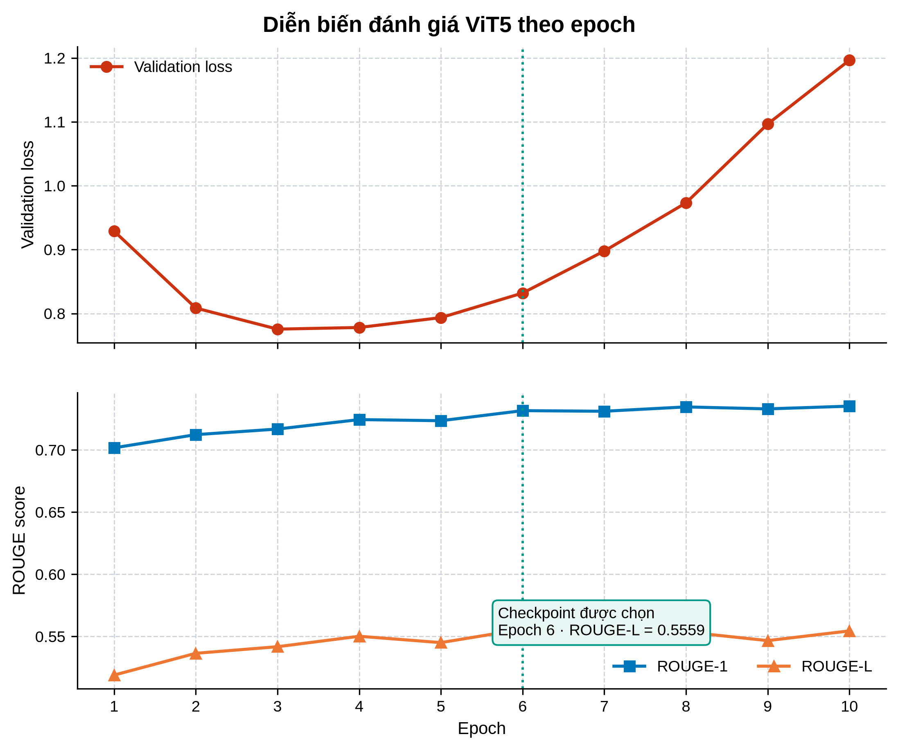

**Hình 11: Diễn biến validation loss và ROUGE-1, ROUGE-2, ROUGE-L của ViT5 trên tập con validation gồm 200 mẫu qua 10 epoch**

Sau khi huấn luyện, checkpoint được chọn đạt ROUGE-1, ROUGE-2 và ROUGE-L lần lượt là 0,7302, 0,4957 và 0,5574 trên toàn bộ 2.807 mẫu validation. Tiếp đó, mô hình và cấu hình giải mã được cố định để đánh giá trên 6.038 khối thuộc 65 cuộc họp độc lập. Kết quả cuối cùng được trình bày trong Bảng 13.

**Bảng 13: Kết quả tóm tắt khối của ViT5 trên tập đánh giá**

| Mô hình | ROUGE-1 ↑ | ROUGE-2 ↑ | ROUGE-L ↑ | Quy mô đánh giá |
| :--- | ---: | ---: | ---: | :--- |
| ViT5 sau tinh chỉnh | 0,7265 | 0,4854 | 0,5486 | 6.038 khối thuộc 65 cuộc họp |

ViT5 đạt ROUGE-1, ROUGE-2 và ROUGE-L lần lượt là 0,7265, 0,4854 và 0,5486. Tập validation chỉ được dùng để lựa chọn checkpoint, còn các giá trị trong Bảng 13 được tính trên tập đánh giá độc lập. Kết quả cho thấy cấu hình ViT5 sau tinh chỉnh có thể tạo bản tóm tắt cho các khối hội thoại theo định dạng đã thiết kế. Tuy nhiên, do chưa có kết quả của ViT5 nguyên bản hoặc mô hình đối chứng trên cùng tập dữ liệu, phép đánh giá này chưa tách riêng mức cải thiện do tinh chỉnh, nhãn người nói, kích thước khối hoặc chiến lược giải mã.

#### 5.2.5. Kết quả tạo tiêu đề BARTpho (BARTpho Topic Titling Results)

BARTpho được huấn luyện với giới hạn tối đa 20 epoch và được đánh giá sau mỗi epoch trên 327 mẫu validation. ROUGE-L được dùng làm tiêu chí lựa chọn checkpoint, kết hợp dừng sớm với patience bằng 3. Kết quả tốt nhất xuất hiện tại epoch 5, khi validation loss đạt 1,4750 và ROUGE-L đạt 0,3828. Trong ba epoch tiếp theo, ROUGE-L không vượt giá trị này, nên quá trình tự dừng tại epoch 8 và khôi phục checkpoint-230 của epoch 5. Diễn biến huấn luyện được minh họa trong Hình 12 và trình bày tại Bảng 14.

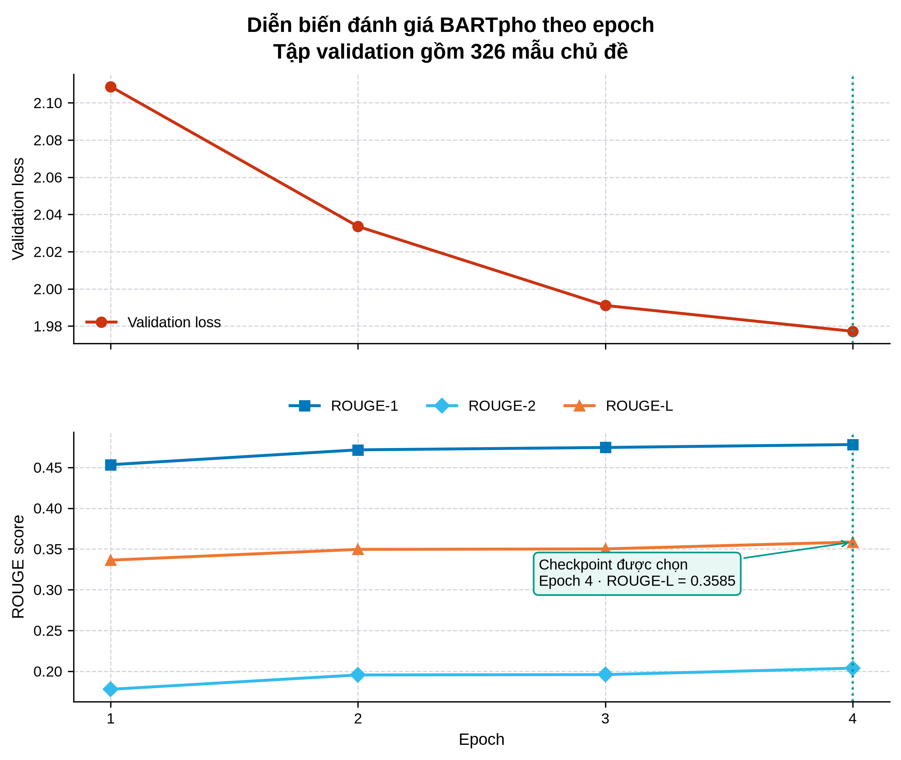

**Hình 12: Diễn biến validation loss và ROUGE-1, ROUGE-2, ROUGE-L của BARTpho trên 327 mẫu validation; checkpoint tốt nhất được chọn tại epoch 5 và huấn luyện dừng sớm tại epoch 8.**

**Bảng 14: Diễn biến đánh giá BARTpho đến thời điểm dừng sớm**

| Epoch | Validation Loss | ROUGE-1 | ROUGE-2 | ROUGE-L | Ghi chú |
|---|---:|---:|---:|---:|---|
| 1 | 2,1087 | 0,4534 | 0,1779 | 0,3363 | Bắt đầu huấn luyện |
| 2 | 2,0336 | 0,4716 | 0,1955 | 0,3495 | Các chỉ số tiếp tục cải thiện |
| 3 | 1,9911 | 0,4745 | 0,1959 | 0,3501 | Validation loss tiếp tục giảm |
| 4 | 1,9772 | 0,4781 | 0,2038 | 0,3585 | Các chỉ số tiếp tục cải thiện |
| **5** | **1,4750** | **0,5032** | **0,2334** | **0,3828** | **Checkpoint được chọn theo ROUGE-L** |
| 6 | 1,5098 | 0,4885 | 0,2179 | 0,3680 | Không cải thiện lần 1 |
| 7 | 1,5292 | 0,4876 | 0,2147 | 0,3641 | Không cải thiện lần 2 |
| 8 | 1,5727 | 0,4854 | 0,2163 | 0,3661 | Không cải thiện lần 3; dừng sớm |

Tại epoch 5, cả validation loss và ba chỉ số ROUGE đều đạt kết quả tốt nhất. Từ epoch 6 đến epoch 8, validation loss tăng và ROUGE-L dao động trong khoảng 0,3641–0,3680 nhưng không vượt 0,3828. Vì vậy, điều kiện dừng sớm được kích hoạt sau ba lần đánh giá liên tiếp không cải thiện. Cách lựa chọn này tránh tiếp tục tối ưu khi chất lượng chuỗi sinh trên validation đã suy giảm, đồng thời bảo đảm checkpoint cuối cùng tuân theo tiêu chí ROUGE-L được xác định trước.

Sau khi cố định mô hình tại epoch 5, checkpoint-230 được đánh giá trên 736 phân đoạn thuộc 65 cuộc họp độc lập. Quá trình sinh sử dụng beam search với bốn chùm, độ dài đầu vào tối đa 1.024 token và độ dài đầu ra tối đa 200 token. Kết quả được trình bày trong Bảng 15.

**Bảng 15: Kết quả tạo tiêu đề chủ đề của BARTpho trên tập đánh giá**

| Mô hình | ROUGE-Max-1 ↑ | ROUGE-Max-2 ↑ | ROUGE-Max-L ↑ | Quy mô đánh giá |
| :--- | ---: | ---: | ---: | :--- |
| BARTpho sau tinh chỉnh (checkpoint-230) | **0,5351** | **0,2830** | **0,4442** | 736 phân đoạn thuộc 65 cuộc họp |

Trên tập đánh giá, checkpoint-230 đạt ROUGE-Max-1, ROUGE-Max-2 và ROUGE-Max-L lần lượt là **0,5351**, **0,2830** và **0,4442**. Mỗi chỉ số được lấy theo tiêu đề tham chiếu phù hợp nhất rồi tính trung bình trên toàn bộ chủ đề. Kết quả cho thấy BARTpho sau tinh chỉnh có thể tạo tiêu đề từ dãy bản tóm tắt khối, nhưng chưa xác định riêng đóng góp của tiền tố tác vụ, phép lấy phần cuối đầu vào hoặc beam search. Cách tính ROUGE-Max phù hợp với dữ liệu có nhiều tiêu đề tham chiếu, nhưng có thể cho kết quả cao hơn đánh giá một tham chiếu. Tương tự ViT5, chưa có kết quả đối chứng được tái lập trên cùng tập dữ liệu nên các giá trị này không được diễn giải như bằng chứng về ưu thế tương đối.

#### 5.2.6. Phân tích lỗi định tính (Qualitative Error Analysis)

Các chỉ số ROUGE phản ánh mức độ tương đồng với văn bản tham chiếu nhưng không cho biết trực tiếp loại lỗi mà mô hình tạo ra. Vì vậy, nghiên cứu đối chiếu thêm các trường hợp có điểm cao và điểm thấp trên tập đánh giá; ví dụ đầy đủ được trình bày tại Phụ lục E. Phân tích này tập trung vào tính đúng chủ đề, mức độ giữ lại nội dung chính và sự xuất hiện của thông tin không được hỗ trợ bởi đầu vào.

Đối với ViT5, trường hợp có điểm cao giữ đúng nhận định chính về hạn chế của khuyến khích bằng tiền và chỉ thay đổi cách diễn đạt. Ngược lại, ở trường hợp điểm thấp, đầu vào thảo luận về phòng tập và thiết bị thể dục nhưng mô hình sinh nội dung liên quan đến thanh toán và thương mại điện thoại. Đây là lỗi sinh thông tin không xuất hiện trong khối lượt lời, cho thấy điểm ROUGE trung bình tương đối cao không loại trừ nguy cơ sai lệch ở từng mẫu.

Đối với BARTpho, trường hợp tốt tạo được tiêu đề trùng với tham chiếu về việc mời người dẫn chương trình và khách mời. Trường hợp điểm thấp lại đề cập ngân sách giải thưởng trong khi tiêu đề tham chiếu liên quan đến việc duy trì trật tự. Lỗi này cho thấy mô hình có thể tạo câu tiêu đề đúng hình thức nhưng không đại diện cho phân đoạn đầu vào. Hai nhóm lỗi trên cần được xem xét cùng kết quả định lượng, đặc biệt khi hệ thống được sử dụng để theo dõi nội dung cuộc họp theo thời gian thực.

#### 5.2.7. Phân tích tổng hợp (Overall Analysis)

Các kết quả định lượng cho thấy Multi-Scale Sliding TextTiling đạt kết quả trung bình tốt nhất trên cả ba chỉ số trong nhóm phương pháp có thể tái lập; phép triệt tiêu tiếp tục cho thấy chuẩn hóa cục bộ và gộp phân đoạn ngắn đóng góp rõ nhất vào cấu hình đầy đủ. Khi chuyển sang xử lý tăng dần, chất lượng giảm nhẹ nhưng chi phí tính toán riêng của mô-đun vẫn thấp. ViT5 và BARTpho tạo được đầu ra có thể đánh giá bằng ROUGE trên dữ liệu giữ lại, qua đó xác nhận khả năng vận hành của hai tác vụ sinh văn bản sau tinh chỉnh. Tuy nhiên, hai mô hình tạo sinh chưa có phương pháp đối chứng được tái lập trên cùng giao thức và phân tích định tính mới giới hạn ở các ví dụ trong Phụ lục E. Vì vậy, bằng chứng hiện tại ủng hộ thiết kế phân đoạn chủ đề và tính khả thi của quy trình tóm tắt phân cấp, nhưng chưa đủ để khẳng định mọi lựa chọn mô hình hoặc cấu hình đều tối ưu.

#### 5.2.8. Đánh giá ASR và phân định người nói (ASR and Speaker Diarization Evaluation)

[Phần đánh giá chi tiết, số liệu thực nghiệm cụ thể và các bảng biểu so sánh về hiệu năng nhận dạng tiếng nói (ASR) và phân định người nói (speaker diarization) sẽ được cập nhật đầy đủ tại đây sau.]

### 5.3. Thảo luận (Discussion)

Kết quả phân đoạn cho thấy phương pháp đề xuất đạt trung bình tốt hơn NLTK TextTiling và baseline đơn phạm vi trên cả $P_k$, WindowDiff và macro-$F_1$. Tuy nhiên, lợi thế này không xuất hiện đồng đều trên mọi miền: NLTK TextTiling vẫn có $P_k$ thấp hơn trên AMI, QMSum và ICSI, trong khi phương pháp đề xuất đạt WindowDiff và macro-$F_1$ tốt hơn trên phần lớn các tập. Kết quả này cho thấy thiết kế đa phạm vi cải thiện khả năng xác định ranh giới nói chung nhưng vẫn gặp khó khăn khi cuộc họp dài, chủ đề thay đổi từ từ hoặc nhiều phần thảo luận sử dụng chung thuật ngữ.

Phép triệt tiêu làm rõ rằng chuẩn hóa cục bộ và gộp phân đoạn ngắn tạo ra đóng góp trực tiếp nhất trong cấu hình hiện tại. Trái lại, cửa sổ trượt và điểm sâu đa phạm vi không cải thiện đơn điệu cả ba chỉ số khi được bổ sung riêng. Vai trò của cửa sổ trượt chủ yếu nằm ở khả năng tiếp nhận dữ liệu tăng dần, còn quét đa phạm vi cung cấp tín hiệu ở nhiều độ dài ngữ cảnh. Vì vậy, giá trị của hai thành phần này cần được đánh giá đồng thời theo chất lượng ranh giới và độ trễ vận hành thay vì chỉ dựa trên kết quả theo lô.

Đối với tóm tắt phân cấp, ViT5 và BARTpho đều tạo được đầu ra có mức tương đồng đo được trên 65 cuộc họp độc lập. Dù vậy, các ví dụ định tính cho thấy cả hai mô hình vẫn có thể sinh nội dung lệch khỏi đầu vào. Kết quả hiện tại xác nhận tính khả thi của quy trình nhưng chưa chứng minh rằng các mô hình sau tinh chỉnh tốt hơn mô hình nền hoặc những kiến trúc khác, do chưa có phép so sánh được tái lập trên cùng tập đánh giá. Nhận định về hiệu quả của toàn hệ thống vì thế được giới hạn ở các thành phần đã có bằng chứng thực nghiệm.

### 5.4. Hạn chế của thực nghiệm (Experimental Limitations)


---


## Tài liệu tham khảo (References)

[@Hearst1997] M. A. Hearst, “TextTiling: Segmenting text into multi-paragraph subtopic passages,” *Computational Linguistics*, vol. 23, no. 1, pp. 33–64, 1997.

[@Vaswani2017] A. Vaswani, N. Shazeer, N. Parmar, J. Uszkoreit, L. Jones, A. N. Gomez, Ł. Kaiser, and I. Polosukhin, “Attention is all you need,” in *Advances in Neural Information Processing Systems*, 2017, pp. 5998–6008.

[@Raffel2020] C. Raffel, N. Shazeer, A. Roberts, K. Lee, S. Narang, M. Matena, Y. Zhou, W. Li, and P. J. Liu, “Exploring the limits of transfer learning with a unified text-to-text transformer,” *Journal of Machine Learning Research*, vol. 21, no. 140, pp. 1–67, 2020.

[@Lewis2020] M. Lewis, Y. Liu, N. Goyal, M. Ghazvininejad, A. Mohamed, O. Levy, V. Stoyanov, and L. Zettlemoyer, “BART: Denoising sequence-to-sequence pre-training for natural language generation, translation, and comprehension,” in *Proceedings of ACL*, 2020, pp. 7871–7880.

[@Phan2022] L. Phan, H. Tran, H. Nguyen, and T. H. Trinh, “ViT5: Pretrained Text-to-Text Transformer for Vietnamese Language Generation,” in *Proceedings of the NAACL 2022 Student Research Workshop*, 2022, pp. 136–142, doi: 10.18653/v1/2022.naacl-srw.18.

[@Nguyen2022] N. L. Tran, D. M. Le, and D. Q. Nguyen, “BARTpho: Pre-trained Sequence-to-Sequence Models for Vietnamese,” in *Proceedings of Interspeech 2022*, 2022, pp. 1751–1755. Preprint: arXiv:2109.09701.

[@Asthana2025Recap] S. Asthana, S. Hilleli, P. He, and A. Halfaker, “Summaries, Highlights, and Action Items: Design, Implementation and Evaluation of an LLM-powered Meeting Recap System,” *Proceedings of the ACM on Human-Computer Interaction*, vol. 9, no. CSCW1, pp. 1–29, 2025.

[@Lin2004] C.-Y. Lin, “ROUGE: A package for automatic evaluation of summaries,” in *Text Summarization Branches Out*, 2004, pp. 74–81.

[@Zhang2020] T. Zhang, V. Kishore, F. Wu, K. Q. Weinberger, and Y. Artzi, “BERTScore: Evaluating text generation with BERT,” in *International Conference on Learning Representations*, 2020.

[@Beeferman1999] D. Beeferman, A. Berger, and J. Lafferty, “Statistical models for text segmentation,” *Machine Learning*, vol. 34, pp. 177–210, 1999.

[@Pevzner2002] L. Pevzner and M. A. Hearst, “A critique and improvement of an evaluation metric for text segmentation,” *Computational Linguistics*, vol. 28, no. 1, pp. 19–36, 2002.

[@Liu2024Lost] N. F. Liu, K. Lin, P. Hewitt, A. Paranjape, M. Bevilacqua, F. Petroni, and P. Liang, “Lost in the middle: How language models use long contexts,” *Transactions of the Association for Computational Linguistics*, vol. 12, pp. 26–44, 2024.

[@Zhang2023MUG] Q. Zhang, C. Deng, J. Liu, H. Yu, Q. Chen, W. Wang, Z. Yan, J. Liu, Y. Ren, and Z. Zhao, “MUG: A General Meeting Understanding and Generation Benchmark,” *arXiv preprint arXiv:2303.13939*, 2023.

[@Carletta2005] J. Carletta, S. Ashby, S. Bourban, M. Flynn, M. Guillemot, T. Hain, J. Kadlec, V. Karaiskos, W. Kraaij, M. Kronenthal, G. Lathoud, M. Lincoln, A. Lisowska, I. McCowan, W. Post, D. Reidsma, and P. Wellner, “The AMI Meeting Corpus,” in *Proceedings of the 5th International Conference on Methods and Techniques in Behavioral Research*, 2005.

[@Janin2003] A. Janin, D. Baron, J. Edwards, D. Ellis, D. Gelbart, N. Morgan, B. Peskin, T. Pfau, E. Shriberg, A. Stolcke, and C. Wooters, “The ICSI Meeting Corpus,” in *Proceedings of ICASSP*, 2003.

[@Feng2020] S. Feng, H. Wan, C. Gunasekara, H. Patel, S. Joshi, and L. A. Lastras, “Doc2Dial: A Framework for Document-grounded Task-oriented Dialogue,” in *Proceedings of EMNLP*, 2020.

[@Xu2020] Y. Xu, H. Zhao, and Z. Zhang, “Topic-Aware Multi-turn Dialogue Modeling,” *arXiv preprint arXiv:2009.12539*, 2020, doi: 10.48550/arXiv.2009.12539.

[@TIAGE2021] H. Xie, Z. Liu, C. Xiong, Z. Liu, and A. Copestake, “TIAGE: A Benchmark for Topic-Shift Aware Dialog Modeling,” in *Findings of the Association for Computational Linguistics: EMNLP 2021*, 2021, pp. 1684–1690, doi: 10.18653/v1/2021.findings-emnlp.145.

[@Xing2021] L. Xing and G. Carenini, “Improving Unsupervised Dialogue Topic Segmentation with Utterance-Pair Coherence Scoring,” in *Proceedings of the 22nd Annual Meeting of the Special Interest Group on Discourse and Dialogue*, 2021, pp. 167–177, doi: 10.18653/v1/2021.sigdial-1.18.

[@He2025] R. He, Z. Wang, M. Qiang, H. Wang, Y. Zhang, H. Xu, S. Fan, and G. Zhou, “One-Dimensional Object Detection for Streaming Text Segmentation of Meeting Dialogue,” in *Findings of the Association for Computational Linguistics: ACL 2025*, 2025, pp. 4118–4130.

[@Wolf2020] T. Wolf, L. Debut, V. Sanh, J. Chaumond, C. Delangue, A. Moi, P. Cistac, T. Rault, R. Louf, M. Funtowicz, J. Davison, S. Shleifer, P. von Platen, C. Ma, Y. Jernite, J. Plu, C. Xu, T. L. Scao, S. Gugger, M. Drame, Q. Lhoest, and A. M. Rush, “Transformers: State-of-the-Art Natural Language Processing,” in *Proceedings of EMNLP*, 2020.

[@Colvin2024] S. Colvin, “Pydantic: Data validation using Python type hints,” 2024.

[@Stopwordsiso2024] stopwordsiso: Multilingual stop vocabulary, 2024.

[@Yao2023Zipformer] Z. Yao, L. Guo, X. Yang, W. Kang, F. Kuang, T. Zhao, and D. Povey, “Zipformer: A novel transducer model for automatic speech recognition,” in *Proceedings of Interspeech 2023*, 2023, pp. 4304–4308.

[@Chen2022WeSpeaker] W. Chen, C. Xing, X. Chen, and L. Xie, “WeSpeaker: A Research and Production Oriented Systematic Toolkit for Speaker Embedding Learning,” *arXiv preprint arXiv:2210.10616*, 2022.

[@SileroVAD2021] Silero Team, “Silero VAD: Pre-trained enterprise-grade Voice Activity Detector,” GitHub repository, 2021. [Online]. Available: https://github.com/snakers4/silero-vad

[@Anguera2012Speaker] X. Anguera, S. Bozonnet, N. Evans, C. Fredouille, G. Friedland, and O. Vinyals, “Speaker diarization: A review of recent research,” *IEEE Transactions on Audio, Speech, and Language Processing*, vol. 20, no. 2, pp. 356–370, 2012.

[@Park2022Review] T. J. Park, N. Kanda, D. Dimitriadis, K. J. Han, S. Watanabe, and M. Ostendorf, “A review of speaker diarization systems in the era of deep learning,” *Computer Speech & Language*, vol. 72, p. 101317, 2022.

[@Zhong2021] M. Zhong, D. Yin, T. Yu, L. Zaidi, M. Mutuma, R. Jha, A. H. Awadallah, A. Celikyilmaz, and D. Radev, “QMSum: A New Benchmark for Query-based Multi-domain Meeting Summarization,” in *Proceedings of the 2021 Conference of the North American Chapter of the Association for Computational Linguistics: Human Language Technologies*, 2021, pp. 5929–5940.

---

## Phụ lục (Appendix)

### A. Kết quả phân đoạn chi tiết (Detailed Segmentation Results)

Phụ lục này trình bày kết quả của ba phương pháp có thể tái lập trên từng bộ dữ liệu. Tất cả phương pháp được chạy trên cùng dữ liệu và sử dụng cùng cách tính $P_k$, WindowDiff và macro-$F_1$.

**Bảng A1: Kết quả phân đoạn trên DialSeg711**

| Phương pháp | $P_k$ ↓ | WindowDiff ↓ | Macro-$F_1$ ↑ |
| :--- | ---: | ---: | ---: |
| NLTK TextTiling | 0,4743 | 0,4797 | 0,6153 |
| TextTiling từ vựng đơn phạm vi | 0,3903 | 0,4976 | **0,7035** |
| Multi-Scale Sliding TextTiling (đề xuất) | **0,3633** | **0,3685** | 0,7018 |

**Bảng A2: Kết quả phân đoạn trên Doc2Dial**

| Phương pháp | $P_k$ ↓ | WindowDiff ↓ | Macro-$F_1$ ↑ |
| :--- | ---: | ---: | ---: |
| NLTK TextTiling | 0,5446 | 0,5467 | 0,6695 |
| TextTiling từ vựng đơn phạm vi | 0,5224 | 0,5626 | 0,6546 |
| Multi-Scale Sliding TextTiling (đề xuất) | **0,5120** | **0,5213** | **0,6810** |

**Bảng A3: Kết quả phân đoạn trên AMI Meeting Corpus**

| Phương pháp | $P_k$ ↓ | WindowDiff ↓ | Macro-$F_1$ ↑ |
| :--- | ---: | ---: | ---: |
| NLTK TextTiling | **0,6162** | 0,9385 | 0,5175 |
| TextTiling từ vựng đơn phạm vi | 0,6447 | 0,9964 | 0,4374 |
| Multi-Scale Sliding TextTiling (đề xuất) | 0,6415 | **0,9298** | **0,5287** |

**Bảng A4: Kết quả phân đoạn trên QMSum Committee**

| Phương pháp | $P_k$ ↓ | WindowDiff ↓ | Macro-$F_1$ ↑ |
| :--- | ---: | ---: | ---: |
| NLTK TextTiling | **0,5261** | 0,8082 | 0,4482 |
| TextTiling từ vựng đơn phạm vi | 0,5887 | 0,9418 | 0,4875 |
| Multi-Scale Sliding TextTiling (đề xuất) | 0,5595 | **0,6335** | **0,5651** |

**Bảng A5: Kết quả phân đoạn trên ICSI Meeting Corpus**

| Phương pháp | $P_k$ ↓ | WindowDiff ↓ | Macro-$F_1$ ↑ |
| :--- | ---: | ---: | ---: |
| NLTK TextTiling | **0,5966** | **0,9369** | 0,5057 |
| TextTiling từ vựng đơn phạm vi | 0,6162 | 1,0000 | 0,4318 |
| Multi-Scale Sliding TextTiling (đề xuất) | 0,6166 | 0,9874 | **0,5103** |

**Bảng A6: Kết quả phân đoạn trên TIAGE**

| Phương pháp | $P_k$ ↓ | WindowDiff ↓ | Macro-$F_1$ ↑ |
| :--- | ---: | ---: | ---: |
| NLTK TextTiling | 0,5007 | 0,5120 | 0,6283 |
| TextTiling từ vựng đơn phạm vi | 0,4833 | 0,5764 | 0,6327 |
| Multi-Scale Sliding TextTiling (đề xuất) | **0,4624** | **0,4780** | **0,6667** |

**Bảng A7: Kết quả chi tiết của Multi-Scale Sliding TextTiling trong chế độ luồng**

| Bộ dữ liệu | $P_k$ ↓ | WindowDiff ↓ | Macro-$F_1$ ↑ | Thời gian/lượt lời | Độ trễ chốt TB |
| :--- | ---: | ---: | ---: | ---: | ---: |
| DialSeg711 | 0,3657 | 0,3743 | 0,7077 | 0,0325 ms | 27,09 lượt lời |
| Doc2Dial | 0,5099 | 0,5166 | 0,6827 | 0,0514 ms | — |
| AMI Meeting Corpus | 0,6427 | 0,9889 | 0,4709 | 0,0939 ms | 21,58 lượt lời |
| QMSum Committee | 0,5709 | 0,8532 | 0,5288 | 0,2370 ms | 21,55 lượt lời |
| ICSI Meeting Corpus | 0,6162 | 1,0000 | 0,4606 | 0,1063 ms | 21,53 lượt lời |
| TIAGE | 0,4664 | 0,4900 | 0,6669 | 0,0426 ms | — |

Doc2Dial và TIAGE không có ranh giới được công bố trước khi gọi thao tác kết thúc luồng trong cấu hình hiện tại, nên độ trễ chốt trực tuyến không được báo cáo. Đối với DialSeg711, chỉ 68 ranh giới được công bố trực tuyến; vì vậy giá trị độ trễ của tập này không đại diện cho phần lớn hội thoại ngắn. Ba bộ dữ liệu cuộc họp dài tạo ra phần lớn ranh giới trực tuyến và có độ trễ trung bình xấp xỉ 21,5 lượt lời.

### B. Diễn biến huấn luyện ViT5 (ViT5 Training Progress)

**Bảng B1: Validation loss và ROUGE của ViT5 trên tập con validation gồm 200 mẫu qua từng epoch**

| Epoch | Validation loss | ROUGE-1 | ROUGE-2 | ROUGE-L | Nhận xét |
| ---: | ---: | ---: | ---: | ---: | :--- |
| 1 | 0,9289 | 0,7017 | 0,4487 | 0,5190 | Bắt đầu huấn luyện |
| 2 | 0,8085 | 0,7123 | 0,4660 | 0,5365 | Các chỉ số tiếp tục cải thiện |
| 3 | **0,7755** | 0,7168 | 0,4803 | 0,5418 | Validation loss thấp nhất |
| 4 | 0,7781 | 0,7244 | 0,4860 | 0,5502 | Validation loss bắt đầu tăng |
| 5 | 0,7935 | 0,7235 | 0,4897 | 0,5451 | Biến động nhẹ |
| **6** | 0,8320 | 0,7316 | 0,4967 | **0,5559** | **Checkpoint được chọn theo ROUGE-L** |
| 7 | 0,8977 | 0,7311 | 0,4905 | 0,5500 | Validation loss tiếp tục tăng |
| 8 | 0,9731 | 0,7346 | 0,4995 | 0,5537 | Validation loss tiếp tục tăng |
| 9 | 1,0966 | 0,7330 | 0,4910 | 0,5467 | ROUGE-L suy giảm |
| 10 | 1,1964 | **0,7352** | 0,4968 | 0,5545 | Validation loss cao hơn epoch 6 |

### C. Cấu hình hệ thống cốt lõi (Core System Configurations)

Phụ lục này phân biệt cấu hình mặc định của phần mềm với cấu hình được sử dụng trong thực nghiệm chính. Dấu gạch ngang biểu thị tham số không tham gia vào phép đánh giá tương ứng.

**Bảng C1: Cấu hình mặc định và cấu hình thực nghiệm của hệ thống**

| Thành phần | Tham số | Mặc định hệ thống | Thực nghiệm chính |
| :--- | :--- | :---: | :---: |
| Silero VAD | Ngưỡng phát hiện giọng nói | 0,5 | — |
| Silero VAD | Khoảng lặng tối thiểu | 0,25 giây | — |
| Silero VAD | Độ dài tiếng nói tối thiểu / tối đa | 0,50 / 5,0 giây | — |
| Zipformer ASR | Mô hình nền | Zipformer-30M-RNNT-6000h | — |
| WeSpeaker | Mô hình nền | ResNet34 | — |
| WeSpeaker | Ngưỡng tương đồng cosine | 0,88 | — |
| Multi-Scale Sliding TextTiling | Kích thước nhóm $k$ | 2 | 2 |
| Multi-Scale Sliding TextTiling | Tập phạm vi $R$ | $\{3,5,10,15,20\}$ | $\{3,5,10,15,20\}$ |
| Multi-Scale Sliding TextTiling | Hệ số ngưỡng $\alpha$ | 1,0 | 1,2 |
| Multi-Scale Sliding TextTiling | Tỷ lệ độ dài tối thiểu $\gamma$ | 0,08 | 0,20 |
| Multi-Scale Sliding TextTiling | Kích thước cửa sổ $W$ | 40 lượt lời | 40 lượt lời |
| Multi-Scale Sliding TextTiling | Bước dịch $S$ | 5 lượt lời | 5 lượt lời |
| Multi-Scale Sliding TextTiling | Vùng nhìn trước $L$ | 20 lượt lời | 20 lượt lời trong đánh giá luồng; không dùng khi đánh giá theo lô |
| Multi-Scale Sliding TextTiling | Chuẩn hóa / phép gộp điểm | Z-score / trung bình | Z-score / trung bình |
| Phân chia khối | Số lượt lời tối đa trong một khối | 8 | 8 |
| ViT5 | Độ dài đầu vào / đầu ra tối đa | 512 / 128 token | 512 / 128 token |
| ViT5 | Số chùm tìm kiếm | 4 | 4 |
| BARTpho | Độ dài đầu vào | 1.024 token, lấy tối đa 1.500 ký tự cuối | Như cấu hình mặc định |
| BARTpho | Độ dài đầu ra tối đa / số chùm tìm kiếm | 200 token / 4 | 200 token / 4 |
| Hệ thống điều phối | Số lượt lời tối đa | 5.000 | — |

### D. Định dạng dữ liệu và sự kiện luồng (Data Formats and Streaming Events)

Các mô-đun trao đổi dữ liệu theo một cấu trúc thống nhất để bảo toàn thứ tự thời gian và thông tin người nói trong suốt quá trình xử lý. Bảng D1 trình bày đầu vào và đầu ra chính tại từng bước của hệ thống.

**Bảng D1: Giao diện dữ liệu giữa các mô-đun**

| Mô-đun | Đầu vào | Đầu ra |
| :--- | :--- | :--- |
| Tiền xử lý âm thanh | Luồng PCM Float32, đơn kênh, 16 kHz | Các đoạn âm thanh chứa tiếng nói |
| Phân định người nói | Đoạn âm thanh chứa tiếng nói | Nhãn người nói của từng đoạn |
| Nhận dạng tiếng nói | Đoạn âm thanh chứa tiếng nói | Văn bản nhận dạng và thời lượng |
| Phân đoạn chủ đề | Chuỗi lượt lời gồm người nói, nội dung và chỉ số thời gian | Phạm vi phân đoạn, vị trí ranh giới và điểm sâu |
| Tóm tắt phân cấp | Các phân đoạn chủ đề đã đóng | Tóm tắt khối, tiêu đề chủ đề và biên bản cuối cùng |

Hai mô hình sinh văn bản nhận đầu vào theo định dạng tác vụ như sau. Tiền tố giúp mô hình phân biệt rõ yêu cầu tóm tắt và yêu cầu tạo tiêu đề.

**Liệt kê D1: Định dạng đầu vào của ViT5 và BARTpho**

```text
ViT5:
"Tóm tắt: " || "<người nói 1>: <lượt lời 1>\n...\n<người nói n>: <lượt lời n>"

BARTpho:
"Tạo tiêu đề: " || "<tóm tắt khối 1> / ... / <tóm tắt khối m>"
```

Trong chế độ luồng, kết quả trung gian được công bố bằng năm loại sự kiện. Cách tổ chức này cho phép giao diện cập nhật dần nội dung mà không phải chờ toàn bộ cuộc họp kết thúc.

**Bảng D2: Các sự kiện được phát trong quá trình xử lý luồng**

| Sự kiện | Thời điểm phát | Nội dung chính |
| :--- | :--- | :--- |
| `utterance-accepted` | Khi một lượt lời được nhận dạng và chấp nhận | Chỉ số, người nói, nội dung và thời lượng lượt lời |
| `segment-closed` | Khi ranh giới chủ đề được xác nhận | Phạm vi phân đoạn và thông tin ranh giới |
| `chunk-closed` | Khi một khối lượt lời hoàn tất | Phạm vi khối và bản tóm tắt khối |
| `title-emitted` | Khi tiêu đề chủ đề được sinh | Mã phân đoạn và tiêu đề chủ đề |
| `meeting-completed` | Khi luồng âm thanh kết thúc | Biên bản hoàn chỉnh và thời gian xử lý |

Kết quả cuối cùng giữ cấu trúc phân cấp từ cuộc họp đến chủ đề, khối và lượt lời, như minh họa trong Liệt kê D2.

**Liệt kê D2: Cấu trúc rút gọn của kết quả cuộc họp**

```json
{
  "meeting_id": "...",
  "segments": [
    {
      "segment_id": 1,
      "title": "...",
      "utterances_start": 0,
      "utterances_end": 15,
      "chunks": [
        {
          "chunk_id": 1,
          "rolling_summary": "...",
          "utterances": [
            {"speaker": "SPEAKER_00", "text": "...", "index": 0}
          ]
        }
      ]
    }
  ],
  "generated_at": "...",
  "processing_time_ms": 0
}
```

### E. Ví dụ đầu ra đại diện (Representative Output Examples)

Phụ lục này trình bày một trường hợp có điểm cao và một trường hợp có điểm thấp của mỗi tác vụ trên dữ liệu đánh giá. Các ví dụ được lấy từ kết quả thực nghiệm thực tế nhằm bổ sung góc nhìn định tính cho các chỉ số tổng hợp trong Chương 5.

**Bảng E1: Ví dụ đầu ra của mô hình tóm tắt khối ViT5**

| Mức kết quả | Đầu vào rút gọn | Dự đoán | Tham chiếu | ROUGE-1 / ROUGE-2 / ROUGE-L |
| :--- | :--- | :--- | :--- | :---: |
| Cao | “Chỉ dựa vào tiền để khích lệ thì không đủ... Vấn đề tư duy vẫn chưa được giải quyết.” | Người tham gia thảo luận rằng việc chỉ dựa vào tiền để khích lệ là không đủ, và vấn đề tư duy vẫn chưa được giải quyết. | Người tham gia nhận định rằng việc chỉ dựa vào tiền để khích lệ là không đủ, và vấn đề tư duy vẫn chưa được giải quyết. | 0,9351 / 0,8800 / 0,9351 |
| Thấp | “Công ty đã xây phòng tập... bổ sung thiết bị thể dục có thể tiết kiệm chi phí.” | Các thành viên thảo luận về mục tiêu thanh toán, sử dụng tiền mặt và ứng dụng thương mại điện thoại để thúc đẩy doanh số. | Đề xuất bổ sung thiết bị thể dục sẽ giúp tiết kiệm chi phí và đáp ứng nhu cầu của nhân viên. | 0,4132 / 0,0840 / 0,2314 |

**Bảng E2: Ví dụ đầu ra của mô hình tạo tiêu đề BARTpho**

| Mức kết quả | Dự đoán | Tham chiếu | ROUGE-1 / ROUGE-2 / ROUGE-L |
| :--- | :--- | :--- | :---: |
| Cao | Vấn đề liên quan đến việc mời người dẫn chương trình và khách mời | Vấn đề liên quan đến việc mời người dẫn chương trình và khách mời | 1,0000 / 1,0000 / 1,0000 |
| Thấp | Thảo luận về ngân sách cho giải thưởng và giải thưởng | Khuyến nghị để sinh viên của khoa duy trì trật tự | 0,1212 / 0,0000 / 0,1212 |

Các trường hợp có điểm cao cho thấy mô hình giữ được nội dung chính dù cách diễn đạt khác với tham chiếu. Ngược lại, ví dụ điểm thấp của ViT5 xuất hiện thông tin không có trong đầu vào, còn BARTpho tạo tiêu đề lệch khỏi chủ đề cần mô tả. Kết quả này cho thấy đánh giá định lượng cần được kết hợp với phân tích định tính để nhận diện các lỗi sinh nội dung.
