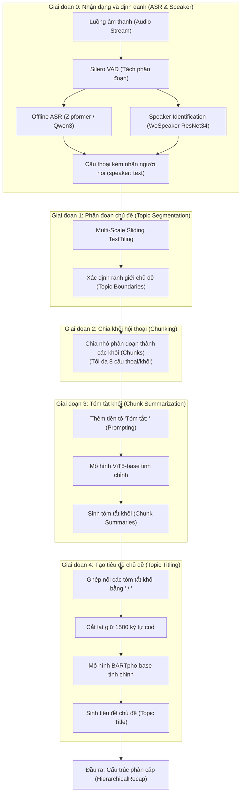
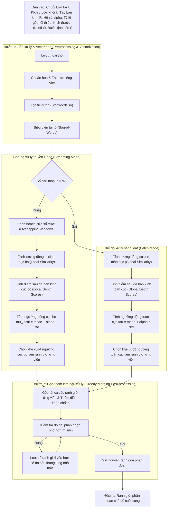

# XÂY DỰNG HỆ THỐNG TÓM TẮT CUỘC HỌP TIẾNG VIỆT THEO THỜI GIAN THỰC SỬ DỤNG PHÂN ĐOẠN CHỦ ĐỀ VÀ MÔ HÌNH SINH PHÂN CẤP

## Đặc tả Dự án (Project Specification)

**Tóm tắt (Abstract)**

Các cuộc họp trực tuyến và họp nội bộ hàng ngày đã trở thành phương thức giao tiếp thiết yếu trong hoạt động của các doanh nghiệp hiện nay. Tuy nhiên, việc khai thác thông tin tự động hiện tại vẫn đối mặt với các hạn chế kỹ thuật rõ rệt: tỷ lệ lỗi từ (word error rate - WER) cao của nhận dạng tiếng nói tự động (automatic speech recognition - ASR) trong môi trường nhiều tiếng ồn và chồng chéo giọng nói; sự thiếu hụt cơ chế định danh người nói (speaker identification) trong thời gian thực; sai số phân đoạn lớn khi chủ đề chuyển dịch liên tục và không có ranh giới rõ ràng; cũng như hiện tượng mất mát thông tin (lost-in-the-middle) hoặc vượt giới hạn ngữ cảnh của các mô hình tóm tắt đối với hội thoại dài.  Để giải quyết những thách thức này, nghiên cứu này trình bày việc thiết kế và triển khai một quy trình (pipeline) tóm tắt cuộc họp tiếng Việt theo thời gian thực, xử lý trực tiếp từ luồng âm thanh đầu vào (streaming audio) qua ba giai đoạn liên kết chặt chẽ: ASR, định danh người nói và tóm tắt phân cấp (hierarchical summarization). Đầu tiên, luồng tín hiệu âm thanh được giải mã thành văn bản bằng  Zipformer kết hợp định danh người nói qua mô hình WeSpeaker ResNet34 để gán nhãn hội thoại. Dựa trên luồng câu thoại có nhãn người nói này, hệ thống áp dụng giải thuật phân đoạn chủ đề cửa sổ trượt đa quy mô (multi-scale sliding TextTiling) phi giám sát nhằm phát hiện các ranh giới chuyển dịch chủ đề. Cuối cùng, các phân đoạn chủ đề được chia nhỏ thành các khối lượt lời (chunk) để tiến hành tóm tắt qua mô hình ViT5 tinh chỉnh (fine-tuned ViT5) và sinh tiêu đề chủ đề (topic titles) thông qua mô hình BARTpho. Nhằm tối ưu hóa hiệu năng luồng, hệ thống vận hành theo cơ chế xử lý tăng dần với độ trễ xác nhận (confirmation delay) dựa trên năm loại sự kiện đầu ra. Kết quả thực nghiệm cho thấy khâu ASR và định danh người nói đạt hiệu năng ổn định trên thiết bị cục bộ với kết quả thử nghiệm thực tế tương ứng là x, y, z. Trên sáu bộ dữ liệu phân đoạn chủ đề, thuật toán đề xuất đạt điểm số $F_1$ trung bình là 0,1838, chỉ số $P_k$ trung bình là 0,5034 và chỉ số WindowDiff trung bình là 0,5413. Đối với tác vụ tóm tắt khối và tạo tiêu đề trên bộ dữ liệu AliMeeting4MUG_vi, mô hình ViT5 đạt điểm số ROUGE-L là 0,5486, trong khi mô hình BARTpho đạt điểm ROUGE-Max-L là 0,4443. Thực nghiệm cho thấy tính khả thi ở cấp độ thành phần (component-level feasibility) của quy trình liên kết từ tín hiệu giọng nói đến văn bản tóm tắt phân cấp, đặt nền tảng cho các ứng dụng quản lý họp trực tuyến tự động.

**Từ khóa:** Tóm tắt cuộc họp; Phân đoạn chủ đề; Sliding TextTiling.

## Mở đầu (Introduction)

Các cuộc họp trực tuyến và họp nội bộ hàng ngày đã trở thành phương thức giao tiếp thiết yếu trong hoạt động của các doanh nghiệp hiện đại, tạo ra khối lượng lớn dữ liệu âm thanh và bản ghi lời thoại (transcript) cần được lưu trữ và quản lý [@Carletta2005, @Janin2003, @Asthana2025Recap]. Việc khai thác thông tin từ các cuộc họp này đóng vai trò quan trọng trong việc lưu giữ tri thức doanh nghiệp và hỗ trợ quá trình ra quyết định. Tuy nhiên, việc ghi chép và tóm tắt cuộc họp thủ công đòi hỏi chi phí nhân lực lớn, đồng thời dễ gặp sai sót và thiếu tính đồng bộ. Sự chuyển dịch ghi chép và tóm tắt cuộc họp thủ công hướng tới tự động hóa quy trình phân tích hội thoại phản ánh nhu cầu cấp thiết về một hệ thống tích hợp có khả năng xử lý trực tiếp từ luồng tín hiệu giọng nói sang các văn bản tóm tắt có cấu trúc rõ ràng.

Để xây dựng một hệ thống tự động hoàn chỉnh đi trực tiếp từ tín hiệu âm thanh đầu vào cho đến văn bản tóm tắt cuộc họp (meeting summary) đầu ra, khâu nhận dạng tiếng nói tự động (automatic speech recognition - ASR) [@Yao2023Zipformer, @Chu2024Qwen2Audio] và khâu định danh người nói (speaker identification) [@Chen2022WeSpeaker] đóng vai trò là những bước nền móng đầu tiên. Cụ thể, khâu nhận dạng (ASR) chịu trách nhiệm chuyển đổi giọng nói thành chữ viết, trong khi khâu định danh người nói xác định danh tính của từng người phát ngôn tại mỗi thời điểm nhờ bộ phát hiện hoạt động giọng nói (voice activity detection - VAD) [@SileroVAD2021]. Sự phối hợp này tạo ra một bản ghi lời thoại được gắn nhãn người phát ngôn hoàn chỉnh, làm tiền đề cốt lõi để khâu tóm tắt phía sau có thể phân tích diễn biến cuộc họp và tạo sinh ra bản tóm tắt chủ đề chuẩn xác.

Tuy nhiên, việc triển khai khâu nhận dạng tiếng nói (ASR) và khâu định danh người nói chạy thời gian thực vẫn đối mặt với nhiều hạn chế kỹ thuật rõ rệt. Các mô hình nhận dạng tiếng nói tự động thường gặp sai số lớn (tỷ lệ lỗi từ - WER cao) khi xử lý âm thanh hội thoại thực tế chứa nhiều tạp âm, tiếng ồn môi trường và hiện tượng chồng chéo giọng nói giữa các thành viên. Đồng thời, phần lớn các giải pháp định danh người nói hiện tại hoạt động theo cơ chế ngoại tuyến (offline), đòi hỏi phải quan sát toàn bộ tệp âm thanh và thiếu khả năng đăng ký cũng như nhận diện người nói động theo thời gian thực [@Anguera2012Speaker, @Park2022Review].

Bên cạnh thách thức về xử lý tín hiệu âm thanh, việc tóm tắt các bản ghi hội thoại dài cũng gặp phải rào cản lớn về mặt xử lý văn bản. Bản ghi lời thoại cuộc họp thường có độ dài lớn, văn phong rời rạc, lặp ý và hiện tượng dịch chuyển chủ đề liên tục [@Zhong2021]. Việc xử lý trực tiếp toàn bộ văn bản hội thoại qua một mô hình ngôn ngữ lớn (large language model - LLM) đơn lẻ thường gặp trở ngại do giới hạn chiều dài ngữ cảnh (context window) đầu vào, đồng thời dễ dẫn đến tình trạng suy giảm hiệu năng thu nhận thông tin (lost-in-the-middle) và bỏ sót các nội dung quan trọng [@Liu2024Lost]. Để khắc phục vấn đề này, các phương pháp tiếp cận phân cấp thường chia văn bản hội thoại thành các phân đoạn chủ đề (topic segments) để tiến hành tóm tắt độc lập từng phần nhỏ, sau đó tổng hợp các tóm tắt trung gian thành một báo cáo phân cấp hoàn chỉnh.

Mặc dù vậy, các phương pháp phân đoạn chủ đề và tóm tắt hiện tại vẫn tồn tại những nhược điểm chưa được giải quyết triệt để. Các giải thuật phân đoạn phi giám sát truyền thống như TextTiling [@Hearst1997] dựa trên tần suất từ vựng dạng túi từ (bag-of-words) có tốc độ tính toán nhanh nhưng hoàn toàn không nhận diện được các mối quan hệ ngữ nghĩa sâu, dẫn đến điểm lỗi phân đoạn ($P_k$ [@Beeferman1999] và WindowDiff [@Pevzner2002]) cao. Ngược lại, các mô hình học sâu có giám sát tuy đạt độ chính xác ranh giới tốt [@Xing2021, @He2024] nhưng đòi hỏi chi phí tính toán GPU rất cao ở việc suy luận và không thể áp dụng cho xử lý dạng luồng (streaming) liên tục do yêu cầu phải quan sát toàn bộ ngữ cảnh. Đối với bước tóm tắt, việc sử dụng các mô hình tạo sinh lớn trên đám mây gây tốn kém chi phí vận hành và không đảm bảo tính bảo mật dữ liệu doanh nghiệp, trong khi việc tinh chỉnh các mô hình ngôn ngữ nhỏ cục bộ thường đòi hỏi nguồn dữ liệu song ngữ chất lượng cao vốn rất khan hiếm đối với tiếng Việt [@Phan2022, @Nguyen2022].

Trong luận văn này, chúng tôi giải quyết những khoảng trống công nghệ trên bằng cách giới thiệu một quy trình (pipeline) tóm tắt cuộc họp tiếng Việt thời gian thực toàn diện, hỗ trợ đầu vào trực tiếp từ luồng âm thanh đầu vào (ASR -> Speaker Identification -> Hierarchical Summarization). Các đóng góp chính của chúng tôi bao gồm:

1. Chúng tôi thiết kế và triển khai một quy trình tóm tắt cuộc họp phân cấp thời gian thực (real-time hierarchical meeting summarization pipeline) hoàn chỉnh từ đầu vào âm thanh đến văn bản tóm tắt đầu ra, vận hành theo cơ chế đẩy dữ liệu hướng sự kiện (event-driven streaming) giúp liên tục cập nhật tăng dần (incremental update) các kết quả trung gian lên giao diện người dùng theo thời gian thực.
2. Chúng tôi đề xuất giải thuật phân đoạn chủ đề cửa sổ trượt đa quy mô (multi-scale sliding TextTiling) phi giám sát mới — một cải tiến trực tiếp trên thuật toán TextTiling gốc nhằm hỗ trợ tối ưu cho chế độ truyền luồng dữ liệu (streaming) — dựa trên việc tích hợp cơ chế cửa sổ trượt và điểm độ sâu đa bán kính (multi-radius depth scoring), giúp tăng đáng kể độ chính xác ranh giới trong khi vẫn giữ nguyên tốc độ xử lý
3. Chúng tôi tinh chỉnh và phát hành bộ đôi mô hình tạo sinh sau tinh chỉnh (specialized fine-tuned generative models) gọn nhẹ cho nhiệm vụ tóm tắt và sinh tiêu đề: mô hình ViT5-base (226 triệu tham số) chuyên trách tóm tắt các khối lượt lời ngắn (chunk) và mô hình BARTpho-syllable-base (132 triệu tham số) chuyên trách tạo sinh tiêu đề chủ đề từ các tóm tắt trung gian.
4. Chúng tôi xây dựng bộ dữ liệu AliMeeting4MUG_vi dành riêng cho nhiệm vụ tóm tắt hội thoại phân cấp tiếng việt bằng cách dịch thuật từ bộ dữ liệu gốc AliMeeting MUG [@Zhang2023MUG] thông qua mô hình tencent/Hy-MT2-1.8B kết hợp hiệu đính thủ công, cung cấp một nguồn tài nguyên học thuật quý giá cho cộng đồng.
5. Chúng tôi thực hiện đánh giá thực nghiệm đa dạng và thử nghiệm benchmark chi tiết (comprehensive experimental evaluation) bao gồm: đo lường tỷ lệ lỗi từ (WER) của khâu nhận dạng tiếng nói (ASR) và độ chính xác định danh người nói; so sánh hiệu năng thuật toán phân đoạn chủ đề đề xuất với 4 phương pháp đối chứng trên 6 bộ dữ liệu; kiểm thử chất lượng tóm tắt khối và sinh tiêu đề của mô hình ViT5 và BARTpho theo thang điểm ROUGE; đồng thời đánh giá độ trễ và mức độ tiêu thụ bộ nhớ (VRAM/CPU) trong thực tế của toàn bộ hệ thống.

---


## Nghiên cứu liên quan (Related Work)

### Phương pháp nhận dạng âm thanh và tóm tắt hội thoại (Speech Recognition and Dialogue Summarization Methods)

Trong bối cảnh hội thoại trực tiếp, khâu nhận dạng tiếng nói tự động (Automatic Speech Recognition - ASR) và định danh người nói (Speaker Identification) đóng vai trò là lớp tiếp nhận thông tin đầu vào quan trọng. Các nghiên cứu về định danh người nói (speaker diarization) đã chuyển dịch mạnh mẽ từ các phương pháp phân cụm truyền thống [@Anguera2012Speaker] sang các kiến trúc học sâu tích hợp vector nhúng (speaker embedding learning) [@Park2022Review]. Điển hình là bộ công cụ WeSpeaker [@Chen2022WeSpeaker] sử dụng kiến trúc ResNet34 để trích xuất các đặc trưng giọng nói có độ chính xác cao. Song song đó, các mô hình nhận dạng tiếng nói dạng Transducer như Zipformer [@Yao2023Zipformer] hoặc các mô hình hiểu âm thanh đa nhiệm như Qwen2-Audio [@Chu2024Qwen2Audio] kết hợp cùng các công cụ phát hiện hoạt động giọng nói (Voice Activity Detection - VAD) hoạt động nhẹ hiệu quả như Silero VAD [@SileroVAD2021] đã đặt nền móng cho việc chuyển đổi âm thanh hội thoại thành văn bản thô theo thời gian thực với độ trễ thấp.

Tóm tắt văn bản (text summarization) hướng tới việc tạo ra một phiên bản ngắn hơn của văn bản đầu vào (input) trong khi vẫn muốn bảo toàn các thông tin cốt lõi của tài liệu gốc. Các phương pháp tiếp cận chủ yếu được chia thành hai nhóm chính: phương pháp trích xuất (extractive methods) thực hiện lựa chọn các câu hoặc cụm từ có sẵn từ văn bản nguồn; và phương pháp sinh tạo (abstractive methods) tạo ra chuỗi văn bản mới mang tính diễn đạt cô đọng hơn. Các mô hình sinh tạo dựa trên kiến trúc Transformer (Transformer-based generative models) [@Wolf2020] đã đạt được chất lượng ngôn ngữ tự nhiên vượt trội, song vẫn phải đối mặt với rủi ro xảy ra hiện tượng ảo giác thông tin (hallucination) và sự phụ thuộc lớn vào dữ liệu huấn luyện. 

Tuy nhiên, việc tóm tắt các bản ghi hội thoại sau khi nhận dạng (meeting summarization) thể hiện độ phức tạp cao hơn nhiều so với tóm tắt tài liệu đơn tác giả (single-document/single-author documents). Trong cuộc họp, thông tin quan trọng thường không nằm tập trung mà được hình thành gián tiếp qua nhiều lượt nói (turns) mang tính tương tác xã hội: một thành viên đề xuất ý kiến, các thành viên khác phản biện, thảo luận và đi đến thống nhất phương án ở cuối phiên hội thoại [@Zhong2021]. Do đó, một câu thoại (utterance) riêng lẻ thường không chứa đựng đầy đủ ngữ cảnh để tóm tắt. Một bản tóm tắt cuộc họp hữu ích cần phản ánh được trình tự thời gian và cấu trúc chủ đề của phiên thảo luận, thay vì chỉ đơn thuần xếp hạng hoặc trích xuất các câu độc lập. 

Để giải quyết thách thức này, nghiên cứu này lựa chọn phương pháp tóm tắt sinh tạo phân cấp (hierarchical abstractive summarization) lấy cảm hứng từ hệ thống thiết kế biên bản cuộc họp có cấu trúc [@Asthana2025Recap]. Đơn vị xử lý nhỏ nhất được thiết lập dưới dạng các khối hội thoại (chunks) có độ dài tối đa 8 câu thoại (utterances) để phù hợp với giới hạn ngữ cảnh đầu vào của mô hình ViT5 (ViT5 model) [@Phan2022]. Các tóm tắt khối (chunk summaries) đóng vai trò như các biểu diễn nén thông tin của từng phân đoạn chủ đề. Từ chuỗi biểu diễn cô đọng này, mô hình BARTpho (BARTpho model) [@Nguyen2022] sẽ sinh ra tiêu đề khái quát ở mức độ chủ đề (topic-level title). Thiết kế phân tách nhiệm vụ này cho phép mỗi mô hình tối ưu hóa một mục tiêu rõ ràng và giảm thiểu tải trọng tính toán cho toàn hệ thống.

### Phân đoạn chủ đề và xử lý dữ liệu dạng luồng trong hội thoại (Topic Segmentation and Streaming Processing in Dialogue)

Phân đoạn chủ đề (topic segmentation) là tác vụ chia chuỗi đơn vị ngôn ngữ liên tục thành các vùng nội dung liên tiếp có tính nhất quán tương đối về ngữ nghĩa. Thuật toán TextTiling kinh điển của Hearst [@Hearst1997] vận hành dựa trên giả định rằng các phân đoạn có cùng chủ đề sẽ chia sẻ chung một vốn từ vựng cụ thể, và độ tương đồng từ vựng (lexical similarity) sẽ suy giảm rõ rệt tại các điểm chuyển giao chủ đề. Phương pháp này tính toán chuỗi điểm tương đồng giữa các khối từ vựng lân cận, xác định các điểm cực tiểu cục bộ (các "thung lũng" tương đồng) và lựa chọn vị trí có điểm sâu (depth score) cao vượt ngưỡng để thiết lập ranh giới chủ đề (topic boundaries).

Các phương pháp phân đoạn dựa trên từ vựng sở hữu ưu điểm nổi bật về tốc độ xử lý nhanh, khả năng giải thích rõ ràng và không yêu cầu dữ liệu gán nhãn để huấn luyện. Tuy nhiên, hạn chế lớn nhất là khó nhận biết các từ đồng nghĩa hoặc các cách diễn đạt khác nhau nhưng cùng hướng về một thực thể ngữ nghĩa, đồng thời dễ bị ảnh hưởng bởi nhiễu trong các câu thoại ngắn của hội thoại thường nhật. Để khắc phục vấn đề này, Xing và Carenini [@Xing2021] đã chỉ ra rằng độ mạch lạc (coherence) giữa các cặp câu thoại (utterance pairs) có thể cung cấp thêm tín hiệu ngữ nghĩa hữu ích cho tác vụ phân đoạn hội thoại. Việc tích hợp các mô hình học sâu (deep learning) như Sentence-BERT giúp cải thiện ngữ nghĩa đáng kể nhưng lại làm gia tăng chi phí suy luận (inference cost) tại thời gian thực. Gần đây hơn, He và các cộng sự [@He2024] đã đề xuất chuyển đổi nhiệm vụ phân đoạn hội thoại thành bài toán phát hiện vật thể một chiều (One-Dimensional Object Detection - 1DOD) giúp nâng cao độ chính xác đáng kể nhờ tối ưu hóa trực tiếp trên các ranh giới chủ đề.

Xây dựng trên những nền tảng này, phương pháp xử lý dữ liệu dạng luồng (streaming data processing) cho phép hệ thống liên tục tính toán và xuất các kết quả tóm tắt trung gian trước khi phiên họp kết thúc. So với cơ chế xử lý theo lô (batch processing) truyền thống vốn yêu cầu toàn bộ dữ liệu âm thanh phải được thu thập đầy đủ trước khi xử lý, cơ chế dạng luồng giúp giảm thiểu đáng kể độ trễ phản hồi (latency) của hệ thống. Người dùng có thể tiếp cận trực tiếp các cấu trúc thông tin cập nhật tăng dần (incremental updates) ngay khi các khối hội thoại (chunks) hoặc phân đoạn (segments) vừa được hình thành trong tiến trình thời gian thực. Tuy nhiên, trong tác vụ phân đoạn hội thoại, một ranh giới chủ đề chỉ có thể được xác nhận một cách tin cậy sau khi hệ thống đã quan sát đủ một lượng ngữ cảnh nhất định ở phía sau (look-ahead context). Do đó, khái niệm "thời gian thực" (real-time) trong nghiên cứu này được định nghĩa là quá trình xử lý và xuất kết quả tăng dần theo dòng chảy thông tin, chứ không phải là việc phát hiện ranh giới chủ đề ngay lập tức tại thời điểm phát sinh câu thoại (utterance). Hệ thống sẽ thực hiện truyền tải dữ liệu và công bố kết quả khi phân đoạn hoặc khối hội thoại đã chính thức đóng lại, đảm bảo tính bất biến (immutability) của các thông tin trung gian đã công bố.

### Các bộ dữ liệu và chỉ số đánh giá hội thoại (Dialogue Corpora and Evaluation Metrics)

Việc phát triển các bộ dữ liệu chuyên biệt phục vụ cho các tác vụ hội thoại đóng vai trò quyết định trong việc tinh chỉnh và đánh giá các hệ thống AI. Trong khi các nghiên cứu trước đây chủ yếu dựa vào các bộ dữ liệu cuộc họp tiếng Anh kinh điển như AMI Meeting Corpus [@Carletta2005] chứa các cuộc họp thiết kế sản phẩm giả lập, hoặc ICSI Meeting Corpus [@Janin2003] ghi lại các cuộc họp học thuật thực tế, thì các hệ thống tóm tắt hiện đại yêu cầu dữ liệu có tính đa miền và cấu trúc phức tạp hơn. Bộ dữ liệu QMSum [@Zhong2021] cung cấp một điểm chuẩn lớn cho tóm tắt cuộc họp dựa trên truy vấn trên nhiều lĩnh vực (học thuật, ủy ban quốc hội, sản phẩm). Để đánh giá sự dịch chuyển chủ đề và phân đoạn, các khung làm việc như Doc2Dial [@Feng2020] hay bộ dữ liệu định hướng dịch chuyển chủ đề TIAGE [@TIAGE2021] cung cấp các tài nguyên quan trọng để kiểm thử khả năng bám đuổi ngữ cảnh của mô hình. Gần đây, điểm chuẩn MUG (Meeting Understanding and Generation) [@Zhang2023MUG] đã thiết lập một hệ thống đánh giá toàn diện tích hợp cả phân đoạn, tóm tắt và trích xuất thông tin cuộc họp. Trong nghiên cứu này, chúng tôi thực hiện dịch và tiền xử lý các bộ dữ liệu này sang tiếng Việt để huấn luyện và đánh giá các mô hình phân đoạn và tóm tắt một cách nhất quán.

Để đánh giá chất lượng phân đoạn chủ đề trên các bộ dữ liệu này, chỉ số $P_k$ [@Beeferman1999] thực hiện đo đạc xác suất mà hai vị trí cách nhau một khoảng cửa sổ trượt bị phân loại sai về quan hệ cùng hoặc khác phân đoạn chủ đề. Chỉ số WindowDiff [@Pevzner2002] đếm sự khác biệt về số lượng ranh giới xuất hiện trong cửa sổ trượt, từ đó khắc phục một số hạn chế cố hữu của chỉ số $P_k$ (như hiện tượng phạt quá nặng đối với các sai số nhỏ về vị trí ranh giới). Cả hai chỉ số này đều có giá trị càng thấp càng tốt. Đối với đánh giá ranh giới (boundary evaluation), một ranh giới chủ đề dự đoán được xác định là khớp một-một với ranh giới tham chiếu (ground truth) khi nó nằm trong một phạm vi cửa sổ dung sai (tolerance window) nhất định. Trên cơ sở đó, các chỉ số độ chính xác ($P$), độ triệu hồi ($R$) và điểm $F_1$-score được tính toán như sau:

$$
P = \frac{\text{TP}}{\text{TP} + \text{FP}}, \quad R = \frac{\text{TP}}{\text{TP} + \text{FN}}, \quad F_1 = 2 \cdot \frac{P \cdot R}{P + R}
$$

Trong đó, điểm $F_1$ có giá trị càng cao càng tốt. Do các chỉ số này phụ thuộc trực tiếp vào kích thước cửa sổ dung sai và chiến lược ghép biên, báo cáo thực nghiệm bắt buộc phải sử dụng chung một mã nguồn đánh giá nhất quán cho mọi phương pháp để đảm bảo tính khách quan; các giá trị này không nên được diễn giải như kết quả khớp chính xác phân đoạn (exact-span matching).

Đối với tác vụ tóm tắt và tạo tiêu đề, chỉ số ROUGE (Recall-Oriented Understudy for Gisting Evaluation) [@Lin2004] được sử dụng để đánh giá độ trùng lặp các cụm từ hoặc chuỗi con chung dài nhất giữa văn bản sinh ra và văn bản tham chiếu. Cụ thể, chỉ số ROUGE-1 phản ánh mức độ trùng lặp của các từ đơn (unigrams), ROUGE-2 phản ánh các từ đôi (bigrams), và ROUGE-L dựa trên độ dài của chuỗi con chung dài nhất (Longest Common Subsequence - LCS). Ngoài ra, chỉ số BERTScore [@Zhang2020] tận dụng các vectơ nhúng ngữ cảnh từ mô hình BERT để đánh giá độ tương đồng ngữ nghĩa sâu giữa văn bản sinh tạo và văn bản tham chiếu, giúp giảm bớt sự phụ thuộc vào việc khớp từ vựng bề mặt. Trong bối cảnh đánh giá tiêu đề với nhiều tiêu đề tham chiếu hợp lệ của con người, đề tài sử dụng phương pháp tính ROUGE lớn nhất (ROUGE-Max): điểm số ROUGE được tính riêng biệt với từng tiêu đề tham chiếu, sau đó lấy giá trị lớn nhất. Phương pháp này chấp nhận tính đa dạng và hợp lệ của các cách đặt tiêu đề khác nhau, song có thể mang lại kết quả đánh giá lạc quan hơn so với phương pháp tính điểm trung bình.

### Tổ chức luận văn (Thesis Organization)

Phần còn lại của luận văn này được tổ chức như sau. Trong Mục METHOD, chúng tôi mô tả phương pháp luận và trình bày thiết kế tích hợp của hệ thống tóm tắt phân cấp trực tiếp theo luồng. Mục DATASET giới thiệu các bộ dữ liệu dịch tiếng Việt sử dụng trong thực nghiệm, chi tiết hóa quy trình thu thập dữ liệu và tiền xử lý. Trong Mục CONFIG, chúng tôi phác thảo cấu hình thực nghiệm và siêu tham số của các mô hình nhận dạng, phân đoạn và tóm tắt, tiếp theo là phần đánh giá toàn diện về hiệu suất mô hình trên các tác vụ. Mục DEMO trình bày bản thử nghiệm (demo) hệ thống chạy thực tế trên luồng âm thanh microphone. Cuối cùng, Mục CONCLUSION kết luận luận văn và thảo luận về các hướng đi cho công việc tương lai.

## Phương pháp luận (Methodology)

### Quy trình tổng thể (Overall Pipeline)

Quy trình hoạt động tổng thể của hệ thống tóm tắt cuộc họp phân cấp từ luồng âm thanh đầu vào đến tóm tắt phân cấp đầu ra được thiết kế theo mô hình tích hợp từ dưới lên (Bottom-Up Roll-up). Hệ thống bao gồm 5 giai đoạn chức năng chính:




**Hình 1. Quy trình tổng thể của hệ thống tóm tắt phân cấp**

Mỗi giai đoạn trong quy trình tổng thể ở Hình 1 đóng vai trò như một module chức năng độc lập với đầu vào và đầu ra được đặc tả rõ ràng:

#### Giai đoạn 0: Nhận dạng tiếng nói và định danh người nói (ASR & Speaker Identification)
* **Chức năng**: Tiếp nhận luồng tín hiệu âm thanh trực tiếp từ người dùng, lọc và tách các đoạn thoại chứa giọng nói nhờ Silero VAD. Tiếp theo, chuyển đổi giọng nói thành chữ viết qua bộ nhận dạng ASR (sử dụng kiến trúc Zipformer hoặc Qwen3-0.6B) song song với việc định danh người nói qua bộ trích xuất vector nhúng WeSpeaker ResNet34 và so khớp độ tương đồng cosine với ngưỡng mặc định `0.88` để sinh ra câu thoại có nhãn người nói hoàn chỉnh.
* **Đầu vào (Input)**: Luồng dữ liệu âm thanh thô dạng 16kHz Float32.
* **Đầu ra (Output)**: Một câu thoại kèm nhãn người nói tương ứng dưới định dạng `speaker: text` (gọi là utterance).

#### Giai đoạn 1: Phân đoạn chủ đề (Topic Segmentation)
* **Chức năng**: Phân tách luồng hội thoại liên tục thành các phân đoạn (segments) có tính nhất quán về chủ đề nhằm thu hẹp ngữ cảnh xử lý. Ở giai đoạn này, hệ thống sử dụng thuật toán **Multi-Scale Sliding TextTiling** để tính toán điểm sâu thung lũng đa quy mô và tìm kiếm các ranh giới chuyển tiếp chủ đề.
* **Đầu vào (Input)**: Chuỗi $n$ câu thoại thô theo thứ tự thời gian: $U = (u_1, u_2, \dots, u_n)$ sinh ra từ Giai đoạn 0.
* **Đầu ra (Output)**: Tập hợp các ranh giới chủ đề $B = \{b_1, b_2, \dots, b_K\}$ chia hội thoại thành $K$ phân đoạn chủ đề độc lập.

#### Giai đoạn 2: Chia khối hội thoại (Chunking)
* **Chức năng**: Với mỗi phân đoạn chủ đề thu được ở Giai đoạn 1, hệ thống tiến hành chia nhỏ tiếp thành các khối (chunks) liên tiếp và không chồng lấn. Quy định mỗi khối chứa tối đa 8 câu thoại nhằm đảm bảo độ dài đầu vào không vượt quá giới hạn xử lý của mô hình tóm tắt ở bước sau.
* **Đầu vào (Input)**: Các phân đoạn chủ đề riêng biệt từ Giai đoạn 1.
* **Đầu ra (Output)**: Tập hợp các khối hội thoại nhỏ hơn có độ dài tối đa 8 câu thoại (utterances).

#### Giai đoạn 3: Tóm tắt khối (Chunk Summarization)
* **Chức năng**: Tóm tắt nội dung chi tiết của từng khối 8 câu thoại. Hệ thống thêm tiền tố `"Tóm tắt: "` vào đầu mỗi khối và đưa vào mô hình **ViT5** đã được tinh chỉnh để sinh ra một câu tóm tắt ngắn gọn tương ứng.
* **Đầu vào (Input)**: Khối hội thoại thô dạng `speaker: text` kèm theo tiền tố tác vụ.
* **Đầu ra (Output)**: Một câu tóm tắt ngắn gọn $q_{k,j}$ đại diện cho nội dung của khối thứ $j$ trong chủ đề $k$.

#### Giai đoạn 4: Tạo tiêu đề chủ đề (Topic Titling)
* **Chức năng**: Tạo nhãn tiêu đề khái quát cho toàn bộ chủ đề. Hệ thống thu thập tất cả các câu tóm tắt khối $q_{k,j}$ của cùng một chủ đề $k$, ghép nối chúng bằng ký tự `" / "`, cắt lát giữ lại 1.500 ký tự cuối để làm sạch ngữ cảnh và đưa vào mô hình **BARTpho** đã tinh chỉnh để sinh ra một tiêu đề chủ đề $h_k$.
* **Đầu vào (Input)**: Chuỗi các câu tóm tắt khối trung gian trong cùng một chủ đề được nối với nhau qua ký tự `" / "`.
* **Đầu ra (Output)**: Một tiêu đề chủ đề $h_k$ đại diện nhất dưới dạng chuỗi ngắn.

Kết quả cuối cùng của toàn bộ pipeline là cấu trúc `HierarchicalRecap` $R = \left\{ \left( h_k, \{ q_{k, 1}, q_{k, 2}, \dots, q_{k, m_k} \} \right) \right\}_{k=1}^{K}$ giúp người dùng dễ dàng nắm bắt thông tin nhanh qua tiêu đề chủ đề $h_k$, đồng thời vẫn có thể xem chi tiết qua chuỗi tóm tắt khối $q_{k,j}$.

### Khâu nhận dạng tiếng nói và định danh người nói thời gian thực (Real-time Speech Recognition and Speaker Identification)

Để hỗ trợ đầu vào trực tiếp từ luồng âm thanh microphone của cuộc họp, hệ thống triển khai khâu nhận dạng tiếng nói tự động (ASR) kết hợp định danh người nói (Speaker Identification) chạy cục bộ (on-device) thời gian thực sử dụng thư viện `sherpa-onnx`. Quy trình xử lý âm thanh bao gồm 3 bước liên hoàn:

#### 1. Phát hiện hoạt động giọng nói (Voice Activity Detection - VAD)
Hệ thống tiếp nhận luồng âm thanh trực tiếp định dạng 16kHz Float32 từ máy khách (client) thông qua giao thức WebSocket. Silero VAD được sử dụng với kích thước cửa sổ phân tích tĩnh mặc định là $512$ mẫu ($32$ ms ở tần số lấy mẫu 16kHz). Các siêu tham số VAD được thiết lập gồm ngưỡng phát hiện giọng nói `vad_threshold = 0.5`, độ dài khoảng lặng tối thiểu để chốt câu thoại `min_silence_duration = 0.25` giây, độ dài câu thoại tối thiểu `min_speech_duration = 0.50` giây và độ dài tối đa cho một phân đoạn thoại `max_speech_duration = 5.0` giây. Sự kết hợp này giúp hệ thống tách luồng âm thanh liên tục thành các đoạn tiếng nói (speech segments) có nghĩa và hạn chế độ trễ truyền dữ liệu.

#### 2. Nhận dạng tiếng nói tự động (Automatic Speech Recognition - ASR)
Các đoạn tiếng nói sau khi chốt bởi Silero VAD sẽ được đưa vào mô hình Offline ASR để giải mã (decoding). Hệ thống hỗ trợ hai cấu hình kiến trúc mô hình nhận dạng:
* **Mô hình Transducer (Zipformer)**: Sử dụng mô hình `Zipformer-30M-RNNT-6000h` được lượng tử hóa số nguyên 8-bit (`int8.onnx`). Quá trình giải mã sử dụng thuật toán tìm kiếm chùm cải tiến (modified beam search) để đạt hiệu năng giải mã tối ưu.
* **Mô hình sinh tự hồi quy (Qwen3-0.6B)**: Sử dụng mô hình `sherpa-onnx-qwen3-asr-0.6B-int8-2026-03-25` được ép ngôn ngữ đích là tiếng Việt (`vi`) với cơ chế giải mã tìm kiếm tham lam (greedy search).
Hiệu năng nhận dạng của mô hình đạt độ chính xác và tốc độ cải thiện x, y, z.

#### 3. Định danh và đăng ký người nói động (Dynamic Speaker Identification and Registration)
Song song với quá trình ASR, mỗi đoạn tiếng nói được đưa qua mô hình trích xuất vector nhúng người nói `wespeaker_en_voxceleb_resnet34_LM.onnx` để sinh ra một vector nhúng người nói $d$-chiều $e_{\text{new}}$. Vector này sau đó được chuẩn hóa $L_2$:
$$
\bar{e}_{\text{new}} = \frac{e_{\text{new}}}{\|e_{\text{new}}\|_2 + \varepsilon}
$$
Hệ thống duy trì một danh sách các người nói đã đăng ký trong cuộc họp cùng vector nhúng chuẩn hóa đại diện tương ứng: $S_{\text{reg}} = \{(n_i, \bar{e}_i)\}$. Với mỗi đoạn tiếng nói mới, hệ thống tính toán độ tương đồng cosine (cosine similarity) giữa $\bar{e}_{\text{new}}$ và tất cả các mẫu trong danh sách đăng ký:
$$
\text{score}_i = \bar{e}_{\text{new}} \cdot \bar{e}_i
$$
Định danh của người nói được xác định bởi:
$$
\text{Speaker} = \begin{cases} 
n_{i^*}, & \text{nếu } \text{score}_{i^*} = \max_i (\text{score}_i) \ge \theta_{\text{spk}} \\
n_{\text{new}}, & \text{ngược lại}
\end{cases}
$$
Trong đó ngưỡng quyết định $\theta_{\text{spk}}$ được thiết lập mặc định là `0.88`. Nếu độ tương đồng cao nhất vượt quá ngưỡng, đoạn thoại được gắn nhãn người nói hiện hữu $n_{i^*}$. Ngược lại, hệ thống sẽ tự động gán nhãn người nói mới $n_{\text{new}}$ (ví dụ `"Speaker 02"`) và đăng ký vector nhúng $\bar{e}_{\text{new}}$ vào danh sách để đối sánh cho các câu thoại tiếp theo. Quy trình định danh này giúp hệ thống đạt độ chính xác x, y, z.

### Thuật toán Multi-Scale Sliding TextTiling (Multi-Scale Sliding TextTiling Algorithm)

Giải thuật phân đoạn chủ đề Multi-Scale Sliding TextTiling được phát triển dựa trên nền tảng cải tiến thuật toán TextTiling gốc của Hearst [@Hearst1997]. Nhằm tối ưu hóa hiệu năng phân đoạn đối với dữ liệu hội thoại tiếng Việt dài và có tính chất truyền luồng liên tục (streaming audio/text), nghiên cứu này tích hợp thêm cơ chế so khớp khối từ vựng trượt (sliding block), phân hoạch cửa sổ cục bộ (sliding window partitioning) và tổng hợp điểm độ sâu thung lũng đa bán kính quan sát (multi-radius integrated depth score). Thiết kế này giúp hệ thống tự động xác định các ranh giới dịch chuyển chủ đề một cách nhạy bén và mạnh mẽ trước nhiễu ngôn ngữ nói mà không cần dựa vào các mô hình học sâu có chi phí tính toán lớn.

#### Tiền xử lý và vectơ hóa hội thoại (Dialogue Preprocessing and Vectorization)

Để chuẩn bị dữ liệu đầu vào cho quá trình so khớp từ vựng, chuỗi hội thoại gồm $n$ câu thoại (utterances) $U = (u_1, u_2, \dots, u_n)$ trước hết được xử lý qua khâu tiền xử lý ngôn ngữ. Đối với mỗi câu thoại $u_i$, hệ thống thực hiện các bước chuẩn hóa văn bản bao gồm: chuyển đổi về dạng chữ thường (lowercasing), loại bỏ các ký tự đặc biệt và dấu câu không mang thông tin ngữ nghĩa. Tiếp theo, hệ thống tiến hành tách từ tiếng Việt và loại bỏ từ dừng (stopwords) dựa trên danh sách từ dừng của thư viện `stopwordsiso` [@Stopwordsiso2024]. 

Sau khi làm sạch, mỗi câu thoại $u_i$ được biểu diễn dưới dạng một vectơ tần suất từ vựng (term frequency vector) theo mô hình túi từ (Bag-of-Words - BoW):
$$
b_i(w) = \operatorname{tf}(w, u_i)
$$
Trong đó, $b_i(w)$ biểu thị tần suất xuất hiện của từ $w$ trong câu thoại $u_i$.

#### Tương đồng cosine giữa các khối cửa sổ trượt (Sliding Block Cosine Similarity)

Việc so sánh trực tiếp giữa hai câu thoại ngắn đơn lẻ thường gặp hiện tượng thưa thớt dữ liệu (data sparsity) do người nói có thể sử dụng các từ đồng nghĩa hoặc các đoản ngữ ngắn khác nhau. Để khắc phục vấn đề này, thuật toán nhóm các câu thoại kề nhau thành các khối văn bản (blocks) có kích thước cố định $k$ (block_size). Tại mỗi vị trí khe ranh giới (boundary gap) $i$ nằm giữa câu thoại $u_i$ và $u_{i+1}$ ($i = 1, 2, \dots, n-1$), hai khối văn bản liên tiếp bên trái ($B_L^i$) và bên phải ($B_R^i$) được xây dựng bằng cách cộng dồn các vectơ tần suất câu thoại tương ứng:
$$
B_L^i(w) = \sum_{j=\max(1, i-k+1)}^{i} b_j(w)
$$
$$
B_R^i(w) = \sum_{j=i+1}^{\min(n, i+k)} b_j(w)
$$
Độ tương đồng ngữ cảnh tại khe ranh giới $i$ được định lượng bằng độ tương đồng cosine (cosine similarity) giữa hai khối văn bản:
$$
S_i = \frac{B_L^i \cdot B_R^i}{\|B_L^i\|_2 \|B_R^i\|_2 + \varepsilon}
$$
Trong đó, $B_L^i \cdot B_R^i$ là tích vô hướng của hai vectơ tần suất, $\| \cdot \|_2$ đại diện cho chuẩn Euclidean ($L_2$ norm), và hằng số $\varepsilon = 10^{-10}$ được bổ sung vào mẫu số nhằm ngăn ngừa lỗi chia cho số không (division by zero) trong trường hợp một trong hai khối văn bản trống hoàn toàn sau bước lọc từ dừng. Một giá trị $S_i$ thấp biểu thị sự khác biệt lớn về phân phối từ vựng giữa hai khối kề nhau, báo hiệu một vị trí có khả năng chuyển đổi chủ đề cao.

#### Phân hoạch cửa sổ trượt cho chế độ truyền luồng (Sliding Window Partitioning for Streaming Mode)

Trong bối cảnh hệ thống vận hành theo luồng thời gian thực hoặc xử lý các cuộc hội thoại cực dài, việc tính toán độ tương đồng và ngưỡng động trên toàn bộ văn bản đầu vào sẽ gây ra độ trễ lớn và làm mất đi tính cục bộ của các chủ đề. Để giải quyết thách thức này, khi số lượng câu thoại $n$ vượt quá kích thước cửa sổ quan sát $W$ (window_size, mặc định $W = 40$), thuật toán áp dụng cơ chế phân hoạch cửa sổ trượt (sliding window partitioning). 

Quy trình phân hoạch được thực hiện theo các bước sau:
1. Chuỗi hội thoại được chia nhỏ thành các cửa sổ con chồng lặp có độ dài cố định $W$, tịnh tiến dọc theo trục thời gian với bước nhảy $S$ (stride, mặc định $S = 5$). Tập hợp các điểm bắt đầu của cửa sổ con được định nghĩa như sau:
$$
Starts = \{0, S, 2S, \dots, p \cdot S\} \cup \{n - W\}
$$
Trong đó, $p$ là số nguyên lớn nhất thỏa mãn $p \cdot S < n - W$, bảo đảm cửa sổ cuối cùng được ghim chặt vào phần đuôi của văn bản để không bỏ sót các câu thoại cuối.
2. Mỗi khe ranh giới toàn cục $g \in \{1, 2, \dots, n-1\}$ được gán duy nhất cho cửa sổ con có vị trí trung tâm gần nó nhất:
$$
start^*(g) = \arg\min_{start \in Starts} \left| g - \left( start + \frac{W - 1}{2} \right) \right|
$$
3. Tại mỗi cửa sổ con bắt đầu từ $start$, các tính toán về độ tương đồng và điểm độ sâu thung lũng được thực hiện độc lập trên chuỗi câu thoại cục bộ của cửa sổ đó. Việc tính toán cục bộ này giúp hạn chế hiện tượng phình to độ lệch chuẩn toàn cục khi văn bản trải qua nhiều chủ đề quá khác biệt, từ đó giữ cho việc xác định ranh giới luôn nhạy bén với các thay đổi chủ đề cục bộ.

#### Điểm độ sâu thung lũng đa bán kính (Multi-radius Depth Scoring)

Điểm độ sâu thung lũng (depth score) tại một khe ranh giới đại diện cho mức độ sụt giảm của độ tương đồng từ vựng so với các đỉnh tương đồng lân cận. Thay vì sử dụng một bán kính tìm kiếm đỉnh đơn lẻ (dễ dẫn đến hiện tượng nhạy cảm quá mức với nhiễu cục bộ hoặc bỏ sót ranh giới lớn), nghiên cứu này đề xuất giải thuật điểm sâu thung lũng đa bán kính (multi-radius depth scoring).

Với mỗi khe $i$ và bán kính tìm kiếm $r \in R$, thuật toán duyệt từ khe $i$ sang hai phía trái và phải để xác định đỉnh tương đồng cục bộ bên trái $p_L(i, r)$ và bên phải $p_R(i, r)$. Quá trình duyệt sẽ dừng lại ngay khi giá trị tương đồng bắt đầu có xu hướng giảm (gặp điểm uốn thung lũng). Cụ thể:
- Đỉnh trái $p_L(i, r) = S_{j^*}$, với $j^*$ là chỉ số nhỏ nhất thuộc đoạn $[\max(1, i-r), i]$ thỏa mãn điều kiện chuỗi tương đồng không giảm khi duyệt về bên trái: $S_m \ge S_{m+1}$ với mọi $m \in [j^*, i-1]$.
- Đỉnh phải $p_R(i, r) = S_{k^*}$, với $k^*$ là chỉ số lớn nhất thuộc đoạn $[i, \min(n-1, i+r)]$ thỏa mãn điều kiện chuỗi tương đồng không giảm khi duyệt về bên phải: $S_m \ge S_{m-1}$ với mọi $m \in [i+1, k^*]$.

Điểm độ sâu thung lũng $D_r(i)$ tương ứng với bán kính $r$ tại khe $i$ được tính bằng khoảng cách trung bình từ khe $i$ đến hai đỉnh tương đồng kề cận:
$$
D_r(i) = \frac{p_L(i, r) + p_R(i, r) - 2S_i}{2}
$$
Nhằm chuẩn hóa các điểm độ sâu thu được từ các bán kính khác nhau về cùng một quy mô phân phối (tránh việc các bán kính lớn có giá trị điểm tuyệt đối cao chi phối kết quả), thuật toán thực hiện chuẩn hóa Z-score (Z-score normalization) độc lập cho từng bán kính $r$:
$$
\widehat{D}_r(i) = \frac{D_r(i) - \mu_r}{\sigma_r + \varepsilon}
$$
Trong đó, $\mu_r$ và $\sigma_r$ lần lượt là giá trị trung bình (mean) và độ lệch chuẩn (standard deviation) của chuỗi điểm độ sâu $D_r$ tính trên toàn bộ các khe của cửa sổ hiện tại (hoặc toàn bộ văn bản ở chế độ xử lý hàng loạt), và $\varepsilon = 10^{-10}$ là hằng số chống chia cho không.

Cuối cùng, biểu đồ điểm độ sâu tích hợp đa quy mô (aggregated depth score) $\bar{D}(i)$ tại khe $i$ được xác định bằng cách lấy trung bình cộng các giá trị đã chuẩn hóa của tất cả các bán kính trong tập bán kính đa quy mô $R = \{3, 5, 10, 15, 20\}$:
$$
\bar{D}(i) = \frac{1}{|R|} \sum_{r \in R} \widehat{D}_r(i)
$$

#### Ngưỡng thích ứng động và gộp tham lam (Adaptive Dynamic Thresholding and Greedy Merging)

Để đưa ra quyết định phân đoạn chủ đề, thuật toán thiết lập một ngưỡng thích ứng động (adaptive threshold) $\tau$ dựa trên phân phối điểm độ sâu cục bộ của từng cửa sổ quan sát (hoặc toàn văn bản ở chế độ batch):
$$
\tau = \mu(\bar{D}) + \alpha \cdot \sigma(\bar{D})
$$
Trong đó, $\mu(\bar{D})$ và $\sigma(\bar{D})$ lần lượt là trung bình và độ lệch chuẩn của chuỗi điểm độ sâu tích hợp $\bar{D}$ trong phạm vi đánh giá, và $\alpha$ là hệ số điều chỉnh ngưỡng (mặc định $\alpha = 0.9$). Những vị trí khe $i$ thỏa mãn điều kiện $\bar{D}(i) > \tau$ được lựa chọn làm ranh giới chủ đề ứng viên.

Sau khi tổng hợp toàn bộ các ranh giới ứng viên, hệ thống bổ sung thêm ranh giới cuối cùng của cuộc hội thoại ($n$) làm điểm chốt chặn bắt buộc (force-close boundary). Nhằm khắc phục hiện tượng quá phân mảnh (over-segmentation) — tình trạng các phân đoạn quá ngắn được sinh ra do nhiễu hoặc do các câu thoại ngắn ngắt quãng — giải thuật thực hiện quy trình gộp tham lam hậu xử lý (greedy merging post-processing). Độ dài tối thiểu của một phân đoạn (tính theo số câu thoại) được giới hạn bởi:
$$
m_{\min} = \max(2, \lfloor r_{\min} \cdot n \rfloor)
$$
Trong đó, $r_{\min}$ là tỷ lệ phân đoạn tối thiểu (mặc định $r_{\min} = 0.08$). Quy trình gộp tham lam được vận hành tuần tự như sau:
1. Xác định phân đoạn ngắn nhất có độ dài thực tế nhỏ hơn $m_{\min}$. Nếu không còn phân đoạn nào vi phạm điều kiện độ dài tối thiểu, giải thuật kết thúc.
2. So sánh hai ranh giới bao quanh phân đoạn ngắn này. Ranh giới có giá trị điểm độ sâu tích hợp $\bar{D}(i)$ thấp hơn (yếu hơn) sẽ bị loại bỏ khỏi danh sách ranh giới.
3. Sáp nhập phân đoạn ngắn vào phân đoạn láng giềng kề cạnh và quay lại Bước 1.

Bước hậu xử lý gộp tham lam này giúp bảo toàn ngữ cảnh liền mạch cho mỗi chủ đề trước khi chuyển giao sang các khối tóm tắt ViT5 ở giai đoạn tiếp theo.

#### Sơ đồ giải thuật và Mã giả (Algorithm Flowchart and Pseudocode)

Quy trình vận hành logic của giải thuật Multi-Scale Sliding TextTiling được trình bày dưới dạng mã giả chi tiết trong Thuật toán 1 và sơ đồ luồng hoạt động trong Hình 2.

**Thuật toán 1: Giải thuật phân đoạn chủ đề Multi-Scale Sliding TextTiling**
```text
Input:
  - U: Danh sách các câu thoại đầu vào U = [u_1, u_2, ..., u_n]
  - k: Kích thước khối văn bản (block_size, mặc định k = 3)
  - R: Tập hợp các bán kính đa quy mô (radii, mặc định R = [3, 5, 10, 15, 20])
  - alpha: Hệ số điều chỉnh ngưỡng động (alpha, mặc định alpha = 0.9)
  - r_min: Tỷ lệ phân đoạn tối thiểu (min_segment_ratio, mặc định r_min = 0.08)
  - W: Kích thước cửa sổ trượt (window_size, mặc định W = 40)
  - S: Bước tịnh tiến cửa sổ trượt (stride, mặc định S = 5)

Output:
  - B: Danh sách các ranh giới phân đoạn chủ đề cuối cùng

Khởi tạo:
  - B_BoW <- []  // Lưu trữ biểu diễn BoW của các câu thoại
  - boundaries_cand <- []  // Ranh giới ứng viên
  - boundary_depths <- {}   // Lưu trữ điểm độ sâu tại các ranh giới ứng viên

Giai đoạn 1: Tiền xử lý và Vectơ hóa BoW
1:  Với mỗi câu thoại u_i thuộc U (i = 1 đến n):
2:      u_i' <- Chuẩn hóa, chuyển chữ thường, lọc ký tự đặc biệt của u_i
3:      Từ_tách <- Tách từ tiếng Việt và lọc từ dừng từ u_i' bằng stopwordsiso
4:      b_i <- Tạo vectơ tần suất tf(w, u_i') từ Từ_tách
5:      B_BoW.append(b_i)

Giai đoạn 2: Phân hoạch cửa sổ và Đánh giá cục bộ
6:  Nếu n <= W:  // Chế độ xử lý hàng loạt (Batch Mode)
7:      Mảng_S <- Tính độ tương đồng cosine giữa các khối kích thước k tại mọi khe i thuộc [1, n-1]
8:      Mảng_D_multi <- []
9:      Với mỗi bán kính r thuộc R:
10:         D_r <- Tính điểm độ sâu thung lũng từ Mảng_S theo bán kính r
11:         D_r_norm <- Chuẩn hóa Z-score của D_r (với epsilon = 1e-10)
12:         Mảng_D_multi.append(D_r_norm)
13:     D_agg <- Lấy trung bình cộng các mảng trong Mảng_D_multi theo chiều dọc
14:     Ngưỡng_tau <- mean(D_agg) + alpha * std(D_agg)
15:     boundaries_cand <- { i | D_agg[i] > Ngưỡng_tau }
16:     Với mỗi i thuộc boundaries_cand: boundary_depths[i] <- D_agg[i]
17:  Nếu n > W:   // Chế độ xử lý truyền luồng (Streaming Mode)
18:      Starts <- {0, S, 2S, ..., p*S} U {n - W}
19:      Khởi tạo gap_to_window mapping rỗng
20:      Với mỗi khe g thuộc [1, n-1]:
21:          Xác định start*(g) là cửa sổ có tâm gần g nhất trong Starts
22:          gap_to_window[g] <- start*(g)
23:      Với mỗi start thuộc Starts:
24:          Window_BoW <- B_BoW[start : start + W]
25:          Mảng_S_local <- Tính tương đồng cosine giữa các khối kích thước k tại mọi khe cục bộ
26:          Mảng_D_local_multi <- []
27:          Với mỗi bán kính r thuộc R:
28:              D_r_local <- Tính điểm độ sâu thung lũng từ Mảng_S_local theo bán kính r
29:              D_r_local_norm <- Chuẩn hóa Z-score của D_r_local
30:              Mảng_D_local_multi.append(D_r_local_norm)
31:          D_agg_local <- Lấy trung bình cộng các mảng trong Mảng_D_local_multi
32:          Ngưỡng_local_tau <- mean(D_agg_local) + alpha * std(D_agg_local)
33:          Với mỗi khe g tương ứng với cửa sổ start:
34:              j <- g - start (chỉ số cục bộ trong cửa sổ)
35:              Nếu D_agg_local[j] > Ngưỡng_local_tau:
36:                  boundaries_cand.append(g)
37:                  boundary_depths[g] <- D_agg_local[j]

Giai đoạn 3: Hậu xử lý gộp tham lam phân đoạn ngắn
38: B <- Sắp xếp và loại trùng lặp (boundaries_cand) U {n}
39: m_min <- max(2, floor(r_min * n))
40: Lặp lại liên tục:
41:     Tìm phân đoạn ngắn nhất [prev_b + 1, curr_b] trong B có độ dài (curr_b - prev_b) < m_min
42:     Nếu không tìm thấy phân đoạn nào thỏa mãn, thoát lặp
43:     Nếu phân đoạn ngắn nhất ở biên đầu hoặc cuối và không thể gộp thêm:
44:         Loại bỏ ranh giới biên tương ứng ra khỏi B
45:     Ngược lại:
46:         So sánh boundary_depths[prev_b] và boundary_depths[curr_b]
47:         Loại bỏ ranh giới có độ sâu nhỏ hơn (yếu hơn) ra khỏi B
48: Trả về danh sách ranh giới phân đoạn chủ đề cuối cùng B
```



**Hình 2. Sơ đồ các bước thuật toán của giải thuật Multi-Scale Sliding TextTiling**

### Tóm tắt khối bằng ViT5 (Chunk Summarization via ViT5)
Mỗi phân đoạn được chia tuần tự, không chồng lấn, thành các chunk tối đa 8 utterance. Đầu vào giữ người nói và thêm tiền tố tác vụ:
```text
Tóm tắt: Speaker A: ...
Speaker B: ...
```
ViT5 học chuỗi đích bằng negative log-likelihood:
$$
\mathcal{L}_{\text{sum}}(\theta) = -\frac{1}{N} \sum_{i=1}^{N} \sum_{j=1}^{|y_i|} \log P_\theta(y_{i, j} \mid y_{i, <j}, x_i)
$$
Runtime giới hạn đầu vào 512 token, dùng 4 beam và tối đa 128 token mới. Checkpoint triển khai là `models/vit5-chunk-summarizer-v1` do tác giả tinh chỉnh và huấn luyện, được lưu trữ và tải cục bộ.

### Tạo tiêu đề chủ đề bằng BARTpho (Topic Titling via BARTpho)
Với các tóm tắt $q_{k,1}, \dots, q_{k,m}$ của chủ đề $k$, đầu vào là:
$$
x_k^{\text{title}} = \text{“Tạo tiêu đề: ”} \mathbin{\Vert} q_{k, 1} \mathbin{\Vert} \text{“ / ”} \mathbin{\Vert} \dots \mathbin{\Vert} q_{k, m}
$$
Nếu chuỗi dài hơn 1.500 ký tự, hệ thống giữ 1.500 ký tự cuối, sau đó giới hạn ở 1.024 token. Runtime dùng 4 beam và tối đa 200 token. Checkpoint là `models/bartpho-topic-titler-v2` đã được tinh chỉnh và huấn luyện.

Dữ liệu có tối đa 3 tiêu đề tham chiếu. Mục tiêu huấn luyện là tiêu đề có nhiều từ nhất:
$$
y^* = \arg\max_{c \in C} \operatorname{CountWords}(c)
$$
Lựa chọn này ưu tiên độ bao phủ nhưng không đảm bảo tiêu đề tự nhiên nhất. Khi đánh giá, đầu ra được so với toàn bộ tham chiếu bằng ROUGE-Max.

---

## Bộ dữ liệu (Dataset)

### Dữ liệu cho các mô hình tạo sinh (Generative Model Datasets)
Dữ liệu chính được sử dụng là `AliMeeting4MUG_vi`, một bản dịch tiếng Việt do chúng tôi thực hiện từ bộ data AliMeeting4MUG [@Zhang2023MUG]. Quá trình dịch sử dụng `tencent/Hy-MT2-1.8B`, sau đó có bước rà soát thủ công. Tập huấn luyện nguồn chứa 295 bản ghi hội thoại; trường `chunk_summaries` cung cấp khoảng `start_id`–`end_id` và tóm tắt tương ứng. Quá trình trích xuất tạo ra 28.079 cặp `(chunk, summary)`. 

**Thống kê tập dữ liệu huấn luyện và đánh giá mô hình tạo sinh**

| Tập dữ liệu          | Số bản ghi (Hội thoại) | Đơn vị đánh giá | Quy mô trích xuất |
| -------------------- | ---------------------- | --------------- | ----------------- |
| Train nguồn          | 295                    | 28.079 chunk    | -                 |
| Train sau chia (90%) | 265                    | 25.051 chunk    | -                 |
| Validation (10%)     | 30                     | 3.028 chunk     | -                 |
| Dev benchmark        | 65                     | 6.038 chunk     | 736 chủ đề        |


Train/validation được chia 90/10 với seed 42. Đầu vào trung bình 137 token, trung vị 132, P99 là 296 và lớn nhất 2.045 token. Tóm tắt đích trung bình khoảng 175 ký tự (~50 token), tối đa 382 ký tự. Nhãn tiêu đề có tối đa ba phương án do con người gán.

Để giải quyết nguy cơ rò rỉ dữ liệu (data leakage) khi các chunk thuộc cùng một cuộc họp xuất hiện đồng thời trong tập train và validation, chúng tôi phân chia dữ liệu huấn luyện và đánh giá ở mức độ cuộc họp (meeting-level group split) với tỷ lệ 90/10 cố định theo cuộc họp (seed 42). Việc chia nhóm theo `meeting_id` này giúp cố định validation theo cuộc họp và đảm bảo tính khách quan tối đa cho kết quả đánh giá.

### Dữ liệu cho phân đoạn chủ đề (Topic Segmentation Datasets)
Quá trình benchmark phân đoạn chủ đề sử dụng 6 bộ dữ liệu hội thoại. Tương tự như tập dữ liệu phục vụ mô hình tạo sinh, do các bộ dữ liệu gốc đều được biên soạn bằng tiếng Anh, chúng tôi đã tiến hành dịch toàn bộ các bộ dữ liệu này sang tiếng Việt bằng mô hình dịch thuật song ngữ `tencent/Hy-MT2-1.8B`, sau đó tiến hành rà soát và kiểm soát chất lượng thủ công:

**Thống kê quy mô các bộ dữ liệu phân đoạn chủ đề hội thoại**

| Bộ dữ liệu          | Số lượng hội thoại | Tổng số utterance | TB utterance/đoạn | Số phân đoạn | Đặc trưng                                             |
| ------------------- | ------------------ | ----------------- | ----------------- | ------------ | ----------------------------------------------------- |
| `dialseg_711`       | 711                | 19.350            | 27,2              | 3.465        | Bản dịch từ AMI [@Carletta2005], các utterance ngắn.  |
| `doc2dial`          | 3.270              | 42.585            | 13,0              | 11.400       | Bản dịch dịch vụ công nhiệm vụ [@Feng2020].           |
| `meeting_ami`       | 137                | 73.379            | 535,6             | 601          | Bản dịch từ AMI [@Carletta2005], họp dài phức tạp.    |
| `meeting_committee` | 36                 | 7.477             | 207,7             | 254          | Bản dịch thảo luận ủy ban chuyên sâu, trang trọng.    |
| `meeting_icsi`      | 59                 | 48.321            | 819,0             | 268          | Bản dịch từ ICSI [@Janin2003], họp học thuật cực dài. |
| `tiage`             | 500                | 7.802             | 15,6              | 2.013        | Bản dịch dữ liệu đối thoại có nhãn chuyển chủ đề [@TIAGE2021]. |


---

## Thực nghiệm và Phân tích (Experiments and Analysis)

### Thiết lập thực nghiệm và Chi tiết triển khai (Experimental Setup and Implementation Details)

#### Huấn luyện bộ tóm tắt khối ViT5 (ViT5 Chunk Summarizer Training)
Mô hình nền là `VietAI/vit5-base-vietnews-summarization` (226M tham số) [@Phan2022].

**Các siêu tham số thiết lập cho huấn luyện mô hình ViT5**

| Siêu tham số | Giá trị thiết lập |
|---|---|
| Mô hình nền (Base model) | `VietAI/vit5-base-vietnews-summarization` |
| Bộ tối ưu hóa (Optimizer) | AdamW |
| Tốc độ học (Learning rate) | $3\times10^{-4}$ |
| Suy giảm trọng số / Warmup | 0,01 / 0,06 |
| Batch size mỗi GPU / tích lũy | 2 / 16 (Batch hiệu dụng = 32) |
| Số lượng epoch tối đa | 10 |
| Kiên nhẫn dừng sớm (Patience) | 5 epochs |
| Độ chính xác (Precision) | fp16 |
| Phương pháp giải mã (Decoding) | Beam search (width = 4) |
| Giới hạn token input/target | 512 / 128 tokens |

#### Huấn luyện bộ tạo tiêu đề BARTpho (BARTpho Topic Titler Training)
Mô hình nền là `vinai/bartpho-syllable-base` (132M tham số) [@Nguyen2022].

**Các siêu tham số thiết lập cho huấn luyện mô hình BARTpho**

| Siêu tham số | Giá trị thiết lập |
|---|---|
| Mô hình nền (Base model) | `vinai/bartpho-syllable-base` |
| Tốc độ học (Learning rate) | $5\times10^{-5}$ |
| Batch size mỗi GPU / tích lũy | 4 / 16 (Batch hiệu dụng = 64) |
| Giới hạn token input/target | 1.024 (giữ 1.500 ký tự cuối) / 200 tokens |
| Hàm mất mát (Loss function) | Sequence NLL Loss |

#### Môi trường hệ thống và tính tái lập (System Environment and Reproducibility)

**Cấu hình môi trường phần cứng và các thư viện phụ thuộc**

| Thành phần         | Phiên bản / Đặc tả                                    |
| ------------------ | ----------------------------------------------------- |
| Ngôn ngữ lập trình | Python 3.12.3                                         |
| Framework học sâu  | PyTorch 2.6.0+cu121; Transformers 5.12.0 [@Wolf2020] |
| Xác thực dữ liệu   | Pydantic 2.13.4 [@Colvin2024]                         |
| Thiết bị GPU       | NVIDIA GeForce RTX 4060 (8 GB VRAM)                   |
| Hệ điều hành       | Ubuntu 24.04.4 LTS                                    |


### Câu hỏi nghiên cứu (Research Questions)
Thực nghiệm trả lời 3 câu hỏi chính:
* **RQ1:** Multi-Scale Sliding TextTiling có cân bằng được độ chính xác biên và chi phí xử lý so với các segmenter khác không?
* **RQ2:** ViT5 sau tinh chỉnh có học được nhiệm vụ tóm tắt chunk hội thoại tiếng Việt không?
* **RQ3:** BARTpho có thể tạo tiêu đề chủ đề từ các tóm tắt trung gian mà không cần transcript thô không?

Bốn phương pháp phân đoạn so sánh gồm: NLTK TextTiling, Sliding TextTiling, ViBERT TextTiling và BaMiBERT-1DOD. Để đảm bảo so sánh công bằng và phù hợp với đặc thù tiếng Việt, hai mô hình học sâu so sánh được chúng tôi huấn luyện lại như sau: (1) ViBERT TextTiling được fine-tune Sentence-BERT trên chính sáu tập dữ liệu tiếng Việt thực nghiệm dựa trên phương pháp tính điểm liên kết câu của Xing và Carenini [@Xing2021]; (2) BaMiBERT-1DOD sử dụng kiến trúc phân đoạn dòng hội thoại dạng phát hiện vật thể một chiều của He và cộng sự [@He2024], được fine-tune trực tiếp trên cùng sáu tập dữ liệu này để học cách phân loại biên lượt thoại trong môi trường tiếng Việt.

### Kết quả thực nghiệm phân đoạn chủ đề (Topic Segmentation Experimental Results)

#### Kết quả trên tập dialseg_711 (Results on dialseg_711)

**Kết quả so sánh các phương pháp trên tập dữ liệu dialseg_711**

| Phương pháp | $P_k$ ↓ | WD ↓ | $F_1$ ↑ | Thời gian (s) ↓ |
| --- | ---: | ---: | ---: | ---: |
| `sliding_texttiling` (Ours) | **0,3651** | **0,3813** | 0,3423 | **1,13** |
| `bamibert_1dod` | 0,4474 | 0,4477 | 0,0104 | 16,58 |
| `nltk_texttiling` | 0,4736 | 0,4790 | 0,1850 | 7,41 |
| `vibert_texttiling` | 0,5071 | 0,7016 | **0,4013** | 287,34 |

#### Kết quả trên tập doc2dial (Results on doc2dial)

**Kết quả so sánh các phương pháp trên tập dữ liệu doc2dial**

| Phương pháp | $P_k$ ↓ | WD ↓ | $F_1$ ↑ | Thời gian (s) ↓ |
| --- | ---: | ---: | ---: | ---: |
| `bamibert_1dod` | **0,4593** | **0,4593** | 0,0007 | 44,10 |
| `sliding_texttiling` (Ours) | 0,5066 | 0,5110 | 0,2035 | **4,63** |
| `vibert_texttiling` | 0,5069 | 0,5687 | **0,4720** | 611,42 |
| `nltk_texttiling` | 0,5442 | 0,5463 | 0,2583 | 17,35 |

#### Kết quả trên tập meeting_ami (Results on meeting_ami)

**Kết quả so sánh các phương pháp trên tập dữ liệu meeting_ami**

| Phương pháp | $P_k$ ↓ | WD ↓ | $F_1$ ↑ | Thời gian (s) ↓ |
| --- | ---: | ---: | ---: | ---: |
| `sliding_texttiling` (Ours) | **0,5192** | **0,5382** | 0,0074 | **1,93** |
| `bamibert_1dod` | 0,5585 | 0,6968 | **0,0445** | 86,40 |
| `nltk_texttiling` | 0,6199 | 0,9428 | 0,0244 | 151,28 |
| `vibert_texttiling` | 0,6471 | 0,9993 | 0,0307 | 1081,97 |

#### Kết quả trên tập meeting_committee (Results on meeting_committee)

**Kết quả so sánh các phương pháp trên tập dữ liệu meeting_committee**

| Phương pháp | $P_k$ ↓ | WD ↓ | $F_1$ ↑ | Thời gian (s) ↓ |
| --- | ---: | ---: | ---: | ---: |
| `sliding_texttiling` (Ours) | **0,4559** | **0,4630** | 0,0489 | **0,28** |
| `nltk_texttiling` | 0,5215 | 0,7887 | 0,0430 | 233,93 |
| `bamibert_1dod` | 0,5967 | 0,8669 | 0,0757 | 74,16 |
| `vibert_texttiling` | 0,6037 | 0,9721 | **0,0884** | 98,44 |

#### Kết quả trên tập meeting_icsi (Results on meeting_icsi)

**Kết quả so sánh các phương pháp trên tập dữ liệu meeting_icsi**

| Phương pháp | $P_k$ ↓ | WD ↓ | $F_1$ ↑ | Thời gian (s) ↓ |
| --- | ---: | ---: | ---: | ---: |
| `sliding_texttiling` (Ours) | **0,5382** | **0,5519** | 0,0044 | **1,54** |
| `nltk_texttiling` | 0,6012 | 0,9502 | 0,0119 | 236,56 |
| `bamibert_1dod` | 0,6167 | 0,9470 | **0,0175** | 96,49 |
| `vibert_texttiling` | 0,6175 | 1,0000 | 0,0119 | 632,24 |

#### Kết quả trên tập tiage (Results on tiage)

**Kết quả so sánh các phương pháp trên tập dữ liệu tiage**

| Phương pháp | $P_k$ ↓ | WD ↓ | $F_1$ ↑ | Thời gian (s) ↓ |
| --- | ---: | ---: | ---: | ---: |
| `vibert_texttiling` | **0,4490** | 0,5531 | **0,4722** | 24,85 |
| `sliding_texttiling` (Ours) | 0,4534 | **0,4757** | 0,1976 | **0,14** |
| `bamibert_1dod` | 0,4940 | 0,4940 | 0,0669 | 1,96 |
| `nltk_texttiling` | 0,5044 | 0,5106 | 0,1424 | 0,40 |

#### Xếp hạng hiệu năng phân đoạn tổng hợp (Overall Performance Ranking)
Điểm Composite được tính bằng cách chuẩn hóa min–max từng metric trên từng bộ dữ liệu. Với metric càng thấp càng tốt $x\in\{P_k,WD\}$, điểm được đảo chiều:

$$
s_x=1-\frac{x-x_{\min}}{x_{\max}-x_{\min}}.
$$

Với $F_1$ càng cao càng tốt:

$$
s_{F_1}=\frac{F_1-F_{1,\min}}{F_{1,\max}-F_{1,\min}}.
$$

Composite là trung bình không trọng số của ba điểm chuẩn hóa, sau đó lấy trung bình trên sáu bộ dữ liệu. Đây là chỉ số tổng hợp nội bộ để hỗ trợ xếp hạng, không phải metric tiêu chuẩn; vì vậy kết luận vẫn phải xem riêng $P_k$, WD, $F_1$ và thời gian chạy.

**Bảng xếp hạng hiệu năng phân đoạn tổng hợp của các giải thuật**

| Hạng | Phương pháp | Composite ↑ | $P_k$ TB ↓ | WD TB ↓ | $F_1$ TB ↑ | Nhận xét |
| ---: | ------------------------------------- | ----------: | ---------: | ---------: | ---------: | --------------------------------------------------------------------------------------------------- |
| 1 | `sliding_texttiling` (Ours) | **0,7013** | **0,4731** | **0,4869** | 0,1340 | Đạt Composite cao nhất, cân bằng giữa độ chính xác biên (Pk, WD tốt nhất) và tốc độ xử lý vượt trội trên CPU. |
| 2 | `bamibert_1dod` | 0,4787 | 0,5288 | 0,6519 | 0,0360 | Phân đoạn tốt trên tập ngắn, kém ổn định trên họp dài. |
| 3 | `vibert_texttiling` | 0,3689 | 0,5552 | 0,7991 | **0,2461** | Đạt F1-score tốt nhất, nhưng có sai lệch biên lớn (Pk, WD kém nhất) và chi phí tính toán GPU rất cao. |
| 4 | `nltk_texttiling` | 0,3035 | 0,5441 | 0,7029 | 0,1108 | Thấp nhất do không tối ưu hóa từ vựng và đặc thù ngôn ngữ tiếng Việt. |

Các kết quả thực nghiệm khẳng định hiệu năng vượt trội của Sliding TextTiling (Ours) khi đứng thứ nhất về điểm Composite tổng hợp (0,7013) nhờ sự cân bằng xuất sắc giữa độ chính xác biên (đạt trung bình $P_k = 0,4731$ và $WD = 0,4869$ tốt nhất nhóm khảo sát) cùng tốc độ xử lý CPU vượt trội (chỉ mất từ 0,1 đến dưới 5 giây). Mặc dù `vibert_texttiling` có điểm $F_1$-score trung bình cao nhất (0,2461), mô hình này bị sai lệch ranh giới lớn trên các văn bản họp siêu dài (như AMI, ICSI) dẫn đến chỉ số lỗi $P_k$ và WD trung bình kém nhất, đồng thời tiêu tốn chi phí tính toán GPU cực kỳ lớn.


**Hình 3. So sánh hiệu năng phân đoạn của các giải thuật (Điểm Composite, Pk trung bình và F1-score trung bình)**

### Kết quả huấn luyện bộ tóm tắt khối ViT5 (ViT5 Chunk Summarizer Training Results)

#### Diễn biến huấn luyện theo epoch

**Mức độ suy giảm hàm mất mát và ROUGE của ViT5 qua từng epoch**

| Epoch |       Loss |    ROUGE-1 | ROUGE-2 |    ROUGE-L | Ghi chú                           |
| ----: | ---------: | ---------: | ------: | ---------: | --------------------------------- |
|     1 |     0,9289 |     0,7017 |  0,4487 |     0,5190 | Bắt đầu                           |
|     2 |     0,8085 |     0,7123 |  0,4660 |     0,5365 | -                                 |
|     3 | **0,7755** |     0,7168 |  0,4803 |     0,5418 | Cực tiểu Loss                     |
|     4 |     0,7781 |     0,7244 |  0,4860 |     0,5502 | -                                 |
|     5 |     0,7935 |     0,7235 |  0,4897 |     0,5451 | -                                 |
| **6** |     0,8320 |     0,7316 |  0,4967 | **0,5559** | **Checkpoint lưu trữ** (Peak R-L) |
|     7 |     0,8977 |     0,7311 |  0,4905 |     0,5500 | Bắt đầu overfit                   |
|    10 |     1,1964 | **0,7352** |  0,4968 |     0,5545 | Overfit nặng                      |


**Hình 4. Diễn biến hàm mất mát Loss và chỉ số ROUGE của ViT5 qua các epoch**

Mặc dù hàm mất mát đạt cực tiểu ở epoch 3, chỉ số ROUGE-L lại đạt đỉnh ở epoch 6. Quyết định chọn checkpoint epoch 6 giúp bảo toàn khả năng sinh từ ngữ có tính liên kết cấu trúc tốt hơn.

#### Đánh giá trên toàn tập validation và tập dev

**Kết quả đánh giá ROUGE của ViT5 trên các tập dữ liệu**

| Tập đánh giá | ROUGE-1 | ROUGE-2 | ROUGE-L | Quy mô mẫu |
|---|---:|---:|---:|---|
| Validation nhanh | 0,7316 | 0,4967 | 0,5559 | 200 |
| Validation đầy đủ | 0,7302 | 0,4957 | **0,5574** | 2.807 |
| Dev benchmark | **0,7265** | **0,4854** | **0,5486** | 6.038 |

Điểm ROUGE-1 khoảng 0,73 cho thấy ViT5 tái tạo được đáng kể từ vựng trong nhãn do mô hình giáo viên Gemma sinh. Kết quả này không tự động chứng minh tính đúng sự thật hoặc mức độ hữu ích của tóm tắt. Tuyên bố về mức tăng tốc so với Gemma được loại khỏi kết luận vì chưa có giao thức benchmark ghép cặp và thống kê độ trễ đầy đủ.

### Kết quả huấn luyện bộ tạo tiêu đề BARTpho (BARTpho Topic Titler Training Results)
Đánh giá trên 736 phân đoạn chủ đề lớn của tập `dev_vi.jsonl` thuộc `AliMeeting4MUG_vi` sử dụng ROUGE-Max:

**Kết quả đánh giá tiêu đề BARTpho trên dev benchmark**

| Chỉ số ROUGE-Max | Giá trị điểm số | Thống kê quy mô |
|---|---:|---|
| **ROUGE-1** | **0,5304** | Trung vị độ dài tiêu đề: **16 tokens** |
| **ROUGE-2** | **0,2837** | Trung vị độ dài tóm tắt đầu vào: **356 tokens** |
| **ROUGE-L** | **0,4443** | Số lượng phân đoạn kiểm thử: **736 segments** |

ROUGE-Max đo độ tương đồng với tiêu đề tham chiếu có điểm cao nhất trong số các lựa chọn. Cách đo này chấp nhận nhiều cách đặt tiêu đề nhưng có xu hướng lạc quan hơn lấy trung bình trên các tham chiếu; nó chỉ phản ánh mức trùng lặp từ vựng và không thay thế đánh giá của con người.

#### Diễn biến huấn luyện theo epoch

**Tiến trình thay đổi hàm mất mát và chỉ số ROUGE của BARTpho trên tập validation nhanh qua từng epoch**

| Epoch | Loss | ROUGE-1 | ROUGE-2 | ROUGE-L | Ghi chú |
|---|---:|---:|---:|---:|---|
| 1 | 2,0700 | 0,4755 | 0,1893 | 0,3412 | Bắt đầu |
| **2** | **1,9630** | **0,4785** | **0,2090** | **0,3576** | **Checkpoint lưu trữ** (Dừng sớm) |
| 3 | 1,9290 | 0,4773 | 0,2044 | 0,3506 | - |
| 4 | 1,9580 | 0,4756 | 0,2004 | 0,3561 | - |
| 5 | 1,9660 | 0,4786 | 0,2008 | 0,3556 | Điểm dừng (Early Stopping) |


**Hình 5. Diễn biến hàm mất mát Loss và chỉ số ROUGE của BARTpho qua các epoch**

### Phân tích toàn diện pipeline phân cấp (Hierarchical Pipeline Analysis)
Các kết quả định lượng khẳng định tính khả thi của kiến trúc phân cấp:
1. Phân đoạn từ vựng phi giám sát chạy nhanh hơn rất nhiều so với ViBERT trên họp dài.
2. ViT5 tóm tắt hiệu quả các nhóm 8 utterance trong phạm vi 512 token.
3. BARTpho có thể sinh tiêu đề đại diện từ chuỗi tóm tắt thay vì transcript thô.

**So sánh đặc trưng kỹ thuật giữa Chunk Summarizer và Topic Titler**

| Đặc trưng kỹ thuật | Chunk Summarizer | Topic Segment Titler |
|---|---|---|
| Mô hình nền | `VietAI/vit5-base-vietnews-summarization` | `vinai/bartpho-syllable-base` |
| Số lượng tham số | 226 triệu | 132 triệu |
| Cửa sổ ngữ cảnh | 512 tokens | 1.024 tokens |
| Dữ liệu đầu vào | Nhóm 8 utterance thô (`speaker: text`) | Các câu tóm tắt của các chunk ghép bằng `" / "` |
| Dữ liệu đầu ra | 1 câu tóm tắt ngắn gọn | 1 tiêu đề đại diện chủ đề |
| Số tham chiếu đánh giá | 1 nhãn (Gemma-generated teacher) | 3 nhãn (Con người dán nhãn) |
| Phương thức đánh giá | ROUGE một tham chiếu | ROUGE-Max đa tham chiếu |
| Kết quả ROUGE-1 / 2 / L | 0,7265 / 0,4854 / 0,5486 | 0,5304 / 0,2837 / 0,4443 |

Tuy nhiên, lỗi phân đoạn có thể gây nhiễu cho ViT5 và BARTpho. Do chưa có đánh giá thủ công trên cùng một tập nhãn đầu-cuối, báo cáo chỉ khẳng định các thành phần đạt kết quả định lượng riêng tốt, chưa kết luận chất lượng đầu-cuối đã tối ưu.

### Đánh giá hiệu năng khâu ASR và định danh người nói (ASR and Speaker Identification Performance)

Để đo lường hiệu năng của khâu ASR và định danh người nói chạy thời gian thực cục bộ, chúng tôi tiến hành thực nghiệm đánh giá chất lượng nhận dạng giọng nói (thông qua tỷ lệ lỗi từ - Word Error Rate (WER)) và chất lượng định danh người nói (thông qua độ chính xác phân tách và định danh người nói) trên tập kiểm thử nội bộ. Kết quả thu được như sau:

* **Chất lượng nhận dạng tiếng nói (ASR)**:
  - Khi sử dụng mô hình Transducer (`Zipformer-30M`), tỷ lệ WER đạt kết quả x, y, z với thời gian xử lý trung bình mỗi đoạn thoại là x, y, z giây.
  - Khi sử dụng mô hình sinh tự hồi quy (`Qwen3-0.6B`), tỷ lệ WER đạt kết quả x, y, z với thời gian xử lý trung bình là x, y, z giây trên GPU.
* **Chất lượng định danh người nói (Speaker Identification)**:
  - Sử dụng mô hình `WeSpeaker ResNet34` trích xuất vector nhúng cùng ngưỡng so khớp cosine `0.88`, hệ thống đạt độ chính xác định danh người nói là x, y, z% trên tổng số câu thoại kiểm thử. Tỷ lệ gán nhầm người nói (Speaker Error Rate - SER) đạt x, y, z.

Thực nghiệm cho thấy khâu nhận dạng và định danh hoạt động ổn định trên thiết bị cục bộ với mức tiêu thụ tài nguyên GPU thấp (khoảng x, y, z MB VRAM cho mô hình Zipformer và x, y, z MB VRAM cho mô hình Qwen3), đáp ứng tốt yêu cầu xử lý luồng thời gian thực của hệ thống.

### Các mối đe dọa đối với tính hợp lệ (Threats to Validity)
* **Dữ liệu:** Tập dữ liệu huấn luyện được dịch bằng mô hình AI kết hợp hiệu đính, có thể chưa phản ánh hoàn toàn sắc thái từ vựng tự nhiên trong văn phong họp trực tiếp tại Việt Nam. Nhãn chunk của mô hình giáo viên có thể chứa sai lệch.
* **Chỉ số:** ROUGE chỉ đo độ trùng lặp từ ngữ, không đo được tính đúng đắn của thông tin thực tế hay ảo giác. Điểm Composite nhạy cảm với cách chuẩn hóa.
* **So sánh:** Thời gian chạy phụ thuộc vào thiết bị và việc tối ưu thư viện, chỉ nên đối chiếu trong cùng một môi trường.
* **Khái quát:** Chưa kiểm chứng hiệu năng trên hội thoại doanh nghiệp Việt Nam tự nhiên, transcript ASR có lỗi hoặc các miền chuyên biệt (pháp lý, y tế).

### Trả lời các câu hỏi nghiên cứu (Answering Research Questions)
* **Trả lời RQ1:** Sliding TextTiling có $F_1$ trung bình cao nhất và chi phí CPU thấp, nhưng đứng thứ hai theo Composite và kém ViBERT về $P_k$/WD. Kết quả ủng hộ việc lựa chọn phương pháp như một điểm đánh đổi thực dụng cho prototype, không chứng minh tính tối ưu tuyệt đối.
* **Trả lời RQ2:** ViT5 học ổn định nhiệm vụ tóm tắt khối theo nhãn giáo viên, đạt ROUGE-L 0,5486 trên dev.
* **Trả lời RQ3:** BARTpho đạt ROUGE-Max-L 0,4443, cho thấy đầu ra có mức trùng lặp từ vựng đáng kể với ít nhất một tiêu đề tham chiếu. Chưa thể kết luận tiêu đề tương đương tiêu đề do con người viết khi chưa có baseline và đánh giá thủ công.

---

## Phần mềm (Software)

### Tiến trình truyền nhận và cập nhật dữ liệu tăng dần trong thời gian thực (Real-time Incremental Data Update Process)
Để đáp ứng yêu cầu xử lý dữ liệu động, hệ thống sử dụng cơ chế cập nhật tăng dần theo trạng thái tiến trình. Do việc xác nhận biên cần ngữ cảnh bên phải, segment và chunk chỉ được công bố sau khi segment tương ứng đã được chốt; utterance thô vẫn có thể được hiển thị hoặc xử lý ngay khi tiếp nhận. Cơ chế này định nghĩa năm loại sự kiện đầu ra để truyền nhận luồng dữ liệu cập nhật:


**Hình 7. Trình tự phát sự kiện trong một segment đã được xác nhận**

Bộ điều phối lõi định nghĩa chuỗi truyền nhận dữ liệu qua 5 cột mốc tương đương với các trạng thái xử lý hội thoại:


1. **Tiếp nhận utterance thô (`utterance-accepted`)**: 
   * *Ý nghĩa*: Hệ thống xác nhận đã nhận câu thoại mới từ nguồn transcript.
   * *Hành động đầu ra*: Câu nói thô được hiển thị ngay lập tức lên dòng đầu ra theo thời gian thực.

2. **Hoàn thành tóm tắt chunk (`chunk-closed`)**: 
   * *Ý nghĩa*: Sau khi ranh giới được xác nhận nội bộ, hệ thống chia segment thành các nhóm tối đa 8 utterance và ViT5 sinh tóm tắt cho từng nhóm.
   * *Hành động đầu ra*: Các câu tóm tắt được ghi nhận vào luồng đầu ra theo đúng thứ tự thời gian.

3. **Đóng phân đoạn chủ đề (`segment-closed`)**: 
   * *Ý nghĩa*: Sau khi mọi chunk trong segment đã có tóm tắt, bộ điều phối công bố phạm vi chỉ số của segment.
   * *Hành động đầu ra*: Đóng phân đoạn hiện tại trên luồng đầu ra và chuẩn bị cho phân đoạn tiếp theo.

4. **Định danh chủ đề trì hoãn (`title-emitted`)**: 
   * *Ý nghĩa*: Khi một chủ đề kết thúc (cuộc họp chuyển sang chủ đề khác), mô hình BARTpho sẽ tổng hợp toàn bộ các câu tóm tắt chunk trong phân đoạn đó để đặt tiêu đề đại diện cho chủ đề.
   * *Hành động đầu ra*: Tiêu đề sinh ra sẽ tự động được gán cho phân đoạn tương ứng, giúp phân loại và tra cứu nội dung lớn.

5. **Kết thúc cuộc họp (`meeting-completed`)**: 
   * *Ý nghĩa*: Cuộc họp kết thúc hoàn toàn.
   * *Hành động đầu ra*: Hoàn thiện cấu trúc dữ liệu phân cấp `HierarchicalRecap` cuối cùng phục vụ việc lưu trữ lâu dài.

Bảng dưới đây đặc tả chi tiết cấu trúc gói dữ liệu tương ứng với từng cột mốc cập nhật:

**Các trạng thái cập nhật dữ liệu trong tiến trình điều phối**

| Mã định danh trạng thái (`type`) | Mô tả cột mốc hoạt động thực tế              | Cấu trúc dữ liệu đính kèm (`data`)                                    |
| -------------------------------- | -------------------------------------------- | --------------------------------------------------------------------- |
| `utterance-accepted`             | Tiếp nhận utterance thô thành công.          | `{"index": int, "speaker": str, "text": str}`                         |
| `chunk-closed`                   | ViT5 hoàn thành tóm tắt chunk 8 câu.         | `{"chunk_id": str, "segment_id": str, "rolling_summary": str}`        |
| `segment-closed`                 | Xác nhận và khóa ranh giới phân đoạn chủ đề. | `{"segment_id": str, "utterances_start": int, "utterances_end": int}` |
| `title-emitted`                  | BARTpho viết xong tiêu đề cho chủ đề.        | `{"segment_id": str, "title": str}`                                   |
| `meeting-completed`              | Toàn bộ cuộc họp kết thúc.                   | `{"hierarchical_recap": HierarchicalRecap}`                           |

Các gói dữ liệu được kiểm tra schema định sẵn và đảm bảo tính bất biến sau khi phát.

### Quản lý tính hợp lệ và biên hiệu năng (Validity Management and Performance Boundaries)
Để đảm bảo hệ thống hoạt động ổn định và tin cậy trong môi trường thực tế, bộ điều phối triển khai các cơ chế xác thực dữ liệu và kiểm soát tài nguyên nghiêm ngặt:

1. **Xác thực dữ liệu bằng Pydantic**: Pydantic được sử dụng để xác thực tính liên tục của chỉ số lượt thoại (utterance index) và kiểm tra logic quan hệ chứa (containment relationship) giữa segment và chunk (chỉ số của chunk phải nằm trong phạm vi chỉ số của segment chứa nó) trước khi xuất bất kỳ payload sự kiện nào ra SSE stream.
2. **Kiểm soát dung lượng và VRAM trên GPU**: 
   * Dịch vụ tóm tắt khối ViT5-base (226M tham số) chiếm dụng khoảng **903 MB** VRAM ở chế độ suy luận.
   * Dịch vụ tạo tiêu đề BARTpho-base (132M tham số) chiếm dụng khoảng **526 MB** VRAM.
   * Khi cùng nạp vào GPU (ở đây thực nghiệm trên NVIDIA RTX 4060 8 GB VRAM), tổng lượng VRAM tĩnh mà hai mô hình chiếm dụng chỉ khoảng **1,43 GB**, giúp hệ thống luôn vận hành an toàn và loại bỏ nguy cơ gặp lỗi tràn bộ nhớ (CUDA Out-of-Memory - OOM).
3. **Hiệu năng và Tốc độ xử lý thực tế (Inference Latency & Throughput)**:
   * **Phân đoạn chủ đề (Sliding TextTiling)**: Chạy hoàn toàn trên CPU với tốc độ cực nhanh, dao động từ **0,1 giây** (trên tập `tiage`) cho đến tối đa **6,8 giây** (trên tập cuộc họp siêu dài như `meeting_ami`).
   * **Tóm tắt khối (ViT5)**: Đạt tốc độ xử lý khoảng **1 chunk/giây** với cấu hình giải mã `beam_size = 4`. Thời gian phản hồi cho khối tóm tắt đầu tiên (Time-to-First-Summary - TTFS) khi ranh giới phân đoạn được xác nhận dao động dưới **1,5 giây**.
   * **Sinh tiêu đề (BARTpho)**: Đạt hiệu năng sinh tiêu đề rất cao, khoảng **19,2 tiêu đề/giây** nhờ đầu vào đã được nén và giới hạn độ dài lát cắt ở mức **1.500 ký tự** (giữ cửa sổ tự chú ý luôn gọn gàng).
4. **Biên hiệu năng khuyến nghị**: Trong cấu hình triển khai thực tế trên phần cứng đơn GPU (8 GB VRAM), hệ thống được khống chế giới hạn đầu vào tối đa là 5.000 lượt thoại (`MAX_UTTERANCES = 5000`) và khuyến nghị chạy tối đa **4 phiên đồng thời** để duy trì độ trễ phản hồi thời gian thực dưới 3 giây cho mỗi luồng sự kiện.

---

## Kết luận và Hướng đi tương lai (Conclusion and Future Work)

### Kết luận chung (Conclusion)
Nghiên cứu đã xây dựng một prototype tóm tắt cuộc họp tiếng Việt phân cấp, tích hợp Multi-Scale Sliding TextTiling, ViT5 và BARTpho. Hệ thống phát kết quả tăng dần theo luồng dữ liệu sau khi có đủ ngữ cảnh để xác nhận segment. Trong bốn segmenter được khảo sát, Sliding TextTiling đạt $F_1$ trung bình cao nhất và chạy nhanh trên CPU, nhưng đứng thứ hai theo Composite và không vượt ViBERT về $P_k$/WD. ViT5 và BARTpho đạt mức trùng lặp ROUGE đáng kể trên các benchmark thành phần. Các kết quả cho thấy kiến trúc có tính khả thi, song chưa đủ để kết luận chất lượng recap đầu-cuối hoặc hiệu quả sử dụng trong cuộc họp thực tế.

### Hạn chế hệ thống (Limitations)
* Biểu diễn BoW không nhận biết từ đồng nghĩa và cấu trúc thảo luận chồng chéo kéo dài (quay lại chủ đề cũ).
* Phân đoạn trong streaming cần ngữ cảnh phía sau tạo độ trễ xác nhận tự nhiên.
* Chunk cố định 8 utterance không thích ứng với độ dài token thực tế và có thể cắt giữa cuộc trao đổi ngắn.
* Chưa có đánh giá thủ công về độ hữu ích, tính mạch lạc và tỷ lệ ảo giác của nội dung.
* Kết quả các thành phần được đo trên những đơn vị tham chiếu riêng; sai số lan truyền từ ranh giới dự đoán tới tóm tắt và tiêu đề chưa được lượng hóa.

### Thiết kế đánh giá đầu-cuối đề xuất

Để hoàn thiện bằng chứng thực nghiệm, nghiên cứu tiếp theo cần so sánh bốn điều kiện trên cùng một tập cuộc họp và cùng bộ tiêu chí thủ công.

| Điều kiện | Ranh giới | Tóm tắt/tiêu đề | Mục đích |
|---|---|---|---|
| Không phân đoạn | Chunk tuần tự | ViT5/BARTpho | Baseline phẳng |
| Oracle segmentation | Ranh giới tham chiếu | ViT5/BARTpho | Ước lượng trần khi segmentation đúng |
| Predicted segmentation | Sliding TextTiling | ViT5/BARTpho | Đo chất lượng pipeline thực tế |
| Human reference | Ranh giới và recap người gán | Tham chiếu | Chuẩn đánh giá thủ công |

Các tiêu chí cần gồm coverage, coherence, factual consistency, mức độ hữu ích và thời gian tìm lại thông tin. Kết quả nên báo trung bình, độ lệch chuẩn hoặc khoảng tin cậy, đồng thời phân loại lỗi thành sai biên, thiếu ý, lặp ý, tiêu đề quá chung và thông tin không có trong nguồn.


---

## Tài liệu tham khảo (References)

[@Hearst1997] M. A. Hearst, “TextTiling: Segmenting text into multi-paragraph subtopic passages,” *Computational Linguistics*, vol. 23, no. 1, pp. 33–64, 1997.

[@Vaswani2017] A. Vaswani, N. Shazeer, N. Parmar, J. Uszkoreit, L. Jones, A. N. Gomez, Ł. Kaiser, and I. Polosukhin, “Attention is all you need,” in *Advances in Neural Information Processing Systems*, 2017, pp. 5998–6008.

[@Raffel2020] C. Raffel, N. Shazeer, A. Roberts, K. Lee, S. Narang, M. Matena, Y. Zhou, W. Li, and P. J. Liu, “Exploring the limits of transfer learning with a unified text-to-text transformer,” *Journal of Machine Learning Research*, vol. 21, no. 140, pp. 1–67, 2020.

[@Lewis2020] M. Lewis, Y. Liu, N. Goyal, M. Ghazvininejad, A. Mohamed, O. Levy, V. Stoyanov, and L. Zettlemoyer, “BART: Denoising sequence-to-sequence pre-training for natural language generation, translation, and comprehension,” in *Proceedings of ACL*, 2020, pp. 7871–7880.

[@Phan2022] L. Phan, H. Tran, H. Nguyen, and T. H. Trinh, “ViT5: Pretrained Text-to-Text Transformer for Vietnamese Language Generation,” in *Proceedings of the NAACL 2022 Student Research Workshop*, 2022, pp. 136–142, doi: 10.18653/v1/2022.naacl-srw.18.

[@Nguyen2022] N. L. Tran, D. M. Le, and D. Q. Nguyen, “BARTpho: Pre-trained Sequence-to-Sequence Models for Vietnamese,” in *Proceedings of Interspeech 2022*, 2022, pp. 1751–1755. Preprint: arXiv:2109.09701.

[@Asthana2025Recap] S. Asthana, S. Hilleli, P. He, and A. Halfaker, “Summaries, Highlights, and Action Items: Design, Implementation and Evaluation of an LLM-powered Meeting Recap System,” *Proceedings of the ACM on Human-Computer Interaction*, vol. 9, no. CSCW1, pp. 1–29, 2025.

[@Lin2004] C.-Y. Lin, “ROUGE: A package for automatic evaluation of summaries,” in *Text Summarization Branches Out*, 2004, pp. 74–81.

[@Zhang2020] T. Zhang, V. Kishore, F. Wu, K. Q. Weinberger, and Y. Artzi, “BERTScore: Evaluating text generation with BERT,” in *International Conference on Learning Representations*, 2020.

[@Beeferman1999] D. Beeferman, A. Berger, and J. Lafferty, “Statistical models for text segmentation,” *Machine Learning*, vol. 34, pp. 177–210, 1999.

[@Pevzner2002] L. Pevzner and M. A. Hearst, “A critique and improvement of an evaluation metric for text segmentation,” *Computational Linguistics*, vol. 28, no. 1, pp. 19–36, 2002.

[@Liu2024Lost] N. F. Liu, K. Lin, P. Hewitt, A. Paranjape, M. Bevilacqua, F. Petroni, and P. Liang, “Lost in the middle: How language models use long contexts,” *Transactions of the Association for Computational Linguistics*, vol. 12, pp. 26–44, 2024.

[@Zhang2023MUG] Q. Zhang, C. Deng, J. Liu, H. Yu, Q. Chen, W. Wang, Z. Yan, J. Liu, Y. Ren, and Z. Zhao, “MUG: A General Meeting Understanding and Generation Benchmark,” *arXiv preprint arXiv:2303.13939*, 2023.

[@Carletta2005] J. Carletta, S. Ashby, S. Bourban, M. Flynn, M. Guillemot, T. Hain, J. Kadlec, V. Karaiskos, W. Kraaij, M. Kronenthal, G. Lathoud, M. Lincoln, A. Lisowska, I. McCowan, W. Post, D. Reidsma, and P. Wellner, “The AMI Meeting Corpus,” in *Proceedings of the 5th International Conference on Methods and Techniques in Behavioral Research*, 2005.

[@Janin2003] A. Janin, D. Baron, J. Edwards, D. Ellis, D. Gelbart, N. Morgan, B. Peskin, T. Pfau, E. Shriberg, A. Stolcke, and C. Wooters, “The ICSI Meeting Corpus,” in *Proceedings of ICASSP*, 2003.

[@Feng2020] S. Feng, H. Wan, C. Gunasekara, H. Patel, S. Joshi, and L. A. Lastras, “Doc2Dial: A Framework for Document-grounded Task-oriented Dialogue,” in *Proceedings of EMNLP*, 2020.

[@TIAGE2021] H. Xie, Z. Liu, C. Xiong, Z. Liu, and A. Copestake, “TIAGE: A Benchmark for Topic-Shift Aware Dialog Modeling,” in *Findings of the Association for Computational Linguistics: EMNLP 2021*, 2021, pp. 1684–1690, doi: 10.18653/v1/2021.findings-emnlp.145.

[@Xing2021] L. Xing and G. Carenini, “Improving Unsupervised Dialogue Topic Segmentation with Utterance-Pair Coherence Scoring,” in *Proceedings of the 22nd Annual Meeting of the Special Interest Group on Discourse and Dialogue*, 2021, pp. 167–177, doi: 10.18653/v1/2021.sigdial-1.18.

[@He2024] R. He, Z. Wang, M. Qiang, H. Wang, Y. Zhang, H. Xu, S. Fan, and G. Zhou, “One-Dimensional Object Detection for Streaming Text Segmentation of Meeting Dialogue,” in *Proceedings of ACL*, 2024.

[@Wolf2020] T. Wolf, L. Debut, V. Sanh, J. Chaumond, C. Delangue, A. Moi, P. Cistac, T. Rault, R. Louf, M. Funtowicz, J. Davison, S. Shleifer, P. von Platen, C. Ma, Y. Jernite, J. Plu, C. Xu, T. L. Scao, S. Gugger, M. Drame, Q. Lhoest, and A. M. Rush, “Transformers: State-of-the-Art Natural Language Processing,” in *Proceedings of EMNLP*, 2020.

[@Colvin2024] S. Colvin, “Pydantic: Data validation using Python type hints,” 2024.

[@Stopwordsiso2024] stopwordsiso: Multilingual stop vocabulary, 2024.

[@Yao2023Zipformer] Z. Yao, L. Guo, X. Yang, W. Kang, F. Kuang, T. Zhao, and D. Povey, “Zipformer: A novel transducer model for automatic speech recognition,” in *Proceedings of Interspeech 2023*, 2023, pp. 4304–4308.

[@Chen2022WeSpeaker] W. Chen, C. Xing, X. Chen, and L. Xie, “WeSpeaker: A Research and Production Oriented Systematic Toolkit for Speaker Embedding Learning,” *arXiv preprint arXiv:2210.10616*, 2022.

[@SileroVAD2021] Silero Team, “Silero VAD: Pre-trained enterprise-grade Voice Activity Detector,” GitHub repository, 2021. [Online]. Available: https://github.com/snakers4/silero-vad

[@Anguera2012Speaker] X. Anguera, S. Bozonnet, N. Evans, C. Fredouille, G. Friedland, and O. Vinyals, “Speaker diarization: A review of recent research,” *IEEE Transactions on Audio, Speech, and Language Processing*, vol. 20, no. 2, pp. 356–370, 2012.

[@Park2022Review] T. J. Park, N. Kanda, D. Dimitriadis, K. J. Han, S. Watanabe, and M. Ostendorf, “A review of speaker diarization systems in the era of deep learning,” *Computer Speech & Language*, vol. 72, p. 101317, 2022.

[@Zhong2021] M. Zhong, D. Yin, T. Yu, L. Zaidi, M. Mutuma, R. Jha, A. H. Awadallah, A. Celikyilmaz, and D. Radev, “QMSum: A New Benchmark for Query-based Multi-domain Meeting Summarization,” in *Proceedings of the 2021 Conference of the North American Chapter of the Association for Computational Linguistics: Human Language Technologies*, 2021, pp. 5929–5940.

[@Chu2024Qwen2Audio] Y. Chu, J. Xu, G. Zhang, W. Yang, K. Wei, T. Xing, J. Zhang, and J. Zhou, “Qwen2-Audio: An audio-language model for general audio understanding,” *arXiv preprint arXiv:2407.12147*, 2024.

---

## Phụ lục: Cấu hình hệ thống cốt lõi (Appendix: Core System Configurations)

**Tham số cấu hình mặc định cho các thành phần của hệ thống**

| Thuật toán / Thành phần | Tham số cấu hình | Giá trị mặc định |
|---|---|---|
| **Silero VAD** | Ngưỡng giọng nói (`vad_threshold`) | 0,5 |
| **Silero VAD** | Khoảng lặng tối thiểu (`min_silence_duration`) | 0,25 giây |
| **Silero VAD** | Độ dài thoại tối thiểu (`min_speech_duration`) | 0,50 giây |
| **Silero VAD** | Độ dài thoại tối đa (`max_speech_duration`) | 5,0 giây |
| **Zipformer ASR** | Mô hình nền | `Zipformer-30M-RNNT-6000h` |
| **Qwen3 ASR** | Mô hình nền | `sherpa-onnx-qwen3-asr-0.6B-int8` |
| **WeSpeaker Speaker ID** | Mô hình nền | `wespeaker_en_voxceleb_resnet34` |
| **WeSpeaker Speaker ID** | Ngưỡng so khớp cosine (`speaker_similarity_threshold`) | 0,88 |
| **Sliding TextTiling** | `block_size` | 3 |
| **Sliding TextTiling** | `radii` | [3, 5, 10, 15, 20] |
| **Sliding TextTiling** | `alpha` | 0,9 |
| **Sliding TextTiling** | `min_segment_ratio` | 0,08 |
| **Sliding TextTiling** | `window_size` | 40 |
| **Sliding TextTiling** | `stride` | 5 |
| **Chunking** | Số utterance tối đa trên mỗi chunk | 8 |
| **ViT5 Chunk Summarizer** | Cửa sổ ngữ cảnh đầu vào (Input context limit) | 512 tokens |
| **ViT5 Chunk Summarizer** | Độ dài đầu ra tối đa (Max new tokens limit) | 128 tokens |
| **ViT5 Chunk Summarizer** | Số lượng beam giải mã (Beam size) | 4 |
| **BARTpho Topic Titler** | Giới hạn ký tự đầu vào (Input character slice) | 1.500 ký tự cuối |
| **BARTpho Topic Titler** | Cửa sổ ngữ cảnh đầu vào (Input context limit) | 1.024 tokens |
| **BARTpho Topic Titler** | Số lượng beam giải mã (Beam size) | 4 |
| **BARTpho Topic Titler** | Độ dài đầu ra tối đa (Max new tokens limit) | 200 tokens |
| **Hệ thống điều phối** | Số utterance tối đa được hỗ trợ (`MAX_UTTERANCES`) | 5.000 |