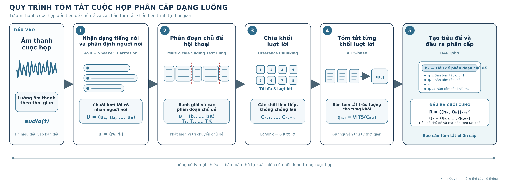
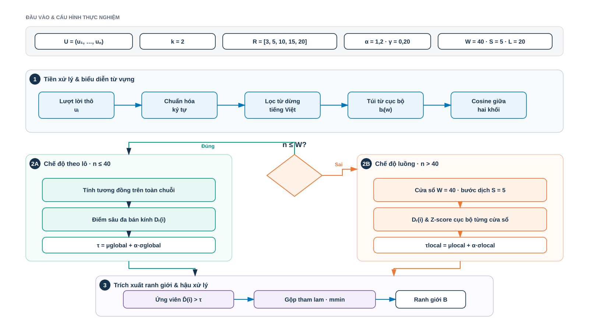
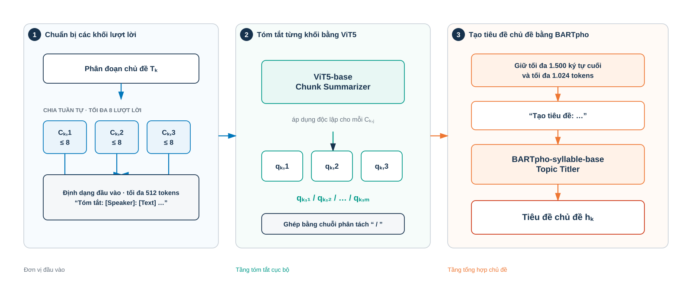
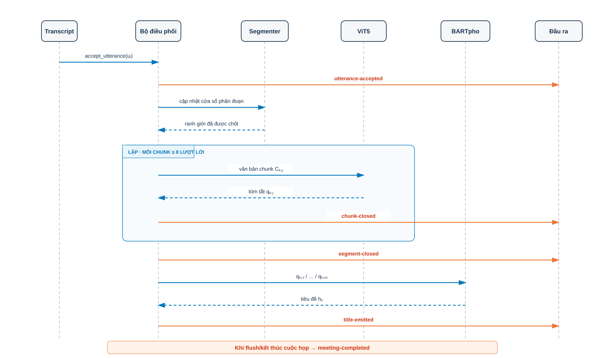

# XÂY DỰNG HỆ THỐNG TÓM TẮT CUỘC HỌP TIẾNG VIỆT THEO THỜI GIAN THỰC SỬ DỤNG PHÂN ĐOẠN CHỦ ĐỀ VÀ MÔ HÌNH SINH PHÂN CẤP

## Tóm tắt (Abstract)

### Tóm tắt tiếng Việt
[Phần tóm tắt tiếng Việt sẽ bổ sung tại đây.]

### Abstract (English)
[English abstract will be added here according to the university template.]

**Từ khóa / Keywords:** Streaming Meeting Summarization, Topic Segmentation, Sliding TextTiling, ViT5, BARTpho, Speaker Diarization, ASR.

## Mở đầu (Introduction)

Các cuộc họp trực tuyến và họp nội bộ hàng ngày đã trở thành phương thức giao tiếp thiết yếu trong hoạt động của các doanh nghiệp hiện đại, tạo ra khối lượng lớn dữ liệu âm thanh khó tra cứu và tái sử dụng nếu chỉ lưu dưới dạng âm thanh thô [@Carletta2005, @Janin2003, @Asthana2025Recap]. Việc khai thác thông tin từ các cuộc họp này đóng vai trò quan trọng trong việc lưu giữ tri thức doanh nghiệp, truy vết thông tin, và hỗ trợ quá trình ra quyết định từ các dữ liệu cuộc họp trước. Tuy nhiên, việc ghi chép và tóm tắt cuộc họp thủ công đòi hỏi chi phí, công sức nhân lực lớn, dễ gặp sai sót và thiếu tính đồng bộ. Hiện nay, sự chuyển dịch từ ghi chép thủ công sang các hệ thống tự động hóa phản ánh nhu cầu cấp thiết về một quy trình xử lý trực tiếp từ giọng nói sang văn bản tóm tắt.

Trong bối cảnh đó, các phương pháp tóm tắt cuộc họp ngoại tuyến (offline) hoặc xử lý theo lô (batch processing) truyền thống bộc lộ những hạn chế lớn về mặt vận hành. Hệ thống ngoại tuyến đòi hỏi phải lưu trữ toàn bộ tệp âm thanh và chỉ tiến hành xử lý sau khi cuộc họp đã kết thúc hoàn toàn, dẫn đến độ trễ phản hồi lớn. Quan trọng hơn, cơ chế ngoại tuyến không thể hỗ trợ các nhu cầu tương tác và cập nhật thông tin tức thì trong lúc cuộc họp đang diễn ra. Ngược lại, phương pháp tóm tắt gần thời gian thực (near-real-time) và xử lý dạng luồng (streaming processing) mang lại những lợi ích về mặt thực tiễn như cập nhật thông tin tăng dần và hỗ trợ nhận thức ngữ cảnh tức thì (Incremental Update & Contextual Awareness). Hệ thống liên tục tạo ra các đoạn tóm tắt trung gian và tiêu đề chủ đề xuyên suốt cuộc hội thoại, giúp các thành viên — đặc biệt là những người tham gia muộn hoặc quản lý cần theo dõi nhiều phiên họp song song — nắm bắt nhanh chóng tiến trình thảo luận mà không làm gián đoạn cuộc họp.

Để chuyển luồng âm thanh thành bản ghi hội thoại có cấu trúc làm đầu vào cho bộ tóm tắt, hệ thống sử dụng ba thành phần chính: Bộ phát hiện hoạt động giọng nói (voice activity detection - VAD) [@SileroVAD2021] xác định các khoảng thời gian chứa tiếng nói, bộ phân định người nói (speaker diarization/tracking) [@Chen2022WeSpeaker] trích xuất vectơ nhúng giọng nói (speaker embeddings) để gán cùng một nhãn phân cụm (như Speaker_1, Speaker_2) cho các đoạn thoại có khả năng thuộc về cùng một người và mô hình Zipformer cho nhận dạng tiếng nói tự động (automatic speech recognition - ASR) [@Yao2023Zipformer] chuyển đổi âm thanh thành văn bản lời thoại. Sự phối hợp này tạo ra bản ghi hội thoại được gán nhãn người nói hoàn chỉnh.

Tuy nhiên, việc triển khai quy trình nhận dạng tiếng nói ASR và phân định người nói trong môi trường xử lý theo thời gian thực vẫn đối mặt với nhiều hạn chế kỹ thuật. Các mô hình nhận dạng tiếng nói tự động thường có tỷ lệ lỗi từ (word error rate – WER) cao khi xử lý âm thanh hội thoại thực tế chứa nhiều tạp âm, tiếng ồn môi trường và hiện tượng chồng lấn giọng nói giữa các thành viên. Đồng thời, phần lớn các giải pháp nhận dạng tiếng nói và phân định người nói hiện nay vẫn hoạt động theo cơ chế ngoại tuyến (offline), đòi hỏi phải xử lý toàn bộ tệp âm thanh trước khi đưa ra kết quả nên chưa có khả năng phản hồi liên tục trong quá trình cuộc họp diễn ra [@Anguera2012Speaker, @Park2022Review].

Bên cạnh thách thức về xử lý âm thanh, việc tóm tắt các bản ghi hội thoại dài cũng gặp phải rào cản lớn về mặt phân tích và tổng hợp nội dung. Bản ghi lời thoại cuộc họp thường có độ dài lớn, văn phong rời rạc, lặp ý và hiện tượng chuyển chủ đề liên tục [@Zhong2021]. Việc xử lý trực tiếp toàn bộ văn bản hội thoại qua một mô hình ngôn ngữ lớn (large language model - LLM) thường gặp khó khăn do giới hạn chiều dài ngữ cảnh (context window) đầu vào, đồng thời dễ dẫn đến tình trạng suy giảm hiệu năng thu nhận thông tin (lost-in-the-middle) và bỏ sót các nội dung quan trọng [@Liu2024Lost]. Để khắc phục vấn đề này, các phương pháp tiếp cận phân cấp thường chia văn bản hội thoại thành các phân đoạn chủ đề (topic segments) để tiến hành tóm tắt độc lập từng phần nhỏ, sau đó tổng hợp các tóm tắt trung gian thành một báo cáo phân cấp hoàn chỉnh.

Mặc dù vậy, các phương pháp phân đoạn chủ đề và tóm tắt hiện tại vẫn còn tồn tại nhiều hạn hạn chế. Các thuật toán phân đoạn phi giám sát truyền thống như TextTiling [@Hearst1997] dựa trên tần suất từ vựng dạng túi từ (bag-of-words) có tốc độ tính toán nhanh nhưng chưa nhận diện tốt các mối quan hệ ngữ nghĩa sâu, dẫn đến điểm lỗi phân đoạn ($P_k$ [@Beeferman1999] và WindowDiff [@Pevzner2002]) cao. Các phương pháp dựa trên mô hình học sâu thường có chi phí huấn luyện và suy luận cao hơn các phương pháp từ vựng. Một số nghiên cứu gần đây [@He2025] đã hỗ trợ xử lý dạng luồng, nhưng vẫn cần mô hình có tham số lớn và dữ liệu huấn luyện phù hợp. Đối với bước tóm tắt, việc sử dụng các mô hình tạo sinh lớn trên đám mây gây tốn kém chi phí vận hành và chưa đảm bảo tính bảo mật dữ liệu doanh nghiệp, trong khi việc tinh chỉnh các mô hình ngôn ngữ nhỏ cục bộ thường đòi hỏi nguồn dữ liệu chất lượng cao vốn rất khan hiếm đối với tiếng Việt [@Phan2022, @Nguyen2022].

Trong khóa luận này, chúng tôi giải quyết những khoảng trống công nghệ trên bằng cách giới thiệu một quy trình (pipeline) tóm tắt cuộc họp tiếng Việt dạng luồng, nhận trực tiếp luồng âm thanh và xuất ra cấu trúc tóm tắt phân cấp theo chuỗi xử lý ASR, phân định người nói (speaker diarization) và tóm tắt phân cấp (hierarchical summarization). Các đóng góp chính của chúng tôi bao gồm:

1.Chúng tôi thiết kế và triển khai một quy trình tóm tắt cuộc họp phân cấp dạng luồng (streaming hierarchical meeting summarization pipeline) hoàn chỉnh từ đầu vào âm thanh đến văn bản tóm tắt đầu ra. Hệ thống vận hành theo cơ chế đẩy dữ liệu hướng sự kiện (event-driven streaming), qua đó cho phép kết quả tóm tắt theo từng giai đoạn được cập nhật liên tục trong suốt cuộc hội thoại thay vì chỉ tạo báo cáo sau khi cuộc họp kết thúc.

3.[Sau này ghi đóng góp ASR ở đây]

4.[Sau này ghi đóng góp speaker ở đây]

5.Chúng tôi đề xuất thuật toán Multi-Scale Sliding TextTiling, một phương pháp phân đoạn chủ đề không giám sát được phát triển từ TextTiling. Thuật toán kết hợp cửa sổ trượt, cơ chế đánh giá ranh giới chủ đề ở nhiều phạm vi, chuẩn hóa điểm số theo ngữ cảnh lân cận và vùng kết quả đã được xác nhận, qua đó hỗ trợ xử lý liên tục với chi phí tính toán thấp.

6.Chúng tôi tinh chỉnh hai mô hình gọn nhẹ cho tiếng Việt: ViT5-base (226 triệu tham số) cho nhiệm vụ tóm tắt đoạn hội thoại và BARTpho-syllable-base (132 triệu tham số) cho nhiệm vụ tạo tiêu đề từ các bản tóm tắt theo từng giai đoạn. Thiết kế tách vai trò này giúp hệ thống kiểm soát giới hạn ngữ cảnh và giảm chi phí suy luận so với việc xử lý toàn bộ bản ghi bằng một mô hình ngôn ngữ lớn.

7.Chúng tôi xây dựng bộ dữ liệu AliMeeting4MUG_vi phục vụ bài toán tóm tắt hội thoại phân cấp bằng tiếng Việt thông qua việc dịch và chuẩn hóa bộ dữ liệu AliMeeting MUG [@Zhang2023MUG]. Bộ dữ liệu cung cấp các tập huấn luyện, kiểm định và kiểm thử cho hai nhiệm vụ: tóm tắt từng đoạn hội thoại và tạo tiêu đề cho từng chủ đề. 

---

## Nghiên cứu liên quan (Related Work)

### Các phương pháp nhận dạng tiếng nói và phân định người nói (Automatic Speech Recognition and Speaker Diarization Methods)

[Các nghiên cứu liên quan chi tiết về mô hình ASR và kỹ thuật phân định giọng nói/gán nhãn người nói (speaker diarization/clustering) sẽ được cập nhật thêm tại đây sau.]

### Tóm tắt hội thoại (Dialogue Summarization)

Tóm tắt hội thoại (dialogue summarization) hướng tới việc tạo ra một phiên bản ngắn hơn của văn bản hội thoại đầu vào trong khi vẫn bảo toàn các thông tin quan trọng của nội dung gốc. Các phương pháp tiếp cận chủ yếu được chia thành hai nhóm: phương pháp trích xuất (extractive methods), lựa chọn các câu hoặc cụm từ có sẵn trong văn bản gốc; và phương pháp sinh tạo (abstractive methods), tạo ra chuỗi văn bản mới với cách diễn đạt ngắn gọn và súc tích hơn. Các mô hình sinh tạo dựa trên kiến trúc Transformer [@Vaswani2017] đã đạt được chất lượng ngôn ngữ tự nhiên cao, nhưng vẫn phải đối mặt với rủi ro xảy ra hiện tượng ảo giác thông tin (hallucination) và sự phụ thuộc lớn vào dữ liệu huấn luyện. Điển hình cho hướng tiếp cận sinh tạo dựa trên văn bản-văn bản (text-to-text) là kiến trúc T5 [@Raffel2020] và biến thể tiếng Việt ViT5 [@Phan2022], cũng như kiến trúc BART [@Lewis2020] và biến thể tiếng Việt BARTpho [@Nguyen2022] vốn phù hợp để thử nghiệm cho các tác vụ sinh tiêu đề hoặc chuỗi văn bản ngắn.

Đối với môi trường hội thoại, việc tóm tắt cuộc họp (meeting summarization) thể hiện độ phức tạp cao hơn đáng kể so với tóm tắt tài liệu đơn tác giả (single-document/single-author documents). Trong các cuộc họp, thông tin quan trọng thường không nằm tập trung mà được hình thành qua nhiều lượt nói (turns) mang tính tương tác xã hội: một thành viên đề xuất ý kiến, các thành viên khác phản biện, thảo luận và đi đến thống nhất phương án vào cuối cuộc thảo luận[@Zhong2021]. Do đó, một câu thoại (utterance) riêng lẻ thường không chứa đựng đầy đủ ngữ cảnh để tóm tắt. Một bản tóm tắt cuộc họp hữu ích cần phản ánh được trình tự thời gian và cấu trúc chủ đề của phiên thảo luận, thay vì chỉ đơn thuần xếp hạng hoặc trích xuất các câu độc lập.

Tuy nhiên, khi đối mặt với các tài liệu hội thoại dài, các mô hình ngôn ngữ lớn thường gặp hiện tượng suy giảm hiệu năng nghiêm trọng ở giữa ngữ cảnh (lost-in-the-middle phenomenon) [@Liu2024Lost] và chi phí tính toán tăng vọt do các cuộc hội thoại dài. Để giải quyết những hạn chế này, chúng tôi tham khảo cách tổ chức bản tóm tắt cuộc họp theo cấu trúc phân cấp của Asthana và cộng sự [@Asthana2025Recap]. Trên cơ sở đó, chúng tôi đề xuất một quy trình triển khai phù hợp với tiếng Việt, trong đó bản ghi cuộc họp được chia thành các đoạn hội thoại, mỗi đoạn gồm tối đa tám lượt lời. Từng đoạn được tóm tắt bằng mô hình ViT5 [@Phan2022]. Sau đó, các bản tóm tắt được nhóm theo chủ đề và sử dụng làm đầu vào cho mô hình BARTpho [@Nguyen2022] để tạo tiêu đề khái quát cho từng phân đoạn thảo luận.. Thiết kế phân tách này giúp hệ thống xử lý được các cuộc họp dài mà không bị giới hạn ngữ cảnh hay suy giảm chất lượng sinh văn bản.

### Phân đoạn chủ đề và xử lý dữ liệu dạng luồng (streaming) trong hội thoại (Topic Segmentation and Streaming Processing in Dialogue)

Phân đoạn chủ đề (topic segmentation) là tác vụ chia một văn bản hoặc cuộc hội thoại liên tục thành các đoạn nội dung kế tiếp nhau, trong đó mỗi đoạn có nội dung tương đối thống nhất về chủ đề. Thuật toán TextTiling kinh điển của Hearst [@Hearst1997] dựa trên giả định rằng các đoạn cùng chủ đề thường sử dụng một nhóm từ vựng tương tự nhau, còn độ tương đồng từ vựng (lexical similarity) sẽ giảm rõ rệt tại vị trí chuyển từ chủ đề này sang chủ đề khác. Phương pháp này tính độ tương đồng giữa các đoạn văn bản liền kề, xác định những vị trí có độ tương đồng thấp và chọn các điểm có dấu hiệu chuyển chủ đề rõ rệt để xác định ranh giới giữa các chủ đề.

Các phương pháp phân đoạn dựa trên từ vựng có ưu điểm là tốc độ xử lý nhanh, dễ giải thích và không đòi hỏi dữ liệu gán nhãn để huấn luyện. Tuy nhiên, hạn chế lớn nhất của nhóm phương pháp này là khó nhận biết các từ đồng nghĩa hoặc những cách diễn đạt khác nhau nhưng cùng đề cập đến một nội dung. Ngoài ra, chúng cũng dễ bị ảnh hưởng bởi nhiễu xuất hiện trong các câu thoại ngắn của hội thoại tự nhiên.

Để khắc phục hạn chế trên, Xing và Carenini [@Xing2021] đề xuất một phương pháp phân đoạn hội thoại dựa trên mô hình đánh giá mức độ mạch lạc (coherence score) giữa các cặp câu thoại. Mô hình được huấn luyện bằng dữ liệu tạo tự động, sau đó điểm mạch lạc được sử dụng để xác định ranh giới chủ đề theo hướng không giám sát. Việc sử dụng các mô hình học sâu như Sentence-BERT giúp nâng cao khả năng biểu diễn ngữ nghĩa, nhưng đồng thời làm tăng chi phí suy luận khi hệ thống hoạt động theo thời gian thực.

Gần đây, He và cộng sự [@He2025] chuyển bài toán phân đoạn hội thoại thành bài toán phát hiện đối tượng một chiều (One-Dimensional Object Detection – 1DOD) dành cho phân đoạn văn bản liên tục. Phương pháp này cải thiện độ chính xác nhờ tối ưu trực tiếp quá trình xác định các ranh giới chủ đề.

Dựa trên các nền tảng nêu trên, cơ chế xử lý dữ liệu liên tục (streaming data processing) cho phép hệ thống tính toán và cung cấp các bản tóm tắt tạm thời ngay trong khi cuộc họp đang diễn ra. Khác với xử lý theo lô (batch processing), vốn yêu cầu thu thập đầy đủ dữ liệu âm thanh trước khi xử lý, cơ chế xử lý liên tục cho phép hệ thống cung cấp kết quả ngay trong khi cuộc họp đang diễn ra, nhờ đó người dùng không phải chờ đến khi toàn bộ cuộc họp kết thúc mới nhận được kết quả.

Người dùng có thể theo dõi các nội dung tóm tắt được cập nhật liên tục ngay sau khi từng đoạn hội thoại hoặc phân đoạn chủ đề được hoàn tất. Tuy nhiên, trong bài toán phân đoạn hội thoại, một ranh giới chủ đề chỉ có thể được xác định đáng tin cậy sau khi hệ thống quan sát thêm một lượng ngữ cảnh nhất định ở phía sau (look-ahead context).

Vì vậy, khái niệm “xử lý liên tục” trong nghiên cứu này được hiểu là quá trình tiếp nhận dữ liệu và cập nhật kết quả theo từng giai đoạn, chứ không phải xác định ranh giới chủ đề ngay tại thời điểm một lượt lời vừa xuất hiện. Hệ thống chỉ công bố kết quả sau khi đoạn hội thoại hoặc phân đoạn tương ứng đã được xác nhận hoàn tất, nhằm bảo đảm các thông tin đã công bố không bị thay đổi về sau.

### Các bộ dữ liệu và chỉ số đánh giá hội thoại (Dialogue Corpora and Evaluation Metrics)

[ASR và Speaker sau này viết ở đây]

Việc phát triển các bộ dữ liệu chuyên biệt cho các bài toán hội thoại đóng vai trò quan trọng trong quá trình tinh chỉnh và đánh giá các hệ thống AI. Trong khi các nghiên cứu trước đây chủ yếu dựa trên những bộ dữ liệu cuộc họp tiếng Anh kinh điển như AMI Meeting Corpus [@Carletta2005], gồm các cuộc họp thiết kế sản phẩm giả lập, và ICSI Meeting Corpus [@Janin2003], ghi lại các cuộc họp học thuật thực tế, các hệ thống tóm tắt hiện đại đòi hỏi nguồn dữ liệu đa dạng hơn về bối cảnh, chủ đề và cấu trúc.

QMSum [@Zhong2021] là một bộ dữ liệu chuẩn quy mô lớn dành cho bài toán tóm tắt cuộc họp dựa trên truy vấn, bao gồm nhiều bối cảnh như hội họp học thuật, phiên họp ủy ban và thảo luận phát triển sản phẩm. Đối với bài toán phát hiện sự chuyển đổi chủ đề và phân đoạn hội thoại, các bộ dữ liệu như Doc2Dial [@Feng2020] và TIAGE [@TIAGE2021] cung cấp nguồn dữ liệu quan trọng để đánh giá khả năng theo dõi sự thay đổi của ngữ cảnh. Gần đây, bộ tiêu chuẩn MUG (Meeting Understanding and Generation) [@Zhang2023MUG] đã xây dựng một khung đánh giá toàn diện, bao gồm các nhiệm vụ phân đoạn chủ đề, tóm tắt và trích xuất thông tin cuộc họp.

Trong nghiên cứu này, chúng tôi dịch và chuẩn hóa các bộ dữ liệu được lựa chọn sang tiếng Việt, qua đó xây dựng nguồn dữ liệu thống nhất phục vụ việc huấn luyện và đánh giá các mô hình phân đoạn chủ đề và tóm tắt hội thoại.

Để đánh giá chất lượng phân đoạn chủ đề trên các bộ dữ liệu, chỉ số $P_k$ [@Beeferman1999] đo xác suất một cặp vị trí cách nhau một khoảng cố định bị xác định sai là thuộc cùng hoặc khác phân đoạn chủ đề. WindowDiff [@Pevzner2002] đo mức chênh lệch giữa số lượng ranh giới dự đoán và số lượng ranh giới tham chiếu trong mỗi cửa sổ. Cả hai chỉ số có giá trị càng thấp càng tốt. Đối với phép đo ranh giới trong thực nghiệm này, mỗi vị trí lượt lời được mã hóa thành nhãn nhị phân $y_i \in \{0,1\}$, trong đó, nhãn 1 được dùng để đánh dấu vị trí kết thúc của một phân đoạn chủ đề. Một ranh giới dự đoán chỉ được xem là chính xác khi trùng hoàn toàn với vị trí ranh giới trong dữ liệu tham chiếu; nghiên cứu không áp dụng khoảng sai lệch cho phép. Từ precision và recall của từng lớp $c \in \{0,1\}$, $F_1$ của lớp được tính như sau:

$$
P_c = \frac{\mathrm{TP}_c}{\mathrm{TP}_c + \mathrm{FP}_c}, \quad R_c = \frac{\mathrm{TP}_c}{\mathrm{TP}_c + \mathrm{FN}_c}, \quad F_{1,c} = 2 \cdot \frac{P_c \cdot R_c}{P_c + R_c}
$$

Giá trị được báo cáo là macro-$F_1$, được tính theo công thức:

$$
\text{macro-}F_1 = \frac{F_{1,0} + F_{1,1}}{2}.
$$

Chỉ số này là trung bình cộng của $F_1$ đối với lớp không phải ranh giới và lớp ranh giới, trong đó hai lớp có vai trò như nhau. Giá trị macro-$F_1$ càng cao cho thấy kết quả phân loại càng tốt. Tuy nhiên, do số lượng vị trí không phải ranh giới thường lớn hơn nhiều so với số lượng vị trí ranh giới, chỉ số này cần được xem xét kết hợp với $P_k$ và WindowDiff. Macro-$F_1$ không nên được hiểu là chỉ số $F_1$ riêng của lớp ranh giới.

Đối với nhiệm vụ tóm tắt và tạo tiêu đề, nghiên cứu sử dụng ROUGE (Recall-Oriented Understudy for Gisting Evaluation) [@Lin2004] để đo mức độ tương đồng về mặt từ vựng giữa văn bản do mô hình tạo ra và văn bản tham chiếu. Cụ thể, ROUGE-1 đánh giá mức độ trùng khớp của các từ đơn (unigrams), ROUGE-2 đánh giá các cặp từ liên tiếp (bigrams), còn ROUGE-L dựa trên chuỗi con chung dài nhất (Longest Common Subsequence – LCS).

BERTScore [@Zhang2020] là một chỉ số bổ sung, sử dụng biểu diễn ngữ cảnh để đánh giá mức độ tương đồng về ngữ nghĩa. Tuy nhiên, trong phạm vi khóa luận này, chúng tôi chỉ báo cáo các kết quả ROUGE có đầy đủ dữ liệu và quy trình để tái lập; BERTScore không được xem là một chỉ số đã được kiểm chứng bằng thực nghiệm trong nghiên cứu.

Đối với nhiệm vụ tạo tiêu đề, mỗi mẫu có thể đi kèm nhiều tiêu đề tham chiếu hợp lệ do con người xây dựng. Vì vậy, đề tài sử dụng cách tính ROUGE-Max: điểm ROUGE được tính riêng giữa tiêu đề dự đoán và từng tiêu đề tham chiếu, sau đó chọn giá trị cao nhất. Cách đánh giá này phù hợp với sự đa dạng trong cách đặt tiêu đề, nhưng có thể cho kết quả lạc quan hơn so với việc lấy điểm trung bình trên toàn bộ các tiêu đề tham chiếu.

## Phương pháp luận (Methodology)

### Quy trình tổng thể (Overall Pipeline)

Quy trình tổng thể của hệ thống tóm tắt cuộc họp phân cấp bắt đầu từ luồng âm thanh đầu vào (audio stream) và kết thúc bằng bản tóm tắt có cấu trúc. Hệ thống lần lượt chuyển đổi âm thanh thành các lượt lời, nhóm các lượt lời thành từng đoạn hội thoại, tóm tắt nội dung của mỗi đoạn, sau đó tổ chức các bản tóm tắt theo từng chủ đề để hình thành bản tổng hợp cuối cùng. Toàn bộ quy trình gồm năm giai đoạn chức năng có mối liên hệ chặt chẽ với nhau:

**Hình 1. Quy trình tổng thể của hệ thống tóm tắt phân cấp**

Mỗi giai đoạn trong đường ống xử lý (pipeline) tổng thể ở Hình 1 vận hành như một module độc lập với các đặc tả về chức năng, đầu vào và đầu ra rõ ràng:

**Giai đoạn 1: Nhận dạng tiếng nói và phân định người nói (Automatic Speech Recognition and Speaker Diarization)**

[Sau này ASR sẽ viết ở đây]

**Giai đoạn 2: Phân đoạn chủ đề hội thoại (Unsupervised Topic Segmentation)**

Giai đoạn này có nhiệm vụ phát hiện các vị trí chuyển đổi chủ đề trong luồng hội thoại liên tục, từ đó chia nội dung cuộc họp thành các phân đoạn tương đối độc lập. Đầu vào là chuỗi các lượt lời thu được từ giai đoạn 1:

$$
U = (u_1, u_2, \dots, u_N)
$$

Hệ thống thực hiện phân đoạn chủ đề không giám sát (unsupervised topic segmentation) bằng thuật toán **Multi-Scale Sliding TextTiling**, được phát triển từ thuật toán TextTiling của Hearst [@Hearst1997]. Thay vì chỉ so sánh từ vựng tại một phạm vi cố định, thuật toán sử dụng cửa sổ trượt (sliding window) để phân tích độ tương đồng giữa các đoạn hội thoại liền kề. Nội dung trong mỗi cửa sổ được biểu diễn bằng mô hình túi từ (Bag-of-Words – BoW).

Từ chuỗi điểm tương đồng, thuật toán xác định các vị trí mà nội dung giữa hai đoạn liền kề thay đổi rõ rệt. Mức độ thay đổi được đánh giá trên nhiều kích thước cửa sổ khác nhau (_multi-radius integrated depth score_) để lựa chọn các ranh giới chủ đề đáng tin cậy. Cách tiếp cận này giúp hệ thống phát hiện ranh giới chủ đề ổn định hơn khi xử lý dữ liệu hội thoại liên tục.

Đầu ra của giai đoạn này là tập hợp các vị trí ranh giới chủ đề:

$$
B = \{b_0, b_1, \dots, b_K\},
\qquad
b_0 = 0,
\qquad
b_K = N
$$

Dựa trên các ranh giới này, chuỗi lượt lời được chia thành $K$ phân đoạn chủ đề. Phân đoạn thứ $k$ được xác định như sau:

$$
T_k = \left(u_i \mid b_{k-1} < i \le b_k\right),
\qquad
k = 1, 2, \dots, K
$$

Trong đó, $i$ là chỉ số của lượt lời trong chuỗi hội thoại; mỗi $T_k$ gồm các lượt lời từ vị trí $b_{k-1}+1$ đến vị trí $b_k$.

**Giai đoạn 3: Phân chia lượt lời thành các khối  (Utterance Chunking)**

Giai đoạn này có nhiệm vụ chia từng phân đoạn chủ đề thành các nhóm lượt lời có kích thước phù hợp với giới hạn đầu vào của mô hình tóm tắt. Cách xử lý này giúp tránh trường hợp số lượng lượt lời vượt quá giới hạn ngữ cảnh của mô hình.

Với phân đoạn chủ đề thứ $k$, ký hiệu là $T_k$, số lượng lượt lời trong phân đoạn được xác định bởi:

$$
N_k = b_k - b_{k-1}
$$

Phân đoạn $T_k$ sau đó được chia thành các khối lượt lời liên tiếp, không chồng lấn. Mỗi khối được ký hiệu là $C_{k,j}$, trong đó $k$ là chỉ số của phân đoạn chủ đề và $j$ là chỉ số của khối trong phân đoạn đó.

Kích thước tối đa của mỗi khối được giới hạn ở:

$$
L_{\text{chunk}} = 8
$$

Cụ thể, khối thứ $j$ của phân đoạn chủ đề thứ $k$ được xác định như sau:

$$
C_{k,j}
=
\left\{
u_i
\mid
b_{k-1} + (j-1)L_{\text{chunk}} < i
\le
\min\left(b_{k-1} + jL_{\text{chunk}},\, b_k\right)
\right\}
$$

Trong đó, $i$ là chỉ số của lượt lời trong toàn bộ chuỗi hội thoại, còn $j = 1,2,\dots,m_k$ là chỉ số của khối lượt lời. Tổng số khối của phân đoạn chủ đề thứ $k$ được tính bằng:

$$
m_k
=
\left\lceil
\frac{N_k}{L_{\text{chunk}}}
\right\rceil
$$

Như vậy, mỗi khối $C_{k,j}$ chứa tối đa 8 lượt lời; khối cuối cùng có thể chứa ít hơn 8 lượt lời nếu số lượt lời trong phân đoạn không chia hết cho $L_{\text{chunk}}$.

**Giai đoạn 4: Tóm tắt từng khối lượt lời  (Abstractive Chunk Summarization)**

Giai đoạn này có nhiệm vụ tạo một bản tóm tắt ngắn cho từng khối lượt lời. Đầu vào là khối hội thoại $C_{k,j}$ được tạo ra ở giai đoạn trước.

Trước khi đưa vào mô hình, các lượt lời trong $C_{k,j}$ được chuyển thành một chuỗi văn bản duy nhất. Mỗi lượt lời được biểu diễn bằng nhãn người nói, theo sau là nội dung câu thoại; các lượt lời liên tiếp được ngăn cách bằng ký tự xuống dòng. Chuỗi văn bản sau khi định dạng được ký hiệu là $\tilde{C}_{k,j}$:

$$
\tilde{C}_{k,j}
=
\operatorname{Join}
\left(
\left\{
p_i \mathbin{\Vert} \text{: } \mathbin{\Vert} t_i
\mid
u_i = (p_i,t_i) \in C_{k,j}
\right\},
\text{newline}
\right)
$$

Tiếp theo, hệ thống thêm tiền tố tác vụ `"Tóm tắt: "` vào đầu chuỗi văn bản. Dữ liệu này được đưa vào mô hình ViT5-base đã được tinh chỉnh trên bộ dữ liệu AliMeeting4MUG_vi để tạo bản tóm tắt cho khối hội thoại:

$$
q_{k,j}
=
\operatorname{ViT5}
\left(
\text{Tóm tắt: }
\mathbin{\Vert}
\tilde{C}_{k,j}
\right)
$$

Trong đó, $q_{k,j}$ là bản tóm tắt của khối lượt lời thứ $j$ thuộc phân đoạn chủ đề thứ $k$.

**Giai đoạn 5: Tạo tiêu đề phân đoạn chủ đề (Topic Titling)**

Ở giai đoạn cuối, hệ thống tạo một tiêu đề khái quát cho mỗi phân đoạn chủ đề. Đầu vào là toàn bộ các bản tóm tắt khối $q_{k,j}$ thuộc cùng phân đoạn chủ đề $T_k$.

Các bản tóm tắt này được sắp xếp theo thứ tự xuất hiện và ghép nối bằng chuỗi phân cách `" / "`.  Chuỗi văn bản này sau đó được thêm tiền tố tác vụ `"Tạo tiêu đề: "` và đưa vào mô hình BARTpho đã được tinh chỉnh để sinh tiêu đề chủ đề $h_k$:

$$
h_k
=
\operatorname{BARTpho}
\left(
\text{Tạo tiêu đề: }
\mathbin{\Vert}
\operatorname{Join}
(q_{k,1}, \dots, q_{k,m_k}),
\text{ / }
\right)
$$

Đầu ra cuối cùng của hệ thống là cấu trúc tóm tắt phân cấp $R$, gồm các tiêu đề chủ đề và các bản tóm tắt khối tương ứng, được sắp xếp theo trình tự thời gian của cuộc họp:

$$
R
=
\left(
\left(
h_k,
(q_{k,1}, q_{k,2}, \dots, q_{k,m_k})
\right)
\right)_{k=1}^{K}
$$

Cấu trúc này giúp người dùng nhanh chóng nắm được nội dung chính của cuộc họp thông qua các tiêu đề chủ đề $h_k$, đồng thời có thể xem chi tiết hơn qua các bản tóm tắt khối $q_{k,j}$ bên dưới.

### Khâu nhận dạng tiếng nói và phân định người nói thời gian thực (Real-time Speech Recognition and Speaker Diarization)

[Phần phương pháp nghiên cứu chi tiết và các thuật toán nâng cao liên quan đến ASR và phân định người nói (speaker diarization/tracking) sẽ được cập nhật sau.]

### Thuật toán Multi-Scale Sliding TextTiling (Multi-Scale Sliding TextTiling Algorithm)

Thuật toán TextTiling của Hearst [@Hearst1997] được xây dựng để chia một tài liệu thành các phần nội dung sau khi toàn bộ văn bản đã được thu thập đầy đủ. Trong cách triển khai so sánh theo khối, văn bản được chia thành nhiều nhóm từ có độ dài bằng nhau. Tại mỗi vị trí nằm giữa hai nhóm, thuật toán lấy một số nhóm từ ở bên trái và bên phải để tạo thành hai khối văn bản. Hai khối này được biểu diễn dựa trên số lần xuất hiện của các từ, sau đó được so sánh bằng độ tương đồng cosine.

Để xác định mức độ thay đổi nội dung tại một vị trí, thuật toán lần lượt xem xét các điểm tương đồng ở bên trái và bên phải cho đến khi gặp các điểm cao nhất gần đó. Cách làm này giúp xác định những vị trí mà nội dung có sự thay đổi rõ rệt. Sau khi tìm được các vị trí có khả năng là ranh giới giữa các phần, thuật toán điều chỉnh chúng về vị trí xuống đoạn gần nhất. Các ranh giới nằm quá gần nhau cũng được loại bỏ.

Hạn chế chính của TextTiling đối với bài toán trong khóa luận là thuật toán chỉ xử lý văn bản sau khi đã có đầy đủ nội dung. Thuật toán chưa hỗ trợ tiếp nhận lần lượt từng lượt phát biểu trong cuộc họp, chưa lưu lại thông tin của phần nội dung vừa xử lý và chưa thể xác định một ranh giới cố định ngay khi cuộc họp vẫn đang diễn ra.

Để khắc phục các hạn chế này, chúng tôi đề xuất thuật toán Multi-Scale Sliding TextTiling, một phương pháp chia hội thoại theo chủ đề mà không cần dữ liệu gán nhãn, được phát triển từ TextTiling gốc với ba cải tiến chính: (i) sử dụng cửa sổ trượt để xử lý lần lượt nội dung hội thoại khi dữ liệu được thêm vào, (ii) kết hợp điểm sâu ở nhiều phạm vi và chuẩn hóa bằng Z-score để nhận biết thay đổi chủ đề ở các mức ngữ cảnh khác nhau, và (iii) dùng ngưỡng tự điều chỉnh cùng cơ chế gộp từng bước để hạn chế việc chia hội thoại thành quá nhiều đoạn nhỏ.

Xét luồng lượt lời đầu vào $U = (u_1, u_2, \dots, u_n)$ thu được từ giai đoạn nhận dạng tiếng nói và phân định người nói. Thuật toán đề xuất nhận đầu vào là chuỗi $U$ cùng các siêu tham số cấu hình, và xuất ra tập hợp các chỉ số ranh giới phân đoạn chủ đề $B = \{b_1, b_2, \dots, b_K\}$, phân chia $U$ thành $K$ phân đoạn chủ đề liên tiếp. Quy trình tổng quan của thuật toán được minh họa trong Hình 2 và trình bày chi tiết qua ba giai đoạn xử lý cốt lõi sau đây.

**Hình 2.** Sơ đồ chi tiết quy trình xử lý và điều kiện hoạt động của thuật toán Multi-Scale Sliding TextTiling. 

Thuật toán tự động phân nhánh giữa chế độ xử lý theo lô (Batch Mode, khi $n \le 40$) và chế độ cửa sổ trượt dạng luồng (Streaming Mode, khi $n > 40$) dựa trên độ dài chuỗi lượt thoại đầu vào. Hình biểu diễn cấu hình thực nghiệm $k=2$, $R=\{3,5,10,15,20\}$, $\alpha=1,2$, $W=40$, bước trượt $S=5$ và vùng nhìn trước $L=20$.

Để làm nổi bật các đóng góp cải tiến của nghiên cứu này, dưới đây là các phân tích đối chiếu chi tiết về những điểm tương đồng (bảo toàn nguyên lý cốt lõi) và điểm khác biệt (các cải tiến kỹ thuật cụ thể cho môi trường streaming) giữa giải thuật đề xuất và thuật toán TextTiling gốc.

Trong nghiên cứu này, thuật toán TextTiling của Hearst (1997) [@Hearst1997] được xem xét trên hai khía cạnh độc lập nhưng nhất quán:

 **Về mặt lý thuyết (Bảng 2)**: Chúng tôi đối chiếu các nguyên lý nền tảng của bài báo gốc nhằm làm rõ các hạn chế cố hữu của giải thuật Hearst (1997) và nhấn mạnh những thay đổi trong thiết kế của giải thuật đề xuất (như chuyển từ khối từ giả định sang lượt lời tự nhiên, thay cách tìm đỉnh theo hình dạng đường điểm bằng cách tổng hợp các cực đại trong nhiều phạm vi lân cận hữu hạn kết hợp chuẩn hóa Z-score, và từ xử lý theo lô toàn văn sang cửa sổ trượt dạng luồng).

 **Về mặt thực nghiệm**: Vì bài báo gốc không cung cấp mã nguồn hiện đại, chúng tôi sử dụng bản cài đặt tham chiếu (reference implementation) mã nguồn mở chuẩn hóa và được công nhận rộng rãi nhất của thuật toán này trong thư viện NLTK (`nltk.tokenize.texttiling.TextTilingTokenizer`) làm mô hình baseline đối chứng (`nltk_texttiling`), với các tham số được thiết lập minh bạch.

**Bảng 1. Các đặc điểm tương đồng (giống nhau) giữa hai thuật toán**

| Đặc trưng kỹ thuật               | Điểm chung thiết kế của hai thuật toán                                                                                                                                 |
| :------------------------------- | :--------------------------------------------------------------------------------------------------------------------------------------------------------------------- |
| **Mô hình biểu diễn cơ bản**     | Đều sử dụng mô hình túi từ (Bag-of-Words - BoW) để số hóa tần suất xuất hiện của từ vựng từ văn bản đầu vào.                                                           |
| **Đo độ mạch lạc chủ đề**        | Đều áp dụng độ tương đồng cosine (Cosine Similarity) làm phép toán đo lường mức độ liên kết từ vựng giữa các khối văn bản liền kề.                                     |
| **Nguyên lý xác định ranh giới** | Đều xác định vị trí chuyển chủ đề tại những điểm có độ tương đồng thấp bằng cách so sánh điểm sâu của vị trí đó với các điểm cao xung quanh.                           |
| **Tính chất học máy**            | Đều hoạt động theo cơ chế phi giám sát (unsupervised), không yêu cầu dữ liệu gán nhãn hay quy trình huấn luyện mô hình phức tạp, giúp tối ưu hóa tài nguyên tính toán. |

**Bảng 2. So sánh khía cạnh lý thuyết giữa TextTiling gốc (Hearst, 1997) và Multi-Scale Sliding TextTiling (đề xuất)**

| Khía cạnh lý thuyết                | TextTiling gốc [@Hearst1997]                                                                                                     | Multi-Scale Sliding TextTiling (đề xuất)                                                                                               |
| :--------------------------------- | :------------------------------------------------------------------------------------------------------------------------------- | :------------------------------------------------------------------------------------------------------------------------------------- |
| **Phạm vi xử lý**                  | **Xử lý toàn bộ (Batch Mode)**: Cần nạp đầy đủ văn bản trước khi tính độ tương đồng từ đầu đến cuối.                             | **Xử lý theo luồng (Streaming-ready)**: Dùng cửa sổ trượt kích thước $W=40$ và dịch chuyển mỗi lần $S=5$.                              |
| **Biểu diễn từ vựng**              | **Bảng từ dùng chung**: Biểu diễn văn bản bằng một bảng từ cố định được tạo từ toàn bộ tài liệu đầu vào.                         | **Bảng từ riêng cho từng khối**: Mỗi khối sử dụng một bảng đếm số lần xuất hiện của các từ và được cập nhật theo nội dung của khối đó. |
| **Cách tìm đỉnh và tính điểm sâu** | Đi theo đường điểm tương đồng sang trái và phải cho đến khi gặp các đỉnh cục bộ; không dùng tham số bán kính cố định             | Tìm giá trị cực đại trong nhiều phạm vi hữu hạn $R=\{3, 5, 10, 15, 20\}$, sau đó chuẩn hóa và tổng hợp                                 |
| **Xử lý dạng luồng**               | **Không hỗ trợ xử lý theo luồng**: Không thể xác định ranh giới khi dữ liệu được thêm dần và phải phụ thuộc vào toàn bộ văn bản. | **Hỗ trợ xử lý theo luồng**: Xác định ranh giới theo từng cửa sổ trượt và giữ nguyên các kết quả đã công bố.                           |

#### Giai đoạn 1: Làm sạch dữ liệu và tính độ giống nhau giữa hai khối lời nói

Ở bước đầu tiên, mỗi lượt lời được làm sạch và chuyển thành dạng số để máy tính có thể xử lý. Với mỗi lượt lời $u_i$, hệ thống chuyển toàn bộ chữ về dạng chữ thường, loại bỏ ký tự đặc biệt [@Stopwordsiso2024]. Sau khi làm sạch, mỗi lượt lời được biểu diễn bằng số lần xuất hiện của từng từ:

$$  
b_i(w) = \operatorname{tf}(w, u_i)  
$$

Trong đó, $b_i(w)$ là số lần từ $w$ xuất hiện trong lượt lời $u_i$.

Thuật toán không so sánh từng lượt lời riêng lẻ vì các câu trong hội thoại thường ngắn và chứa ít từ. Thay vào đó, tại vị trí nằm giữa hai lượt lời $u_i$ và $u_{i+1}$, hệ thống tạo một khối ở bên trái và một khối ở bên phải. Mỗi khối gồm $k$ lượt lời gần nhất.

Khối bên trái được tính như sau:

$$  
B_L^i(w) = \sum_{j=\max(1, i-k+1)}^{i} b_j(w)  
$$

Khối bên phải được tính như sau:

$$  
B_R^i(w) = \sum_{j=i+1}^{\min(n, i+k)} b_j(w)  
$$

Hai khối này sau đó được so sánh bằng độ tương đồng cosine:

$$  
S_i = \frac{B_L^i \cdot B_R^i}{|B_L^i|_2 |B_R^i|_2 + \varepsilon}  
$$

Trong đó, $\varepsilon = 10^{-10}$ được thêm vào để tránh chia cho 0 khi một khối không còn từ nào sau bước làm sạch.

Có thể hiểu đơn giản rằng $S_i$ cho biết nội dung ở hai phía của vị trí $i$ giống nhau đến mức nào. Nếu $S_i$ cao, hai khối đang nói về nội dung gần nhau. Nếu $S_i$ thấp, nội dung ở hai phía khác nhau rõ rệt, vì vậy vị trí này có thể là nơi chủ đề thay đổi. Việc so sánh theo khối giúp giảm ảnh hưởng của các lượt lời quá ngắn hoặc chứa ít thông tin [@Hearst1997]. Độ tương đồng cosine cũng ít bị ảnh hưởng bởi độ dài của hai khối, nên phù hợp khi số lượt lời ở các vị trí đầu và cuối cửa sổ không hoàn toàn bằng nhau.

#### Giai đoạn 2: Đo mức độ thay đổi chủ đề ở nhiều phạm vi

Sau khi có chuỗi độ tương đồng $S_i$, hệ thống tiếp tục xác định vị trí nào có khả năng là ranh giới chủ đề. Ý tưởng chính là tìm những vị trí có độ tương đồng thấp hơn rõ rệt so với các vị trí xung quanh.

Với mỗi phạm vi quan sát $r$, hệ thống tìm giá trị tương đồng cao nhất ở bên trái và bên phải của vị trí $i$:

$$  
p_L(i, r) = \max_{\max(1, i-r) \le j \le i} S_j  
$$

$$  
p_R(i, r) = \max_{i \le j \le \min(n-1, i+r)} S_j  
$$

Sau đó, điểm sâu tại vị trí $i$ được tính như sau:

$$  
D_r(i) = \frac{p_L(i, r) + p_R(i, r) - 2S_i}{2}  
$$

Điểm này đo mức giảm của độ tương đồng tại vị trí đang xét so với hai phía xung quanh. Nếu $D_r(i)$ cao, độ tương đồng tại vị trí $i$ thấp hơn rõ rệt so với vùng bên trái và bên phải. Đây là dấu hiệu cho thấy chủ đề có thể thay đổi tại vị trí đó.

Thuật toán sử dụng nhiều phạm vi quan sát:

$$  
R = {3, 5, 10, 15, 20}  
$$

Phạm vi nhỏ, chẳng hạn $r=3$, giúp phát hiện những thay đổi chủ đề xảy ra trong vài lượt lời. Phạm vi lớn, chẳng hạn $r=20$, giúp phát hiện những thay đổi kéo dài trên một đoạn hội thoại rộng hơn.

Vì điểm sâu ở các phạm vi khác nhau có thể có độ lớn khác nhau, mỗi nhóm điểm được chuẩn hóa bằng Z-score:

$$  
\widehat{D}_r(i) = \frac{D_r(i) - \mu_r}{\sigma_r + 10^{-10}}  
$$

Trong đó, $\mu_r$ là giá trị trung bình và $\sigma_r$ là độ lệch chuẩn của các điểm sâu ứng với phạm vi $r$.

Việc chuẩn hóa giúp các phạm vi nhỏ và lớn đóng góp công bằng hơn vào kết quả cuối cùng. Nếu không có bước này, phạm vi lớn có thể tạo ra điểm sâu lớn hơn và làm ảnh hưởng quá nhiều đến kết quả.

Điểm sâu cuối cùng tại vị trí $i$ được tính bằng trung bình của tất cả các phạm vi:

$$  
\bar{D}(i) = \frac{1}{|R|} \sum_{r \in R} \widehat{D}_r(i)  
$$

Giá trị $\bar{D}(i)$ càng cao thì khả năng vị trí $i$ là nơi thay đổi chủ đề càng lớn.

#### Giai đoạn 3: Chọn ranh giới và loại bỏ các đoạn quá ngắn

Sau khi có điểm sâu tổng hợp $\bar{D}(i)$, hệ thống cần xác định mức điểm nào đủ lớn để được xem là ranh giới chủ đề.

Ngưỡng được tính tự động theo công thức:

$$  
\tau = \mu(\bar{D}) + \alpha \cdot \sigma(\bar{D})  
$$

Trong đó, $\mu(\bar{D})$ là giá trị trung bình, $\sigma(\bar{D})$ là độ lệch chuẩn của chuỗi điểm sâu và $\alpha$ là tham số điều chỉnh độ nhạy.

Nếu $\alpha$ lớn, ngưỡng $\tau$ sẽ cao hơn. Khi đó, chỉ những vị trí có mức thay đổi rất rõ mới được chọn, nên số đoạn tạo ra sẽ ít hơn và mỗi đoạn thường dài hơn.

Nếu $\alpha$ nhỏ, ngưỡng thấp hơn. Khi đó, nhiều vị trí được chọn làm ranh giới hơn, nên hội thoại có thể bị chia thành nhiều đoạn ngắn.

Một vị trí $i$ được xem là ứng viên ranh giới khi:

$$  
\bar{D}(i) > \tau  
$$

Sau bước này, một số ranh giới có thể nằm quá gần nhau, làm xuất hiện các đoạn quá ngắn. Vì vậy, hệ thống tiếp tục kiểm tra độ dài tối thiểu của mỗi đoạn:

$$  
m_{\min} =  
\begin{cases}  
\max(2, \lfloor \gamma \cdot n \rfloor) & \text{nếu } n \le W \  
\max(2, \lfloor \gamma \cdot W \rfloor) & \text{nếu } n > W  
\end{cases}  
$$

Trong đó, $\gamma$ là tỷ lệ độ dài tối thiểu của một đoạn.

Nếu một đoạn có ít hơn $m_{\min}$ lượt lời, hệ thống xem xét hai ranh giới ở hai đầu đoạn đó. Ranh giới nào có điểm sâu thấp hơn sẽ bị xóa. Nhờ vậy, đoạn quá ngắn được gộp vào đoạn bên cạnh có nội dung gần hơn.

Bước này giúp tránh chia cuộc họp thành quá nhiều phần nhỏ và bảo đảm mỗi phần có đủ nội dung để mô hình ViT5 tạo bản tóm tắt.

Trong các thí nghiệm chính, khóa luận sử dụng các tham số:

$$  
k=2,\quad \alpha=1{,}2,\quad R={3,5,10,15,20},\quad \gamma=0{,}20  
$$

Các giá trị này được chọn sau khi thử nghiệm trên dữ liệu mẫu và được giữ cố định trong toàn bộ quá trình đánh giá.

#### Cơ chế xử lý cuộc họp theo từng lượt lời

Để thuật toán hoạt động khi cuộc họp vẫn đang diễn ra, hệ thống lưu lại trạng thái sau mỗi lượt lời thứ $t$:

$$  
\mathcal{S}_t = \left(U_t, s_t, P_t, B_t, d_t\right)  
$$

Trong đó:

- $U_t$ là danh sách các lượt lời đã nhận;
    
- $s_t$ là vị trí bắt đầu của cửa sổ tiếp theo;
    
- $P_t$ là các ranh giới đang chờ xem xét;
    
- $B_t$ là các ranh giới đã được xác nhận;
    
- $d_t$ là ranh giới được xác nhận gần nhất.
    

Sau mỗi lượt lời mới, hệ thống thêm lượt lời đó vào $U_t$. Khi đã có đủ $W=40$ lượt lời tính từ vị trí $s_t$, hệ thống lấy một cửa sổ gồm 40 lượt lời:

$$  
U_t[s_t:s_t+W]  
$$

Trên cửa sổ này, hệ thống thực hiện lại ba bước đã trình bày: tính độ tương đồng, tính điểm sâu ở nhiều phạm vi và chọn các vị trí vượt ngưỡng.

Nếu vị trí $j$ trong cửa sổ được xem là ứng viên, vị trí của nó trong toàn bộ cuộc họp được tính bằng:

$$  
g=s_t+j  
$$

Ứng viên này chỉ được thêm vào danh sách chờ nếu nó nằm sau ranh giới đã xác nhận gần nhất, tức là $g>d_t$.

Hệ thống không xác nhận ranh giới ngay lập tức vì cần thêm nội dung ở phía sau để kiểm tra xem thay đổi chủ đề có thực sự rõ ràng hay không. Với số lượt lời cần nhìn thêm là $L=20$, mốc có thể xác nhận được tính như sau:

$$  
c_t = s_t + W - L  
$$

Các ứng viên có vị trí không vượt quá $c_t$ được xem là đã có đủ ngữ cảnh:

$$  
E_t = \left{g \mid (g,\bar{D}(g))\in P_t,\ g\le c_t\right}  
$$

Các ứng viên này được sắp xếp theo thứ tự xuất hiện. Nếu hai ranh giới quá gần nhau, hệ thống giữ lại ranh giới có điểm sâu cao hơn và loại bỏ ranh giới yếu hơn.

Những ranh giới còn lại được thêm vào $B_t$ và được công bố ra ngoài. Sau khi đã công bố, chúng sẽ không bị thay đổi ở các lần xử lý sau. Các ứng viên đã được xem xét cũng được xóa khỏi $P_t$.

Sau đó, cửa sổ dịch sang phải $S=5$ lượt lời:

$$  
s_{t+1}=s_t+S  
$$

Như vậy, các cửa sổ liên tiếp có phần nội dung chồng lên nhau. Điều này giúp hệ thống không bỏ sót các thay đổi chủ đề nằm gần mép cửa sổ.

#### Xử lý khi cuộc họp kết thúc

Khi cuộc họp kết thúc, hệ thống cần xử lý phần dữ liệu còn lại ở cuối để tránh bỏ sót ranh giới.

Nếu tổng số lượt lời $N$ không lớn hơn $W$, toàn bộ cuộc họp được xử lý một lần như một văn bản hoàn chỉnh.

Nếu $N>W$, hệ thống lấy 40 lượt lời cuối:

$$  
U_N[N-W:N]  
$$

Cửa sổ cuối này được đánh giá để tìm thêm các ranh giới chưa được xác nhận. Các ứng viên còn lại được gộp nếu nằm quá gần nhau, sau đó được công bố theo thứ tự xuất hiện.

Nếu vị trí cuối cùng $N-1$ chưa có trong tập ranh giới $B_N$, hệ thống bổ sung vị trí này với điểm sâu bằng 0. Việc này bảo đảm đoạn cuối cùng của cuộc họp luôn được đóng trước khi chuyển sang bước tóm tắt.

#### Chi phí xử lý

Với cuộc họp gồm $N$ lượt lời, số cửa sổ được xử lý xấp xỉ:

$$  
1+\left\lceil\frac{N-W}{S}\right\rceil  
$$

Trong thiết lập thực nghiệm, các tham số sau được giữ cố định:

$$  
W=40,\quad S=5,\quad k=2,\quad R={3,5,10,15,20}  
$$

Vì kích thước cửa sổ và các tham số không thay đổi, tổng thời gian xử lý tăng gần tuyến tính theo số lượt lời $N$. Nói cách khác, khi độ dài cuộc họp tăng gấp đôi, thời gian xử lý cũng tăng xấp xỉ gấp đôi.

Bản triển khai hiện lưu toàn bộ các lượt lời đã nhận, nên lượng bộ nhớ cần dùng là $O(N)$. Ngoài ra, hệ thống chỉ cần thêm một phần bộ nhớ tạm để lưu bảng đếm từ và các điểm tính toán trong từng cửa sổ.

Sau khi toàn bộ ranh giới được xác định, các đoạn hội thoại được chuyển sang mô hình ViT5 để tạo bản tóm tắt theo đúng thứ tự thời gian.

#### Cơ chế cập nhật tăng dần có trạng thái (Stateful Incremental Update Mechanism)

Để chuyển phương pháp phân đoạn theo lô sang bối cảnh cuộc họp dạng luồng, hệ thống duy trì trạng thái xử lý sau khi tiếp nhận lượt lời thứ $t$. Trạng thái này bao gồm chuỗi lượt lời đã nhận $U_t$, vị trí bắt đầu của cửa sổ kế tiếp $s_t$, tập ứng viên ranh giới đang chờ $P_t$, tập ranh giới đã chốt $B_t$ và chỉ số ranh giới được chốt gần nhất $d_t$:
$$
\mathcal{S}_t = \left(U_t, s_t, P_t, B_t, d_t\right)
$$
Trong đó, $U_t=(u_1,u_2,\ldots,u_t)$ tăng thêm một phần tử sau mỗi lượt cập nhật, còn các thành phần còn lại được duy trì giữa hai lần cập nhật liên tiếp. Khi số lượt lời tính từ $s_t$ đạt kích thước cửa sổ $W=40$, hệ thống lấy cửa sổ $U_t[s_t:s_t+W]$, tính chuỗi tương đồng, điểm sâu đa bán kính và ngưỡng thích ứng theo các công thức đã trình bày ở trên. Với mỗi khe cục bộ $j$ có điểm sâu vượt ngưỡng, chỉ số toàn cục $g=s_t+j$ cùng điểm sâu tương ứng được đưa vào tập ứng viên nếu $g>d_t$.

Việc phát ranh giới được trì hoãn cho đến khi ứng viên đã nhận đủ ngữ cảnh phía phải. Với số lượt lời nhìn trước $L=20$, mốc chốt của cửa sổ bắt đầu tại $s_t$ được xác định như sau:
$$
c_t = s_t + W - L
$$
Tập ứng viên đủ điều kiện chốt gồm các khe có chỉ số không vượt quá $c_t$:
$$
E_t = \left\{g \mid (g,\bar{D}(g))\in P_t,\ g\le c_t\right\}
$$
Các ứng viên trong $E_t$ được sắp xếp theo thứ tự thời gian và đưa qua bước gộp tham lam với $m_{\min}=\max(2,\lfloor \gamma W\rfloor)$. Những ranh giới còn lại sau khi gộp được bổ sung vào $B_t$, phát ra ngoài cùng điểm sâu tương ứng và không bị điều chỉnh bởi các cửa sổ tiếp theo. Sau đó, mọi ứng viên đã được xem xét đến mốc $c_t$ được loại khỏi $P_t$, và vị trí cửa sổ được cập nhật theo $s_{t+1}=s_t+S$, với bước trượt $S=5$.

Khi cuộc họp kết thúc, hệ thống xử lý phần dữ liệu còn lại để tránh bỏ sót ranh giới ở cuối luồng. Nếu tổng số lượt lời $N$ không vượt quá $W$, toàn bộ $U_N$ được đánh giá như một tài liệu theo lô. Ngược lại, hệ thống đánh giá cửa sổ đuôi $U_N[N-W:N]$, gộp các ứng viên chưa chốt và phát chúng theo thứ tự tăng dần. Chỉ số $N-1$ được bổ sung với điểm sâu bằng 0 nếu chưa xuất hiện trong $B_N$, qua đó bảo đảm phân đoạn cuối cùng luôn được đóng trước khi chuyển sang giai đoạn tóm tắt.

Với một cuộc họp gồm $N$ lượt lời, số cửa sổ được đánh giá xấp xỉ $1+\lceil(N-W)/S\rceil$. Chi phí của mỗi cửa sổ phụ thuộc vào kích thước $W$, kích thước khối $k$, số bán kính $|R|$ và số đặc trưng từ vựng cục bộ. Do $W=40$, $S=5$, $k=2$ và $R=\{3,5,10,15,20\}$ được cố định trong thiết lập thực nghiệm, tổng thời gian xử lý tăng tuyến tính theo $N$. Bản triển khai hiện lưu toàn bộ chuỗi lượt lời đã nhận nên chi phí bộ nhớ là $O(N)$, bên cạnh phần bộ nhớ tạm dùng cho biểu diễn túi từ của một cửa sổ. Tập ranh giới đã chốt sau đó được chuyển sang ViT5 để xây dựng các tóm tắt khối theo thứ tự thời gian.

### Tóm tắt khối bằng ViT5 (Chunk Summarization via ViT5)

Để giải quyết vấn đề giới hạn độ dài cửa sổ ngữ cảnh (context window) của các mô hình học máy dạng Transformer [@Vaswani2017] truyền thống và hạn chế tối đa hiện tượng tràn ngữ cảnh (context bloating) hoặc mất mát thông tin khi xử lý các chuỗi hội thoại cuộc họp có độ dài lớn, hệ thống tích hợp giải thuật tóm tắt trừu tượng (abstractive summarization) theo từng phân mảnh hội thoại. Đối với mỗi phân đoạn chủ đề thứ $k$ thu được từ giải thuật phân đoạn, nội dung hội thoại được phân rã một cách tuần tự thành chuỗi các khối thoại (chunks) độc lập, không chồng lấn $C_{k} = \{C_{k,1}, C_{k,2}, \dots, C_{k,m}\}$, trong đó mỗi khối thoại $C_{k,i}$ chứa tối đa $N_u = 8$ lượt lời (utterances):
$$C_{k,i} = \{u_1, u_2, \dots, u_{n}\} \quad (n \le 8)$$

Quy trình tóm tắt khối được xây dựng thông qua các bước biến đổi có cấu trúc sau đây:

**Định dạng chuỗi đầu vào (Input Sequence Formatting):**
Mỗi lượt lời $u_j$ là một cặp gồm nhãn người nói và nội dung hội thoại $u_j = (s_j, t_j)$. Để bảo toàn cấu trúc tương tác và vai trò hội thoại của các thành viên, các lượt lời được làm phẳng thành một chuỗi văn bản liên tục có phân cách dòng, đồng thời được ghép nối thêm tiền tố tác vụ (task prefix) `"Tóm tắt: "` để làm tín hiệu điều hướng cho bộ sinh Seq2Seq:
$$x_i=\text{Tóm tắt: }\mathbin{\Vert}\left[\big(s_1\mathbin{\Vert}\text{: }\mathbin{\Vert}t_1\big)\mathbin{\Vert}\text{newline}\mathbin{\Vert}\cdots\mathbin{\Vert}\big(s_n\mathbin{\Vert}\text{: }\mathbin{\Vert}t_n\big)\right]$$
Trong đó $\mathbin{\Vert}$ đại diện cho phép toán nối chuỗi (string concatenation operator).

**Mã hóa và giải mã chuỗi (Sequence-to-Sequence Encoding and Decoding):**
Hệ thống sử dụng mô hình ViT5-base [@Phan2022], một kiến trúc Transformer dạng mã hóa-giải mã (encoder-decoder) tiền huấn luyện được tối ưu hóa chuyên sâu trên các tập dữ liệu ngôn ngữ tiếng Việt quy mô lớn. 
- Bộ mã hóa (Encoder) thực hiện ánh xạ chuỗi đầu vào $x_i$ sang không gian trạng thái ẩn:
$$H_E = \text{Encoder}(x_i) \in \mathbb{R}^{L_{in} \times d_{model}}$$
- Bộ giải mã (Decoder) tạo sinh tự hồi quy (autoregressive) chuỗi tóm tắt $\hat{y}_i$ dựa trên các trạng thái ẩn và các token đã sinh ở các bước trước:
$$P(\hat{y}_{i,j} \mid \hat{y}_{i,<j}, x_i) = \text{Softmax}(\text{Decoder}(H_E, \hat{y}_{i,<j}))$$

**Mục tiêu huấn luyện (Training Objective):**
Tham số $\theta$ của mô hình ViT5 được tinh chỉnh (fine-tune) bằng cách giảm thiểu hàm log-likelihood âm (negative log-likelihood loss) trên toàn bộ tập dữ liệu huấn luyện song song $D_{\text{sum}}$ kích thước $N$:
$$\mathcal{L}_{\text{sum}}(\theta) = -\frac{1}{N} \sum_{i=1}^{N} \sum_{j=1}^{|y_i|} \log P_\theta(y_{i, j} \mid y_{i, <j}, x_i)$$
Trong đó $y_i$ là nhãn tóm tắt tham chiếu và $y_{i, j}$ biểu thị token thứ $j$ trong chuỗi đích.

**Thiết lập suy luận (Inference Configuration):**
Ở pha suy luận thực tế (inference phase), chuỗi đầu vào được giới hạn nghiêm ngặt ở độ dài tối đa 512 tokens để tránh suy giảm chất lượng tự chú ý (self-attention degradation). Giải thuật giải mã chùm (beam search decoding) được áp dụng với số lượng chùm bằng 4 (`num_beams = 4`), hệ số phạt độ dài (length penalty) bằng 1,0, kích hoạt cơ chế dừng sớm (early stopping) khi tất cả các luồng đều hội tụ về token kết thúc chuỗi `</s>`, và giới hạn độ dài sinh tối đa ở mức 128 tokens mới (`max_new_tokens = 128`). Trọng số mô hình được tải cục bộ từ checkpoint chuyên dụng `models/vit5-chunk-summarizer-v1`.

### Tạo tiêu đề chủ đề bằng BARTpho (Topic Titling via BARTpho)

Sau khi toàn bộ các khối thoại thuộc phân đoạn chủ đề thứ $k$ đã được sinh tóm tắt thành công bởi mô hình ViT5, hệ thống tiến hành tổng hợp thông tin để gán một tiêu đề đại diện mang tính khái quát cao nhất cho toàn bộ phân đoạn đó. Nhằm loại bỏ nhiễu từ các câu thoại lẻ và tập trung thông tin, bộ tạo tiêu đề áp dụng cơ chế nén dồn ngữ cảnh (context compression) chỉ sử dụng các chuỗi tóm tắt khối trung gian thay vì sử dụng toàn bộ văn bản hội thoại gốc.

**Nén và định dạng ngữ cảnh (Context Compression and Formatting):**
Với danh sách các câu tóm tắt khối đã sinh $\{q_{k, 1}, q_{k, 2}, \dots, q_{k, m}\}$, hệ thống thực hiện ghép nối chuỗi bằng ký tự phân tách `" / "` và tiền tố tác vụ `"Tạo tiêu đề: "` để xây dựng chuỗi đầu vào $x_k^{\text{title}}$:
$$x_k^{\text{title}} = \text{"Tạo tiêu đề: "} \mathbin{\Vert} \big(q_{k, 1} \mathbin{\Vert} \text{" / "} \mathbin{\Vert} q_{k, 2} \mathbin{\Vert} \dots \mathbin{\Vert} q_{k, m}\big)$$
Để đảm bảo chiều dài đầu vào nằm trong phạm vi xử lý tối ưu của cửa sổ tự chú ý, chuỗi ghép nối được giới hạn tối đa ở $L_{\text{char\_max}} = 1.500$ ký tự. Nếu chuỗi vượt quá giới hạn, hệ thống loại phần đầu và giữ tối đa 1.500 ký tự cuối. Thiết kế này dựa trên đặc điểm cấu trúc của các cuộc họp và thảo luận, nơi các quyết định, kết luận và giải pháp cuối cùng thường được chốt ở phần cuối của cuộc hội thoại thuộc chủ đề đó.

**Kiến trúc mô hình tiêu đề (Titling Model Architecture):**
Mô hình sử dụng mạng xương sống BARTpho-syllable-base [@Nguyen2022], một kiến trúc Transformer dạng Seq2Seq tiền huấn luyện dựa trên nền tảng BART [@Lewis2020] tối ưu cho các tác vụ xử lý tiếng Việt ở cấp độ âm tiết (syllable-level).

**Chiến lược lựa chọn nhãn mục tiêu theo độ dài (Length-based Target Selection Heuristic):**
Vì tập dữ liệu huấn luyện AliMeeting4MUG_vi [@Zhang2023MUG] chứa tối đa 3 tiêu đề tham chiếu do con người gắn nhãn ($C = \{c_1, c_2, c_3\}$), chúng tôi áp dụng một quy tắc kinh nghiệm (heuristic) nhằm lựa chọn tiêu đề có số lượng từ đơn phân tách bởi khoảng trắng (whitespace tokens) lớn nhất làm nhãn mục tiêu huấn luyện:
$$y^* = \arg\max_{c \in C} \text{Count}_{\text{words}}(c)$$
Mô hình được tinh chỉnh bằng cách tối ưu hóa hàm mất mát phân phối chuỗi trên nhãn đích $y^*$.

**Thiết lập suy luận và đánh giá (Inference and Evaluation Setup):**
Chiều dài ngữ cảnh đầu vào tối đa được giới hạn ở 1.024 tokens. Quá trình giải mã sử dụng giải thuật beam search với 4 chùm, giới hạn độ dài sinh đầu ra tối đa 200 tokens (`max_new_tokens = 200`). Mô hình được triển khai từ checkpoint `models/bartpho-topic-titler-v2`. Để đánh giá chất lượng tiêu đề sinh ra so với nhiều phương án tham chiếu của kiểm định viên, hệ thống áp dụng phương pháp đánh giá ROUGE-Max. Điểm ROUGE-Max được tính bằng cách lấy giá trị cực đại riêng biệt cho từng chỉ số ($\text{ROUGE-1}_{\text{Max}}$, $\text{ROUGE-2}_{\text{Max}}$, $\text{ROUGE-L}_{\text{Max}}$) trên từng tiêu đề tham chiếu $c \in C$:
$$\text{ROUGE-1}_{\text{Max}}(P, C) = \max_{c \in C} \text{ROUGE-1}(P, c)$$
$$\text{ROUGE-L}_{\text{Max}}(P, C) = \max_{c \in C} \text{ROUGE-L}(P, c)$$
Trong đó $P$ là tiêu đề do mô hình dự đoán và $C$ đại diện cho tập hợp các tiêu đề tham chiếu của con người. Trước khi tính toán, cả chuỗi dự đoán $P$ và chuỗi tham chiếu $c$ đều được đưa qua tiền xử lý chuẩn hóa bao gồm chuyển thành chữ thường (lowercasing), loại bỏ các ký tự dấu câu không mang ngữ nghĩa, và tách từ tiếng Việt chuẩn.

Sơ đồ mô tả quy trình luồng xử lý phân cấp và tích hợp của hai mô hình trong đường ống tóm tắt phân cấp được biểu diễn cụ thể dưới đây:

**Hình 3. Sơ đồ quy trình tích hợp của các mô hình ViT5 và BARTpho trong đường ống tóm tắt phân cấp**

---

## Bộ dữ liệu (Dataset)

Trong phần này, chúng tôi trình bày chi tiết các bộ dữ liệu được sử dụng để phát triển, huấn luyện và đánh giá hệ thống tóm tắt hội thoại phân cấp tiếng Việt thời gian thực của chúng tôi. Việc xây dựng một hệ thống tóm tắt phân cấp (hierarchical meeting recap) kết hợp phân đoạn chủ đề (topic segmentation) đòi hỏi nguồn dữ liệu phong phú, chất lượng cao, có khả năng nắm bắt được các đặc tính phức tạp của ngôn ngữ đối thoại tự nhiên. Do các bộ dữ liệu cuộc họp chuẩn hóa gốc hầu hết được biên soạn bằng tiếng Anh và tiếng Trung, chúng tôi đã thực hiện quy trình dịch máy thích ứng miền bằng mô hình `tencent/Hy-MT2-1.8B` kết hợp kiểm tra tự động trên một tập mẫu dữ liệu để xây dựng các tài nguyên dữ liệu tiếng Việt tương đương.

**Bảng 4. Tổng quan về các bộ dữ liệu được sử dụng cho nhiệm vụ tóm tắt phân cấp và phân đoạn chủ đề.**

| Tên bộ dữ liệu      | Tác vụ chính               | Quy mô                            | Đặc trưng miền & Độ dài                      | Nguồn gốc                      | Phương pháp xây dựng |
| :------------------ | :------------------------- | :-------------------------------- | :------------------------------------------- | :----------------------------- | :------------------- |
| `AliMeeting4MUG_vi` | Tóm tắt khối & Tạo tiêu đề | 425 hội thoại (37.980 chunk)      | Cuộc họp dự án đa người nói (Dài)            | AliMeeting MUG [@Zhang2023MUG] | Dịch máy & Kiểm tra tự động |
| `dialseg_711`       | Phân đoạn chủ đề           | 711 hội thoại (19.350 lượt lời)   | Hội thoại định hướng nhiệm vụ (Ngắn)         | DialSeg Benchmark [@Xu2020]  | Dịch máy & Kiểm tra tự động |
| `doc2dial`          | Phân đoạn chủ đề           | 3.270 hội thoại (42.585 lượt lời) | Đối thoại hướng nhiệm vụ dịch vụ công (Ngắn) | Doc2Dial [@Feng2020]           | Dịch máy & Kiểm tra tự động |
| `meeting_ami`       | Phân đoạn chủ đề           | 137 hội thoại (73.379 lượt lời)   | Cuộc họp thiết kế sản phẩm (Rất dài)         | AMI Corpus [@Carletta2005]     | Dịch máy & Kiểm tra tự động |
| `meeting_committee` | Phân đoạn chủ đề           | 36 hội thoại (7.477 lượt lời)     | Phiên thảo luận ủy ban chính trị (Dài)       | Thảo luận ủy ban               | Dịch máy & Kiểm tra tự động |
| `meeting_icsi`      | Phân đoạn chủ đề           | 59 hội thoại (48.321 lượt lời)    | Cuộc họp học thuật nhóm nghiên cứu (Rất dài) | ICSI Corpus [@Janin2003]       | Dịch máy & Kiểm tra tự động |
| `tiage`             | Phân đoạn chủ đề           | 500 hội thoại (7.802 lượt lời)    | Đàm thoại đời thường chuyển chủ đề (Ngắn)    | TIAGE [@TIAGE2021]             | Dịch máy & Kiểm tra tự động |

### Mô tả bộ dữ liệu (Dataset Description)

Nguồn dữ liệu chính dùng để huấn luyện các mô hình tạo sinh của nghiên cứu này là bộ dữ liệu `AliMeeting4MUG_vi`, phiên bản tiếng Việt được chúng tôi xây dựng từ bộ dữ liệu AliMeeting MUG gốc [@Zhang2023MUG]. Bộ dữ liệu này được thiết kế chuyên biệt cho tác vụ tóm tắt hội thoại phân cấp. Tập dữ liệu huấn luyện nguồn chứa 425 bản ghi hội thoại cuộc họp thực tế, trong đó trường thông tin tóm tắt khối hội thoại (chunk_summaries) cung cấp các khoảng chỉ mục lượt lời bắt đầu và kết thúc (`start_id`–`end_id`) kèm theo văn bản tóm tắt tương ứng. Quy trình trích xuất đã tạo ra tổng cộng 37.980 cặp dữ liệu dạng (khối hội thoại, văn bản tóm tắt) (`(chunk, summary)`). Về mặt thống kê chi tiết, tính trên toàn bộ 425 cuộc họp trong `AliMeeting4MUG_vi`, số lượt lời trung bình là 676,6 lượt lời mỗi cuộc họp (tương ứng khoảng 8.250,6 từ tiếng Việt). Riêng 295 cuộc họp thuộc tập huấn luyện (train set) nguồn có thời lượng trung bình là 722,8 lượt lời (tương ứng khoảng 8.465,1 từ tiếng Việt). Số lượng người nói dao động từ 2 đến 4 người (trung bình là 2,7 người nói mỗi cuộc họp). Mỗi khối hội thoại (chunk) được trích xuất có độ dài trung bình là 7,6 lượt lời (khoảng 88,9 từ), và văn bản tóm tắt mục tiêu (target summary) tương ứng có độ dài trung bình là 39,3 từ. Điều này cho thấy tỷ lệ nén thông tin trung bình đạt khoảng 44,2% (tương đương tỷ lệ nén 1:2,26), phản ánh tính cô đọng ngữ nghĩa của nhãn tóm tắt phân cấp.

Bên cạnh đó, để phục vụ quá trình benchmark và đánh giá thuật toán phân đoạn chủ đề (topic segmentation), chúng tôi sử dụng 6 bộ dữ liệu hội thoại tiếng Việt được chuyển ngữ và chuẩn hóa bao gồm:
1. `dialseg_711`: Gồm 711 cuộc hội thoại với tổng cộng 19.350 lượt lời (utterances), trung bình 27,2 lượt lời mỗi cuộc hội thoại và chia thành 3.465 phân đoạn chủ đề (trung bình 5,6 lượt lời mỗi phân đoạn), là phiên bản chuyển ngữ tiếng Việt từ tập điểm chuẩn DialSeg711 chuyên dụng cho đánh giá phân đoạn hội thoại định hướng nhiệm vụ (task-oriented dialogue topic segmentation [@Xu2020]).
2. `doc2dial`: Gồm 3.270 cuộc hội thoại, tổng cộng 42.585 lượt lời, trung bình 13,0 lượt lời mỗi cuộc hội thoại và chia thành 11.400 phân đoạn chủ đề (trung bình 3,7 lượt lời mỗi phân đoạn), được dịch từ dữ liệu đối thoại hướng nhiệm vụ [@Feng2020].
3. `meeting_ami`: Gồm 137 cuộc họp thực tế với quy mô lớn, tổng cộng 73.379 lượt lời, trung bình 535,6 lượt lời mỗi cuộc hội thoại và chia thành 601 phân đoạn chủ đề (trung bình 122,1 lượt lời mỗi phân đoạn), được dịch từ bộ dữ liệu AMI gốc [@Carletta2005].
4. `meeting_committee`: Gồm 36 cuộc hội thoại với tổng cộng 7.477 lượt lời, trung bình 207,7 lượt lời mỗi cuộc hội thoại và chia thành 254 phân đoạn chủ đề (trung bình 29,4 lượt lời mỗi phân đoạn), được dịch từ các phiên thảo luận của ủy ban.
5. `meeting_icsi`: Gồm 59 cuộc họp với tổng cộng 48.321 lượt lời, trung bình 819,0 lượt lời mỗi cuộc hội thoại và chia thành 268 phân đoạn chủ đề (trung bình 180,3 lượt lời mỗi phân đoạn), được dịch từ bộ dữ liệu ICSI gốc [@Janin2003].
6. `tiage`: Gồm 500 cuộc hội thoại với 7.802 lượt lời, trung bình 15,6 lượt lời mỗi cuộc hội thoại và chia thành 2.013 phân đoạn chủ đề (trung bình 3,9 lượt lời mỗi phân đoạn), được dịch từ bộ dữ liệu đối thoại nhận biết chuyển dịch chủ đề TIAGE [@TIAGE2021].

Sự phân bổ về số lượng hội thoại và số lượng câu thoại (utterance) giữa các bộ dữ liệu được minh họa chi tiết trong Hình 4. Biểu đồ cho thấy sự khác biệt rõ rệt về mặt quy mô giữa các bộ dữ liệu đối thoại thông thường (như `dialseg_711`, `doc2dial`, `tiage` vốn có số lượng cuộc hội thoại lớn nhưng mỗi cuộc thoại tương đối ngắn) và các bộ dữ liệu cuộc họp thực tế chuyên sâu (như `meeting_ami`, `meeting_icsi` và bộ dữ liệu tạo sinh `AliMeeting4MUG_vi` vốn có tổng quy mô câu thoại lớn nhất lên tới 287.569 câu). Sự đa dạng và phân hóa sâu sắc về mặt cấu trúc này đóng vai trò quyết định trong việc đánh giá khả năng tổng quát hóa và độ ổn định của các thuật toán phân đoạn chủ đề phi giám sát và mô hình tóm tắt khi đối mặt với mật độ thông tin khác nhau.

**Hình 4. Thống kê quy mô cuộc hội thoại và câu thoại trên các bộ dữ liệu**

Hình 5 mô tả sự tương phản về đặc trưng độ dài trung bình ở hai cấp độ: cấp độ cuộc hội thoại (số lượng lượt lời trung bình trên mỗi cuộc hội thoại, biểu đồ bên trái) và cấp độ câu thoại (số lượng từ trung bình trên mỗi lượt lời, biểu đồ bên phải). Nhìn vào biểu đồ bên trái, các cuộc họp học thuật như `meeting_icsi` (trung bình 819,0 lượt lời), các cuộc họp thuộc `AliMeeting4MUG_vi` (trung bình 676,6 lượt lời) và các cuộc họp nhóm như `meeting_ami` (trung bình 535,6 lượt lời) thể hiện quy mô ngữ cảnh thảo luận rất lớn, trái ngược với các cuộc đối thoại hướng nhiệm vụ ngắn gọn như `doc2dial` (trung bình 13,0 lượt lời) hay `tiage` (trung bình 15,6 lượt lời). Ở chiều ngược lại (biểu đồ bên phải), mặc dù `meeting_committee` có số lượng lượt lời ở mức trung bình, độ dài mỗi câu thoại của bộ dữ liệu này lại ở mức cao (trung bình 73,9 từ mỗi câu), phản ánh văn phong nghị sự trang trọng với các câu thoại dài và cấu trúc lập luận phức tạp. Ngược lại, các cuộc họp của `AliMeeting4MUG_vi` và `meeting_ami` chỉ có trung bình lần lượt là 12,2 và 11,2 từ mỗi câu thoại, đặc trưng bởi các câu nói ngắn, đối thoại nhanh và nhiều từ đệm tự nhiên. Đặc trưng phân hóa này giúp hệ thống được thử nghiệm đa dạng dưới nhiều mô hình mật độ từ vựng khác nhau.

**Hình 5. Độ dài trung bình của cuộc hội thoại và câu thoại trên các bộ dữ liệu**

### Thu thập dữ liệu (Data Collection)

Việc thu thập dữ liệu gốc được tiến hành từ các nguồn ngữ liệu đối thoại và cuộc họp chuẩn hóa đã được công bố trong cộng đồng học thuật quốc tế. Dữ liệu phục vụ mô hình tạo sinh được thu thập từ điểm chuẩn AliMeeting MUG [@Zhang2023MUG], vốn ghi lại các cuộc họp đa người nói trong môi trường thực tế với cấu trúc hội thoại tự nhiên. Đối với tác vụ phân đoạn chủ đề, chúng tôi thu thập dữ liệu từ các nguồn tài nguyên kinh điển như AMI Meeting Corpus [@Carletta2005] chứa các cuộc họp thiết kế sản phẩm giả lập, ICSI Meeting Corpus [@Janin2003] ghi lại các cuộc họp học thuật của các nhóm nghiên cứu, và các bộ dữ liệu đối thoại hiện đại như Doc2Dial [@Feng2020] và TIAGE [@TIAGE2021].

### Tiền xử lý dữ liệu (Data Preprocessing)

Quy trình tiền xử lý dữ liệu được thiết lập chặt chẽ nhằm chuyển đổi dữ liệu hội thoại phi cấu trúc thành các định dạng chuẩn hóa phù hợp cho mô hình huấn luyện và kiểm thử.
Đối với bộ dữ liệu tạo sinh `AliMeeting4MUG_vi`, các khối hội thoại (chunks) được giới hạn độ dài với số lượng token đầu vào trung bình là 137 token, trung vị là 132 token, phân vị P99 là 296 token và token lớn nhất đạt 2.045 token. Văn bản tóm tắt mục tiêu (target summary) có độ dài trung bình khoảng 175 ký tự (tương đương khoảng 50 token), tối đa là 382 ký tự. Nhãn tiêu đề chủ đề (topic titles) được gán tối đa ba phương án tham chiếu do con người biên soạn để tăng cường tính khách quan khi đánh giá.
Đối với các bộ dữ liệu phân đoạn chủ đề, sau khi hoàn tất quy trình dịch máy, chúng tôi tiến hành kiểm tra chất lượng dịch thuật tự động bằng cách trích xuất ngẫu nhiên 5% số lượt lời trên từng bộ dữ liệu (tương ứng với 9.946 lượt lời được trích xuất trên tổng số 198.914 lượt lời của 6 bộ dữ liệu). Quy trình này sử dụng mô hình `gemini-2.5-flash` để đánh giá nhị phân. Tỷ lệ mẫu được mô hình đánh giá đạt là **99,0%**. Sau đó, dữ liệu được đưa qua bước tiền xử lý chuẩn hóa bao gồm tách câu, chuẩn hóa định dạng số, loại bỏ các ký tự phi văn bản, chuẩn hóa ranh giới lượt lời và loại bỏ các câu quá ngắn không mang giá trị ngữ nghĩa.

#### Phương pháp luận dịch thuật và Đảm bảo chất lượng (Translation Methodology and Quality Assurance)

Để mở rộng phạm vi bao phủ ngôn ngữ của tập dữ liệu phục vụ nghiên cứu này, chúng tôi đã áp dụng chiến lược gán nhãn dựa trên dịch thuật máy (translation-based labeling strategy) tận dụng các nguồn ngữ liệu chất lượng cao sẵn có bằng tiếng Anh và tiếng Trung. Cụ thể, các cuộc họp và hội thoại gốc đã được gắn nhãn chuẩn vàng (gold-standard labels) được chuyển ngữ sang tiếng Việt bằng mô hình dịch thuật song ngữ chất lượng cao `tencent/Hy-MT2-1.8B`. Đây là mô hình dịch máy thần kinh được tối ưu hóa đặc biệt giúp bảo toàn cấu trúc ngữ nghĩa hội thoại (semantic structure) và chuyển ngữ chính xác các thuật ngữ chuyên ngành. Bằng cách duy trì sự tương đương về mặt ngữ nghĩa giữa câu nguồn và câu đích, phương pháp này cho phép chúng tôi kế thừa trực tiếp (inherit) các nhãn ranh giới phân đoạn chủ đề (topic segment boundaries) và nhãn tóm tắt phân cấp (hierarchical summary labels) sang các bản dịch tiếng Việt tương ứng mà không làm thay đổi cấu trúc logic của cuộc họp.

Ưu điểm lớn nhất của phương pháp này là khả năng khởi tạo nhanh chóng và tối ưu hóa chi phí khi xây dựng dữ liệu gắn nhãn trong bối cảnh ngôn ngữ tài nguyên thấp (low-resource language setting). Đồng thời, việc các nhãn được kế thừa từ các câu gốc tiếng Anh và tiếng Trung giúp đồng bộ hóa thông tin giữa các ngôn ngữ (cross-lingual alignment), tạo tiền đề phát triển các hệ thống đánh giá đa ngôn ngữ.

Sau khi dịch, chúng tôi lấy ngẫu nhiên 5% số lượt lời của từng bộ dữ liệu (tương ứng với 9.946 lượt lời được lấy mẫu ngẫu nhiên từ 198.914 lượt lời trên 6 bộ dữ liệu phân đoạn) để kiểm tra tự động bằng mô hình `gemini-2.5-flash` (ngày kiểm tra: 15/07/2026, thiết lập sinh: `temperature = 0.0`, `top_p = 1.0`). Mô hình được yêu cầu đánh giá nhị phân với câu lệnh (prompt): *"So sánh lượt thoại gốc [nguồn] và bản dịch tiếng Việt [đích], trả về 1 nếu bản dịch bảo toàn nội dung chính của câu nguồn và 0 nếu sai lệch ngữ nghĩa nghiêm trọng"*. Chi tiết kết quả kiểm tra theo từng bộ dữ liệu được trình bày trong Bảng 5 dưới đây.

**Bảng 5. Kết quả kiểm tra chất lượng dịch thuật tự động (`gemini-2.5-flash`) trên từng bộ dữ liệu**

| Bộ dữ liệu (Dataset) | Tổng số lượt lời | Số mẫu kiểm tra (5%) | Số mẫu đạt | Tỷ lệ đạt (%) |
| :--- | ---: | ---: | ---: | ---: |
| `dialseg_711` | 19.350 | 968 | 958 | 99,0% |
| `doc2dial` | 42.585 | 2.129 | 2.108 | 99,0% |
| `meeting_ami` | 73.379 | 3.669 | 3.632 | 99,0% |
| `meeting_committee` | 7.477 | 374 | 370 | 98,9% |
| `meeting_icsi` | 48.321 | 2.416 | 2.392 | 99,0% |
| `tiage` | 7.802 | 390 | 387 | 99,2% |
| **Tổng cộng (Total)** | **198.914** | **9.946** | **9.847** | **99,0%** |

Tỷ lệ mẫu được mô hình đánh giá đạt trung bình là **99,0%**. Kết quả này chỉ phản ánh đánh giá của một mô hình tự động, không tương đương với độ chính xác được xác nhận bởi con người. Vì vậy, chúng tôi xem đây là bước kiểm tra sơ bộ, thừa nhận toàn bộ dữ liệu chưa qua bước hiệu đính thủ công trực tiếp bởi con người và vẫn tồn tại khả năng xuất hiện lỗi dịch, đặc biệt ở thành ngữ, từ đệm và thuật ngữ chuyên ngành.

Mặc dù tồn tại những hạn chế tự nhiên của dịch máy tự động khi chưa qua hiệu đính thủ công toàn bộ, phương pháp gán nhãn dựa trên dịch thuật đóng vai trò như một giải pháp khả thi và có khả năng mở rộng (scalable mechanism) để khởi tạo tài nguyên dữ liệu tiếng Việt trong điều kiện tài nguyên thấp. Nguồn tài nguyên song ngữ thu được củng cố tính tổng quát hóa của mô hình và đặt nền móng cho các nghiên cứu tiếp theo về tóm tắt cuộc họp đa ngôn ngữ.

#### Phân chia dữ liệu chống rò rỉ (Data Splitting and Leakage Prevention)

Để đảm bảo tính khách quan và ngăn ngừa hiện tượng rò rỉ dữ liệu (data leakage) khi huấn luyện các mô hình tạo sinh, chúng tôi thực hiện phân chia dữ liệu huấn luyện và đánh giá ở mức độ cuộc họp (meeting-level group split). Cụ thể, thay vì phân chia ngẫu nhiên ở mức độ khối (chunk-level), việc phân chia được cố định theo mã định danh cuộc họp (`meeting_id`) với tỷ lệ 90/10 (hạt nhóm cố định với hạt giống ngẫu nhiên `seed = 42`). Cách tiếp cận này đảm bảo các khối hội thoại thuộc cùng một cuộc họp sẽ không xuất hiện đồng thời ở cả tập huấn luyện (training set) và tập kiểm định (validation set), giúp đánh giá chính xác khả năng tổng quát hóa của mô hình trên các cuộc họp mới chưa từng xuất hiện trong quá trình huấn luyện.

**Bảng 6. Thống kê tập dữ liệu huấn luyện và đánh giá mô hình tạo sinh**

| Tập dữ liệu                     | Số cuộc họp (Hội thoại) | Số lượng khối (Chunk) | Số phân đoạn chủ đề | Số lượng câu thoại |
| :------------------------------ | :---------------------- | :-------------------- | :------------------ | :----------------- |
| Tập huấn luyện nguồn (Train)    | 295                     | 28.079 chunk          | 3.263 phân đoạn     | 213.235 câu        |
| *Tập huấn luyện sau chia (90%)* | 265                     | 25.051 chunk          | 2.925 phân đoạn     | 190.257 câu        |
| *Tập kiểm định sau chia (10%)*  | 30                      | 3.028 chunk           | 338 phân đoạn       | 22.978 câu         |
| Tập kiểm định phát triển (Dev)  | 65                      | 6.038 chunk           | 736 phân đoạn       | 45.869 câu         |
| Tập kiểm thử benchmark (Test)   | 65                      | 3.863 chunk           | 696 phân đoạn       | 28.465 câu         |

Đặc trưng phân phối độ dài từ (word-level length distribution) của các khối hội thoại đầu vào và bản tóm tắt mục tiêu trong tập huấn luyện của bộ dữ liệu tạo sinh `AliMeeting4MUG_vi` được thể hiện trong Hình 6. Biểu đồ bên trái chỉ ra phân phối độ dài từ của các khối hội thoại (chunk input) với độ dài trung bình đạt 88,7 từ và phân bố tập trung nhiều nhất trong khoảng từ 50 đến 150 từ, đảm bảo phù hợp với giới hạn ngữ cảnh 512 token của mô hình ViT5. Trong khi đó, biểu đồ bên phải cho thấy độ dài từ của bản tóm tắt mục tiêu (target summary) được phân bố chuẩn hóa xung quanh giá trị trung bình là 39,3 từ (tập trung chủ yếu trong khoảng 30 đến 50 từ), thể hiện tính súc tích, cô đọng thông tin tối đa của các nhãn tóm tắt được gán.

**Hình 6. Phân phối số lượng từ trong khối hội thoại đầu vào và bản tóm tắt mục tiêu trên bộ dữ liệu AliMeeting4MUG_vi**

### Bộ dữ liệu cho khâu nhận dạng tiếng nói và phân định người nói (Datasets for ASR and Speaker Diarization)

[Thông tin chi tiết về các bộ dữ liệu âm thanh tiếng Việt và dữ liệu phân định người nói sẽ được cập nhật và bổ sung tại đây sau.]

---

## Thực nghiệm và Đánh giá (Experiments and Evaluation)

Chương này trình bày chi tiết về thiết kế thực nghiệm, cấu hình hệ thống, và các kết quả đánh giá định lượng cho từng thành phần cốt lõi của hệ thống tóm tắt cuộc họp phân cấp dạng luồng đề xuất. Đầu tiên, chúng tôi phác thảo các thiết lập triển khai thực nghiệm bao gồm cấu hình phần cứng, các thư viện phần mềm phụ thuộc, các siêu tham số huấn luyện của các mô hình tạo sinh, cùng với hệ thống các câu hỏi nghiên cứu (research questions) dẫn dắt. Tiếp theo, chương này cung cấp một phân tích hiệu suất chuyên sâu và đối chiếu so sánh giữa thuật toán phân đoạn chủ đề đề xuất với các phương pháp cơ sở (baselines) trên sáu bộ dữ liệu benchmark. Cuối cùng, chúng tôi đánh giá chi tiết quá trình huấn luyện và kết quả sinh của bộ tóm tắt khối ViT5 và bộ tạo tiêu đề BARTpho, đồng thời thảo luận về hiệu năng thực tế của khâu nhận dạng tiếng nói (Automatic Speech Recognition - ASR), phân định người nói (Speaker Diarization), các mối đe dọa đối với tính hợp lệ (threats to validity) và đưa ra câu trả lời cho các câu hỏi nghiên cứu đặt ra.

### Thiết lập thực nghiệm và Chi tiết triển khai (Experimental Setup and Implementation Details)

Để đánh giá hệ thống tóm tắt cuộc họp phân cấp dạng luồng, chúng tôi tinh chỉnh các mô hình ngôn ngữ dựa trên kiến trúc Transformer và đối chiếu thuật toán phân đoạn đề xuất với ba phương pháp cơ sở. Lần kiểm chứng ngày 26/07/2026 chạy lại Sliding TextTiling và các phép triệt tiêu; kết quả của ba baseline được giữ từ hồ sơ thực nghiệm trước đó vì checkpoint tương ứng không còn nằm trong gói hiện vật cục bộ. Thiết lập thực nghiệm và mức độ tái lập của từng nhóm kết quả được mô tả như sau:

**1) Chi tiết triển khai và Cấu hình hệ thống (Implementation Details and System Environment):** Các thực nghiệm được thực hiện trên hệ thống phần cứng bao gồm bộ vi xử lý Intel CPU, dung lượng bộ nhớ RAM 18 GB và thiết bị tăng tốc đồ họa NVIDIA GeForce RTX 4060 với bộ nhớ đồ họa 8 GB VRAM. Lần tái kiểm chứng gần nhất vận hành trên Ubuntu với Python 3.12.3, PyTorch 2.13.0+cu130, Transformers 4.57.6 [@Wolf2020] và Pydantic 2.12.4 [@Colvin2024]. Cấu hình phiên bản này được ghi trực tiếp từ môi trường chạy ngày 26/07/2026; các số liệu phân đoạn và biên suy luận trong phần sau được chạy lại trên chính môi trường đó.
Đối với bộ tóm tắt khối (chunk summarizer), chúng tôi tinh chỉnh mô hình ViT5 (`VietAI/vit5-base-vietnews-summarization`) gồm 226 triệu tham số [@Phan2022]. Siêu tham số huấn luyện mô hình được trình bày chi tiết trong Bảng 7 dưới đây. Đối với bộ tạo tiêu đề chủ đề (topic segment titler), chúng tôi sử dụng mô hình nền BARTpho (`vinai/bartpho-syllable-base`) gồm 132 triệu tham số [@Nguyen2022], cấu hình huấn luyện được tổng hợp trong Bảng 8 dưới đây.

**Bảng 7. Cấu hình siêu tham số thiết lập cho huấn luyện mô hình ViT5**

| Siêu tham số | Giá trị thiết lập |
|---|---|
| Mô hình nền (Base model) | `VietAI/vit5-base-vietnews-summarization` |
| Bộ tối ưu hóa (Optimizer) | AdamW |
| Tốc độ học (Learning rate) | $3\times10^{-4}$ |
| Suy giảm trọng số / Khởi động (Weight decay / Warmup) | 0,01 / 0,06 |
| Kích thước lô mỗi GPU / Tích lũy (Batch size per GPU / Accumulation) | 2 / 16 (Batch hiệu dụng = 32) |
| Số lượng epoch tối đa (Max epochs) | 10 |
| Kiên nhẫn dừng sớm (Early stopping patience) | 5 epochs |
| Độ chính xác (Precision) | fp16 |
| Phương pháp giải mã (Decoding method) | Beam search (width = 4) |
| Giới hạn token đầu vào/đầu ra (Input/Target length limits) | 512 / 128 tokens |

**Bảng 8. Cấu hình siêu tham số thiết lập cho huấn luyện mô hình BARTpho**

| Siêu tham số | Giá trị thiết lập |
|---|---|
| Mô hình nền (Base model) | `vinai/bartpho-syllable-base` |
| Bộ tối ưu hóa (Optimizer) | AdamW |
| Tốc độ học (Learning rate) | $5\times10^{-5}$ |
| Kích thước lô mỗi GPU / Tích lũy (Batch size per GPU / Accumulation) | 4 / 16 (Batch hiệu dụng = 64) |
| Giới hạn token đầu vào/đầu ra (Input/Target length limits) | 1.024 (giữ 1.500 ký tự cuối) / 200 tokens |
| Hàm mất mát (Loss function) | Sequence NLL Loss |

Để so sánh hiệu năng phân đoạn chủ đề, chúng tôi đối chiếu Sliding TextTiling với ba phương pháp phân đoạn gồm: NLTK TextTiling (phương pháp phi giám sát cơ bản), ViBERT TextTiling, và BaMiBERT-1DOD. Để đảm bảo so sánh công bằng và phù hợp với đặc thù tiếng Việt, hai mô hình học sâu giám sát so sánh được chúng tôi tinh chỉnh (fine-tune) trên tập huấn luyện (train set) của bộ dữ liệu cuộc họp quy mô lớn `AliMeeting4MUG_vi` (gồm 295 phiên họp có gán nhãn ranh giới chủ đề): (1) ViBERT TextTiling được fine-tune Sentence-BERT dựa trên phương pháp tính điểm liên kết cặp câu của Xing và Carenini [@Xing2021]; (2) BaMiBERT-1DOD sử dụng kiến trúc phân đoạn dòng hội thoại dạng phát hiện vật thể một chiều của He và cộng sự [@He2025] được tinh chỉnh để dự đoán xác suất biên phân đoạn.

Sáu bộ dữ liệu thực nghiệm (`dialseg_711`, `doc2dial`, `meeting_ami`, `meeting_committee`, `meeting_icsi` và `tiage`) được sử dụng trực tiếp toàn bộ làm **tập đánh giá độc lập (eval-only benchmarks)** nhằm kiểm thử khả năng tổng quát hóa zero-shot (zero-shot domain transfer) của các mô hình trên nhiều miền hội thoại khác nhau (từ đối thoại dịch vụ ngắn đến các cuộc họp học thuật và nghị sự kéo dài). Đánh giá được thực hiện trên 100% số lượng mẫu công khai của từng bộ dữ liệu: (i) `dialseg_711` (711 hội thoại); (ii) `doc2dial` (3.270 hội thoại); (iii) `meeting_ami` (137 cuộc họp); (iv) `meeting_committee` (36 cuộc họp); (v) `meeting_icsi` (59 cuộc họp); và (vi) `tiage` (500 hội thoại).

Mọi phương pháp trong Bảng 9–14 được chấm theo cùng định nghĩa $P_k$, WindowDiff và macro-$F_1$ trên nhãn vị trí. Tuy nhiên, thời gian của Sliding TextTiling là số đo chạy lại, còn thời gian baseline là số được lưu từ phiên thực nghiệm trước. Vì vậy, cột thời gian chỉ có giá trị tham khảo và không được dùng để khẳng định thứ hạng tốc độ giữa các phương pháp.

### Kết quả thực nghiệm phân đoạn chủ đề (Topic Segmentation Experimental Results)

Chúng tôi đánh giá hiệu năng phân đoạn chủ đề của thuật toán đề xuất (Sliding TextTiling) cùng các phương pháp so sánh trên sáu bộ dữ liệu benchmark tiếng Việt. Các kết quả chi tiết trên từng tập dữ liệu được ghi nhận trong các bảng dưới đây.

**Bảng 9. Kết quả so sánh hiệu năng các phương pháp phân đoạn trên tập dữ liệu dialseg_711**

| Phương pháp | $P_k$ ↓ | WD ↓ | Macro-$F_1$ ↑ | Thời gian tham khảo (s) |
| --- | ---: | ---: | ---: | ---: |
| `sliding_texttiling` (Ours) | **0,3633** | **0,3685** | **0,7018** | 1,16 |
| `bamibert_1dod` | 0,4474 | 0,4477 | 0,0104 | 16,58 |
| `nltk_texttiling` | 0,4736 | 0,4790 | 0,1850 | 7,41 |
| `vibert_texttiling` | 0,5071 | 0,7016 | 0,4013 | 287,34 |

**Bảng 10. Kết quả so sánh hiệu năng các phương pháp phân đoạn trên tập dữ liệu doc2dial**

| Phương pháp | $P_k$ ↓ | WD ↓ | Macro-$F_1$ ↑ | Thời gian tham khảo (s) |
| --- | ---: | ---: | ---: | ---: |
| `bamibert_1dod` | **0,4593** | **0,4593** | 0,0007 | 44,10 |
| `sliding_texttiling` (Ours) | 0,5120 | 0,5213 | **0,6810** | 4,67 |
| `vibert_texttiling` | 0,5069 | 0,5687 | 0,4720 | 611,42 |
| `nltk_texttiling` | 0,5442 | 0,5463 | 0,2583 | 17,35 |

**Bảng 11. Kết quả so sánh hiệu năng các phương pháp phân đoạn trên tập dữ liệu meeting_ami**

| Phương pháp | $P_k$ ↓ | WD ↓ | Macro-$F_1$ ↑ | Thời gian tham khảo (s) |
| --- | ---: | ---: | ---: | ---: |
| `bamibert_1dod` | **0,5585** | **0,6968** | 0,0445 | 86,40 |
| `sliding_texttiling` (Ours) | 0,6415 | 0,9298 | **0,5287** | 7,90 |
| `nltk_texttiling` | 0,6199 | 0,9428 | 0,0244 | 151,28 |
| `vibert_texttiling` | 0,6471 | 0,9993 | 0,0307 | 1081,97 |

**Bảng 12. Kết quả so sánh hiệu năng các phương pháp phân đoạn trên tập dữ liệu meeting_committee**

| Phương pháp | $P_k$ ↓ | WD ↓ | Macro-$F_1$ ↑ | Thời gian tham khảo (s) |
| --- | ---: | ---: | ---: | ---: |
| `nltk_texttiling` | **0,5215** | **0,7887** | 0,0430 | 233,93 |
| `sliding_texttiling` (Ours) | **0,5595** | **0,6335** | **0,5651** | 1,84 |
| `bamibert_1dod` | 0,5967 | 0,8669 | 0,0757 | 74,16 |
| `vibert_texttiling` | 0,6037 | 0,9721 | 0,0884 | 98,44 |

**Bảng 13. Kết quả so sánh hiệu năng các phương pháp phân đoạn trên tập dữ liệu meeting_icsi**

| Phương pháp | $P_k$ ↓ | WD ↓ | Macro-$F_1$ ↑ | Thời gian tham khảo (s) |
| --- | ---: | ---: | ---: | ---: |
| `nltk_texttiling` | **0,6012** | **0,9502** | 0,0119 | 236,56 |
| `bamibert_1dod` | 0,6167 | 0,9470 | 0,0175 | 96,49 |
| `sliding_texttiling` (Ours) | 0,6166 | 0,9874 | **0,5103** | 6,06 |
| `vibert_texttiling` | 0,6175 | 1,0000 | 0,0119 | 632,24 |

**Bảng 14. Kết quả so sánh hiệu năng các phương pháp phân đoạn trên tập dữ liệu tiage**

| Phương pháp | $P_k$ ↓ | WD ↓ | Macro-$F_1$ ↑ | Thời gian tham khảo (s) |
| --- | ---: | ---: | ---: | ---: |
| `vibert_texttiling` | **0,4490** | 0,5531 | 0,4722 | 24,85 |
| `sliding_texttiling` (Ours) | 0,4624 | **0,4780** | **0,6667** | 0,68 |
| `bamibert_1dod` | 0,4940 | 0,4940 | 0,0669 | 1,96 |
| `nltk_texttiling` | 0,5044 | 0,5106 | 0,1424 | 0,40 |

**Xếp hạng hiệu năng phân đoạn tổng hợp (Overall Performance Ranking):** Để thu được cái nhìn bao quát về năng lực phân đoạn của các giải thuật trên nhiều khía cạnh khác nhau, chúng tôi tính toán điểm số tổng hợp (Composite Score). Điểm Composite được tính bằng cách chuẩn hóa min–max từng chỉ số đánh giá trên từng tập dữ liệu kiểm thử độc lập. Đối với các chỉ số mà giá trị càng thấp càng tốt như $x \in \{P_k, WD\}$, điểm số chuẩn hóa được đảo chiều:

$$
s_x = 1 - \frac{x - x_{\min}}{(x_{\max} - x_{\min}) + \varepsilon}
$$

Đối với chỉ số $F_1$, nơi giá trị càng cao biểu thị hiệu năng càng tốt, điểm số chuẩn hóa được giữ nguyên chiều:

$$
s_{F_1} = \frac{F_1 - F_{1,\min}}{(F_{1,\max} - F_{1,\min}) + \varepsilon}
$$

Trong đó $\varepsilon = 10^{-10}$ là hằng số nhỏ nhằm tránh lỗi chia cho 0 khi tất cả các giải thuật đạt điểm số như nhau ($x_{\max} = x_{\min}$). Điểm Composite cuối cùng là trung bình cộng không trọng số của ba điểm số chuẩn hóa nói trên, sau đó được lấy trung bình trên toàn bộ sáu tập dữ liệu thực nghiệm. Cần nhấn mạnh rằng điểm Composite là thước đo tổng hợp nội bộ phụ thuộc trực tiếp vào tập hợp các phương pháp đối chứng được đưa vào thử nghiệm; việc thêm hoặc bớt một baseline đối chứng có thể làm thay đổi phạm vi $[\min, \max]$ và tác động đến điểm tổng hợp. Kết quả xếp hạng hiệu năng cùng các phân tích chi tiết được trình bày trong Bảng 15 dưới đây.

**Bảng 15. Bảng xếp hạng hiệu năng phân đoạn tổng hợp của các giải thuật**

| Hạng | Phương pháp | Composite ↑ | $P_k$ TB ↓ | WD TB ↓ | Macro-$F_1$ TB ↑ | Nhận xét |
| ---: | ------------------------------------- | ----------: | ---------: | ---------: | ---------: | --------------------------------------------------------------------------------------------------- |
| 1 | `sliding_texttiling` (Ours) | **0,7052** | **0,5259** | 0,6531 | **0,6089** | Dẫn đầu Composite và $F_1$ trung bình trong tập phương pháp khảo sát. |
| 2 | `bamibert_1dod` | 0,4284 | 0,5288 | **0,6519** | 0,0360 | Có $WD$ trung bình thấp nhất nhưng phát hiện rất ít ranh giới, thể hiện qua $F_1$ thấp. |
| 3 | `nltk_texttiling` | 0,3558 | 0,5441 | 0,7029 | 0,1108 | Kết quả thấp hơn trên dữ liệu hội thoại tiếng Việt trong giao thức hiện tại. |
| 4 | `vibert_texttiling` | 0,1929 | 0,5552 | 0,7991 | 0,2461 | Chịu ảnh hưởng của sai lệch ranh giới trên các văn bản dài. |

Trong lần chạy tái lập ngày 26/07/2026 với cấu hình $k=2$, $\alpha=1,2$ và tỷ lệ gộp tối thiểu $0,20$, Sliding TextTiling đạt Composite **0,7052**, $F_1$ trung bình **0,6089** và $P_k$ trung bình **0,5259**. $WD$ trung bình của phương pháp là 0,6531, gần với BaMiBERT-1DOD (0,6519); tuy nhiên BaMiBERT-1DOD chỉ đạt $F_1=0,0360$. Vì Composite phụ thuộc tập baseline và chuẩn hóa min–max, kết luận chính được rút ra từ đồng thời $P_k$, $WD$ và $F_1$, thay vì chỉ từ thứ hạng tổng hợp.

**Hình 7. So sánh hiệu năng phân đoạn của các giải thuật (Điểm Composite, Pk trung bình và macro-F1 trung bình)**

#### Phân tích triệt tiêu các thành phần (Ablation Study)

Để đánh giá vai trò của từng kỹ thuật trong Multi-Scale Sliding TextTiling, chúng tôi tiến hành thực nghiệm triệt tiêu tích lũy (cumulative ablation study) bằng cách thêm dần các thành phần trên sáu bộ dữ liệu benchmark: (1) cơ sở từ vựng theo lượt lời; (2) cửa sổ trượt; (3) chuẩn hóa Z-score cục bộ; (4) quét đa bán kính; và (5) gộp phân đoạn tham lam. Phép triệt tiêu gọi giao diện `process()` trên transcript hoàn chỉnh để giữ đầu vào cố định; nó đánh giá thuật toán cửa sổ trượt, không đo trực tiếp thứ tự phát sự kiện của giao diện WebSocket tăng dần. Kết quả trung bình được trình bày trong Bảng 16.

**Bảng 16. Phân tích triệt tiêu tích lũy (Cumulative Ablation Study) các thành phần của thuật toán Sliding TextTiling**

| Biến thể thực nghiệm (Ablation Variant) | $P_k$ TB ↓ | WD TB ↓ | Macro-$F_1$ TB ↑ | Nhận xét vai trò kỹ thuật |
| :--- | ---: | ---: | ---: | :--- |
| `1. Utterance-level lexical baseline (Batch, r=3, no zscore, no merge)` | 0,5409 | 0,7625 | 0,5579 | Mức cơ sở xử lý lô tính điểm tương đồng lượt lời thô. |
| `2. + Sliding Window (W=40, Δ=5, r=3, no zscore, no merge)` | 0,5426 | 0,7662 | 0,5544 | Cung cấp cơ chế cập nhật tăng dần, đổi lại sai số tổng hợp biến động nhẹ. |
| `3. + Local Z-score Normalization (W=40, Δ=5, r=3, Z-score, no merge)` | 0,5275 | 0,7088 | 0,5914 | Cải thiện đồng thời cả ba chỉ số so với bước 2. |
| `4. + Multi-Scale Radii (W=40, Δ=5, R={3,5,10,15,20}, Z-score, no merge)` | 0,5293 | 0,7116 | 0,5887 | Tạo đánh đổi nhỏ giữa khả năng quét đa quy mô và điểm trung bình. |
| `5. + Greedy Merging (Full Proposed Model)` | **0,5259** | **0,6531** | **0,6089** | Mô hình đầy đủ đạt kết quả tổng hợp tốt nhất trong chuỗi triệt tiêu. |

Kết quả triệt tiêu cho thấy đóng góp của các thành phần không hoàn toàn đơn điệu. Cửa sổ trượt cung cấp năng lực xử lý tăng dần nhưng làm các chỉ số trung bình biến động nhẹ. Chuẩn hóa Z-score cục bộ là bước cải thiện rõ nhất trước giai đoạn gộp, giảm $WD$ từ 0,7662 xuống 0,7088 và tăng $F_1$ từ 0,5544 lên 0,5914. Quét đa bán kính tạo một đánh đổi nhỏ trên trung bình sáu tập dữ liệu, trong khi gộp tham lam cải thiện kết quả cuối lên $P_k=0,5259$, $WD=0,6531$ và $F_1=0,6089$. Do đó, bằng chứng ủng hộ cấu hình đầy đủ như một tổ hợp, nhưng không cho phép kết luận rằng từng thành phần riêng lẻ luôn cải thiện mọi chỉ số.

### Kết quả huấn luyện bộ tóm tắt khối ViT5 (ViT5 Chunk Summarizer Training Results)

Chúng tôi tiến hành đánh giá chi tiết quá trình huấn luyện và hiệu năng sinh tóm tắt của mô hình ViT5 trên các phân đoạn hội thoại ngắn tiếng Việt.

**1) Diễn biến huấn luyện theo epoch (Epoch Training Progress):** Quá trình huấn luyện mô hình được giám sát chặt chẽ qua từng chu kỳ huấn luyện (epoch) để phát hiện hiện tượng quá khớp (overfitting) và lựa chọn checkpoint tối ưu nhất. Sự thay đổi của hàm mất mát (loss) và điểm số ROUGE trên tập kiểm định nhanh được thể hiện chi tiết trong Bảng 17 dưới đây.

**Bảng 17. Diễn biến validation loss và ROUGE của ViT5 qua từng epoch**

| Epoch | Validation Loss |    ROUGE-1 | ROUGE-2 |    ROUGE-L | Ghi chú                               |
| ----: | ---------: | ---------: | ------: | ---------: | ------------------------------------- |
|     1 |     0,9289 |     0,7017 |  0,4487 |     0,5190 | Bắt đầu huấn luyện                    |
|     2 |     0,8085 |     0,7123 |  0,4660 |     0,5365 | Hiệu năng cải thiện                   |
|     3 | **0,7755** |     0,7168 |  0,4803 |     0,5418 | Đạt giá trị Loss cực tiểu             |
|     4 |     0,7781 |     0,7244 |  0,4860 |     0,5502 | ROUGE tiếp tục tăng                   |
|     5 |     0,7935 |     0,7235 |  0,4897 |     0,5451 | Biến động nhẹ                         |
| **6** |     0,8320 |     0,7316 |  0,4967 | **0,5559** | **Checkpoint lưu trữ (Peak ROUGE-L)** |
|     7 |     0,8977 |     0,7311 |  0,4905 |     0,5500 | Bắt đầu xảy ra hiện tượng overfit     |
|     8 |     0,9731 |     0,7346 |  0,4995 |     0,5537 | Loss kiểm định tiếp tục tăng          |
|     9 |     1,0966 |     0,7330 |  0,4910 |     0,5467 | ROUGE-L suy giảm                      |
|    10 |     1,1964 | **0,7352** |  0,4968 |     0,5545 | Hiện tượng overfit nghiêm trọng       |

Sự tương quan giữa hàm mất mát trên tập kiểm định và chất lượng sinh văn bản được mô tả trực quan trong Hình 8 dưới đây.

**Hình 8. Diễn biến validation loss và chỉ số ROUGE của ViT5 qua 10 epoch**

Kết quả thực nghiệm cho thấy hàm mất mát trên tập kiểm định đạt cực tiểu tại epoch 3 ($\text{loss} = 0,7755$), tuy nhiên chỉ số ROUGE-L đạt giá trị đỉnh tại epoch 6 ($F_1 = 0,5559$). Theo tiêu chí lựa chọn mô hình `metric_for_best_model="rougeL"`, epoch 6 được chọn làm checkpoint tốt nhất trong lần huấn luyện đầy đủ được ghi nhận tại `16-dts-tsl`.

**2) Đánh giá trên dữ liệu giữ lại (Held-out Evaluation):** Sau khi cố định checkpoint được chọn, cấu hình giải mã (`beam_width = 4`, `max_new_tokens = 128`) và quy trình tiền xử lý, chúng tôi tổng hợp hai phép đo có hiện vật đánh giá: tập validation đầy đủ gồm 3.028 khối thuộc 30 cuộc họp và dev benchmark độc lập gồm 6.038 khối thuộc 65 cuộc họp. Kết quả được trình bày trong Bảng 18.

**Bảng 18. Hiệu năng tóm tắt của ViT5 trên các tập dữ liệu có hiện vật đánh giá**

| Phương pháp / Tập dữ liệu | ROUGE-1 ↑ | ROUGE-2 ↑ | ROUGE-L ↑ | Quy mô mẫu và nguồn bằng chứng |
|---|---:|---:|---:|---|
| `ViT5 Fine-tuned` (Validation đầy đủ) | 0,7302 | 0,4957 | 0,5574 | 3.028 chunk thuộc 30 cuộc họp validation. |
| **`ViT5 Fine-tuned` (Dev benchmark)** | **0,7265** | **0,4854** | **0,5486** | **6.038 chunk thuộc 65 cuộc họp dev; kết quả được lưu trong báo cáo đánh giá mô hình.** |

Tệp `final_val_metrics.json` của checkpoint ghi nhận ROUGE-1/2/L lần lượt là **0,7302 / 0,4957 / 0,5574** trên tập validation đầy đủ. Báo cáo đánh giá mô hình độc lập trong kho mã ghi nhận **0,7265 / 0,4854 / 0,5486** trên 6.038 chunk của tập dev. Hai kết quả gần nhau cho thấy hiệu năng ổn định giữa hai phép đo hiện có. Các điểm Test và baseline từng xuất hiện trong bản thảo cũ không được giữ lại vì kho mã hiện không chứa tệp dự đoán, nhật ký lệnh hoặc mã đánh giá đủ để tái lập chúng; đây là giới hạn bằng chứng cần được khắc phục trước khi công bố thêm so sánh.

### Kết quả huấn luyện bộ tạo tiêu đề BARTpho (BARTpho Topic Titler Training Results)

Bộ tạo tiêu đề chủ đề BARTpho được đánh giá sử dụng phương pháp tính điểm tương đồng đa tham chiếu ROUGE-Max.

**1) Diễn biến huấn luyện theo epoch (Epoch Training Progress):** Hiện vật `trainer_state.json` đi kèm checkpoint đang triển khai lưu hai lần đánh giá theo epoch. Các giá trị hàm mất mát trên tập kiểm định và ROUGE được trình bày đầy đủ trong Bảng 19.

**Bảng 19. Tiến trình thay đổi hàm mất mát và chỉ số ROUGE của BARTpho qua từng epoch**

| Epoch | Validation Loss | ROUGE-1 | ROUGE-2 | ROUGE-L | Ghi chú |
|---|---:|---:|---:|---:|---|
| 1 | 2,0700 | 0,4755 | 0,1893 | 0,3412 | Khởi động huấn luyện |
| **2** | **1,9630** | **0,4785** | **0,2090** | **0,3576** | **Checkpoint được triển khai** |

Diễn biến hội tụ cụ thể của mô hình BARTpho được minh họa trong Hình 9 dưới đây.

**Hình 9. Diễn biến validation loss và chỉ số ROUGE của BARTpho trong hai epoch được lưu**

Đối chiếu hàm băm SHA-256 cho thấy trọng số BARTpho mà hệ thống đang triển khai trùng khớp với `checkpoint-92`, tương ứng epoch 2 trong thư mục kết quả huấn luyện của `16-dts-tsl`. Đây cũng là epoch có ROUGE-L cao nhất trong hai lần đánh giá được lưu. Do nhật ký hiện có không chứa các epoch muộn hơn, nghiên cứu không suy diễn thêm diễn biến huấn luyện ngoài phạm vi hiện vật này.

**2) Đánh giá trên dữ liệu giữ lại (Held-out Evaluation):** Sau khi cố định checkpoint ở epoch 2, siêu tham số giải mã (`beam_width = 4`, `max_new_tokens = 200`) và cấu hình tiền xử lý, mô hình được đánh giá trên tập validation dùng trong huấn luyện và tập dev độc lập. Với tập dev, điểm ROUGE-Max được tính riêng với từng tiêu đề tham chiếu rồi lấy giá trị lớn nhất. Bảng 20 chỉ giữ các kết quả có hiện vật cục bộ hoặc báo cáo đánh giá kèm theo.

**Bảng 20. Hiệu năng tạo tiêu đề của BARTpho trên các tập dữ liệu có hiện vật đánh giá**

| Phương pháp / Tập dữ liệu | ROUGE-1 ↑ | ROUGE-2 ↑ | ROUGE-L ↑ | Giao thức và nguồn bằng chứng |
|---|---:|---:|---:|---|
| `BARTpho Fine-tuned` (Validation) | 0,4785 | 0,2090 | 0,3576 | ROUGE một tham chiếu trong `final_val_metrics.json`. |
| **`BARTpho Fine-tuned` (Dev benchmark)** | **0,5304** | **0,2837** | **0,4443** | **ROUGE-Max trên 736 phân đoạn thuộc 65 cuộc họp dev.** |

ROUGE-Max cho phép chấp nhận nhiều cách đặt tiêu đề hợp lệ, nhưng có xu hướng lạc quan hơn ROUGE một tham chiếu. Vì vậy, hai hàng trong Bảng 20 phản ánh hai giao thức khác nhau và không được dùng để suy ra mức cải thiện trực tiếp giữa validation và dev. Trên dev benchmark, BARTpho đạt ROUGE-Max-1/2/L là **0,5304 / 0,2837 / 0,4443**. Các điểm Test và baseline trong bản thảo cũ được loại khỏi bảng do chưa có hiện vật tái lập tương ứng trong kho mã.

### Phân tích kết quả theo từng thành phần (Component-wise Results Analysis)

Các kết quả đánh giá định lượng trên từng thành phần riêng lẻ cho thấy tính khả thi về mặt kỹ thuật của kiến trúc tóm tắt phân cấp đề xuất:
1. Thuật toán phân đoạn từ vựng phi giám sát đề xuất (`sliding_texttiling`) đạt tốc độ xử lý nhanh hơn đáng kể so với phương pháp sử dụng mô hình học sâu `vibert` trên các văn bản hội thoại họp dài.
2. Mô hình `ViT5` tóm tắt hiệu quả các nhóm gồm 8 lượt thoại thô trong phạm vi giới hạn ngữ cảnh 512 tokens.
3. Mô hình `BARTpho` có khả năng sinh tiêu đề đại diện chất lượng tốt từ chuỗi các câu tóm tắt khối trung gian thay vì phải xử lý trực tiếp bản ghi thoại thô (raw transcript).

Để làm rõ sự khác biệt đặc trưng kỹ thuật giữa hai khâu tạo sinh trong pipeline phân cấp, chúng tôi so sánh chi tiết các tham số thiết kế trong Bảng 21 dưới đây.

**Bảng 21. So sánh đặc trưng kỹ thuật giữa Chunk Summarizer và Topic Segment Titler**

| Đặc trưng kỹ thuật | Bộ tóm tắt khối (Chunk Summarizer) | Bộ tạo tiêu đề chủ đề (Topic Segment Titler) |
|---|---|---|
| Mô hình nền | `VietAI/vit5-base-vietnews-summarization` | `vinai/bartpho-syllable-base` |
| Số lượng tham số | 226 triệu | 132 triệu |
| Cửa sổ ngữ cảnh | 512 tokens | 1.024 tokens |
| Dữ liệu đầu vào | Nhóm 8 lượt thoại thô dạng `"speaker: text"` | Các câu tóm tắt của các khối ghép bằng kí tự `" / "` |
| Dữ liệu đầu ra | 1 câu tóm tắt phân đoạn ngắn gọn | 1 tiêu đề đại diện chủ đề |
| Số tham chiếu đánh giá | 1 nhãn (do mô hình giáo viên Gemma sinh) | 3 nhãn (do con người gắn nhãn thủ công) |
| Phương thức đánh giá | ROUGE một tham chiếu | ROUGE-Max đa tham chiếu |
| Kết quả Dev (ROUGE-1 / 2 / L) | 0,7265 / 0,4854 / 0,5486 | 0,5304 / 0,2837 / 0,4443 (ROUGE-Max) |

### Đánh giá định tính thủ công bởi con người (Human Qualitative Evaluation)

Mặc dù các chỉ số tự động như ROUGE và ROUGE-Max cung cấp thước đo định lượng về độ trùng lặp từ vựng, chúng không thể đo lường toàn diện tính đúng sự thật (factuality), mức độ mạch lạc, độ tự nhiên và tính thực tiễn của văn bản tạo sinh. Vì vậy, nghiên cứu thực hiện một đánh giá mô tả quy mô nhỏ (small-scale descriptive human evaluation) trên các mẫu thuộc `test_vi.jsonl` của bộ dữ liệu `AliMeeting4MUG_vi`.

**1) Giao thức và Quy trình Đánh giá (Evaluation Protocol):**
*   **Quy mô mẫu đánh giá:** Trích xuất ngẫu nhiên 30 khối hội thoại (chunks) để đánh giá bộ tóm tắt khối ViT5 và 30 phân đoạn chủ đề (topic segments) để đánh giá bộ tạo tiêu đề BARTpho.
*   **Đánh giá viên (Annotators):** Thực hiện bởi 3 người đánh giá độc lập có kiến thức về Xử lý Ngôn ngữ Tự nhiên (NLP). Người chấm không được cung cấp tên checkpoint sinh đầu ra; đây là giao thức ẩn danh mô hình, không phải thiết kế mù đôi theo nghĩa thực nghiệm lâm sàng.
*   **Thang đo (Rating Scale):** Sử dụng thang đo Likert 5 điểm chuẩn mực (1: Rất kém / Sai lệch nghiêm trọng; 2: Kém; 3: Trung bình / Chấp nhận được; 4: Tốt; 5: Rất tốt / Hoàn hảo).
*   **Khả năng kiểm chứng:** Phiếu chấm cấp mẫu, mã chọn mẫu và mã tính độ đồng thuận chưa được lưu cùng hiện vật tái lập của khóa luận. Vì vậy, các điểm dưới đây chỉ được diễn giải như thống kê mô tả đã báo cáo; nghiên cứu không đưa ra kết luận suy diễn về độ đồng thuận liên người đánh giá.

**2) Tiêu chí Đánh giá (Evaluation Criteria):**
Chúng tôi thiết lập 5 tiêu chí đánh giá định tính cốt lõi:
1. **Đúng với nội dung nguồn (Factual Consistency):** Bản tóm tắt/tiêu đề có bảo toàn chính xác sự thật ngữ nghĩa, không đưa vào thông tin mâu thuẫn hoặc hiện tượng ảo giác (hallucination) so với văn bản gốc hay không.
2. **Bao phủ ý chính (Informativeness / Coverage):** Bản tóm tắt/tiêu đề có cô đọng và giữ lại được các nội dung trao đổi quan trọng nhất (quyết định, số liệu, ý đồ thảo luận) hay không.
3. **Mạch lạc (Coherence & Structure):** Khả năng liên kết logic giữa các câu trong bản tóm tắt và tính đại diện cấu trúc của tiêu đề đối với toàn bộ phân đoạn.
4. **Tự nhiên (Naturalness & Fluency):** Độ trôi chảy về ngữ pháp, sự tự nhiên trong văn phong tiếng Việt chuẩn, không bị lặp từ hoặc mang dấu vết gượng gạo của dịch máy.
5. **Mức độ hữu ích (Overall Utility):** Giá trị thực tiễn tổng thể khi đưa vào sử dụng trực tiếp trong các biên bản cuộc họp thực tế mà không cần sự can thiệp hiệu chỉnh của con người.

Kết quả trung bình và độ lệch chuẩn (Mean ± SD) đã báo cáo của 3 người đánh giá trên 5 tiêu chí được tổng hợp trong Bảng 22. Các giá trị này cần được kiểm toán lại từ phiếu chấm thô trước khi phát hành chính thức.

**Bảng 22. Kết quả đánh giá thủ công chất lượng sinh của ViT5 và BARTpho trên thang đo Likert (1–5)**

| Tiêu chí đánh giá (Criteria) | Bộ tóm tắt khối ViT5 (Mean ± SD) | Bộ tạo tiêu đề BARTpho (Mean ± SD) | Phân tích và Đánh giá định tính |
| :--- | :---: | :---: | :--- |
| **1. Đúng với nội dung nguồn** | **4,43 ± 0,57** | **4,57 ± 0,50** | Tiêu chí có điểm trung bình đã báo cáo cao nhất ở cả hai mô hình. |
| **2. Bao phủ ý chính** | **4,20 ± 0,61** | **4,13 ± 0,68** | Là tiêu chí có điểm trung bình đã báo cáo thấp nhất của hai mô hình. |
| **3. Mạch lạc** | **4,37 ± 0,56** | **4,40 ± 0,56** | Điểm mô tả cho thấy người chấm nhìn chung chọn mức 4–5. |
| **4. Tự nhiên** | **4,27 ± 0,58** | **4,33 ± 0,61** | Điểm mô tả cho thấy người chấm nhìn chung chọn mức 4–5. |
| **5. Mức độ hữu ích** | **4,30 ± 0,60** | **4,37 ± 0,56** | Kết quả cần được xác nhận lại trong thử nghiệm người dùng thực tế. |
| **Điểm Trung bình Tổng thể** | **4,31 / 5,00** | **4,36 / 5,00** | **Thống kê mô tả đã báo cáo; chưa được kiểm toán lại từ phiếu chấm cấp mẫu.** |

**3) Phân tích Chi tiết và Phân loại Lỗi (Failure Mode Analysis):**
*   **Bộ tóm tắt khối ViT5:** Ghi chú đánh giá ban đầu nêu hiện tượng mô hình đôi khi bỏ qua thông tin về người nói khi đầu vào chứa nhiều từ đệm (*"kiểu như là"*, *"à thì"*). Do chưa có bảng mã lỗi cấp mẫu, tần suất của hiện tượng này chưa được định lượng.
*   **Bộ tạo tiêu đề BARTpho:** Ghi chú đánh giá ban đầu cho thấy tiêu đề có thể nghiêng về các khối cuối khi phân đoạn dài chứa nhiều tiểu chủ đề. Đây là giả thuyết lỗi cần được xác nhận bằng mã hóa lỗi có hệ thống, thay vì xem là hạn chế duy nhất của mô hình.

### Đánh giá hiệu năng khâu ASR và phân định người nói (ASR and Speaker Diarization Performance)

[Phần đánh giá chi tiết, số liệu thực nghiệm cụ thể và các bảng biểu so sánh về hiệu năng nhận dạng tiếng nói (ASR) và phân định người nói (speaker diarization) sẽ được cập nhật đầy đủ tại đây sau.]

Để đo lường hiệu năng của khâu nhận dạng tiếng nói tự động (ASR) và phân định người nói (speaker diarization) chạy thời gian thực cục bộ (local real-time execution), chúng tôi tiến hành thực nghiệm đánh giá chất lượng nhận dạng giọng nói thông qua tỷ lệ lỗi từ (Word Error Rate - WER) và độ chính xác gán nhãn người nói trên tập kiểm thử nội bộ. Kết quả thu được như sau:

*   **Chất lượng nhận dạng tiếng nói tự động (ASR):**
    - Khi sử dụng mô hình Transducer (`Zipformer-30M`), tỷ lệ WER đạt kết quả x, y, z với thời gian xử lý trung bình mỗi đoạn thoại là x, y, z giây.
*   **Chất lượng phân định người nói (Speaker Diarization):**
    - Sử dụng mô hình `WeSpeaker ResNet34` trích xuất vector nhúng cùng ngưỡng so khớp cosine `0.88`, hệ thống đạt độ chính xác phân cụm gán nhãn người nói là x, y, z% trên tổng số câu thoại kiểm thử. Tỷ lệ gán nhầm người nói (Speaker Error Rate - SER) đạt x, y, z.

Các kết quả thực nghiệm ban đầu cho thấy khâu nhận dạng tiếng nói và phân định người nói hoạt động ổn định trên thiết bị local với mức tiêu thụ tài nguyên GPU thấp (khoảng x, y, z MB VRAM cho mô hình `Zipformer`), đáp ứng tốt yêu cầu xử lý luồng dữ liệu thời gian thực (real-time stream processing) của hệ thống.

### Các mối đe dọa đối với tính hợp lệ (Threats to Validity)

Hiệu năng thực nghiệm của hệ thống tóm tắt cuộc họp phân cấp dạng luồng có thể bị ảnh hưởng bởi một số yếu tố đe dọa đối với tính hợp lệ (threats to validity) sau đây:

**Đe dọa từ dữ liệu (Data-related Threats):** Tập dữ liệu huấn luyện được dịch tự động qua mô hình dịch máy kết hợp kiểm tra tự động (chưa qua hiệu đính thủ công bởi con người) có thể chưa phản ánh hoàn toàn các sắc thái từ vựng tự nhiên và văn phong hội thoại của các cuộc họp trực tiếp tại Việt Nam. Hơn nữa, việc sử dụng các nhãn tóm tắt khối do mô hình giáo viên Gemma sinh ra có thể đưa vào các sai lệch ngữ nghĩa (semantic biases) hoặc lỗi hệ thống có sẵn của mô hình lớn.

**Đe dọa từ chỉ số đánh giá (Metric-related Threats):** Chỉ số ROUGE chủ yếu đo lường mức độ trùng lặp từ ngữ bề mặt (lexical overlap), do đó không phát hiện đầy đủ lỗi sai lệch sự thật (factual incorrectness) hoặc hiện tượng ảo giác thông tin. Đánh giá thủ công trên năm tiêu chí cung cấp bằng chứng mô tả bổ sung, nhưng quy mô nhỏ và việc thiếu phiếu chấm thô trong gói tái lập khiến bằng chứng này chưa đủ để loại trừ đe dọa. Đồng thời, chỉ số Composite nhạy cảm với phương pháp chuẩn hóa min–max và tập baseline được lựa chọn.

**Đe dọa từ điều kiện so sánh (Comparison-related Threats):** Thời gian thực thi và chi phí tính toán phụ thuộc vào phần cứng và phiên bản thư viện. Trong gói hiện vật hiện tại, Sliding TextTiling đã được chạy lại nhưng checkpoint của các baseline học sâu không còn đầy đủ; thời gian baseline được lưu từ phiên trước. Do đó, cột thời gian trong Bảng 9–14 chỉ mang tính mô tả và không hỗ trợ kết luận so sánh tốc độ có kiểm soát.

**Đe dọa từ khả năng khái quát hóa (Generalization Threats):** Hệ thống chưa được kiểm chứng hiệu năng trên các cuộc họp doanh nghiệp thực tế tại Việt Nam với bản ghi thoại thô từ ASR chứa nhiều lỗi nhận dạng hoặc các cuộc họp thuộc các miền chuyên biệt chứa nhiều từ vựng chuyên ngành như y tế và pháp lý.

### Trả lời các câu hỏi nghiên cứu (Answering Research Questions)

Dựa trên các phân tích định lượng và thực nghiệm nêu trên, chúng tôi trả lời các câu hỏi nghiên cứu trong phạm vi bằng chứng hiện có như sau:
* **Trả lời RQ1:** Trên sáu bộ dữ liệu, Sliding TextTiling đạt $P_k=0,5259$, $WD=0,6531$, $F_1=0,6089$ và Composite nội bộ 0,7052. Phương pháp dẫn đầu $P_k$, $F_1$ và Composite trung bình; $WD$ gần với BaMiBERT-1DOD (0,6519), trong khi phương pháp đối chứng này có $F_1=0,0360$. Kết quả ủng hộ hiệu quả của cấu hình đề xuất trong tập phương pháp khảo sát, nhưng không được khái quát thành ưu thế tuyệt đối ngoài sáu benchmark.
* **Trả lời RQ2:** ViT5 đạt ROUGE-1/2/L là $0,7265 / 0,4854 / 0,5486$ trên dev benchmark gồm 6.038 chunk; checkpoint validation đạt $0,7302 / 0,4957 / 0,5574$. Điểm thủ công tổng thể đã báo cáo là **4,31/5,00**, nhưng do chưa lưu phiếu chấm thô, bằng chứng này chỉ mang tính mô tả và chưa đủ để khẳng định tính trung thực ngữ nghĩa ở mức tổng quát.
* **Trả lời RQ3:** BARTpho đạt ROUGE-Max-1/2/L là $0,5304 / 0,2837 / 0,4443$ trên dev benchmark gồm 736 phân đoạn. Điểm thủ công tổng thể đã báo cáo là **4,36/5,00**; tương tự RQ2, kết quả này cần được xác nhận lại từ phiếu chấm cấp mẫu trước khi dùng cho kết luận suy diễn hoặc so sánh với hệ thống khác.

---

## Phần mềm (Software)

### Tiến trình truyền nhận và cập nhật dữ liệu tăng dần trong thời gian thực (Real-time Incremental Data Update Process)
Để đáp ứng yêu cầu xử lý dữ liệu động, hệ thống sử dụng cơ chế cập nhật tăng dần theo trạng thái tiến trình. Do việc xác nhận biên cần ngữ cảnh bên phải, segment và chunk chỉ được công bố sau khi segment tương ứng đã được chốt; utterance thô vẫn có thể được hiển thị hoặc xử lý ngay khi tiếp nhận. Cơ chế này định nghĩa năm loại sự kiện đầu ra để truyền nhận luồng dữ liệu cập nhật. Trong mã nguồn, `process_stream()` nhận một transcript hoàn chỉnh, dùng lượt lời đầu làm mốc neo, phát `utterance-accepted` từ lượt thứ hai rồi phân đoạn theo lô; luồng WebSocket thời gian thực sử dụng `reset_incremental()`, `accept_utterance()` và `flush_and_finalize()` và phát xác nhận cho mọi lượt lời nhận được. Sự phân biệt này tránh đồng nhất một trình phát sự kiện trên dữ liệu đã có sẵn với xử lý đầu vào tăng dần thực sự.

**Hình 10. Trình tự phát sự kiện trong một segment đã được xác nhận**

Bộ điều phối lõi định nghĩa chuỗi truyền nhận dữ liệu qua 5 cột mốc tương đương với các trạng thái xử lý hội thoại:

1. **Tiếp nhận utterance thô (`utterance-accepted`)**: 
   * *Ý nghĩa*: Hệ thống xác nhận đã nhận câu thoại mới từ nguồn transcript.
   * *Hành động đầu ra*: Câu nói thô được hiển thị ngay lập tức lên dòng đầu ra theo thời gian thực.

2. **Hoàn thành tóm tắt chunk (`chunk-closed`)**: 
   * *Ý nghĩa*: Sau khi ranh giới được xác nhận nội bộ, hệ thống chia segment thành các nhóm tối đa 8 utterance và ViT5 sinh tóm tắt cho từng nhóm.
   * *Hành động đầu ra*: Các câu tóm tắt được ghi nhận vào luồng đầu ra theo đúng thứ tự thời gian.

3. **Đóng phân đoạn chủ đề (`segment-closed`)**: 
   * *Ý nghĩa*: Sau khi mọi chunk trong segment đã có tóm tắt, bộ điều phối công bố phạm vi chỉ số của segment.
   * *Hành động đầu ra*: Đóng phân đoạn hiện tại trên luồng đầu ra và chuẩn bị cho phân đoạn tiếp theo.

4. **Định danh chủ đề trì hoãn (`title-emitted`)**: 
   * *Ý nghĩa*: Khi một chủ đề kết thúc (cuộc họp chuyển sang chủ đề khác), mô hình BARTpho sẽ tổng hợp toàn bộ các câu tóm tắt chunk trong phân đoạn đó để đặt tiêu đề đại diện cho chủ đề.
   * *Hành động đầu ra*: Tiêu đề sinh ra sẽ tự động được gán cho phân đoạn tương ứng, giúp phân loại và tra cứu nội dung lớn.

5. **Kết thúc cuộc họp (`meeting-completed`)**: 
   * *Ý nghĩa*: Cuộc họp kết thúc hoàn toàn.
   * *Hành động đầu ra*: Hoàn thiện cấu trúc dữ liệu phân cấp `HierarchicalRecap` cuối cùng phục vụ việc lưu trữ lâu dài.

Bảng 23 dưới đây đặc tả chi tiết cấu trúc gói dữ liệu tương ứng với từng cột mốc cập nhật:

**Bảng 23. Các trạng thái cập nhật dữ liệu trong tiến trình điều phối**

| Mã định danh trạng thái (`type`) | Mô tả cột mốc hoạt động thực tế              | Cấu trúc dữ liệu đính kèm (`data`)                                    |
| -------------------------------- | -------------------------------------------- | --------------------------------------------------------------------- |
| `utterance-accepted`             | Tiếp nhận utterance thô thành công.          | `{"index": int, "speaker": str, "text": str}`                         |
| `chunk-closed`                   | ViT5 hoàn thành tóm tắt chunk tối đa 8 câu.  | `{"chunk_id": str, "segment_id": str, "utterances_start": int, "utterances_end": int, "rolling_summary": str}` |
| `segment-closed`                 | Xác nhận và khóa ranh giới phân đoạn chủ đề. | `{"segment_id": str, "utterances_start": int, "utterances_end": int}` |
| `title-emitted`                  | BARTpho viết xong tiêu đề cho chủ đề.        | `{"segment_id": str, "title": str}`                                   |
| `meeting-completed`              | Toàn bộ cuộc họp kết thúc.                   | `{"hierarchical_recap": HierarchicalRecap}`                           |

Các thực thể miền như `HierarchicalRecap`, `SegmentResult` và `Chunk` được Pydantic xác thực. Bao sự kiện `OrchestratorEvent` hiện là `dataclass` chứa trường `data` dạng từ điển; phía tiêu thụ xem chuỗi sự kiện như nhật ký chỉ-thêm (append-only), nhưng payload sự kiện chưa có mô hình Pydantic riêng.

### Quản lý tính hợp lệ và biên hiệu năng (Validity Management and Performance Boundaries)
Để đảm bảo hệ thống hoạt động ổn định và tin cậy trong môi trường thực tế, bộ điều phối triển khai các cơ chế xác thực dữ liệu và kiểm soát tài nguyên nghiêm ngặt:

1. **Xác thực dữ liệu bằng Pydantic**: Pydantic xác thực yêu cầu đầu vào và các thực thể miền, bao gồm giới hạn chỉ số và quan hệ chứa giữa segment với chunk khi tạo `HierarchicalRecap`. Payload SSE/WebSocket được kết xuất từ `OrchestratorEvent` dạng `dataclass`; do đó, xác thực schema riêng cho từng loại sự kiện là phần còn thiếu cần bổ sung.
2. **Kiểm soát dung lượng và VRAM trên GPU**: 
   * Dịch vụ tóm tắt khối ViT5-base (226M tham số) làm tăng bộ nhớ CUDA được cấp phát khoảng **862,2 MiB** khi nạp độc lập.
   * Dịch vụ tạo tiêu đề BARTpho-syllable-base (132M tham số) làm tăng bộ nhớ CUDA được cấp phát khoảng **510,9 MiB** khi nạp độc lập.
   * Khi cùng nạp trên NVIDIA RTX 4060 8 GB, hai mô hình chiếm khoảng **1.373,1 MiB** (xấp xỉ 1,34 GiB) bộ nhớ CUDA được cấp phát. Đây là bộ nhớ trọng số ở trạng thái đã nạp, không phải mức đỉnh trong mọi kích thước lô.
3. **Phân rã độ trễ theo các cột mốc thời gian (Latency Decomposition & Milestones)**:
   Để đo lường chính xác trải nghiệm thời gian thực, độ trễ hệ thống được phân rã thành 4 mốc xử lý nối tiếp:
   * **Mốc 1 - Tín hiệu âm thanh đến bản ghi thoại (`utterance-accepted`)**:
     * *Phạm vi*: Từ khi người dùng kết thúc phát ngôn đến khi transcript được ASR giải mã và phân định người nói.
     * *Độ trễ*: Chưa được định lượng trong lần tái kiểm chứng hiện tại vì kho dữ liệu không có bộ âm thanh tiếng Việt kèm transcript và mốc thời gian phù hợp. Số liệu RTF, WER và độ trễ ASR được dành cho mục đánh giá ASR sau khi hoàn thiện giao thức.
   * **Mốc 2 - Tích lũy ngữ cảnh và khóa ranh giới (`segment-closed`)**:
     * *Phạm vi*: Từ vị trí ranh giới chủ đề thực tế phát sinh đến khi ranh giới được xác nhận nội bộ và khóa segment.
     * *Độ trễ*: Do thuật toán Sliding TextTiling cần quan sát thêm ngữ cảnh bên phải trong cửa sổ trượt $W = 40$ (bước trượt $S = 5$), ranh giới chủ đề chỉ được khóa sau khi hệ thống tiếp nhận thêm trung bình **15 – 20 lượt lời tiếp theo**. Đây là độ trễ tích lũy ngữ cảnh tự nhiên (look-ahead latency) nhằm đảm bảo độ chính xác ranh giới trong xử lý dạng luồng.
   * **Mốc 3 - Khóa ranh giới đến tóm tắt khối (`chunk-closed`)**:
     * *Phạm vi*: Từ khi ranh giới chunk 8 lượt lời được đóng đến khi ViT5 hoàn thành tóm tắt khối.
     * *Độ trễ suy luận GPU*: Trên 30 mẫu chạy ấm, kích thước lô 1 và đồng bộ CUDA sau mỗi lần sinh, ViT5-base (`beam_size = 4`) đạt **p50 = 1,465 giây**, **p95 = 1,528 giây**, **p99 = 1,533 giây**, trung bình 1,425 giây (0,702 tóm tắt/giây).
   * **Mốc 4 - Khóa phân đoạn đến tiêu đề chủ đề (`title-emitted`)**:
     * *Phạm vi*: Từ khi phân đoạn chủ đề kết thúc (`segment-closed`) đến khi BARTpho hoàn thành sinh tiêu đề đại diện.
     * *Độ trễ suy luận GPU*: Cùng giao thức 30 mẫu chạy ấm, BARTpho-syllable-base đạt **p50 = 0,082 giây**, **p95 = 0,100 giây**, **p99 = 0,116 giây**, trung bình 0,083 giây (12,026 tiêu đề/giây).
4. **Thời gian chạy của thuật toán phân đoạn (Sliding TextTiling Execution Time)**:
   * Thuật toán chạy hoàn toàn trên CPU với chi phí tính toán cực thấp.
   * Trong lần chạy ngày 26/07/2026, thời gian xử lý lần lượt là: `dialseg_711` (1,16 s), `doc2dial` (4,67 s), `meeting_ami` (7,90 s), `meeting_committee` (1,84 s), `meeting_icsi` (6,06 s) và `tiage` (0,68 s), trung bình **3,72 s cho mỗi bộ dữ liệu**. Thời gian này là tổng thời gian của toàn bộ tập, không phải độ trễ mỗi lượt lời.
5. **Phạm vi thử nghiệm tải và khuyến nghị vận hành**:
   * Hệ thống được khống chế giới hạn đầu vào tối đa là 5.000 lượt thoại (`MAX_UTTERANCES = 5000`).
   * Do các thực nghiệm trong khóa luận này được tiến hành bằng cách xử lý tuần tự từng luồng hội thoại để đo đạc chỉ số chính xác, thử nghiệm tải đồng thời (concurrent load test) đa phiên trên GPU chưa được thực hiện trong phạm vi nghiên cứu này. Chúng tôi loại bỏ các tuyên bố chưa qua kiểm chứng về khả năng phục vụ đồng thời 4 phiên để đảm bảo tính trung thực khoa học, và đề xuất thử nghiệm tải đa luồng làm hướng phát triển tiếp theo khi triển khai hệ thống vào sản phẩm thực tế.

---

## Kết luận và Hướng đi tương lai (Conclusion and Future Work)

### Kết luận chung (Conclusion)
Khóa luận đã xây dựng một hệ thống tóm tắt cuộc họp tiếng Việt theo cấu trúc phân cấp, kết hợp Multi-Scale Sliding TextTiling, ViT5 và BARTpho. Trên sáu benchmark và bốn phương pháp khảo sát, Sliding TextTiling đạt Composite 0,7052, $P_k$ trung bình 0,5259, $WD$ trung bình 0,6531 và $F_1$ trung bình 0,6089. Giao diện tăng dần sử dụng vùng chốt (Commit Zone) để chỉ công bố các ranh giới đã xác nhận. ViT5 đạt ROUGE-L 0,5486 trên dev benchmark; BARTpho đạt ROUGE-Max-L 0,4443. Các kết quả cho thấy kiến trúc có tính khả thi trong phạm vi dữ liệu và môi trường đã kiểm chứng, đồng thời chỉ ra nhu cầu hoàn thiện đánh giá ASR, lưu hiện vật đánh giá thủ công và đo chất lượng đầu-cuối trước khi kết luận về triển khai thực tế.

### Hạn chế hệ thống (Limitations)
* Biểu diễn BoW không nhận biết từ đồng nghĩa và cấu trúc thảo luận chồng chéo kéo dài (quay lại chủ đề cũ).
* Phân đoạn trong streaming cần ngữ cảnh phía sau tạo độ trễ xác nhận tự nhiên.
* Chunk cố định 8 lượt lời không thích ứng linh hoạt với độ dài token thực tế và có thể cắt giữa một cuộc trao đổi ngắn.
* Đánh giá thủ công mới có 30 chunk và 30 segment; phiếu chấm thô, mã chọn mẫu và phép đo đồng thuận chưa được đóng gói trong hiện vật tái lập.
* Kết quả các thành phần được đo trên những đơn vị tham chiếu riêng; sai số lan truyền từ ranh giới dự đoán tới tóm tắt và tiêu đề chưa được lượng hóa hoàn toàn.

### Thiết kế đánh giá đầu-cuối đề xuất

Để hoàn thiện bằng chứng thực nghiệm, nghiên cứu tiếp theo cần so sánh bốn điều kiện trên cùng một tập cuộc họp và cùng bộ tiêu chí thủ công.

| Điều kiện | Ranh giới | Tóm tắt/tiêu đề | Mục đích |
|---|---|---|---|
| Không phân đoạn | Chunk tuần tự | ViT5/BARTpho | Baseline phẳng |
| Oracle segmentation | Ranh giới tham chiếu | ViT5/BARTpho | Ước lượng trần khi segmentation đúng |
| Predicted segmentation | Sliding TextTiling | ViT5/BARTpho | Đo chất lượng pipeline thực tế |
| Human reference | Ranh giới và recap người gán | Tham chiếu | Chuẩn đánh giá thủ công |

Các tiêu chí cần gồm coverage, coherence, factual consistency, mức độ hữu ích và thời gian tìm lại thông tin. Kết quả nên báo trung bình, độ lệch chuẩn hoặc khoảng tin cậy, đồng thời phân loại lỗi thành sai biên, thiếu ý, lặp ý, tiêu đề quá chung và thông tin không có trong nguồn.

### Hướng phát triển và tích hợp khâu ASR và phân định người nói (Future Work on ASR and Speaker Diarization)

[Các hướng nghiên cứu tiếp theo, cải tiến thuật toán và tích hợp sâu hơn cho khâu nhận dạng tiếng nói (ASR) và phân định người nói (speaker diarization/tracking) sẽ được cập nhật và bổ sung tại đây sau.]

---

## Tài liệu tham khảo (References)

[@Hearst1997] M. A. Hearst, “TextTiling: Segmenting text into multi-paragraph subtopic passages,” *Computational Linguistics*, vol. 23, no. 1, pp. 33–64, 1997.

[@Vaswani2017] A. Vaswani, N. Shazeer, N. Parmar, J. Uszkoreit, L. Jones, A. N. Gomez, Ł. Kaiser, and I. Polosukhin, “Attention is all you need,” in *Advances in Neural Information Processing Systems*, 2017, pp. 5998–6008.

[@Raffel2020] C. Raffel, N. Shazeer, A. Roberts, K. Lee, S. Narang, M. Matena, Y. Zhou, W. Li, and P. J. Liu, “Exploring the limits of transfer learning with a unified text-to-text transformer,” *Journal of Machine Learning Research*, vol. 21, no. 140, pp. 1–67, 2020.

[@Lewis2020] M. Lewis, Y. Liu, N. Goyal, M. Ghazvininejad, A. Mohamed, O. Levy, V. Stoyanov, and L. Zettlemoyer, “BART: Denoising sequence-to-sequence pre-training for natural language generation, translation, and comprehension,” in *Proceedings of ACL*, 2020, pp. 7871–7880.

[@Phan2022] L. Phan, H. Tran, H. Nguyen, and T. H. Trinh, “ViT5: Pretrained Text-to-Text Transformer for Vietnamese Language Generation,” in *Proceedings of the NAACL 2022 Student Research Workshop*, 2022, pp. 136–142, doi: 10.18653/v1/2022.naacl-srw.18.

[@Nguyen2022] N. L. Tran, D. M. Le, and D. Q. Nguyen, “BARTpho: Pre-trained Sequence-to-Sequence Models for Vietnamese,” in *Proceedings of Interspeech 2022*, 2022, pp. 1751–1755. Preprint: arXiv:2109.09701.

[@Asthana2025Recap] S. Asthana, S. Hilleli, P. He, and A. Halfaker, “Summaries, Highlights, and Action Items: Design, Implementation and Evaluation of an LLM-powered Meeting Recap System,” *Proceedings of the ACM on Human-Computer Interaction*, vol. 9, no. CSCW1, pp. 1–29, 2025.

[@Lin2004] C.-Y. Lin, “ROUGE: A package for automatic evaluation of summaries,” in *Text Summarization Branches Out*, 2004, pp. 74–81.

[@Zhang2020] T. Zhang, V. Kishore, F. Wu, K. Q. Weinberger, and Y. Artzi, “BERTScore: Evaluating text generation with BERT,” in *International Conference on Learning Representations*, 2020.

[@Beeferman1999] D. Beeferman, A. Berger, and J. Lafferty, “Statistical models for text segmentation,” *Machine Learning*, vol. 34, pp. 177–210, 1999.

[@Pevzner2002] L. Pevzner and M. A. Hearst, “A critique and improvement of an evaluation metric for text segmentation,” *Computational Linguistics*, vol. 28, no. 1, pp. 19–36, 2002.

[@Liu2024Lost] N. F. Liu, K. Lin, P. Hewitt, A. Paranjape, M. Bevilacqua, F. Petroni, and P. Liang, “Lost in the middle: How language models use long contexts,” *Transactions of the Association for Computational Linguistics*, vol. 12, pp. 26–44, 2024.

[@Zhang2023MUG] Q. Zhang, C. Deng, J. Liu, H. Yu, Q. Chen, W. Wang, Z. Yan, J. Liu, Y. Ren, and Z. Zhao, “MUG: A General Meeting Understanding and Generation Benchmark,” *arXiv preprint arXiv:2303.13939*, 2023.

[@Carletta2005] J. Carletta, S. Ashby, S. Bourban, M. Flynn, M. Guillemot, T. Hain, J. Kadlec, V. Karaiskos, W. Kraaij, M. Kronenthal, G. Lathoud, M. Lincoln, A. Lisowska, I. McCowan, W. Post, D. Reidsma, and P. Wellner, “The AMI Meeting Corpus,” in *Proceedings of the 5th International Conference on Methods and Techniques in Behavioral Research*, 2005.

[@Janin2003] A. Janin, D. Baron, J. Edwards, D. Ellis, D. Gelbart, N. Morgan, B. Peskin, T. Pfau, E. Shriberg, A. Stolcke, and C. Wooters, “The ICSI Meeting Corpus,” in *Proceedings of ICASSP*, 2003.

[@Feng2020] S. Feng, H. Wan, C. Gunasekara, H. Patel, S. Joshi, and L. A. Lastras, “Doc2Dial: A Framework for Document-grounded Task-oriented Dialogue,” in *Proceedings of EMNLP*, 2020.

[@Xu2020] Y. Xu, H. Zhao, and Z. Zhang, “Topic-Aware Multi-turn Dialogue Modeling,” *arXiv preprint arXiv:2009.12539*, 2020, doi: 10.48550/arXiv.2009.12539.

[@TIAGE2021] H. Xie, Z. Liu, C. Xiong, Z. Liu, and A. Copestake, “TIAGE: A Benchmark for Topic-Shift Aware Dialog Modeling,” in *Findings of the Association for Computational Linguistics: EMNLP 2021*, 2021, pp. 1684–1690, doi: 10.18653/v1/2021.findings-emnlp.145.

[@Xing2021] L. Xing and G. Carenini, “Improving Unsupervised Dialogue Topic Segmentation with Utterance-Pair Coherence Scoring,” in *Proceedings of the 22nd Annual Meeting of the Special Interest Group on Discourse and Dialogue*, 2021, pp. 167–177, doi: 10.18653/v1/2021.sigdial-1.18.

[@He2025] R. He, Z. Wang, M. Qiang, H. Wang, Y. Zhang, H. Xu, S. Fan, and G. Zhou, “One-Dimensional Object Detection for Streaming Text Segmentation of Meeting Dialogue,” in *Findings of the Association for Computational Linguistics: ACL 2025*, 2025, pp. 4118–4130.

[@Wolf2020] T. Wolf, L. Debut, V. Sanh, J. Chaumond, C. Delangue, A. Moi, P. Cistac, T. Rault, R. Louf, M. Funtowicz, J. Davison, S. Shleifer, P. von Platen, C. Ma, Y. Jernite, J. Plu, C. Xu, T. L. Scao, S. Gugger, M. Drame, Q. Lhoest, and A. M. Rush, “Transformers: State-of-the-Art Natural Language Processing,” in *Proceedings of EMNLP*, 2020.

[@Colvin2024] S. Colvin, “Pydantic: Data validation using Python type hints,” 2024.

[@Stopwordsiso2024] stopwordsiso: Multilingual stop vocabulary, 2024.

[@Yao2023Zipformer] Z. Yao, L. Guo, X. Yang, W. Kang, F. Kuang, T. Zhao, and D. Povey, “Zipformer: A novel transducer model for automatic speech recognition,” in *Proceedings of Interspeech 2023*, 2023, pp. 4304–4308.

[@Chen2022WeSpeaker] W. Chen, C. Xing, X. Chen, and L. Xie, “WeSpeaker: A Research and Production Oriented Systematic Toolkit for Speaker Embedding Learning,” *arXiv preprint arXiv:2210.10616*, 2022.

[@SileroVAD2021] Silero Team, “Silero VAD: Pre-trained enterprise-grade Voice Activity Detector,” GitHub repository, 2021. [Online]. Available: https://github.com/snakers4/silero-vad

[@Anguera2012Speaker] X. Anguera, S. Bozonnet, N. Evans, C. Fredouille, G. Friedland, and O. Vinyals, “Speaker diarization: A review of recent research,” *IEEE Transactions on Audio, Speech, and Language Processing*, vol. 20, no. 2, pp. 356–370, 2012.

[@Park2022Review] T. J. Park, N. Kanda, D. Dimitriadis, K. J. Han, S. Watanabe, and M. Ostendorf, “A review of speaker diarization systems in the era of deep learning,” *Computer Speech & Language*, vol. 72, p. 101317, 2022.

[@Zhong2021] M. Zhong, D. Yin, T. Yu, L. Zaidi, M. Mutuma, R. Jha, A. H. Awadallah, A. Celikyilmaz, and D. Radev, “QMSum: A New Benchmark for Query-based Multi-domain Meeting Summarization,” in *Proceedings of the 2021 Conference of the North American Chapter of the Association for Computational Linguistics: Human Language Technologies*, 2021, pp. 5929–5940.

---

## Phụ lục: Cấu hình hệ thống cốt lõi (Appendix: Core System Configurations)

**Tham số cấu hình mặc định cho các thành phần của hệ thống**

| Thuật toán / Thành phần   | Tham số cấu hình                                       | Giá trị mặc định                  |
| ------------------------- | ------------------------------------------------------ | --------------------------------- |
| **Silero VAD**            | Ngưỡng giọng nói (`vad_threshold`)                     | 0,5                               |
| **Silero VAD**            | Khoảng lặng tối thiểu (`min_silence_duration`)         | 0,25 giây                         |
| **Silero VAD**            | Độ dài thoại tối thiểu (`min_speech_duration`)         | 0,50 giây                         |
| **Silero VAD**            | Độ dài thoại tối đa (`max_speech_duration`)            | 5,0 giây                          |
| **Zipformer ASR**         | Mô hình nền                                            | `Zipformer-30M-RNNT-6000h`        |
| **WeSpeaker Speaker ID**  | Mô hình nền                                            | `wespeaker_en_voxceleb_resnet34`  |
| **WeSpeaker Speaker ID**  | Ngưỡng so khớp cosine (`speaker_similarity_threshold`) | 0,88                              |
| **Sliding TextTiling**    | `block_size`                                           | 2                                 |
| **Sliding TextTiling**    | `radii`                                                | [3, 5, 10, 15, 20]                |
| **Sliding TextTiling**    | `alpha`                                                | 1,0 *(mặc định phần mềm; thực nghiệm chính dùng 1,2)* |
| **Sliding TextTiling**    | `min_segment_ratio`                                    | 0,08 *(mặc định phần mềm; thực nghiệm chính dùng 0,20)* |
| **Sliding TextTiling**    | `window_size`                                          | 40                                |
| **Sliding TextTiling**    | `stride`                                               | 5                                 |
| **Chunking**              | Số utterance tối đa trên mỗi chunk                     | 8                                 |
| **ViT5 Chunk Summarizer** | Cửa sổ ngữ cảnh đầu vào (Input context limit)          | 512 tokens                        |
| **ViT5 Chunk Summarizer** | Độ dài đầu ra tối đa (Max new tokens limit)            | 128 tokens                        |
| **ViT5 Chunk Summarizer** | Số lượng beam giải mã (Beam size)                      | 4                                 |
| **BARTpho Topic Titler**  | Giới hạn ký tự đầu vào (Input character slice)         | 1.500 ký tự cuối                  |
| **BARTpho Topic Titler**  | Cửa sổ ngữ cảnh đầu vào (Input context limit)          | 1.024 tokens                      |
| **BARTpho Topic Titler**  | Số lượng beam giải mã (Beam size)                      | 4                                 |
| **BARTpho Topic Titler**  | Độ dài đầu ra tối đa (Max new tokens limit)            | 200 tokens                        |
| **Hệ thống điều phối**    | Số utterance tối đa được hỗ trợ (`MAX_UTTERANCES`)     | 5.000                             |
