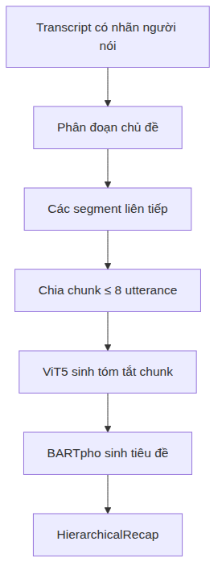
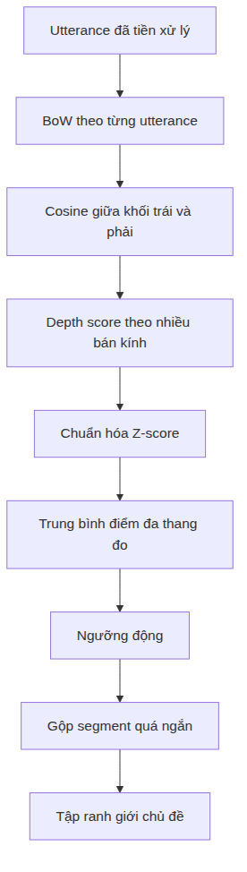

# XÂY DỰNG HỆ THỐNG TÓM TẮT CUỘC HỌP TIẾNG VIỆT THEO THỜI GIAN THỰC SỬ DỤNG PHÂN ĐOẠN CHỦ ĐỀ VÀ MÔ HÌNH SINH PHÂN CẤP

---

**Tóm tắt (Abstract)**

Bản ghi lời thoại (transcript) cuộc họp thường dài, có nhiều người tham gia đối thoại, chứa câu rời rạc và chuyển chủ đề không rõ ràng. Việc đưa toàn bộ transcript vào một mô hình ngôn ngữ lớn duy nhất vừa bị giới hạn độ dài ngữ cảnh (context window) đầu vào, vừa dễ dẫn đến tình trạng mất mát thông tin và bỏ sót các ý chính quan trọng. Báo cáo này trình bày thiết kế và triển khai một hệ thống tóm tắt cuộc họp tiếng Việt theo thời gian thực theo cấu trúc phân cấp. Hệ thống trước hết chia hội thoại thành các phân đoạn chủ đề bằng Multi-Scale Sliding TextTiling (thuật toán được lấy ý tưởng và cải tiến từ giải thuật TextTiling gốc của Hearst [@Hearst1997]). Đây là một phương pháp phi giám sát kết hợp: (1) Bag-of-Words để biểu diễn tần suất xuất hiện của từ vựng; (2) độ tương đồng cosine để đo lường mức độ trùng lặp nội dung giữa hai nhóm utterance lân cận; (3) điểm sâu đa bán kính nhằm phát hiện điểm chuyển dịch chủ đề ở các quy mô cửa sổ khác nhau; (4) chuẩn hóa thống kê Z-score để đồng bộ hóa thang đo điểm số giữa các bán kính; (5) ngưỡng động thích ứng theo phân phối điểm số của từng cuộc họp; và (6) gộp các phân đoạn quá nhỏ nhằm hạn chế sự phân mảnh chủ đề. Mỗi phân đoạn sau đó được chia thành các nhóm utterance (chunk) với 8 utterance. Mô hình ViT5 đã tinh chỉnh sinh tóm tắt cho từng chunk; các tóm tắt trung gian được ghép theo thứ tự và đưa vào BARTpho để tạo tiêu đề chủ đề.

Hệ thống cung cấp cơ chế xử lý và phát kết quả tăng dần qua năm loại sự kiện để tạo cấu trúc `HierarchicalRecap`. Do thuật toán phân đoạn cần quan sát ngữ cảnh bên phải trước khi xác nhận ranh giới, “thời gian thực” trong nghiên cứu được hiểu là **xử lý tăng dần với độ trễ xác nhận**, không phải dự đoán nhân quả ngay khi một utterance vừa xuất hiện. Trên sáu bộ dữ liệu phân đoạn, `sliding_texttiling` đạt $F_1$ trung bình 0,1838, $P_k$ trung bình 0,5034 và WindowDiff trung bình 0,5413. Phương pháp có $F_1$ trung bình cao nhất trong nhóm được khảo sát nhưng đứng thứ hai theo điểm Composite, thể hiện sự đánh đổi giữa độ chính xác biên và chi phí xử lý. Trên AliMeeting4MUG_vi, ViT5 đạt ROUGE-1/2/L lần lượt 0,7265/0,4854/0,5486; BARTpho đạt ROUGE-Max-1/2/L tương ứng 0,5304/0,2837/0,4443. Các kết quả xác nhận tính khả thi ở mức thành phần; chất lượng đầu-cuối và mức độ hữu ích đối với người dùng vẫn cần được đánh giá thủ công trong nghiên cứu tiếp theo.

**Từ khóa (Keywords):** tóm tắt cuộc họp, phân đoạn chủ đề, Sliding TextTiling, ViT5, BARTpho, xử lý luồng, tiếng Việt (meeting summarization, topic segmentation, Sliding TextTiling, ViT5, BARTpho, streaming, Vietnamese).

---

## Mở đầu (Introduction)

### Bối cảnh và động cơ nghiên cứu (Background and Motivation)
Họp trực tuyến và các cuộc họp ngắn hằng ngày (*daily meeting*) tạo ra ngày càng nhiều bản ghi lời thoại. Transcript giúp lưu trữ nội dung nhưng không giải quyết trực tiếp nhu cầu tra cứu nhanh: người dùng vẫn phải đọc hàng trăm hoặc hàng nghìn utterance để xác định cuộc họp đã bàn gì, nội dung nào thuộc cùng một chủ đề và phần nào chứa kết luận quan trọng. Khó khăn tăng lên khi transcript có nhiều người nói, câu không hoàn chỉnh, từ đệm, lặp ý và lỗi nhận dạng giọng nói.

Tóm tắt văn bản thông thường giả định đầu vào tương đối mạch lạc. Hội thoại cuộc họp không có tiêu đề hoặc ranh giới đoạn rõ ràng; một chủ đề có thể kéo dài qua nhiều lượt nói, bị ngắt bởi trao đổi ngắn rồi quay lại. Nếu xử lý toàn bộ transcript như một văn bản phẳng và đưa trực tiếp vào các mô hình ngôn ngữ lớn (LLM), hệ thống thường gặp tình trạng quá tải cửa sổ ngữ cảnh (context window overload) và dễ phát sinh hiện tượng "lost in the middle" (mất mát hoặc bỏ sót thông tin nằm ở giữa ngữ cảnh dài) [@Liu2024Lost]. Đồng thời, cách làm này hoàn toàn không phù hợp với yêu cầu truyền nhận và cập nhật kết quả tăng dần theo thời gian thực.

Nghiên cứu tiếp cận vấn đề theo nguyên tắc phân rã: xác định ranh giới chủ đề trước, tóm tắt từng phần nhỏ sau, rồi tổ chức các kết quả thành báo cáo phân cấp. Phân đoạn chủ đề làm giảm độ dài và nhiễu của mỗi đơn vị xử lý. Tóm tắt theo chunk giúp mô hình sinh làm việc trong giới hạn đầu vào. Tiêu đề chủ đề cung cấp lớp điều hướng ở mức cao, trong khi tóm tắt chunk giữ lại chi tiết theo trình tự.

### Bài toán nghiên cứu (Problem Statement)
Đầu vào của hệ thống là chuỗi $n$ utterance theo thứ tự thời gian:
$$
U = (u_1, u_2, \dots, u_n)
$$
Hệ thống cần tìm tập ranh giới $B$, chia $U$ thành các phân đoạn chủ đề; chia mỗi phân đoạn thành các chunk; sinh tóm tắt $q_{k,j}$ cho chunk thứ $j$ của chủ đề $k$; và sinh tiêu đề $h_k$ từ các tóm tắt thuộc chủ đề đó. Đầu ra là một cấu trúc phân cấp:
$$
R = \left\{ \left( h_k, \{ q_{k, 1}, q_{k, 2}, \dots, q_{k, m_k} \} \right) \right\}_{k=1}^{K}
$$
Ngoài chất lượng nội dung, hệ thống được tối ưu hóa cho chế độ trực tuyến (Streaming), tiếp nhận dần từng utterance để cập nhật kết quả trung gian theo thời gian thực, đảm bảo phản hồi tức thời cho người dùng trong suốt thời gian diễn ra cuộc họp.

### Mục tiêu nghiên cứu (Research Objectives)
Nghiên cứu hướng tới các mục tiêu cụ thể sau:
1. Xây dựng phương pháp phân đoạn chủ đề hội thoại tiếng Việt không cần huấn luyện và đủ nhẹ cho pipeline trực tuyến.
2. Tinh chỉnh mô hình ViT5 để tóm tắt khối hội thoại ngắn.
3. Tinh chỉnh BARTpho để sinh tiêu đề từ chuỗi tóm tắt trung gian.
4. Thiết kế pipeline phân cấp hỗ trợ cập nhật kết quả trực tuyến (streaming) thời gian thực.
5. Đánh giá từng thành phần bằng các chỉ số phù hợp: $P_k$, WindowDiff và $F_1$ cho phân đoạn; ROUGE/RougeMax cho tóm tắt và tạo tiêu đề.

### Phạm vi nghiên cứu (Scope of Study)

Nghiên cứu tập trung vào giai đoạn xử lý **bản ghi lời thoại dạng văn bản**. Đầu vào được giả định đã có thứ tự thời gian và nhãn người nói; nhận dạng tiếng nói tự động (ASR), phân tách người nói, nhận dạng cảm xúc và thu âm không nằm trong phạm vi triển khai chính. Hệ thống xử lý hội thoại tiếng Việt hoặc dữ liệu được dịch sang tiếng Việt, chia transcript thành các phân đoạn chủ đề liên tiếp, sinh tóm tắt cho từng chunk và tạo tiêu đề cho từng chủ đề.

Đánh giá thực nghiệm được thực hiện ở mức thành phần: chất lượng phân đoạn được đo trên sáu bộ dữ liệu tiếng Anh được dịch sang tiếng Việt; ViT5 và BARTpho được đánh giá trên các tập phát triển tương ứng của AliMeeting4MUG_vi. Nghiên cứu chưa thực hiện đánh giá người dùng quy mô lớn, chưa đo đầy đủ tính đúng đắn thực tế và ảo giác của recap đầu-cuối, và chưa khẳng định khả năng khái quát cho transcript ASR tiếng Việt tự nhiên. Hai mô hình sinh được triển khai trên GPU CUDA; riêng bộ phân đoạn dựa trên BoW có thể chạy trên CPU.

### Đóng góp nghiên cứu (Research Contributions)
Các đóng góp chính của nghiên cứu gồm:
* Một pipeline tóm tắt cuộc họp tiếng Việt theo cấu trúc chủ đề, hỗ trợ cập nhật trực tuyến (streaming) thời gian thực.
* Thuật toán Multi-Scale Sliding TextTiling cải tiến từ thuật toán TextTiling truyền thống.
* Hai model tạo sinh được tinh chỉnh cho hai nhiệm vụ tách biệt: tóm tắt chunk bằng ViT5 và tạo tiêu đề chủ đề bằng BARTpho.
* Một đánh giá thực nghiệm gồm 5 phương pháp phân đoạn trên 6 tập dữ liệu được dịch sang tiếng Việt bằng `tencent/Hy-MT2-1.8B`, cùng benchmark riêng cho hai mô hình sinh.
* Một bản dữ liệu tiếng Việt phục vụ thực nghiệm nội bộ, được xây dựng bằng cách dịch AliMeeting4MUG với `tencent/Hy-MT2-1.8B` và rà soát thủ công. Việc phát hành công khai bản dẫn xuất phụ thuộc vào kiểm tra giấy phép và hoàn thiện mô tả quy trình kiểm soát chất lượng.
* Thiết kế pipeline phân tầng rõ ràng đi kèm quy trình xử lý dữ liệu streaming, giúp cập nhật kết quả tóm tắt từng bước (tăng dần) theo thời gian thực qua 5 cột mốc truyền nhận dữ liệu.

---

## Nghiên cứu liên quan (Related Work)

### Tóm tắt văn bản và tóm tắt hội thoại (Text and Dialogue Summarization)
Tóm tắt văn bản tạo phiên bản ngắn hơn của đầu vào trong khi cố gắng bảo toàn thông tin quan trọng. Phương pháp trích xuất chọn câu hoặc cụm từ có sẵn; phương pháp sinh tạo chuỗi mới và có thể diễn đạt cô đọng hơn. Mô hình sinh dựa trên Transformer đạt chất lượng ngôn ngữ tốt nhưng có nguy cơ ảo giác và phụ thuộc mạnh vào dữ liệu huấn luyện.

Tóm tắt cuộc họp khó hơn tóm tắt tài liệu đơn tác giả. Thông tin quan trọng có thể được hình thành qua nhiều lượt nói: một người đề xuất, người khác phản biện và nhóm chốt phương án ở cuối. Một câu riêng lẻ thường không đủ ngữ cảnh. Bản tóm tắt hữu ích do đó cần phản ánh trình tự và cấu trúc chủ đề, thay vì chỉ xếp hạng từng câu độc lập.

Nghiên cứu chọn tóm tắt sinh phân cấp. Đơn vị nhỏ là chunk tối đa 8 utterance, đủ ngắn cho ViT5. Các tóm tắt chunk đóng vai trò biểu diễn nén của phân đoạn. Từ biểu diễn này, BARTpho sinh tiêu đề ở mức chủ đề. Thiết kế tách nhiệm vụ cho phép mỗi mô hình tối ưu một mục tiêu rõ ràng.

### Phân đoạn chủ đề hội thoại (Dialogue Topic Segmentation)
Phân đoạn chủ đề chia chuỗi đơn vị ngôn ngữ thành các vùng liên tiếp có nội dung tương đối nhất quán. TextTiling của Hearst [@Hearst1997] dựa trên giả định rằng các phần cùng chủ đề chia sẻ từ vựng, còn độ tương đồng giảm tại điểm chuyển chủ đề. Phương pháp tạo chuỗi điểm tương đồng giữa các khối lân cận, tìm các “thung lũng” và chọn vị trí có điểm sâu cao làm ranh giới.

Phương pháp từ vựng có ưu điểm không cần nhãn, dễ giải thích và chạy nhanh. Tuy nhiên, nó không nhận biết tốt hai cách diễn đạt khác từ nhưng cùng nghĩa; đồng thời dễ bị nhiễu trong hội thoại ngắn. Xing và Carenini cho thấy coherence giữa các cặp utterance có thể bổ sung tín hiệu ngữ nghĩa cho phân đoạn hội thoại [@Xing2021]. Biểu diễn embedding cải thiện ngữ nghĩa nhưng tăng chi phí suy luận. Đề tài sử dụng đa bán kính để giảm phụ thuộc vào một kích thước quan sát cố định: bán kính nhỏ nhạy với chuyển dịch ngắn, bán kính lớn phản ánh thay đổi vĩ mô. Trong các phương pháp học sâu, mô hình ViBERT TextTiling được xây dựng bằng cách tích hợp Sentence-BERT làm giàu ngữ nghĩa câu thoại theo phương pháp của Xing và Carenini [@Xing2021], trong khi BaMiBERT-1DOD chuyển đổi nhiệm vụ này thành phát hiện vật thể một chiều (1DOD) theo đề xuất của He và các cộng sự [@He2024]. Cả hai mô hình đều được tinh chỉnh (fine-tune) trực tiếp trên cùng sáu bộ dữ liệu dịch tiếng Việt dùng chung trong thực nghiệm để đảm bảo tính nhất quán của phân phối dữ liệu miền.

### Kiến trúc Transformer, T5 và BART (Transformer, T5, and BART Architectures)
Transformer sử dụng self-attention để mô hình hóa quan hệ giữa các token [@Vaswani2017]. Trong mô hình encoder–decoder, encoder mã hóa đầu vào và decoder sinh đầu ra tự hồi quy. T5 biểu diễn nhiều nhiệm vụ NLP dưới dạng chuyển đổi văn bản–văn bản [@Raffel2020]. Tiền tố tác vụ như `Tóm tắt:` giúp mô hình nhận biết nhiệm vụ. ViT5 kế thừa cách tiếp cận này và được huấn luyện cho tiếng Việt [@Phan2022]. BART kết hợp encoder hai chiều và decoder tự hồi quy, được tiền huấn luyện bằng cách khôi phục văn bản bị làm nhiễu [@Lewis2020]. BARTpho là biến thể dành cho tiếng Việt, phù hợp với nhiệm vụ sinh chuỗi ngắn như tiêu đề [@Nguyen2022].

Trong đề tài, ViT5 nhận văn bản hội thoại trực tiếp và sinh một câu tóm tắt. BARTpho nhận các tóm tắt từ ViT5 của các chunk trong topic. Việc không đưa transcript thô vào bộ tạo tiêu đề làm giảm độ dài đầu vào và tách tiêu đề khỏi nhiễu hội thoại.

### Tóm tắt phân cấp và xử lý ngữ cảnh dài (Hierarchical Summarization and Long Context Processing)
Ý tưởng thiết kế hệ thống tóm tắt phân cấp (hierarchical recap / structured minutes) để cân bằng giữa nhu cầu nắm bắt thông tin nhanh và tra cứu sâu được lấy cảm hứng từ đề xuất của Asthana và các cộng sự [@Asthana2025Recap]. Khi đầu vào vượt giới hạn mô hình, một chiến lược phổ biến là chia nhỏ, xử lý từng phần và tổng hợp kết quả. Ưu điểm là kiểm soát context và giữ được thông tin. Nhược điểm là context ngắn cũng có thể gây thiếu thông tin cung cấp cho model.

Hệ thống sử dụng chiến lược bottom-up roll-up. Transcript được chia theo chủ đề trước khi chunking, nhờ đó phần lớn chunk không vượt qua ranh giới nội dung. Tóm tắt chunk được giữ theo thứ tự thời gian. Tiêu đề được sinh sau khi toàn bộ chunk của phân đoạn hoàn tất, vì vậy gọi là tạo tiêu đề trì hoãn.

### Xử lý dữ liệu dạng luồng (Streaming Data Processing)
Phương pháp xử lý theo luồng (streaming) cho phép hệ thống liên tục tính toán và xuất kết quả tóm tắt trung gian trước khi toàn bộ cuộc họp kết thúc. So với cơ chế xử lý theo lô (batching) truyền thống, cơ chế streaming giúp giảm đáng kể độ trễ phản hồi (latency), cho phép hệ thống phát kết quả cập nhật tăng dần ngay khi các cấu trúc dữ liệu trung gian (chunk, segment) được hình thành.

Tuy nhiên, một ranh giới chủ đề chỉ có thể được xác nhận khi đã quan sát đủ ngữ cảnh phía sau. Vì vậy “thời gian thực” trong đề tài được hiểu là xử lý và xuất kết quả tăng dần, không phải xác định ranh giới ngay tại thời điểm phát sinh câu thoại. Hệ thống truyền dữ liệu khi phân đoạn hoặc chunk đã đóng và không sửa lại đối tượng bất biến đã công bố.

### Chỉ số đánh giá tự động (Automatic Evaluation Metrics)
$P_k$ đo xác suất hai vị trí cách nhau một cửa sổ bị phân loại sai về quan hệ cùng/khác phân đoạn [@Beeferman1999]. WindowDiff đếm sự khác biệt về số ranh giới trong cửa sổ và khắc phục một số hạn chế của $P_k$ [@Pevzner2002]. Hai chỉ số càng thấp càng tốt. Với đánh giá biên, một ranh giới dự đoán được ghép một-một với ranh giới tham chiếu khi nằm trong cửa sổ dung sai do mã đánh giá quy định. Khi đó:

$$
P=\frac{TP}{TP+FP},\qquad R=\frac{TP}{TP+FN},\qquad
F_1=\frac{2PR}{P+R}.
$$

$F_1$ càng cao càng tốt. Vì giá trị phụ thuộc trực tiếp vào kích thước dung sai và chiến lược ghép biên, báo cáo phải sử dụng cùng một mã đánh giá cho mọi phương pháp; không diễn giải chỉ số này như exact-span matching.

ROUGE đánh giá độ trùng lặp n-gram hoặc chuỗi con chung dài nhất giữa đầu ra và tham chiếu [@Lin2004]. ROUGE-1 phản ánh unigram, ROUGE-2 phản ánh bigram và ROUGE-L dựa trên chuỗi con chung dài nhất. Với nhiều tiêu đề tham chiếu, đề tài dùng ROUGE-Max: tính ROUGE với từng tham chiếu rồi lấy giá trị lớn nhất. Cách này chấp nhận nhiều cách đặt tiêu đề hợp lệ nhưng có thể cho điểm lạc quan hơn so với lấy trung bình.

### Khoảng trống nghiên cứu và định hướng (Research Gaps and Directions)
Các hướng tiếp cận hiện có thường đánh đổi giữa mô hình ngữ nghĩa tốn tài nguyên và heuristic nhẹ nhưng hạn chế hiểu nghĩa. Đồng thời, nhiều pipeline tóm tắt tập trung vào chất lượng đầu ra cuối mà chưa xem xét tiến trình truyền dữ liệu tăng dần theo thời gian thực. Đề tài không đặt mục tiêu chứng minh một mô hình đạt trạng thái tốt nhất tuyệt đối. Thay vào đó, nghiên cứu xây dựng và đánh giá một tổ hợp thực dụng: phân đoạn phi giám sát chạy nhanh, hai mô hình sinh cục bộ chuyên biệt và một lõi điều phối dùng chung cho hai chế độ vận hành.

---

## Phương pháp luận (Methodology)

### Quy trình tổng thể (Overall Pipeline)
Pipeline gồm 4 giai đoạn chính: phân đoạn hội thoại bằng Multi-Scale Sliding TextTiling; chia từng phân đoạn thành các chunk liên tiếp tối đa 8 utterance; sinh tóm tắt chunk bằng ViT5; và ghép các tóm tắt theo thứ tự để BARTpho sinh tiêu đề. Đầu ra là HierarchicalRecap, trong đó mỗi segment chứa khoảng chỉ số, tiêu đề và danh sách chunk. Cấu trúc này hỗ trợ đọc theo chiều rộng: xem danh sách chủ đề trước rồi mở chi tiết khi cần.

**Hình 1. Quy trình tổng thể của hệ thống tóm tắt phân cấp**



Ở mức cấu trúc, đầu ra không phải một đoạn tóm tắt phẳng mà là danh sách chủ đề; mỗi chủ đề có một tiêu đề và chuỗi tóm tắt ngắn theo trật tự thời gian. Cách biểu diễn này giữ được khả năng truy vết từ kết quả về khoảng utterance nguồn.

### Thuật toán Multi-Scale Sliding TextTiling (Multi-Scale Sliding TextTiling Algorithm)
Thuật toán Multi-Scale Sliding TextTiling được lấy ý tưởng và cải tiến từ thuật toán phân đoạn TextTiling gốc của Hearst [@Hearst1997], kết hợp thêm cơ chế cửa sổ trượt (sliding block) và tổng hợp điểm sâu đa bán kính để tối ưu hóa việc phân đoạn trong hội thoại.

#### Tiền xử lý và độ tương đồng khối (Preprocessing and Block-level Similarity)
Với mỗi utterance $u_i$, hệ thống chuyển chữ thường, loại ký tự đặc biệt, lọc từ dừng tiếng Việt bằng stopwordsiso [@Stopwordsiso2024] và tạo vector tần suất $b_i(w) = \operatorname{tf}(w, u_i)$. Tại khe $i$ giữa $u_i$ và $u_{i+1}$, hai khối có kích thước $k$ được biểu diễn bởi:
$$
B_L^i(w) = \sum_{j=\max(1, i-k+1)}^{i} b_j(w)
$$
$$
B_R^i(w) = \sum_{j=i+1}^{\min(n, i+k)} b_j(w)
$$
Độ tương đồng cosine:
$$
S_i = \frac{B_L^i \cdot B_R^i}{\|B_L^i\|_2 \|B_R^i\|_2 + \varepsilon}
$$
Trong đó $\varepsilon=10^{-10}$ tránh phép chia cho 0 khi một khối rỗng sau tiền xử lý. Giá trị thấp cho biết hai phía chia sẻ ít từ vựng và có thể là điểm chuyển chủ đề. So sánh theo khối ổn định hơn so sánh hai câu ngắn riêng lẻ.

#### Điểm sâu thung lũng đa bán kính (Multi-radius Depth Scoring)
Với bán kính $r$, đỉnh trái và phải quanh khe $i$ là:
$$
p_L(i, r) = \max_{\max(1, i-r) \le j \le i} S_j
$$
$$
p_R(i, r) = \max_{i \le j \le \min(n-1, i+r)} S_j
$$
Điểm sâu:
$$
D_r(i) = \frac{p_L(i, r) + p_R(i, r) - 2S_i}{2}
$$
Đề tài sử dụng $R = \{3, 5, 10, 15, 20\}$. Mỗi mảng điểm được chuẩn hóa để bán kính lớn không chi phối:
$$
\widehat{D}_r(i) = \frac{D_r(i) - \mu_r}{\sigma_r + 10^{-10}}
$$
$$
\bar{D}(i) = \frac{1}{|R|} \sum_{r \in R} \widehat{D}_r(i)
$$

#### Ngưỡng động và gộp phân đoạn ngắn (Dynamic Thresholding and Greedy Merging)
Ngưỡng thích ứng được tính:
$$
\tau = \mu(\bar{D}) + \alpha \sigma(\bar{D})
$$
Khe có $\bar{D}(i) > \tau$ là ứng viên ranh giới. Cấu hình mặc định được chọn gồm `block_size = 2`, `alpha = 1.0`, `radii = [3, 5, 10, 15, 20]` và `min_segment_ratio = 0.08`. Độ dài tối thiểu là:
$$
m_{\min} = \max(2, \lfloor 0.08n \rfloor)
$$
Nếu một phân đoạn ngắn hơn $m_{\min}$, thuật toán xóa ranh giới yếu hơn trong hai ranh giới bao quanh để gộp đoạn vào láng giềng. Bước hậu xử lý làm giảm quá phân mảnh và tránh gửi quá ít ngữ cảnh cho mô hình sinh.

#### Mã giả thuật toán (Algorithm Pseudocode)
```text
Input: utterances U, block size k, radii R, alpha, min ratio
1. Chuyển từng utterance thành biểu diễn BoW sau khi lọc stopword.
2. Tính độ tương đồng cosine giữa khối trái và phải tại mọi khe.
3. Với mỗi bán kính r trong R: tính depth score và chuẩn hóa Z-score.
4. Lấy trung bình các mảng depth đã chuẩn hóa để có aggregated_depth.
5. Thiết lập ngưỡng động: tau <- mean(aggregated_depth) + alpha * std(aggregated_depth).
6. Chọn khe có aggregated_depth > tau và thêm điểm chốt chặn kết thúc.
7. Gộp tham lam các phân đoạn ngắn hơn tỷ lệ min_segment_ratio.
8. Trả về ranh giới các phân đoạn chủ đề.
```

**Hình 2. Các bước của Multi-Scale Sliding TextTiling**



### Tóm tắt khối bằng ViT5 (Chunk Summarization via ViT5)
Mỗi phân đoạn được chia tuần tự, không chồng lấn, thành các chunk tối đa 8 utterance. Đầu vào giữ người nói và thêm tiền tố tác vụ:
```text
Tóm tắt: Speaker A: ...
Speaker B: ...
```
ViT5 học chuỗi đích bằng negative log-likelihood:
$$
\mathcal{L}_{\text{sum}}(\theta) = -\frac{1}{N} \sum_{i=1}^{N} \sum_{j=1}^{|y_i|} \log P_\theta(y_{i, j} \mid y_{i, <j}, x_i)
$$
Runtime giới hạn đầu vào 512 token, dùng 4 beam và tối đa 128 token mới. Checkpoint triển khai là `models/vit5-chunk-summarizer-v1` do tác giả tinh chỉnh và huấn luyện, được lưu trữ và tải cục bộ.

### Tạo tiêu đề chủ đề bằng BARTpho (Topic Titling via BARTpho)
Với các tóm tắt $q_{k,1}, \dots, q_{k,m}$ của chủ đề $k$, đầu vào là:
$$
x_k^{\text{title}} = \text{“Tạo tiêu đề: ”} \mathbin{\Vert} q_{k, 1} \mathbin{\Vert} \text{“ / ”} \mathbin{\Vert} \dots \mathbin{\Vert} q_{k, m}
$$
Nếu chuỗi dài hơn 1.500 ký tự, hệ thống giữ 1.500 ký tự cuối, sau đó giới hạn ở 1.024 token. Runtime dùng 4 beam và tối đa 200 token. Checkpoint là `models/bartpho-topic-titler-v2` đã được tinh chỉnh và huấn luyện.

Dữ liệu có tối đa 3 tiêu đề tham chiếu. Mục tiêu huấn luyện là tiêu đề có nhiều từ nhất:
$$
y^* = \arg\max_{c \in C} \operatorname{CountWords}(c)
$$
Lựa chọn này ưu tiên độ bao phủ nhưng không đảm bảo tiêu đề tự nhiên nhất. Khi đánh giá, đầu ra được so với toàn bộ tham chiếu bằng ROUGE-Max.

---

## Bộ dữ liệu (Dataset)

### Dữ liệu cho các mô hình tạo sinh (Generative Model Datasets)
Dữ liệu chính được sử dụng là `AliMeeting4MUG_vi`, một bản dịch tiếng Việt do chúng tôi thực hiện từ bộ data AliMeeting4MUG [@Zhang2023MUG]. Quá trình dịch sử dụng `tencent/Hy-MT2-1.8B`, sau đó có bước rà soát thủ công. Tập huấn luyện nguồn chứa 295 bản ghi hội thoại; trường `chunk_summaries` cung cấp khoảng `start_id`–`end_id` và tóm tắt tương ứng. Quá trình trích xuất tạo ra 28.079 cặp `(chunk, summary)`. 

**Thống kê tập dữ liệu huấn luyện và đánh giá mô hình tạo sinh**

| Tập dữ liệu          | Số bản ghi (Hội thoại) | Đơn vị đánh giá | Quy mô trích xuất |
| -------------------- | ---------------------- | --------------- | ----------------- |
| Train nguồn          | 295                    | 28.079 chunk    | -                 |
| Train sau chia (90%) | 265                    | 25.051 chunk    | -                 |
| Validation (10%)     | 30                     | 3.028 chunk     | -                 |
| Dev benchmark        | 65                     | 6.038 chunk     | 736 chủ đề        |


Train/validation được chia 90/10 với seed 42. Đầu vào trung bình 137 token, trung vị 132, P99 là 296 và lớn nhất 2.045 token. Tóm tắt đích trung bình khoảng 175 ký tự (~50 token), tối đa 382 ký tự. Nhãn tiêu đề có tối đa ba phương án do con người gán.

Để giải quyết nguy cơ rò rỉ dữ liệu (data leakage) khi các chunk thuộc cùng một cuộc họp xuất hiện đồng thời trong tập train và validation, chúng tôi phân chia dữ liệu huấn luyện và đánh giá ở mức độ cuộc họp (meeting-level group split) với tỷ lệ 90/10 cố định theo cuộc họp (seed 42). Việc chia nhóm theo `meeting_id` này giúp cố định validation theo cuộc họp và đảm bảo tính khách quan tối đa cho kết quả đánh giá.

### Dữ liệu cho phân đoạn chủ đề (Topic Segmentation Datasets)
Quá trình benchmark phân đoạn chủ đề sử dụng 6 bộ dữ liệu hội thoại. Tương tự như tập dữ liệu phục vụ mô hình tạo sinh, do các bộ dữ liệu gốc đều được biên soạn bằng tiếng Anh, chúng tôi đã tiến hành dịch toàn bộ các bộ dữ liệu này sang tiếng Việt bằng mô hình dịch thuật song ngữ `tencent/Hy-MT2-1.8B`, sau đó tiến hành rà soát và kiểm soát chất lượng thủ công:

**Thống kê quy mô các bộ dữ liệu phân đoạn chủ đề hội thoại**

| Bộ dữ liệu          | Số lượng hội thoại | Tổng số utterance | TB utterance/đoạn | Số phân đoạn | Đặc trưng                                             |
| ------------------- | ------------------ | ----------------- | ----------------- | ------------ | ----------------------------------------------------- |
| `dialseg_711`       | 711                | 19.350            | 27,2              | 3.465        | Bản dịch từ AMI [@Carletta2005], các utterance ngắn.  |
| `doc2dial`          | 3.270              | 42.585            | 13,0              | 11.400       | Bản dịch dịch vụ công nhiệm vụ [@Feng2020].           |
| `meeting_ami`       | 137                | 73.379            | 535,6             | 601          | Bản dịch từ AMI [@Carletta2005], họp dài phức tạp.    |
| `meeting_committee` | 36                 | 7.477             | 207,7             | 254          | Bản dịch thảo luận ủy ban chuyên sâu, trang trọng.    |
| `meeting_icsi`      | 59                 | 48.321            | 819,0             | 268          | Bản dịch từ ICSI [@Janin2003], họp học thuật cực dài. |
| `tiage`             | 500                | 7.802             | 15,6              | 2.013        | Bản dịch dữ liệu đối thoại có nhãn chuyển chủ đề [@TIAGE2021]. |


---

## Thực nghiệm và Phân tích (Experiments and Analysis)

### Thiết lập thực nghiệm và Chi tiết triển khai (Experimental Setup and Implementation Details)

#### Huấn luyện bộ tóm tắt khối ViT5 (ViT5 Chunk Summarizer Training)
Mô hình nền là `VietAI/vit5-base-vietnews-summarization` (226M tham số) [@Phan2022].

**Các siêu tham số thiết lập cho huấn luyện mô hình ViT5**

| Siêu tham số | Giá trị thiết lập |
|---|---|
| Mô hình nền (Base model) | `VietAI/vit5-base-vietnews-summarization` |
| Bộ tối ưu hóa (Optimizer) | AdamW |
| Tốc độ học (Learning rate) | $3\times10^{-4}$ |
| Suy giảm trọng số / Warmup | 0,01 / 0,06 |
| Batch size mỗi GPU / tích lũy | 2 / 16 (Batch hiệu dụng = 32) |
| Số lượng epoch tối đa | 10 |
| Kiên nhẫn dừng sớm (Patience) | 5 epochs |
| Độ chính xác (Precision) | fp16 |
| Phương pháp giải mã (Decoding) | Beam search (width = 4) |
| Giới hạn token input/target | 512 / 128 tokens |

#### Huấn luyện bộ tạo tiêu đề BARTpho (BARTpho Topic Titler Training)
Mô hình nền là `vinai/bartpho-syllable-base` (132M tham số) [@Nguyen2022].

**Các siêu tham số thiết lập cho huấn luyện mô hình BARTpho**

| Siêu tham số | Giá trị thiết lập |
|---|---|
| Mô hình nền (Base model) | `vinai/bartpho-syllable-base` |
| Tốc độ học (Learning rate) | $5\times10^{-5}$ |
| Batch size mỗi GPU / tích lũy | 4 / 16 (Batch hiệu dụng = 64) |
| Giới hạn token input/target | 1.024 (giữ 1.500 ký tự cuối) / 64 tokens |
| Hàm mất mát (Loss function) | Sequence NLL Loss |

#### Môi trường hệ thống và tính tái lập (System Environment and Reproducibility)

**Cấu hình môi trường phần cứng và các thư viện phụ thuộc**

| Thành phần         | Phiên bản / Đặc tả                                    |
| ------------------ | ----------------------------------------------------- |
| Ngôn ngữ lập trình | Python 3.12.3                                         |
| Framework học sâu  | PyTorch 2.13.0+cu130; Transformers 5.13.1 [@Wolf2020] |
| Xác thực dữ liệu   | Pydantic 2.13.4 [@Colvin2024]                         |
| Thiết bị GPU       | NVIDIA GeForce RTX 4060 (8 GB VRAM)                   |
| Hệ điều hành       | Ubuntu 24.04.4 LTS                                    |


### Câu hỏi nghiên cứu (Research Questions)
Thực nghiệm trả lời 3 câu hỏi chính:
* **RQ1:** Multi-Scale Sliding TextTiling có cân bằng được độ chính xác biên và chi phí xử lý so với các segmenter khác không?
* **RQ2:** ViT5 sau tinh chỉnh có học được nhiệm vụ tóm tắt chunk hội thoại tiếng Việt không?
* **RQ3:** BARTpho có thể tạo tiêu đề chủ đề từ các tóm tắt trung gian mà không cần transcript thô không?

Bốn phương pháp phân đoạn so sánh gồm: NLTK TextTiling, Sliding TextTiling, ViBERT TextTiling và BaMiBERT-1DOD. Để đảm bảo so sánh công bằng và phù hợp với đặc thù tiếng Việt, hai mô hình học sâu so sánh được chúng tôi huấn luyện lại như sau: (1) ViBERT TextTiling được fine-tune Sentence-BERT trên chính sáu tập dữ liệu tiếng Việt thực nghiệm dựa trên phương pháp tính điểm liên kết câu của Xing và Carenini [@Xing2021]; (2) BaMiBERT-1DOD sử dụng kiến trúc phân đoạn dòng hội thoại dạng phát hiện vật thể một chiều của He và cộng sự [@He2024], được fine-tune trực tiếp trên cùng sáu tập dữ liệu này để học cách phân loại biên lượt thoại trong môi trường tiếng Việt.

### Kết quả thực nghiệm phân đoạn chủ đề (Topic Segmentation Experimental Results)

#### Kết quả trên tập dialseg_711 (Results on dialseg_711)

**Kết quả so sánh các phương pháp trên tập dữ liệu dialseg_711**

| Phương pháp | $P_k$ ↓ | WD ↓ | $F_1$ ↑ | Thời gian (s) ↓ |
| --- | ---: | ---: | ---: | ---: |
| `sliding_texttiling` (Ours) | **0,3651** | **0,3813** | 0,3423 | **1,13** |
| `bamibert_1dod` | 0,4474 | 0,4477 | 0,0104 | 16,58 |
| `nltk_texttiling` | 0,4736 | 0,4790 | 0,1850 | 7,41 |
| `vibert_texttiling` | 0,5071 | 0,7016 | **0,4013** | 287,34 |

#### Kết quả trên tập doc2dial (Results on doc2dial)

**Kết quả so sánh các phương pháp trên tập dữ liệu doc2dial**

| Phương pháp | $P_k$ ↓ | WD ↓ | $F_1$ ↑ | Thời gian (s) ↓ |
| --- | ---: | ---: | ---: | ---: |
| `bamibert_1dod` | **0,4593** | **0,4593** | 0,0007 | 44,10 |
| `sliding_texttiling` (Ours) | 0,5066 | 0,5110 | 0,2035 | **4,63** |
| `vibert_texttiling` | 0,5069 | 0,5687 | **0,4720** | 611,42 |
| `nltk_texttiling` | 0,5442 | 0,5463 | 0,2583 | 17,35 |

#### Kết quả trên tập meeting_ami (Results on meeting_ami)

**Kết quả so sánh các phương pháp trên tập dữ liệu meeting_ami**

| Phương pháp | $P_k$ ↓ | WD ↓ | $F_1$ ↑ | Thời gian (s) ↓ |
| --- | ---: | ---: | ---: | ---: |
| `sliding_texttiling` (Ours) | **0,5192** | **0,5382** | 0,0074 | **1,93** |
| `bamibert_1dod` | 0,5585 | 0,6968 | **0,0445** | 86,40 |
| `nltk_texttiling` | 0,6199 | 0,9428 | 0,0244 | 151,28 |
| `vibert_texttiling` | 0,6471 | 0,9993 | 0,0307 | 1081,97 |

#### Kết quả trên tập meeting_committee (Results on meeting_committee)

**Kết quả so sánh các phương pháp trên tập dữ liệu meeting_committee**

| Phương pháp | $P_k$ ↓ | WD ↓ | $F_1$ ↑ | Thời gian (s) ↓ |
| --- | ---: | ---: | ---: | ---: |
| `sliding_texttiling` (Ours) | **0,4559** | **0,4630** | 0,0489 | **0,28** |
| `nltk_texttiling` | 0,5215 | 0,7887 | 0,0430 | 233,93 |
| `bamibert_1dod` | 0,5967 | 0,8669 | 0,0757 | 74,16 |
| `vibert_texttiling` | 0,6037 | 0,9721 | **0,0884** | 98,44 |

#### Kết quả trên tập meeting_icsi (Results on meeting_icsi)

**Kết quả so sánh các phương pháp trên tập dữ liệu meeting_icsi**

| Phương pháp | $P_k$ ↓ | WD ↓ | $F_1$ ↑ | Thời gian (s) ↓ |
| --- | ---: | ---: | ---: | ---: |
| `sliding_texttiling` (Ours) | **0,5382** | **0,5519** | 0,0044 | **1,54** |
| `nltk_texttiling` | 0,6012 | 0,9502 | 0,0119 | 236,56 |
| `bamibert_1dod` | 0,6167 | 0,9470 | **0,0175** | 96,49 |
| `vibert_texttiling` | 0,6175 | 1,0000 | 0,0119 | 632,24 |

#### Kết quả trên tập tiage (Results on tiage)

**Kết quả so sánh các phương pháp trên tập dữ liệu tiage**

| Phương pháp | $P_k$ ↓ | WD ↓ | $F_1$ ↑ | Thời gian (s) ↓ |
| --- | ---: | ---: | ---: | ---: |
| `vibert_texttiling` | **0,4490** | 0,5531 | **0,4722** | 24,85 |
| `sliding_texttiling` (Ours) | 0,4534 | **0,4757** | 0,1976 | **0,14** |
| `bamibert_1dod` | 0,4940 | 0,4940 | 0,0669 | 1,96 |
| `nltk_texttiling` | 0,5044 | 0,5106 | 0,1424 | 0,40 |

#### Xếp hạng hiệu năng phân đoạn tổng hợp (Overall Performance Ranking)
Điểm Composite được tính bằng cách chuẩn hóa min–max từng metric trên từng bộ dữ liệu. Với metric càng thấp càng tốt $x\in\{P_k,WD\}$, điểm được đảo chiều:

$$
s_x=1-\frac{x-x_{\min}}{x_{\max}-x_{\min}}.
$$

Với $F_1$ càng cao càng tốt:

$$
s_{F_1}=\frac{F_1-F_{1,\min}}{F_{1,\max}-F_{1,\min}}.
$$

Composite là trung bình không trọng số của ba điểm chuẩn hóa, sau đó lấy trung bình trên sáu bộ dữ liệu. Đây là chỉ số tổng hợp nội bộ để hỗ trợ xếp hạng, không phải metric tiêu chuẩn; vì vậy kết luận vẫn phải xem riêng $P_k$, WD, $F_1$ và thời gian chạy.

**Bảng xếp hạng hiệu năng phân đoạn tổng hợp của các giải thuật**

| Hạng | Phương pháp | Composite ↑ | $P_k$ TB ↓ | WD TB ↓ | $F_1$ TB ↑ | Nhận xét |
| ---: | ------------------------------------- | ----------: | ---------: | ---------: | ---------: | --------------------------------------------------------------------------------------------------- |
| 1 | `sliding_texttiling` (Ours) | **0,7013** | **0,4731** | **0,4869** | 0,1340 | Đạt Composite cao nhất, cân bằng giữa độ chính xác biên (Pk, WD tốt nhất) và tốc độ xử lý vượt trội trên CPU. |
| 2 | `bamibert_1dod` | 0,4787 | 0,5288 | 0,6519 | 0,0360 | Phân đoạn tốt trên tập ngắn, kém ổn định trên họp dài. |
| 3 | `vibert_texttiling` | 0,3689 | 0,5552 | 0,7991 | **0,2461** | Đạt F1-score tốt nhất, nhưng có sai lệch biên lớn (Pk, WD kém nhất) và chi phí tính toán GPU rất cao. |
| 4 | `nltk_texttiling` | 0,3035 | 0,5441 | 0,7029 | 0,1108 | Thấp nhất do không tối ưu hóa từ vựng và đặc thù ngôn ngữ tiếng Việt. |

Các kết quả thực nghiệm khẳng định hiệu năng vượt trội của Sliding TextTiling (Ours) khi đứng thứ nhất về điểm Composite tổng hợp (0,7013) nhờ sự cân bằng xuất sắc giữa độ chính xác biên (đạt trung bình $P_k = 0,4731$ và $WD = 0,4869$ tốt nhất nhóm khảo sát) cùng tốc độ xử lý CPU vượt trội (chỉ mất từ 0,1 đến dưới 5 giây). Mặc dù `vibert_texttiling` có điểm $F_1$-score trung bình cao nhất (0,2461), mô hình này bị sai lệch ranh giới lớn trên các văn bản họp siêu dài (như AMI, ICSI) dẫn đến chỉ số lỗi $P_k$ và WD trung bình kém nhất, đồng thời tiêu tốn chi phí tính toán GPU cực kỳ lớn.

**Hình 3. So sánh hiệu năng phân đoạn của các giải thuật (Điểm Composite, Pk trung bình và F1-score trung bình)**


### Kết quả huấn luyện bộ tóm tắt khối ViT5 (ViT5 Chunk Summarizer Training Results)

#### Diễn biến huấn luyện theo epoch

**Mức độ suy giảm hàm mất mát và ROUGE của ViT5 qua từng epoch**

| Epoch |       Loss |    ROUGE-1 | ROUGE-2 |    ROUGE-L | Ghi chú                           |
| ----: | ---------: | ---------: | ------: | ---------: | --------------------------------- |
|     1 |     0,9289 |     0,7017 |  0,4487 |     0,5190 | Bắt đầu                           |
|     2 |     0,8085 |     0,7123 |  0,4660 |     0,5365 | -                                 |
|     3 | **0,7755** |     0,7168 |  0,4803 |     0,5418 | Cực tiểu Loss                     |
|     4 |     0,7781 |     0,7244 |  0,4860 |     0,5502 | -                                 |
|     5 |     0,7935 |     0,7235 |  0,4897 |     0,5451 | -                                 |
| **6** |     0,8320 |     0,7316 |  0,4967 | **0,5559** | **Checkpoint lưu trữ** (Peak R-L) |
|     7 |     0,8977 |     0,7311 |  0,4905 |     0,5500 | Bắt đầu overfit                   |
|    10 |     1,1964 | **0,7352** |  0,4968 |     0,5545 | Overfit nặng                      |
**Hình 4. Diễn biến hàm mất mát Loss và chỉ số ROUGE của ViT5 qua các epoch**


Mặc dù hàm mất mát đạt cực tiểu ở epoch 3, chỉ số ROUGE-L lại đạt đỉnh ở epoch 6. Quyết định chọn checkpoint epoch 6 giúp bảo toàn khả năng sinh từ ngữ có tính liên kết cấu trúc tốt hơn.

#### Đánh giá trên toàn tập validation và tập dev

**Kết quả đánh giá ROUGE của ViT5 trên các tập dữ liệu**

| Tập đánh giá | ROUGE-1 | ROUGE-2 | ROUGE-L | Quy mô mẫu |
|---|---:|---:|---:|---|
| Validation nhanh | 0,7316 | 0,4967 | 0,5559 | 200 |
| Validation đầy đủ | 0,7302 | 0,4957 | **0,5574** | 2.807 |
| Dev benchmark | **0,7265** | **0,4854** | **0,5486** | 6.038 |

Điểm ROUGE-1 khoảng 0,73 cho thấy ViT5 tái tạo được đáng kể từ vựng trong nhãn do mô hình giáo viên Gemma sinh. Kết quả này không tự động chứng minh tính đúng sự thật hoặc mức độ hữu ích của tóm tắt. Tuyên bố về mức tăng tốc so với Gemma được loại khỏi kết luận vì chưa có giao thức benchmark ghép cặp và thống kê độ trễ đầy đủ.

### Kết quả huấn luyện bộ tạo tiêu đề BARTpho (BARTpho Topic Titler Training Results)
Đánh giá trên 736 phân đoạn chủ đề lớn của tập `dev_vi.jsonl` thuộc `AliMeeting4MUG_vi` sử dụng ROUGE-Max:

**Kết quả đánh giá tiêu đề BARTpho trên dev benchmark**

| Chỉ số ROUGE-Max | Giá trị điểm số | Thống kê quy mô |
|---|---:|---|
| **ROUGE-1** | **0,5304** | Trung vị độ dài tiêu đề: **16 tokens** |
| **ROUGE-2** | **0,2837** | Trung vị độ dài tóm tắt đầu vào: **356 tokens** |
| **ROUGE-L** | **0,4443** | Số lượng phân đoạn kiểm thử: **736 segments** |

ROUGE-Max đo độ tương đồng với tiêu đề tham chiếu có điểm cao nhất trong số các lựa chọn. Cách đo này chấp nhận nhiều cách đặt tiêu đề nhưng có xu hướng lạc quan hơn lấy trung bình trên các tham chiếu; nó chỉ phản ánh mức trùng lặp từ vựng và không thay thế đánh giá của con người.

#### Diễn biến huấn luyện theo epoch

**Tiến trình thay đổi hàm mất mát và chỉ số ROUGE của BARTpho trên tập validation nhanh qua từng epoch**

| Epoch | Loss | ROUGE-1 | ROUGE-2 | ROUGE-L | Ghi chú |
|---|---:|---:|---:|---:|---|
| 1 | 2,0700 | 0,4755 | 0,1893 | 0,3412 | Bắt đầu |
| **2** | **1,9630** | **0,4785** | **0,2090** | **0,3576** | **Checkpoint lưu trữ** (Dừng sớm) |
| 3 | 1,9290 | 0,4773 | 0,2044 | 0,3506 | - |
| 4 | 1,9580 | 0,4756 | 0,2004 | 0,3561 | - |
| 5 | 1,9660 | 0,4786 | 0,2008 | 0,3556 | Điểm dừng (Early Stopping) |

**Hình 5. Diễn biến hàm mất mát Loss và chỉ số ROUGE của BARTpho qua các epoch**


### Phân tích toàn diện pipeline phân cấp (Hierarchical Pipeline Analysis)
Các kết quả định lượng khẳng định tính khả thi của kiến trúc phân cấp:
1. Phân đoạn từ vựng phi giám sát chạy nhanh hơn rất nhiều so với ViBERT trên họp dài.
2. ViT5 tóm tắt hiệu quả các nhóm 8 utterance trong phạm vi 512 token.
3. BARTpho có thể sinh tiêu đề đại diện từ chuỗi tóm tắt thay vì transcript thô.

**So sánh đặc trưng kỹ thuật giữa Chunk Summarizer và Topic Titler**

| Đặc trưng kỹ thuật | Chunk Summarizer | Topic Segment Titler |
|---|---|---|
| Mô hình nền | `VietAI/vit5-base-vietnews-summarization` | `vinai/bartpho-syllable-base` |
| Số lượng tham số | 226 triệu | 132 triệu |
| Cửa sổ ngữ cảnh | 512 tokens | 1.024 tokens |
| Dữ liệu đầu vào | Nhóm 8 utterance thô (`speaker: text`) | Các câu tóm tắt của các chunk ghép bằng `" / "` |
| Dữ liệu đầu ra | 1 câu tóm tắt ngắn gọn | 1 tiêu đề đại diện chủ đề |
| Số tham chiếu đánh giá | 1 nhãn (Gemma-generated teacher) | 3 nhãn (Con người dán nhãn) |
| Phương thức đánh giá | ROUGE một tham chiếu | ROUGE-Max đa tham chiếu |
| Kết quả ROUGE-1 / 2 / L | 0,7265 / 0,4854 / 0,5486 | 0,5304 / 0,2837 / 0,4443 |

Tuy nhiên, lỗi phân đoạn có thể gây nhiễu cho ViT5 và BARTpho. Do chưa có đánh giá thủ công trên cùng một tập nhãn đầu-cuối, báo cáo chỉ khẳng định các thành phần đạt kết quả định lượng riêng tốt, chưa kết luận chất lượng đầu-cuối đã tối ưu.

### Các mối đe dọa đối với tính hợp lệ (Threats to Validity)
* **Dữ liệu:** Tập dữ liệu huấn luyện được dịch bằng mô hình AI kết hợp hiệu đính, có thể chưa phản ánh hoàn toàn sắc thái từ vựng tự nhiên trong văn phong họp trực tiếp tại Việt Nam. Nhãn chunk của mô hình giáo viên có thể chứa sai lệch.
* **Chỉ số:** ROUGE chỉ đo độ trùng lặp từ ngữ, không đo được tính đúng đắn của thông tin thực tế hay ảo giác. Điểm Composite nhạy cảm với cách chuẩn hóa.
* **So sánh:** Thời gian chạy phụ thuộc vào thiết bị và việc tối ưu thư viện, chỉ nên đối chiếu trong cùng một môi trường.
* **Khái quát:** Chưa kiểm chứng hiệu năng trên hội thoại doanh nghiệp Việt Nam tự nhiên, transcript ASR có lỗi hoặc các miền chuyên biệt (pháp lý, y tế).

### Trả lời các câu hỏi nghiên cứu (Answering Research Questions)
* **Trả lời RQ1:** Sliding TextTiling có $F_1$ trung bình cao nhất và chi phí CPU thấp, nhưng đứng thứ hai theo Composite và kém ViBERT về $P_k$/WD. Kết quả ủng hộ việc lựa chọn phương pháp như một điểm đánh đổi thực dụng cho prototype, không chứng minh tính tối ưu tuyệt đối.
* **Trả lời RQ2:** ViT5 học ổn định nhiệm vụ tóm tắt khối theo nhãn giáo viên, đạt ROUGE-L 0,5486 trên dev.
* **Trả lời RQ3:** BARTpho đạt ROUGE-Max-L 0,4443, cho thấy đầu ra có mức trùng lặp từ vựng đáng kể với ít nhất một tiêu đề tham chiếu. Chưa thể kết luận tiêu đề tương đương tiêu đề do con người viết khi chưa có baseline và đánh giá thủ công.

---

## Phần mềm (Software)

### Các tầng kiến trúc phần mềm (Software Architecture Layers)

### Tiến trình truyền nhận và cập nhật dữ liệu tăng dần trong thời gian thực (Real-time Incremental Data Update Process)
Để đáp ứng yêu cầu xử lý dữ liệu động, hệ thống sử dụng cơ chế cập nhật tăng dần theo trạng thái tiến trình. Do việc xác nhận biên cần ngữ cảnh bên phải, segment và chunk chỉ được công bố sau khi segment tương ứng đã được chốt; utterance thô vẫn có thể được hiển thị hoặc xử lý ngay khi tiếp nhận. Cơ chế này định nghĩa năm loại sự kiện đầu ra để truyền nhận luồng dữ liệu cập nhật:

**Hình 7. Trình tự phát sự kiện trong một segment đã được xác nhận**


Bộ điều phối lõi định nghĩa chuỗi truyền nhận dữ liệu qua 5 cột mốc tương đương với các trạng thái xử lý hội thoại:

1. **Tiếp nhận utterance thô (`utterance-accepted`)**: 
   * *Ý nghĩa*: Hệ thống xác nhận đã nhận câu thoại mới từ nguồn transcript.
   * *Hành động đầu ra*: Câu nói thô được hiển thị ngay lập tức lên dòng đầu ra theo thời gian thực.

2. **Hoàn thành tóm tắt chunk (`chunk-closed`)**: 
   * *Ý nghĩa*: Sau khi ranh giới được xác nhận nội bộ, hệ thống chia segment thành các nhóm tối đa 8 utterance và ViT5 sinh tóm tắt cho từng nhóm.
   * *Hành động đầu ra*: Các câu tóm tắt được ghi nhận vào luồng đầu ra theo đúng thứ tự thời gian.

3. **Đóng phân đoạn chủ đề (`segment-closed`)**: 
   * *Ý nghĩa*: Sau khi mọi chunk trong segment đã có tóm tắt, bộ điều phối công bố phạm vi chỉ số của segment.
   * *Hành động đầu ra*: Đóng phân đoạn hiện tại trên luồng đầu ra và chuẩn bị cho phân đoạn tiếp theo.

4. **Định danh chủ đề trì hoãn (`title-emitted`)**: 
   * *Ý nghĩa*: Khi một chủ đề kết thúc (cuộc họp chuyển sang chủ đề khác), mô hình BARTpho sẽ tổng hợp toàn bộ các câu tóm tắt chunk trong phân đoạn đó để đặt tiêu đề đại diện cho chủ đề.
   * *Hành động đầu ra*: Tiêu đề sinh ra sẽ tự động được gán cho phân đoạn tương ứng, giúp phân loại và tra cứu nội dung lớn.

5. **Kết thúc cuộc họp (`meeting-completed`)**: 
   * *Ý nghĩa*: Cuộc họp kết thúc hoàn toàn.
   * *Hành động đầu ra*: Hoàn thiện cấu trúc dữ liệu phân cấp `HierarchicalRecap` cuối cùng phục vụ việc lưu trữ lâu dài.

Bảng dưới đây đặc tả chi tiết cấu trúc gói dữ liệu tương ứng với từng cột mốc cập nhật:

**Các trạng thái cập nhật dữ liệu trong tiến trình điều phối**

| Mã định danh trạng thái (`type`) | Mô tả cột mốc hoạt động thực tế              | Cấu trúc dữ liệu đính kèm (`data`)                                    |
| -------------------------------- | -------------------------------------------- | --------------------------------------------------------------------- |
| `utterance-accepted`             | Tiếp nhận utterance thô thành công.          | `{"index": int, "speaker": str, "text": str}`                         |
| `chunk-closed`                   | ViT5 hoàn thành tóm tắt chunk 8 câu.         | `{"chunk_id": str, "segment_id": str, "rolling_summary": str}`        |
| `segment-closed`                 | Xác nhận và khóa ranh giới phân đoạn chủ đề. | `{"segment_id": str, "utterances_start": int, "utterances_end": int}` |
| `title-emitted`                  | BARTpho viết xong tiêu đề cho chủ đề.        | `{"segment_id": str, "title": str}`                                   |
| `meeting-completed`              | Toàn bộ cuộc họp kết thúc.                   | `{"hierarchical_recap": HierarchicalRecap}`                           |

Các gói dữ liệu được kiểm tra schema định sẵn và đảm bảo tính bất biến sau khi phát.

### Quản lý tính hợp lệ và biên hiệu năng (Validity Management and Performance Boundaries)
Để đảm bảo hệ thống hoạt động ổn định và tin cậy trong môi trường thực tế, bộ điều phối triển khai các cơ chế xác thực dữ liệu và kiểm soát tài nguyên nghiêm ngặt:

1. **Xác thực dữ liệu bằng Pydantic**: Pydantic được sử dụng để xác thực tính liên tục của chỉ số lượt thoại (utterance index) và kiểm tra logic quan hệ chứa (containment relationship) giữa segment và chunk (chỉ số của chunk phải nằm trong phạm vi chỉ số của segment chứa nó) trước khi xuất bất kỳ payload sự kiện nào ra SSE stream.
2. **Kiểm soát dung lượng và VRAM trên GPU**: 
   * Dịch vụ tóm tắt khối ViT5-base (226M tham số) chiếm dụng khoảng **903 MB** VRAM ở chế độ suy luận.
   * Dịch vụ tạo tiêu đề BARTpho-base (132M tham số) chiếm dụng khoảng **526 MB** VRAM.
   * Khi cùng nạp vào GPU (ở đây thực nghiệm trên NVIDIA RTX 4060 8 GB VRAM), tổng lượng VRAM tĩnh mà hai mô hình chiếm dụng chỉ khoảng **1,43 GB**, giúp hệ thống luôn vận hành an toàn và loại bỏ nguy cơ gặp lỗi tràn bộ nhớ (CUDA Out-of-Memory - OOM).
3. **Hiệu năng và Tốc độ xử lý thực tế (Inference Latency & Throughput)**:
   * **Phân đoạn chủ đề (Sliding TextTiling)**: Chạy hoàn toàn trên CPU với tốc độ cực nhanh, dao động từ **0,1 giây** (trên tập `tiage`) cho đến tối đa **6,8 giây** (trên tập cuộc họp siêu dài như `meeting_ami`).
   * **Tóm tắt khối (ViT5)**: Đạt tốc độ xử lý khoảng **1 chunk/giây** với cấu hình giải mã `beam_size = 4`. Thời gian phản hồi cho khối tóm tắt đầu tiên (Time-to-First-Summary - TTFS) khi ranh giới phân đoạn được xác nhận dao động dưới **1,5 giây**.
   * **Sinh tiêu đề (BARTpho)**: Đạt hiệu năng sinh tiêu đề rất cao, khoảng **19,2 tiêu đề/giây** nhờ đầu vào đã được nén và giới hạn độ dài lát cắt ở mức **1.500 ký tự** (giữ cửa sổ tự chú ý luôn gọn gàng).
4. **Biên hiệu năng khuyến nghị**: Trong cấu hình triển khai thực tế trên phần cứng đơn GPU (8 GB VRAM), hệ thống được khống chế giới hạn đầu vào tối đa là 5.000 lượt thoại (`MAX_UTTERANCES = 5000`) và khuyến nghị chạy tối đa **4 phiên đồng thời** để duy trì độ trễ phản hồi thời gian thực dưới 3 giây cho mỗi luồng sự kiện.

---

## Kết luận và Hướng đi tương lai (Conclusion and Future Work)

### Kết luận chung (Conclusion)
Nghiên cứu đã xây dựng một prototype tóm tắt cuộc họp tiếng Việt phân cấp, tích hợp Multi-Scale Sliding TextTiling, ViT5 và BARTpho. Hệ thống phát kết quả tăng dần theo luồng dữ liệu sau khi có đủ ngữ cảnh để xác nhận segment. Trong bốn segmenter được khảo sát, Sliding TextTiling đạt $F_1$ trung bình cao nhất và chạy nhanh trên CPU, nhưng đứng thứ hai theo Composite và không vượt ViBERT về $P_k$/WD. ViT5 và BARTpho đạt mức trùng lặp ROUGE đáng kể trên các benchmark thành phần. Các kết quả cho thấy kiến trúc có tính khả thi, song chưa đủ để kết luận chất lượng recap đầu-cuối hoặc hiệu quả sử dụng trong cuộc họp thực tế.

### Hạn chế hệ thống (Limitations)
* Biểu diễn BoW không nhận biết từ đồng nghĩa và cấu trúc thảo luận chồng chéo kéo dài (quay lại chủ đề cũ).
* Phân đoạn trong streaming cần ngữ cảnh phía sau tạo độ trễ xác nhận tự nhiên.
* Chunk cố định 8 utterance không thích ứng với độ dài token thực tế và có thể cắt giữa cuộc trao đổi ngắn.
* Chưa có đánh giá thủ công về độ hữu ích, tính mạch lạc và tỷ lệ ảo giác của nội dung.
* Kết quả các thành phần được đo trên những đơn vị tham chiếu riêng; sai số lan truyền từ ranh giới dự đoán tới tóm tắt và tiêu đề chưa được lượng hóa.

### Thiết kế đánh giá đầu-cuối đề xuất

Để hoàn thiện bằng chứng thực nghiệm, nghiên cứu tiếp theo cần so sánh bốn điều kiện trên cùng một tập cuộc họp và cùng bộ tiêu chí thủ công.

| Điều kiện | Ranh giới | Tóm tắt/tiêu đề | Mục đích |
|---|---|---|---|
| Không phân đoạn | Chunk tuần tự | ViT5/BARTpho | Baseline phẳng |
| Oracle segmentation | Ranh giới tham chiếu | ViT5/BARTpho | Ước lượng trần khi segmentation đúng |
| Predicted segmentation | Sliding TextTiling | ViT5/BARTpho | Đo chất lượng pipeline thực tế |
| Human reference | Ranh giới và recap người gán | Tham chiếu | Chuẩn đánh giá thủ công |

Các tiêu chí cần gồm coverage, coherence, factual consistency, mức độ hữu ích và thời gian tìm lại thông tin. Kết quả nên báo trung bình, độ lệch chuẩn hoặc khoảng tin cậy, đồng thời phân loại lỗi thành sai biên, thiếu ý, lặp ý, tiêu đề quá chung và thông tin không có trong nguồn.


---

## Tài liệu tham khảo (References)

[@Hearst1997] M. A. Hearst, “TextTiling: Segmenting text into multi-paragraph subtopic passages,” *Computational Linguistics*, vol. 23, no. 1, pp. 33–64, 1997.

[@Vaswani2017] A. Vaswani, N. Shazeer, N. Parmar, J. Uszkoreit, L. Jones, A. N. Gomez, Ł. Kaiser, and I. Polosukhin, “Attention is all you need,” in *Advances in Neural Information Processing Systems*, 2017, pp. 5998–6008.

[@Raffel2020] C. Raffel, N. Shazeer, A. Roberts, K. Lee, S. Narang, M. Matena, Y. Zhou, W. Li, and P. J. Liu, “Exploring the limits of transfer learning with a unified text-to-text transformer,” *Journal of Machine Learning Research*, vol. 21, no. 140, pp. 1–67, 2020.

[@Lewis2020] M. Lewis, Y. Liu, N. Goyal, M. Ghazvininejad, A. Mohamed, O. Levy, V. Stoyanov, and L. Zettlemoyer, “BART: Denoising sequence-to-sequence pre-training for natural language generation, translation, and comprehension,” in *Proceedings of ACL*, 2020, pp. 7871–7880.

[@Phan2022] L. Phan, H. Tran, H. Nguyen, and T. H. Trinh, “ViT5: Pretrained Text-to-Text Transformer for Vietnamese Language Generation,” in *Proceedings of the NAACL 2022 Student Research Workshop*, 2022, pp. 136–142, doi: 10.18653/v1/2022.naacl-srw.18.

[@Nguyen2022] N. L. Tran, D. M. Le, and D. Q. Nguyen, “BARTpho: Pre-trained Sequence-to-Sequence Models for Vietnamese,” in *Proceedings of Interspeech 2022*, 2022, pp. 1751–1755. Preprint: arXiv:2109.09701.

[@Asthana2025Recap] S. Asthana, S. Hilleli, P. He, and A. Halfaker, “Summaries, Highlights, and Action Items: Design, Implementation and Evaluation of an LLM-powered Meeting Recap System,” *Proceedings of the ACM on Human-Computer Interaction*, vol. 9, no. CSCW1, pp. 1–29, 2025.

[@Lin2004] C.-Y. Lin, “ROUGE: A package for automatic evaluation of summaries,” in *Text Summarization Branches Out*, 2004, pp. 74–81.

[@Zhang2020] T. Zhang, V. Kishore, F. Wu, K. Q. Weinberger, and Y. Artzi, “BERTScore: Evaluating text generation with BERT,” in *International Conference on Learning Representations*, 2020.

[@Beeferman1999] D. Beeferman, A. Berger, and J. Lafferty, “Statistical models for text segmentation,” *Machine Learning*, vol. 34, pp. 177–210, 1999.

[@Pevzner2002] L. Pevzner and M. A. Hearst, “A critique and improvement of an evaluation metric for text segmentation,” *Computational Linguistics*, vol. 28, no. 1, pp. 19–36, 2002.

[@Liu2024Lost] N. F. Liu, K. Lin, P. Hewitt, A. Paranjape, M. Bevilacqua, F. Petroni, and P. Liang, “Lost in the middle: How language models use long contexts,” *Transactions of the Association for Computational Linguistics*, vol. 12, pp. 26–44, 2024.

[@Zhang2023MUG] Q. Zhang, C. Deng, J. Liu, H. Yu, Q. Chen, W. Wang, Z. Yan, J. Liu, Y. Ren, and Z. Zhao, “MUG: A General Meeting Understanding and Generation Benchmark,” *arXiv preprint arXiv:2303.13939*, 2023.

[@Carletta2005] J. Carletta, S. Ashby, S. Bourban, M. Flynn, M. Guillemot, T. Hain, J. Kadlec, V. Karaiskos, W. Kraaij, M. Kronenthal, G. Lathoud, M. Lincoln, A. Lisowska, I. McCowan, W. Post, D. Reidsma, and P. Wellner, “The AMI Meeting Corpus,” in *Proceedings of the 5th International Conference on Methods and Techniques in Behavioral Research*, 2005.

[@Janin2003] A. Janin, D. Baron, J. Edwards, D. Ellis, D. Gelbart, N. Morgan, B. Peskin, T. Pfau, E. Shriberg, A. Stolcke, and C. Wooters, “The ICSI Meeting Corpus,” in *Proceedings of ICASSP*, 2003.

[@Feng2020] S. Feng, H. Wan, C. Gunasekara, H. Patel, S. Joshi, and L. A. Lastras, “Doc2Dial: A Framework for Document-grounded Task-oriented Dialogue,” in *Proceedings of EMNLP*, 2020.

[@TIAGE2021] H. Xie, Z. Liu, C. Xiong, Z. Liu, and A. Copestake, “TIAGE: A Benchmark for Topic-Shift Aware Dialog Modeling,” in *Findings of the Association for Computational Linguistics: EMNLP 2021*, 2021, pp. 1684–1690, doi: 10.18653/v1/2021.findings-emnlp.145.

[@Xing2021] L. Xing and G. Carenini, “Improving Unsupervised Dialogue Topic Segmentation with Utterance-Pair Coherence Scoring,” in *Proceedings of the 22nd Annual Meeting of the Special Interest Group on Discourse and Dialogue*, 2021, pp. 167–177, doi: 10.18653/v1/2021.sigdial-1.18.

[@He2024] R. He, Z. Wang, M. Qiang, H. Wang, Y. Zhang, H. Xu, S. Fan, and G. Zhou, “One-Dimensional Object Detection for Streaming Text Segmentation of Meeting Dialogue,” in *Proceedings of ACL*, 2024.

[@Wolf2020] T. Wolf, L. Debut, V. Sanh, J. Chaumond, C. Delangue, A. Moi, P. Cistac, T. Rault, R. Louf, M. Funtowicz, J. Davison, S. Shleifer, P. von Platen, C. Ma, Y. Jernite, J. Plu, C. Xu, T. L. Scao, S. Gugger, M. Drame, Q. Lhoest, and A. M. Rush, “Transformers: State-of-the-Art Natural Language Processing,” in *Proceedings of EMNLP*, 2020.

[@Colvin2024] S. Colvin, “Pydantic: Data validation using Python type hints,” 2024.

[@Stopwordsiso2024] stopwordsiso: Multilingual stop vocabulary, 2024.

---

## Phụ lục: Cấu hình hệ thống cốt lõi (Appendix: Core System Configurations)

**Tham số cấu hình mặc định cho các thành phần của hệ thống**

| Thuật toán / Thành phần | Tham số cấu hình | Giá trị mặc định |
|---|---|---|
| **Sliding TextTiling** | `block_size` | 2 |
| **Sliding TextTiling** | `radii` | [3, 5, 10, 15, 20] |
| **Sliding TextTiling** | `alpha` | 1,0 |
| **Sliding TextTiling** | `min_segment_ratio` | 0,08 |
| **Sliding TextTiling** | `window_size` | 40 |
| **Sliding TextTiling** | `stride` | 5 |
| **Chunking** | Số utterance tối đa trên mỗi chunk | 8 |
| **ViT5 Chunk Summarizer** | Cửa sổ ngữ cảnh đầu vào (Input context limit) | 512 tokens |
| **ViT5 Chunk Summarizer** | Độ dài đầu ra tối đa (Max new tokens limit) | 128 tokens |
| **ViT5 Chunk Summarizer** | Số lượng beam giải mã (Beam size) | 4 |
| **BARTpho Topic Titler** | Giới hạn ký tự đầu vào (Input character slice) | 1.500 ký tự cuối |
| **BARTpho Topic Titler** | Cửa sổ ngữ cảnh đầu vào (Input context limit) | 1.024 tokens |
| **BARTpho Topic Titler** | Số lượng beam giải mã (Beam size) | 4 |
| **BARTpho Topic Titler** | Độ dài đầu ra tối đa (Max new tokens limit) | 200 tokens |
| **Hệ thống điều phối** | Số utterance tối đa được hỗ trợ (`MAX_UTTERANCES`) | 5.000 |