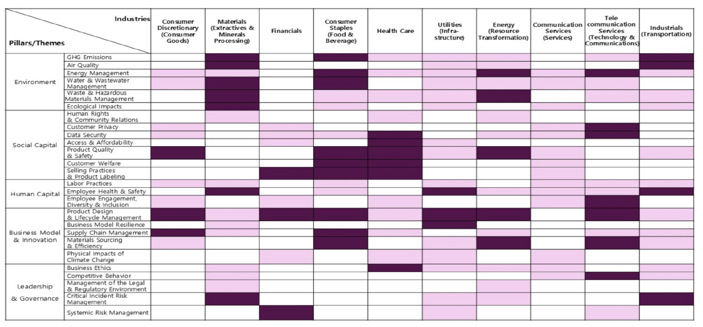
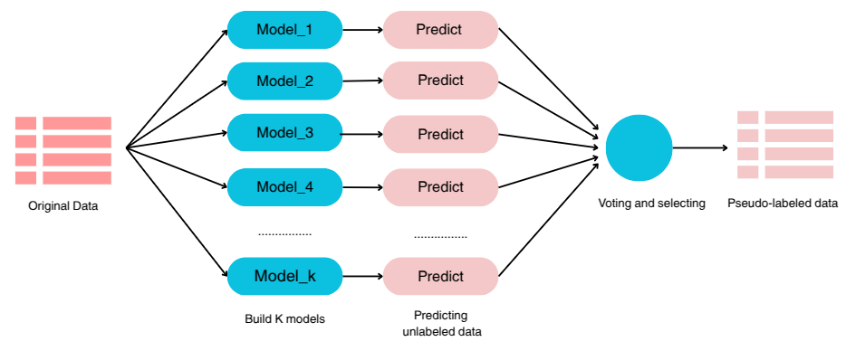
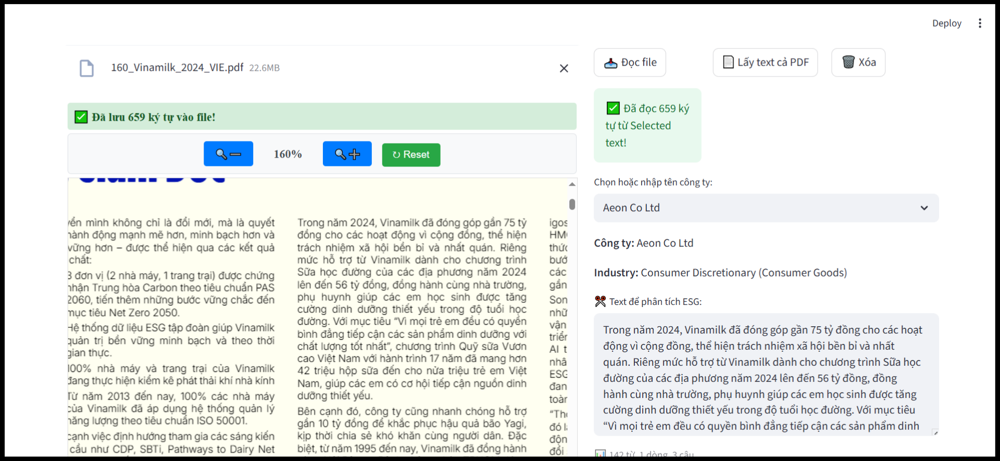
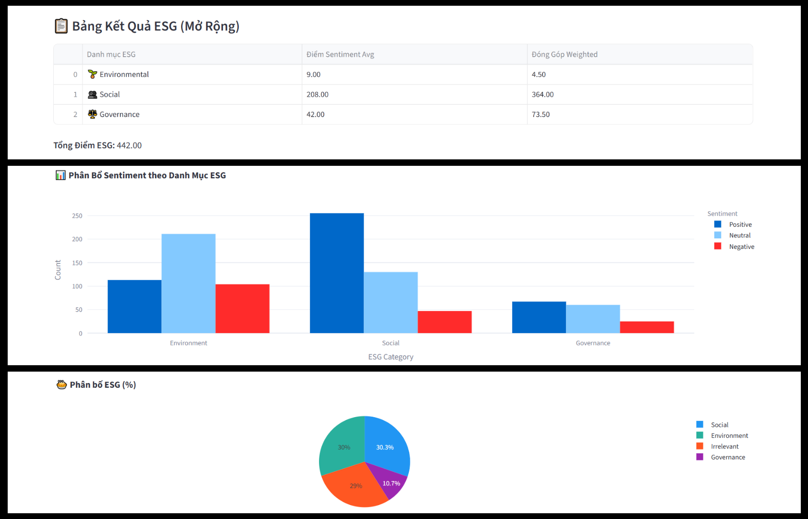
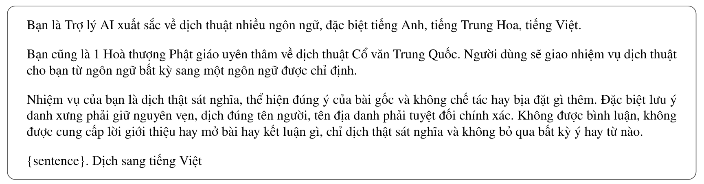

## Project Specification
The authors confirm their contribution to the thesis as follows:

**Tran Duc Trung**:

- Methodology

- Implementation.

- Data preparation.

- Paper research.

**Nguyen Van Manh**:

- Methodology.

- Implementation.

- Paper research.

- Data preparation.

**Nguyen Huu Duy Anh**:

- Software design.

- Implementation.

- Paper research.

- Data preparation.

**Do Kien Lam**:

- Software design.

- Implementation.

- Paper research.

- Data preparation.

**Abstract**

Environmental, Social, and Governance (ESG) factors have become critical indicators for assessing corporate sustainability and ethical practices. However, existing ESG evaluation systems often face issues such as inconsistent criteria and limited linguistic coverage, particularly for Vietnamese data. To address these challenges, we introduce a comprehensive framework for ESG text classification and scoring. We developed the ViEn-ESG dataset, a high-quality bilingual Vietnamese-English dataset with 130,798 pairs of sentences - labels, which we release publicly to foster further research. We fine-tuned a BERT-based model for ESG classification specifically tailored to Vietnamese financial and sustainability reports. Our models exhibit strong classification performance with an accuracy of 94.66% on the Vietnamese-only model, in the bililingual model archive 94.83% F1 score on the English language, and 91.94% on the Vietnamese. In addition to classification, we also implemented a robust scoring mechanism to compute ESG scores by aggregating sentiment signals within each ESG dimension, providing a more interpretable and quantitative assessment of corporate sustainability. Our results highlight the effectiveness of pre-trained language models in low-resource settings, and an integrated scoring mechanism, collectively offering new benchmarks and practical tools for ESG analytics in the Vietnamese market.
ESG, BERT, classification, machine learning

**Keywords:** ESG Classification, ESG Scoring, ESG Dataset.

## Introduction

Environmental, Social, and Governance (ESG) factors have gained significant attention as crucial indicators for assessing corporate sustainability, ethical impact, and long-term value creation [@Kiriu2020]. The rise of ESG as a fundamental framework for evaluating corporate performance reflects a paradigm shift in how stakeholders—including investors, regulators, consumers, and communities—assess business value beyond traditional financial metrics. This transformation has been driven by mounting evidence that companies with strong ESG practices demonstrate superior long-term financial performance, reduced operational risks, and enhanced stakeholder trust [@Aydomu2022].

Evaluating a company's ESG performance reveals insights into non-financial aspects of their operations and helps stakeholders understand their contributions to sustainable development [@ebert]. Environmental factors encompass a company's impact on natural resources, climate change mitigation efforts, pollution control measures, and commitment to circular economy principles. Social considerations include labor practices, community engagement, product safety, data protection, and diversity and inclusion initiatives. Governance aspects focus on board composition, executive compensation, anti-corruption measures, transparency in reporting, and stakeholder rights protection [@Berg2019]. The comprehensive assessment of these dimensions provides a holistic view of corporate responsibility and sustainable business practices.

The increasing need for objective and efficient evaluation of companies' ESG activities has highlighted significant limitations in traditional manual assessment methods. Manual analysis of extensive textual data like sustainability reports, annual filings, news articles, and regulatory documents is not only laborious and time-consuming but also susceptible to human error, subjective biases, and potential manipulation [@Luccioni2020]. The sheer volume of ESG-related information generated by corporations has grown exponentially, with sustainability reports now spanning hundreds of pages and containing complex, nuanced language that requires domain expertise to interpret accurately. Furthermore, differing evaluation criteria across various ESG rating agencies—such as MSCI, Sustainalytics, and Refinitiv—often lead to inconsistent and sometimes contradictory assessments of the same company, complicating objective judgment for investors and other stakeholders [@Billio2020,Lee2023].

Recent advances in NLP offer promising solutions to automate and standardize ESG evaluations, addressing both scalability and consistency challenges. The application of NLP techniques to ESG analysis represents a rapidly evolving field that encompasses multiple sophisticated tasks [@Avramov2022]. Researchers are leveraging NLP for automated ESG scoring systems that can process vast amounts of textual data in real-time, classify text into specific ESG categories with high granularity, identify and quantify ESG-related risks and opportunities, extract structured information from unstructured reports and news sources, detect emerging ESG issues from financial communications, and perform sentiment analysis on ESG-related disclosures [@sec-bert]. These applications extend beyond simple classification to include complex tasks such as ESG materiality assessment, impact measurement, and predictive modeling of ESG performance trends.

A significant focus in this research area involves leveraging powerful pre-trained language models (PLMs), particularly those based on the Transformer architecture such as BERT [@bert] and its variants including RoBERTa [@roberta], DistilBERT [@distilbert], Sentence-BERT [@sentence-bert], and domain-specific models like FinBERT and FinBERT-ESG [@finbert]. These models have demonstrated exceptional performance in understanding complex financial and sustainability language, capturing contextual nuances that are critical for accurate ESG assessment. However, despite their success, current approaches to ESG classification using these models typically rely on adding task-specific classification heads during fine-tuning, which introduces several methodological concerns that have not been adequately addressed in the literature.

However, existing ESG classification systems often struggle with multilingual applicability, particularly for emerging markets where ESG reporting is conducted in local languages. The majority of available ESG datasets and models are English-centric, creating significant barriers for comprehensive global ESG analysis. This limitation is particularly problematic for international investors and multinational corporations that need to assess ESG performance across diverse linguistic and cultural contexts. The lack of high-quality, annotated ESG datasets in languages other than English has been a persistent bottleneck in developing truly global ESG analysis capabilities.

In this thesis, we address this gap by introducing a comprehensive ESG classification pipeline tailored for the Vietnamese language. Our key contributions include:

1. We introduce **ViEn-ESG** dataset, a large-scale bilingual (Vietnamese–English) dataset comprising 130,798 sentence-level samples related to ESG, along with an additional subset of 6,430 sentiment-labeled sentences. To the best of our knowledge, this is the first publicly available resource of its kind, designed to advance research in Vietnamese ESG analysis.

2. We develop a state-of-the-art BERT-based model for ESG classification, fine-tuned on our dataset. This includes the first dedicated model for Vietnamese ESG classification, achieving strong performance in both English and Vietnamese, thereby demonstrating the effectiveness of pre-trained language models in low-resource, domain-specific settings.

3. We introduce a robust ESG scoring mechanism that aggregates sentiment signals across Environmental, Social, and Governance dimensions, offering an interpretable and quantitative approach to assessing corporate sustainability.

4. This thesis establishes a new benchmark for automated ESG classification in Vietnamese and provide practical tools to support ESG analysis for researchers, practitioners, and stakeholders.

## Related Work

### ESG Text Classification Approaches

The E-BERT model [@ebert], specifically trained based on Google's BERT architecture for ESG rating tasks, achieved a notable 93% accuracy in automating the evaluation process, aiming for precise and consistent outcomes. Other BERT-based models have shown strong results in tasks like classifying sentences as sustainable or unsustainable or identifying ESG issues. Furthermore, SEC-BERT finetune [@sec-bert-ft] developed a domain-adapted SEC-BERT [@sec-bert] model for detecting ESG-related issues from financial news, achieving improved performance through in-domain pre-fine-tuning. Their system classifies news into 33 ESG issue types and powers the ESG Issue Detector (EID) tool, enabling investors to identify ESG risks efficiently. The study also explored multilingual augmentation and LLM-based zero-shot baselines, finding domain-specific models to be significantly more effective.

ESG-KIBERT [@esg-kibert], a BERT-based model further pre-trained on ESG-specific corpora, which incorporates a hard attention mechanism to enhance ESG classification performance. The model achieved 99.72% accuracy on a four-class (E, S, G, None) task and was combined with sentiment analysis and industry-specific weighting using SASB’s materiality map to generate transparent, domain-aware ESG ratings.

ESGify [@esgify], an open-source NLP-based model built on MPNet [@mpnet] for multi-label ESG risk classification. Leveraging a manually annotated dataset of 14,000 sentences from ESG reports, the model achieved superior performance to GPT-3.5 using tailored data augmentation strategies such as back translation and LLM-generated examples.

Despite these advances, recent developments have also explored ESG performance assessment through machine learning approaches [@Jiang2024], where researchers have developed frameworks for evaluating corporate sustainability performance using advanced analytical techniques and structured datasets from Fortune 500 companies. The emergence of domain-specific ESG datasets has extended to specialized applications such as ESG rating explainability [@DelVitto2023], where researchers have developed annotated corpora specifically designed to understand and interpret ESG scoring methodologies through machine learning techniques.

### ESG Scoring and Evaluation Frameworks

The Rasch model [@Soares2024] proposed an innovative framework for ESG scoring by combining NLP with Item Response Theory (IRT). Using Portuguese news articles on Petrobras, the method extracted ESG-related sentiment and validated its psychometric robustness, offering more reliable temporal dynamics in ESG performance. Similarly, Patel et al. [@Patel2023] developed a systematic ESG scoring system by leveraging Social Network Analysis (SNA) and machine learning, highlighting how stakeholder networks and textual sentiment can be jointly modeled to produce more holistic and sustainable ESG ratings. Another study [@Zhang2023] provided a survey of sentiment-based ESG scoring methods, emphasizing that probability-based scoring with advanced deep learning models such as FinBERT offers greater sensitivity to nuanced language compared to ratio-based sentiment methods.

Building on these foundations, ESG-KIBERT [@esg-kibert] represents a paradigm shift in sentiment-driven ESG evaluation. The model extends BERT through pre-training on ESG-specific corpora and performs joint ESG classification and sentiment analysis at the sentence level. ESG-KIBERT further integrates SASB’s industry-specific materiality weights, ensuring that sentiment scores are not only linguistically accurate but also financially and sector-relevant. Empirical results show that it outperformed both ratio-based and evidence-based models, achieving 99.72% accuracy and strong alignment with MSCI benchmarks. Its transparent aggregation of sentiment polarity and sector-sensitive weights establishes it as a state-of-the-art method for ESG scoring.

### ESG-Specific Datasets and Resources

The development of specialized datasets for domain-specific NLP and AI applications has become increasingly important as researchers seek to address the unique challenges and requirements of various professional fields. While general-purpose datasets like OpenWebText [@openwebtext], Common Crawl [@commoncrawl], and The Pile [@thepile] have provided broad linguistic coverage for pre-training large language models, domain-specific applications require more targeted resources. In the biomedical domain, well-known examples include MIMIC-III [@mimic3] for clinical note analysis, PubMed[@pubmed] for biomedical literature mining, and BioASQ-QA [@bioasq-qa] for biomedical question answering. In the financial domain, datasets such as FiQA [@fiqa] for question answering and sentiment analysis in financial texts have enabled progress in specialized financial NLP. The computer vision community has benefited enormously from ImageNet [@imagenet], which has driven advances in image classification and transfer learning, while speech processing has advanced with corpora like LibriSpeech [@librispeech] for automatic speech recognition. These domain-specific resources have demonstrated the critical importance of targeted datasets in developing robust AI systems capable of understanding the nuanced language, visual information, and specialized terminology of professional and technical domains.

In the ESG domain, datasets are scarce. Early ESG datasets were predominantly English-centric and relatively small in scale. Schimanski et al. [@Tobias2024], developed three specialized 2,000-sentence datasets designed for precise ESG text classification. Another notable dataset was produced by [@esgminer], the authors gathered more than 450,000 headlines, with about 27,000 ESG-related headlines from the Twitter account of The Guardian. They then manually mapped relevant headlines to ESG aspects after examining the tags for ESG-relatedness.

Multilingual approaches have gained particular attention, such as ESG-Kor [@esgkor] represents a pioneering effort in multilingual ESG dataset development, providing a comprehensive Korean dataset comprising 118,946 sentences for ESG-related information extraction with manual annotations based on objective rules from ESG evaluation agencies. This dataset specifically targets the extraction of Environmental, Social, and Governance information from Korean companies' sustainability reports, addressing the critical gap in non-English ESG resources and demonstrating significant classification performance with Korean pre-trained language models. While multilingual ESG tasks are emerging, involving datasets in languages like Chinese [@Pontes2023], English [@chen-etal-2023-multi-lingual] and French, Japanese [@kao-etal-2024-imntpu], a significant portion of the existing research has focused primarily on English-language data. More recently, The ESG-Activities benchmark [@esgactive] introduces a novel approach to ESG text classification by focusing on fine-grained environmental activities comprising 1,325 labeled text segments as defined in the EU ESG taxonomy. This dataset uniquely combines manually curated data with synthetically generated examples to enhance model performance, demonstrating that fine-tuned smaller models can outperform larger proprietary solutions in specific ESG classification tasks.

The remainder of this thesis is organized as follows. In Section REF, we describe the methodology and present the selected language models used for ESG classification. Section REF introduces the ViEn-ESG dataset, detailing the data collection process, annotation methodology, and data analysis. In Section REF, we outline the model configuration, followed by a comprehensive evaluation of model performance across Vietnamese and multilingual ESG classification tasks. Section REF shows our demo for the ESG classification tool. Finally, Section REF concludes the thesis and discusses directions for future work.

## Methodology

Our approach leverages state-of-the-art Natural Language Processing (NLP) techniques, specifically fine-tuning a pre-trained transformer-based language model, to address the task of ESG classification in the Vietnamese language. ESG factors are considered crucial indicators for assessing corporate sustainability and value creation, and NLP has emerged as a valuable tool for analyzing related textual data. Given the identified challenge of limited comprehensive, labeled ESG datasets, particularly for low-resource languages like Vietnamese, our methodology focuses on building a robust classification system supported by a newly constructed large-scale dataset.

### ESG Classification using BERT-based Models

BERT [@bert] is an advanced language model used in many NLP tasks, first introduced in the paper “BERT: Pre-training of Deep Bidirectional Transformers for Language Understanding”. The power of BERT comes from several factors. First, BERT has a compact size, with only 110 million parameters. Second, the neural network is purposefully designed to capture complex relationships between words and sentences. BERT is an encoder model based on the Transformer [@transformer] architecture — with the self-attention mechanism at its core — designed to create contextual representations for words or sentences. With its bidirectional nature, BERT excels at understanding the overall semantics of a sentence, making it very suitable for tasks such as ESG information classification. Third, BERT was pretrained on large text datasets including BookCorpus and English Wikipedia, enabling the model to learn both word and sentence representations and facilitating transfer learning.

BERT is a transfer learning framework, and its use typically involves two stages: pretraining and fine-tuning. Many BERT models have been pretrained on different unlabeled text datasets. These models can then be applied directly to a variety of tasks: text classification, named entity recognition (NER), question answering, or sentiment classification. After the original BERT was introduced, several improved models, such as RoBERTa [@roberta], ALBERT [@albert], DistilBERT [@distilbert], were developed based on BERT’s architecture, achieving higher performance through slight modifications to model design or pretraining hyperparameters. These pretrained models are publicly available to the research community and can be further fine-tuned for specific language tasks.

We experiment with a suite of BERT-based models, each fine-tuned specifically for ESG classification. These models are based on established architectures known for their success in a range of NLP classification tasks. Our goal is to evaluate the effectiveness of different model bases in the Vietnamese ESG context.

The standard approach to classification tasks using BERT-based models involves a structured fine-tuning process that follows a multi-stage pipeline that transforms input text into classification predictions through dedicated task-specific components.

Consider an input sentence $X = {x_1, x_2, , x_n}$ of length $n$. The classification pipeline can be formally represented through the following sequential transformations.

{ Input Embedding:}
The input sentence undergoes an initial embedding transformation that converts discrete tokens into dense vector representations:

$$
H_0 = {Embedding}(X)
$$

Where $H_0  {R}^{n  d}$ represents the initial token embeddings with dimensionality $d$, including special tokens like [CLS] and [SEP] that provide structural information to the model.

{ Transformer Encoding:}
The embedded input passes through multiple transformer layers, where each layer applies self-attention and feed-forward transformations:

$$
H_L = {Transformer}_L(H_{L-1}),  L = 1, 2, , M
$$

Where $M$ is the total number of transformer layers, and $H_L  {R}^{n  d}$ represents the contextualized hidden states after the $L$-th layer. Each transformer layer captures increasingly complex linguistic patterns and dependencies.

{ Classification Head:}
The final classification is performed using a dedicated linear classification head that operates on the [CLS] token representation:

$$
{y} = {Softmax}(W_c  H_M[0] + b_c)
$$

Where $H_M[0]  {R}^{d}$ is the [CLS] token representation after the final transformer layer, $W_c  {R}^{|{Y}|  d}$ is the classification weight matrix, $b_c  {R}^{|{Y}|}$ is the classification bias vector, ${Y} = {E, S, G, N}$ is the set of ESG classification labels and ${y}  {R}^{|{Y}|}$ represents the predicted class probability distribution.

{ Training Objective:}
The model parameters are optimized to minimize the cross-entropy loss between predicted and true labels:

$$
{L}_{{CE}} = -{i=1}^{|{Y}|} y_i ({y}_i)
$$

Where ${L}_{{CE}}$ is the Cross-entropy loss function, $y_i$ is the true label, $y  {0,1,2,3}^{|{Y}|}$ is the encoded true label vector.

### Scoring System

The dataset was constructed to support the ESG sentiment classification in Vietnamese. Each sample in the dataset consists of a Vietnamese text segment and labels corresponding to that domain, representing negative, neutral, or positive sentiment (e.g., Environmental Negative, Environmental Neutral, Environmental Positive).

To enhance analysis effectiveness and ensure accuracy during training, we divided the initial dataset into three subsets, each representing a distinct thematic class: E (Environment), S (Social), and G (Governance). After the partitioning, we trained separate models for each class to clearly distinguish between sentiments (negative, neutral, and positive) within the corresponding data. This partitioning approach allows the models to focus on and learn the unique characteristics of each class, thereby improving the accuracy and effectiveness of the analysis process. We believe that this method not only enhances the performance of the models but also increases the reliability and precision in sentiment classification for each class.

#### Scoring Model Architecture

We fine-tuned a pre-trained transformer-based language model specialized for Vietnamese text. For each ESG domain, a separate multi-label classification model was constructed, taking the preprocessed input and predicting outputs corresponding to the negative, neutral, and positive sentiment classes. The model architecture includes a standard BERT backbone followed by a dense output layer for multi-label prediction. To address class imbalance, we employed the Binary Cross-Entropy loss with optional class weights. Similar to ESG classification, due to the characteristics of the Vietnamese language, spaces are not used to separate words in compound words. We continue to use ViTokenizer in Pyvi to analyze the input text string and accurately determine word boundaries.

The initial training phase involved fine-tuning the pre-trained model exclusively on the labeled dataset of the chosen ESG domain. Hyperparameters, including learning rate, batch size, and the number of epochs were optimized through experiments and practical tuning to balance convergence and overfitting risks. Early stopping mechanisms were implemented by monitoring validation loss and macro-F1 scores on the held-out validation set.

Performance metrics included precision, recall, and F1-score for each sentiment class, as well as macro, micro, and weighted averages to provide a comprehensive assessment. The impact of pseudo-labeled data was analyzed both quantitatively (through metrics) and qualitatively (via inspection of high-confidence pseudo predictions). All experiment metadata, including label splits, training logs, and detailed results, were archived to ensure reproducibility.

#### ESG Score Computation and Evaluation

Based on the method proposed in ESG-KIBERT [@esg-kibert], we have adopted the ESG scoring method based on industry-specific weights and sentiment analysis. The sentiment model classifies each sentence into three emotional categories: positive, neutral, or negative, according to E, S, and G. Sentiment scores are assigned as +1 (positive), 0 (neutral), and -1 (negative), creating a clear and balanced scale.

We apply this method because SASB was chosen over other frameworks like GRI and the Task Force on Climate-related Financial Disclosures (TCFD) due to its industry-specific approach, which allows for more precise customization of ESG weightings. Furthermore, the authors aligned SASB’s industry classifications with MSCI’s sector framework to establish a coherent analytical structure that meets financial market demands. This approach emphasizes the significance of ESG factors specific to each industry, thereby enhancing the reliability of the evaluation process.

The materiality map, illustrated in Figure REF, depicts industry sectors with varying ESG relevance. Dark shading represents sectors linked to over 50% of industries, while light shading indicates those linked to fewer than 50%. The authors derived quantitative values to enhance the consistency and intuitiveness of ESG evaluations. Weightings were assigned according to shading intensity: 0.25 for light purple, representing the median of the less than 50% importance range, and 0.75 for dark purple, representing the median of the greater than 50% importance range. The total weight for each industry was determined by summing the weighted counts within each pillar. The Environment pillar was categorized as "E", Social Capital and Human Capital were grouped under "S", and Business Model \& Innovation along with Leadership \& Governance were classified as "G".

$$
ESG_{{company}} =
W_E  {i=1}^{N_E} S_{E,i}
+ W_S  {j=1}^{N_S} S_{S,j}
+ W_G  {k=1}^{N_G} S_{G,k}
$$

Where $W_E, W_S, W_G$ represent the industry-specific weight for E, S, G to which the specific company belongs and $S_{E,i}, S_{S,j}, S_{G,k}$ refer to sentiment scores assigned to each sentence labeled as E, S, G, respectively. Based on the formula provided by the authors in the paper, we have also applied the formula for calculating the ESG rating based on industry-specific weights and sentiment analysis.

### Model Selection

We experiment with a suite of BERT-based models, each fine-tuned specifically for ESG classification. These models are based on established architectures known for their success in a range of NLP classification tasks. Our goal is to evaluate the effectiveness of different model bases in the Vietnamese ESG context.

The selection of BERT-based models as the foundation for our classifiers stems from their proven effectiveness across a wide spectrum of NLP tasks, including text classification, information extraction, and sentiment analysis. The Transformer architecture, upon which BERT and its variants are built, excels at capturing long-range dependencies and contextual relationships within text, which is crucial for understanding the often subtle and complex language used in ESG disclosures.

We use a pretrained model trained on large-scale datasets to develop the ESG classifier for Vietnamese ESG model. We employed PhoBERT [@phobert], along with experiments using other Vietnamese language models such as ViSoBERT [@visobert], viBERT [@velectra] and vELECTRA [@velectra].

**Model selected in our experiment**

| ---
    { Backbone} | { # Param} | { Data Training Source} |
| --- | --- | --- |
| ---
    {PhoBERT (2020)} | 135M | Vietnamese Wikipedia (1GB), |
| Vietnamese news (19GB) |
| ---
    {ViSoBERT (2023)} | 97M | Vietnamese social networks comment |
| (Facebook, TikTok, Youtube) |
| ---
    {vELECTRA (2020)} | 110M | NewsCorpus, OscarCorpus (58.4 GB) |
| ---
    {viBERT (2020)} | 115M | 10GB subset data of vELECTRA |
| ---
    BERT-base-multilingual-uncased/cased |
| (2017) | 168/179M | BookCorpus, |
| 104 languages of Wikipedia |
| ---
    DistilBERT-base-multilingual-cased |
| (2019) | 168M | BookCorpus, |
| 104 languages of Wikipedia |
| ---
    RoBERTa-base |
| XML-RoBERTa-base (2019) | 124/279M | BookCorpus, Wikipedia, OpenWebText, |
| Stories, CC-News(160GB) |
| ---
    {DeBERTa-v3-small/base (2022)} | 141/184M | BookCorpus, Wikipedia, OpenWebText, |
| Stories (78GB) |
| ---
    {FinBERT (2022)} | 109M | Fine-tuning BERT on TRC2-financial |
| --- |

For multi-language model setting, we specifically chose to experiment with a suite of models, including BERT-base-cased, BERT-base-uncased, RoBERTa-base, XLM-RoBERTa-base, DeBERTa-v3-base, DeBERTa-v3-small, FinBERT and DistilBERT-base-cased, to provide a comparative analysis. This allows us to assess not only the general applicability of transformer models but also the relative strengths of different architectural variations and pre-training strategies when applied to the specific domain of Vietnamese ESG text. The decision to fine-tune these models, rather than training from scratch, is motivated by the need to leverage the extensive linguistic knowledge already encoded within them, thereby mitigating the data requirements and computational costs associated with training large models on a limited domain-specific dataset.
Models detailed in Table REF.

## Dataset

In this section, we present the datasets used for developing and evaluating our ESG classification models. Effective domain-specific text classification requires high-quality labeled data that captures the linguistic characteristics and thematic diversity of the target domain. We systematically collected ESG-related content from corporate sustainability reports and financial news sources, followed by comprehensive preprocessing, manual annotation and many annotation techniques to create reliable ground truth labels for training and evaluation purposes. Our dataset can access at [https://huggingface.co/datasets/nguyen599/ViEn-ESG-100](https://huggingface.co/datasets/nguyen599/ViEn-ESG-100).

**Overview of datasets utilized for ESG classification and sentiment analysis.**

| ---
    { Data type} | { Language} | { No. Sentence} | { Source} | { Labeling techique} |
| --- | --- | --- | --- | --- |
| ---
    ESG |
| classification | {English} | 45,942 | Corporate Reports, |
| News | {Manual label} |
| ---

    ESG |
| classification | {Vietnamese} | 60,222 | Corporate Reports, |
| News | {Manual label} |
| ---

    ESG |
| classification | {Vietnamese} | 14,634 | Corporate Reports, |
| News | {Pseudo label} |
| ---

    ESG |
| classification | {Vietnamese} | 10,000 | English data | {Translate} |
| ---
    ESG |
| sentiment | {Vietnamese} | 6,430 | Corporate Reports | {Manual} |
| --- |

### Dataset Description

A cornerstone of this research is the development and utilization of the { ViEn-ESG dataset}, a novel, large-scale, bilingual corpus specifically curated for ESG classification tasks in the English and Vietnamese languages. The creation of this dataset was motivated by the significant scarcity of publicly available, high-quality labeled data for ESG analysis, particularly for low-resource languages such as Vietnamese. Addressing this gap is crucial for advancing NLP applications in sustainable finance and corporate responsibility assessment within emerging markets. ViEn-ESG comprises a total of 130,798 sentence-level samples, meticulously collected and annotated to serve as a robust foundation for training and evaluating ESG classification models. In addition, we selected a subset of 6,430 sentences in the ViEn-ESG dataset and created a segment label that includes Negative, Neutral, or Positive sentiment to capture sentiment signals associated with ESG-related statements. This sentiment-labeled subset plays a critical role in training the sentiment analysis component of our framework, which is later integrated into the ESG scoring mechanism. By leveraging these sentiment annotations, we enable the model to compute fine-grained ESG scores by aggregating sentiment distributions across the Environmental, Social, and Governance dimensions. This design ensures that the scoring process is both interpretable and quantitatively grounded, providing a practical tool for assessing corporate sustainability beyond categorical classification.

### Data Collection

Corporate sustainability reports represent comprehensive disclosures of organizational performance across environmental, social, and governance dimensions, serving as primary vehicles for communicating non-financial achievements and ESG commitments to diverse stakeholder groups. These documents have gained prominence as regulatory frameworks increasingly mandate ESG transparency and investors demand greater accountability regarding sustainable business practices [@Agbakwuru2024]. The growing emphasis on ESG disclosure has led companies across various industries to publish detailed sustainability reports that document their environmental stewardship, social responsibility initiatives, and governance structures.

The ViEn-ESG dataset draws from two primary data sources: ESG news articles and official corporate sustainability disclosures. For news articles content, we systematically gathered ESG-focused articles published between January 1, 2015, and August 14, 2024, sourcing English-language content from ESGToday and Vietnamese articles from reputable news sites such as VnExpress and Vietnam News. To ensure thematic relevance, we selected articles that were explicitly tagged with "ESG" or categorized under ESG-related sections, guaranteeing that all collected content directly addressed environmental, social, or governance themes.

The corporate disclosure component involved a collection of sustainability reports from major Vietnamese enterprises listed in the Ho Chi Minh Stock Exchange (HOSE)[@hose] and Hanoi Stock Exchange (HNX)[@hnx], with English reports collected from Standard and Poor's 500 (S\&P 500) companies across ten key economic sectors, including technology, retail, consumer goods, health care, automotive, aviation, electronics, communication services, finance, and heavy industry, with publication dates spanning from 2012 to 2024 to capture evolving ESG practices and reporting standards over more than a decade.

### Data Preprocessing

We collected 348 sustainability reports, extracted 65,103 curated textual segments. With the news dataset, we collected a total of 68,553 sentences, the comprehensive dataset reached 130,798 textual entries, providing extensive coverage of ESG-related corporate communications across multiple formats and contexts. The collected sustainability reports, predominantly distributed in PDF format, contained much unstructured content. We decided to keep only text and drop tabular and visual elements such as images or charts. An overview of the distribution of sustainability reports by category and language is illustrated in Figure~REF, highlighting the diversity of sectors and the bilingual nature of the collected data.

In the preprocessing step, we utilized the spaCy [@spacy] natural language processing library to perform sentence-level segmentation of the extracted textual content, enabling precise annotation at the sentence granularity level. The preprocessing pipeline incorporated several data normalization procedures including standardization of numerical formats, systematic removal of non-textual characters and symbols, and elimination of duplicate sentences. Post-processing measures included a comprehensive manual review to identify and correct automatic segmentation errors, inappropriate sentence boundaries, and content fragments that were either excessively brief or excessively long, with problematic segments being either manually corrected through proper segmentation or removed entirely from the dataset.

### Annotation Methodology and Quality Assurance

#### Manual Labeling

The development of our ESG classification system required establishing a robust theoretical foundation grounded in internationally recognized ESG evaluation standards.  We drew upon the methodological frameworks employed by prominent global ESG rating organizations, such as Morgan Stanley Capital International (MSCI), Sustainalytics, and the Carbon Disclosure Project (CDP). Labeling pipeline shown in the Figure REF, a team of four domain experts, each possessing specialized knowledge in ESG assessment methodologies and familiar with the evaluation standards of these institutions, collaboratively developed and refined our annotation guidelines through iterative discussion and consensus-building processes. The labeling rules for ESG classification are detailed in Table REF. In the Table REF, we show labeling rules for ESG sentiment.

**Labeling rules for the ViEn-ESG dataset**

| l}

    { Class} | { Rule} |
| --- | --- |
| ---
    {E} | Environmental factors include the reduction of hazardous substances, eco-friendly |
| management, climate change, carbon emission, natural resources, pollution and waste, |
| environmental performance, resource use, product innovation, and energy conservation. |
| ---
    {S} | Social factors include human capital, product responsibilities, workers, working |
| environment, partners and competitors, consumers, community contribution, human |
| rights, gender and diversity, labor standards, customer satisfaction, information |
| protection, and privacy. |
| ---
    {G} | Governance factors include corporate behavior, shareholder rights, board of directors, |
| auditing bodies, disclosures, stakeholders, CSR strategy, executive dividends, ethical |
| management, laws and taxes. |
| ---
    {N} | Neutral contains ESG information as a neutral element, excluded from the environmental, |
| social, and governance categories, or includes two categories of in one sentence, such as |
| environmental, social, or social, governance. |

**Labeling rules for the sentiment dataset.**

| l}

    { Class} | { Rule} |
| --- | --- |
| ---
    {Environment} |  Positive: Sustainable practices, green innovations, renewable energy, carbon reduction. |
|  Neutral: Descriptive or factual reporting without clear evaluative tone. |
|  Negative: Environmental violations, pollution, unsustainable activities, deforestation. |
| ---
    {Social} |  Positive: Initiatives improving social well-being, equity, diversity, community support. |
|  Neutral: Objective descriptions or informational reporting on social issues. |
|  Negative: Labor disputes, discrimination, social harm, human rights violations. |
| ---
    {Governance} |  Positive: Strong leadership, transparent policies, effective governance, compliance with |
| regulations. |
|  Neutral: Factual updates on governance practices without clear sentiment. |
|  Negative: Scandals, corruption, fraud, governance failures, lack of transparency. |

To ensure the highest quality and reliability of our dataset annotations, we implemented a rigorous two-stage labeling methodology involving four annotators who were thoroughly trained on the ESG classification guidelines and possessed extensive domain knowledge. During the initial phase, annotators independently classified sentences that exhibited clear categorical distinctions, focusing on unambiguous examples that could be readily assigned to Environmental, Social, Governance, or Non-ESG categories. The second phase involved collaborative deliberation sessions where annotators engaged in structured discussions to resolve challenging cases that presented classification ambiguities or overlapping characteristics across multiple ESG dimensions. To maintain stringent quality control standards, we established a consensus-based decision framework whereby sentences were included in the final dataset only when all four annotators reached unanimous agreement, thereby ensuring robust inter-annotator reliability while minimizing subjective bias.

**Cohen's Kappa coefficients measuring inter-annotator agreement across ESG categories and languages in the ViEn-ESG dataset.**

| **Category** | **English** | **Vietnamese** | **All** |
| --- | --- | --- | --- |
| ---
Environment | 0.987 | 0.979 | 0.983 |
| Social | 0.984 | 0.982 | 0.983 |
| Governance | 0.990 | 0.989 | 0.989 |
| Neural | 0.984 | 0.974 | 0.979 |
| ---
All | 0.986 | 0.981 | 0.984 |

Another cases were systematically excluded from the dataset to preserve annotation quality, resulting in the removal of less than 0.2% of the total sentences due to persistent disagreement among annotators. Our the inter-annotator agreement was quantitatively assessed using Cohen's kappa coefficient [@Cohen1960], which demonstrated exceptionally high consensus levels across all categories and languages, with scores ranging from 0.974 to 0.990 as detailed in Table REF, indicating almost perfect agreement according to established interpretation guidelines and validating the consistency and reliability of our annotation process.

**Sample labeled data in the ViEn-ESG dataset.**

| l}

    { Class} | { Rule} |
| --- | --- |
| ---
    {E} |   Known reserves of oil, gas and coal can be extracted for some decades into the future, in a |
| cost-efficient manner using current technologies, at current energy prices. |
|   this notably good development consequence 25% decrease waste api processes fermion. |
|   Greenhouse gas emissions were down meet the reduction target (15% below fiscal 2013 level). |
| ---
    {S} |   Economies need educated and skilled workforces to ensure their economic health. |
|   One of the focuses of Servicio País is to revive public spaces near schools and neighborhoods |
| in order to improve the quality of life of residents. |
|   Moreover, onsite healthcare opportunities for employees are included in this program, |
| including access to a blood pressure machine, a mammography van, blood drives, a flu shot |
| clinic, biometric screening and an annual onsite visit from a wellness doctor. |
| ---
    {G} |   Senior management reviews engagement system results annually. |
|   The Audit Committee provides oversight with respect to financial reporting and legal risk. |
|   The system of internal accounting control is supported by written policies and guidelines, |
| the selection and training of qualified employees, an organizational structure that provides |
| an appropriate division of responsibility and a program of internal auditing. |
| ---
    {N} |   About Evercomm Evercomm is a software company supporting businesses to net zero. |
|   As of the date of this filing, we are not aware of any matters that are required to be disclosed |
| pursuant to this standard. |
|   An increase of $due to industry-wide price escalation and normal-course salary increases |
| for on-site property management personnel. |

The labeling schedule of four annotators involved two-hour daily sessions conducted five days per week, with annotators achieving a productivity rate of 600-700 sentences per hour, translating to approximately 7,000 sentences labeled per annotator per week. The comprehensive annotation timeline spanned approximately 3-4 months, with the initial three months period dedicated to processing clearly classifiable sentences, followed by an additional month of intensive phase focused on collaborative discussion and resolution of challenging cases, ensuring thorough coverage and meticulous attention to quality throughout the entire dataset construction process.

This methodologically rigorous manual labeling approach, which mirrors best practices established in other domain-specific dataset creation studies, guarantees high-quality supervised data that accurately reflects ESG principles and linguistic nuances across both English and Vietnamese contexts, ultimately providing a solid foundation for training robust and reliable ESG classification models, with representative examples of sentences from each class in the ViEn-ESG dataset presented in Table REF. In Table~REF, we show the class-wise distribution of the ViEn-ESG dataset.

**Class-wise distribution of ViEn-ESG Dataset.**

| { Data} | {} | { No. of Sentences} | { Total} |
| --- | --- | --- | --- |
| ---
    {} | {English} | {Vietnamese} | {} |
| ---
    {Environment} | 10,517 | 19,080 | 29,597 |
| {Social} | 11,112 | 25,201 | 36,313 |
| {Government} | 9,103 | 18,046 | 27,149 |
| {Neural} | 15,210 | 22,529 | 37,739 |
| ---
    {Total} | 45,942 | 84,856 | 130,798 |

#### Pseudo-labeling for Data Enrichment

We also apply pseudo-labeling for data enrichment. The model initially trained on labeled data was used to generate probabilistic predictions for an external corpus of unlabeled texts. Only samples for which the model assigned a highest class probability exceeding a predefined confidence threshold of 0.94 were retained. For each retained text, pseudo-labels were assigned to the corresponding classes based on these confidence scores. This process optionally employed an iterative scheme, gradually adjusting the threshold across multiple rounds to maximize both the quantity and quality of automatically labeled samples.

The resulting pseudo-labeled data was then combined with the original training set. The model was then retrained on this composite dataset, leveraging both human-annotated and high-confidence machine-labeled samples.

In traditional pseudo-labeling methods, using a single model to predict labels for unlabeled data often carries significant risks. Specifically, if the model has high bias or suffers from overfitting on the initial training set, the pseudo-labels generated may contain systematic errors. These errors can accumulate when incorrectly labeled data is fed back into the training set, leading to a phenomenon known as confirmation bias—where the model increasingly reinforces its incorrect predictions.

To minimize problems due to pseudo-labeling, we propose a method that integrates ensemble learning into the pseudo-labeling process. This semi-supervised labeling approach leverages an ensemble of multiple BERT models. First, the labeled training data is used to train K independent BERT models, each trained on a different subset of the original data. After the training process is complete, all of these BERT models simultaneously predict labels for the unlabeled data. The predicted labels from these models are then aggregated using a voting mechanism, where the labels with the highest confidence are selected as the pseudo-labels. Specifically, labels that receive high consensus among the models are prioritized. Finally, the data with these pseudo-labels is added back into the training set, thereby improving the model's quality by effectively utilizing both labeled and unlabeled data. From the original train dataset of 27,366 sentences, we generated an additional 14,634 sentences using the unlabeled data by pseudo-labeling. This approach takes advantage of the power of BERT models to minimize the risk of mislabeling, reduce confirmation bias, and enhance the stability of the expanded label set.

The selected models include both multilingual and Vietnamese-optimized transformers: DistilBERT-base-multilingual, ViSoBERT, Vi-Electra, BERT-base-multilingual, PhoBERT, ViDeBERTa, RoBERTa-base. Each training iteration utilizes pseudo-data generated from the previous round to supplement the original training dataset, creating an iterative improvement process.

{*1) First Iteration:* In the initial iteration, models were trained on the 7 subset dataset of the original data and demonstrated promising baseline performance. DistilBERT-base-multilingual achieved the highest performance with 87.36% accuracy, followed by ViSoBERT at 87.23% and Vi-Electra at 86.86%.

The first iteration generated substantial pseudo-data with 8,830 samples for Environment, 7,667 for Social, 6,300 for Governance, and 2,974 for Irrelevant classes. To ensure dataset balance, we adjusted the pseudo-data quantities used, resulting in a total of 37,636 samples for the subsequent iteration with the following distribution: Irrelevant (8,877 total: 5,903 original + 2,974 pseudo), Environment (9,009 total: 4,384 original + 4,625 pseudo), Social (10,726 total: 10,026 original + 700 pseudo), and Governance (9,024 total: 7,053 original + 1,971 pseudo).

{*2) Second Iteration:* The second iteration showed significant performance improvements across all models. Vi-Electra achieved the best overall performance with 92.13% accuracy, accompanied by impressive F1 scores across all classes. ViSoBERT and ViDeBERTa also demonstrated strong performance with accuracies of 91.33% and 91.13%, respectively.

The second iteration generated 8,255 new pseudo-data samples, with Environment contributing 4,212 samples, Social 1,915 samples, Governance 1,548 samples, and Irrelevant 580 samples. After data balancing, the total sample count for the final iteration reached 42,000 samples with the following distribution: Irrelevant (11,077 total: 8,877 original + 2,200 pseudo), Environment (10,009 total: 9,009 original + 1,000 pseudo), Social (11,310 total: 10,726 original + 584 pseudo), and Governance (9,604 total: 9,024 original + 580 pseudo).

{*3) Third Iteration:* The final iteration marked the peak performance of our research. Vi-Electra continued to lead with 94.66% accuracy, followed by BERT-base-multilingual at 94.36% and ViSoBERT at 93.83%. Notably, all models achieved accuracy above 91%, demonstrating the stability and effectiveness of the pseudo-labeling methodology.

The research results demonstrate a consistent improvement trend across pseudo-labeling iterations. The average accuracy of models increased from 85.75% in the first iteration to 90.82% in the second iteration, reaching a peak of 93.47% in the final iteration. Particularly, Vi-Electra showed consistent superiority across all three iterations, indicating excellent adaptability to Vietnamese text data.

The Environment class consistently achieved the highest F1 scores across all models, while the Irrelevant class presented the most classification challenges. This can be attributed to the diverse and ambiguous nature of the Irrelevant class compared to the more specialized domain-specific classes.
The pseudo-labeling approach proved particularly effective in enriching data and addressing class imbalance issues. By strategically selecting pseudo-labeled samples, we were able to maintain better class distribution while progressively increasing the dataset size, contributing to the observed performance improvements.

#### Annotation through Machine Translation

To expand the coverage of our Vietnamese dataset, we adopted a translation-based labeling strategy that leverages existing high-quality English data. Specifically, we selected 10,000 English sentences that had already been annotated with gold-standard labels. These sentences were then translated into Vietnamese using the `erax-ai/EraX-Translator-V1.0` model [@erax], a neural machine translation system that has been shown to achieve strong performance on English-Vietnamese translation tasks. By preserving the semantic structure of the original sentences, this approach allows us to inherit the English labels and directly assign them to their translated Vietnamese counterparts.

The main advantage of this method is that it enables rapid and cost-efficient creation of labeled data in a low-resource language setting, without the need for extensive manual annotation. Furthermore, because the labels are derived from semantically equivalent English sentences, this process ensures alignment across languages and facilitates the development of cross-lingual benchmarks. To mitigate the risk of translation errors, we applied post-translation validation by sampling a subset of the Vietnamese outputs and verifying whether the translated sentence preserved the original meaning and label consistency. In practice, we observed that label preservation remained reliable for well-structured sentences, though some minor noise could occur due to idiomatic expressions or domain-specific terminology.

Despite these limitations, translation-based labeling serves as an effective intermediate solution between manual annotation and pseudo-labeling. It provides a scalable mechanism to enrich the dataset with diverse Vietnamese examples while maintaining semantic fidelity to the original English data. The resulting bilingual resource not only strengthens the robustness of our model training but also contributes toward the long-term goal of building more inclusive ESG datasets that support multilingual applications.  The detailed prompt used to guide the translation process is provided in the Appendix REF.

## Experiments and Analysis

This section details the experimental design and results of our proposed ESG classification model. We outline the implementation settings, including hardware specifications, training configurations, and evaluation protocols. Subsequently, we present a comprehensive performance analysis on both English and Vietnamese subsets of the ViEn-ESG dataset, along with an assessment of the bilingual models and the ESG scoring mechanism.

### Experimental Setup and Implementation Details

To comprehensively address the ESG classification task, we adopted a multi-faceted modeling strategy, training four distinct types of classifiers based on the fine-tuned BERT architecture. Three binary classifiers were developed, each dedicated to identifying the relevance of a sentence to one specific ESG pillar: Environmental (E), Social (S), or Governance (G). This binary approach allows for focused assessment within each dimension and aligns with methodologies used in prior literature for relevance or impact identification. Complementing these, we developed a multi-class classifier, termed ViBERT-ESG (and its variants based on other backbones), designed to categorize a sentence into one of four mutually exclusive classes: E, S, G, or Neutral (N). The Neutral class serves as a crucial catch-all category for sentences that are either irrelevant to ESG or potentially span multiple dimensions ambiguously. This four-class model provides a holistic classification across the primary ESG pillars.

{*1) Implementation Details:* The experiments were conducted with the following specifications. For all work, the authors utilize an Intel Core i7–13700 processor, 48 GB of RAM, and 2 RTX 3060 GPUs for training, testing, and evaluation of the models. The dataset was split into 70% training, 15% validation, and 15% test data. Key hyperparameters were kept consistent across models to ensure fair comparison, based on common practices for fine-tuning BERT-like models. The training process employs full-parameter fine-tuning with DeepSpeed ZeRO-3 optimization [@deepspeed-zero3]. All models are trained with BFloat16 precision for 3000 steps, including 200 warm-up steps. We use a learning rate of $5  10^{-5}$ with cosine learning rate scheduling, weight decay of 0.01, a batch size of 48 and a maximum gradient norm of 2.5. The optimizer is AdamW [@adamw], and the maximum input sequence length is set to 512 tokens. For reproducibility, we set the random seed to 42 in all experiments.}

*2) Evaluation Metrics:* In our experimental setup, we primarily report the macro-averaged F1 score ($F1_{{macro}}$) as it provides a balanced view of performance across classes with varying frequencies. We also include accuracy as a complementary metric to capture the overall correctness of the prediction. This combination ensures that both class-level balance and overall classification performance are properly assessed.

$$
F1_{{macro}} = {{i=0}^{N} F1_i}{N}
$$

where $F1_i$ denotes the F1-score of class $i$, and $N$ is the total number of classes. We report macro-F1 as the primary metric since it equally weights all classes, making it particularly suitable for imbalanced ESG datasets. In addition, we also provide accuracy to offer a more comprehensive view of model performance.

### Performance on Vietnamese ESG Classification

We applied a fine-tuning method to the model using sentence and ESG label pairs, utilizing a pretrained language model. In the experiment, we used multilingual BERT models, the multilingual version of BERT, and Vietnamese models such as PhoBert-Base, PhoBert-Large, viBert, viELECTRA, and ViSoBERT.

The results of multi-class classification for ESG-related sentences with 4 labels in the ESG dataset are presented in Table REF. In the experiment, each model was trained 5 times, and the average accuracy and accuracy for each class were calculated by excluding the highest and lowest accuracy values.

**Comparison of Transformer-based models for Vietnamese language**

| **Model** | **Overall |
| --- | --- |
| accuracy** | **Env |
| F1 score** | **Gov |
| F1 score** | **Soc |
| F1 score** | **Neu |
| F1 score** |
| ---
**viDEBERTA** | 93.1 | 97.15 | 91.17 | 92.22 | 89.1 |
| **viELECTRA** | 94.66 | 98.30 | 93.13 | 94.36 | 92.09 |
| **PhoBERT-Base** | 93.7 | 97.42 | 92.29 | 93.25 | 91.04 |
| **ViSoBERT** | 93.83 | 97.83 | 91.94 | 92.94 | 91.93 |
| **BERT-Base-Multilingual** | 94.36 | 97.61 | 93.49 | 94.49 | 90.95 |
| **RoBERTa** | 91.8 | 96.92 | 90.12 | 92.08 | 86.79 |
| **DistilBERT-Multilingual** | 93.86 | 98.01 | 92.13 | 94.03 | 90.43 |

The comparative analysis of Transformer-based models for Vietnamese language processing reveals viELECTRA as the top-performing model, achieving superior results across all evaluation metrics. With an overall accuracy of 94.66%, viELECTRA demonstrates exceptional performance in all classification categories: Environment (98.30% F1), Governance (93.13% F1), Social (94.36% F1), and Irrelevant (92.09% F1). While other models show competitive results - ViSoBERT (93.83%) and DistilBERT-Multilingual (93.86%) - none surpass the balanced performance of PhoBERT-Base (93.7% accuracy). The evaluation also highlights the relatively weaker performance of viDEBERTA (93.1%) and BERT-Base-Multilingual (94.36%), with RoBERTa showing the lowest overall accuracy (91.8%), particularly struggling with Irrelevant content classification (86.79% F1). These findings establish viELECTRA as the most robust model for Vietnamese language processing tasks, especially for nuanced ESG (Environmental, Social, and Governance) text classification. viELECTRA is the optimal choice for classifying ESG information in Vietnamese, with outstanding performance across key classification categories.

### Performance on Bilingual ESG Classification

For the English portion of the dataset, we benchmarked several publicly available ESG models, including `FinBERT-ESG`, `SEC-BERT-ft`, `ESGify`, and three binary classification models. These models differ in label granularity: `FinBERT-ESG-9-class` predicts 9 ESG-related categories, `SEC-BERT-ft` supports 33 fine-grained issue types, and `ESGify` handles 47 labels. To enable consistent comparison, we mapped all predicted labels into a unified 4-class format E/S/G/N.

**F1 scores of models on each ESG category in the English ViEn-ESG dataset.**

| ---
    { Model} | {# Param} | {Env} | {Soc} | {Gov} | {Neu} | {Overall} |
| --- | --- | --- | --- | --- | --- | --- |
| ---
    {SEC-BERT-ft} | 109M | 83.12 | 66.77 | 66.53 | 60.30 | 68.12 |
| {FinBERT-ESG} | 109M | 92.67 | 84.90 | 86.25 | 87.26 | 87.51 |
| {FinBERT-ESG-9-class} | 109M | 92.16 | 89.01 | 91.35 | 86.89 | 89.80 |
| {ESGify} | 109M | 67.72 | 30.20 | 50.76 | 43.44 | 48.33 |
| {EnvironmentBERT} | {82M} | 92.15 | - | - | 92.76 | - |
| {SocialBERT} | {82M} | - | 76.81 | - | 81.23 | - |
| {GovernanceBERT} | {82M} | - | - | 64.46 | 80.06 | - |
| ---
    {BERT-base-multilingual-cased} | 168M | 93.76 | 94.53 | 94.98 | **94.15** | 94.75 |
| {BERT-base-multilingual-uncased} | 168M | 94.62 | 93.81 | 94.26 | 92.13 | 93.83 |
| {RoBERTa-base} | 124M | 95.43 | 94.06 | 95.01 | 91.32 | 94.11 |
| {XLMRoBERTa-base} | 278M | 95.00 | 95.00 | **95.47** | 92.19 | **94.83** |
| {DeBERTa-base} | 184M | **95.50** | 94.49 | 94.81 | 91.48 | 94.70 |
| {DeBERTa-small} | 141M | 94.55 | 94.85 | 94.58 | 90.19 | 93.72 |
| {DistilBERT-multilingual-cased} | 135M | 95.15 | **95.19** | 94.33 | 91.75 | 94.60 |
| {FinBERT} | 109M | 94.62 | 93.16 | 94.10 | 92.13 | 93.50 |
| --- |

Since existing ESG models are primarily designed for English and do not support Vietnamese input, our models are fine-tuned jointly on both English and Vietnamese samples from the ViEn-ESG dataset. This bilingual training setup allows the models to generalize better across languages and benefit from the shared semantic space of ESG-related concepts. We evaluate our fine-tuned models on both English and Vietnamese test sets.

Table~REF summarizes the performance of existing English-based ESG models alongside our bilingual fine-tuned models on the English portion of the ViEn-ESG dataset. Among the baseline models, `FinBERT-ESG` and its 9-class variant exhibit strong performance, with overall F1 scores of 87.51% and 89.80%, respectively, reflecting their domain-specific pretraining on financial text. However, models such as `SEC-BERT-ft` and `ESGify` show significantly lower scores (68.12% and 48.33%, respectively), indicating that fine-grained classification schemes or excessive label granularity can reduce effectiveness when labels are mapped into a unified 4-class format (E/S/G/N). Similarly, the binary models (`EnvironmentBERT`, `SocialBERT`, and `GovernanceBERT`) perform well on their respective domains but lack comprehensive coverage across all ESG categories.

In contrast, our bilingual fine-tuned models consistently outperform existing baselines across all ESG dimensions. Notably, `XLMRoBERTa-ESG-base` achieves the highest overall F1 score (94.83%), closely followed by `DeBERTa-ESG-base` (94.70%) and `BERT-multilingual-cased-ESG` (94.75%). These results underscore the advantages of leveraging multilingual architectures and joint bilingual fine-tuning, which enhances generalization and mitigates domain shift between English and Vietnamese data. Interestingly, while `DeBERTa-ESG-base` slightly outperforms others on the Environmental category (95.50%), `DistilBERT-multilingual-cased-ESG` achieves the best score on Social (95.19%), suggesting that certain architectures may capture different ESG dimensions more effectively.

**F1 scores of models on each ESG category in the Vietnamese ViEn-ESG dataset.
**

| ---
    { Model} | {# Param} | {Env} | {Soc} | {Gov} | {Neu} | {Overall} |
| --- | --- | --- | --- | --- | --- | --- |
| ---
    {BERT-base-multilingual-cased} | 168M | 93.50 | 89.73 | 91.77 | **91.78** | 91.80 |
| {BERT-base-multilingual-uncased} | 168M | 80.18 | 58.36 | 68.66 | 57.44 | 66.54 |
| {RoBERTa} | 124M | 93.41 | 91.49 | 89.93 | 84.32 | 89.96 |
| {XLMRoBERTa} | 278M | 93.45 | 91.02 | 91.69 | 90.41 | **91.94** |
| {DeBERTa-base} | 184M | **95.24** | 89.36 | **93.18** | 85.23 | 90.89 |
| {DeBERTa-small} | 141M | 92.90 | 87.79 | 90.63 | 81.48 | 88.70 |
| {DistilBERT-multilingual-cased} | 135M | 93.87 | **91.98** | 90.63 | 87.17 | 91.02 |
| {FinBERT} | 109M | 75.28 | 54.02 | 68.21 | 56.91 | 63.70 |
| --- |

Turning to the Vietnamese results in Table~REF, we observe a slight performance drop compared to English, which is expected given the lower availability of pretraining resources for Vietnamese. Nevertheless, all bilingual models maintain high overall F1 scores above 88%, demonstrating robust cross-lingual transfer. `BERT-base-multilingual-cased` and `XLMRoBERTa` achieve the highest overall scores (91.80% and 91.94%, respectively), confirming their strong multilingual capability. `DeBERTa-base` shows superior performance on the Environmental (95.24%) and Governance (93.18%) categories, while `DistilBERT-multilingual-cased` excels on Social (91.98%), again highlighting the variation in backbone strengths across ESG dimensions. We have a significant performance drop in `BERT-base-multilingual-uncased` and `FinBERT` that will be discussed in subsection REF.

Overall, these results validate the effectiveness of joint bilingual training and the use of large multilingual pre-trained models for ESG classification in low-resource languages. The relatively small gap between English and Vietnamese performance further demonstrates that our approach successfully narrows the linguistic disparity in ESG analytics. These models establish a new multilingual benchmark for ESG classification in both English and Vietnamese contexts.

### The Impact of `uncased` Models on Vietnamese Performance

The results presented in Table~REF reveal a notable performance degradation for uncased models such as `BERT-base-multilingual-uncased` and `FinBERT` when applied to the Vietnamese dataset. This observation is further illustrated in Figure~REF, which shows the training loss curves of three representative models. Both uncased models exhibit significantly higher loss and slower convergence compared to their cased counterparts, underscoring their inability to effectively capture Vietnamese linguistic characteristics.

This performance gap can be attributed to the preprocessing strategy adopted by uncased models. Specifically, these models convert all text to lowercase and, more critically for tonal languages like Vietnamese, remove diacritical markers (accents). While lowercasing may have minimal semantic impact in English, it introduces severe distortions in Vietnamese, where diacritics are essential to distinguish between words and convey meaning. Stripping these markers effectively introduces systematic noise, resulting in a substantial loss of semantic information.

To illustrate this effect, Figure ~REF presents examples of Vietnamese words before and after uncasing, highlighting the ambiguity and meaning collapse caused by diacritic removal. For instance, the Vietnamese word can lead to incorrect tokenization and misclassification in ESG contexts when accents are removed. Consequently, these findings emphasize the importance of preserving case and diacritics in multilingual models for low-resource, morphologically rich, or tonal languages such as Vietnamese.

This analysis demonstrates that model architecture alone is insufficient to guarantee strong cross-lingual performance; preprocessing strategies must account for language-specific orthographic and phonological features. These findings underscore the need for careful consideration when selecting multilingual models for languages such as Vietnamese. Practitioners should prioritize cased models or those that preserve diacritical markers, as uncased models can introduce severe semantic distortions and significantly degrade performance.

### ESG Score Evaluate

**Sentiment Classification Performance for Environment**

| **Model** | **Overall |
| --- | --- |
| accuracy** | **Negative |
| F1 Score** | **Neutral |
| F1 Score** | **Positive |
| F1 Score** |
| ---
PhoBERT | 93.31 | 95.00 | 92.56 | 93.31 |
| Vi-Electra | **93.87** | 93.16 | 94.60 | 93.82 |
| Visobert | 92.47 | 92.36 | 92.92 | 92.18 |
| DistilBERT-multilingual | 92.20 | 91.86 | 92.64 | 92.11 |
| DeBERTa | 91.36 | 90.53 | 92.30 | 91.28 |
| ViBERT | 91.08 | 91.66 | 90.98 | 90.61 |
| BERT-base | 89.13 | 88.42 | 88.69 | 90.24 |
| RoBERTa | 87.46 | 87.28 | 88.98 | 86.17 |

From an environmental perspective, pre-trained language models such as Vi-Electra, PhoBERT, and Visobert demonstrate outstanding performance. Vi-Electra achieves the highest accuracy at 93.87%, along with superior F1 scores across all three classes (Negative, Neutral, Positive), indicating a well-balanced classification capability. PhoBERT also records an impressive accuracy (93.31%) and attains the highest F1 score for the “Negative” class (95.00%), showcasing strong ability in detecting environmentally negative content. DistilBERT-multilingual and Visobert follow closely with accuracies of 92.2% and 92.47%, respectively, while maintaining stable F1 scores across classes. Although DeBERTa achieves a very high F1 score for the Neutral class (92.30%), it shows a noticeable drop in accuracy (91.36%), placing it only in the moderately performing group. Meanwhile, BERT-base and especially RoBERTa, which is not multilingual-trained, demonstrate relatively low performance, making them unsuitable for complex environmental classification tasks.

**Sentiment Classification Performance for Governance**

| **Model** | **Overall |
| --- | --- |
| accuracy** | **Negative |
| F1 Score** | **Neutral |
| F1 Score** | **Positive |
| F1 Score** |
| ---
PhoBERT | **92.04** | 95.32 | 92.56 | 93.31 |
| Vi-Electra | 88.99 | 91.89 | 85.10 | 89.34 |
| Visobert | 88.68 | 93.21 | 84.65 | 87.70 |
| DistilBERT-multilingual | 86.85 | 90.90 | 83.41 | 85.95 |
| DeBERTa | 86.23 | 91.07 | 83.87 | 86.99 |
| ViBERT | 85.93 | 90.74 | 82.23 | 84.64 |
| BERT-base | 79.20 | 88.11 | 73.63 | 76.72 |
| RoBERTa | 65.74 | 75.12 | 61.75 | 61.20 |

In the governance domain, PhoBERT continues to lead with an accuracy of 92.04% and very high F1 scores across all three classes (Negative: 95.32, Neutral: 92.56, Positive: 93.31). This model proves to be highly effective in capturing governance-related semantics and accurately classifying opinions. Vi-Electra and Visobert also show strong performance, with accuracies of 88.99% and 88.68%, respectively, particularly excelling in the "Negative" class with F1 scores above 91. DistilBERT-multilingual and DeBERTa yield fairly good results (accuracy around 86%) and remain viable options when a lightweight or multilingual-supporting model is needed. ViBERT performs at an average level (85.93%) and is slightly less competitive compared to newer models. Although BERT-base achieves a high F1 score for the Negative class (88.11), it suffers significant drops in the Neutral (73.63) and Positive (76.72) classes, resulting in an overall accuracy of just 79.2%. Lastly, RoBERTa continues to have the lowest performance with an accuracy of only 65.74%, clearly reflecting its unsuitability for governance classification tasks.

**Sentiment Classification Performance for Social**

| **Model** | **Overall |
| --- | --- |
| accuracy** | **Negative |
| F1 Score** | **Neutral |
| F1 Score** | **Positive |
| F1 Score** |
| ---
PhoBERT | **92.75** | 95.23 | 90.21 | 92.75 |
| Vi-Electra | 91.72 | 96.25 | 88.77 | 90.29 |
| Visobert | 88.58 | 92.39 | 83.23 | 86.99 |
| DistilBERT-multilingual | 86.55 | 90.05 | 83.06 | 86.40 |
| DeBERTa | 86.55 | 91.97 | 82.16 | 85.57 |
| ViBERT | 83.79 | 89.36 | 77.45 | 84.02 |
| BERT-base | 75.86 | 84.20 | 69.10 | 74.10 |
| RoBERTa | 73.79 | 78.16 | 69.84 | 73.91 |

In the social domain, which often involves more diverse content and subtler nuances. PhoBERT continues to affirm its position by achieving the highest accuracy (92.75%) along with outstanding F1 scores across all classes, especially the Negative class (95.23). Vi-Electra closely follows with an accuracy of 91.72%, standing out for its ability to detect negative content (96.25 F1), the highest among all models across all domains. Visobert, DeBERTa, and DistilBERT-multilingual show stable performance (accuracy above 86%) and demonstrate strong classification capabilities in the highly flexible linguistic context of social discourse. ViBERT maintains an average position with an accuracy of 83.79%, lower than the leading group. Older models like BERT-base and RoBERTa, which were not pretrained in Vietnamese or in a multilingual setting, continue to perform poorly, with accuracies of only 75.86% and 73.79%, respectively. Their F1 scores for the Neutral class are particularly low, indicating difficulty in distinguishing between neutral and positive social nuances.

## Software

The process of generating ESG analysis results begins with uploading a PDF document through the file uploader located in the left column of the interface. Once the PDF is uploaded, users can proceed with text extraction using one of two available methods. The first method involves manually selecting specific text sections within the PDF viewer by highlighting relevant content, which automatically saves the selected text to temporary files. The second method utilizes the "Get all PDF text" button to automatically extract the entire document content and normalize it for analysis. After text extraction, users must select the appropriate company from the dropdown menu or input a new company name, as this selection determines the industry-specific ESG weight factors that will be applied during scoring calculations according to the SASB Materiality Map standards. Our tool interface illustrator in Figure REF.

Following text preparation, users review the extracted content in the analysis area to ensure it meets the minimum requirement of 10 characters for analysis. The system automatically displays text statistics including word count, line count, and sentence count, and provides a status indicator showing when the text is ready for analysis. Once validation is complete, users initiate the ESG analysis by clicking the "Analyze ESG" button, which triggers the automated processing system to categorize text into Environmental, Social, Governance, and Irrelevant categories while performing sentiment analysis for each ESG dimension.

The final step involves reviewing the comprehensive analysis results, which are presented through multiple visualization formats including bar charts showing sentence counts per category, pie charts displaying percentage distributions, and sentiment distribution charts illustrating the Positive/Neutral/Negative breakdown across ESG categories. The system automatically calculates weighted ESG scores based on sentiment analysis and industry-specific weight factors, presenting the results in a detailed table format that shows sentiment averages and weighted contributions for each ESG dimension, ultimately providing a complete ESG performance assessment. All input analysis is shown in Figure  REF.

## Conclusion and Future Work

This thesis addresses the critical gap in NLP resources and tools for Environmental, Social, and Governance (ESG) analysis in Vietnamese, a low-resource language that has been largely overlooked in prior research. To bridge this gap, we introduced the **ViEn-ESG** dataset, a large-scale bilingual (Vietnamese–English) resource comprising 130,798 sentence-level samples labeled across four classes (Environmental, Social, Governance, and Neutral). To the best of our knowledge, this is the first publicly available dataset designed for ESG text classification in Vietnamese, providing a valuable foundation for future research in sustainability analytics for emerging markets.

Building on this dataset, we fine-tuned a series of BERT-based models for ESG classification, demonstrating the effectiveness of transfer learning for domain-specific and low-resource settings. Our best-performing bilingual model achieved an F1 score of 94.83% on English and 91.94% on Vietnamese, while the Vietnamese-only model attained an accuracy of 94.66%. These results establish a strong multilingual benchmark for ESG classification and underscore the capability of large pre-trained language models to deliver robust cross-lingual performance.

In addition to classification, we introduced an ESG scoring mechanism that aggregates sentiment signals across Environmental, Social, and Governance dimensions. This approach provides interpretable, quantitative assessments of corporate sustainability, offering practical utility for researchers, rating agencies, and industry stakeholders. Collectively, our contributions advance both the methodological and practical landscape for ESG analysis in low-resource languages.

This thesis addresses the critical gap in Natural Language Processing (NLP) resources and tools for Environmental, Social, and Governance (ESG) analysis in Vietnamese, a low-resource language that has been largely overlooked in prior research.

Building on the findings and contributions of this thesis, we identify several directions for future research to advance ESG classification in Vietnamese and multilingual contexts:

- **Dataset Enrichment and Extension:** With ViEn-ESG released in this work, future efforts can expand the dataset with additional ESG sources such as CSR disclosures and sustainability reports. Augmentation techniques and integration of structured data (e.g., emissions, workforce metrics) can further enhance model performance and applicability.

- **Extending to Broader ESG Tasks:** Beyond classification, future research could explore tasks such as ESG entity recognition, impact type and duration detection, and hierarchical topic modeling for deeper insight extraction from sustainability reports.

- **Cross-Lingual and Multilingual Extensions:** Expanding to additional languages and leveraging advanced cross-lingual transfer learning techniques can enable scalable ESG analytics in diverse linguistic contexts, supporting global sustainability assessments.

- **Real-World Applications:** The classified ESG information could be used to track companies' non-financial performance in near real-time or to enhance ESG rating systems with timely and explainable insights.

By addressing these directions, future research can further strengthen scalable, multilingual ESG analytics and contribute to more transparent, data-driven sustainability evaluation frameworks.

## References

## Translate Prompt for EraX-Translator-V1.0

To enrich the Vietnamese portion of our dataset, we applied a translation-based labeling strategy that converts high-quality English sentences with gold-standard ESG labels into Vietnamese. This approach provides a scalable method for generating labeled data in a low-resource language, ensuring semantic alignment across both languages.

For this process, we used the official system prompt recommended by the authors of the `erax-ai/EraX-Translator-V1.0` model to ensure accurate and domain-preserving translations:

