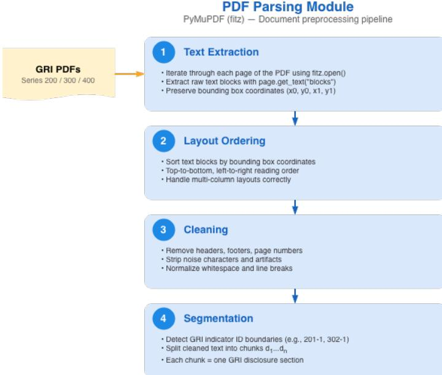
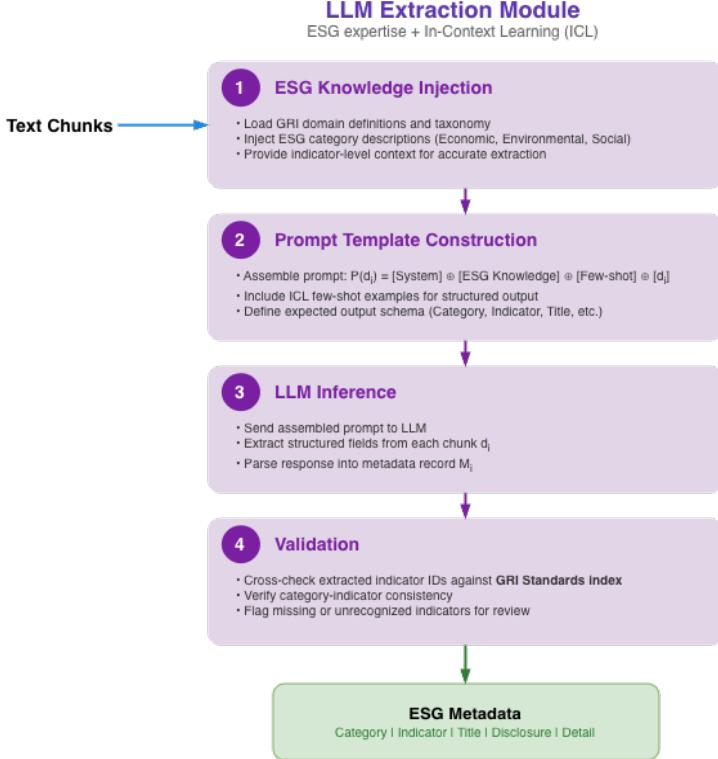
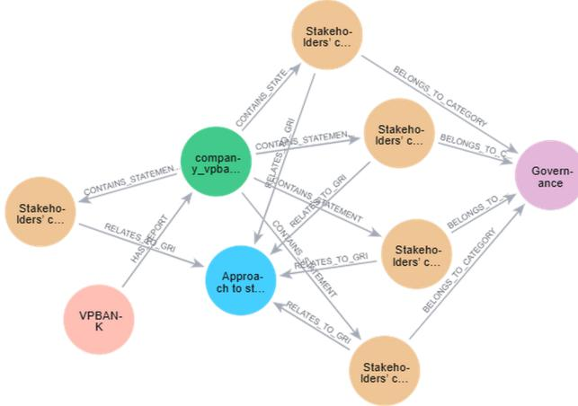
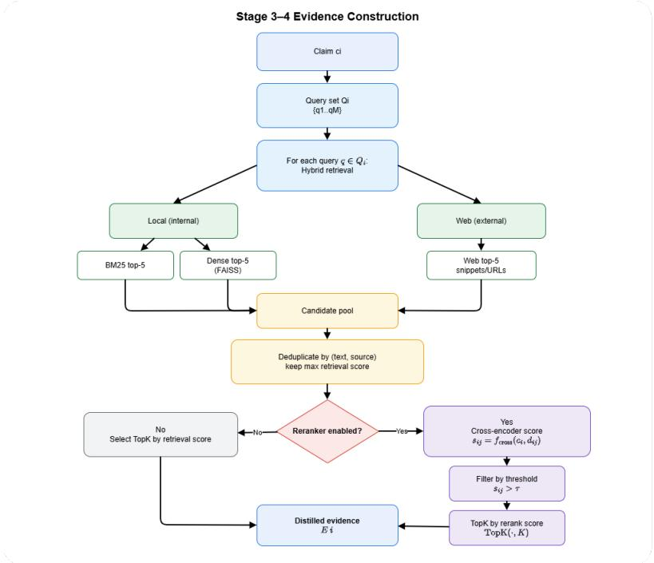

The image shows the FPT Education logo, which consists of the letters 'FPT' in a stylized blue and green font, followed by the word 'Education' in a smaller blue font. Below this, the words 'FPT UNIVERSITY' are written in a bold, orange, sans-serif font.

FPT Education and FPT UNIVERSITY logos

MINISTRY OF EDUCATION AND TRAINING

## FPT UNIVERSITY

## Capstone Project Document

# Design and Implementation of a GRI-Aligned ESG Assessment System

| AIP491 GROUP 2        |                                                                                                      |
| --------------------- | ---------------------------------------------------------------------------------------------------- |
| Group Members         | Nguyen Minh Quang - HE181701Vuong Anh Binh - HE180123Dam Hong Phuc - HE181106Le Xuan Hieu - HE186486 |
| Supervisor            | MS Le Dinh Huynh                                                                                     |
| Capstone Project code | AIP491                                                                                               |

# Abstract

Environmental, Social, and Governance (ESG) disclosures have become increasingly important in sustainability assessment, risk management, and investment decision-making in the banking sector. However, ESG and financial reports are typically lengthy, heterogeneous, and semi-structured, making systematic assessment difficult and time-consuming. This thesis introduces a GRI-aligned ESG assessment system for Vietnamese banks based on a Knowledge Graph-enhanced Retrieval-Augmented Generation (KG-RAG) architecture integrated with Large Language Models (LLMs) for question answering and automated fact-checking. The designed system comprises five main modules: (i) an ESG metadata module that converts official Global Reporting Initiative (GRI) standards into a normalized, machine-readable metadata layer aligned with disclosure indicators; (ii) an ESG report processing module that linearizes, segments, and labels Vietnamese banking sustainability and annual reports into structured statement-level evidence; (iii) an ESG knowledge graph that explicitly represents companies, reports, statements, GRI indicators, and ESG categories with full provenance; (iv) a hybrid KG-driven retrieval and answer generation module that combines graph filtering, semantic embeddings, and keyword matching to produce evidence-grounded answers with traceable citations; and (v) an automated fact-checking layer that decomposes generated answers into atomic claims, retrieves supporting evidence from internal and external sources, and assigns claim-level verification labels to improve factual reliability. The system is evaluated on an expert-supported benchmark of 120 ESG questions covering Environmental, Social, and Governance dimensions across Vietnamese banking reports. Experimental results show that the designed framework achieves an overall answer accuracy of 88.14% on the evaluation subset, while the fact-checking component further enhances transparency and reduces the risk of unsupported ESG statements in high-stakes analytical settings.

**Keywords:** ESG, GRI Standards, Knowledge Graph-RAG, Vietnamese Banks, Large Language Model

# Acknowledgments

We sincerely thank all those who contributed to the completion of this capstone project.

First, our deepest appreciation goes to our supervisors, Mr. Le Dinh Huynh and Mr. Tran Van Ha, whose expert guidance, thoughtful direction, and extensive domain knowledge were indispensable throughout every phase of this work. Their constructive feedback, patience, and consistent encouragement enabled the team to refine both the conceptual foundations and technical implementation of this system to the highest standard we could achieve.

We are equally grateful to FPT University for providing a rigorous and stimulating academic environment. The knowledge imparted by faculty members across the department established the theoretical groundwork upon which this project was built. The university's infrastructure, research resources, and high standards of academic training created the conditions necessary for us to explore and realize our ideas with confidence.

We would also like to acknowledge our peers and colleagues for their candid discussions, willingness to share knowledge, and constructive critique. Their perspectives helped us examine the problem from multiple angles and materially improved the quality of this work.

Finally, and most profoundly, we thank our families for their unwavering support and understanding throughout this process. Their encouragement and the conditions they provided allowed us to devote ourselves fully to this research.

# Contents

|          |                                                                |           |
| -------- | -------------------------------------------------------------- | --------- |
| <b>1</b> | <b>Introduction</b>                                            | <b>6</b>  |
| 1.1      | Motivation                                                     | 6         |
| 1.2      | Objectives                                                     | 6         |
| <b>2</b> | <b>Related Work</b>                                            | <b>7</b>  |
| 2.1      | Automated Assessment from Sustainability Reports               | 7         |
| 2.2      | ESG Question Answering over Sustainability Reports             | 8         |
| <b>3</b> | <b>Methodology</b>                                             | <b>9</b>  |
| 3.1      | Overview of ESG Question-Answering System                      | 9         |
| 3.2      | ESG Metadata Module                                            | 9         |
| 3.3      | ESG Reports Processing Module                                  | 13        |
| 3.4      | ESG Knowledge Graph Module                                     | 18        |
| 3.5      | KG-driven Retrieval-Augmented Generation Module                | 20        |
| 3.6      | Automated Fact-Checking                                        | 21        |
| <b>4</b> | <b>Dataset</b>                                                 | <b>26</b> |
| <b>5</b> | <b>Experiments and Results</b>                                 | <b>28</b> |
| 5.1      | Experimental Design                                            | 28        |
| 5.2      | Results                                                        | 29        |
| 5.3      | Qualitative ESG Assessment of Vietnamese Banks                 | 32        |
| <b>6</b> | <b>Conclusion</b>                                              | <b>34</b> |
|          | <b>Appendix</b>                                                | <b>37</b> |
| A        | PDF-to-Markdown Processing, GRI-Aware Extraction, and Chunking | 37        |
| B        | Entity Extraction Prompts and Output Schema                    | 38        |
| C        | Graph JSON Schema and Neo4j Constraints                        | 39        |
| D        | Example Questions and Fact-Checked Outputs                     | 40        |

# List of Figures

|           |                                                                                                                         |    |
| --------- | ----------------------------------------------------------------------------------------------------------------------- | -- |
| Figure 1  | System architecture overview . . . . .                                                                                  | 9  |
| Figure 2  | GRI standard processing pipeline . . . . .                                                                              | 10 |
| Figure 3  | GRI standard documents used as input to the ESG Metadata Module . . . . .                                               | 10 |
| Figure 4  | Illustration of PDF parsing and disclosure segmentation for GRI standard documents . . . . .                            | 11 |
| Figure 5  | Illustration of LLM-based ESG metadata extraction with in-context learning . . . . .                                    | 12 |
| Figure 6  | Detailed pipeline of the ESG Reports Processing Module. . . . .                                                         | 13 |
| Figure 7  | Document linearization process in the ESG Reports Processing Module. . . . .                                            | 14 |
| Figure 8  | Table of Contents parsing and structure-aware alignment in the ESG Reports Processing Module. . . . .                   | 15 |
| Figure 9  | LLM-aware semantic segmentation of aligned ESG report blocks. . . . .                                                   | 16 |
| Figure 10 | Hierarchical label prediction for ESG report segments using MLPDH. . . . .                                              | 17 |
| Figure 11 | Schema of the ESG Knowledge Graph and its core node and relation types. . . . .                                         | 18 |
| Figure 12 | Overview of the KG-driven Retrieval-Augmented Generation Module. . . . .                                                | 20 |
| Figure 13 | Automated fact-checking pipeline . . . . .                                                                              | 23 |
| Figure 14 | Retrieval Evidence Construction Flow . . . . .                                                                          | 24 |
| Figure 15 | Fact Checking Aggregation . . . . .                                                                                     | 26 |
| Figure 16 | Answer-level accuracy of Llama3.1-8B and Qwen3-8B across retrieval configurations using top-3 evidence context. . . . . | 30 |

# 1 Introduction

## 1.1 Motivation

Environmental, Social, and Governance (ESG) disclosure has become increasingly important in sustainability assessment, corporate transparency, and investment decision-making. Over the past decade, ESG information has been used not only to evaluate firms’ non-financial performance but also to support broader judgments about long-term resilience, responsible management, and value creation. Existing literature shows that ESG disclosure has gradually moved from a peripheral reporting practice to a central source of information for investors, regulators, and other stakeholders who seek a more comprehensive view of corporate performance beyond traditional financial metrics [1, 2].

The growing importance of ESG disclosure is closely tied to the expansion of international reporting frameworks and market expectations for transparency. In this context, the Global Reporting Initiative (GRI)<sup>1</sup> has emerged as one of the most widely adopted standards for sustainability reporting, providing structured guidance for organizations to disclose their economic, environmental, and social impacts in a more systematic and comparable manner. At the same time, the recognition that sustainability-related information matters for capital markets has reinforced the role of ESG disclosure as an important bridge between corporate reporting and long-term financial decision-making [3, 4].

This issue is particularly significant in the banking sector. Unlike many other industries, banks are deeply exposed to environmental and social risks indirectly through their lending, investment, and risk management activities. Climate-related events, transition risks, social controversies, and governance failures can all propagate into conventional financial risks such as credit risk, reputational risk, and strategic risk. For this reason, banking regulators have increasingly emphasized climate- and sustainability-related supervision, while in Vietnam policy guidance has also encouraged green credit growth and environmental–social risk management in lending activities [5, 6].

Despite this progress, the practical use of ESG disclosures remains difficult. Sustainability reports, annual reports, and financial statements are often lengthy, heterogeneous, and semi-structured, combining narrative explanations, quantitative indicators, tabular disclosures, and appendix materials distributed across multiple sections. For analysts and stakeholders, verifying a specific ESG claim or tracing evidence related to a disclosure topic often requires substantial manual effort. This process is time-consuming, difficult to scale, and vulnerable to omission when relevant information is scattered across different parts of a report or across multiple reporting documents.

Recent advances in large language models (LLMs), document question answering, and Retrieval-Augmented Generation (RAG) have opened new opportunities for automating the analysis of complex corporate disclosures. These approaches make it possible to retrieve supporting passages and generate grounded answers from large document collections. However, prior studies also suggest that retrieval quality, provenance preservation, and reliable evidence selection remain major challenges, especially in knowledge-intensive settings where relevant facts may be distributed across different sections or expressed in different forms [7, 8].

These limitations are especially relevant in the context of Vietnamese banks. ESG-related information in this domain is often distributed across sustainability reports, annual reports, and financial statements, with substantial variation in reporting depth, terminology, and structure across institutions. As a result, stakeholders need tools that can do more than retrieve isolated passages: they must also connect dispersed evidence, preserve traceability to source documents, and support explainable analysis for ESG-related questions. This creates a strong motivation for a more structured and auditable question-answering framework tailored to Vietnamese banking disclosures.

To address this need, this thesis proposes a GRI-aligned ESG assessment framework based on Knowledge Graph-enhanced Retrieval-Augmented Generation (KG-RAG). The designed framework combines structured ESG knowledge representation, graph-aware retrieval, semantic similarity matching, and evidence-grounded answer generation to support transparent question answering over sustainability reports and financial statements of Vietnamese banks. Compared with standard retrieval pipelines, this approach is intended to better support provenance-preserving evidence aggregation, multi-hop reasoning across ESG-finance relations, and more explainable ESG analysis in a banking-specific setting.

## 1.2 Objectives

The overall objective of this thesis is to develop an evidence-grounded and fact-checked question-answering framework for analyzing ESG disclosures in the sustainability reports and financial statements of Vietnamese banks. To achieve this goal, the thesis pursues the following specific objectives:

---

<sup>1</sup>[https://www.globalreporting.org/](https://www.globalreporting.org/)

- To design a GRI-aligned KG-RAG framework that extracts structured ESG evidence from Vietnamese banking reports, organizes it in a domain-specific knowledge graph, and retrieves it through hybrid graph-based, semantic, and keyword matching.
- To incorporate an automated fact-checking mechanism that verifies generated answers at the claim level using evidence from internal ESG documents and external sources.
- To build an expert-annotated benchmark for Vietnamese ESG question answering and empirically evaluate the designed framework against strong retrieval baselines in terms of answer accuracy, evidence grounding, and factual consistency.

# 2 Related Work

## 2.1 Automated Assessment from Sustainability Reports

A growing body of research has investigated the possibility of conducting automated ESG assessment directly from sustainability reports and related disclosures. This line of research treats sustainability reports as primary textual data sources from which meaningful ESG-related signals can be computationally extracted. This perspective is particularly important because sustainability reports contain not only descriptive narratives of corporate responsibility efforts, but also structured and semi-structured disclosures regarding environmental targets, social initiatives, governance mechanisms, and performance outcomes.

Early studies in this area demonstrated that text-mining techniques can be applied to sustainability disclosures to derive quantitative measures of similarity and reporting affinity. Computational analysis of GRI-based sustainability reports, for example, has shown that linguistic patterns can be systematically captured to compare firms’ reporting practices and identify underlying similarities across reports. Such findings indicate that sustainability reports are not merely qualitative communication documents, but also analyzable corpora that lend themselves to large-scale automated comparison [9].

More recent research has further examined how specific textual attributes of sustainability reports shape downstream analysis. Evidence suggests that characteristics such as report length, completeness, tone, redundancy, and the use of boilerplate language are significantly associated with automated ESG evaluation. These findings imply that automated ESG assessment may be influenced not only by the substantive information disclosed in a report, but also by the style and structure of the disclosure itself. This highlights an important methodological issue in automated ESG analytics: textual signals linked to disclosure quality or presentation style may shape ESG-related judgments alongside more substantive performance indicators [10].

Related work has also begun to examine higher-level discourse properties, particularly readability, as a factor associated with ESG disclosure quality. Recent evidence shows that more readable sustainability reports tend to enable more consistent automated analysis. From an analytical perspective, readability can therefore be interpreted as a meaningful proxy that connects linguistic quality, communication effectiveness, and assessment outcomes. The incorporation of large language models into this process has further expanded the ability to estimate such nuanced textual properties in a context-sensitive manner, going beyond earlier approaches based primarily on surface-level lexical or syntactic features [11].

The emergence of large language model-based methods has significantly extended the scope of automated ESG assessment. Instead of focusing only on document-level textual proxies, recent studies have explored more structured workflows that combine information extraction, semantic interpretation, and domain-specific assessment. LLM-based ESG evaluation frameworks have been proposed to integrate multiple tasks, including extracting ESG-relevant information from reports and generating intelligent assessments tailored to specific industry contexts. These developments suggest that LLMs are increasingly being viewed not just as tools for generic text analysis, but as promising mechanisms for domain-aware interpretation of sustainability disclosures [12].

A closely related direction involves the use of generative language models to derive structured insights from sustainability reports, such as initiatives, commitments, performance indicators, and governance practices. This reflects an important methodological shift: from coarse document-level representation toward structured signal extraction. This shift improves the analytical richness of ESG assessment and opens the possibility for more fine-grained, evidence-aware evaluation [13].

Taken together, the literature shows a clear progression in automated ESG analytics, moving from surface-level textual analysis toward more content-sensitive and semantically informed interpretation of corporate disclosure. Nevertheless, despite these advances, existing work typically produces firm-level assessments without supporting users to inspect the specific claims, metrics, and disclosures behind them. In many real-world settings, analysts, auditors, regulators, and other stakeholders need to examine individual sustainability statements, trace supporting evidence, and verify how a particular aspect of ESG performance is represented in the report. Further research is therefore still needed to support more interpretable, fine-grained, and claim-level analysis of sustainability reports.

## 2.2 ESG Question Answering over Sustainability Reports

To address the limitations of firm-level ESG assessment, a growing body of research has begun to reframe ESG analysis as a question answering (QA) task over sustainability disclosures. Instead of producing only a coarse firm-level summary, ESG QA enables users to ask targeted questions about emissions, governance structures, labor practices, sustainability targets, or year-to-year changes, while grounding the answers in the underlying reports. This shift is important because sustainability analysis often requires claim-level inspection rather than high-level summarization. In this setting, ESG QA supports a more transparent and evidence-based interaction with corporate disclosures by linking answers to the specific textual or tabular evidence from which they are derived [8].

From a system perspective, retrieval is a central component of ESG QA, especially because sustainability reports are typically long, heterogeneous, and information-dense documents. Relevant evidence may be scattered across narrative sections, tabular disclosures, appendices, or footnotes, making accurate retrieval essential for reliable question answering. Sparse lexical retrieval methods such as BM25 remain strong and efficient baselines, particularly for questions involving explicit terminology or keyword-based matching [14]. Dense retrieval models such as DPR, in contrast, improve semantic matching by learning dense representations of queries and passages, thereby helping recover relevant evidence even when the wording of the question differs from that of the report [15]. This is especially useful in ESG settings, where similar concepts may be expressed through varied reporting styles, industry-specific terminology, or different disclosure frameworks.

Large language models have recently been investigated across multiple stages of the retrieval pipeline, including query rewriting, retrieval, reranking, and answer generation. These developments suggest that LLM-based systems can strengthen ESG QA by enabling deeper semantic understanding of both user questions and disclosure content. They may help interpret underspecified queries, reformulate analyst questions, and synthesize retrieved evidence into coherent answers. However, their application also raises concerns regarding hallucination, reliability, and faithfulness, particularly in high-stakes domains such as ESG analysis, where unsupported claims may lead to misleading financial, regulatory, or reputational judgments [16]. For this reason, recent work increasingly emphasizes retrieval-augmented and evidence-grounded architectures in which answers remain tightly connected to verifiable source documents.

Beyond text-only retrieval, structured knowledge representations have also been proposed to support more explicit reasoning in ESG QA systems. Knowledge graphs offer a formal representation of entities, relations, and schema constraints, which can facilitate evidence organization and multi-hop reasoning over complex disclosure content [17]. This is especially relevant in sustainability reporting, where information is often distributed across multiple sections and linked through relationships among policies, targets, actions, and outcomes. Recent studies further indicate that LLMs can assist the construction of knowledge graphs from unstructured text through prompting-based extraction pipelines, thereby reducing the manual effort required for entity and relation extraction [18, 19]. Nevertheless, such approaches still require careful normalization, disambiguation, and quality control to ensure that the resulting graph structures are sufficiently consistent and reliable for downstream use.

Another key prerequisite for ESG QA lies in document parsing. In practice, sustainability reports are usually distributed as long PDF documents with visually complex layouts that combine text, tables, bullet lists, and section hierarchies. Reliable parsing is therefore essential for downstream retrieval and question answering. Recent vision-language OCR systems aim to convert such PDFs into clean linearized text while preserving important structural elements such as headings, tables, and lists [20]. These capabilities are particularly relevant for ESG document understanding, since failures in layout preservation or table extraction can directly degrade retrieval performance and weaken answer grounding.

The development of ESG-specific benchmarks has further strengthened this research direction. Benchmark datasets for information retrieval from corporate climate disclosures show that retrieval remains a major bottleneck in analyst-style ESG querying, even when downstream answer generation is relatively strong [21]. Broader ESG and sustainability QA benchmarks similarly demonstrate that even advanced language models benefit substantially from grounding in authoritative documents rather than relying solely on internal parametric knowledge [22]. These findings reinforce the view that ESG QA should be treated as a document-grounded reasoning task rather than a purely generative one.

Recent benchmark work has also highlighted the difficulty of table-centric reasoning in ESG analysis. Sustainability reports frequently present environmental and performance information in structured tables, meaning that many questions require systems to locate, interpret, and compare values across multiple tabular sources. Existing evidence shows that multi-table and multi-step reasoning remains challenging for current QA systems, particularly when questions require comparison, aggregation, or integration of evidence across sections [23]. Complementing this, domain-specific retrieval datasets for ESG reporting suggest that ESG-specialized retrieval representations can outperform generic baselines and transfer more effectively across reporting frameworks such as GRI and ERSR [24]. This indicates that domain adaptation is an important factor in improving retrieval quality for ESG QA.

The literature has also begun to move toward more integrated end-to-end ESG analysis systems. Recent systems combine comparative ESG benchmarking with interactive claim verification over sustainability reports, suggesting that ESG QA is evolving beyond simple answer extraction toward broader evidence-grounded analysis. This development reflects a shift from static assessment to interactive exploration, where users can inspect supporting evidence, verify claims, and compare disclosures across firms within a unified analytical workflow [25].

Overall, the literature suggests that ESG question answering is emerging as an important direction for interpretable sustainability analysis. While firm-level assessment approaches emphasize summarization and comparability, ESG QA places greater emphasis on interpretability, evidence grounding, and user-directed analysis. This is particularly appropriate for sustainability reporting, where relevant information is often dispersed across long and complex documents, and where stakeholders frequently need to inspect specific claims rather than rely only on firm-level summaries. At the same time, existing work makes clear that effective ESG QA depends on the joint performance of several components, including document parsing, retrieval, grounding, and reasoning over both text and tables. These challenges indicate that ESG QA remains an active and technically demanding research area, with substantial room for improvement in retrieval quality, evidence traceability, and fine-grained analytical support.

# 3 Methodology

## 3.1 Overview of ESG Question-Answering System

![Figure 1: System architecture overview. The diagram illustrates a five-module pipeline for ESG question answering. Module 1 (GRI Framework) extracts ESG metadata from GRI reports. Module 2 (ESG Reports Processing) processes documents into statements and claims. Module 3 (ESG Knowledge Graph) constructs a graph from statements and metadata. Module 4 (ESG Retrieval-Augmented Generation) performs classification, retrieval, and LLM answer generation. Module 5 (Automated Fact-Checking) decomposes claims, generates queries, and verifies evidence using Google search and iterative retrieval. The final output is a Result.](images/7a0db9703b68b3d06cdaeefc084c0006_img.jpg)

```

graph TD
    Question[Question] --> Module4
    Module1[Module 1: ESG Metadata Extraction] --> Module3
    Module2[Module 2: ESG Reports Processing] --> Module3
    Module3[Module 3: ESG Knowledge Graph] --> Module4
    Module4[Module 4: ESG Retrieval-Augmented Generation] --> Result[Result]
    Module5[Module 5: Automated Fact-Checking] --> Result
```

The diagram shows the system architecture for ESG question answering, consisting of five interconnected modules:

- Module 1: ESG Metadata Extraction** (Orange box): Processes GRI Framework documents to extract ESG Metadata, categorized by Category, Indicator, Title, Disclosure, and Detail.
- Module 2: ESG Reports Processing** (Yellow box): Processes ESG Reports through Document Linearization, ToC Processing, Information Extraction, and Statement-level Prediction to generate Statements and Claims.
- Module 3: ESG Knowledge Graph** (Purple box): Constructs a Knowledge Graph from Statements and ESG Metadata, showing relationships between Company nodes, GRI Indicator nodes, and ESG Issues/Topics.
- Module 4: ESG Retrieval-Augmented Generation** (Blue box): Takes a Question and processes it through Classification & Keyword extraction, Graph Retrieval, Hybrid Search, Evidence Rerank, and LLM Answer Generation to produce a Result.
- Module 5: Automated Fact-Checking** (Red box): Takes a Claim and processes it through Claim Decomposition & Decontextualization, Atomic Claims, Cross-Lingual Expansion, Structured Query Generation, Credible Source Selection, Iterative Evidence Retrieval (utilizing Google search), Evidence Aggregation & Label Prediction, and finally outputs a Result with a status indicator (checkmark, X, or question mark).

Figure 1: System architecture overview. The diagram illustrates a five-module pipeline for ESG question answering. Module 1 (GRI Framework) extracts ESG metadata from GRI reports. Module 2 (ESG Reports Processing) processes documents into statements and claims. Module 3 (ESG Knowledge Graph) constructs a graph from statements and metadata. Module 4 (ESG Retrieval-Augmented Generation) performs classification, retrieval, and LLM answer generation. Module 5 (Automated Fact-Checking) decomposes claims, generates queries, and verifies evidence using Google search and iterative retrieval. The final output is a Result.

Figure 1: System architecture overview

As shown in Figure 1, the designed ESG question-answering framework consists of five interconnected modules that jointly support structured, evidence-grounded ESG analysis over sustainability reports. The *ESG Metadata Module* in Section 3.2 extracts and organizes key concepts from the GRI framework to form a standardized ESG metadata layer. The *ESG Reports Processing Module* in Section 3.3 processes raw sustainability reports and converts them into statement-level ESG representations linked to relevant indicators. The *ESG Knowledge Graph Module* in Section 3.4 integrates metadata and extracted statements into a unified graph structure for semantic organization and traceable reasoning. Based on this graph, the *KG-driven Retrieval-Augmented Generation Module* in Section 3.5 retrieves relevant evidence and generates grounded answers to user questions. Finally, the *Automated Fact-Checking Module* in Section 3.6 verifies generated outputs through claim decomposition, evidence retrieval, and label prediction. Together, these modules form a transparent and trustworthy pipeline for ESG question answering.

## 3.2 ESG Metadata Module

The **ESG Metadata Module** is designed to convert raw GRI standard documents into a normalized and machine-readable ESG metadata layer that can be used by downstream retrieval, knowledge graph construction,

and question-answering components. Since official GRI standards are published as long and heterogeneous PDF documents, their content is not directly suitable for structured computation. This module addresses that gap by transforming unstructured standard documents into standardized metadata records aligned with GRI disclosure units. As illustrated in Figure 2, the module consists of four main stages: document ingestion, PDF parsing, LLM-based extraction, and structured metadata construction.


```

graph LR
    Input[GRI PDFs  
Series 200  
Series 300  
Series 400] --> PDF_Parsing[PDF Parsing  
PyMuPDF (p2)]
    PDF_Parsing -- "chunks d1, ..., dN" --> LLM_Extraction[LLM Extraction  
ESG expertise + LLM]
    LLM_Extraction --> Output[Output  
ESG Metadata  
N1 = 1, ..., N]
    subgraph Output_Box [Output]
        Category[Category]
        Indicator[Indicator]
        Title[Title]
        Disclosure[Disclosure]
        Detail[Detail]
    end

```

Figure 2: GRI standard processing pipeline. The diagram shows a flow from 'Input' (GRI PDFs: Series 200, Series 300, Series 400) to 'PDF Parsing' (PyMuPDF (p2)), then to 'LLM Extraction' (ESG expertise + LLM), and finally to 'Output' (ESG Metadata: Category, Indicator, Title, Disclosure, Detail).

Figure 2: GRI standard processing pipeline

**GRI Standard Documents:** The input corpus consists of official GRI standard documents, including the universal standards (GRI 1, 2, and 3) and topic-specific standards from the 200, 300, and 400 series [26]. These documents define the reporting principles, disclosure requirements, and indicator-level guidance that organizations use when preparing sustainability reports. Figure 3 shows an example page from a GRI standard document, illustrating the semi-structured reporting format used as input to the metadata extraction pipeline. Each document is distributed in Portable Document Format (PDF) and contains hierarchically organized sections, disclosure identifiers, and explanatory guidance spanning Environmental, Social, and Governance dimensions. In our framework, these documents serve as the authoritative source for constructing the ESG metadata schema.


Figure 3: Two pages of GRI standard documents. The left page is GRI 205: Anti-corruption 2016, showing 'Disclosure 205-2 Communication and training about anti-corruption policies and procedures'. The right page is GRI 404: Training and Education 2016, showing '2. Topic disclosures' and 'Disclosure 404-1 Average hours of training per year per employee'. Both pages include sections for Requirements, Recommendations, and Guidance.

Figure 3: GRI standard documents used as input to the ESG Metadata Module

**PDF Parsing and Disclosure Segmentation:** Before semantic extraction can be performed, the raw PDF documents must be converted into clean and processable text. We use PyMuPDF [27] for PDF parsing because it enables efficient extraction while preserving reading order and structural layout. The parser iterates over all pages and extracts positionally ordered text blocks, after which a cleaning procedure is applied to remove repetitive headers,

footers, page numbers, and typographic artefacts. The cleaned text is then segmented into disclosure-level chunks using rule-based boundary detection over GRI identifiers such as GRI 305-1. Each chunk is constructed to correspond, as closely as possible, to a coherent disclosure unit together with its associated explanatory content. Figure 4 illustrates this process, showing how raw GRI PDF content is parsed, cleaned, and segmented into disclosure-level units. This process yields a structured document collection  $\mathcal{D} = \{d_1, d_2, \dots, d_n\}$ , where each segment  $d_i$  represents a candidate unit for metadata extraction.



**PDF Parsing Module**
PyMuPDF (fitz) — Document preprocessing pipeline

```

graph TD
    A[GRI PDFs  
Series 200 / 300 / 400] --> B[1 Text Extraction]
    B --> C[2 Layout Ordering]
    C --> D[3 Cleaning]
    D --> E[4 Segmentation]
  
```

**1 Text Extraction**

- Iterate through each page of the PDF using `fitz.open()`
- Extract raw text blocks with `page.get_text("blocks")`
- Preserve bounding box coordinates (x0, y0, x1, y1)

**2 Layout Ordering**

- Sort text blocks by bounding box coordinates
- Top-to-bottom, left-to-right reading order
- Handle multi-column layouts correctly

**3 Cleaning**

- Remove headers, footers, page numbers
- Strip noise characters and artifacts
- Normalize whitespace and line breaks

**4 Segmentation**

- Detect GRI indicator ID boundaries (e.g., 201-1, 302-1)
- Split cleaned text into chunks  $d_1 \dots d_n$
- Each chunk = one GRI disclosure section

Flowchart of the PDF Parsing Module showing four steps: Text Extraction, Layout Ordering, Cleaning, and Segmentation.

**Figure 4:** Illustration of PDF parsing and disclosure segmentation for GRI standard documents

**LLM-Based Extraction with In-Context Learning:** Given the diversity of writing styles and structural patterns across GRI documents, simple rule-based extraction is insufficient for obtaining a complete and semantically consistent representation of disclosure content. To address this, we adopt a prompt-based extraction strategy using a large language model (LLM) [28]. Each segment  $d_i$  is processed together with an expert-curated ESG knowledge context that summarizes reporting scope, definitional boundaries, and inter-indicator relations derived from the GRI framework. To improve robustness across heterogeneous disclosure structures, we employ **In-Context Learning (ICL)**, where representative few-shot examples are embedded in the prompt to guide the model toward consistent field extraction [29]. Figure 5 illustrates this extraction process, showing how a disclosure segment, together with ESG knowledge and few-shot examples, is combined into a structured prompt and passed to the LLM to generate normalized metadata fields.

The prompt for each segment is formulated as:

$$
P(d_i) = [\text{System Instruction}] \oplus [\text{ESG Knowledge}] \oplus [\text{Few-shot Examples}] \oplus [d_i] \quad (1)
$$

where  $\oplus$  denotes sequential prompt concatenation.

This design enables the model to interpret both the local disclosure text and the broader GRI reporting context, thereby improving its ability to extract structured metadata even when disclosure boundaries or guidance patterns are expressed differently across documents.



**LLM Extraction Module**
ESG expertise + In-Context Learning (ICL)

```

graph TD
    TC[Text Chunks] --> S1
    subgraph S1 [1 ESG Knowledge Injection]
        S1_1[• Load GRI domain definitions and taxonomy]
        S1_2[• Inject ESG category descriptions (Economic, Environmental, Social)]
        S1_3[• Provide indicator-level context for accurate extraction]
    end
    S1 --> S2
    subgraph S2 [2 Prompt Template Construction]
        S2_1[• Assemble prompt: P(d_i) = [System] @ [ESG Knowledge] @ [Few-shot] @ [d_i]]
        S2_2[• Include ICL few-shot examples for structured output]
        S2_3[• Define expected output schema (Category, Indicator, Title, etc.)]
    end
    S2 --> S3
    subgraph S3 [3 LLM Inference]
        S3_1[• Send assembled prompt to LLM]
        S3_2[• Extract structured fields from each chunk d_i]
        S3_3[• Parse response into metadata record M_i]
    end
    S3 --> S4
    subgraph S4 [4 Validation]
        S4_1[• Cross-check extracted indicator IDs against GRI Standards Index]
        S4_2[• Verify category-indicator consistency]
        S4_3[• Flag missing or unrecognized indicators for review]
    end
    S4 --> EM[ESG Metadata]
    EM --- EM_Fields[Category | Indicator | Title | Disclosure | Detail]
  
```

**1 ESG Knowledge Injection**

- Load GRI domain definitions and taxonomy
- Inject ESG category descriptions (Economic, Environmental, Social)
- Provide indicator-level context for accurate extraction

**2 Prompt Template Construction**

- Assemble prompt:  $P(d_i) = [\text{System}] @ [\text{ESG Knowledge}] @ [\text{Few-shot}] @ [d_i]$
- Include ICL few-shot examples for structured output
- Define expected output schema (Category, Indicator, Title, etc.)

**3 LLM Inference**

- Send assembled prompt to LLM
- Extract structured fields from each chunk  $d_i$
- Parse response into metadata record  $M_i$

**4 Validation**

- Cross-check extracted indicator IDs against **GRI Standards Index**
- Verify category-indicator consistency
- Flag missing or unrecognized indicators for review

**ESG Metadata**
Category | Indicator | Title | Disclosure | Detail

Flowchart of the LLM Extraction Module showing four steps: 1. ESG Knowledge Injection, 2. Prompt Template Construction, 3. LLM Inference, and 4. Validation, leading to ESG Metadata.

**Figure 5:** Illustration of LLM-based ESG metadata extraction with in-context learning

**ESG Metadata Schema:** For each disclosure unit, the module produces a structured ESG metadata record represented as a five-tuple:

$$
M_i = \langle \text{Category}, \text{Indicator}, \text{Title}, \text{Disclosure}, \text{Detail} \rangle \quad (2)
$$

This schema is designed to capture both the canonical identity of a GRI disclosure and the context needed for downstream retrieval and semantic linking. The five fields are defined as follows:

- **Category:** the high-level ESG dimension (Environmental, Social, or Governance) associated with the disclosure.
- **Indicator:** the unique alphanumeric disclosure identifier (e.g., GRI 305-1), used as the primary anchor for traceability and cross-module linking.
- **Title:** the official disclosure title provided by the GRI standard, serving as a concise human-readable label.
- **Disclosure:** the core reporting requirement associated with the indicator, including quantitative, qualitative, or procedural reporting obligations.
- **Detail:** supplementary contextual information such as definitions, reporting boundaries, compilation guidance, and interpretive notes.

Together, these fields form a normalized metadata layer that standardizes GRI knowledge and provides a semantic bridge between reporting standards, extracted report statements, and knowledge graph entities.

**Post-processing and Validation:** After extraction, each metadata record  $M_i$  is subjected to a validation step to ensure structural completeness and semantic consistency. This step checks whether all required fields are present, whether disclosure identifiers follow the expected GRI format, and whether extracted titles and disclosure descriptions remain aligned with the original source content. Ambiguous or incomplete records are flagged for expert review. In addition, the final metadata collection is cross-referenced against the official GRI index to preserve traceability and reduce the risk of missing or incorrectly normalized disclosure units [26].

## 3.3 ESG Reports Processing Module

Raw ESG reports present major challenges for automated analysis because they often combine multi-column layouts, embedded tables, inconsistent heading hierarchies, and heterogeneous formatting across issuers. To address these issues, we design a four-stage processing pipeline that transforms unstructured ESG PDFs into annotated, GRI-indexed segments suitable for downstream retrieval and question answering. As shown in Figure 6, the module consists of document linearization, structure-aware alignment, semantic segmentation, and hierarchical label prediction.


```

graph LR
    Input[Raw ESG PDF  
Multi-column text  
Embedded tables  
Figures & captions  
Mixed headings] --> Stage1[Stage 1  
Linearization  
OLMoCR]
    Stage1 --> Stage2[Stage 2  
ToC Alignment  
RAP + ALIGN algorithm]
    Stage2 --> Stage3[Stage 3  
Segmentation  
Qwen3-4B sliding window]
    Stage3 --> Stage4[Stage 4 + Output  
Label Prediction  
MLPDHF framework]
    Stage4 --> Output[Annotated Segments  
A_k = (ESG-N, GRI, title, desc)]

```

Figure 6: Detailed pipeline of the ESG Reports Processing Module. The pipeline consists of four stages: Stage 1 (Linearization using OLMoCR), Stage 2 (ToC Alignment using RAP + ALIGN algorithm), Stage 3 (Segmentation using Qwen3-4B sliding window), and Stage 4 (Label Prediction using MLPDHF framework). The input is a Raw ESG PDF (Multi-column text, Embedded tables, Figures & captions, Mixed headings). The output is Annotated Segments (A\_k = (ESG-N, GRI, title, desc)).

Figure 6: Detailed pipeline of the ESG Reports Processing Module.

**Document Linearization:** The purpose of this stage is to convert visually complex ESG reports into a clean and ordered text representation that can be processed reliably in later stages. We adopt **OLMoCR**, a layout-aware PDF linearization toolkit that preserves reading order while handling common report structures such as multi-column text, tables, headings, and captions [30]. Figure 7 illustrates this stage, showing how raw ESG PDF pages are traversed, decomposed into content blocks, reordered according to layout structure, and reconstructed into a linearized sequence for downstream processing. Formally, let  $\mathcal{D}$  denote an ESG document comprising  $P$  pages. OLMoCR processes each page  $p$  and produces a linearized set of content blocks:

$$
\mathcal{D}_p = \{(w_i, b_i, c_i, p)\}_{i=1}^{N_p} \quad (3)
$$

where  $w_i$  is the textual content of block  $i$ ,  $b_i = (x_{\min}, y_{\min}, x_{\max}, y_{\max})$  is the bounding box in normalized page coordinates,  $c_i \in \{\text{text}, \text{table}, \text{heading}, \text{caption}\}$  denotes the block type, and  $N_p$  is the total number of blocks on page  $p$ . The global linearized sequence is then obtained by concatenating all pages in reading order:

$$
\mathcal{D} = \mathcal{D}_1 \oplus \mathcal{D}_2 \oplus \dots \oplus \mathcal{D}_P \quad (4)
$$

Compared with naive OCR pipelines, this step preserves structural layout and reconstructs tables in a form that remains usable for subsequent alignment and segmentation.


**Stage 1: Linearization**
OLMoCR — PDF to linear block sequence

```

graph TD
    A[Raw ESG PDF  
Multi-column, tables,  
figures, mixed headings] --> B[1 Page Iteration]
    B --> C[2 Block Extraction]
    C --> D[3 Layout Ordering]
    D --> E[4 Table Reconstruction]
    E --> F[5 Concatenation]
    F --> G[Output: Block sequence D]
  
```

**1 Page Iteration**

- Traverse each page  $p$  of the PDF document
- Feed page image/content into OLMoCR vision-language model
- Process pages sequentially to maintain document order

**2 Block Extraction**

- Extract per-block attributes:  $(w, b, c, p)$$w$  = text words,  $b$  = bounding box,  $c$  = confidence,  $p$  = page number
- Each block represents a semantic text unit on the page

**3 Layout Ordering**

- **Spatial-aware traversal** using bounding box coordinates
- Resolve multi-column layouts into correct reading order
- Sort blocks top-to-bottom, left-to-right within columns

**4 Table Reconstruction**

- Detect and reconstruct embedded tables
- Convert visual table structures into **delimited text grids**
- Preserve row/column relationships in linearized form

**5 Concatenation**

- Concatenate all page-level block sequences:$\mathcal{D} = \mathcal{D}_1 \oplus \mathcal{D}_2 \oplus \dots \oplus \mathcal{D}_p$
- Produce unified document-level block sequence  $\mathcal{D}$

**Output: Block sequence  $\mathcal{D}$**

Flowchart of Stage 1: Linearization process. It starts with 'Raw ESG PDF' (Multi-column, tables, figures, mixed headings) and proceeds through five steps: 1. Page Iteration, 2. Block Extraction, 3. Layout Ordering, 4. Table Reconstruction, and 5. Concatenation, finally leading to 'Output: Block sequence D'.

Figure 7: Document linearization process in the ESG Reports Processing Module.

**Table of Contents Parsing and Structure-Aware Alignment:** The purpose of this stage is to recover the document hierarchy and align it with the linearized report content. Since most ESG reports contain an explicit Table of Contents (ToC), we first extract this structure using **Region-Aware Prompting (RAP)**, a visual prompting strategy that leverages layout and textual cues to identify heading entries and their associated page references. Figure 8 illustrates this process, showing how ToC entries are parsed into hierarchical headings and then aligned with the linearized body text through exact matching, fuzzy matching, and context-aware insertion. RAP produces a hierarchical heading set:

$$
\mathcal{T} = \{(t_k, \ell_k, \rho_k)\}_{k=1}^M \quad (5)
$$

where  $t_k$  is the heading text,  $\ell_k \in \{1, 2, 3, 4\}$  is the inferred hierarchy level, and  $\rho_k$  is the referenced page number.

After obtaining both  $\mathcal{T}$  and the linearized sequence  $\mathcal{D}$ , we align them using the **ALIGN** algorithm (Anchor-based Linguistic Indexing for Granular Navigation). ALIGN proceeds through three stages: exact matching, fuzzy matching using Levenshtein similarity [31], and context-aware insertion using an LLM. The exact match function is defined as:

$$
\text{Match}_{\text{exact}}(t_k, b_j) = \mathbf{1}[\text{norm}(t_k) = \text{norm}(w_j)] \quad (6)
$$

For unresolved headings, the **Context-aware Insertion Prompt (CIP)** estimates the most suitable insertion point  $j^*$  within an anchor-defined window  $\mathcal{W}_k$ :

$$
j^* = \arg \max_{j \in \mathcal{W}_k} \text{Score}_{\text{CIP}}(t_k, b_j) \quad (7)
$$

This stage produces a structure-aware document representation in which heading anchors are aligned with the corresponding report content.


**Stage 2: ToC Alignment**
RAP + ALIGN algorithm — Anchor headings to document blocks

```

graph TD
    D[Block sequence  $\mathcal{D}$ ] --> S1
    subgraph Stage2 [Stage 2: ToC Alignment]
        S1["1 ToC Parsing (RAP)  
• Parse the Table of Contents from the PDF  
• Extract heading entries with level  $\ell_k \in \{1,2,3,4\}$  and page ref  $p_k$   
• Build hierarchical ToC tree structure"]
        S2["2 Stage 1: Exact Match  
• Compare  $\text{norm}(t_k) = \text{norm}(w_i)$  for each ToC entry vs. block  
• Normalized string matching (lowercase, strip punctuation)  
• Assign exact-matched blocks as heading anchors"]
        S3["3 Stage 2: Fuzzy Match  
• For unmatched entries, apply Levenshtein similarity  $\geq 0.85$   
• Handle OCR errors, minor formatting differences  
• Fallback matching for remaining ToC entries"]
        S4["4 Stage 3: CIP Insertion  
• For still-unmatched entries, LLM finds  $j^*$  in window  $\mathcal{W}_k$   
• Context-Informed Placement using language model  
• LLM identifies best insertion point within page window"]
        S5["5 Heading Anchors  
• Generate heading anchor set  $\mathcal{J}$  aligned to  $\mathcal{D}$   
• Each anchor maps a ToC entry to its position in the block sequence  
• Provides structural context for downstream segmentation"]
        S1 --> S2
        S2 --> S3
        S3 --> S4
        S4 --> S5
    end
    S5 --> Output
    Output[Output: Structured  $\mathcal{D} + \mathcal{J}$ ]
  
```

**1 ToC Parsing (RAP)**

- Parse the Table of Contents from the PDF
- Extract heading entries with level  $\ell_k \in \{1,2,3,4\}$  and page ref  $p_k$
- Build hierarchical ToC tree structure

**2 Stage 1: Exact Match**

- Compare  $\text{norm}(t_k) = \text{norm}(w_i)$  for each ToC entry vs. block
- Normalized string matching (lowercase, strip punctuation)
- Assign exact-matched blocks as heading anchors

**3 Stage 2: Fuzzy Match**

- For unmatched entries, apply Levenshtein similarity  $\geq 0.85$
- Handle OCR errors, minor formatting differences
- Fallback matching for remaining ToC entries

**4 Stage 3: CIP Insertion**

- For still-unmatched entries, LLM finds  $j^*$  in window  $\mathcal{W}_k$
- Context-Informed Placement using language model
- LLM identifies best insertion point within page window

**5 Heading Anchors**

- Generate heading anchor set  $\mathcal{J}$  aligned to  $\mathcal{D}$
- Each anchor maps a ToC entry to its position in the block sequence
- Provides structural context for downstream segmentation

**Output: Structured  $\mathcal{D} + \mathcal{J}$**

Flowchart of Stage 2: ToC Alignment. It shows a five-step process: 1. ToC Parsing (RAP), 2. Stage 1: Exact Match, 3. Stage 2: Fuzzy Match, 4. Stage 3: CIP Insertion, and 5. Heading Anchors. The process starts with a 'Block sequence D' and ends with 'Output: Structured D + J'.

**Figure 8:** Table of Contents parsing and structure-aware alignment in the ESG Reports Processing Module.

**LLM-Aware Semantic Segmentation:** The purpose of this stage is to divide the aligned report into semantically coherent segments that better reflect ESG topics and disclosure boundaries. Let  $\mathcal{B} = (b_1, b_2, \dots, b_N)$  denote the ordered block sequence. We apply a sliding-window strategy with width  $W$ , stride  $s$ , and overlap  $\delta = \lfloor 0.1 \cdot W \rfloor$ . Figure 9 illustrates this process, showing how the aligned block sequence is scanned through overlapping windows, how the LLM predicts semantic breakpoints within each window, and how these local boundaries are merged into

a global segmentation of the report.

$$
\mathcal{W}^{(t)} = (b_{t-s}, b_{t-s+1}, \dots, b_{t-s+W-1}) \quad (8)
$$

Within each window, **Qwen3-4B** [32] predicts boundary indices  $\mathcal{F}^{(t)}$  at positions where topic, GRI theme, or disclosure type changes. The union of all predicted boundaries forms a global boundary set  $\mathcal{F} = \bigcup_t \mathcal{F}^{(t)}$ , which partitions the document into  $K$  semantic segments:

$$
\mathcal{S} = \{S_1, S_2, \dots, S_K\}, \quad S_k = (b_{f_{k-1}+1}, \dots, b_{f_k}) \quad (9)
$$

This segmentation step is important because ESG reports often interleave multiple themes within the same page or section, making fixed-size chunking insufficient for downstream reasoning.


**Stage 3: Segmentation**
Qwen3-4B sliding window — Split document into semantic segments

```

graph TD
    Input[Structured  $\mathcal{D} + \mathcal{T}$ ] --> Step1
    subgraph Stage3 [Stage 3: Segmentation]
        direction TB
        Step1["1 Sliding Window  
• Scan  $\mathcal{D}$  with window of width  $W$ , stride  $s$ , overlap  $\delta$   
• Each window captures a contiguous span of blocks  
• Overlapping ensures no boundary is missed between windows"]
        Step2["2 LLM Boundary Detection  
• Qwen3-4B predicts boundary set  $\mathcal{F}^{(k)}$  per window  
• LLM identifies where topic/section transitions occur  
• Binary classification at each block position within window"]
        Step3["3 Global Boundary Set  
• Merge all window-level boundaries:  $\mathcal{F} = \bigcup_k \mathcal{F}^{(k)}$   
• Resolve conflicts from overlapping windows  
• Produce unified document-level boundary set"]
        Step4["4 Segment Partitioning  
• Split  $\mathcal{D}$  at global boundaries into segments:  $\mathcal{S} = \{S_1, S_2, \dots, S_K\}$   
• Each segment  $S_k$  is a contiguous run of blocks  
• Segments represent coherent disclosure sections"]
        Step5["5 Heading Context  
• Attach  $\mathcal{T}$  anchor per  $S_k$  — nearest preceding heading  
• Provides hierarchical section context for each segment  
• Enriches segments with structural position in the report"]
        Step1 --> Step2
        Step2 --> Step3
        Step3 --> Step4
        Step4 --> Step5
    end
    Step5 --> Output[Output: K segments  $\mathcal{S}$ ]
  
```

**1 Sliding Window**

- Scan  $\mathcal{D}$  with window of width  $W$ , stride  $s$ , overlap  $\delta$
- Each window captures a contiguous span of blocks
- Overlapping ensures no boundary is missed between windows

**2 LLM Boundary Detection**

- Qwen3-4B predicts boundary set  $\mathcal{F}^{(k)}$  per window
- LLM identifies where topic/section transitions occur
- Binary classification at each block position within window

**3 Global Boundary Set**

- Merge all window-level boundaries:  $\mathcal{F} = \bigcup_k \mathcal{F}^{(k)}$
- Resolve conflicts from overlapping windows
- Produce unified document-level boundary set

**4 Segment Partitioning**

- Split  $\mathcal{D}$  at global boundaries into segments:  $\mathcal{S} = \{S_1, S_2, \dots, S_K\}$
- Each segment  $S_k$  is a contiguous run of blocks
- Segments represent coherent disclosure sections

**5 Heading Context**

- Attach  $\mathcal{T}$  anchor per  $S_k$  — nearest preceding heading
- Provides hierarchical section context for each segment
- Enriches segments with structural position in the report

**Output: K segments  $\mathcal{S}$**

Flowchart of Stage 3: Segmentation. It shows a five-step process: 1. Sliding Window, 2. LLM Boundary Detection, 3. Global Boundary Set, 4. Segment Partitioning, and 5. Heading Context. The process starts with 'Structured D + T' and ends with 'Output: K segments S'.

**Figure 9:** LLM-aware semantic segmentation of aligned ESG report blocks.

**Hierarchical Label Prediction via MLPDH:** The purpose of this stage is to assign each segment a structured label path that captures its ESG category, disclosure relevance, statement type, and sentiment. Each segment  $S_k$  is annotated using the **Multi-Level Prediction with Document Hierarchy (MLPDH)** framework, which produces a four-level label path:

$$
\lambda_k = (\text{ESG-N}, \text{GRI-Indicator}, \text{Statement}, \text{Sentiment}) \quad (10)
$$

Figure 10 illustrates this stage, showing how each semantic segment is encoded through the combination of textual, structural, and positional signals, and how the model predicts a coherent hierarchical label path through multi-level classification and consistency constraints.


**Stage 4: Label Prediction**
MLPDH framework — Multi-label hierarchical classification

```

graph TD
    Input[K segments s] --> Step1
    subgraph Stage4 [Stage 4: Label Prediction]
        direction TB
        Step1["1 Ternary Block Embedding  
• Compute composite embedding:  $e_{\text{blk}} = E_{\text{text}} + E_{\text{lvl}} + E_{\text{pos}}$   
•  $E_{\text{text}}$ : semantic text embedding of block content  
•  $E_{\text{lvl}}$ : heading level embedding,  $E_{\text{pos}}$ : positional encoding"]
        Step2["2 Hierarchical Attention  
• Cross-level attention across 4 hierarchy levels  
• Captures dependencies between ESG-N category, GRI indicator, statement type, and sentiment levels simultaneously"]
        Step3["3 Sigmoid Classification  
• Apply sigmoid activation with  $P > 0.5$  threshold per level  
• Independent binary classification at each hierarchy level  
• Supports multi-label output (segment can have multiple labels)"]
        Step4["4 Consistency Penalty  
• Enforce  $\mathcal{L}_{\text{hier}}$  parent-child constraint during training  
• Penalize predictions that violate label hierarchy (e.g., GRI-305 without E category, or sentiment without statement type)"]
        Step5["5 Label Path Output  
• Generate label path:  $\lambda_k = (\text{ESG-N, GRI, Stmt, Sent})$   
• Four-level hierarchical label per segment  
• e.g., E  $\rightarrow$  GRI-305  $\rightarrow$  quantitative  $\rightarrow$  neutral"]
    end
    Step1 --> Step2
    Step2 --> Step3
    Step3 --> Step4
    Step4 --> Step5
    Step5 --> Output[Output: Annotated segments]
  
```

**1 Ternary Block Embedding**

- Compute composite embedding:  $e_{\text{blk}} = E_{\text{text}} + E_{\text{lvl}} + E_{\text{pos}}$
- $E_{\text{text}}$ : semantic text embedding of block content
- $E_{\text{lvl}}$ : heading level embedding,  $E_{\text{pos}}$ : positional encoding

**2 Hierarchical Attention**

- Cross-level attention across 4 hierarchy levels
- Captures dependencies between ESG-N category, GRI indicator, statement type, and sentiment levels simultaneously

**3 Sigmoid Classification**

- Apply sigmoid activation with  $P > 0.5$  threshold per level
- Independent binary classification at each hierarchy level
- Supports multi-label output (segment can have multiple labels)

**4 Consistency Penalty**

- Enforce  $\mathcal{L}_{\text{hier}}$  parent-child constraint during training
- Penalize predictions that violate label hierarchy (e.g., GRI-305 without E category, or sentiment without statement type)

**5 Label Path Output**

- Generate label path:  $\lambda_k = (\text{ESG-N, GRI, Stmt, Sent})$
- Four-level hierarchical label per segment
- e.g., E  $\rightarrow$  GRI-305  $\rightarrow$  quantitative  $\rightarrow$  neutral

**Output: Annotated segments**

Flowchart of Stage 4: Label Prediction. It shows five steps: 1. Ternary Block Embedding, 2. Hierarchical Attention, 3. Sigmoid Classification, 4. Consistency Penalty, and 5. Label Path Output. The process starts with 'K segments s' and ends with 'Output: Annotated segments'.

**Figure 10:** Hierarchical label prediction for ESG report segments using MLPDH.

To support this prediction, the model combines textual, structural, and positional signals into a unified block representation:

$$
e_{\text{blk}} = E_{\text{text}} + E_{\text{lvl}} + E_{\text{pos}} \quad (11)
$$

The framework then applies cross-level attention and sigmoid classification, together with a parent–child consistency constraint, to encourage coherent label paths across hierarchical levels. The hierarchical penalty is defined as:

$$
\mathcal{L}_{\text{hier}} = \sum_{h=2}^H \sum_{c_h} \max \left( 0, P(c_h) - P(\text{parent}(c_h)) \right) \quad (12)
$$

The total training objective is:

$$
\mathcal{L}_{\text{total}} = \sum_{h=1}^H \text{BCE}(P_h, Y_h) + \lambda \cdot \mathcal{L}_{\text{hier}} \quad (13)
$$

During inference, labels with  $P > 0.5$  are selected at each level to form the final label path. For example, a segment describing scope 1 greenhouse gas emissions may be assigned the path  $E \rightarrow \text{GRI-305} \rightarrow \text{quantitative} \rightarrow \text{neutral}$ .

## 3.4 ESG Knowledge Graph Module

The **ESG Knowledge Graph Module** is designed to transform extracted ESG content from sustainability reports into a structured representation that supports traceable storage, graph-based retrieval, and evidence-aware reasoning. While the previous modules convert raw reports into segmented and annotated ESG statements, this module organizes those outputs into an entity–relation graph instantiated in Neo4j. Knowledge graphs are well suited to this task because they support explicit semantic representation, linkage across heterogeneous sources, and structured navigation over interconnected entities [17]. In our framework, the ESG-KG links report-level evidence to standardized GRI disclosures [26] and enriched ESG taxonomy information [33], thereby enabling provenance tracking, evidence aggregation, and hybrid retrieval for downstream question answering.

**Graph Schema:** The purpose of the graph schema is to define a structured and interpretable backbone for representing ESG evidence, report metadata, and standardized disclosure topics. As illustrated in Figure 11, the ESG-KG contains five main node types.



*ESG\_Statement* is the central evidence node in the graph. Each node corresponds to an ESG-relevant sentence or short paragraph extracted from a report and contains `statement_id`, `content`, `embedding_content`, `page`, and optional heading context. This node type provides the main unit for retrieval and evidence grounding.

*GRI\_Indicator* represents a standardized disclosure topic defined by the GRI framework. It stores attributes such as `indicator_id`, `indicator_name`, `GRI_disclosure_detail`, and `topic_title`, which together provide a normalized semantic anchor for aligning report content to formal reporting requirements [26].

*ESG\_Category* represents the three high-level ESG dimensions, namely Environmental, Social, and Governance. These nodes support coarse-grained analysis, filtering, and aggregation across disclosure topics.

**Edge types:** Edges encode both provenance and semantic alignment relationships, as summarized in Table 1. The relation `HAS_REPORT` links each company to its reports, and `CONTAINS` connects each report to its extracted ESG statements. The relation `RELATED_TO` links a statement to the most relevant GRI indicator, while `BELONGS_TO` connects each indicator to its ESG category. In addition, we retain a direct `CATEGORIZED_AS` edge from *ESG\_Statement* to *ESG\_Category*. Although this category can be inferred indirectly through `RELATED_TO` and `BELONGS_TO`, the direct edge is useful for fast coarse-level filtering and for cases where category-level classification is reliable even when indicator-level alignment remains uncertain.

**Table 1:** Edge types in the ESG-KG

| Relation                    | From                 | To                   | Semantics                              |
| --------------------------- | -------------------- | -------------------- | -------------------------------------- |
| <code>HAS_REPORT</code>     | Company              | Report               | Company publishes a report             |
| <code>CONTAINS</code>       | Report               | <i>ESG_Statement</i> | Report contains a statement            |
| <code>RELATED_TO</code>     | <i>ESG_Statement</i> | <i>GRI_Indicator</i> | Statement aligned to a GRI indicator   |
| <code>BELONGS_TO</code>     | <i>GRI_Indicator</i> | <i>ESG_Category</i>  | Indicator mapped to an ESG category    |
| <code>CATEGORIZED_AS</code> | <i>ESG_Statement</i> | <i>ESG_Category</i>  | Statement directly classified as E/S/G |

**Graph Construction Pipeline:** The purpose of the construction pipeline is to materialize segmented report evidence as graph nodes and connect them to standardized ESG concepts. The pipeline consists of three main steps: statement materialization, LLM-assisted alignment, and provenance preservation.

**Statement materialization:** For each *Report* node, the source PDF is processed using the report pipeline described in Section 3.3. The resulting semantically segmented evidence units are materialized as *ESG\_Statement* nodes in Neo4j. This design ensures that each node is small enough to capture a focused ESG disclosure signal, while still retaining enough context for reliable interpretation. For each statement, a semantic embedding vector is computed and stored in `embedding_content` to support downstream similarity-based retrieval.

**LLM-assisted classification and alignment:** The next step links each *ESG\_Statement* node to the appropriate ESG category and GRI indicator. This step combines structured GRI metadata with LLM-based inference, following recent work showing that prompting strategies can support schema-conformant knowledge graph construction from unstructured text [18, 19]. For each statement, the system first predicts its high-level ESG category, then identifies the most relevant GRI indicator using the official disclosure descriptions as guidance, and finally materializes the corresponding `CATEGORIZED_AS` and `RELATED_TO` edges. By grounding the LLM in standardized GRI metadata, this step reduces ambiguity and improves consistency across heterogeneous reporting styles.

**Provenance preservation:** A key design principle of the ESG-KG is end-to-end provenance preservation. Every statement node retains report metadata such as company, report type, publication year, and source page number. This allows any retrieved evidence or generated answer to be traced back to its documentary origin, supporting verification, error analysis, and citation-aware response generation.

**Role of ESG-KG in the RAG Pipeline:** The purpose of the ESG-KG in the overall system is not only to store structured ESG knowledge, but also to improve retrieval quality in the RAG pipeline. It plays two main roles.

**Evidence prioritization:** Because statements are explicitly linked to GRI indicators and ESG categories, the graph can be used to estimate evidence support for each topic based on the number, diversity, and provenance of aligned statements. Indicators supported by multiple pieces of evidence can therefore be prioritized during retrieval, improving the representativeness and robustness of the context supplied to the generative model.

**Hybrid retrieval:** The ESG-KG also enables a hybrid retrieval strategy that combines vector similarity over `embedding_content` with graph-structural filtering. In practice, this allows the system to restrict retrieval by company, report year, report type, ESG dimension, or GRI topic before ranking candidate evidence semantically. Compared with vector-only retrieval, this combination provides greater precision and interpretability, especially for analytical queries that require both semantic relevance and structural constraints [34].

Overall, the ESG-KG serves as the structured semantic layer of the designed system. It connects extracted report statements to formal ESG taxonomy, preserves provenance for evidence tracing, and enhances retrieval through graph-aware organization of disclosure content.

## 3.5 KG-driven Retrieval-Augmented Generation Module

The **KG-driven Retrieval-Augmented Generation Module** is designed to answer user questions about ESG disclosures with responses that are both semantically relevant and explicitly grounded in traceable evidence. Building on the ESG Knowledge Graph, this module transforms a natural language question into a provenance-linked answer by combining graph-aware retrieval with LLM-based response generation. As illustrated in Figure 12, the module consists of two main components: (i) a hybrid graph-aware retriever that identifies relevant ESG evidence through structured filtering, semantic similarity, and keyword matching; and (ii) a provenance-grounded answer generator that synthesizes the retrieved evidence into a concise and verifiable response.

![Figure 12: Overview of the KG-driven Retrieval-Augmented Generation Module. The diagram shows a pipeline starting with a 'User Question q' leading into a 'Hybrid Graph-Aware Retrieval' block. This block contains four steps: Step 1: Question Understanding (ESG Classification, K_num Extraction, K_txt Extraction, e_q Encoding), Step 2: Candidate Generation (Generate Cypher, Neo4j (ESG-KG), Validate / Execute, Fallback, S_cand), Step 3: Dual-Stream Scoring (Semantic Similarity, Keyword Overlap), and Step 4: Hybrid Evidence Fusion (L_vec, L_kw, U, S_context). The output of Step 4 is S_context, which is then used in the 'Provenance-Grounded Generation' block along with 'Provenance Metadata' and 'Prompt Assembly' to produce a 'Provenance-Linked Answer' via an 'LLM Generator'.](images/81a4cbf0b3c4cbc065efdf8f800dadde_img.jpg)

The diagram illustrates the KG-driven Retrieval-Augmented Generation Pipeline. It begins with a 'User Question q' which enters the 'Hybrid Graph-Aware Retrieval' module. This module is divided into four steps: Step 1: Question Understanding (involving ESG Classification,  $K_{num}$  Extraction,  $K_{txt}$  Extraction, and  $e_q$  Encoding); Step 2: Candidate Generation (involving Generate Cypher, Neo4j (ESG-KG), Validate / Execute, Fallback, and  $S_{cand}$ ); Step 3: Dual-Stream Scoring (involving Semantic Similarity and Keyword Overlap); and Step 4: Hybrid Evidence Fusion (involving  $L_{vec}$ ,  $L_{kw}$ ,  $U$ , and  $S_{context}$ ). The output of Step 4 is  $S_{context}$ , which is then passed to the 'Provenance-Grounded Generation' module. This module also receives 'Provenance Metadata' and 'Prompt Assembly' (which is derived from the user question) and uses an 'LLM Generator' to produce a 'Provenance-Linked Answer'.

Figure 12: Overview of the KG-driven Retrieval-Augmented Generation Module. The diagram shows a pipeline starting with a 'User Question q' leading into a 'Hybrid Graph-Aware Retrieval' block. This block contains four steps: Step 1: Question Understanding (ESG Classification, K\_num Extraction, K\_txt Extraction, e\_q Encoding), Step 2: Candidate Generation (Generate Cypher, Neo4j (ESG-KG), Validate / Execute, Fallback, S\_cand), Step 3: Dual-Stream Scoring (Semantic Similarity, Keyword Overlap), and Step 4: Hybrid Evidence Fusion (L\_vec, L\_kw, U, S\_context). The output of Step 4 is S\_context, which is then used in the 'Provenance-Grounded Generation' block along with 'Provenance Metadata' and 'Prompt Assembly' to produce a 'Provenance-Linked Answer' via an 'LLM Generator'.

Figure 12: Overview of the KG-driven Retrieval-Augmented Generation Module.

**Hybrid Graph-Aware Retrieval:** The purpose of the retrieval component is to identify a compact but informative set of ESG statements that are most relevant to the user question. Given a question  $q$ , the retriever returns a hybrid evidence set  $S_{context}$  composed of candidate ESG\_Statement nodes selected from the ESG knowledge graph  $G = (V, E)$ . As summarized in Algorithm 1, the retrieval process consists of four steps: question understanding, candidate generation, dual-stream scoring, and hybrid evidence fusion.

**Question understanding and keyword extraction:** The purpose of this step is to derive coarse semantic constraints and salient retrieval signals from the user question. Given a question  $q$ , the system first uses an LLM to classify it into one of the three ESG dimensions,  $c \in \{E, S, G\}$ , which acts as a coarse-grained filter over the graph. In parallel, the question is parsed into two complementary keyword sets:  $K_{num}$ , which contains numerical expressions such as years, percentages, and units extracted through regular expressions, and  $K_{txt}$ , which contains topical or entity-level keywords extracted by the LLM. These signals are later used to guide both graph retrieval and lexical scoring.

**Candidate generation via graph traversal:** The purpose of this step is to construct a structurally valid candidate set from the knowledge graph before semantic ranking is applied. Based on the predicted dimension  $c$  and the graph schema, the LLM generates a schema-constrained Cypher query  $Q_{cypher}$ , which is then validated and executed against Neo4j. The resulting set of ESG\_Statement nodes is denoted by  $S_{cand}$ . If the generated query is invalid or returns no result, the system falls back to a broader graph retrieval strategy,  $GetStatementsByCategory(G, c)$ , which retrieves all statements associated with the predicted ESG dimension.

This fallback mechanism improves robustness when the question is underspecified or when graph constraints are overly narrow.

**Dual-stream scoring:** The purpose of this step is to rank candidate evidence using both semantic relevance and lexical precision. Each statement  $s \in S_{\text{cand}}$  is evaluated under two independent scoring streams.

*Semantic similarity:* The question  $q$  is encoded as a dense vector  $\mathbf{e}_q$  using the Qwen3 embedding model [32]. Each statement  $s$  retains a precomputed embedding  $\mathbf{e}_s$  stored in its `embedding_content` field. The semantic relevance score is computed by cosine similarity:

$$
s.\text{score}_{\text{vec}} = \frac{\mathbf{e}_q \cdot \mathbf{e}_s}{\|\mathbf{e}_q\| \|\mathbf{e}_s\|}. \quad (14)
$$

*Keyword overlap.* A lexical score  $s.\text{score}_{\text{kw}}$  is computed by matching the extracted keywords against the statement text and heading context. Numerical keywords from  $K_{\text{num}}$  receive a higher weight than topical keywords from  $K_{\text{txt}}$ , since exact numerical matches often indicate strong relevance for ESG queries involving targets, ratios, or temporal comparisons.

**Hybrid evidence fusion:** The purpose of this step is to combine the complementary strengths of semantic and keyword-based ranking into a final evidence set. Let  $L_{\text{vec}}$  denote the top- $k_v$  candidates ranked by semantic similarity, and let  $L_{\text{kw}}$  denote the top- $k_w$  candidates ranked by keyword overlap. The final retrieval output is defined as the deduplicated union of these two ranked lists:

$$
S_{\text{context}} = \text{Unique}(L_{\text{vec}} \cup L_{\text{kw}}). \quad (15)
$$

This design allows the retriever to capture both semantically related evidence and exact lexical matches. In practice, semantic retrieval is effective for paraphrastic or conceptually similar disclosures, whereas keyword retrieval is particularly useful for numerical expressions, named entities, and specific GRI-related terminology.

**Provenance-Grounded Answer Generation:** The purpose of the answer generation component is to synthesize the retrieved evidence into a coherent response while preserving explicit links to the original source documents. Given the user question  $q$  and the evidence set  $S_{\text{context}}$ , the LLM receives a fixed instruction prompt that constrains it to generate an answer based only on the retrieved statements. Each evidence item is accompanied by its full provenance metadata, including report name, page number, company, year, and associated GRI topic. This provenance information is inserted directly into the prompt context so that each generated claim remains traceable to its documentary source.

This design improves both factual grounding and auditability. Instead of relying solely on the parametric memory of the language model, the system requires the final answer to be supported by explicit evidence retrieved from the ESG-KG. As a result, the generated response is not only semantically relevant but also verifiable at the statement and page level, which is particularly important in ESG analysis where users may need to inspect supporting disclosures in detail.

Overall, the KG-RAG pipeline converts a natural language question into a substantiated and citable answer by combining graph-structured retrieval, semantic and lexical ranking, and provenance-grounded generation. Figure 12 summarizes the complete process, from question understanding and graph-aware retrieval to evidence fusion and final answer generation.

## 3.6 Automated Fact-Checking

While the KG-driven RAG module is designed to generate coherent and context-grounded answers, generative synthesis alone cannot guarantee factual correctness for every statement. In practice, a response may be fluent and largely accurate while still containing isolated factual errors (hallucinations), especially for time-sensitive financial indicators or cross-source inconsistencies. To reduce this risk, we introduce an **Automated Fact-Checking** layer that performs post-generation verification at claim level. This module takes the answer produced by the KG-driven RAG module as input, retrieves evidence from both internal and external sources, and assigns an explicit verdict with confidence for each atomic claim.

The verification design follows a six-stage pipeline: (i) answer decomposition into atomic claims, (ii) multi-perspective query generation, (iii) parallel hybrid retrieval, (iv) semantic reranking and evidence distillation, (v) LLM-as-a-judge verdict inference, and (vi) report aggregation with confidence scoring. By combining internal evidence from the ESG corpus with external web evidence, the system bridges internal knowledge grounding and real-world validation in a unified auditing workflow. Figure 13 provides a schematic overview of this verification pipeline.

### --- **Algorithm 1** Hybrid Graph-Based ESG Retrieval Strategy ---

**Input:** Question  $q$ , Knowledge Graph  $G = (V, E)$ , LLM  $M_{\text{llm}}$ , Embedding Model  $M_{\text{emb}}$

**Parameters:** Vector top- $k$  ( $k_v = 3$ ), Keyword top- $k$  ( $k_w = 2$ )

**Output:** Evidence set  $S_{\text{context}}$

```
1:  $S_{\text{context}} \leftarrow \emptyset$ 
2:  $c \leftarrow \text{Classify}(q, M_{\text{llm}})$ 
Step 1: Question understanding
3:  $K_{\text{num}} \leftarrow \text{RegexExtractNumbers}(q)$ 
4:  $K_{\text{txt}} \leftarrow \text{LLMExtractKeywords}(q, M_{\text{llm}})$ 
Step 2: Candidate generation
5:  $Q_{\text{cypher}} \leftarrow \text{GenerateCypher}(q, c, G, \text{Schema})$ 
6: if  $\text{ValidCypher}(Q_{\text{cypher}})$  then
7:    $S_{\text{cand}} \leftarrow \text{ExecuteCypher}(G, Q_{\text{cypher}})$ 
8: else
9:    $S_{\text{cand}} \leftarrow \emptyset$ 
10: end if
11: if  $S_{\text{cand}}$  is empty then
12:    $S_{\text{cand}} \leftarrow \text{GetStatementsByCategory}(G, c)$ 
13: end if
Step 3: Dual-stream scoring
14:  $\mathbf{e}_q \leftarrow M_{\text{emb}}.\text{encode}(q)$ 
15: for each statement  $s \in S_{\text{cand}}$  do
16:    $s.\text{score}_{\text{vec}} \leftarrow \text{CosineSimilarity}(\mathbf{e}_q, \mathbf{e}_s)$ 
17:    $s.\text{score}_{\text{kw}} \leftarrow 0$ 
18:   for  $k \in K_{\text{num}}$  do
19:     if  $k \in s.\text{content}$  then
20:        $s.\text{score}_{\text{kw}} += 2$ 
21:     end if
22:   end for
23:   for  $k \in K_{\text{txt}}$  do
24:     if  $k \in s.\text{content}$  then
25:        $s.\text{score}_{\text{kw}} += 1$ 
26:     end if
27:   end for
28: end for
Step 4: Hybrid fusion
29:  $L_{\text{vec}} \leftarrow \text{SortDesc}(S_{\text{cand}}, \text{score}_{\text{vec}})[1:k_v]$ 
30:  $L_{\text{kw}} \leftarrow \text{SortDesc}(S_{\text{cand}}, \text{score}_{\text{kw}})[1:k_w]$ 
31:  $S_{\text{context}} \leftarrow \text{Unique}(L_{\text{vec}} \cup L_{\text{kw}})$ 
32: return  $S_{\text{context}}$ 
```

---

**Answer Decomposition via Atomic Claim Extraction:** To perform rigorous, token-level auditing, the first stage converts a long-form generated answer into a set of *atomic factual claims*, following methodologies pioneered by fact-checking frameworks like SAFE [35] and prior claim-centric decomposition systems [36, 37]. Each claim is required to express exactly one independently verifiable proposition. Validating a full paragraph as a single unit is overly coarse-grained and often obscures localized hallucinations nested within otherwise factual prose. By decomposing the text, the system isolates specific data points and enables fine-grained attribution of verification outcomes. For instance, a composite sentence such as “Bank A reported a 15% reduction in Scope 1 emissions but missed its renewable energy target by 5%.” is strictly decoupled into  $c_1$ : “Bank A reported a 15% reduction in Scope 1 emissions” and  $c_2$ : “Bank A missed its renewable energy target by 5%”.

**Claim definition and constraints:** In our setting, a claim is a short declarative statement that can be checked against retrieved evidence in isolation. The extractor is instructed to:

- *Enforce atomicity:* avoid compound propositions connected by conjunctions (*and/or/but*) and split when necessary.
- *Preserve quantitative fidelity:* keep all numbers, percentages, dates/years, and measurement units *exactly as stated* in the answer.


**Automated Fact-Checking (Stages 1–6)**

```

graph LR
    Input[Input Answer  
(KG-driven RAG output)] --> Stage1[Stage 1  
Atomic claim extraction  
C = {c1...cN}]
    Stage1 --> Stage2[Stage 2  
Query generation  
Qc = {q1...q|M}]
    Stage2 --> Stage3[Stage 3  
Hybrid retrieval  
(internal + external)]
    Stage3 --> Internal[Internal  
BM25 + Dense (FAISS)]
    Stage3 --> External[External  
Web search (SerpAPI)]
    Internal --> Merge[Merge + deduplicate  
R(Qc)]
    External --> Merge
    Merge --> Stage4[Stage 4  
Rerank + distill  
s_ij = f_{model}(c_i, d_{ij})  
E_i = TopK((d_{ij} : s_{ij} > \tau), K)]
    Stage4 --> Stage5[Stage 5  
LLM-as-a-judge  
y_i \in \{S, R, N, E, I\}, \gamma_i]
    Stage5 --> Stage6[Stage 6  
Aggregation  
CS_{total} = \frac{1}{N} \sum_{i=1}^N \gamma_i  
CS_{total} = \frac{1}{N} \sum_{i=1}^N (1/\gamma_i)]
    Stage6 --> Output[Output  
Verification report  
(claims, verdicts, citations)]
  
```

Flowchart of the Automated Fact-Checking pipeline showing six stages: 1. Atomic claim extraction, 2. Query generation, 3. Hybrid retrieval, 4. Rerank + distill, 5. LLM-as-a-judge, and 6. Aggregation. The process starts with an input answer, goes through stages 1-3, then merges internal and external retrieval results, followed by stages 4-6, leading to a final verification report.

**Figure 13:** Automated fact-checking pipeline

- *Ensure standalone semantics:* rewrite vague references (e.g., “it”, “the bank”, “this target”) into explicit entities such as *Bank A* and include minimal qualifiers needed to interpret the statement.

Formally, let  $A$  denote the generated answer text. An LLM-based claim extractor  $\Phi_c$  maps the answer into an atomic claim set:

$$
\mathcal{C} = \Phi_c(A) = \{c_1, c_2, \dots, c_N\} \quad (16)
$$

where each  $c_i$  represents a minimal factual statement. In practice, the extractor prompt requests one claim per line and emphasizes atomicity, numeric fidelity, and self-containment. The raw LLM output is then post-processed by a lightweight validator that (i) removes empty/very short lines, (ii) strips bullet/numbering prefixes, and (iii) flags lines that still contain explicit conjunction patterns (e.g., “and”, “or”, “but”) as *potentially compound* for downstream error analysis.

**Multi-Perspective Query Generation:** Given an atomic claim, relying on a single surface-form search query heavily restricts recall, as relevant evidence may use alternative lexical phrasing, abbreviations, or structural inversions. To mitigate this brittleness, we employ an LLM-assisted query generator that maps each claim  $c_i$  into a *fixed-size*, language-aware query set designed to maximize evidence recall while preserving verifiability signals (entities, years, and numeric values) [35].

$$
\mathcal{Q}_i = \Phi_q(c_i) = \{q_{i1}, q_{i2}, \dots, q_{iM}\} \quad (17)
$$

where queries are diversified along two strategic dimensions. First, *entity-centric queries* focus on the primary actors and standard indicators (e.g., “Bank A Scope 1 emissions 2023 sustainability report”). Second, *metric-centric queries* probe quantitative boundaries (e.g., “Did Bank A reduce Scope 1 emissions by 15%?”).

**Query generation protocol:** Queries are generated per language, with a configurable language set  $\mathcal{L}$  and a fixed number of expansions  $k$  per language. Unless otherwise stated,  $\mathcal{L} = \{\text{vi}, \text{en}\}$  and  $k = 2$ , yielding a total of

$$
M = |\mathcal{L}| \cdot k = 2 \cdot 2 = 4 \quad (18)
$$

queries per claim.

Concretely, for each language  $\ell \in \mathcal{L}$ , the generator prompts the LLM to output a *JSON array* of exactly  $k$  items, each containing a query string and a short reasoning field (kept as metadata for traceability). If the claim is not written in the target language, it is translated internally so that the final query text is produced in  $\ell$ . We additionally apply lightweight safeguards consistent with web-search practice: (i) removal of restrictive domain operators (e.g., `site:`, `inurl:`, `intitle:`), (ii) validation rules that reject overly generic or too-short queries, and (iii) a language check for Vietnamese queries (preferring diacritics or common Vietnamese terms). Duplicate queries are removed case-insensitively within each language, and any missing slots are backfilled with

deterministic fallback queries (e.g., appending “verification/fact check” for English or “xác minh/kiểm chứng” for Vietnamese), ensuring the pipeline produces *exactly*  $M$  queries per claim under normal conditions.

**Parallel Hybrid Retrieval from Internal and External Sources:** To construct a comprehensive factual baseline, the generated query set  $\mathcal{Q}_i$  for claim  $c_i$  is injected into a dual-channel retrieval engine that aggregates evidence from both internal (private ESG corpus) and external (web) sources. Retrieval is executed *iteratively over the generated queries*: for each  $q \in \mathcal{Q}_i$  we retrieve candidates from both channels and accumulate them into a claim-level evidence pool.

Figure 14 illustrates this dual-channel retrieval workflow, showing how evidence gathered across the generated queries is consolidated and distilled into the fixed-size evidence set used for claim verification.



```

graph TD
    A[Claim  $c_i$ ] --> B[Query set  $Q_i$   
{ $q_1, q_M$ }]
    B --> C[For each query  $q \in Q_i$ :  
Hybrid retrieval]
    C --> D[Local (internal)]
    C --> E[Web (external)]
    D --> F[BM25 top-5]
    D --> G[Dense top-5  
(FAISS)]
    E --> H[Web top-5  
snippets/URLs]
    F --> I[Candidate pool]
    G --> I
    H --> I
    I --> J[Deduplicate by (text, source)  
keep max retrieval score]
    J --> K{Reranker enabled?}
    K -- No --> L[No  
Select TopK by retrieval score]
    K -- Yes --> M[Yes  
Cross-encoder score  
 $s_{ij} = f_{\text{rank}}(a_i, d_{ij})$ ]
    M --> N[Filter by threshold  
 $s_{ij} > \tau$ ]
    N --> O[TopK by rerank score  
TopK( $\cdot, K$ )]
    L --> P[Distilled evidence  
 $E_i$ ]
    O --> P
  
```

The flowchart, titled "Stage 3-4 Evidence Construction", details the process of gathering and refining evidence for a claim. It begins with a "Claim  $c_i$ " which is converted into a "Query set  $Q_i$  { $q_1, q_M$ }". For each query  $q$  in this set, a "Hybrid retrieval" process is executed. This process branches into two parallel channels: "Local (internal)" and "Web (external)". The local channel uses "BM25 top-5" and "Dense top-5 (FAISS)" to retrieve candidates. The web channel uses "Web top-5 snippets/URLs". All retrieved candidates are merged into a "Candidate pool". This pool is then processed to "Deduplicate by (text, source)" while "keep[ing] max retrieval score". A decision diamond asks if the "Reranker" is enabled. If "No", the process proceeds to "No Select TopK by retrieval score". If "Yes", it calculates a "Cross-encoder score  $s_{ij} = f_{\text{rank}}(a_i, d_{ij})$ ", filters results by a threshold  $s_{ij} > \tau$ , and then selects the "TopK by rerank score TopK( $\cdot, K$ )". Both paths converge into the final "Distilled evidence  $E_i$ ".

Flowchart of Retrieval Evidence Construction Flow (Stage 3-4).

Figure 14: Retrieval Evidence Construction Flow

- **Internal retrieval (local hybrid):** A sparse–dense ensemble over the private ESG corpus produced by the ESG Reports Processing Module. The sparse channel uses BM25 [38]; the dense channel uses sentence-embedding similarity with a FAISS inner-product index (L2-normalized embeddings) [39].
- **External retrieval (web):** A Google-compatible web search API (SerpAPI in the reported experiments) returning snippets and URLs for time-sensitive evidence beyond the local corpus.

Consequently, the unified evidence ensemble for a query  $q$  resolves to the union:

$$
R(q) = D_{\text{int}}(q) \cup D_{\text{ext}}(q) \quad (19)
$$

where  $D_{\text{int}}$  and  $D_{\text{ext}}$  delimit the respective internal and external environments.

Aggregating over all generated queries yields the candidate evidence set for claim  $c_i$ :

$$
R(\mathcal{Q}_i) = \bigcup_{q \in \mathcal{Q}_i} R(q) \quad (20)
$$

**Evidence objects and scoring:** Each retrieved unit is materialized as an Evidence tuple  $d = \langle t, u, s \rangle$ , where  $t$  is the evidence text (chunk or snippet),  $u$  is the provenance identifier (local document source or web URL), and  $s$  is a retrieval score. Importantly,  $s$  is *source-specific*:

- *Web score*: a rank-based position score  $s_{\text{web}} = 1/(r+1)$  for result rank  $r$  (top-5 per query).
- *Dense local score*: cosine-like similarity via inner product of normalized embeddings (top-5 per query).
- *Sparse local score*: BM25Okapi relevance score (top-5 per query).

These scores are not calibrated to a shared scale across retrieval channels; they are used to preserve the retriever’s native ranking signal and to support merging/deduplication prior to cross-encoder reranking in Stage 4.

Given  $M$  generated queries per claim (Stage 2), this design yields up to  $5M$  web snippets and up to  $10M$  local chunks (dense + sparse) before deduplication, i.e., an upper bound of  $15M$  candidate evidence units per claim.

**Merging and deduplication:** Evidence is collected across all queries  $q \in \mathcal{Q}_i$  and merged with exact-key deduplication on the pair  $(t, u)$  (i.e., identical text and identical source). When duplicates occur across queries or channels, we keep the instance with the highest retrieval score:

$$
d^*(t, u) = \arg \max_{d: (t_d, u_d) = (t, u)} s(d) \quad (21)
$$

This produces a compact, provenance-preserving candidate evidence pool for downstream reranking and verification.

**Semantic Reranking and Evidence Distillation:** Stage 3 is recall-oriented and can return evidence that is topically related but not decisively informative for factual judgment. To reduce this noise, we apply a cross-encoder reranking function that models claim–evidence interaction jointly [40, 41]. Let  $c_i$  be claim  $i$  and  $d_{ij}$  be candidate evidence  $j$  from the merged retrieval pool  $R(\mathcal{Q}_i)$ . The relevance score is:

$$
s_{ij} = f_{\text{cross}}(c_i, d_{ij}) \quad (22)
$$

where  $f_{\text{cross}}$  is a sequence-pair scorer with full token-level attention across the concatenated input  $[c_i; d_{ij}]$ . In contrast to independent encoders, this formulation better captures directional entailment cues such as numeric agreement, temporal consistency, negation, and qualifier mismatch.

After scoring, we perform two-step distillation:

$$
E_i^* = \{d_{ij} \mid s_{ij} > \tau\}, \quad \tilde{E}_i = \text{TopK}(E_i^*, K) \quad (23)
$$

where  $\tau$  is the minimum admissible relevance and  $K$  is the evidence budget passed to Stage 5 (default  $K = 5$  in the reported experiments). This filtering can be interpreted as approximating the constrained optimization

$$
\max_{\tilde{E}_i \subseteq R(\mathcal{Q}_i)} \sum_{d \in \tilde{E}_i} s(c_i, d) \quad \text{s.t.} \quad |\tilde{E}_i| \leq K, s(c_i, d) > \tau \quad (24)
$$

which maximizes total relevance under context-size constraints.

Reranking is configurable and can be enabled or disabled. When enabled, both retrieval scores and rerank scores are preserved in metadata, allowing direct analysis of rank inversions between retrieval and cross-encoder stages.

**Factual Verdict via LLM-as-a-Judge:** Given distilled evidence  $\tilde{E}_i$ , Stage 5 performs claim-level judgment under a FEVER-style label space [42] with modern LLM-as-a-judge prompting protocols [43]. For each claim, the verifier predicts a single label in  $\mathcal{Y} = \{\text{SUPPORTS}, \text{REFUTES}, \text{NOT\_ENOUGH\_INFO}\}$ :

- **SUPPORTS**: Retained evidence explicitly and incontrovertibly validates the claim.
- **REFUTES**: Retained evidence provides direct refutation or statistically contradictory values.
- **NOT\_ENOUGH\_INFO**: Available data lacks the specificity requisite to definitively confirm or deny.

Formally, the verifier induces an approximate posterior over labels conditioned on evidence:

$$
p(y \mid c_i, \tilde{E}_i), \quad y \in \mathcal{Y} \quad (25)
$$

and outputs  $y_i = \arg \max_{y \in \mathcal{Y}} p(y \mid c_i, \tilde{E}_i)$  together with a confidence scalar  $\gamma_i \in [0, 1]$ . We represent the result as:

$$
v_i = \langle c_i, y_i, \gamma_i, \mathcal{S}_i \rangle \quad (26)
$$

where  $\mathcal{S}_i$  is the cited evidence index set mapped to provenance (URL for web evidence; document/page references for internal evidence). To ensure auditability, the verifier is required to return a structured payload including: label, confidence, cited evidence indices, evidence-specific justifications, and short rationale.

This stage explicitly separates decision quality from explanation quality, enabling downstream diagnosis when a label appears plausible but citation quality is poor.

When internal and external evidence coexist, the pipeline can apply an optional source-priority bias before verification. This mechanism is a lightweight scoring heuristic rather than a full source-conflict resolver.

**Report Aggregation and Confidence Scoring:** After claim-level verification, Stage 6 aggregates all tuples into a structured report containing claims, verdicts, evidence citations, query metadata, and summary confidence metrics. Let  $N$  be the number of claims and  $\gamma_i$  the confidence of claim  $i$ . The unsigned macro-confidence is:

$$
CS_{\text{overall}} = \frac{1}{N} \sum_{i=1}^N \gamma_i \quad (27)
$$

Because  $CS_{\text{overall}}$  ignores directionality (support vs. refute), we define a signed metric using polarity variable  $l_i \in \{+1, 0, -1\}$  for SUPPORTS, NOT\_ENOUGH\_INFO, and REFUTES:

$$
CS_{\text{final}} = \frac{1}{N} \sum_{i=1}^N (l_i \cdot \gamma_i) \quad (28)
$$

Hence,  $CS_{\text{overall}} \in [0, 1]$  and  $CS_{\text{final}} \in [-1, 1]$ . Operationally, positive values indicate predominantly supportive evidence, values near zero indicate uncertainty or mixed signals, and negative values indicate dominant refutation.

In deployment, these confidence signals are used for automatic risk scoring and prioritization in downstream analytics, without requiring a manual-review gate.

Figure 15 visualizes the aggregation of claim-level verdicts into report-level indicators and risk signals.

![Flowchart titled 'Report Aggregation' showing the process from claim-level outputs to a final verification report. The process starts with 'Claim-level outputs (for i = 1..N) label y_i, confidence γ_i'. This leads to a 'Map label to polarity l_i ∈ {+1, 0, -1}' step. From there, it branches into two parallel calculations: 'Signed confidence CS_final = 1/N ∑{i=1}^N (l_i γ_i)' and 'Overall confidence CS_overall = 1/N ∑{i=1}^N γ_i'. Both lead to a decision diamond: 'Decision CS_final < θ_review?'. If 'Yes', it leads to a red box 'Yes I_review = 1 Manual review'. If 'No', it leads to a green box 'No I_review = 0'. Both paths then lead to a final box 'Verification report (claims, verdicts, citations, metrics)'.](images/ceb48bd7cc8cbb0fa401b366532bbdb0_img.jpg)

```

graph LR
    A["Claim-level outputs  
(for i = 1..N)  
label y_i, confidence γ_i"] --> B["Map label to polarity  
l_i ∈ {+1, 0, -1}"]
    B --> C["Signed confidence  
CS_final = 1/N ∑_{i=1}^N (l_i γ_i)"]
    B --> D["Overall confidence  
CS_overall = 1/N ∑_{i=1}^N γ_i"]
    C --> E{"Decision  
CS_final < θ_review?"}
    D --> E
    E -- Yes --> F["Yes  
I_review = 1  
Manual review"]
    E -- No --> G["No  
I_review = 0"]
    F --> H["Verification report  
(claims, verdicts, citations, metrics)"]
    G --> H
    D --> H
  
```

Flowchart titled 'Report Aggregation' showing the process from claim-level outputs to a final verification report. The process starts with 'Claim-level outputs (for i = 1..N) label y\_i, confidence γ\_i'. This leads to a 'Map label to polarity l\_i ∈ {+1, 0, -1}' step. From there, it branches into two parallel calculations: 'Signed confidence CS\_final = 1/N ∑\_{i=1}^N (l\_i γ\_i)' and 'Overall confidence CS\_overall = 1/N ∑\_{i=1}^N γ\_i'. Both lead to a decision diamond: 'Decision CS\_final < θ\_review?'. If 'Yes', it leads to a red box 'Yes I\_review = 1 Manual review'. If 'No', it leads to a green box 'No I\_review = 0'. Both paths then lead to a final box 'Verification report (claims, verdicts, citations, metrics)'.

Figure 15: Fact Checking Aggregation

From a governance perspective, this aggregation converts claim-level outputs into decision-oriented indicators while preserving full traceability to evidence and query provenance.

Overall, this module acts as a post-generation reliability layer for ESG QA. The KG-driven RAG module emphasizes high-recall answer synthesis over heterogeneous disclosures, whereas this module enforces claim-level verification, evidence attribution, and confidence-aware prioritization. This separation of generation and verification improves transparency and reduces the risk of propagating unsupported ESG statements in high-stakes analytical settings.

# 4 Dataset

Our thesis uses a multi-layer dataset consisting of three main resources: a reference corpus of GRI standards, a document corpus of ESG-related reports collected from Vietnamese banks, and an expert-supported ESG question benchmark used for evaluation. Together, these resources support both system construction and experimental assessment. Table 2 summarizes the main dataset components used in this thesis, while Table 3 reports the distribution of evaluation questions across the three ESG dimensions.

**Table 2: Summary of datasets used in this thesis**

| Component            | Source                        | Size                              | Role                                                                               |
| -------------------- | ----------------------------- | --------------------------------- | ---------------------------------------------------------------------------------- |
| GRI standards corpus | Official GRI standards        | GRI 1–3, 200/300/400 series      | Metadata construction and disclosure normalization                                 |
| ESG report corpus    | Vietnamese banks              | 18 banks, reports from 2023–2024 | Report processing, knowledge graph construction, retrieval, and question answering |
| ESG QA benchmark     | Expert-supported question set | 120 questions                     | System evaluation                                                                  |
| Evaluation subset    | Sampled from report corpus    | 6 banks, 12 reports               | Manual answer assessment                                                           |

**GRI standards corpus:** The reference corpus consists of official GRI standard documents, including the universal standards (GRI 1, 2, and 3) and topic-specific standards from the 200, 300, and 400 series. These documents serve as the authoritative source for constructing the ESG metadata schema, including standardized categories, indicator identifiers, disclosure titles, and reporting details. In the designed framework, this corpus is used by the ESG Metadata Module to normalize disclosure concepts before they are linked to evidence extracted from bank reports.

**ESG report corpus:** The main document corpus covers 18 Vietnamese commercial banks and includes both standalone sustainability reports and annual reports containing sustainability-related sections. Among these banks, 10 provide sustainability reports for both 2023 and 2024, while the remaining 8 provide annual reports for 2023 and 2024 that contain ESG-related content. The reports are moderately long and heterogeneous, with an average length of approximately 60 pages per document, ranging from 28 to 80 pages. This corpus forms the basis for ESG report processing, knowledge graph construction, retrieval, and evidence-grounded question answering.

**ESG question benchmark:** To evaluate the designed framework, we construct an expert-supported benchmark of 120 ESG questions designed to reflect realistic analyst-style information needs in the Vietnamese banking domain. Following domain feedback, the benchmark is distributed across the three ESG dimensions as 55 Environmental questions, 32 Social questions, and 33 Governance questions, as shown in Table 3. The larger share of Governance questions reflects the stronger emphasis of the banking sector on governance, risk oversight, compliance, and control-related disclosures. The benchmark covers a range of information needs, including fact-based queries, indicator-specific questions, and report-grounded analytical questions.

**Evaluation subset:** Although the full corpus contains reports from 18 banks, evaluating all 120 ESG questions across all banks would be costly and require substantial expert annotation. Therefore, we selected 6 banks for the final evaluation using stratified sampling based on report type and report length to reduce sampling bias. The evaluation subset includes 12 reports: 10 sustainability reports and 2 annual reports, ranging from 28 to 80 pages. This composition reflects the corpus, where ESG information is more commonly and comprehensively disclosed in sustainability reports, while annual reports were included to cover cases where ESG content is embedded in broader corporate reporting. For each report, all 120 ESG questions were evaluated, resulting in 1,440 question–document pairs. Generated answers were manually assessed by ESG domain experts based on supporting evidence in the reports. Questions with no applicable or sufficient evidence were labeled as “no sufficient evidence” and handled separately.

**Table 3: Distribution of ESG questions in the evaluation benchmark**

| Category      | Number of questions |
| ------------- | ------------------- |
| Environmental | 55                  |
| Social        | 32                  |
| Governance    | 33                  |
| Total         | 120                 |

# 5 Experiments and Results

## 5.1 Experimental Design

The purpose of the experimental design is to evaluate the designed ESG question-answering framework at three complementary levels: retrieval quality, answer quality, and claim-level factual verification. The evaluation is conducted in a document-grounded setting, where each system must answer ESG questions using evidence retrieved from the selected Vietnamese banking reports described in the evaluation subset.

**Compared systems:** We compare the designed framework against multiple retrieval configurations in order to measure the contribution of graph-aware retrieval and hybrid evidence ranking. For a fair comparison, all retrieval configurations operate over the same statement-level evidence corpus produced by the preprocessing pipeline. The non-graph baselines, including BM25, MMR, and Dense Retrieval, index the textual content of these evidence statements. The graph-based methods retrieve relevant entities and relations from the ESG knowledge graph and then map the retrieved graph results back to the same statement-level evidence units. Therefore, all systems return a ranked list of candidate evidence statements under the same output format.

**Answer generation models:** To assess the effect of the answer generator, we evaluate two open-weight large language models: Llama3.1-8B and Qwen3-8B. For each retrieval configuration, the same prompting strategy is applied so that differences in final performance can be attributed primarily to retrieval quality and model capability rather than to prompt variation. For reproducibility, decoding is fixed across all runs with deterministic settings (temperature=0.0, top\_p=1.0, max\_new\_tokens=2048, fixed random seed).

**Retrieval and answering protocol:** For each question-document pair, the retriever first returns the top-10 candidate statements. For answer generation, we pass only the top-3 statements as evidence context in order to control context length and reduce irrelevant or redundant evidence. Let  $q_i$  denote the  $i$ -th question and let  $\mathcal{E}_i^{(10)} = \{e_{i1}, e_{i2}, \dots, e_{i10}\}$  denote the top-10 retrieved evidence statements. We define the generation context as the top-3 subset  $\mathcal{E}_i^{(3)} = \{e_{i1}, e_{i2}, e_{i3}\} \subset \mathcal{E}_i^{(10)}$ . The answer generator then produces

$$
\hat{a}_i = f_{\text{LLM}}(q_i, \mathcal{E}_i^{(3)}) \quad (29)
$$

where  $f_{\text{LLM}}$  denotes the selected generation model. The generator is constrained to answer based only on the retrieved evidence and its associated provenance.

**Evaluation profile for verification sources:** For answer generation and retriever comparison, evidence is drawn from the local ESG report corpus. For the post-generation fact-checking module, verification uses the hybrid setting described in Section 3.6, where local retrieval and web retrieval are both enabled and jointly reranked before claim-level judgment.

**Answer-level evaluation:** All generated answers are manually assessed by ESG domain experts. Let

$$
y_i = \begin{cases} 1, & \text{if the answer to } q_i \text{ is judged correct} \\ 0, & \text{otherwise} \end{cases} \quad (30)
$$

denote the binary correctness label for question  $q_i$ . The overall answer accuracy is defined as

$$
\text{Accuracy}_{\text{overall}} = \frac{1}{N} \sum_{i=1}^N y_i \quad (31)
$$

where  $N$  is the total number of evaluated questions.

To analyze performance across ESG dimensions, we also report category-specific accuracy. Let  $\mathcal{Q}_c$  denote the subset of questions in category  $c \in \{E, S, G\}$  and let  $N_c = |\mathcal{Q}_c|$ . Then the accuracy for category  $c$  is

$$
\text{Accuracy}_c = \frac{1}{N_c} \sum_{q_i \in \mathcal{Q}_c} y_i \quad (32)
$$

We further report macro-average accuracy to summarize balanced performance across the three ESG dimensions:

$$
\text{Accuracy}_{\text{macro}} = \frac{1}{3} (\text{Accuracy}_E + \text{Accuracy}_S + \text{Accuracy}_G) \quad (33)
$$

**Retriever-level evaluation:** To evaluate retrieval quality, we compare the retrieved evidence list against the expert-annotated gold evidence set for each question. Let  $\mathcal{G}_i$  denote the gold evidence set for question  $q_i$ . Since the

answer generator uses the top-3 retrieved statements as evidence context, we report Recall@3 and Precision@3 as the main retrieval metrics. We also report Recall@5 and Recall@10 as secondary metrics to analyze whether relevant evidence appears slightly below the generation cut-off or within the full candidate list. For a cut-off  $k$ , define  $\mathcal{E}_i^{(k)}$  as the top- $k$  retrieved statements. Recall@ $k$  is computed as

$$
\text{Recall@}k_i = \frac{|\mathcal{E}_i^{(k)} \cap \mathcal{G}_i|}{|\mathcal{G}_i|}. \quad (34)
$$

Precision@ $k$  is computed as

$$
\text{Precision@}k_i = \frac{|\mathcal{E}_i^{(k)} \cap \mathcal{G}_i|}{k}. \quad (35)
$$

We instantiate these metrics with  $k = 3$  for the main generation context and report Recall@5 and Recall@10 as secondary retrieval metrics. All retrieval metrics are macro-averaged across evaluated question–document pairs.

**Fact-checking evaluation:** The Automated Fact-Checking module is evaluated at the claim level. For each generated answer, the system extracts atomic claims and assigns one FEVER-style label (SUPPORTS, REFUTES, or NOT\_ENOUGH\_INFO) with a confidence score. Let  $M$  be the number of extracted claims, with claim label  $y_j$  and confidence  $\gamma_j \in [0, 1]$  for claim  $j$ . We summarize verification behavior by:

$$
p(\ell) = \frac{1}{M} \sum_{j=1}^M \mathbf{1}[y_j = \ell], \quad \ell \in \{\text{SUPPORTS}, \text{REFUTES}, \text{NOT\_ENOUGH\_INFO}\} \quad (36)
$$

$$
C_{\text{mean}} = \frac{1}{M} \sum_{j=1}^M \gamma_j, \quad C_{\text{signed}} = \frac{1}{M} \sum_{j=1}^M s(y_j) \gamma_j \quad (37)
$$

where  $s(\text{SUPPORTS}) = +1$ ,  $s(\text{NOT\_ENOUGH\_INFO}) = 0$ , and  $s(\text{REFUTES}) = -1$ . Finally, we report the review-trigger rate over  $N$  evaluated answers:

$$
R_{\text{review}} = \frac{1}{N} \sum_{i=1}^N \mathbf{1}[C_{\text{signed}}^{(i)} < \tau] \quad (38)
$$

where  $\tau$  is the predefined review threshold. This setup keeps evaluation fully automatic while capturing class balance, certainty, and operational risk.

**Analysis objective:** This experimental setup enables us to analyze the designed system from four perspectives: (i) whether graph-aware retrieval improves evidence selection compared with non-graph baselines, (ii) whether improved retrieval leads to higher answer accuracy, (iii) whether the generated answers remain faithful and relevant to both question and evidence, and (iv) whether the post-generation fact-checking layer can reliably provide claim-level verification consistency and evidence attribution.

## 5.2 Results

**Answer-level accuracy:** We first evaluate the end-to-end question answering performance of the proposed framework under different retrieval configurations and answer generation models. Each retriever returns the top-10 candidate evidence statements, and the top-3 ranked statements are passed to the answer generator as evidence context. Accuracy is measured as the percentage of correctly answered question–document pairs based on expert assessment.

Figure 16 shows that graph-aware retrieval improves answer accuracy for both generation models. Compared with non-graph baselines such as BM25, Dense Retrieval, and MMR, the graph-based configurations achieve stronger performance, indicating that structured ESG relationships help the system retrieve more useful evidence for document-grounded question answering.

Among all retrieval configurations, KG\_Enhanced achieves the best performance for both Llama3.1-8B and Qwen3-8B. This suggests that augmenting graph-aware retrieval with a hybrid search component improves the quality of the top-3 evidence context passed to the answer generator. The result is especially strong for Qwen3-8B, showing that a stronger generation model can better exploit high-quality retrieved evidence.

Overall, the answer-level results indicate that final QA performance is driven by both retrieval quality and generation model capability. The consistent improvement from non-graph retrieval baselines to KG and KG\_Enhanced supports the effectiveness of the proposed KG-RAG framework for ESG question answering.

![Line graph titled 'Accuracy Comparison: Llama3.1 8B vs Qwen3 8B' showing answer-level accuracy (%) across five retrieval methods. The x-axis lists retrieval methods: BM25, Dense Retriever, MMR Retriever, KG, and KG Enhanced. The y-axis shows accuracy from 40% to 110%. Two series are plotted: Llama3.1 8B (blue line with circles) and Qwen3 8B (orange line with squares). Data points: BM25 (Llama: 48.38%, Qwen: 53.65%), Dense Retriever (Llama: 52.48%, Qwen: 66.80%), MMR Retriever (Llama: 54.26%, Qwen: 68.47%), KG (Llama: 69.57%, Qwen: 77.16%), KG Enhanced (Llama: 72.58%, Qwen: 88.14%).](images/a2dcc4a0703102026ec86e82caa4985e_img.jpg)

| Retrieval Method | Llama3.1 8B (%) | Qwen3 8B (%) |
| ---------------- | --------------- | ------------ |
| BM25             | 48.38%          | 53.65%       |
| Dense Retriever  | 52.48%          | 66.80%       |
| MMR Retriever    | 54.26%          | 68.47%       |
| KG               | 69.57%          | 77.16%       |
| KG Enhanced      | 72.58%          | 88.14%       |

Line graph titled 'Accuracy Comparison: Llama3.1 8B vs Qwen3 8B' showing answer-level accuracy (%) across five retrieval methods. The x-axis lists retrieval methods: BM25, Dense Retriever, MMR Retriever, KG, and KG Enhanced. The y-axis shows accuracy from 40% to 110%. Two series are plotted: Llama3.1 8B (blue line with circles) and Qwen3 8B (orange line with squares). Data points: BM25 (Llama: 48.38%, Qwen: 53.65%), Dense Retriever (Llama: 52.48%, Qwen: 66.80%), MMR Retriever (Llama: 54.26%, Qwen: 68.47%), KG (Llama: 69.57%, Qwen: 77.16%), KG Enhanced (Llama: 72.58%, Qwen: 88.14%).

**Figure 16:** Answer-level accuracy of Llama3.1-8B and Qwen3-8B across retrieval configurations using top-3 evidence context.

**Category-specific accuracy:** To further analyze performance across ESG dimensions, we report category-specific accuracy for the graph-based configurations. The comparison focuses on KG and KG\_Enhanced, since these are the main proposed retrieval settings.

**Table 4:** Category-specific answer accuracy of graph-based configurations

| Configuration           | Environmental | Social        | Governance    | Overall       |
| ----------------------- | ------------- | ------------- | ------------- | ------------- |
| KG_Llama3.1-8B          | 68.65%        | 69.60%        | 70.45%        | 69.57%        |
| KG_Qwen3-8B             | 70.62%        | 82.23%        | 78.63%        | 77.16%        |
| KG_Enhanced_Llama3.1-8B | 70.35%        | 76.82%        | 70.56%        | 72.58%        |
| KG_Enhanced_Qwen3-8B    | <b>83.74%</b> | <b>92.43%</b> | <b>88.25%</b> | <b>88.14%</b> |

Table 4 shows that KG\_Enhanced\_Qwen3-8B achieves the best performance across all ESG dimensions, with 83.74% accuracy on Environmental questions, 92.43% on Social questions, and 88.25% on Governance questions. The strongest category-level result appears in the Social dimension, suggesting that the combination of graph-aware retrieval, hybrid search, and Qwen3-8B is particularly effective when the required evidence is expressed through report statements about employees, communities, customers, and social responsibility initiatives.

Compared with the standard KG setting, KG\_Enhanced improves the overall accuracy of Llama3.1-8B from 69.57% to 72.58%, and improves Qwen3-8B from 77.16% to 88.14%. The improvement is especially large for Qwen3-8B, indicating that the stronger generator benefits more from the additional evidence retrieved through the hybrid search component. These results suggest that combining structured graph-based retrieval with hybrid search provides a richer and more relevant evidence context for ESG question answering.

**Retriever-level performance:** To further examine whether the improvement in answer-level accuracy is supported by better evidence selection, we evaluate the retrieval performance of each configuration against the expert-annotated gold evidence sets. Since the answer generator uses only the top-3 retrieved statements as evidence context, *Recall@3* and *Precision@3* are treated as the main retrieval metrics. We additionally report *Recall@5* and *Recall@10* to analyze whether relevant evidence appears slightly below the generation cut-off or within the full candidate list returned by the retriever.

Table 5 shows that KG\_Enhanced achieves the best retrieval performance across all metrics. In the main generation context, it reaches 83.0% Recall@3 and 39.2% Precision@3, outperforming the standard KG retriever by 11.8 percentage points in Recall@3 and 5.6 percentage points in Precision@3. This indicates that adding the hybrid search component helps place more relevant evidence directly within the top-3 statements passed to the answer generator.

Among the non-graph baselines, Dense Retrieval and MMR perform substantially better than BM25. Dense Retrieval achieves 68.4% Recall@3, while MMR achieves 66.1%, compared with 52.5% for BM25. This suggests

**Table 5:** Retriever-level performance against expert-annotated gold evidence

| Retrieval method | Recall@3     | Precision@3  | Recall@5     | Recall@10    |
| ---------------- | ------------ | ------------ | ------------ | ------------ |
| BM25             | 52.5%        | 25.3%        | 65.8%        | 76.2%        |
| Dense Retrieval  | 68.4%        | 32.1%        | 80.7%        | 88.5%        |
| MMR              | 66.1%        | 30.8%        | 81.9%        | 89.6%        |
| KG               | 71.2%        | 33.6%        | 82.4%        | 89.1%        |
| KG_Enhanced      | <b>83.0%</b> | <b>39.2%</b> | <b>90.5%</b> | <b>94.8%</b> |

that semantic similarity and diversity-aware retrieval are more effective than lexical matching alone for ESG questions, where the wording of the question may differ from the wording used in the reports. However, both methods still remain below the graph-based configurations, especially KG\_Enhanced.

The secondary recall metrics further show that relevant evidence is often present within the broader candidate list. For example, KG\_Enhanced increases from 83.0% Recall@3 to 90.5% Recall@5 and 94.8% Recall@10. This means that most gold evidence can be retrieved by the enhanced graph-based method, and a large proportion is already ranked within the top-3 generation context. In contrast, BM25 shows lower Recall@3 and Recall@10, indicating weaker evidence coverage and less effective ranking for this document-grounded ESG QA task.

Overall, the retrieval results support the answer-level findings: configurations that retrieve more relevant evidence within the top-3 context also lead to higher answer accuracy. The strong performance of KG\_Enhanced confirms that combining structured graph-aware retrieval with hybrid search improves evidence selection and provides a stronger basis for downstream answer generation.

**Fact-checking performance:** We next evaluate the post-generation fact-checking module using the automatic claim-level indicators defined in the experimental design. For each generated answer, the verifier produces FEVER-style labels with confidence scores, and the outputs are aggregated into four report-level indicators: label distribution, mean confidence  $C_{\text{mean}}$ , signed confidence  $C_{\text{signed}}$ , and review-trigger rate  $R_{\text{review}}$ .

**Table 6:** Fact-checking results on the evaluation subset

| Metric                          | Value |
| ------------------------------- | ----- |
| $p(\text{SUPPORTS})$          | 76.0% |
| $p(\text{REFUTES})$           | 8.0%  |
| $p(\text{NOT\_ENOUGH\_INFO})$ | 16.0% |
| $C_{\text{mean}}$             | 0.79  |
| $C_{\text{signed}}$           | 0.53  |
| $R_{\text{review}}$           | 34.0% |

Table 6 summarizes the verification behavior of the fact-checking pipeline. The label distribution indicates whether the verifier tends to confirm claims (SUPPORTS), reject them (REFUTES), or defer under uncertainty (NOT\_ENOUGH\_INFO). In parallel,  $C_{\text{mean}}$  reflects overall confidence, while  $C_{\text{signed}}$  captures directional reliability by combining confidence with verdict polarity.

The review-trigger rate  $R_{\text{review}}$  provides an operational perspective on deployment risk: higher values indicate that more answers are flagged for manual inspection under the threshold rule  $C_{\text{signed}} < \tau$ . Together, these indicators complement answer-level accuracy by quantifying not only whether the system answers correctly, but also how confidently and consistently it supports each generated claim.

Overall, the fact-checking results provide a transparent reliability layer for ESG QA. While answer-level metrics evaluate final task performance, claim-level verification signals provide additional evidence about uncertainty and potential risk in high-stakes ESG analysis.

**Error analysis:** To better characterize where the proposed framework still fails, we manually inspect the incorrect cases produced by KG\_Enhanced\_Qwen3-8B, which constitute approximately 11.9% of all evaluated question-document pairs. Each incorrect case is assigned to one of five error categories that capture the dominant failure mode. Table 7 reports the distribution of these categories across the three ESG dimensions.

**E1: Annotation interpretation drift:** Approximately 22% of incorrect cases stem from gold answers that are not explicitly grounded in the report. The expert annotation occasionally marks the expected answer as “Yes” with explanations of the form “(Standard)”, “(Implied)”, or “(Snippet)”, referring to inferred presence rather than a

**Table 7: Distribution of error categories on incorrect cases produced by *KG\_Enhanced\_Quen3-8B*.**

| Error category                      | Environmental | Social | Governance | Overall |
| ----------------------------------- | ------------- | ------ | ---------- | ------- |
| E1: Annotation interpretation drift | 18%           | 25%    | 21%        | 22%     |
| E2: Distractor-rich evidence chunks | 26%           | 12%    | 19%        | 18%     |
| E3: Multi-fact composition          | 31%           | 19%    | 22%        | 24%     |
| E4: Cross-entity contamination      | 9%            | 11%    | 16%        | 12%     |
| E5: Implicit/inferred reasoning     | 16%           | 33%    | 22%        | 24%     |

verbatim statement. In such cases, the model correctly indicates that the relevant fact is not present in the retrieved evidence and is consequently penalized. We therefore treat E1 as benchmark-side noise rather than a retrieval or generation failure.

**E2: Distractor-rich evidence chunks:** In 18% of cases, the top-3 evidence does include the correct fact, but the generator extracts a numerically similar but semantically unrelated value from the same chunk. A representative example is the question “*What was the total corporate tax paid by ACB in 2023 (in VND billion)?*”, whose gold answer is 4,003. The top-1 chunk contains both “4,003 corporate tax” and “5,214 state budget”, and the model returns the latter. This is the dominant failure mode for Environmental questions (26%), where dense numeric tables co-locate multiple emission and energy figures.

**E3: Multi-fact composition:** The largest single error category (24% overall, 31% on Environmental questions) arises when the answer requires aggregating evidence from multiple report subsections. For example, “*Did all three GHG scopes decrease in 2023?*” requires per-scope deltas that are typically split across separate paragraphs in the GHG section. The retriever places the aggregated reduction (9%) in the top-3 context, but per-scope figures are pushed below the cut-off, leading the generator to refuse the answer despite sufficient implicit support.

**E4: Cross-entity contamination:** In 12% of cases the retriever returns evidence from a different company or reporting year because award titles, certification names, or boilerplate phrasing recur verbatim across institutions. For an MSB-2024 award question, the top-1 chunk originates from the HDBank-2024 awards table because the award name “*Best Annual Report*” matches exactly. Cross-entity contamination is most pronounced for Governance questions (16%), which over-rely on institutional reputation signals.

**E5: Implicit or inferred reasoning:** Roughly 24% of errors require multi-hop or inferential reasoning beyond literal statement matching. This category dominates Social questions (33%); benchmark items such as “*Did the bank establish a trade union for staff in 2024?*” are marked correct when the report states broader phrasing like “*support staff representative bodies*”. The retriever surfaces the relevant chunk, but the generator declines to commit to an explicit claim under the strict instruction to answer only based on provided contexts.

**Implications:** These error patterns suggest three concrete directions for further improvement. First, the prevalence of multi-fact composition errors (E3) motivates *evidence aggregation at generation time*, where compositional questions trigger expansion of the top- $k$  context window to cover complementary subsections. Second, cross-entity contamination (E4) can be mitigated through *graph-aware* that explicitly leverages company and year relationships to discount evidence outside the queried scope. Third, the share of annotation drift (E1) indicates that an additional benchmark curation pass – or evaluation under a strict literal-grounding gold standard – would more faithfully reflect the framework’s true accuracy. Distractor-rich chunks (E2) and implicit reasoning (E5) point to the limits of single-pass extractive generation and motivate the integration of structured numeric reasoning and soft entailment into future versions of the system.

## 5.3 Qualitative ESG Assessment of Vietnamese Banks

Beyond the quantitative metrics reported in Sections 5, this section presents a qualitative evaluation of the framework based on representative question–answer cases drawn from the benchmark. The aim is threefold: to illustrate how the system supports concrete ESG analysis on Vietnamese banks across multiple disclosure themes, to characterize the kinds of insights that the framework can deliver in practice, and to surface a representative failure pattern that complements the error analysis in Section 5. For each case, we report the user question, the system-generated answer with provenance, and a short interpretive observation about the underlying ESG signal. Table 8 summarizes the cases discussed in this section.

**Energy and Resource Efficiency:** A recurring pattern in the corpus is that banks report year-over-year reductions in energy consumption normalized to a financial output. The framework reliably extracts and contextualizes these disclosures.

For the question “*What was the percentage reduction in electricity consumption per revenue unit at BIDV in 2023 compared to 2022?*”, the system answered **14.2%**, citing BIDV’s 2023 sustainability report (page 49,

**Table 8:** Summary of representative case examples discussed in the qualitative evaluation. The final column reports whether the system-generated answer matches the expert-annotated expected answer.

| Bank   | Year | Theme                 | Question (paraphrased)            | Match |
| ------ | ---- | --------------------- | --------------------------------- | ----- |
| BIDV   | 2023 | Energy efficiency     | Electricity / revenue reduction   | ✓    |
| BIDV   | 2024 | Energy efficiency     | Electricity / profit reduction    | ✓    |
| HDBank | 2024 | Resource optimization | Head Office gasoline reduction    | ✓    |
| ACB    | 2024 | Water management      | Total water consumption reduction | ✓    |
| VCB    | 2024 | Waste management      | Sludge waste reduction            | ✓    |
| VPBank | 2024 | Green finance         | Green credit growth (YoY)         | ✓    |
| ACB    | 2023 | Gender equality       | Share of female managerial staff  | ✓    |
| MSB    | 2024 | Investor disclosure   | Increase in shareholder base      | ✓    |
| HDBank | 2023 | Green finance         | Green finance portfolio threshold | ×    |

GRI 302-4). For the follow-up question “*Did BIDV reduce electricity consumption per profit after tax by 5.81% in 2024?*”, the system confirmed the claim and located the figure in two parts of the 2024 report: the green-transformation summary on page 14 and the detailed energy section on page 43. Read together, these two answers indicate that BIDV consistently reports improvements in electricity efficiency normalized to a financial output, although the reference denominator changed between reporting cycles (revenue in 2023 versus profit after tax in 2024). This illustrates how the framework supports cross-year comparison while preserving the original normalization basis.

A complementary case is the question “*How much did HDBank’s gasoline consumption at the Head Office decrease in 2024 compared to 2023?*”, where the system answered **40%** (HDBank, 2024, page 45, GRI 302-4). The retrieved evidence further situates this reduction within a broader resource-optimization program that also reports a 40% reduction in bank-wide plastic consumption and 2.474 tons of paper saved through digital transformation. This demonstrates that the framework can recover not only the directly queried figure but also adjacent context that helps interpret whether a single metric is part of a coordinated initiative.

**Water and Waste Management:** The framework also handles disclosures involving multiple resource streams and absolute-relative pairs of figures. For example, given “*Did ACB reduce total water consumption in 2024 compared to 2023?*”, the system returned an affirmative answer and explicitly recovered the underlying data: total consumption of 260,469 m<sup>3</sup> in 2024, representing a 1.3% reduction despite the addition of four new branches and sub-branches (ACB, 2024, page 51). Surfacing the branch-expansion qualifier is important for interpretation, as it signals that the headline reduction reflects efficiency gains rather than a contraction of operational scope.

A more demanding case is the question “*By what percentage did sludge waste decrease at VCB in 2024 compared to 2023?*”. The system answered **83%**, citing Vietcombank’s 2024 report (page 29, GRI 2-27), which records a sludge waste volume of 35 m<sup>3</sup> at the headquarters and the Ho Chi Minh City branch. Notably, the retrieval pool also surfaced an internally inconsistent passage on page 22 that expresses the same change as “8.3%” rather than 83%. The system correctly selected the 83% figure, which is supported by multiple high-similarity passages on page 29 and is consistent with the absolute volume reported. This case illustrates how the hybrid retriever can disambiguate between conflicting numeric expressions when the gold answer is anchored by stronger lexical and semantic alignment.

**Green and Sustainable Finance:** Green credit is one of the most frequently disclosed ESG topics among Vietnamese banks. For the question “*What was the percentage growth of green credit at VPBank in 2024 compared to 2023?*”, the system answered **48.5%**, grounded in VPBank’s 2024 sustainability report (page 44, GRI 3-3). The retrieved evidence additionally surfaces both the absolute outstanding balance of VND 21,943 billion and a 6.5-fold increase in the number of green-credit customers (3,708 retail and 220 corporate customers). This example demonstrates that a single retrieval question can yield not only the requested headline figure but also adjacent evidence that supports interpreting the bank’s sustainable-finance trajectory in both volume and customer-base dimensions.

**Social and Diversity Disclosures:** For the Social dimension, consider the question “*Did female employees hold more than 50% of managerial positions at ACB in 2023?*”. The system correctly answered **Yes**, citing ACB’s 2023 sustainability report (page 40, GRI 405-1) and reporting the underlying statistic that 51% of managerial employees were female in 2023, an increase of two percentage points compared to 2022. The retrieved evidence further connected this answer to a broader diversity narrative, including the 31.6% representation of women across the Board of Directors, Board of Management, and Supervisory Board. This illustrates the framework’s ability to recover not only the directly queried fact but also contextual information that supports a more holistic assessment of social performance.

**Investor and Market Disclosures:** For investor-side disclosures, consider “*What was the percentage increase in MSB shareholders during 2024?*”. The system answered **25%**, citing MSB’s 2024 sustainability report (page 9), where the figure appears alongside a market capitalization of VND 30,290 billion (a 16.5% YoY increase). Importantly, the candidate evidence pool also contained an unrelated 25% figure — a 25% reduction in Scope 1 and Scope 2 GHG emissions — but the hybrid retriever and answer generator correctly prioritized the shareholder-related passage based on lexical and semantic alignment with the question. This case illustrates the framework’s robustness in distractor-rich settings, where multiple unrelated facts share the same numeric value within the same report.

**An Illustrative Failure Case:** For honesty, we also report a representative failure that complements the error analysis in Section 5. For the question “*Did HDBank’s green finance portfolio exceed VND 10 trillion in 2023?*”, the expected answer is *Yes*, since the report explicitly states that “HDBank’s green finance portfolio exceeded 12 trillion dong” as of end-2023 (HDBank, 2023, page 2). The system, however, returned *No*, because the answer generator conflated the broader *green finance portfolio* (over VND 12 trillion) with the narrower *green credit disbursement* of approximately VND 8.7 trillion cumulatively over 2021–2023 (page 5). Both passages were retrieved within the top-3 evidence set, but the generator failed to disambiguate between two semantically related yet quantitatively distinct concepts. This case maps to error category E3 (multi-fact composition) in Section 5 and motivates stricter terminology constraints or claim-level disambiguation in the answer-generation prompt.

**Summary Observations:** Across these cases, three observations emerge. First, the framework reliably surfaces the specific figures that ESG analysts most commonly look for, including year-over-year deltas, intensity ratios, and absolute values, each with explicit page-level provenance. Second, the retrieved evidence often goes beyond the literal question, providing adjacent context that supports comparative assessment across reports and across years — for example, ACB’s water reduction set against branch expansion, or VPBank’s green-credit growth alongside customer-base expansion. Third, the remaining failures occur predominantly when multiple closely related quantitative concepts coexist within the same disclosure section, reinforcing the directions for future work outlined in the error analysis.

# 6 Conclusion

This thesis presented a GRI-aligned ESG assessment framework for Vietnamese banks based on a Knowledge Graph-enhanced Retrieval-Augmented Generation (KG-RAG) architecture integrated with a post-generation fact-checking layer. The system addresses a clear practical gap: ESG and financial reports in Vietnamese banking are long, heterogeneous, and semi-structured, making evidence-grounded assessment difficult to scale. To overcome these challenges, we designed four interconnected modules covering ESG metadata normalization, structure-aware report processing, ESG knowledge graph construction, hybrid KG-driven retrieval with grounded answer generation, and claim-level automated fact-checking.

Empirical evaluation on an expert-supported benchmark of 120 ESG questions across 12 reports from 6 Vietnamese banks demonstrated the effectiveness of the designed approach. The `KG_Enhanced` retriever combined with `Qwen3-8B` achieved an overall answer accuracy of 88.14%, with category-level accuracies of 83.74%, 92.43%, and 88.25% on Environmental, Social, and Governance questions, respectively. The automated fact-checking module further enhanced reliability by assigning FEVER-style verdicts with calibrated confidence at the claim level, supporting more transparent and auditable ESG analysis.

Despite these encouraging results, our error analysis revealed remaining challenges in multi-fact composition, cross-entity contamination, and implicit reasoning. Future work will explore adaptive evidence aggregation across complementary report sections, stricter graph-aware scope filtering by company and reporting year, and the integration of structured numeric reasoning to further strengthen the framework’s robustness in high-stakes ESG decision-making contexts.

# References

- [1] Albert Tsang, T. Frost, and H. Cao. Environmental, social, and governance (ESG) disclosure: A literature review. *The British Accounting Review*, 55(1):101149, 2023. doi: 10.1016/j.bar.2022.101149.
- [2] Gunnar Friede, Timo Busch, and Alexander Bassen. ESG and financial performance: Aggregated evidence from more than 2000 empirical studies. *Journal of Sustainable Finance & Investment*, 5(4):210–233, 2015. doi: 10.1080/20430795.2015.1118917.
- [3] United Nations Global Compact. Who cares wins: Connecting financial markets to a changing world. Technical report, United Nations Global Compact, 2004.
- [4] Global Reporting Initiative. GRI standards, 2026. URL [https://www.globalreporting.org/standards/](https://www.globalreporting.org/standards/). Accessed: 2026-04-05.
- [5] Basel Committee on Banking Supervision. Principles for the effective management and supervision of climate-related financial risks. Technical report, Bank for International Settlements, 2022. URL [https://www.bis.org/bcbps/publ/d532.htm](https://www.bis.org/bcbps/publ/d532.htm).
- [6] State Bank of Vietnam. Directive no. 03/ct-nhnn dated 24 march 2015 on promoting green credit growth and environmental–social risk management in credit granting activities, 2015.
- [7] Patrick Lewis, Ethan Perez, Aleksandra Piktus, Fabio Petroni, Vladimir Karpukhin, Naman Goyal, Heinrich Küttler, Mike Lewis, Wen tau Yih, Tim Rocktäschel, Sebastian Riedel, and Douwe Kiela. Retrieval-augmented generation for knowledge-intensive NLP tasks. In *Advances in Neural Information Processing Systems*, volume 33, pages 9459–9474, 2020.
- [8] Lokesh Mishra, Cesar Berrospi, Kasper Dinkla, Diego Antognini, Francesco Fusco, Benedikt Bothur, Maksym Lysak, Nikolaos Livathinos, Ahmed S. Nassar, Panagiotis Vagenas, Lucas Morin, Christoph Auer, Michele Dolfi, and Peter W. J. Staar. ESG accountability made easy: Docqa at your service. In *Proceedings of the AAAI Conference on Artificial Intelligence*, volume 38, pages 23814–23816, 2024.
- [9] Marcelo Gutierrez-Bustamante and Leonardo Espinosa-Leal. Natural language processing methods for scoring sustainability reports—a study of nordic listed companies. *Sustainability*, 14(15):9165, 2022. doi: 10.3390/su14159165. URL [https://doi.org/10.3390/su14159165](https://doi.org/10.3390/su14159165).
- [10] Jie Huang, Derek D. Wang, and Yiyang Wang. Textual attributes of corporate sustainability reports and esg ratings. *Sustainability*, 16(21):9270, 2024. doi: 10.3390/su16219270. URL [https://doi.org/10.3390/su16219270](https://doi.org/10.3390/su16219270).
- [11] Takuya Shimamura, Yoshitaka Tanaka, and Shunsuke Managi. Evaluating the impact of report readability on esg scores: A generative ai approach. *International Review of Financial Analysis*, 101:104027, 2025. doi: 10.1016/j.irfa.2025.104027. URL [https://doi.org/10.1016/j.irfa.2025.104027](https://doi.org/10.1016/j.irfa.2025.104027).
- [12] Bingqing Cai, Zhukai Ye, and Shiwei Chen. Intelligent esg evaluation for construction enterprises in china: An llm-based model. *Buildings*, 15(15):2710, 2025. doi: 10.3390/buildings15152710. URL [https://doi.org/10.3390/buildings15152710](https://doi.org/10.3390/buildings15152710).
- [13] Marco Bronzini, Carlo Nicolini, Bruno Lepri, Andrea Passerini, and Jacopo Staiano. Glitter or gold? deriving structured insights from sustainability reports via large language models. *EPJ Data Science*, 13:41, 2024. doi: 10.1140/epjds/s13688-024-00481-2. URL [https://doi.org/10.1140/epjds/s13688-024-00481-2](https://doi.org/10.1140/epjds/s13688-024-00481-2).
- [14] Stephen E. Robertson and Hugo Zaragoza. The probabilistic relevance framework: Bm25 and beyond. *Foundations and Trends in Information Retrieval*, 3(4):333–389, 2009. doi: 10.1561/15000000019. URL [https://doi.org/10.1561/15000000019](https://doi.org/10.1561/15000000019).
- [15] Vladimir Karpukhin, Barlas Ögüz, Sewon Min, Patrick Lewis, Ledell Wu, Sergey Edunov, Danqi Chen, and Wen-tau Yih. Dense passage retrieval for open-domain question answering. In *Proceedings of the 2020 Conference on Empirical Methods in Natural Language Processing (EMNLP)*, pages 6769–6781, 2020. doi: 10.18653/v1/2020.emnlp-main.550. URL [https://aclanthology.org/2020.emnlp-main.550/](https://aclanthology.org/2020.emnlp-main.550/).
- [16] Yutao Zhu, Huaying Yuan, Shuting Wang, Jiongnan Liu, Wenhan Liu, Chenlong Deng, Haonan Chen, Zheng Liu, Zhicheng Dou, and Ji-Rong Wen. Large language models for information retrieval: A survey. *CoRR*, abs/2308.07107, 2023. doi: 10.48550/arXiv.2308.07107. URL [https://arxiv.org/abs/2308.07107](https://arxiv.org/abs/2308.07107).
- [17] Aidan Hogan, Eva Blomqvist, Michael Cochez, Claudia d’Amato, Gerard de Melo, Claudio Gutierrez, José Emilio Labra Gayo, Sabrina Kirrane, Sebastian Neumaier, Axel Polleres, Axel-Cyrille Ngonga Ngomo, Sabbir M. Rashid, Anisa Rula, Lukas Schmelzeisen, Juan Sequeda, Steffen Staab, and Antoine Zimmermann. Knowledge graphs. *ACM Computing Surveys*, 54(4):71:1–71:37, 2021. doi: 10.1145/3447772. URL [https://doi.org/10.1145/3447772](https://doi.org/10.1145/3447772).
- [18] Salvatore Carta, Alessandro Giuliani, Leonardo Piano, Alessandro Sebastian Podda, Livio Pompianu, and Sandro Gabriele Tiddia. Iterative zero-shot llm prompting for knowledge graph construction. *CoRR*, abs/2307.01128, 2023. doi: 10.48550/arXiv.2307.01128. URL [https://arxiv.org/abs/2307.01128](https://arxiv.org/abs/2307.01128).
- [19] Milena Trajanoska, Riste Stojanov, and Dimitar Trajanov. Enhancing knowledge graph construction using large language models. *CoRR*, abs/2305.04676, 2023. doi: 10.48550/arXiv.2305.04676. URL [https://arxiv.org/abs/2305.04676](https://arxiv.org/abs/2305.04676).
- [20] Jan Poznanski, Jonas Borchardt, Jonathan Dunkelberger, Ryan Huff, Danqing Lin, Aditya Rangapur, Christopher Wilhelm, Kyle Lo, and Luca Soldaini. olmOCR: Unlocking trillions of tokens in pdfs with vision language models. *CoRR*, abs/2502.18443, 2025. doi: 10.48550/arXiv.2502.18443. URL [https://arxiv.org/abs/2502.18443](https://arxiv.org/abs/2502.18443).
- [21] Tobias Schimanski, Jingwei Ni, Roberto Spacey Martín, Nicola Ranger, and Markus Leippold. Climretrieve: A benchmarking dataset for information retrieval from corporate climate disclosures. In *Proceedings of the 2024 Conference on Empirical Methods in Natural Language Processing*, pages 17509–17524, 2024. doi: 10.18653/v1/2024.emnlp-main.969. URL [https://aclanthology.org/2024.emnlp-main.969/](https://aclanthology.org/2024.emnlp-main.969/).
- [22] Chaoyue He, Xin Zhou, Yi Wu, Xinjia Yu, Yan Zhang, Lei Zhang, Di Wang, Shengfei Lyu, Hong Xu, Wang Xiaoqiao, Wei Liu, and Chunyan Miao. ESGenius: Benchmarking LLMs on environmental, social, and governance (ESG) and sustainability knowledge. In *Proceedings of the 2025 Conference on Empirical Methods in Natural Language Processing*, pages 14612–14653, Suzhou, China, 2025. doi: 10.18653/v1/2025.emnlp-main-739. URL [https://aclanthology.org/2025.emnlp-main-739/](https://aclanthology.org/2025.emnlp-main-739/).
- [23] Michele Luca Contalbo, Sara Pederzoli, Francesco Del Buono, Venturini Valeria, Francesco Guerra, and Matteo Paganelli. GRI-QA: A comprehensive benchmark for table question answering over environmental data. In *Findings of the Association for Computational Linguistics: ACL 2025*, pages 15764–15779, Vienna, Austria, 2025. doi: 10.18653/v1/2025.findings-acl.814. URL [https://aclanthology.org/2025.findings-acl.814/](https://aclanthology.org/2025.findings-acl.814/).
- [24] Shafiuddin Rehan Ahmed, Ankit Shah, Quan Hung Tran, Vivek Khetan, Sukryool Kang, Ankit Mehta, Yujia Bao, and Wei Wei. Enhancing retrieval for ESGLLM via ESG-CID: A disclosure content index finetuning dataset for mapping GRI and ESRs. In *Proceedings of the 2nd Workshop on Natural Language Processing Meets Climate Change (ClimateNLP 2025)*, pages 1–16, Vienna, Austria, 2025. doi: 10.18653/v1/2025.climatenlp-1.1. URL [https://aclanthology.org/2025.climatenlp-1.1/](https://aclanthology.org/2025.climatenlp-1.1/).
- [25] Marta Santacrocce, Michele Luca Contalbo, Sara Pederzoli, Riccardo Benassi, Venturini Valeria, Matteo Paganelli, and Francesco Guerra. CLARIESG: An end-to-end system for ESG analysis over complex tables in corporate reports. In *Proceedings of the 19th Conference of the European Chapter of the Association for Computational Linguistics (Volume 3: System Demonstrations)*, pages 86–100, Rabat, Morocco, 2026. doi: 10.18653/v1/2026.eacl-demo.7. URL [https://aclanthology.org/2026.eacl-demo.7/](https://aclanthology.org/2026.eacl-demo.7/).
- [26] Global Reporting Initiative. GRI universal standards 2021. Technical report, Global Reporting Initiative, 2021. URL [https://www.globalreporting.org/standards/](https://www.globalreporting.org/standards/).
- [27] Artifex Software. PyMuPDF: Python bindings for MuPDF. [https://pymupdf.readthedocs.io](https://pymupdf.readthedocs.io), 2023.
- [28] Tom B. Brown, Benjamin Mann, Nick Ryder, Melanie Subbiah, Jared Kaplan, Prafulla Dhariwal, Arvind Neelakantan, Pranav Shyam, Girish Sastry, Amanda Askell, et al. Language models are few-shot learners. In *Advances in Neural Information Processing Systems*, volume 33, pages 1877–1901, 2020.
- [29] Qingxiu Dong, Lei Li, Damai Dai, Ce Zheng, Zhiyong Wu, Baobao Chang, Xu Sun, Jingjing Xu, and Zhifang Sui. A survey on in-context learning. *arXiv preprint arXiv:2301.00234*, 2022.
- [30] AllenAI. OLMoCR: Layout-aware NLP linearization for LLM consumption. [https://github.com/allenai/olmo](https://github.com/allenai/olmo), 2024.
- [31] Vladimir I. Levenshtein. Binary codes capable of correcting deletions, insertions, and reversals. *Soviet Physics Doklady*, 10(8):707–710, 1966.
- [32] Qwen Team. Qwen3 technical report. *arXiv preprint arXiv:2505.09388*, 2025.
- [33] Juyeon Kang and Ismaël El Maarouf. FinSim4-ESG shared task: Learning semantic similarities for the financial domain. In *Proceedings of the 4th Workshop on Financial Technology and Natural Language Processing (FinNLP)*, pages 211–217, 2022.
- [34] Yutao Zhu, Huaying Yuan, Shuting Wang, et al. Large language models for information retrieval: A survey. *CoRR*, abs/2308.07107, 2023. URL [https://arxiv.org/abs/2308.07107](https://arxiv.org/abs/2308.07107).
- [35] Jerry Wei, Chengrun Yang, Xinying Song, Yifeng Lu, Nathan Hu, Jie Huang, Dustin Tran, Daiyi Peng, Ruibo Liu, Da Huang, Cosmo Du, and Quoc V. Le. Long-form factuality in large language models. In *Advances in Neural Information Processing Systems (NeurIPS)*, 2024. doi: 10.48550/arXiv.2403.18802.
- [36] Naemul Hassan, Fatma Arslan, Chengkai Li, and Mark Tremayne. Claimbuster: The first-ever end-to-end fact-checking system. In *Proceedings of the VLDB Endowment*, 2017. doi: 10.14778/3137765.3137815.
- [37] Michele Banko, Michael Cafarella, Stephen Soderland, Matt Broadhead, and Oren Etzioni. Open information extraction from the web. In *Proceedings of IJCAI*, pages 2670–2676, 2007. doi: 10.1145/1409360.1409378.
- [38] Stephen Robertson, Hugo Zaragoza, et al. The probabilistic relevance framework: BM25 and beyond. *Foundations and Trends in Information Retrieval*, 3(4):333–389, 2009. doi: 10.1561/15000000019.
- [39] Jeff Johnson, Matthijs Douze, and Hervé Jégou. Billion-scale similarity search with GPUs. In *IEEE Transactions on Big Data*, volume 7, pages 535–547, 2019. doi: 10.1109/TBDATA.2019.2921572.
- [40] Rodrigo Nogueira and Kyunghyun Cho. Passage re-ranking with bert. *arXiv preprint arXiv:1901.04085*, 2019. doi: 10.48550/arXiv.1901.04085.
- [41] BAAI. Bge: General embedding models for retrieval, 2023. URL [https://github.com/FlagOpen/FlagEmbedding](https://github.com/FlagOpen/FlagEmbedding).
- [42] James Thorne, Andreas Vlachos, Christos Christodoulopoulos, and Arpit Mittal. FEVER: a large-scale dataset for fact extraction and verification. In *Proceedings of the 2018 Conference of the North American Chapter of the Association for Computational Linguistics: Human Language Technologies, Volume 1 (Long Papers)*, pages 809–819, 2018. doi: 10.18653/v1/N18-1074. URL [https://aclanthology.org/N18-1074/](https://aclanthology.org/N18-1074/).

[43] Lianmin Zheng et al. Judging LLM-as-a-judge with MT-bench and chatbot arena. In *NeurIPS Datasets and Benchmarks*, 2023. doi: 10.48550/arXiv.2306.05685.

# Appendix

## A PDF-to-Markdown Processing, GRI-Aware Extraction, and Chunking

*Pipeline configuration (paths and model handle):*

**Listing 1:** Module 1 pipeline configuration fields (paths and model handle).

```
PipelineConfig:
  input_pdf: Optional[Path]
  output_dir: Path = "../data"
  llm_model: str = ".../Qwen3-4B-Instruct-2507"
  gri_taxonomy_path: Path = "data/taxonomies/gri_taxonomies_by_code.json"

Derived outputs:
  split_dir: output_dir/"1_split"/<report_name>/
  markdown_dir: output_dir/"2_markdown"/<report_name>/
  merged_file: output_dir/"3_merged"/<report_name>.md
  output_json: output_dir/"4_output"/<report_name>.json
```

*TOC extraction prompt (JSON array output):*

**Listing 2:** Module 1 TOC extraction prompt (JSON array).

```
1 Extract the Table of Contents from the document content.
2
3 Return ONLY a JSON array with the following format:
4 [
5   {"title": "Section title", "page": "page number or null", "level": 1},
6   ...
7 ]
8
9 Rules:
10 - level 1 for main sections, level 2 for subsections
11 - If no page number, use null
12 - Extract ALL section titles from the table of contents
13
14 Document content:
15 <pages_content>
```

*GRI reference table extraction prompt (JSON array output):*

**Listing 3:** Module 1 GRI reference extraction prompt (JSON array).

```
1 Extract ALL GRI references from the document content.
2
3 Return ONLY a JSON array with the following format:
4 [
5   {"title": "Disclosure title", "indicator": "GRI X-X", "page": "page number or null"},
6   ...
7 ]
8
9 Rules:
10 - indicator format: "GRI X-X" (e.g., "GRI 2-2", "GRI 302-1")
11 - Extract ALL GRI indicators found in the document
12
13 Document content:
14 <pages_content>
```

*Page-level extraction output schema (JSON):*

**Listing 4:** Module 1 page-level extraction schema (sections + provenance).

```
1 {
2   "has_gri_content": true,
3   "sections": [
```

```

4      {
5          "title": "Section title",
6          "content": "Content",
7          "gri_indicator": "GRI X-X",
8          "gri_source": "content|context|reference",
9          "is_continuation": false
10     }
11 },
12 "summary": "Brief summary"
13 }

```

**End-to-end JSON output structure and chunking metadata:**

**Listing 5:** Module 1 output JSON top-level keys and chunking metadata.

```

1 {
2   "table_of_contents": [
3     { "title": "...", "page": "...", "level": 1 }
4   ],
5   "gri_references": [
6     { "title": "...", "indicator": "GRI X-X", "page": "..."}
7   ],
8   "page_extractions": [
9     { "page": 1, "sections": [ ... ], "summary": "..."}
10  ],
11  "chunking_metadata": {
12    "max_tokens": 512,
13    "chunk_size": 200,
14    "chunk_overlap": 50,
15    "total_original_sections": 0,
16    "total_chunked_sections": 0
17  }
18 }

```

## B Entity Extraction Prompts and Output Schema

**System prompt:**

**Listing 6:** Module 2 system prompt (JSON-only output constraint).

```

1 You are an expert in ESG (Environmental, Social, Governance) reporting and GRI (Global Reporting
2 Initiative) standards.
3 Your task is to extract structured information from ESG report text and align it with relevant GRI
4 disclosure indicators.

```

You must return valid JSON only, without any markdown formatting or explanations.

**Single-chunk extraction prompt (template):**

**Listing 7:** Module 2 single-chunk extraction prompt (template; placeholders shown).

Given the following text chunk from an ESG report, extract structured information.

Report Context:

- Company: {company\_name}
- Report Type: {report\_type}
- Report Year: {report\_year}
- ESG Category: {esg\_category} ({esg\_category\_full})

Text Chunk:

{chunk\_text}

Relevant GRI Standards for {esg\_category} category:

{gri\_context}

Task:

- 1) ESG Actions: name, description
- 2) Key Statements: text, importance (high/medium/low)
- 3) GRI Alignments: list GRI codes from the provided list above

Output Format (JSON only):

```
{
  "actions": [{"name": "...", "description": "..."}],
  "statements": [{"text": "...", "importance": "high"}],
  "gri_alignments": ["GRI XXX-Y"]
}
```

Return only valid JSON without any markdown formatting.

### **Batch extraction prompt (schema constraints):**

**Listing 8:** Module 2 batch extraction prompt (schema constraints; shortened).

CRITICAL INSTRUCTIONS:

1. Return ONLY a valid JSON array. No introduction, no markdown.
2. The array MUST have exactly {chunk\_count} objects, one per input chunk in the same order.
3. Each object MUST have exactly these keys: chunk\_id, actions, statements, gri\_alignments.
4. If a chunk has no ESG content, return empty arrays.

OUTPUT SCHEMA:

```
[
  {
    "chunk_id": <number>,
    "actions": [{"name": "<short>", "description": "<1-2 sentences>"}],
    "statements": [{"text": "<verbatim>", "importance": "high|medium|low"}],
    "gri_alignments": ["GRI XXX-Y"]
  }
]
```

## **C Graph JSON Schema and Neo4j Constraints**

### **Graph JSON structure:**

**Listing 9:** Module 2 graph JSON top-level structure (schema).

```
1 {
2   "metadata": {
3     "company": "<string>",
4     "report_type": "<string>",
5     "report_year": <int>,
6     "node_count": <int>,
7     "relationship_count": <int>
8   },
9   "nodes": [
10    {
11      "label": "Company|Report|ESG_Category|ESG_Action|ESG_Statement|GRI_Disclosure",
12      "properties": {"...": "..."}
13    },
14    "relationships": [
15      {
16        "type": "HAS_REPORT|HAS_STATEMENT|BELONGS_TO_CATEGORY|CATEGORIZED_AS|BELONGS_TO_ACTION|
17        ALIGNS_TO",
18        "from_label": "<label>", "from_id": "<id>",
19        "to_label": "<label>", "to_id": "<id>",
20        "properties": {"...": "..."}
21      }
22    ]
23  }
24 }
```

### **Uniqueness constraints (Neo4j):**

Table 1 summarizes the relationship types used in the knowledge graph. The constraints below focus only on node-level uniqueness keys used to prevent duplicate entity creation.

**Listing 10:** Module 2 Neo4j uniqueness constraints (conceptual list).

```
Company(company_id)
Report(report_id)
ESG_Statement(statement_id)
```

```
ESG_Action(action_id)
ESG_Category(category_id)
GRI_Disclosure(disclosure_id)
```

To complement the prompt and schema definitions above, the following examples illustrate how the system handles real benchmark questions from retrieval to answer verification.

## D Example Questions and Fact-Checked Outputs

This section provides three representative examples of the question-answering and fact-checking workflow across Environmental (E), Social (S), and Governance (G) topics. Each example includes the input question, generated answer, retrieved report evidence, and claim-level fact-checking results. The fact-checking examples include both supported and non-supported claims to illustrate how the verifier detects partially unsupported or incorrect statements.

**Question:** Did ACB reduce its total GHG emissions across all three scopes in 2023 compared to 2022?

**Generated answer:** Yes, ACB reduced its total GHG emissions across all three scopes in 2023 compared to 2022. The total GHG emissions decreased by 9%, from 34,355 tonnes of CO<sub>2</sub> in 2022 to 31,238 tonnes of CO<sub>2</sub> in 2023 (ACB, 2023, Page 34). This reduction is also supported by GRI Standard GRI 305-1, which pertains to direct GHG emissions.

- **Claim:** ACB's total GHG emissions were 31,238 tonnes of CO<sub>2</sub> in 2023.
  - **Label:** SUPPORTS
  - **Confidence:** 0.90
  - **Source:** [vietstock.vn](https://vietstock.vn) (ACB Annual Report)
- **Claim:** ACB's total GHG emissions decreased by 9% in 2023 compared to 2022.
  - **Label:** NOT\_ENOUGH\_INFO
  - **Confidence:** 0.30
  - **Source:** [climate.ec.europa.eu](https://climate.ec.europa.eu) (EU Climate Action Progress Report 2023)

**Question:** How many loans were assessed for Environmental and Social risks by MSB in 2024?

**Generated answer:** 84,619. In 2024, MSB conducted Environmental and Social risk assessments for 84,619 loans out of a total of 134,487 loan proposal documents (MSB, 2024, Page 20). This assessment aligns with GRI Standard GRI 2-21, which pertains to the management of environmental and social risks.

- **Claim:** In 2024, MSB conducted Environmental and Social risk assessments for 84,619 loans out of a total of 134,487 loan proposal documents.
  - **Label:** NOT\_ENOUGH\_INFO
  - **Confidence:** 0.95
  - **Source:** [fiingroup.vn](https://fiingroup.vn) (MSB Annual Report 2024)

**Question:** Did HDBank participate in LeapFrog's first TCFD report in 2023?

**Generated answer:** Yes, HDBank participated in LeapFrog's first Task Force on Climate-related Financial Disclosures (TCFD) report in 2023. This involvement is significant for assessing climate change risks and opportunities within LeapFrog's investment portfolio (HDBank, 2023, Page 12; GRI: GRI 405-1, GRI 202-1, GRI 201-2).

- **Claim:** HDBank participated in LeapFrog's first TCFD report in 2023.
  - **Label:** SUPPORTS
  - **Confidence:** 0.80
  - **Source:** [hdbank.com.vn](https://hdbank.com.vn) (Sustainability Report 2023)

**Question:** What was the total outstanding balance of green credit at BIDV as of December 31, 2023 (in VND billion)?

**Generated answer:** 74,177 VND billion. As of December 31, 2023, BIDV reported a total outstanding balance of green credit amounting to 74,177 VND billion, which accounted for 4.24% of its total outstanding loans (BIDV, 2023, Page 37). This information is also supported by GRI Standard GRI 308-1, which pertains to the organization's green credit performance.

- **Claim:** As of December 31, 2023, BIDV reported a total outstanding balance of green credit amounting to 74,177 VND billion.
  - **Label:** SUPPORTS
  - **Confidence:** 0.95
  - **Source:** [studocu.vn](https://studocu.vn) (BIDV Annual Report 2023)
- **Claim:** As of December 31, 2023, BIDV's green credit accounted for 4.24% of its total outstanding loans.
  - **Label:** NOT\_ENOUGH\_INFO
  - **Confidence:** 0.70
  - **Source:** [bidv.com.vn](https://bidv.com.vn) (Green Credit News, Mar 2024)

**Question:** What was the total outstanding balance of green credit at VPBank as of December 31, 2024 (in VND billion)?

**Generated answer:** 21,943 billion VND. As of December 31, 2024, the total outstanding balance of green credit at VPBank was reported to be 21,943 billion VND, which represents a 48.5% increase year-over-year. This information is sourced from VPBank's Sustainability Report 2024, page 23, and aligns with GRI standards GRI 3-3.

- **Claim:** As of December 31, 2024, the total outstanding balance of green credit at VPBank was 21,943 billion VND.
  - **Label:** SUPPORTS
  - **Confidence:** 1.00
  - **Source:** [vietstock.vn](https://vietstock.vn) (VPBank Sustainability Report 2024)
- **Claim:** The green credit outstanding balance at VPBank increased by 48.5% year-over-year in 2024.
  - **Label:** SUPPORTS
  - **Confidence:** 0.95
  - **Source:** [amata.com](https://amata.com) (VPBank–Amata MoU)
